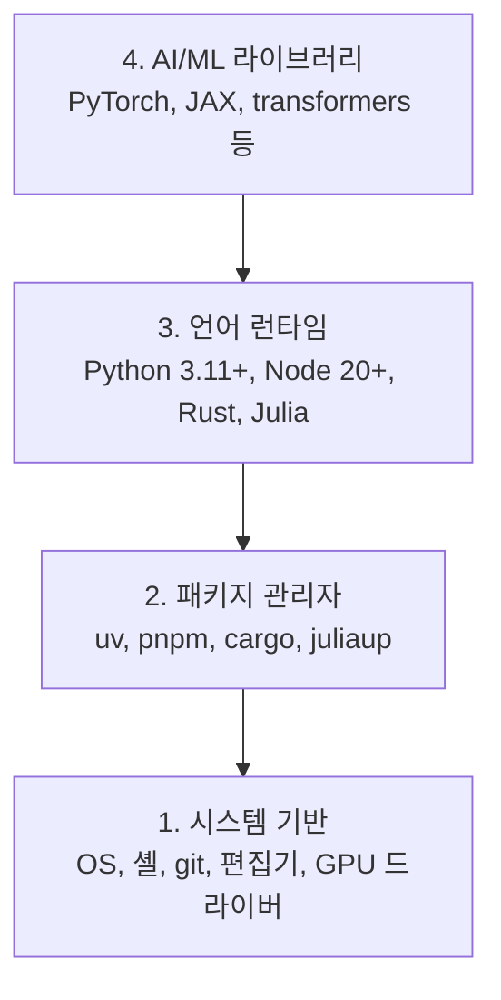

# 개발 환경

> 도구가 사고를 형성합니다. 한 번에, 제대로 설정하세요.

**유형:** 실습
**언어:** Python, Node.js, Rust
**선수 과목:** 없음
**소요 시간:** 약 45분

## 학습 목표

- Python 3.11+, Node.js 20+, Rust 도구 체인을 처음부터 설정
- 재현 가능한 빌드를 위한 가상 환경 및 패키지 관리자 구성
- CUDA/MPS로 GPU 접근을 확인하고 테스트 텐서 연산 실행
- 시스템, 패키지, 런타임, AI 라이브러리의 4계층 스택 이해

## 문제

Python, TypeScript, Rust, Julia를 사용하여 200개 이상의 레슨을 통해 AI 엔지니어링을 배우려고 합니다. 환경이 망가져 있으면, 모든 레슨이 학습 대신 도구와의 싸움이 됩니다.

대부분의 사람들은 환경 설정을 건너뜁니다. 그리고 나서 import 오류, 버전 충돌, 누락된 CUDA 드라이버를 디버깅하는 데 몇 시간을 씁니다. 우리는 이것을 한 번, 제대로 할 것입니다.

## 개념

AI 엔지니어링 환경은 네 가지 계층으로 구성됩니다:



아래에서 위로 설치합니다. 각 계층은 그 아래 계층에 의존합니다.

## 실습

### 1단계: 시스템 기반

시스템을 확인하고 기본 도구를 설치합니다.

```bash
# macOS
xcode-select --install
brew install git curl wget

# Ubuntu/Debian
sudo apt update && sudo apt install -y build-essential git curl wget

# Windows (WSL2 사용)
wsl --install -d Ubuntu-24.04
```

### 2단계: Python with uv

`uv`를 사용합니다 — pip보다 10-100배 빠르며 가상 환경을 자동으로 처리합니다.

```bash
curl -LsSf https://astral.sh/uv/install.sh | sh

uv python install 3.12

uv venv
source .venv/bin/activate  # Windows에서는 .venv\Scripts\activate

uv pip install numpy matplotlib jupyter
```

확인:

```python
import sys
print(f"Python {sys.version}")

import numpy as np
print(f"NumPy {np.__version__}")
a = np.array([1, 2, 3])
print(f"벡터: {a}, 자신과의 내적: {np.dot(a, a)}")
```

### 3단계: Node.js with pnpm

TypeScript 레슨(에이전트, MCP 서버, 웹 앱)을 위한 설정입니다.

```bash
curl -fsSL https://fnm.vercel.app/install | bash
fnm install 22
fnm use 22

npm install -g pnpm

node -e "console.log('Node', process.version)"
```

### 4단계: Rust

성능이 중요한 레슨(추론, 시스템)을 위한 설정입니다.

```bash
curl --proto '=https' --tlsv1.2 -sSf https://sh.rustup.rs | sh

rustc --version
cargo --version
```

### 5단계: Julia (선택 사항)

Julia가 빛을 발하는 수학 중심 레슨을 위한 설정입니다.

```bash
curl -fsSL https://install.julialang.org | sh

julia -e 'println("Julia ", VERSION)'
```

### 6단계: GPU 설정 (보유한 경우)

```bash
# NVIDIA
nvidia-smi

# CUDA와 함께 PyTorch 설치
uv pip install torch torchvision torchaudio --index-url https://download.pytorch.org/whl/cu124
```

```python
import torch
print(f"CUDA 사용 가능: {torch.cuda.is_available()}")
if torch.cuda.is_available():
    print(f"GPU: {torch.cuda.get_device_name(0)}")
```

GPU가 없나요? 문제 없습니다. 대부분의 레슨은 CPU에서 동작합니다. 훈련이 많은 레슨은 Google Colab이나 클라우드 GPU를 사용하세요.

### 7단계: 모두 확인

검증 스크립트를 실행하세요:

```bash
python phases/00-setup-and-tooling/01-dev-environment/code/verify.py
```

## 활용

이제 이 과정의 모든 레슨을 위한 환경이 준비되었습니다. 각 언어를 어디에서 사용하는지 정리하면:

| 언어 | 사용 위치 | 패키지 관리자 |
|----------|---------|-----------------|
| Python | 1-12단계 (ML, DL, NLP, Vision, Audio, LLMs) | uv |
| TypeScript | 13-17단계 (Tools, Agents, Swarms, Infra) | pnpm |
| Rust | 12, 15-17단계 (성능 중심 시스템) | cargo |
| Julia | 1단계 (수학 기초) | Pkg |

## 결과물

이 레슨은 누구나 실행하여 자신의 설정을 확인할 수 있는 검증 스크립트를 생성합니다.

AI 어시스턴트가 환경 문제를 진단하는 데 도움이 되는 프롬프트는 `outputs/prompt-env-check.md`를 참조하세요.

## 연습 문제

1. 검증 스크립트를 실행하고 모든 실패를 수정하세요
2. 이 과정을 위한 Python 가상 환경을 만들고 PyTorch를 설치하세요
3. 네 가지 언어 모두로 "hello world"를 작성하고 각각 실행하세요