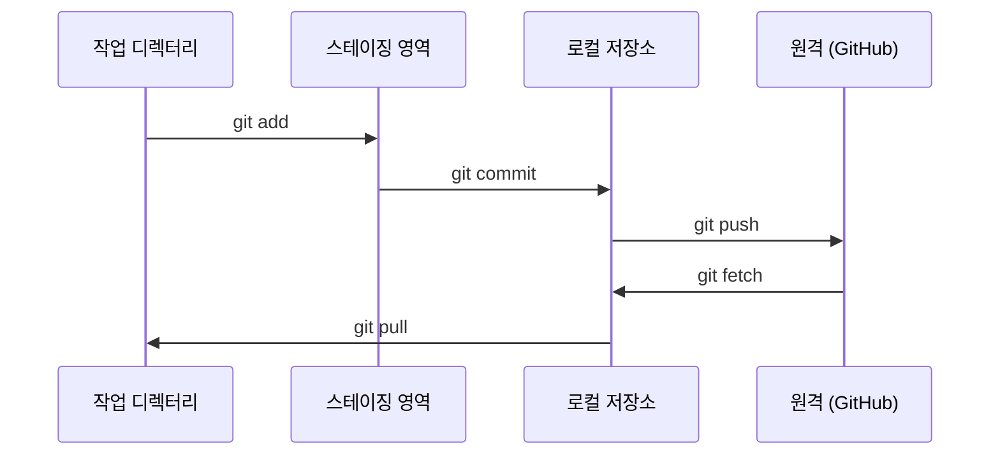

# Git & 협업

> 버전 관리는 선택이 아닙니다. 여기서 수행하는 모든 실험, 모든 모델, 모든 레슨이 추적됩니다.

**유형:** 학습
**언어:** --
**선수 과목:** 0단계, 01 레슨
**소요 시간:** 약 30분

## 학습 목표

- Git 신원을 구성하고 add, commit, push의 일상적인 워크플로우 사용
- 메인을 망가뜨리지 않고 격리된 실험을 위한 브랜치 생성 및 병합
- 모델 체크포인트와 대용량 바이너리 파일을 제외하는 `.gitignore` 작성
- `git log`로 커밋 히스토리를 탐색하여 프로젝트 발전 과정 이해

## 문제

20개 단계에 걸쳐 수백 개의 코드 파일을 작성하게 됩니다. 버전 관리 없이는 작업을 잃어버리고, 되돌릴 수 없는 것을 망가뜨리며, 다른 사람과 협업할 방법이 없습니다.

Git은 도구입니다. GitHub는 코드가 있는 곳입니다. 이 레슨은 이 과정에 필요한 것만 다룹니다.

## 개념



기억해야 할 세 가지:
1. 자주 저장하세요 (`git commit`)
2. 원격에 푸시하세요 (`git push`)
3. 실험은 브랜치에서 하세요 (`git checkout -b experiment`)

## 실습

### 1단계: Git 구성

```bash
git config --global user.name "Your Name"
git config --global user.email "you@example.com"
```

### 2단계: 일상적인 워크플로우

```bash
git status
git add file.py
git commit -m "퍼셉트론 구현 추가"
git push origin main
```

### 3단계: 실험을 위한 브랜치

```bash
git checkout -b experiment/new-optimizer

# ... 변경 사항 만들기, 커밋 ...

git checkout main
git merge experiment/new-optimizer
```

### 4단계: 이 과정 저장소 작업

```bash
git clone https://github.com/rohitg00/ai-engineering-from-scratch.git
cd ai-engineering-from-scratch

git checkout -b my-progress
# 레슨을 진행하며 코드를 커밋하세요
git push origin my-progress
```

## 활용

이 과정에서는 정확히 다음 명령어들이 필요합니다:

| 명령어 | 사용 시기 |
|---------|------|
| `git clone` | 과정 저장소 가져오기 |
| `git add` + `git commit` | 작업 저장하기 |
| `git push` | GitHub에 백업하기 |
| `git checkout -b` | 메인을 망가뜨리지 않고 무언가 시도하기 |
| `git log --oneline` | 작업한 내용 확인하기 |

이게 전부입니다. 이 과정에서는 rebase, cherry-pick, submodule이 필요하지 않습니다.

## 연습 문제

1. 이 저장소를 클론하고, `my-progress`라는 브랜치를 만들고, 파일을 하나 만들고, 커밋하고, 푸시하세요
2. 모델 체크포인트 파일(`.pt`, `.pth`, `.safetensors`)을 제외하는 `.gitignore`를 만드세요
3. `git log --oneline`으로 이 저장소의 커밋 히스토리를 보고 레슨이 어떻게 추가되었는지 읽어보세요

## 핵심 용어

| 용어 | 사람들이 말하는 것 | 실제 의미 |
|------|----------------|----------------------|
| 커밋 | "저장" | 특정 시점의 전체 프로젝트 스냅샷 |
| 브랜치 | "복사본" | 작업하면서 앞으로 이동하는 커밋에 대한 포인터 |
| 병합 | "코드 합치기" | 한 브랜치의 변경 사항을 다른 브랜치에 적용하는 것 |
| 원격 | "클라우드" | 다른 곳(GitHub, GitLab)에 호스팅된 저장소의 복사본 |