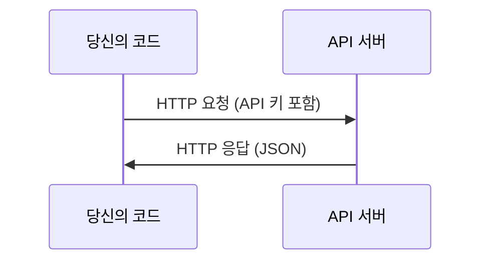

# API & 키

> 모든 AI API는 같은 방식으로 작동합니다: 요청을 보내고, 응답을 받습니다. 세부 사항은 바뀌지만, 패턴은 바뀌지 않습니다.

**유형:** 빌드
**언어:** Python, TypeScript
**선수 과목:** Phase 0, Lesson 01
**시간:** ~30분

## 학습 목표

- 환경 변수와 `.env` 파일을 사용하여 API 키를 안전하게 저장하기
- Anthropic Python SDK와 raw HTTP를 모두 사용하여 LLM API 호출하기
- 디버깅을 위해 SDK 기반과 raw HTTP 요청/응답 형식 비교하기
- 인증 및 속도 제한을 포함한 일반적인 API 오류 식별 및 처리하기

## 문제

Phase 11부터 LLM API(Anthropic, OpenAI, Google)를 호출하게 됩니다. Phase 13-16에서는 이러한 API를 루프로 사용하는 에이전트를 구축합니다. API 키의 작동 방식, 안전하게 저장하는 방법, 첫 API 호출 방법을 알아야 합니다.

## 개념



모든 API 호출에는 다음이 있습니다:
1. 엔드포인트 (URL)
2. API 키 (인증)
3. 요청 본문 (원하는 것)
4. 응답 본문 (돌려받는 것)

## 빌드하기

### 1단계: API 키 안전하게 저장

절대 API 키를 코드에 넣지 마세요. 환경 변수를 사용하세요.

```bash
export ANTHROPIC_API_KEY="sk-ant-..."
export OPENAI_API_KEY="sk-..."
```

또는 `.env` 파일을 사용하세요 (`.gitignore`에 추가):

```
ANTHROPIC_API_KEY=sk-ant-...
OPENAI_API_KEY=sk-...
```

### 2단계: 첫 API 호출 (Python)

```python
import anthropic

client = anthropic.Anthropic()

response = client.messages.create(
    model="claude-sonnet-4-20250514",
    max_tokens=256,
    messages=[{"role": "user", "content": "신경망이란 무엇인가요? 한 문장으로 설명해 주세요."}]
)

print(response.content[0].text)
```

### 3단계: 첫 API 호출 (TypeScript)

```typescript
import Anthropic from "@anthropic-ai/sdk";

const client = new Anthropic();

const response = await client.messages.create({
  model: "claude-sonnet-4-20250514",
  max_tokens: 256,
  messages: [{ role: "user", content: "신경망이란 무엇인가요? 한 문장으로 설명해 주세요." }],
});

console.log(response.content[0].text);
```

### 4단계: Raw HTTP (SDK 없이)

```python
import os
import urllib.request
import json

url = "https://api.anthropic.com/v1/messages"
headers = {
    "Content-Type": "application/json",
    "x-api-key": os.environ["ANTHROPIC_API_KEY"],
    "anthropic-version": "2023-06-01",
}
body = json.dumps({
    "model": "claude-sonnet-4-20250514",
    "max_tokens": 256,
    "messages": [{"role": "user", "content": "신경망이란 무엇인가요? 한 문장으로 설명해 주세요."}],
}).encode()

req = urllib.request.Request(url, data=body, headers=headers, method="POST")
with urllib.request.urlopen(req) as resp:
    result = json.loads(resp.read())
    print(result["content"][0]["text"])
```

이것이 SDK가 내부적으로 하는 일입니다. raw HTTP 호출을 이해하면 디버깅에 도움이 됩니다.

## 활용하기

이 과정에서:

| API | 필요한 시기 | 무료 티어 |
|-----|-----------|----------|
| Anthropic (Claude) | Phase 11-16 (에이전트, 도구) | 가입 시 $5 크레딧 |
| OpenAI | Phase 11 (비교) | 가입 시 $5 크레딧 |
| Hugging Face | Phase 4-10 (모델, 데이터셋) | 무료 |

지금 모두 필요한 것은 아닙니다. 레슨에서 필요할 때 설정하세요.

## 배포하기

이 레슨이 생성하는 것:
- `outputs/prompt-api-troubleshooter.md` - 일반적인 API 오류 진단

## 연습 문제

1. Anthropic API 키를 받아 첫 API 호출을 해보세요
2. Raw HTTP 버전을 시도하고 응답 형식을 SDK 버전과 비교하세요
3. 의도적으로 잘못된 API 키를 사용하고 오류 메시지를 읽어보세요

## 주요 용어

| 용어 | 사람들이 말하는 것 | 실제 의미 |
|------|-------------------|----------|
| API 키 | "API 비밀번호" | 계정을 식별하고 요청을 승인하는 고유 문자열 |
| 속도 제한 | "스로틀링 걸렸어" | 남용 방지와 공정한 사용을 위한 분당/시간당 최대 요청 수 |
| 토큰 | "단어" (API 맥락에서) | 과금 단위: 입력과 출력 토큰이 별도로 계산되고 청구됨 |
| 스트리밍 | "실시간 응답" | 전체 응답을 기다리는 대신 단어별로 응답 받기 |