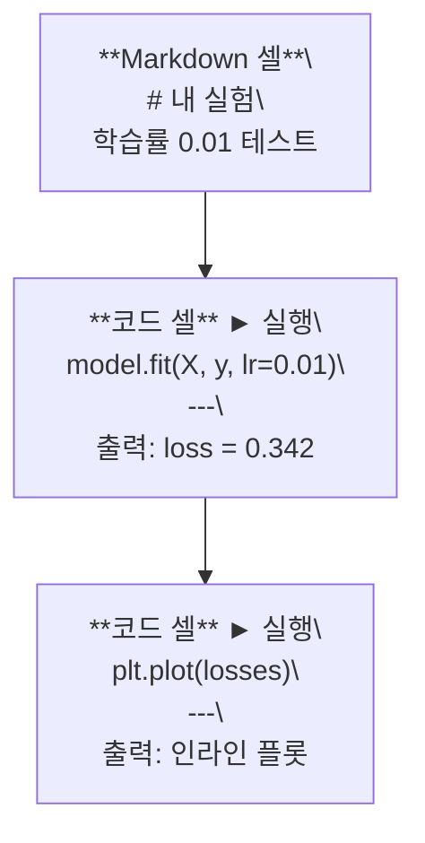
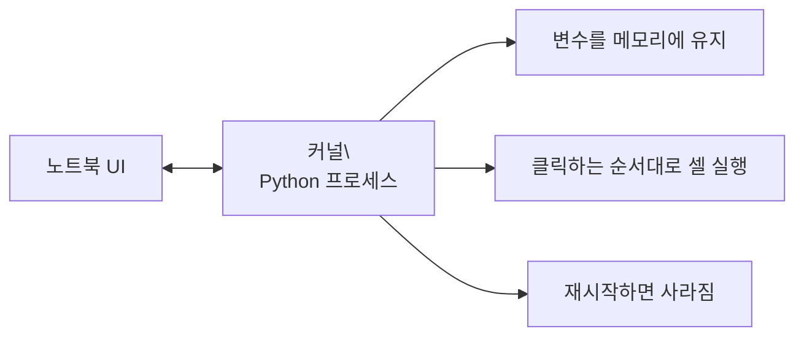

# Jupyter 노트북

> 노트북은 AI 엔지니어링의 실험대입니다. 여기서 프로토타입을 만들고, 작동하는 것을 프로덕션으로 옮깁니다.

**유형:** 빌드
**언어:** Python
**선수 과목:** Phase 0, Lesson 01
**시간:** ~30분

## 학습 목표

- JupyterLab, Jupyter Notebook, 또는 Jupyter 확장이 있는 VS Code를 설치하고 실행하기
- 매직 명령어(`%timeit`, `%%time`, `%matplotlib inline`)를 사용하여 인라인으로 벤치마킹 및 시각화하기
- 노트북과 스크립트를 구분하고 "노트북에서 탐색, 스크립트로 배포" 워크플로우 적용하기
- 순서가 뒤바뀐 실행, 숨겨진 상태, 메모리 누수와 같은 일반적인 노트북 함정 식별하고 피하기

## 문제

모든 AI 논문, 튜토리얼, Kaggle 대회는 Jupyter 노트북을 사용합니다. 노트북은 코드를 조각으로 실행하고, 출력을 인라인으로 보고, 코드와 설명을 혼합하고, 빠르게 반복할 수 있게 해줍니다. 노트북 없이 AI를 배우려고 하면, 연습장 없이 수학 숙제를 하는 것과 같습니다.

하지만 노트북에는 실제 함정이 있습니다. 사람들은 노트북이 잘 못하는 용도까지 포함해 모든 것에 사용합니다. 언제 노트북을 사용하고 언제 스크립트를 사용해야 하는지 알면 나중에 디버깅 악몽을 피할 수 있습니다.

## 개념

노트북은 셀의 목록입니다. 각 셀은 코드이거나 텍스트입니다.



커널은 백그라운드에서 실행되는 Python 프로세스입니다. 셀을 실행하면 코드가 커널로 전송되고, 커널이 이를 실행하여 결과를 반환합니다. 모든 셀이 동일한 커널을 공유하므로 변수가 셀 간에 유지됩니다.



"클릭하는 순서대로"라는 부분이 강력한 기능인 동시에 위험 요소입니다.

## 빌드하기

### 1단계: 인터페이스 선택

세 가지 옵션, 하나의 형식:

| 인터페이스 | 설치 | 최적 용도 |
|-----------|------|----------|
| JupyterLab | `pip install jupyterlab` 후 `jupyter lab` | 완전한 IDE 경험, 다중 탭, 파일 탐색기, 터미널 |
| Jupyter Notebook | `pip install notebook` 후 `jupyter notebook` | 간단하고 가벼움, 한 번에 하나의 노트북 |
| VS Code | "Jupyter" 확장 설치 | 이미 사용 중인 에디터, git 통합, 디버깅 |

세 가지 모두 동일한 `.ipynb` 파일을 읽고 씁니다. 원하는 것을 선택하세요. JupyterLab이 AI 작업에서 가장 일반적입니다.

```bash
pip install jupyterlab
jupyter lab
```

### 2단계: 중요한 키보드 단축키

두 가지 모드로 작동합니다. `Escape`는 명령 모드(왼쪽에 파란색 바), `Enter`는 편집 모드(녹색 바)입니다.

**명령 모드 (가장 많이 사용):**

| 키 | 동작 |
|-----|------|
| `Shift+Enter` | 셀 실행, 다음으로 이동 |
| `A` | 위에 셀 삽입 |
| `B` | 아래에 셀 삽입 |
| `DD` | 셀 삭제 |
| `M` | 마크다운으로 변환 |
| `Y` | 코드로 변환 |
| `Z` | 셀 작업 취소 |
| `Ctrl+Shift+H` | 모든 단축키 표시 |

**편집 모드:**

| 키 | 동작 |
|-----|------|
| `Tab` | 자동 완성 |
| `Shift+Tab` | 함수 시그니처 표시 |
| `Ctrl+/` | 주석 토글 |

`Shift+Enter`는 하루에 수천 번 사용할 것입니다. 먼저 이것부터 익히세요.

### 3단계: 셀 유형

**코드 셀**은 Python을 실행하고 출력을 표시합니다:

```python
import numpy as np
data = np.random.randn(1000)
data.mean(), data.std()
```

출력: `(0.0032, 0.9987)`

**마크다운 셀**은 서식 있는 텍스트를 렌더링합니다. 무엇을 하고 있는지, 왜 하는지 문서화하는 데 사용하세요. 헤더, 굵게, 기울임, LaTeX 수식(`$E = mc^2$`), 표, 이미지를 지원합니다.

### 4단계: 매직 명령어

이것들은 Python이 아닙니다. `%`(라인 매직) 또는 `%%`(셀 매직)로 시작하는 Jupyter 특정 명령어입니다.

**코드 시간 측정:**

```python
%timeit np.random.randn(10000)
```

출력: `45.2 us +/- 1.3 us per loop`

```python
%%time
model.fit(X_train, y_train, epochs=10)
```

출력: `Wall time: 2.34 s`

`%timeit`는 코드를 여러 번 실행하고 평균을 냅니다. `%%time`은 한 번만 실행합니다. 마이크로벤치마크에는 `%timeit`를, 훈련 실행에는 `%%time`을 사용하세요.

**인라인 플롯 활성화:**

```python
%matplotlib inline
```

이제 모든 `plt.plot()` 또는 `plt.show()`가 노트북에서 직접 렌더링됩니다.

**노트북을 떠나지 않고 패키지 설치:**

```python
!pip install scikit-learn
```

`!` 접두사는 모든 셸 명령을 실행합니다.

**환경 변수 확인:**

```python
%env CUDA_VISIBLE_DEVICES
```

### 5단계: 풍부한 출력 인라인 표시

노트북은 셀의 마지막 표현식을 자동으로 표시합니다. 하지만 제어할 수 있습니다:

```python
import pandas as pd

df = pd.DataFrame({
    "model": ["Linear", "Random Forest", "Neural Net"],
    "accuracy": [0.72, 0.89, 0.94],
    "training_time": [0.1, 2.3, 45.6]
})
df
```

이것은 텍스트 덤프가 아닌 서식 있는 HTML 테이블을 렌더링합니다. 플롯도 마찬가지입니다:

```python
import matplotlib.pyplot as plt

plt.figure(figsize=(8, 4))
plt.plot([1, 2, 3, 4], [1, 4, 2, 3])
plt.title("인라인 플롯")
plt.show()
```

플롯이 셀 바로 아래에 나타납니다. 이것이 AI 작업에서 노트북이 지배적인 이유입니다. 데이터, 플롯, 코드를 함께 볼 수 있습니다.

이미지의 경우:

```python
from IPython.display import Image, display
display(Image(filename="architecture.png"))
```

### 6단계: Google Colab

Colab은 클라우드의 무료 Jupyter 노트북입니다. GPU, 사전 설치된 라이브러리, Google Drive 통합을 제공합니다. 설정이 필요 없습니다.

1. [colab.research.google.com](https://colab.research.google.com)으로 이동
2. 이 과정의 모든 `.ipynb` 파일 업로드
3. 런타임 > 런타임 유형 변경 > T4 GPU (무료)

Colab과 로컬 Jupyter의 차이점:
- 파일이 세션 간에 유지되지 않음 (Drive에 저장하거나 다운로드)
- 사전 설치: numpy, pandas, matplotlib, torch, tensorflow, sklearn
- `from google.colab import files`로 파일 업로드/다운로드
- `from google.colab import drive; drive.mount('/content/drive')`로 영구 저장소 사용
- 세션이 비활성 90분 후 타임아웃 (무료 티어)

## 활용하기

### 노트북 vs 스크립트: 언제 무엇을 사용할까

| 노트북 사용 | 스크립트 사용 |
|-----------|-----------|
| 데이터셋 탐색 | 훈련 파이프라인 |
| 모델 프로토타이핑 | 재사용 가능한 유틸리티 |
| 결과 시각화 | `if __name__`이 있는 모든 것 |
| 작업 설명 | 일정에 따라 실행되는 코드 |
| 빠른 실험 | 프로덕션 코드 |
| 과정 연습 문제 | 패키지와 라이브러리 |

규칙: **노트북에서 탐색하고, 스크립트로 배포하세요**.

AI에서 일반적인 워크플로우:
1. 노트북에서 데이터 탐색
2. 노트북에서 모델 프로토타이핑
3. 작동하면 코드를 `.py` 파일로 이동
4. 추가 실험을 위해 `.py` 파일을 노트북으로 다시 임포트

### 일반적인 함정

**순서가 뒤바뀐 실행.** 셀 5, 셀 2, 셀 7 순서로 실행합니다. 노트북은 당신의 컴퓨터에서는 작동하지만, 누군가 위에서 아래로 실행하면 깨집니다. 해결: 공유하기 전에 커널 > 재시작 및 모두 실행.

**숨겨진 상태.** 셀을 삭제했지만 생성된 변수는 여전히 메모리에 있습니다. 노트북은 깔끔해 보이지만 유령 셀에 의존합니다. 해결: 정기적으로 커널 재시작.

**메모리 누수.** 4GB 데이터셋 로드, 모델 훈련, 다른 데이터셋 로드. 아무것도 해제되지 않습니다. 해결: `del variable_name` 및 `gc.collect()`, 또는 커널 재시작.

## 배포하기

이 레슨이 생성하는 것:
- `outputs/prompt-notebook-helper.md` - 노트북 문제 디버깅용

## 연습 문제

1. JupyterLab을 열고, 노트북을 만들고, `%timeit`를 사용하여 100,000개의 난수 배열을 만드는 list comprehension과 numpy를 비교하세요
2. 마크다운과 코드 셀이 모두 있는 노트북을 만들어 CSV를 로드하고, 데이터프레임을 표시하고, 차트를 그리세요. 그런 다음 커널 > 재시작 및 모두 실행으로 위에서 아래로 작동하는지 확인하세요
3. `code/notebook_tips.py`의 코드를 Colab 노트북에 붙여넣고 무료 GPU로 실행하세요

## 주요 용어

| 용어 | 사람들이 말하는 것 | 실제 의미 |
|------|-------------------|----------|
| 커널 | "내 코드를 실행하는 것" | 셀을 실행하고 변수를 메모리에 유지하는 별도의 Python 프로세스 |
| 셀 | "코드 블록" | 노트북에서 독립적으로 실행 가능한 단위, 코드 또는 마크다운 |
| 매직 명령 | "Jupyter 트릭" | `%` 또는 `%%`로 시작하는 노트북 환경을 제어하는 특수 명령 |
| `.ipynb` | "노트북 파일" | 셀, 출력, 메타데이터를 포함하는 JSON 파일. IPython Notebook의 약자 |

## 더 읽을거리

- [JupyterLab 문서](https://jupyterlab.readthedocs.io/) - 전체 기능 세트
- [Google Colab FAQ](https://research.google.com/colaboratory/faq.html) - Colab 관련 제한 및 기능
- [28가지 Jupyter 노트북 팁](https://www.dataquest.io/blog/jupyter-notebook-tips-tricks-shortcuts/) - 파워 유저 단축키