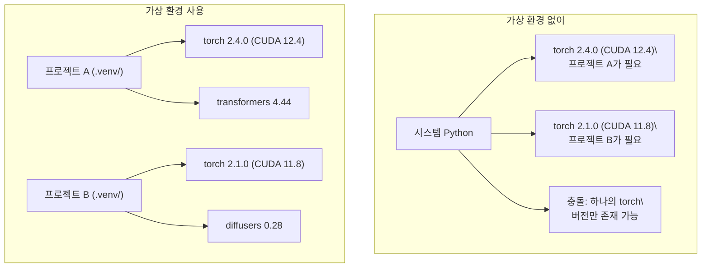

# Python 환경

> 의존성 지옥은 실재합니다. 가상 환경이 그 해결책입니다.

**유형:** 빌드
**언어:** Shell
**선수 과목:** Phase 0, Lesson 01
**시간:** ~30분

## 학습 목표

- `uv`, `venv`, `conda`를 사용하여 격리된 가상 환경 만들기
- 선택적 의존성 그룹이 있는 `pyproject.toml`을 작성하고 재현성을 위한 락파일 생성하기
- 전역 설치, pip/conda 혼합, CUDA 버전 불일치와 같은 일반적인 함정 진단 및 수정하기
- 충돌하는 의존성이 있는 프로젝트를 위한 단계별 환경 전략 구현하기

## 문제

파인튜닝 프로젝트를 위해 PyTorch 2.4를 설치합니다. 다음 주에 다른 프로젝트에서 CUDA 빌드가 고정된 PyTorch 2.1이 필요합니다. 전역으로 업그레이드하면 첫 번째 프로젝트가 깨집니다. 다운그레이드하면 두 번째 프로젝트가 깨집니다.

이것이 의존성 지옥입니다. AI/ML 작업에서 지속적으로 발생하는 이유는:

- PyTorch, JAX, TensorFlow가 각각 자체 CUDA 바인딩을 제공
- 모델 라이브러리가 특정 프레임워크 버전을 고정
- 전역 `pip install`이 이전에 있던 것을 덮어씀
- CUDA 11.8 빌드는 CUDA 12.x 드라이버에서 작동하지 않음 (그 반대도 마찬가지)

해결책: 모든 프로젝트는 자체 패키지가 있는 자체 격리된 환경을 가집니다.

## 개념



## 빌드하기

### 옵션 1: uv venv (권장)

`uv`는 가장 빠른 Python 패키지 관리자입니다 (pip보다 10-100배 빠름). 가상 환경, Python 버전, 의존성 해결을 하나의 도구로 처리합니다.

```bash
curl -LsSf https://astral.sh/uv/install.sh | sh

uv python install 3.12

cd your-project
uv venv
source .venv/bin/activate
```

패키지 설치:

```bash
uv pip install torch numpy
```

한 단계로 `pyproject.toml`이 있는 프로젝트 생성:

```bash
uv init my-ai-project
cd my-ai-project
uv add torch numpy matplotlib
```

### 옵션 2: venv (내장)

`uv`를 설치할 수 없는 경우, Python에는 `venv`가 포함되어 있습니다:

```bash
python3 -m venv .venv
source .venv/bin/activate  # Linux/macOS
.venv\\Scripts\\activate     # Windows

pip install torch numpy
```

`uv`보다 느리지만 Python이 설치된 모든 곳에서 작동합니다.

### 옵션 3: conda (필요한 경우)

Conda는 CUDA 툴킷, cuDNN, C 라이브러리와 같은 비 Python 의존성을 관리합니다. 다음 경우에 사용하세요:

- 시스템 전체에 설치하지 않고 특정 CUDA 툴킷 버전이 필요할 때
- 시스템 패키지를 설치할 수 없는 공유 클러스터에 있을 때
- 라이브러리 설치 지침에 "conda 사용"이라고 되어 있을 때

```bash
# miniconda 설치 (전체 Anaconda가 아님)
curl -LsSf https://repo.anaconda.com/miniconda/Miniconda3-latest-Linux-x86_64.sh -o miniconda.sh
bash miniconda.sh -b

conda create -n myproject python=3.12
conda activate myproject

conda install pytorch torchvision torchaudio pytorch-cuda=12.4 -c pytorch -c nvidia
```

한 가지 규칙: 환경에 conda를 사용한다면 해당 환경의 모든 패키지에 conda를 사용하세요. conda 환경에 `pip install`을 혼합하면 디버깅하기 어려운 의존성 충돌이 발생합니다.

### 이 과정을 위한: 단계별 전략

전체 과정을 위한 하나의 환경을 만들 수 있습니다. 하지 마세요. 서로 다른 페이즈는 서로 다른(때로는 충돌하는) 의존성이 필요합니다.

전략:

```
ai-engineering-from-scratch/
├── .venv/                    <-- phase 0-3용 공유 경량 환경
├── phases/
│   ├── 04-neural-networks/
│   │   └── .venv/            <-- PyTorch 환경
│   ├── 05-cnns/
│   │   └── .venv/            <-- 동일한 PyTorch 환경 (심링크 또는 공유)
│   ├── 08-transformers/
│   │   └── .venv/            <-- 다른 transformer 버전이 필요할 수 있음
│   └── 11-llm-apis/
│       └── .venv/            <-- API SDK, torch 불필요
```

`code/env_setup.sh`의 스크립트가 이 과정의 기본 환경을 생성합니다.

## pyproject.toml 기초

모든 Python 프로젝트에는 `pyproject.toml`이 있어야 합니다. `setup.py`, `setup.cfg`, `requirements.txt`를 하나의 파일로 대체합니다.

```toml
[project]
name = "ai-engineering-from-scratch"
version = "0.1.0"
requires-python = ">=3.11"
dependencies = [
    "numpy>=1.26",
    "matplotlib>=3.8",
    "jupyter>=1.0",
    "scikit-learn>=1.4",
]

[project.optional-dependencies]
torch = ["torch>=2.3", "torchvision>=0.18"]
llm = ["anthropic>=0.39", "openai>=1.50"]
```

그런 다음 설치:

```bash
uv pip install -e ".[torch]"    # 기본 + PyTorch
uv pip install -e ".[llm]"     # 기본 + LLM SDK
uv pip install -e ".[torch,llm]" # 전부
```

## 락파일

락파일은 모든 의존성(전이적 의존성 포함)을 정확한 버전으로 고정합니다. 이는 재현성을 보장합니다: 락파일에서 설치하는 모든 사람이 정확히 동일한 패키지를 받습니다.

```bash
# uv는 uv add 사용 시 자동으로 uv.lock 생성
uv add numpy

# pip-tools 접근 방식
uv pip compile pyproject.toml -o requirements.lock
uv pip install -r requirements.lock
```

락파일을 git에 커밋하세요. 누군가 저장소를 클론하면 락파일에서 설치하여 동일한 버전을 받습니다.

## 일반적인 실수

### 1. 전역으로 설치

```bash
pip install torch  # 나쁨: 시스템 Python에 설치

source .venv/bin/activate
pip install torch  # 좋음: 가상 환경에 설치
```

패키지가 어디로 가는지 확인:

```bash
which python       # /usr/bin/python이 아닌 .venv/bin/python을 표시해야 함
which pip           # .venv/bin/pip을 표시해야 함
```

### 2. pip과 conda 혼합

```bash
conda create -n myenv python=3.12
conda activate myenv
conda install pytorch -c pytorch
pip install some-other-package   # 나쁨: conda의 의존성 추적을 깨뜨릴 수 있음
conda install some-other-package # 좋음: conda가 모든 것을 관리
```

conda 내에서 pip을 사용해야 한다면 (일부 패키지는 pip 전용), 모든 conda 패키지를 먼저 설치한 다음 pip 패키지를 마지막에 설치하세요.

### 3. 활성화 깜빡하기

```bash
python train.py           # 시스템 Python 사용, 패키지 누락
source .venv/bin/activate
python train.py           # 프로젝트 Python 사용, 패키지 발견
```

셸 프롬프트에 환경 이름이 표시되어야 합니다:

```
(.venv) $ python train.py
```

### 4. .venv를 git에 커밋

```bash
echo ".venv/" >> .gitignore
```

가상 환경은 200MB-2GB입니다. 로컬이며 머신 간에 이식할 수 없습니다. 대신 `pyproject.toml`과 락파일을 커밋하세요.

### 5. CUDA 버전 불일치

```bash
nvidia-smi                # 드라이버 CUDA 버전 표시 (예: 12.4)
python -c "import torch; print(torch.version.cuda)"  # PyTorch CUDA 버전 표시

# 이들은 호환되어야 합니다.
# PyTorch CUDA 버전은 <= 드라이버 CUDA 버전이어야 합니다.
```

## 활용하기

설정 스크립트를 실행하여 과정 환경을 만드세요:

```bash
bash phases/00-setup-and-tooling/06-python-environments/code/env_setup.sh
```

이것은 저장소 루트에 `.venv`를 만들고 핵심 의존성을 설치하고 검증합니다.

## 연습 문제

1. `env_setup.sh`를 실행하고 모든 검사가 통과하는지 확인하세요
2. 두 번째 가상 환경을 만들고, 다른 버전의 numpy를 설치하고, 두 환경이 격리되었는지 확인하세요
3. PyTorch와 Anthropic SDK가 모두 필요한 프로젝트의 `pyproject.toml`을 작성하세요
4. 의도적으로 패키지를 전역으로 설치하고(venv 활성화 없이), 어디로 가는지 확인한 다음 제거하세요

## 주요 용어

| 용어 | 사람들이 말하는 것 | 실제 의미 |
|------|-------------------|----------|
| 가상 환경 | "venv" | 시스템 Python과 분리된, Python 인터프리터와 패키지를 포함하는 격리된 디렉토리 |
| 락파일 | "고정된 의존성" | 모든 패키지와 정확한 버전을 나열하여 머신 간 동일한 설치를 보장하는 파일 |
| pyproject.toml | "새로운 setup.py" | setup.py/setup.cfg/requirements.txt를 대체하는 표준 Python 프로젝트 구성 파일 |
| 전이적 의존성 | "의존성의 의존성" | 패키지 B가 C에 의존; A를 설치할 때 A는 B에 의존하고, C는 A의 전이적 의존성 |
| CUDA 불일치 | "내 GPU가 작동하지 않아요" | PyTorch가 GPU 드라이버가 지원하는 것과 다른 CUDA 버전으로 컴파일됨 |