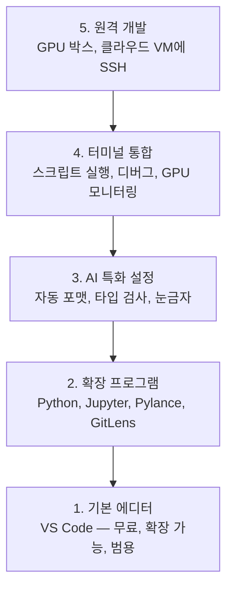

# 에디터 설정

> 에디터는 당신의 부조종사입니다. 한 번만 구성해서 방해되지 않고 제 역할을 하도록 만드세요.

**유형:** 빌드
**언어:** --
**선수 과목:** Phase 0, Lesson 01
**시간:** ~20분

## 학습 목표

- Python, Jupyter, 린팅, 원격 SSH를 위한 필수 확장 프로그램이 포함된 VS Code 설치하기
- AI 워크플로우를 위해 저장 시 자동 포맷, 타입 검사, 노트북 출력 스크롤 구성하기
- 원격 GPU 머신에서 마치 로컬인 것처럼 코드를 편집하고 디버깅할 수 있도록 Remote SSH 설정하기
- AI 작업을 위한 에디터 대안(Cursor, Windsurf, Neovim)과 그 트레이드오프 평가하기

## 문제

Python 작성, 노트북 실행, 훈련 루프 디버깅, GPU 박스에 SSH 접속 등 에디터 안에서 수천 시간을 보내게 됩니다. 잘못 구성된 에디터는 모든 세션을 마찰로 만듭니다: 자동 완성 없음, 타입 힌트 없음, 인라인 오류 없음, 수동 포맷팅, 투박한 터미널 워크플로우.

올바른 설정은 20분 걸립니다. 건너뛰면 매일 20분씩 손해봅니다.

## 개념

AI 엔지니어링 에디터 설정에는 다섯 가지가 필요합니다:



## 빌드하기

### 1단계: VS Code 설치

VS Code가 권장 에디터입니다. 무료이고, 모든 OS에서 실행되며, 최고 수준의 Jupyter 노트북 지원을 제공하고, 확장 프로그램 생태계가 AI 작업에 필요한 모든 것을 다룹니다.

[code.visualstudio.com](https://code.visualstudio.com/)에서 다운로드하세요.

터미널에서 확인:

```bash
code --version
```

macOS에서 `code`를 찾을 수 없는 경우, VS Code를 열고 `Cmd+Shift+P`를 누르고 "Shell Command"를 입력한 다음 "PATH에 'code' 명령 설치"를 선택하세요.

### 2단계: 필수 확장 프로그램 설치

VS Code에서 통합 터미널을 열고(`` Ctrl+` `` 또는 `` Cmd+` ``) AI 작업에 중요한 확장 프로그램을 설치하세요:

```bash
code --install-extension ms-python.python
code --install-extension ms-python.vscode-pylance
code --install-extension ms-toolsai.jupyter
code --install-extension eamodio.gitlens
code --install-extension ms-vscode-remote.remote-ssh
code --install-extension ms-python.debugpy
code --install-extension ms-python.black-formatter
code --install-extension charliermarsh.ruff
```

각각의 역할:

| 확장 프로그램 | 이유 |
|------------|-----|
| Python | 언어 지원, 가상 환경 감지, 실행/디버그 |
| Pylance | 빠른 타입 검사, 자동 완성, 임포트 해결 |
| Jupyter | VS Code 내에서 노트북 실행, 변수 탐색기 |
| GitLens | 누가 무엇을 변경했는지 확인, 인라인 git blame |
| Remote SSH | 원격 GPU 박스의 폴더를 로컬처럼 열기 |
| Debugpy | Python용 단계별 디버깅 |
| Black Formatter | 저장 시 자동 포맷, 일관된 스타일 |
| Ruff | 빠른 린팅, 일반적인 실수 감지 |

이 레슨의 `code/.vscode/extensions.json` 파일에 전체 권장 목록이 포함되어 있습니다. 프로젝트 폴더를 열면 VS Code가 설치를 제안합니다.

### 3단계: 설정 구성

이 레슨의 `code/.vscode/settings.json`에서 설정을 복사하거나 `설정 > 설정 열기 (JSON)`을 통해 수동으로 적용하세요.

AI 작업을 위한 주요 설정:

```jsonc
{
    "python.analysis.typeCheckingMode": "basic",
    "editor.formatOnSave": true,
    "editor.rulers": [88, 120],
    "notebook.output.scrolling": true,
    "files.autoSave": "afterDelay"
}
```

이것들이 중요한 이유:

- **Basic 타입 검사**: 실행하기 전에 잘못된 인수 타입을 잡아냅니다. 텐서 형태 불일치와 잘못된 API 매개변수 디버깅 시간을 절약합니다.
- **저장 시 포맷**: 포맷팅에 대해 다시 생각할 필요가 없습니다. Black이 처리합니다.
- **88과 120 눈금자**: Black은 88에서 줄바꿈합니다. 120 마커는 독스트링과 주석이 너무 길어질 때 표시합니다.
- **노트북 출력 스크롤**: 훈련 루프는 수천 줄을 출력합니다. 스크롤 없이는 출력 패널이 폭발합니다.
- **자동 저장**: 저장하는 것을 잊게 됩니다. 훈련 스크립트가 오래된 코드를 실행합니다. 자동 저장이 이를 방지합니다.

### 4단계: 터미널 통합

VS Code의 통합 터미널은 훈련 스크립트를 실행하고, GPU를 모니터링하고, 환경을 관리하는 곳입니다.

적절히 설정하세요:

```jsonc
{
    "terminal.integrated.defaultProfile.osx": "zsh",
    "terminal.integrated.defaultProfile.linux": "bash",
    "terminal.integrated.fontSize": 13,
    "terminal.integrated.scrollback": 10000
}
```

유용한 단축키:

| 동작 | macOS | Linux/Windows |
|------|-------|---------------|
| 터미널 토글 | `` Ctrl+` `` | `` Ctrl+` `` |
| 새 터미널 | `` Ctrl+Shift+` `` | `` Ctrl+Shift+` `` |
| 터미널 분할 | `Cmd+\` | `Ctrl+\` |

분할 터미널이 유용합니다: 하나는 스크립트 실행용, 하나는 `nvidia-smi -l 1` 또는 `watch -n 1 nvidia-smi`로 GPU 모니터링용.

### 5단계: 원격 개발 (GPU 박스에 SSH)

이것은 AI 작업에서 가장 중요한 확장 프로그램입니다. 원격 머신(클라우드 VM, 연구실 서버, Lambda, Vast.ai)에서 훈련을 실행하게 됩니다. Remote SSH는 모든 것이 로컬인 것처럼 원격 파일 시스템을 열고, 파일을 편집하고, 터미널을 실행하고, 디버깅할 수 있게 해줍니다.

설정:

1. Remote SSH 확장 프로그램 설치 (2단계에서 완료).
2. `Ctrl+Shift+P`(또는 `Cmd+Shift+P`)를 누르고 "Remote-SSH: Connect to Host" 입력.
3. `user@your-gpu-box-ip` 입력.
4. VS Code가 원격 머신에 서버 구성 요소를 자동으로 설치합니다.

비밀번호 없는 접근을 위해 SSH 키 설정:

```bash
ssh-keygen -t ed25519 -C "your-email@example.com"
ssh-copy-id user@your-gpu-box-ip
```

편의를 위해 `~/.ssh/config`에 호스트 추가:

```
Host gpu-box
    HostName 203.0.113.50
    User ubuntu
    IdentityFile ~/.ssh/id_ed25519
    ForwardAgent yes
```

이제 `Remote-SSH: Connect to Host > gpu-box`로 즉시 연결됩니다.

## 대안

### Cursor

[cursor.com](https://cursor.com)은 내장 AI 코드 생성 기능이 있는 VS Code 포크입니다. 동일한 확장 생태계와 설정 형식을 사용합니다. Cursor를 사용한다면 이 레슨의 모든 내용이 여전히 적용됩니다. 동일한 `settings.json`과 `extensions.json`을 가져오세요.

### Windsurf

[windsurf.com](https://windsurf.com)은 또 다른 AI 우선 VS Code 포크입니다. 동일한 확장 프로그램, 동일한 설정 형식, 동일한 Remote SSH 지원.

### Vim/Neovim

이미 Vim이나 Neovim을 사용 중이고 생산적이라면 그대로 사용하세요. AI Python 작업을 위한 최소 설정:

- **pyright** 또는 **pylsp** — 타입 검사 (Mason 또는 수동 설치)
- **nvim-lspconfig** — 언어 서버 통합
- **jupyter-vim** 또는 **molten-nvim** — 노트북 유사 실행
- **telescope.nvim** — 파일/심볼 검색
- **none-ls.nvim** + black + ruff — 포맷팅/린팅

아직 Vim을 사용하지 않는다면 지금 시작하지 마세요. 학습 곡선이 AI 엔지니어링 학습과 경쟁합니다. VS Code를 사용하세요.

## 활용하기

이 설정으로 일상 워크플로우는 다음과 같습니다:

1. VS Code에서 프로젝트 폴더 열기 (또는 Remote SSH로 GPU 박스에 연결).
2. 자동 완성, 타입 힌트, 인라인 오류가 있는 에디터에서 Python 작성.
3. Jupyter 확장 프로그램으로 인라인 Jupyter 노트북 실행.
4. 통합 터미널을 사용하여 훈련 스크립트, `uv pip install`, GPU 모니터링.
5. 커밋하기 전에 GitLens로 변경 사항 검토.

## 연습 문제

1. VS Code와 2단계에 나열된 모든 확장 프로그램 설치하기
2. 이 레슨의 `settings.json`을 VS Code 구성에 복사하기
3. Python 파일을 열고 Pylance가 타입 힌트를 표시하고 Black이 저장 시 포맷하는지 확인하기
4. 원격 머신에 접근할 수 있다면 Remote SSH를 설정하고 폴더 열기

## 주요 용어

| 용어 | 사람들이 말하는 것 | 실제 의미 |
|------|-------------------|----------|
| LSP | "자동 완성 엔진" | Language Server Protocol: 에디터가 언어별 서버에서 타입 정보, 완성, 진단을 얻기 위한 표준 |
| Pylance | "Python 플러그인" | 타입 검사와 IntelliSense를 위해 Pyright를 사용하는 Microsoft의 Python 언어 서버 |
| Remote SSH | "서버에서 작업하기" | 원격 머신에서 경량 서버를 실행하고 UI를 로컬 에디터로 스트리밍하는 VS Code 확장 |
| 저장 시 포맷 | "자동 프리티어" | 저장할 때마다 에디터가 포맷터(Black, Ruff)를 실행하여 코드 스타일이 항상 일관되게 유지됨 |