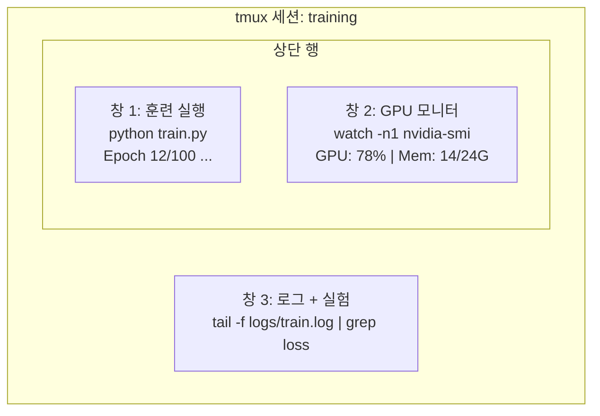

# 터미널 & 셸

> 터미널은 AI 엔지니어가 사는 곳입니다. 여기서 편안해지세요.

**유형:** 학습
**언어:** --
**선수 과목:** Phase 0, Lesson 01
**시간:** ~35분

## 학습 목표

- 파이핑, 리다이렉트, `grep`을 사용하여 명령줄에서 훈련 로그 필터링 및 처리하기
- 동시 훈련 및 GPU 모니터링을 위한 여러 창이 있는 영구 tmux 세션 만들기
- `htop`, `nvtop`, `nvidia-smi`로 시스템 및 GPU 리소스 모니터링하기
- SSH, `scp`, `rsync`를 사용하여 로컬과 원격 머신 간 파일 전송하기

## 문제

어떤 에디터보다 터미널에서 더 많은 시간을 보내게 됩니다. 훈련 실행, GPU 모니터링, 로그 테일링, 원격 SSH 세션, 환경 관리. 모든 AI 워크플로우가 셸을 거칩니다. 여기서 느리면 모든 곳에서 느립니다.

이 레슨은 AI 작업에 중요한 터미널 기술만 다룹니다. Unix의 역사도, Bash 스크립팅 심층 분석도 아닙니다. 필요한 것만.

## 개념



세 가지가 동시에 실행됩니다. 하나의 터미널. 분리하고, 집에 가고, 다시 SSH로 접속하고, 다시 연결할 수 있습니다. 훈련은 계속 실행됩니다.

## 빌드하기

### 1단계: 셸 알기

실행 중인 셸 확인:

```bash
echo $SHELL
```

대부분의 시스템은 `bash` 또는 `zsh`를 사용합니다. 둘 다 잘 작동합니다. 이 과정의 명령은 둘 다에서 작동합니다.

핵심 사항:

```bash
# 이동
cd ~/projects/ai-engineering-from-scratch
pwd
ls -la

# 히스토리 검색 (가장 유용한 단축키)
# Ctrl+R 후 이전 명령의 일부 입력
# Ctrl+R 다시 눌러 일치 항목 순환

# 터미널 지우기
clear   # 또는 Ctrl+L

# 실행 중인 명령 취소
# Ctrl+C

# 실행 중인 명령 일시 중단 (fg로 재개)
# Ctrl+Z
```

### 2단계: 파이핑과 리다이렉트

파이핑은 명령을 연결합니다. 로그 처리, 출력 필터링, 도구 체인 방식입니다. 계속 사용하게 됩니다.

```bash
# 로그에 "loss"가 몇 번 나타나는지 세기
cat train.log | grep "loss" | wc -l

# 훈련 출력에서 loss 값만 추출
grep "loss:" train.log | awk '{print $NF}' > losses.txt

# 로그 파일 실시간 감시, 오류만 필터링
tail -f train.log | grep --line-buffered "ERROR"

# 최종 정확도로 실험 정렬
grep "final_accuracy" results/*.log | sort -t= -k2 -n -r

# stdout과 stderr을 별도 파일로 리다이렉트
python train.py > output.log 2> errors.log

# 둘 다 같은 파일로
python train.py > train_full.log 2>&1
```

필요한 세 가지 리다이렉트:

| 기호 | 기능 |
|------|------|
| `>` | stdout을 파일로 쓰기 (덮어쓰기) |
| `>>` | stdout을 파일에 추가 |
| `2>` | stderr을 파일로 쓰기 |
| `2>&1` | stderr을 stdout과 같은 곳으로 보내기 |
| `\|` | 한 명령의 stdout을 다음 명령의 stdin으로 보내기 |

### 3단계: 백그라운드 프로세스

훈련 실행은 몇 시간 걸립니다. 터미널을 계속 열어두고 싶지 않을 것입니다.

```bash
# 백그라운드에서 실행 (출력은 여전히 터미널로)
python train.py &

# 백그라운드에서 실행, 연결 끊김에 영향 없음 (터미널을 닫아도 종료되지 않음)
nohup python train.py > train.log 2>&1 &

# 백그라운드에서 실행 중인 것 확인
jobs
ps aux | grep train.py

# 백그라운드 작업을 포그라운드로 가져오기
fg %1

# 백그라운드 프로세스 종료
kill %1
# 또는 PID를 찾아 종료
kill $(pgrep -f "train.py")
```

`&`, `nohup`, `screen`/`tmux`의 차이:

| 방법 | 터미널 닫아도 유지? | 재연결 가능? |
|------|-------------------|-------------|
| `command &` | 아니요 | 아니요 |
| `nohup command &` | 예 | 아니요 (로그 파일 확인) |
| `screen` / `tmux` | 예 | 예 |

몇 분 이상 걸리는 작업은 tmux를 사용하세요.

### 4단계: tmux

tmux는 여러 창이 있는 영구 터미널 세션을 만들 수 있게 해줍니다. 훈련 실행 관리를 위한 가장 유용한 단일 도구입니다.

```bash
# 설치
# macOS
brew install tmux
# Ubuntu
sudo apt install tmux

# 이름 있는 세션 시작
tmux new -s training

# 수평 분할
# Ctrl+B 후 "

# 수직 분할
# Ctrl+B 후 %

# 창 간 이동
# Ctrl+B 후 화살표 키

# 분리 (세션 계속 실행)
# Ctrl+B 후 d

# 재연결
tmux attach -t training

# 세션 목록
tmux ls

# 세션 종료
tmux kill-session -t training
```

일반적인 AI 워크플로우 세션:

```bash
tmux new -s train

# 창 1: 훈련 시작
python train.py --epochs 100 --lr 1e-4

# Ctrl+B, " 로 분할 후 GPU 모니터 실행
watch -n1 nvidia-smi

# Ctrl+B, % 로 수직 분할, 로그 테일링
tail -f logs/experiment.log

# 이제 Ctrl+B, d로 분리
# SSH 종료, 커피 한잔, 돌아오기
# tmux attach -t train
```

### 5단계: htop과 nvtop으로 모니터링

```bash
# 시스템 프로세스 (top보다 나음)
htop

# GPU 프로세스 (NVIDIA GPU가 있는 경우)
# 설치: sudo apt install nvtop (Ubuntu) 또는 brew install nvtop (macOS)
nvtop

# nvtop 없이 빠른 GPU 확인
nvidia-smi

# GPU 사용량 매초 업데이트 감시
watch -n1 nvidia-smi
```

`htop` 키 바인딩:
- `F6` 또는 `>` — 열 기준 정렬 (메모리 누수 찾기 위해 메모리 기준 정렬)
- `F5` — 트리 뷰 전환 (자식 프로세스 보기)
- `F9` — 프로세스 종료
- `/` — 프로세스 이름 검색

### 6단계: 원격 GPU 박스용 SSH

클라우드 GPU(Lambda, RunPod, Vast.ai)를 대여할 때 SSH로 연결합니다.

```bash
# 기본 연결
ssh user@gpu-box-ip

# 특정 키로
ssh -i ~/.ssh/my_gpu_key user@gpu-box-ip

# 원격으로 파일 복사
scp model.pt user@gpu-box-ip:~/models/

# 원격에서 파일 복사
scp user@gpu-box-ip:~/results/metrics.json ./

# 전체 디렉토리 동기화 (많은 파일에 대해 더 빠름)
rsync -avz ./data/ user@gpu-box-ip:~/data/

# 포트 포워딩 (원격 Jupyter/TensorBoard에 로컬에서 접근)
ssh -L 8888:localhost:8888 user@gpu-box-ip
# 이제 브라우저에서 localhost:8888 열기
```

### 7단계: AI 작업용 유용한 별칭

`~/.bashrc` 또는 `~/.zshrc`에 추가:

```bash
# GPU 상태 한눈에
alias gpu='nvidia-smi --query-gpu=index,name,utilization.gpu,memory.used,memory.total,temperature.gpu --format=csv,noheader'

# 모든 Python 훈련 프로세스 종료
alias killtraining='pkill -f "python.*train"'

# 빠른 가상 환경 활성화
alias ae='source .venv/bin/activate'

# 훈련 loss 감시
alias watchloss='tail -f logs/*.log | grep --line-buffered "loss"'
```

## 실용적인 패턴

```bash
# 훈련 실행, 모든 것 로깅, 완료 시 알림
python train.py 2>&1 | tee train.log; echo "완료" | mail -s "훈련 완료" you@email.com

# 두 실험 로그 나란히 비교
diff <(grep "accuracy" exp1.log) <(grep "accuracy" exp2.log)

# 가장 큰 모델 파일 찾기 (디스크 공간 정리)
find . -name "*.pt" -o -name "*.safetensors" | xargs du -h | sort -rh | head -20

# 디스크 공간 확인 (훈련 데이터가 디스크를 빠르게 채움)
df -h
du -sh ./data/*

# 훈련 전 환경 변수 확인
env | grep -i cuda
env | grep -i torch
```

## 연습 문제

1. tmux를 설치하고, 세 개의 창이 있는 세션을 만들고, 하나는 `htop`, 하나는 `watch -n1 date`, 하나는 Python 스크립트 실행. 분리했다 재연결하기.
2. `code/shell_aliases.sh`의 별칭을 셸 구성에 추가하고 `source ~/.zshrc`(또는 `~/.bashrc`)로 다시 로드하기.
3. 가짜 훈련 로그 만들기: `for i in $(seq 1 100); do echo "epoch $i loss: $(echo "scale=4; 1/$i" | bc)"; sleep 0.1; done > fake_train.log` 후 `grep`, `tail`, `awk`로 loss 값만 추출하기.
4. 접근 가능한 서버(또는 `localhost`로 구문 연습)에 SSH 구성 항목 설정하기.

## 주요 용어

| 용어 | 사람들이 말하는 것 | 실제 의미 |
|------|-------------------|----------|
| 셸 | "터미널" | 명령을 해석하는 프로그램 (bash, zsh, fish) |
| tmux | "터미널 멀티플렉서" | 하나의 창 안에서 여러 터미널 세션을 실행하고 분리/재연결할 수 있게 하는 프로그램 |
| 파이프 | "그 막대기" | 한 명령의 출력을 다른 명령의 입력으로 보내는 `\|` 연산자 |
| PID | "프로세스 ID" | 실행 중인 모든 프로세스에 할당된 고유 번호, 모니터링 또는 종료에 사용 |
| nohup | "연결 끊김 방지" | 연결 끊김 신호에 영향받지 않고 명령을 실행, 터미널을 닫아도 종료되지 않음 |
| SSH | "서버에 연결하기" | 원격 머신에서 명령을 실행하기 위한 암호화된 프로토콜, Secure Shell |