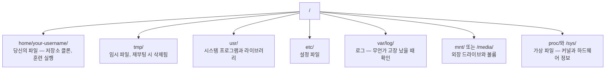

# AI를 위한 Linux

> 대부분의 AI는 Linux에서 실행됩니다. 막히지 않을 만큼만 알면 됩니다.

**유형:** 학습
**언어:** --
**선수 과목:** Phase 0, Lesson 01
**시간:** ~30분

## 학습 목표

- Linux 파일 시스템 탐색 및 명령줄에서 필수 파일 작업 수행하기
- `chmod`와 `chown`으로 파일 권한을 관리하여 "Permission denied" 오류 해결하기
- `apt`로 시스템 패키지를 설치하고 AI 작업을 위한 새 GPU 박스 설정하기
- 원격 머신에서 작업할 때 개발자들이 흔히 겪는 macOS-to-Linux 차이점 파악하기

## 문제

macOS나 Windows에서 개발합니다. 하지만 클라우드 GPU 박스에 SSH로 접속하거나, Lambda 인스턴스를 대여하거나, EC2 머신을 시작하는 순간 Ubuntu에 도착합니다. 터미널이 유일한 인터페이스입니다. Finder도, Explorer도, GUI도 없습니다. 명령줄에서 파일 시스템을 탐색하고, 패키지를 설치하고, 프로세스를 관리할 수 없다면 "Linux에서 파일 압축 푸는 법"을 검색하며 유휴 GPU 시간 비용을 지불하게 됩니다.

이것은 생존 가이드입니다. AI 작업을 위해 원격 Linux 머신에서 작업하는 데 정확히 필요한 것만 다룹니다. 그 이상은 없습니다.

## 파일 시스템 레이아웃

Linux는 모든 것을 단일 루트 `/` 아래에 구성합니다. `C:\`나 `/Volumes`는 없습니다. 실제로 다루게 될 디렉토리:



홈 디렉토리는 `~` 또는 `/home/your-username`입니다. 거의 모든 작업이 여기서 이루어집니다.

## 필수 명령어

원격 GPU 박스에서 하는 작업의 95%를 커버하는 15개의 명령어입니다.

### 이동

```bash
pwd                         # 나 어디 있어?
ls                          # 여기 뭐 있어?
ls -la                      # 숨김 파일 포함 상세 정보로 뭐 있어?
cd /path/to/dir             # 거기로 가기
cd ~                        # 홈으로 가기
cd ..                       # 한 단계 위로
```

### 파일과 디렉토리

```bash
mkdir my-project            # 디렉토리 만들기
mkdir -p a/b/c              # 중첩 디렉토리 한 번에 만들기

cp file.txt backup.txt      # 파일 복사
cp -r src/ src-backup/      # 디렉토리 복사 (재귀적)

mv old.txt new.txt          # 파일 이름 변경
mv file.txt /tmp/           # 파일 이동

rm file.txt                 # 파일 삭제 (휴지통 없음, 사라짐)
rm -rf my-dir/              # 디렉토리와 내부 모든 것 삭제
```

`rm -rf`는 영구적입니다. 되돌릴 수 없습니다. Enter를 누르기 전에 경로를 다시 확인하세요.

### 파일 읽기

```bash
cat file.txt                # 전체 파일 출력
head -20 file.txt           # 처음 20줄
tail -20 file.txt           # 마지막 20줄
tail -f log.txt             # 실시간 로그 파일 따라가기 (Ctrl+C로 중지)
less file.txt               # 파일 스크롤하며 보기 (q로 종료)
```

### 검색

```bash
grep "error" training.log           # "error"가 포함된 줄 찾기
grep -r "learning_rate" .           # 현재 디렉토리의 모든 파일 검색
grep -i "cuda" config.yaml          # 대소문자 무시 검색

find . -name "*.py"                 # 현재 디렉토리 아래 모든 Python 파일 찾기
find . -name "*.ckpt" -size +1G     # 1GB보다 큰 체크포인트 파일 찾기
```

## 권한

Linux의 모든 파일에는 소유자와 권한 비트가 있습니다. 스크립트가 실행되지 않거나 디렉토리에 쓸 수 없을 때 마주치게 됩니다.

```bash
ls -l train.py
# -rwxr-xr-- 1 user group 2048 Mar 19 10:00 train.py
#  ^^^             소유자 권한: 읽기, 쓰기, 실행
#     ^^^          그룹 권한: 읽기, 실행
#        ^^        다른 모든 사람: 읽기 전용
```

일반적인 해결책:

```bash
chmod +x train.sh           # 스크립트 실행 가능하게 만들기
chmod 755 deploy.sh         # 소유자: 전체, 다른 사람: 읽기+실행
chmod 644 config.yaml       # 소유자: 읽기+쓰기, 다른 사람: 읽기 전용

chown user:group file.txt   # 파일 소유자 변경 (sudo 필요)
```

"Permission denied"가 표시되면 거의 항상 권한 문제입니다. `chmod +x` 또는 `sudo`로 대부분 해결됩니다.

## 패키지 관리 (apt)

Ubuntu는 `apt`를 사용합니다. 시스템 수준 소프트웨어를 설치하는 방법입니다.

```bash
sudo apt update             # 패키지 목록 새로고침 (항상 먼저 하세요)
sudo apt install -y htop    # 패키지 설치 (-y는 확인 건너뛰기)
sudo apt install -y build-essential  # C 컴파일러, make 등. 많은 Python 패키지에 필요
sudo apt install -y tmux    # 터미널 멀티플렉서 (연결 끊김 후에도 세션 유지)

apt list --installed        # 무엇이 설치되어 있나?
sudo apt remove htop        # 제거
```

새 GPU 박스에 설치할 일반적인 패키지:

```bash
sudo apt update && sudo apt install -y \
    build-essential \
    git \
    curl \
    wget \
    tmux \
    htop \
    unzip \
    python3-venv
```

## 사용자와 sudo

보통 일반 사용자로 로그인합니다. 일부 작업은 root(관리자) 접근이 필요합니다.

```bash
whoami                      # 나는 어떤 사용자?
sudo command                # root로 단일 명령 실행
sudo su                     # root 되기 (exit으로 돌아가기, 신중히 사용)
```

클라우드 GPU 인스턴스에서는 일반적으로 유일한 사용자이고 이미 sudo 접근 권한이 있습니다. 모든 것을 root로 실행하지 마세요. 필요할 때만 sudo를 사용하세요.

## 프로세스와 systemd

훈련이 멈추거나 실행 중인 것을 확인해야 할 때:

```bash
htop                        # 대화형 프로세스 뷰어 (q로 종료)
ps aux | grep python        # 실행 중인 Python 프로세스 찾기
kill 12345                  # PID 12345 프로세스 정상 종료
kill -9 12345               # 강제 종료 (정상 종료가 안 될 때 사용)
nvidia-smi                  # GPU 프로세스와 메모리 사용량
```

systemd는 서비스(백그라운드 데몬)를 관리합니다. 추론 서버를 실행할 때 사용:

```bash
sudo systemctl start nginx          # 서비스 시작
sudo systemctl stop nginx           # 중지
sudo systemctl restart nginx        # 재시작
sudo systemctl status nginx         # 실행 중인지 확인
sudo systemctl enable nginx         # 부팅 시 자동 시작
```

## 디스크 공간

GPU 박스는 종종 디스크 공간이 제한적입니다. 모델과 데이터셋이 빠르게 채웁니다.

```bash
df -h                       # 모든 마운트된 드라이브의 디스크 사용량
df -h /home                 # /home의 디스크 사용량

du -sh *                    # 현재 디렉토리의 각 항목 크기
du -sh ~/.cache             # 캐시 크기 (pip, huggingface 모델이 여기 저장됨)
du -sh /data/checkpoints/   # 체크포인트 크기 확인

# 가장 큰 공간 차지 항목 찾기
du -h --max-depth=1 / 2>/dev/null | sort -hr | head -20
```

공간 확보:

```bash
# pip 캐시 정리
pip cache purge

# apt 캐시 정리
sudo apt clean

# 필요 없는 오래된 체크포인트 제거
rm -rf checkpoints/epoch_01/ checkpoints/epoch_02/
```

## 네트워킹

명령줄에서 모델 다운로드, 파일 전송, API 호출을 하게 됩니다.

```bash
# 파일 다운로드
wget https://example.com/model.bin
curl -O https://example.com/data.tar.gz
curl -s https://api.example.com/health | python3 -m json.tool  # API 호출, JSON 예쁘게 출력

# 머신 간 파일 전송
scp model.bin user@remote:/data/
scp user@remote:/data/results.csv .
scp -r user@remote:/data/checkpoints/ ./local-dir/

# 디렉토리 동기화 (대용량 전송 시 scp보다 빠름, 실패 시 재개)
rsync -avz --progress ./data/ user@remote:/data/
rsync -avz --progress user@remote:/results/ ./results/
```

대용량에는 `scp`보다 `rsync`를 사용하세요. 변경된 바이트만 전송하고 중단된 연결을 처리합니다.

## tmux: 세션 유지

원격 박스에 SSH로 접속했을 때 노트북을 닫으면 훈련이 종료됩니다. tmux가 이를 방지합니다.

```bash
tmux new -s train           # "train"이라는 새 세션 시작
# ... 훈련 시작, 그 다음:
# Ctrl+B, 그 다음 D          # 분리 (훈련 계속 실행)

tmux ls                     # 세션 목록
tmux attach -t train        # 세션 재연결

# tmux 내부에서:
# Ctrl+B, 그 다음 %          # 수직 창 분할
# Ctrl+B, 그 다음 "          # 수평 창 분할
# Ctrl+B, 그 다음 화살표 키   # 창 간 전환
```

긴 훈련 작업은 항상 tmux 안에서 실행하세요. 항상.

## Windows 사용자를 위한 WSL2

Windows를 사용 중이라면 WSL2가 듀얼 부팅 없이 실제 Linux 환경을 제공합니다.

```bash
# PowerShell에서 (관리자)
wsl --install -d Ubuntu-24.04

# 재시작 후 시작 메뉴에서 Ubuntu 열기
sudo apt update && sudo apt upgrade -y
```

WSL2는 실제 Linux 커널을 실행합니다. 이 레슨의 모든 내용이 내부에서 작동합니다. Windows 파일은 WSL 내부에서 `/mnt/c/Users/YourName/`에 있습니다.

GPU 패스스루는 Windows 측에 NVIDIA 드라이버가 설치되어 있으면 작동합니다. Windows NVIDIA 드라이버(Linux용이 아님)를 설치하면 WSL2 내부에서 CUDA를 사용할 수 있습니다.

## 주의점: macOS에서 Linux로

macOS에서 넘어올 때 걸림돌이 될 것들:

| macOS | Linux | 참고 |
|-------|-------|------|
| `brew install` | `sudo apt install` | 때로는 패키지 이름이 다름 |
| `open file.txt` | `xdg-open file.txt` | 하지만 원격 박스에는 GUI가 없음. `cat`이나 `less` 사용 |
| `pbcopy` / `pbpaste` | 사용 불가 | SSH를 통한 클립보드 파이핑 없음 |
| `~/.zshrc` | `~/.bashrc` | macOS 기본값은 zsh. 대부분의 Linux 서버는 bash 사용 |
| 대소문자 구분 없는 파일 시스템 | 대소문자 구분 파일 시스템 | `Model.py`와 `model.py`는 Linux에서 서로 다른 두 파일 |

## 빠른 참조 카드

```
탐색:       pwd, ls, cd, find
파일:       cp, mv, rm, mkdir, cat, head, tail, less
검색:       grep, find
권한:       chmod, chown, sudo
패키지:     apt update, apt install
프로세스:   htop, ps, kill, nvidia-smi
서비스:     systemctl start/stop/restart/status
디스크:     df -h, du -sh
네트워크:   curl, wget, scp, rsync
세션:       tmux new/attach/detach
```

## 연습 문제

1. Linux 머신(또는 WSL2)에 SSH로 접속하고 홈 디렉토리로 이동하세요. 프로젝트 폴더를 만들고, `touch`로 빈 파일 3개를 만들고, `ls -la`로 나열하세요.
2. apt로 `htop`을 설치하고, 실행하고, 어떤 프로세스가 가장 많은 메모리를 사용하는지 확인하세요.
3. tmux 세션을 시작하고, `sleep 300`을 실행하고, 분리하고, 세션을 나열하고, 재연결하세요.
4. `df -h`로 사용 가능한 디스크 공간을 확인하고, `du -sh ~/.cache/*`로 캐시에서 공간을 차지하는 것을 찾으세요.