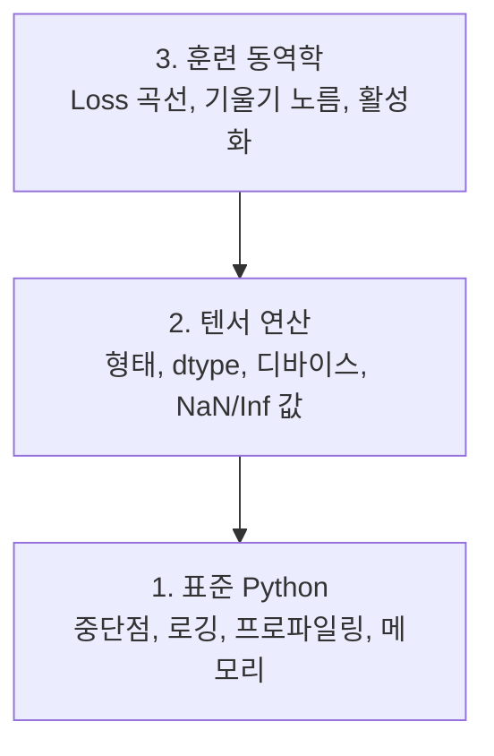

# 디버깅 및 프로파일링

> 최악의 AI 버그는 충돌하지 않습니다. 쓰레기 데이터로 조용히 훈련하고 아름다운 loss 곡선을 보고합니다.

**유형:** 빌드
**언어:** Python
**선수 과목:** Lesson 1 (개발 환경), 기본 PyTorch 숙련도
**시간:** ~60분

## 학습 목표

- 조건부 `breakpoint()`와 `debug_print`를 사용하여 훈련 중 텐서 형태, dtype, NaN 값을 검사하기
- `cProfile`, `line_profiler`, `tracemalloc`으로 훈련 루프를 프로파일링하여 병목 찾기
- 일반적인 AI 버그 감지: 형태 불일치, NaN loss, 데이터 누수, 잘못된 디바이스 텐서
- TensorBoard를 설정하여 loss 곡선, 가중치 히스토그램, 기울기 분포 시각화하기

## 문제

AI 코드는 일반 코드와 다르게 실패합니다. 웹 앱은 스택 트레이스와 함께 충돌합니다. 잘못 구성된 훈련 루프는 8시간 동안 실행되고, GPU 비용으로 $200을 소모하며, 모든 입력의 평균을 예측하는 모델을 생성합니다. 코드는 오류를 내지 않았습니다. 버그는 잘못된 디바이스의 텐서, 잊어버린 `.detach()`, 또는 특성에 누수된 레이블이었습니다.

시간과 컴퓨팅을 낭비하기 전에 이러한 조용한 실패를 잡아내는 디버깅 도구가 필요합니다.

## 개념

AI 디버깅은 세 가지 수준에서 작동합니다:



대부분의 사람들은 곧바로 3단계로 뛰어듭니다(TensorBoard 응시). 하지만 AI 버그의 80%는 1단계와 2단계에 있습니다.

## 빌드하기

### 파트 1: Print 디버깅 (네, 작동합니다)

Print 디버깅은 무시되곤 합니다. 그래서는 안 됩니다. 텐서 코드의 경우, 형태, dtype, 값 범위를 한 번에 확인해야 하므로 대상화된 print 문이 디버거를 단계별로 실행하는 것보다 낫습니다.

```python
def debug_print(name, tensor):
    print(f"{name}: shape={tensor.shape}, dtype={tensor.dtype}, "
          f"device={tensor.device}, "
          f"min={tensor.min().item():.4f}, max={tensor.max().item():.4f}, "
          f"mean={tensor.mean().item():.4f}, "
          f"has_nan={tensor.isnan().any().item()}")
```

의심스러운 모든 연산 후에 이것을 호출하세요. 버그를 찾으면 print를 제거하세요. 간단합니다.

### 파트 2: Python 디버거 (pdb와 breakpoint)

내장 디버거는 AI 작업에 과소평가되어 있습니다. 훈련 루프에 `breakpoint()`를 넣고 대화형으로 텐서를 검사하세요.

```python
def training_step(model, batch, criterion, optimizer):
    inputs, labels = batch
    outputs = model(inputs)
    loss = criterion(outputs, labels)

    if loss.item() > 100 or torch.isnan(loss):
        breakpoint()

    loss.backward()
    optimizer.step()
```

디버거가 활성화되면 유용한 명령:

- `p outputs.shape` — 형태 확인
- `p loss.item()` — loss 값 보기
- `p torch.isnan(outputs).sum()` — NaN 개수 세기
- `p model.fc1.weight.grad` — 기울기 확인
- `c` — 계속, `q` — 종료

이것은 조건부 디버깅입니다. 무언가 잘못되었을 때만 중지합니다. 10,000단계 훈련 실행에서는 이것이 중요합니다.

### 파트 3: Python 로깅

빠른 확인을 넘어 디버깅이 필요할 때 print 문을 로깅으로 교체하세요.

```python
import logging

logging.basicConfig(
    level=logging.INFO,
    format="%(asctime)s [%(levelname)s] %(message)s",
    handlers=[
        logging.FileHandler("training.log"),
        logging.StreamHandler()
    ]
)
logger = logging.getLogger(__name__)

logger.info("훈련 시작: lr=%.4f, batch_size=%d", lr, batch_size)
logger.warning("Loss 급증 감지: %.4f at step %d", loss.item(), step)
logger.error("Step %d에서 NaN loss, 중지", step)
```

로깅은 타임스탬프, 심각도 수준, 파일 출력을 제공합니다. 오전 3시에 훈련이 실패하면 화면에서 스크롤된 터미널 출력이 아닌 로그 파일이 필요합니다.

### 파트 4: 코드 섹션 시간 측정

시간이 어디로 가는지 아는 것이 최적화의 첫 단계입니다.

```python
import time

class Timer:
    def __init__(self, name=""):
        self.name = name

    def __enter__(self):
        self.start = time.perf_counter()
        return self

    def __exit__(self, *args):
        elapsed = time.perf_counter() - self.start
        print(f"[{self.name}] {elapsed:.4f}s")

with Timer("데이터 로딩"):
    batch = next(dataloader_iter)

with Timer("순전파"):
    outputs = model(batch)

with Timer("역전파"):
    loss.backward()
```

일반적인 발견: 데이터 로딩이 훈련 시간의 60%를 차지합니다. 해결책은 더 빠른 GPU가 아닌 DataLoader의 `num_workers > 0`입니다.

### 파트 5: cProfile과 line_profiler

수동 타이머 이상이 필요할 때:

```bash
python -m cProfile -s cumtime train.py
```

누적 시간으로 정렬된 모든 함수 호출을 보여줍니다. 라인별 프로파일링:

```bash
pip install line_profiler
```

```python
@profile
def train_step(model, data, target):
    output = model(data)
    loss = F.cross_entropy(output, target)
    loss.backward()
    return loss

# 실행: kernprof -l -v train.py
```

### 파트 6: 메모리 프로파일링

#### tracemalloc으로 CPU 메모리

```python
import tracemalloc

tracemalloc.start()

model = build_model()
data = load_dataset()

snapshot = tracemalloc.take_snapshot()
top_stats = snapshot.statistics("lineno")
for stat in top_stats[:10]:
    print(stat)
```

#### PyTorch로 GPU 메모리

```python
import torch

if torch.cuda.is_available():
    print(torch.cuda.memory_summary())
    print(f"할당됨: {torch.cuda.memory_allocated() / 1e9:.2f} GB")
    print(f"캐시됨: {torch.cuda.memory_reserved() / 1e9:.2f} GB")
```

OOM(메모리 부족) 발생 시:

1. 배치 크기 줄이기 (항상 첫 번째로 시도)
2. `torch.cuda.empty_cache()`로 캐시된 메모리 해제
3. 큰 중간 변수에 `del tensor` 후 `torch.cuda.empty_cache()`
4. 혼합 정밀도(`torch.cuda.amp`)로 메모리 사용량 절반으로
5. 매우 깊은 모델에 기울기 체크포인팅 사용

### 파트 7: 일반적인 AI 버그와 잡는 방법

#### 형태 불일치

가장 빈번한 버그. 모델이 `[batch, channels, height, width]`를 기대할 때 텐서가 `[batch, features]` 형태입니다.

```python
def check_shapes(model, sample_input):
    print(f"입력: {sample_input.shape}")
    # ... 등록된 포워드 훅으로 각 레이어의 형태 변환 출력
```

샘플 배치로 한 번 실행하세요. 모델의 모든 형태 변환을 매핑합니다.

#### NaN Loss

NaN loss는 무언가 폭발했음을 의미합니다. 일반적인 원인:

- 학습률이 너무 높음
- 사용자 정의 loss에서 0으로 나누기
- 0 또는 음수의 로그
- RNN에서 폭발하는 기울기

```python
def detect_nan(model, loss, step):
    if torch.isnan(loss):
        print(f"Step {step}에서 NaN loss")
        for name, param in model.named_parameters():
            if param.grad is not None:
                if torch.isnan(param.grad).any():
                    print(f"  {name}에서 NaN 기울기")
        return True
    return False
```

#### 데이터 누수

모델이 테스트 세트에서 99% 정확도를 얻습니다. 훌륭해 보이지만, 버그입니다.

```python
def check_data_leakage(train_set, test_set, id_column="id"):
    train_ids = set(train_set[id_column].tolist())
    test_ids = set(test_set[id_column].tolist())
    overlap = train_ids & test_ids
    if overlap:
        print(f"데이터 누수: {len(overlap)}개 샘플이 train과 test 모두에 있음")
        return True
    return False
```

시간적 누수도 확인하세요: 과거를 예측하기 위해 미래 데이터 사용. 분할 전에 타임스탬프로 정렬하세요.

#### 잘못된 디바이스

서로 다른 디바이스(CPU vs GPU)의 텐서는 런타임 오류를 발생시킵니다. 하지만 때로는 텐서가 조용히 CPU에 머물고 다른 모든 것은 GPU에 있을 때, 훈련이 그냥 느리게 실행됩니다.

```python
def check_devices(model, *tensors):
    model_device = next(model.parameters()).device
    for i, t in enumerate(tensors):
        if t.device != model_device:
            print(f"  경고: tensor {i}는 {t.device}, 모델은 {model_device}")
```

### 파트 8: TensorBoard 기초

TensorBoard는 시간에 따른 훈련 내부를 보여줍니다.

```bash
pip install tensorboard
```

```python
from torch.utils.tensorboard import SummaryWriter

writer = SummaryWriter("runs/experiment_1")

for step in range(num_steps):
    loss = train_step(model, batch)
    writer.add_scalar("loss/train", loss.item(), step)
    writer.add_scalar("lr", optimizer.param_groups[0]["lr"], step)

writer.close()
```

실행:

```bash
tensorboard --logdir=runs
```

확인할 사항:

- **Loss가 감소하지 않음**: 학습률이 너무 낮거나 모델 아키텍처 문제
- **Loss가 크게 진동**: 학습률이 너무 높음
- **Loss가 NaN으로**: 수치적 불안정성
- **Train loss 감소, val loss 증가**: 과적합
- **가중치 히스토그램이 0으로 수축**: 기울기 소실
- **기울기 히스토그램 폭발**: 기울기 클리핑 필요

### 파트 9: VS Code 디버거

`launch.json`으로 VS Code 구성:

```json
{
    "version": "0.2.0",
    "configurations": [
        {
            "name": "훈련 디버그",
            "type": "debugpy",
            "request": "launch",
            "program": "${file}",
            "console": "integratedTerminal",
            "justMyCode": false
        }
    ]
}
```

여백을 클릭하여 중단점 설정. Variables 창에서 텐서 속성 검사. Debug Console에서 실행 중 임의의 Python 표현식 실행.

## 활용하기

대부분의 AI 버그를 잡는 디버깅 워크플로우:

1. **훈련 전**: 샘플 배치로 `check_shapes` 실행. 입출력 차원이 예상과 일치하는지 확인.
2. **처음 10단계**: loss, 출력, 기울기에 `debug_print` 사용. NaN이 없고 값이 합리적인 범위인지 확인.
3. **훈련 중**: loss, 학습률, 기울기 노름 로깅. TensorBoard로 시각화.
4. **무언가 고장났을 때**: 실패 지점에 `breakpoint()` 삽입. 대화형으로 텐서 검사.
5. **성능 확인**: 데이터 로딩 vs 순전파 vs 역전파 시간 측정. OOM 근접 시 메모리 프로파일링.

## 배포하기

디버깅 툴킷 스크립트 실행:

```bash
python phases/00-setup-and-tooling/12-debugging-and-profiling/code/debug_tools.py
```

AI 특정 버그 진단 프롬프트는 `outputs/prompt-debug-ai-code.md` 참조.

## 연습 문제

1. `debug_tools.py`를 실행하고 각 섹션의 출력을 읽으세요. 더미 모델을 수정하여 NaN 도입 (힌트: 순전파에서 0으로 나누기) 후 감지기가 잡아내는지 확인하세요.
2. `cProfile`로 훈련 루프를 프로파일링하고 가장 느린 함수 찾기.
3. `tracemalloc`으로 데이터 로딩 파이프라인에서 가장 많은 메모리를 할당하는 라인 찾기.
4. 간단한 훈련 실행을 위해 TensorBoard를 설정하고 모델이 과적합 중인지 확인.
5. 훈련 루프 내에서 `breakpoint()` 사용. 디버거 프롬프트에서 텐서 형태, 디바이스, 기울기 값 검사 연습.