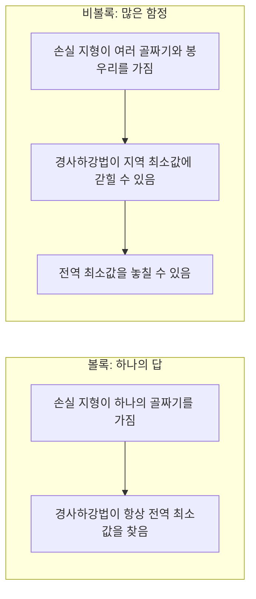
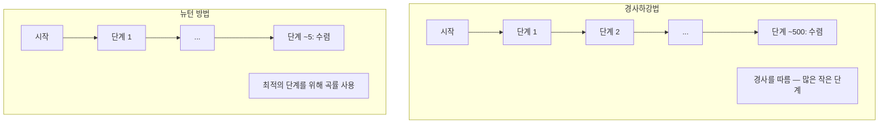
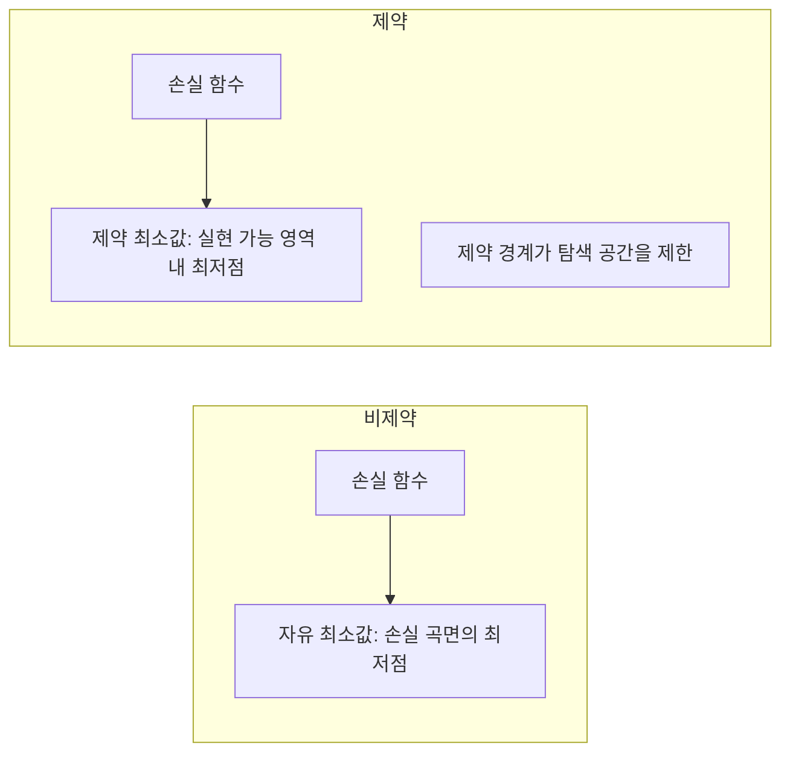
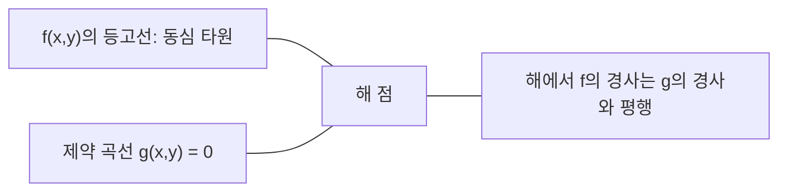

# 볼록 최적화

> 볼록 문제에는 하나의 골짜기가 있습니다. 신경망에는 수백만 개가 있습니다. 그 차이를 아는 것이 중요합니다.

**유형:** 실습
**언어:** Python
**선수 과목:** Phase 1, Lessons 04 (미분적분학 for ML), 08 (최적화)
**소요 시간:** ~90분

## 학습 목표

- 정의, 2차 도함수, 헤시안 기준을 사용하여 함수가 볼록인지 검사하기
- 뉴턴 방법 구현하고 2차 수렴과 경사하강법 비교하기
- 라그랑주 승수를 사용하여 제약 최적화 문제 풀고 KKT 조건 해석하기
- 신경망 손실 지형이 비볼록인데도 SGD가 좋은 해를 찾는 이유 설명하기

## 문제

8번 수업에서 경사하강법, 모멘텀, Adam을 배웠습니다. 이러한 최적화 알고리즘들은 모든 표면에서 내리막길을 걷습니다. 하지만 보장 없이요. 비볼록 지형에서 경사하강법은 나쁜 지역 최소값에 빠지거나 안장점에 갇히거나 영원히 진동할 수 있습니다. 신경망이 비볼록이기 때문에 다른 방법이 없어서 그냥 사용했습니다.

하지만 머신러닝의 많은 문제는 볼록합니다. 선형 회귀, 로지스틱 회귀, SVM, LASSO, 릿지 회귀가 모두 해당됩니다. 이러한 문제에는 더 강한 것이 존재합니다: 수학적 보장이 있는 최적화. 볼록 문제는 정확히 하나의 골짜기를 가집니다. 내리닥걸음 하는 모든 알고리즘이 전역 최소값에 도달합니다. 재시작이 필요 없고, 학습률 스케줄도 필요 없고, 기도도 필요 없습니다.

볼록성을 이해하면 세 가지 일을 할 수 있습니다. 첫째, 문제가 쉬운지(볼록) 어려운지(비볼록) 알려줍니다. 둘째, 볼록 문제에 대한 더 빠른 도구인 뉴턴 방법을 제공합니다. 셋째, 정규화가 제약 조건으로 작용하는 이유, SVM의 쌍대성, 볼록성이 주는 모든 좋은 속성을 위반하는데도 딥러닝이 작동하는 이유 등 ML 전체에 나타나는 개념들을 설명해 줍니다.

## 개념

### 볼록 집합

집합 S가 볼록하려면 S의 임의의 두 점에 대해 그 사이의 선분도 완전히 S에 속해야 합니다.

| 볼록 집합 | 비볼록 집합 |
|---|---|
| **직사각형**: 내부의 두 점을连线하면 그 선분이 집합 내부에 있음 | **별/초승달 형태**: 두 내부 점 사이의 선이 집합 밖으로 나갈 수 있음 |
| **삼각형**: 모든 내부 점에 대해 같은 성질이 유지됨 | **도넛/환형**: 구멍으로 인해 일부 선분이 집합을 벗어남 |
| 임의의 두 점 사이의 선분이 집합 내부에 유지됨 | 일부 점 쌍 사이의 선분이 집합을 벗어남 |

공식 테스트: S의 임의의 점 x, y와 [0, 1]의 임의의 t에 대해, 점 tx + (1-t)y도 S에 있습니다.

볼록 집합의 예:
- 직선, 평면, R^n 전체
- 공 (원, 구, 초구)
- 반공간: {x : a^T x <= b}
- 임의 개수의 볼록 집합의 교집합

비볼록 집합의 예:
- 도넛 (환형)
- 분리된 두 원의 합집합
- "이목"이나 "구멍"이 있는 집합

### 볼록 함수

함수 f가 볼록하려면: f의 정의역이 볼록 집합이고, 정의역의 임의의 두 점 x, y와 [0, 1]의 임의의 t에 대해:

```
f(tx + (1-t)y) <= t*f(x) + (1-t)*f(y)
```

기하학적으로: 그래프 위의 두 점을 잇는 선분이 그래프 위 또는 위에 있습니다.

| 성질 | 볼록 함수 | 비볼록 함수 |
|---|---|---|
| **선분 테스트** | 그래프 위의 두 점 사이의 선분이 곡선 **위 또는 위**에 있음 | 일부 점들 사이의 선분이 곡선 **아래**로 내려감 |
| **형태** | 위로 굽는 하나의 그릇/골짜기 | 곡률이 다양한 여러 봉우리와 골짜기 |
| **지역 최소값** | 모든 지역 최소값이 전역 최소값 | 서로 다른 높이에 여러 지역 최소값이 존재할 수 있음 |

일반적인 볼록 함수:
- f(x) = x^2 (포물선)
- f(x) = |x| (절댓값)
- f(x) = e^x (지수)
- f(x) = max(0, x) (ReLU, though piecewise linear)
- f(x) = -log(x) for x > 0 (음의 로그)
- 모든 선형 함수 f(x) = a^T x + b (볼록과 오목 모두)

### 볼록성 검사

세 가지 실용적 테스트: 가장 쉬운 것부터 가장 엄密한 것까지.

**테스트 1: 2차 도함수 테스트 (1D).** 모든 x에 대해 f''(x) >= 0이면 f는 볼록합니다.

- f(x) = x^2: f''(x) = 2 >= 0. 볼록.
- f(x) = x^3: f''(x) = 6x. x < 0이면 음수. 볼록하지 않음.
- f(x) = e^x: f''(x) = e^x > 0. 볼록.

**테스트 2: 헤시안 테스트 (다변수).** 모든 x에 대해 헤시안 행렬 H(x)가 양의 준정부호이면 f는 볼록합니다. 헤시안은 2차 편도함수의 행렬입니다.

**테스트 3: 정의 테스트.** 부등식 f(tx + (1-t)y) <= t*f(x) + (1-t)*f(y)를 직접 확인합니다. 도함수를 구하기 어려운 함수에 유용합니다.

### 볼록성이 중요한 이유

볼록 최적화의 중심 정리:

**볼록 함수의 모든 지역 최소값은 전역 최소값입니다.**

이는 경사하강법이 갇힐 수 없음을 의미합니다. 내리막길는 모두 같은 답으로 이어집니다. 알고리즘이 최적 해로 수렴함이 보장됩니다.



결과:
- 무작위 재시작 불필요
- 정교한 학습률 스케줄 불필요
- 수렴 증명 가능 (비율은 함수 성질에 따라 다름)
- 해가 유일함 (평탄한 영역 제외)

### ML에서의 볼록 vs 비볼록

| 문제 | 볼록 여부 | 이유 |
|---------|---------|-----|
| 선형 회귀 (MSE) | Yes | 손실이 가중치에 대해 2차 |
| 로지스틱 회귀 | Yes | 로그 손실이 가중치에 대해 볼록 |
| SVM (힌지 손실) | Yes | 선형 함수의 최대값 |
| LASSO (L1 회귀) | Yes | 볼록 함수의 합은 볼록 |
| 릿지 회귀 (L2) | Yes | 2차 + 2차 = 볼록 |
| 신경망 (모든 손실) | No | 비선형 활성화가 비볼록 지형 생성 |
| k-평균 클러스터링 | No | 이산 할당 단계 |
| 행렬 분해 | No | 미지수의 곱 |

볼록 손실을 가진 선형 모델은 볼록합니다. 비선형 활성화가 있는 은닉층을 추가하는 순간 볼록성이 깨집니다.

### 헤시안 행렬

함수 f: R^n -> R의 헤시안 H는 2차 편도함수의 n x n 행렬입니다.

```
H[i][j] = d^2 f / (dx_i dx_j)
```

f(x, y) = x^2 + 3xy + y^2의 경우:

```
df/dx = 2x + 3y       d^2f/dx^2 = 2      d^2f/dxdy = 3
df/dy = 3x + 2y       d^2f/dydx = 3      d^2f/dy^2 = 2

H = [ 2  3 ]
    [ 3  2 ]
```

헤시안은 곡률에 대한 정보를 제공합니다:
- 고윳값이 모두 양수: 모든 방향으로 위로 굽음 (그 점에서 볼록)
- 고윳값이 모두 음수: 모든 방향으로 아래로 굽음 (오목, 지역 최대)
- 부호가 섞임: 안장점 (일부 방향은 위로, 일부는 아래로)
- 고윳값이 0: 그 방향으로 평탄 (비정상)

볼록성을 위해 헤시안은 모든 곳에서 양의 준정부호(모든 고윳값 >= 0)여야 합니다, 하나의 점이 아니라요.

### 뉴턴 방법

경사하강법이 1차 정보(경사)를 사용하는 반면, 뉴턴 방법은 2차 정보(헤시안)를 사용합니다. 현재 점에서 2차 근사를 적용하고 그 2차 함수의 최소값으로 바로 점프합니다.

```
업데이트 규칙:
  x_new = x - H^(-1) * gradient

경사하강법 비교:
  x_new = x - lr * gradient
```

뉴턴 방법은 스칼라 학습률을 역헤시안으로 대체합니다. 이는 국소 곡률에 따라 단계 크기와 방향을 자동으로 조정합니다.



장점:
- 최소값 근처에서 2차 수렴 (오차가 매 단계 제곱으로 감소)
- 튜닝할 학습률 없음
- 스케일 불변 (문제 매개변수화 방식에 관계없이 작동)

단점:
- 헤시안 계산은 O(n^2) 메모리 및 O(n^3) 역행렬 필요
- 100만 개의 가중치를 가진 신경망의 경우 10^12개 항목과 10^18개 연산
- 딥러닝에 실용적이지 않음

### 제약 최적화

비제약 최적화: 모든 x에 대해 f(x) 최소화.
제약 최적화: 제약 조건에 따라 f(x) 최소화.

실제 문제는 제약을 가집니다. 비용을 최소화하고 싶지만 예산이 제한적입니다. 오차를 최소화하고 싶지만 모델 복잡성에 상한이 있습니다.



### 라그랑주 승수

라그랑주 승수 방법은 제약 문제를 비제약 문제로 변환합니다.

문제: g(x) = 0 제약 하에서 f(x) 최소화.

해결: 새 변수 (라그랑주 승수 lambda)를 도입하고 비제약 문제를 풉니다:

```
L(x, lambda) = f(x) + lambda * g(x)
```

해에서 L의 경사는 0입니다:

```
dL/dx = df/dx + lambda * dg/dx = 0
dL/dlambda = g(x) = 0
```

기하학적 직관: 제약 최소값에서 f의 경사는 제약 g의 경사와 평행해야 합니다. 평행하지 않다면 제약 표면을 따라 이동하여 f를 더 줄일 수 있습니다.



예제: x + y = 1 제약 하에서 f(x,y) = x^2 + y^2 최소화.

```
L = x^2 + y^2 + lambda(x + y - 1)

dL/dx = 2x + lambda = 0  =>  x = -lambda/2
dL/dy = 2y + lambda = 0  =>  y = -lambda/2
dL/dlambda = x + y - 1 = 0

처음 두 식에서: x = y
대입하면: 2x = 1, 그래서 x = y = 0.5, lambda = -1
```

원점에서 직선 x + y = 1까지 가장 가까운 점은 (0.5, 0.5)입니다.

### KKT 조건

카루시-쿤-터커 조건은 라그랑주 승수를 부등식 제약으로 확장합니다.

문제: g_i(x) <= 0 (i = 1, ..., m) 제약 하에서 f(x) 최소화.

KKT 조건 (최적성을 위한 필요 조건):

```
1. 정류:    df/dx + sum(lambda_i * dg_i/dx) = 0
2. 원시 실현 가능성:  g_i(x) <= 0  모든 i에 대해
3. 쌍대 실현 가능성:    lambda_i >= 0  모든 i에 대해
4. 상보적 여유:  lambda_i * g_i(x) = 0  모든 i에 대해
```

상보적 여유가 핵심 통찰입니다: 제약이 활성 상태이거나(g_i = 0, 해가 경계에 있음) 승수가 0입니다(제약이 중요하지 않음). 해에 영향을 주지 않는 제약은 lambda = 0입니다.

KKT 조건은 SVM의 핵심입니다. 서포트 벡터는 제약이 활성 상태인 데이터 점(lambda > 0)입니다. 다른 모든 데이터 점은 lambda = 0이며 결정 경계에 영향을 주지 않습니다.

### 제약 최적화로 본 정규화

L1과 L2 정규화는 무작위 트릭이 아닙니다. 숨겨진 제약 최적화 문제입니다.

**L2 정규화 (릿지):**

```
minimize  Loss(w)  subject to  ||w||^2 <= t

동등한 비제약 형태:
minimize  Loss(w) + lambda * ||w||^2
```

제약 ||w||^2 <= t는 공(2D에서 원, 3D에서 구)을 정의합니다. 해는 손실 등고선이 이 공에 처음 닿는 점입니다.

**L1 정규화 (LASSO):**

```
minimize  Loss(w)  subject to  ||w||_1 <= t

동등한 비제약 형태:
minimize  Loss(w) + lambda * ||w||_1
```

제약 ||w||_1 <= t는 다이아몬드 (2D에서 회전된 정사각형)을 정의합니다.

| 성질 | L2 제약 (원) | L1 제약 (다이아몬드) |
|---|---|---|
| **제약 형태** | 원 (높은 차원에서는 구) | 다이아몬드 (2D에서 회전된 정사각형) |
| **손실 등고선이 닿는 곳** | 부드러운 경계 — 원 위의 모든 점 | 꼭짓점 — 축과 정렬됨 |
| **해 동작** | 가중치가 작지만 0이 아님 | 일부 가중치가 정확히 0 (희소) |
| **결과** | 가중치 수축 | 특성 선택 |

이것이 L1이 희소 모델(특성 선택)을 생성하는 반면 L2는 가중치만 수축하는지 설명합니다. 다이아몬드는 축과 정렬된 꼭짓점을 가집니다. 손실 등고선이 꼭짓점에 닿을 가능성이 더 높아 하나 이상의 가중치를 정확히 0으로 설정합니다.

### 쌍대성

모든 제약 최적화 문제(원시 문제)에는 대응 문제(쌍대 문제)가 있습니다. 볼록 문제의 경우, 원시와 쌍대가 같은 최적 값을 가집니다. 이것이 강 쌍대성입니다.

라그랑지안 쌍대 함수:

```
원시: minimize f(x) subject to g(x) <= 0
라그랑지안: L(x, lambda) = f(x) + lambda * g(x)
쌍대 함수: d(lambda) = min_x L(x, lambda)
쌍대 문제: maximize d(lambda) subject to lambda >= 0
```

쌍대성이 중요한 이유:
- 쌍대 문제가 원시보다 풀기 쉬운 경우 있음
- SVM은 커널 트릭을 가능하게 하는 내적에만 의존하는 쌍대 형태로 풀림
- 쌍대는 원시 최적값에 대한 하계를 제공하여 해 품질 확인에 유용

특히 SVM의 경우:

```
원시: find w, b that maximize the margin 2/||w|| subject to
        y_i(w^T x_i + b) >= 1 for all i

쌍대:   maximize sum(alpha_i) - 0.5 * sum_ij(alpha_i * alpha_j * y_i * y_j * x_i^T x_j)
        subject to alpha_i >= 0 and sum(alpha_i * y_i) = 0

쌍대는 내적 x_i^T x_j만 포함.
x_i^T x_j를 K(x_i, x_j)로 대체하면 커널 트릭을 얻음.
```

### 비볼록성에도 불구하고 딥러닝이 작동하는 이유

신경망 손실 함수는 완전히 비볼록입니다. 모든 고전적 측정법에 따르면 최적화는 실패해야 합니다. 그러나 확률적 경사하강법이 안정적으로 좋은 해를 찾습니다. 이를 설명하는 몇 가지 요인이 있습니다.

** 대부분의 지역 최소값은 충분히 좋습니다.** 고차원 공간에서 (경사가 0인) 무작위 임계점은 압도적으로 안장점이지 지역 최소값이 아닙니다. 존재하는 몇 안 되는 지역 최소값은 전역 최소값에 가까운 손실 값을 갖는 경향이 있습니다. 수백만 개의 차원을 가진 매개변수 공간에서 형편없는 지역 최소값에 갇히는 것은 극히 드뭅니다.

**진정한 장애물은 지역 최소값이 아니라 안장점입니다.** n개의 매개변수를 가진 함수에서 안장점은 양의 곡률과 음의 곡률 방향이 섞여 있습니다. 고차원에서 무작위 임계점에 대해 모든 n개의 고윳값이 양수(지역 최소값)일 확률은 roughly 2^(-n)입니다. 거의 모든 임계점은 안장점입니다. SGD의 노이즈가 이를 빠져나가는 데 도움이 됩니다.

**과매개변수화가 지형을 부드럽게 합니다.** 훈련 예제보다 많은 매개변수를 가진 네트워크는 더 부드럽고 연결된 손실 곡면을 가집니다. 더 넓은 네트워크는 나쁜 지역 최소값이 적습니다. 이는 반직관적이지만 경험적으로 일관됩니다.

**손실 지형 구조:**

| 성질 | 저차원 공간 | 고차원 공간 |
|---|---|---|
| **지형** | 많은 고립된 봉우리와 골짜기 | 부드럽게 연결된 골짜기 |
| **최소값** | 많은 고립된 지역 최소값 | 나쁜 지역 최소값이 적음; 대부분이 거의 최선 |
| **탐색** | 전역 최소값을 찾기 어려움 | 좋은 해로가는 많은 경로 |
| **임계점** | 지역 최소값과 안장점의 혼합 | 안장점이 압도적, 지역 최소값 아님 |

**확률적 노이즈가 암묵적 정규화로 작용합니다.** 미니배치 SGD는 평탄한 최소값에 착륙하는 것을 방지하는 노이즈를 추가합니다. 날카로운 최소값은 과적합; 평탄한 최소값은 일반화합니다. 노이즈가 손실 지형의 평탄한 영역으로 최적화를 유도합니다.

### 실전의 2차 방법

순수 뉴턴 방법은大型 모델에 실용적이지 않습니다. 2차 정보를 사용 가능하게 하는 몇 가지 근사가 있습니다.

**L-BFGS (Limited-memory BFGS):** 마지막 m개의 경사 차이를 사용하여 역헤시안을 근사합니다. O(n^2) 대신 O(mn) 메모리가 필요합니다. ~10,000개 매개변수까지의 문제에 잘 작동합니다. 고전 ML (로지스틱 회귀, CRF)에 사용되지만 딥러닝에는 사용되지 않습니다.

**자연 경사:** 표준 헤시안 대신 로그 우도의 예상 헤시안인 피셔 정보 행렬을 사용합니다. 이는 확률 분포의 기하학을 고려합니다. K-FAC (Kronecker-Factored Approximate Curvature)는 피셔 행렬을 크로네커 곱으로 근사하여 신경망에 실용적으로 만듭니다.

**헤시안 무관 최적화:** H를 형성하지 않고 연립방정식 Hx = g를 켤레 기울기로 풉니다. 자동 미분을 통해 O(n) 시간에 헤시안-벡터 곱만 필요로 합니다.

**대각 근사:** Adam의 2차 모멘트는 헤시안 대각선의 대각 근사입니다. AdaHessian은 허친슨 추정기를 통해 실제 헤시안 대각선 요소를 사용하여 이를 확장합니다.

| 방법 | 메모리 | 단계당 비용 | 사용 시기 |
|--------|--------|--------------|-------------|
| 경사하강법 | O(n) | O(n) | 베이스라인,大型 모델 |
| 뉴턴 방법 | O(n^2) | O(n^3) |小型 볼록 문제 |
| L-BFGS | O(mn) | O(mn) | 중간 볼록 문제 |
| Adam | O(n) | O(n) | 딥러닝 기본값 |
| K-FAC | O(n) | O(n) per layer | 연구,大型 배치 훈련 |

## 실습

### 단계 1: 볼록성 검사기

점을 샘플링하고 정의를 확인하여 경험적으로 볼록성을 테스트하는 함수를 구축합니다.

```python
import random
import math

def check_convexity(f, dim, bounds=(-5, 5), samples=1000):
    violations = 0
    for _ in range(samples):
        x = [random.uniform(*bounds) for _ in range(dim)]
        y = [random.uniform(*bounds) for _ in range(dim)]
        t = random.uniform(0, 1)
        mid = [t * xi + (1 - t) * yi for xi, yi in zip(x, y)]
        lhs = f(mid)
        rhs = t * f(x) + (1 - t) * f(y)
        if lhs > rhs + 1e-10:
            violations += 1
    return violations == 0, violations
```

### 단계 2: 2D용 뉴턴 방법

명시적 헤시안을 사용하여 뉴턴 방법을 구현합니다. 수렴 속도를 경사하강법과 비교합니다.

```python
def newtons_method(f, grad_f, hessian_f, x0, steps=50, tol=1e-12):
    x = list(x0)
    history = [x[:]]
    for _ in range(steps):
        g = grad_f(x)
        H = hessian_f(x)
        det = H[0][0] * H[1][1] - H[0][1] * H[1][0]
        if abs(det) < 1e-15:
            break
        H_inv = [
            [H[1][1] / det, -H[0][1] / det],
            [-H[1][0] / det, H[0][0] / det],
        ]
        dx = [
            H_inv[0][0] * g[0] + H_inv[0][1] * g[1],
            H_inv[1][0] * g[0] + H_inv[1][1] * g[1],
        ]
        x = [x[0] - dx[0], x[1] - dx[1]]
        history.append(x[:])
        if sum(gi ** 2 for gi in g) < tol:
            break
    return history
```

### 단계 3: 라그랑주 승수求解기

라그랑지안에 대한 경사하강법을 사용하여 제약 최적화를 풉니다.

```python
def lagrange_solve(f_grad, g_val, g_grad, x0, lr=0.01,
                   lr_lambda=0.01, steps=5000):
    x = list(x0)
    lam = 0.0
    history = []
    for _ in range(steps):
        fg = f_grad(x)
        gv = g_val(x)
        gg = g_grad(x)
        x = [
            xi - lr * (fgi + lam * ggi)
            for xi, fgi, ggi in zip(x, fg, gg)
        ]
        lam = lam + lr_lambda * gv
        history.append((x[:], lam, gv))
    return history
```

### 단계 4: 1차 vs 2차 비교

동일한 2차 함수에서 경사하강법과 뉴턴 방법을 실행합니다. 수렴까지의 단계를 카운트합니다.

```python
def quadratic(x):
    return 5 * x[0] ** 2 + x[1] ** 2

def quadratic_grad(x):
    return [10 * x[0], 2 * x[1]]

def quadratic_hessian(x):
    return [[10, 0], [0, 2]]
```

뉴턴 방법은 정확히 1단계 만에 수렴합니다(2차 함수에 대해 정확). 경사하강법은 헤시안의 고윳값이 5배 다르기 때문에 길쭉한 골짜기가 형성되어 수백 단계가 필요합니다.

## 활용

볼록성 분석은 ML 모델 및求解기 선택에 직접 적용됩니다.

볼록 문제 (로지스틱 회귀, SVM, LASSO):
- 전용求解기 사용 (liblinear, CVXPY, scipy.optimize.minimize with method='L-BFGS-B')
- 고유한 전역 해 기대
- 2차 방법이 실용적이고 빠름

비볼록 문제 (신경망):
- 1차 방법 사용 (SGD, Adam)
- 해가 초기화와 무작위성에 의존함을 받아들임
- 과매개변수화, 노이즈, 학습률 스케줄을 암묵적 정규화로 사용
- 전역 최소값을 찾는 데 시간을 낭비하지 마세요. 좋은 지역 최소값으로 충분합니다.

```python
from scipy.optimize import minimize

result = minimize(
    fun=lambda w: sum((y - X @ w) ** 2) + 0.1 * sum(w ** 2),
    x0=np.zeros(d),
    method='L-BFGS-B',
    jac=lambda w: -2 * X.T @ (y - X @ w) + 0.2 * w,
)
```

SVM의 경우, 쌍대 공식을 사용하면 커널 트릭을 사용할 수 있습니다:

```python
from sklearn.svm import SVC

svm = SVC(kernel='rbf', C=1.0)
svm.fit(X_train, y_train)
print(f"Support vectors: {svm.n_support_}")
```

## 연습 문제

1. **볼록성 갤러리.** 이러한 함수의 볼록성을 검사기로 테스트하세요: f(x) = x^4, f(x) = sin(x), f(x,y) = x^2 + y^2, f(x,y) = x*y, f(x) = max(x, 0). 각 결과가 왜 의미 있는지 설명하세요.

2. **뉴턴 vs 경사하강법 경주.** 두 방법을 f(x,y) = 50*x^2 + y^2에서 시작점 (10, 10)에서 실행하세요. 각 방법이 손실 < 1e-10에 도달하려면 몇 단계가 필요합니까? 조건 수(가장 큰 고윳값과 가장 작은 헤시안 고윳값의 비)가 증가하면 경사하강법에 무엇이 발생합니까?

3. **라그랑주 승수 기하학.** x + 2y = 4 제약 하에서 f(x,y) = (x-3)^2 + (y-3)^2를 최소화하세요. 해에서 f의 경사가 g의 경사와 평행함을 확인하여 해를 검증하세요.

4. **정규화 제약.** L1 제약 최적화를 구현하세요: |x| + |y| <= 1 제약 하에서 (x-3)^2 + (y-2)^2 최소화. 해가 하나의 좌표가 0인 것(다이아몬드 제약에서의 희소성)을 보여주세요.

5. **헤시안 고윳값 분석.** Rosenbrock 함수의 헤시안을 (1,1)과 (-1,1)에서 계산하세요. 두 점에서의 고윳값을 계산하세요. 고윳값이 최소값에서와 멀리 있을 때의 곡률에 대해 무엇을 말해 줍니까?

## 핵심 용어

| 용어 | 의미 |
|------|---------------|
| 볼록 집합 | 임의의 두 점 사이의 선분이 집합 내부에 유지되는 집합 |
| 볼록 함수 | 그래프 위의 임의의 두 점을 잇는 선분이 그래프 위 또는 위에 있는 함수. 동등하게, 헤시안이 모든 곳에서 양의 준정부호 |
| 지역 최소값 | 모든 인접 점보다 낮은 점. 볼록 함수의 경우, 모든 지역 최소값이 전역 최소값 |
| 전역 최소값 | 전체 정의역에서 함수값의 최저점 |
| 헤시안 행렬 | 모든 2차 편도함수의 행렬. 곡률 정보를 암호화 |
| 양의 준정부호 | 고윳값이 모두 非負인 행렬. "2차 도함수 >= 0"의 다차원 유사형 |
| 조건 수 | 헤시안 고윳값 중 가장 큰ものと小さいものの 비. 조건 수가 높으면 길쭉한 골짜기와 느린 경사하강법을 의미 |
| 뉴턴 방법 | 역헤시안을 사용하여 단계 방향과 크기를 결정하는 2차 최적화 도구. 최소값 근처에서 2차 수렴 |
| 라그랑주 승수 | 제약 최적화 문제를 비제약 문제로 변환하기 위해 도입된 변수 |
| KKT 조건 | 부등식 제약이 있는 최적성의 필요 조건. 라그랑주 승수를 일반화 |
| 상보적 여유 | 해에서 제약이 활성 상태이거나 승수가 0. 둘 다 非ゼロ일 수 없음 |
| 쌍대성 | 모든 제약 문제에는 대응하는 쌍대 문제가 있음. 볼록 문제의 경우, 둘 다 같은 최적 값을 가짐 |
| 강 쌍대성 | 원시와 쌍대 최적값이 같음. Slater 조건을 만족하는 볼록 문제에 대해 성립 |
| L-BFGS | 전체 헤시신 대신 마지막 m개의 경사 차이를 저장하는 근사 2차 방법 |
| 안장점 | 경사가 0이지만 일부 방향에서는 최소값, 다른 방향에서는 최대값인 점 |
| 과매개변수화 | 훈련 예제보다 많은 매개변수 사용. 손실 지형을 부드럽게 하고 나쁜 지역 최소값을 줄임 |

## 추가 자료

- [Boyd & Vandenberghe: Convex Optimization](https://web.stanford.edu/~boyd/cvxbook/) - 표준 교과서, 온라인으로 무료 제공
- [Bottou, Curtis, Nocedal: Optimization Methods for Large-Scale Machine Learning (2018)](https://arxiv.org/abs/1606.04838) - 볼록 최적화 이론과 딥러닝 실무를 연결
- [Choromanska et al.: The Loss Surfaces of Multilayer Networks (2015)](https://arxiv.org/abs/1412.0233) - 비볼록 신경망 지형이 겉보기에 나쁘지 않은 이유
- [Nocedal & Wright: Numerical Optimization](https://link.springer.com/book/10.1007/978-0-387-40065-5) - 뉴턴 방법, L-BFGS, 제약 최적화에 대한 종합 참고서