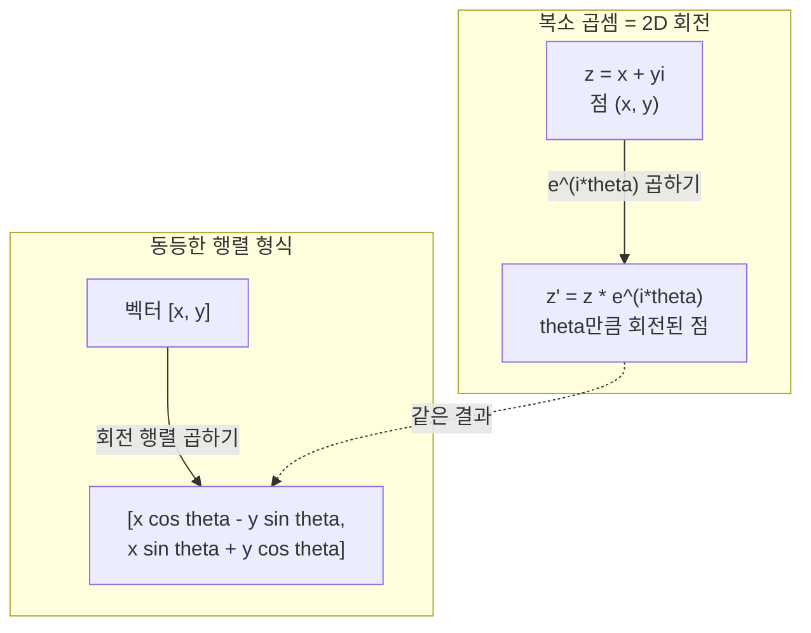
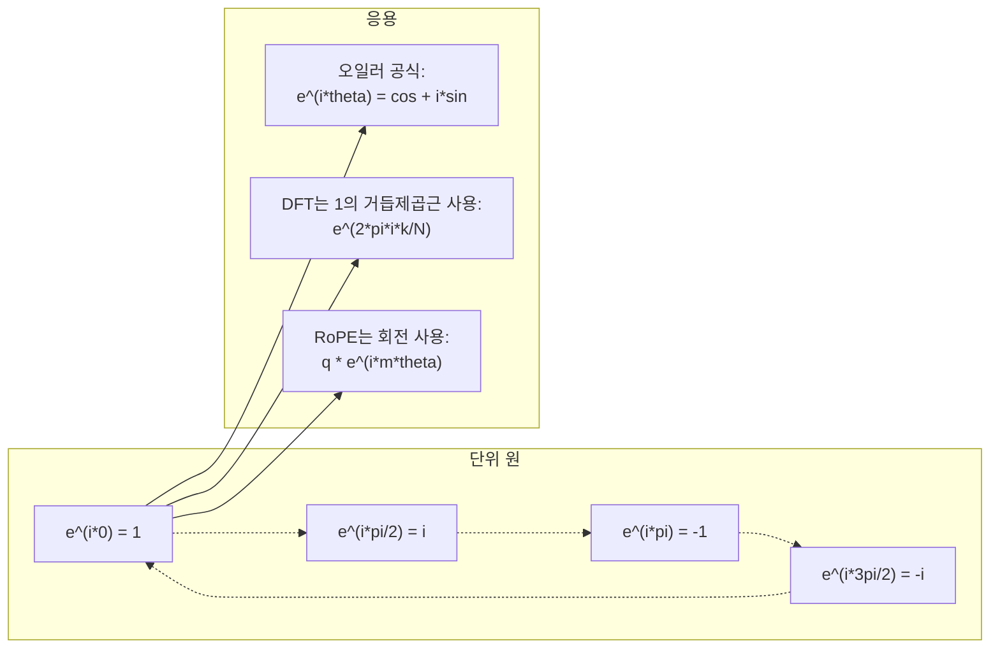

# AI를 위한 복소수

> -1의 제곱근은 허상이 아닙니다. 회전, 주파수, 신호 처리의 절반을 여는 열쇠입니다.

**유형:** 학습
**언어:** Python
**선수 과목:** Phase 1, Lessons 01-04 (선형대수, 미분적분학)
**소요 시간:** ~60분

## 학습 목표

- 직사각형 형식과 극 형식 모두에서 복소수 산술(덧셈, 곱셈, 나눗셈, 켤레) 수행하기
- 오일러 공식을 적용하여 복소 지수와 삼각 함수 간 변환하기
- 단위근을 사용하여 이산 푸리에 변환 구현하기
- 복소 회전이 트랜스포머에서 RoPE 및 사인파 위치 인코딩의 기반이 되는 방식 설명하기

## 문제

푸리에 변환 논문을 열면 모든 곳에 `i`가 있습니다. 트랜스포머 위치 인코딩을 보면 서로 다른 주파수의 `sin`과 `cos` -- 복소 지수의 실수부와 허수부입니다. 양자 컴퓨팅을 읽으면 모든 것이 복소 벡터 공간으로 표현됩니다.

복소수는 추상적으로 보입니다. -1의 제곱근에 기반한 수 체계는 수학적 트릭처럼 느껴집니다. 하지만 트릭이 아닙니다. 회전과 진동의 자연스러운 언어입니다. 무언가가 회전하거나, 진동하거나, 진동할 때마다 복소수가 올바른 도구입니다.

복소수를 이해하지 않으면 이산 푸리에 변환을 이해할 수 없습니다. FFT를 이해할 수 없습니다. 최신 언어 모델에서 RoPE(Rotary Position Embedding)가 어떻게 작동하는지 이해할 수 없습니다. 원래 Transformer 논문에서 사인파 위치 인코딩이 왜 그런 주파수를 사용하는지 이해할 수 없습니다.

이 수업은 복소수 산술을 처음부터 구축하고, 이를 기하학과 연결하며, 머신러닝에서 복소수가 정확히 어디에 나타나는지 보여줍니다.

## 개념

### 복소수란?

복소수는 두 부분으로 구성됩니다: 실수부와 허수부.

```
z = a + bi

여기서:
  a는 실수부
  b는 허수부
  i는 허수 단위로, i^2 = -1로 정의됨
```

이것이 전부입니다. 수직선을 평면으로 확장합니다. 실수는 한 축에 있고, 허수들은 다른 축에 있습니다. 모든 복소수는 이 평면의 한 점입니다.

### 복소수 산술

**덧셈.** 실수부를 더하고, 허수부를 더합니다.

```
(a + bi) + (c + di) = (a + c) + (b + d)i

예제: (3 + 2i) + (1 + 4i) = 4 + 6i
```

**곱셈.** 분배 법칙을 사용하고 i^2 = -1임을 기억합니다.

```
(a + bi)(c + di) = ac + adi + bci + bdi^2
                 = ac + adi + bci - bd
                 = (ac - bd) + (ad + bc)i

예제: (3 + 2i)(1 + 4i) = 3 + 12i + 2i + 8i^2
                        = 3 + 14i - 8
                        = -5 + 14i
```

**켤레.** 허수부의 부호를 반전합니다.

```
(a + bi)의 켤레 = a - bi
```

복소수와 그 켤레의 곱은 항상 실수입니다:

```
(a + bi)(a - bi) = a^2 + b^2
```

**나눗셈.** 분모의 켤레를 분자, 분모 모두에 곱합니다.

```
(a + bi) / (c + di) = (a + bi)(c - di) / (c^2 + d^2)
```

이렇게 하면 분모에서 허수부가 제거되어 깔끔한 복소수가 됩니다.

### 복소 평면

복소 평면은 모든 복소수를 2D 점으로 매핑합니다. 가로축은 실수축, 세로축은 허수축입니다.

```
z = 3 + 2i  → 점 (3, 2)
z = -1 + 0i → 실수축 위의 점 (-1, 0)
z = 0 + 4i  → 허수축 위의 점 (0, 4)
```

복소수는 동시에 한 점이고 원점에서의 벡터입니다. 이 중복 해석이 복소수를 기하학에 유용하게 만듭니다.

### 극 형식

평면의 모든 점은 원점에서의 거리와 양의 실수축에서의 각도로 설명할 수 있습니다.

```
z = r * (cos(theta) + i*sin(theta))

여기서:
  r = |z| = sqrt(a^2 + b^2)     (크기, 또는 절대값)
  theta = atan2(b, a)             (위상, 또는 편각)
```

직사각형 형식 (a + bi)은 덧셈에 적합합니다. 극 형식 (r, theta)은 곱셈에 적합합니다.

**극 형식에서의 곱셈.** 크기를 곱하고, 각도를 더합니다.

```
z1 = r1 * e^(i*theta1)
z2 = r2 * e^(i*theta2)

z1 * z2 = (r1 * r2) * e^(i*(theta1 + theta2))
```

이것이 복소수가 회전에 완벽한 이유입니다. 크기 1인 복소수를 곱하는 것은 순수 회전입니다.

### 오일러 공식

복소 지수와 삼각법 사이의 다리:

```
e^(i*theta) = cos(theta) + i*sin(theta)
```

이 수업에서 가장 중요한 공식입니다. theta = pi일 때:

```
e^(i*pi) = cos(pi) + i*sin(pi) = -1 + 0i = -1

따라서: e^(i*pi) + 1 = 0
```

다섯 가지 기본 상수 (e, i, pi, 1, 0)가 하나의 등식에 연결됩니다.

### 오일러 공식이 ML에 중요한 이유

오일러 공식에 따르면 `e^(i*theta)`는 theta가 변할 때 단위 원을 따라 움직입니다. theta = 0에서 (1, 0)입니다. theta = pi/2에서 (0, 1)입니다. theta = pi에서 (-1, 0)입니다. theta = 3*pi/2에서 (0, -1)입니다. 완전 회전은 theta = 2*pi입니다.

이는 복소 지수가 회전이라는 의미입니다. 그리고 회전은 신호 처리와 ML에서到处都是.

### 2D 회전과의 연결

복소수 (x + yi)에 e^(i*theta)를 곱하면 점 (x, y)가 원점을 중심으로 각도 theta만큼 회전합니다.

```
복소 곱셈을 통한 회전:
  (x + yi) * (cos(theta) + i*sin(theta))
  = (x*cos(theta) - y*sin(theta)) + (x*sin(theta) + y*cos(theta))i

행렬 곱셈을 통한 회전:
  [cos(theta)  -sin(theta)] [x]   [x*cos(theta) - y*sin(theta)]
  [sin(theta)   cos(theta)] [y] = [x*sin(theta) + y*cos(theta)]
```

결과가 동일합니다. 복소 곱셈은 2D 회전입니다. 회전 행렬은 행렬 표기법으로 쓴 복소 곱셈일 뿐입니다.



### 위상자와 회전 신호

복소 지수 e^(i*omega*t)는 각 주파수 omega로 단위 원을 따라 회전하는 점입니다. t가 증가함에 따라 점이 원을 따라轨迹를 남깁니다.

이 회전 점의 실수부는 cos(omega*t)입니다. 허수부는 sin(omega*t)입니다. 정현파 신호는 회전하는 복소수의 그림자입니다.

```
e^(i*omega*t) = cos(omega*t) + i*sin(omega*t)

실수부:      cos(omega*t)    -- 코사인파
허수부: sin(omega*t)    -- 사인파
```

이것이 위상자 표현입니다. 흔들리는 사인파를 추적하는 대신, 부드럽게 회전하는 화살표를 추적합니다. 위상 이동은 각도 오프셋이 됩니다. 진폭 변화는 크기 변화가 됩니다. 신호의 덧셈은 벡터 덧셈이 됩니다.

### 1의 거듭제곱근

N번째 1의 거듭제곱근은 단위 원 위에 균등하게 배치된 N개의 점입니다:

```
w_k = e^(2*pi*i*k/N)    k = 0, 1, 2, ..., N-1에 대해
```

N = 4에 대해: 1, i, -1, -i (네 방향). N = 8에 대해: 네 방향에 네 대각선이 추가됩니다.

1의 거듭제곱근은 이산 푸리에 변환의 기반입니다. DFT는 신호를 이러한 N개의 균등하게 간격된 주파수의 성분으로 분해합니다.

### DFT와의 연결

신호 x[0], x[1], ..., x[N-1]의 이산 푸리에 변환:

```
X[k] = sum_{n=0}^{N-1} x[n] * e^(-2*pi*i*k*n/N)
```

각 X[k]는 주파수 k에서 복소 사인파에 대한 신호의 상관관계를 측정합니다. DFT는 신호를 N개의 회전 위상자로 분해하고 각각의 진폭과 위상을 알려줍니다.

### i가 허수가 아닌 이유

"허수"라는 단어는 역사적 사고 accident입니다. 데카르트가 경멸적으로 사용했습니다. 하지만 i는否定数を впер웠을 때人们가それを拒否した 것처럼 허수가 아닙니다. 부정수는 "3에서 5를 빼면 무엇인가?"에 대한 답입니다. 허수 단위는 "어떤 것을 제곱하면 -1이 되는가?"에 대한 답입니다.

더 유용하게: i는 90도 회전 연산자입니다. 실수에 한 번 i를 곱하면 90도 회전하여 허수축에 도달합니다. 다시 i를 곱하면(i^2), 또 90도 회전 -- 이제 음수 실수 방향을 가리킵니다. 그것이 i^2 = -1인 이유입니다. 신비한 것이 아닙니다. 두 개의 4분면 회전으로 구성된 반회전입니다.

이것이 복소수가 공학에서到处都是 이유입니다. 회전하는 것 -- 전자기파, 양자 상태, 신호 진동, 위치 인코딩 -- 은 자연스럽게 복소수로 설명됩니다.

### 복소 지수 vs 삼각 함수

오일러 공식 이전, 공학자들은 신호를 A*cos(omega*t + phi)로 썼습니다 -- 진폭 A, 주파수 omega, 위상 phi. 이것은 작동하지만 산술이 고통스럽습니다. 다른 위상의 두 코사인을 더하려면 삼각恒等式이 필요합니다.

복소 지수를 사용하면 같은 신호는 A*e^(i*(omega*t + phi))입니다. 두 신호를 더하는 것은 두 복소수를 더하는 것입니다. 곱하기(변조)는 크기를 곱하고 각도를 더하는 것입니다. 위상 이동은 각도 덧셈이 됩니다. 주파수 이동은 위상자 곱셈이 됩니다.

신호 처리 전체가 수학이 더 깔끔하기 때문에 복소 지수 표기법으로 전환했습니다. "실수 신호"는 항상 복소 표현의 실수부일 뿐입니다. 허수부는 함께運ばれて 모든 대수가 자연스럽게 작동하도록 합니다.

### 트랜스포머와의 연결

**사인파 위치 인코딩** (원래 Transformer 논문):

```
PE(pos, 2i) = sin(pos / 10000^(2i/d))
PE(pos, 2i+1) = cos(pos / 10000^(2i/d))
```

sin과 cos 쌍은 서로 다른 주파수의 복소 지수의 실수부와 허수부입니다. 각 주파수는 위치를 인코딩하는 서로 다른 "해상도"를 제공합니다. 낮은 주파수는 천천히 변합니다(粗糙 위치). 높은 주파수는 빠르게 변합니다(세밀한 위치). 함께 각 위치에 고유한 주파수 지문을줍니다.

**RoPE (회전 위치 임베딩)**는 이를 더 발전시킵니다. 쿼리 및 키 벡터에 복소 회전 행렬을 명시적으로 곱합니다. 두 토큰 간의 상대 위치는 회전 각도가 됩니다. 주의는 이러한 회전된 벡터를 사용하여 계산되어, 모델이 복소 곱셈을 통해 상대 위치에 민감하게 됩니다.

| 연산 | 대수적 형식 | 기하학적 의미 |
|-----------|---------------|-------------------|
| 덧셈 | (a+c) + (b+d)i | 평면에서 벡터 덧셈 |
| 곱셈 | (ac-bd) + (ad+bc)i | 회전하고 스케일 조절 |
| 켤레 | a - bi | 실수축에 대해 대칭 반영 |
| 크기 | sqrt(a^2 + b^2) | 원점에서의 거리 |
| 위상 | atan2(b, a) | 양의 실수축에서의 각도 |
| 나눗셈 | 켤레를 곱하기 | 회전 되돌리고 스케일 조절 |
| 거듭제곱 | r^n * e^(i*n*theta) | n번 회전, r^n만큼 스케일 조절 |



## 실습

### 단계 1: 복소수 클래스

산술, 크기, 위상을 지원하고 직사각형과 극 형식 간 변환하는 복소수 클래스를 구축합니다.

```python
import math

class Complex:
    def __init__(self, real, imag=0.0):
        self.real = real
        self.imag = imag

    def __add__(self, other):
        return Complex(self.real + other.real, self.imag + other.imag)

    def __mul__(self, other):
        r = self.real * other.real - self.imag * other.imag
        i = self.real * other.imag + self.imag * other.real
        return Complex(r, i)

    def __truediv__(self, other):
        denom = other.real ** 2 + other.imag ** 2
        r = (self.real * other.real + self.imag * other.imag) / denom
        i = (self.imag * other.real - self.real * other.imag) / denom
        return Complex(r, i)

    def magnitude(self):
        return math.sqrt(self.real ** 2 + self.imag ** 2)

    def phase(self):
        return math.atan2(self.imag, self.real)

    def conjugate(self):
        return Complex(self.real, -self.imag)
```

### 단계 2: 극 변환과 오일러 공식

```python
def to_polar(z):
    return z.magnitude(), z.phase()

def from_polar(r, theta):
    return Complex(r * math.cos(theta), r * math.sin(theta))

def euler(theta):
    return Complex(math.cos(theta), math.sin(theta))
```

확인: `euler(theta).magnitude()`는 항상 1.0이어야 합니다. `euler(0)`은 (1, 0)을 giving해야 합니다. `euler(pi)`은 (-1, 0)을 giving해야 합니다.

### 단계 3: 회전

점 (x, y)를 각도 theta만큼 회전하는 것은 하나의 복소 곱셈입니다:

```python
point = Complex(3, 4)
rotated = point * euler(math.pi / 4)
```

크기는 동일하게 유지됩니다. 각도만 변경됩니다.

### 단계 4: 복소 산술からの DFT

```python
def dft(signal):
    N = len(signal)
    result = []
    for k in range(N):
        total = Complex(0, 0)
        for n in range(N):
            angle = -2 * math.pi * k * n / N
            total = total + Complex(signal[n], 0) * euler(angle)
        result.append(total)
    return result
```

이는 O(N^2) DFT입니다. 각 출력 X[k]는 1의 거듭제곱근에 곱해진 신호 샘플의 합입니다.

### 단계 5: 역 DFT

역 DFT는 스펙트럼에서 원래 신호를 재구성합니다. 순방향 DFT와의 유일한 차이: 지수의 부호를 반전하고 N으로 나눕니다.

```python
def idft(spectrum):
    N = len(spectrum)
    result = []
    for n in range(N):
        total = Complex(0, 0)
        for k in range(N):
            angle = 2 * math.pi * k * n / N
            total = total + spectrum[k] * euler(angle)
        result.append(Complex(total.real / N, total.imag / N))
    return result
```

이것으로 완전한 재구성이 가능합니다. DFT를 적용한 다음 IDFT를 적용하면 시스템 정밀도로 원래 신호를 다시 얻습니다. 정보가 손실되지 않습니다.

### 단계 6: 1의 거듭제곱근

```python
def roots_of_unity(N):
    return [euler(2 * math.pi * k / N) for k in range(N)]
```

두 가지 속성을 확인합니다:
- 모든 근의 크기가 정확히 1입니다.
- 모든 N개의 근의 합은 0입니다 (대칭으로 상쇄됨).

이러한 속성이 DFT를 역변환 가능하게 만듭니다. 1의 거듭제곱근은 주파수 도메인의 정규 직교 기저를 형성합니다.

## 활용

Python은 내장 복소수 지원을 제공합니다. 리터럴 `j`가 허수 단위를 나타냅니다.

```python
z = 3 + 2j
w = 1 + 4j

print(z + w)
print(z * w)
print(abs(z))

import cmath
print(cmath.phase(z))
print(cmath.exp(1j * cmath.pi))
```

배열의 경우, numpy는 기본적으로 복소수를 처리합니다:

```python
import numpy as np

z = np.array([1+2j, 3+4j, 5+6j])
print(np.abs(z))
print(np.angle(z))
print(np.conj(z))
print(np.real(z))
print(np.imag(z))

signal = np.sin(2 * np.pi * 5 * np.linspace(0, 1, 128))
spectrum = np.fft.fft(signal)
freqs = np.fft.fftfreq(128, d=1/128)
```

## 결과물

`code/complex_numbers.py`를 실행하여 `outputs/skill-complex-arithmetic.md`를 생성합니다.

## 연습 문제

1. **복소수 산술 손으로 하기.** (2 + 3i) * (4 - i)를 계산하고 코드로 확인하세요. 그런 다음 (5 + 2i) / (1 - 3i)를 계산하세요. 두 결과를 복소 평면에 그리고 곱셈이 첫 번째 수를 회전하고 스케일 조절했는지 확인하세요.

2. **회전 시퀀스.** 점 (1, 0)에서 시작합니다. e^(i*pi/6)을 12번 곱하세요. 12번의 곱셈 후 (1, 0)로 돌아오는지 확인하세요. 각 단계에서 좌표를 인쇄하고 정규 12각형을 trace하는지 확인하세요.

3. **알려진 신호의 DFT.** 32개의 점에서 샘플링된 0.5*sin(2*pi*7*t)의 합인 신호를 만드세요. DFT를 실행하세요. 크기 스펙트럼에 주파수 3과 7에서 피크가 있고, 7에서의 피크가 3에서의 피크의 절반 높이인지 확인하세요.

4. **1의 거듭제곱근 시각화.** 8번째 1의 거듭제곱근을 계산하세요.它们的합이 0인지 확인하세요. 어떤 근에든 원시 근 e^(2*pi*i/8)을 곱하면 다음 근이 되는지 확인하세요.

5. **회전 행렬 동등성.** 10개의 무작위 각도와 10개의 무작위 점에 대해, 복소 곱셈이 2x2 회전 행렬과의 행렬-벡터 곱셈과 동일한 결과를 주는지 확인하세요. 최대 수치 차이를 인쇄하세요.

## 핵심 용어

| 용어 | 의미 |
|------|---------------|
| 복소수 | a + bi形式的数で、a는 실수부, b는 허수부, i^2 = -1 |
| 허수 단위 | i^2 = -1로 정의된 수 i. 철학적으로 허수가 아니라 회전 연산자 |
| 복소 평면 | x축이 실수이고 y축이 허수인 2D 평면. 아르강 평면이라고도 함 |
| 크기 (절대값) | 원점에서의 거리: sqrt(a^2 + b^2). \|z\|로 표기 |
| 위상 (편각) | 양의 실수축에서의 각도: atan2(b, a). arg(z)로 표기 |
| 켤레 | 실수축에 대한 거울 상: a + bi의 켤레는 a - bi |
| 극 형식 | z를 a + bi 대신 r * e^(i*theta)로 표현. 곱셈이 쉬움 |
| 오일러 공식 | e^(i*theta) = cos(theta) + i*sin(theta). 지수와 삼각법을 연결 |
| 위상자 | 정현파 신호를 나타내는 회전하는 복소수 e^(i*omega*t) |
| 1의 거듭제곱근 | k = 0에서 N-1까지의 e^(2*pi*i*k/N). 단위 원에서 N개의 균등하게 간격된 점 |
| DFT | 이산 푸리에 변환. 1의 거듭제곱근을 사용하여 신호를 복소 사인파 성분으로 분해 |
| RoPE | 회전 위치 임베딩. 복소 곱셈을 사용하여 트랜스포머 주의에서 상대 위치를 인코딩 |

## 추가 자료

- [Visual Introduction to Euler's Formula](https://betterexplained.com/articles/intuitive-understanding-of-eulers-formula/) - 무거운 표기법 없이 기하학적 직관을 구축
- [Su et al.: RoFormer (2021)](https://arxiv.org/abs/2104.09864) - 복소 회전을 사용하는 회전 위치 임베딩을 도입한 논문
- [Vaswani et al.: Attention Is All You Need (2017)](https://arxiv.org/abs/1706.03762) - 사인파 위치 인코딩이 있는 원래 Transformer 논문
- [3Blue1Brown: Euler's formula with introductory group theory](https://www.youtube.com/watch?v=mvmuCPvRoWQ) - e^(i*pi) = -1인 이유에 대한 시각적 설명
- [Needham: Visual Complex Analysis](https://global.oup.com/academic/product/visual-complex-analysis-9780198534464) - 복소수의 가장 좋은 시각적 처리, 기하학적 통찰력으로 가득
- [Strang: Introduction to Linear Algebra, Ch. 10](https://math.mit.edu/~gs/linearalgebra/) - 선형대수와 고윳값의 맥락에서 복소수