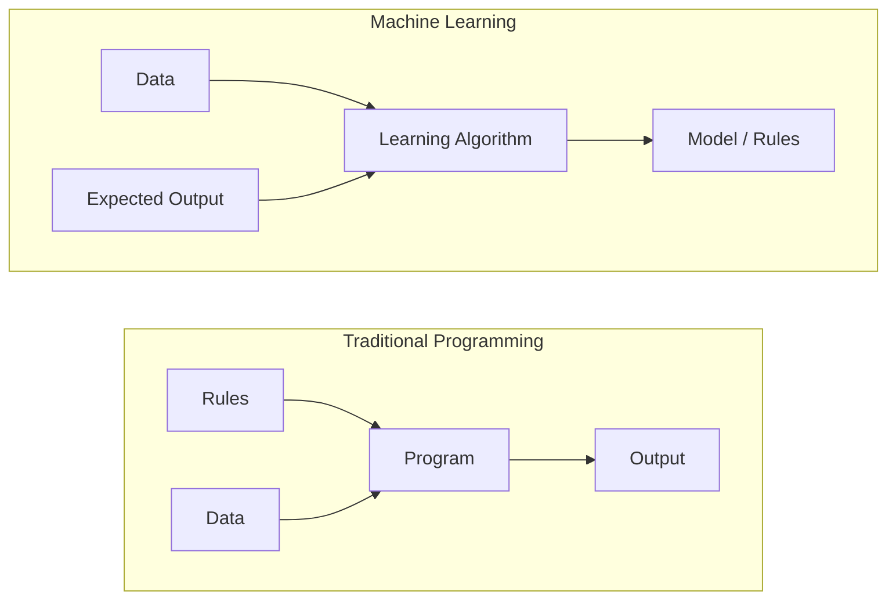
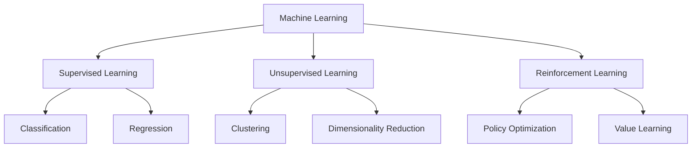
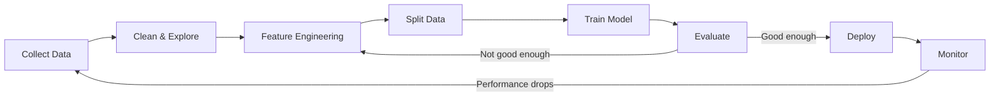
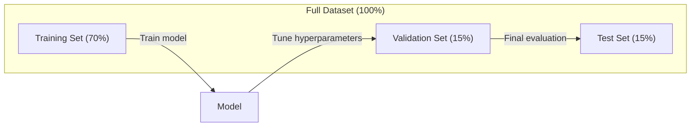
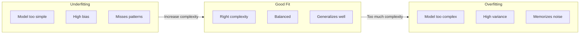

# 머신러닝이란

> 머신러닝은 수작업 규칙 대신 데이터에서 패턴을 찾도록 컴퓨터를 가르치는 것이다.

**유형:** 학습
**언어:** Python
**선수:** Phase 1 (수학 기초)
**소요 시간:** ~45분

## 학습 목표

- 지도 학습, 비지도 학습, 강화 학습의 차이를 설명하고, 주어진 문제에 어떤 유형이 적용되는지 식별한다
- 최근접 중심 분류기를 처음부터 구현하고 무작위 기준선과 비교 평가한다
- 분류와 회귀 작업을 구분하고 각각에 적합한 손실 함수를 선택한다
- 주어진 비즈니스 문제가 ML에 적합한지, 아니면 결정론적 규칙으로 해결하는 것이 더 나은지 평가한다

## 문제

스팸 필터를 만들고 싶다. 전통적인 접근 방식: 앉아서 수백 개의 규칙을 작성한다. "이메일에 '공짜 돈'이 포함되어 있으면 스팸으로 표시. 느낌표가 3개 이상이면 스팸." 몇 주 동안 규칙을 작성한다. 그러다 스패머가 문구를 바꾼다. 규칙이 깨진다. 더 많은 규칙을 작성한다. 이 순환은 끝나지 않는다.

머신러닝은 이것을 뒤집는다. 규칙을 작성하는 대신, 컴퓨터에 수천 개의 레이블이 지정된 이메일("스팸" 또는 "스팸 아님")을 제공하여 컴퓨터가 스스로 규칙을 알아내게 한다. 컴퓨터는 당신이 생각하지 못했을 패턴을 찾아낸다. 스패머가 전술을 바꾸면, 코드를 다시 작성하는 대신 새로운 데이터로 재훈련한다.

"규칙 프로그래밍"에서 "데이터로부터 학습"으로의 이 전환이 머신러닝의 핵심이다. 모든 추천 엔진, 음성 비서, 자율 주행 자동차, 언어 모델이 이렇게 작동한다.

## 개념

### 규칙이 아닌 데이터로부터 학습

전통적인 프로그래밍과 머신러닝은 정반대 방향으로 문제를 해결한다.



전통적 프로그래밍: 규칙을 작성한다. 프로그램이 데이터에 규칙을 적용하여 출력을 생성한다.

머신러닝: 데이터와 예상 출력을 제공한다. 알고리즘이 규칙을 발견한다.

훈련으로 나오는 "모델"이 규칙そのものである, 숫자로 인코딩된다(가중치, 매개변수). 본 적이 있는 예제로부터 일반화하여 본 적이 없는 데이터에 대한 예측을 수행한다.

### 머신러닝의 세 가지 유형



**지도 학습**: 입력-출력 쌍이 있다. 모델이 입력을 출력에 매핑하는 것을 학습한다.
- "고양이 또는 개로 레이블된 10,000장 사진이 있다. 그것들을 구별하는 방법을 학습한다."
- "집 특징과 가격이 있다. 가격을 예측하는 방법을 학습한다."

**비지도 학습**: 입력만 있다. 레이블 없음. 모델이 스스로 구조를 발견한다.
- "10,000개의 고객 구매 기록이 있다. 자연스러운 그룹을 찾는다."
- "1,000 차원 데이터 포인트가 있다. 구조를 유지하면서 2 차원으로 축소한다."

**강화 학습**: 에이전트가 환경에서 행동을 취하고 보상 또는 페널티를 받는다. 총 보상을 최대화하기 위한 전략(정책)을 학습한다.
- "이 게임을 한다. 이기면 +1, 지면 -1. 전략을 알아낸다."
- "이 로봇 팔을 제어한다. 물체를 들면 +1, 낭비된 각 초마다 -0.01."

실무에서 구축할 대부분의 것은 지도 학습을 사용한다. 비지도 학습은 전처리 및 탐색에 일반적입니다. 강화 학습은 게임 AI, 로보틱스, 언어 모델용 RLHF를 구동합니다.

### 세 가지 큰 범주를 넘어서

위 세 가지 범주는 깔끔하지만, 실제 ML은 종종 선을 흐린다.

**반지도 학습**은 소규모 레이블이 지정된 데이터와 대규모 레이블이 지정되지 않은 데이터를 사용한다. 레이블된 100개 의료 이미지와 레이블이 지정되지 않은 100,000개가 있을 수 있다. 기법은 다음을 포함한다:

- **레이블 전파:** 유사한 데이터 포인트를 연결하는 그래프를 구축한다. 레이블이 그래프를 통해 레이블이 지정된 노드에서 레이블이 지정되지 않은 이웃으로 전파된다.
- **의사 레이블링:** 레이블이 지정된 데이터에서 모델을 훈련하고, 그것을 사용하여 레이블이 지정되지 않은 데이터에 대한 레이블을 예측한 다음, 모든 것으로 재훈련한다. 모델이 자체 훈련 세트를 부트스트랩한다.
- **일관성 정규화:** 모델은 입력과稍微 perturbation된 버전의 입력에 대해 동일한 예측을 제공해야 한다. 이것은 레이블 없이도 작동한다.

**자기지도 학습**은 데이터 자체에서 수퍼비전을 생성한다. 인간 레이블이 전혀 필요하지 않다. 모델이 데이터 구조에서 자체 예측 작업을 생성한다.

- **마스킹 언어 모델링 (BERT):** 문장에서 15%의 단어를 숨기고 숨겨진 단어를 예측하도록 모델을 훈련한다. "레이블"은 원본 텍스트에서 온다.
- **대조 학습 (SimCLR):** 이미지를 가져와 두 개의 증강 버전을 만든다. 모델을 훈련하여 동일한 이미지에서 왔음을 인식的同时 다른 이미지의 증강 버전과 구별한다.
- **다음 토큰 예측 (GPT):** 이전 모든 단어가 주어졌을 때 다음 단어를 예측한다. 모든 텍스트 문서가 훈련 예제가 된다.

이것들은 세 가지 큰 범주와 별도의 범주가 아니다. 지도 및 비지도 아이디어를 결합하는 전략이다. 자기지도 학습은 기술적으로 지도 학습이다(모델이 무언가를 예측한다), 그러나 레이블이 인간이 아닌 자동으로 생성된다.

### 분류 vs 회귀

이것들은 두 가지主要的 지도 학습 작업이다.

| 측면 | 분류 | 회귀 |
|------|---------------|------------|
| 출력 | 이산 범주 | 연속 숫자 |
| 예시 | "이 이메일은 스팸인가?" | "집 가격은 얼마가 될까?" |
| 출력 공간 | {고양이, 개, 새} | 모든 실수 |
| 손실 함수 | 교차 엔트로피, 정확도 | 평균 제곱 오차, MAE |
| 결정 | 클래스 간의 경계 | 데이터에 맞는 곡선 |

분류는 "어떤 범주?"라고 답한다. 회귀는 "얼마나?"라고 답한다.

일부 문제는 두 가지 방식으로 framing될 수 있다. 주가가 상승 또는 하락하는지 예측하는 것은 분류이다. 정확한 가격을 예측하는 것은 회귀이다.

### ML 워크플로우

모든 머신러닝 프로젝트는 알고리즘에 관계없이 동일한 파이프라인을 따른다.



**데이터 수집**: 원시 데이터를 수집한다. 더 많은 데이터가Almost 항상 더 좋지만, 품질이 양보다更重要한다.

**정리 및 탐색**: 결측치를 처리하고, 중복을 제거하고, 분포를 시각화하고, 이상을 발견한다. 이 단계는 종종 총 프로젝트 시간의 60-80%를 소비한다.

**특성 공학**: 원시 데이터를 모델이 사용할 수 있는 특성으로 변환한다. 날짜를 요일로 변환한다. 수치 열을 정규화한다. 범주형 변수를 인코딩한다. 좋은 특성이 fancy 알고리즘보다更重要한다.

**데이터 분할**: 훈련, 검증, 테스트 세트로 분할한다. 모델이 훈련 데이터에서 훈련하고, 하이퍼파라미터를 튜닝하고, 테스트 데이터에서 최종 성능을 보고한다.

**모델 훈련**: 훈련 데이터를 알고리즘에 공급한다. 알고리즘이 손실 함수를 최소화하도록 내부 매개변수를 조정한다.

**평가**: 검증/테스트 데이터에서 성능을 측정한다. 성능이 容認할 수 없으면 다른 특성, 알고리즘 또는 하이퍼파라미터를 시도하기 위해 돌아간다.

**배포**: 모델을 새 데이터에 대한 예측을 수행하는 프로덕션에 배치한다.

**모니터링**: 시간에 따른 성능을 추적한다. 데이터 분포가 변경되고(데이터 드리프트), 모델이 저하된다. 성능이 저하되면 재훈련한다.

### 훈련, 검증, 테스트 분할

초보자가 가장 많이 틀리는 중요한 개념이다. 훈련 중 본 적 없는 데이터에서 모델을 평가해야 한다. 그렇지 않으면 기억을 측정하는 것이지 학습을 측정하는 것이 아니다.



| 분할 | 목적 | 사용 시기 | 일반적인 크기 |
|------|------|-----------|-------------|
| 훈련 | 모델이 이 데이터에서 학습 | 훈련 중 | 60-80% |
| 검증 | 하이퍼파라미터 튜닝, 모델 비교 | 각 훈련 실행 후 | 10-20% |
| 테스트 | 최종 편향되지 않은 성능 추정 | 한 번, 가장 마지막에 | 10-20% |

테스트 세트는神圣하다. 정확히 한 번 본다. 테스트 성능에 따라 모델을 계속 조정하면 효과적으로 테스트 세트에서 훈련하는 것이고 보고된 숫자는 의미가 없다.

작은 데이터셋의 경우 k-폴드 교차 검증을 사용한다: 데이터를 k개의 파트로 분할하고, k-1 파트에서 훈련하고, 남은 파트에서 검증하고, 회전하고, 결과를 평균한다.

### 과적합 vs 과소적합



**과소적합**: 모델이 너무 단순하여 데이터의 패턴을 포착할 수 없다. 곡선 관계에 직선을 피팅하려는 것. 훈련 오차가 높다. 테스트 오차가 높다.

**과적합**: 모델이 너무 복잡하여 훈련 데이터, 노이즈를 포함하여 기억한다. 모든 훈련 포인트를 통과하는 굴곡진 곡선이지만 새 데이터에서 실패한다. 훈련 오차가 낮다. 테스트 오차가 높다.

**적합**: 모델이 노이즈를 기억하지 않고 실제 패턴을 포착한다. 훈련 오차와 테스트 오차 둘 다 상당히 낮다.

과적합의 징후:
- 훈련 정확도가 검증 정확도보다 훨씬 높다
- 모델이 훈련 데이터에서 잘 수행하지만 새 데이터에서 Poorly 수행한다
- 더 많은 훈련 데이터를 추가하면 성능이 개선된다(모델이 학습하는 것이 아니라 기억하고 있었다)

과적합 수정:
- 더 많은 훈련 데이터 확보
- 모델 복잡도 감소(더 적은 매개변수, 더 단순한 아키텍처)
- 정규화(큰 가중치에 페널티 추가)
- 드롭아웃(훈련 중 무작위로 뉴런을 0으로 설정)
- 조기 종료(검증 오차가 증가하기 시작하면 훈련 중지)

과소적합 수정:
- 더 복잡한 모델 사용
- 더 많은 특성 추가
- 정규화 감소
- 더 오래 훈련

### 편향-분산 트레이드오프

이것은 과적합과 과소적합 뒤의 수학적 프레임워크이다.

**편향**: 모델의 잘못된 가정에서 비롯된 오차. 진짜 관계가 비선형일 때 선형 모델은 높은 편향을 가진다. 높은 편향은 과소적합으로 이어진다.

**분산**: 훈련 데이터의 작은 변동에 대한 민감도에서 비롯된 오차. 높은 분산을 가진 모델은 데이터의 다른 부분집합에서 훈련될 때 매우 다른 예측을 제공한다. 높은 분산은 과적합으로 이어진다.

| 모델 복잡도 | 편향 | 분산 | 결과 |
|-----------------|------|----------|--------|
| 너무 낮음 (곡선 데이터에 선형 모델) | 높음 | 낮음 | 과소적합 |
| 적절함 | 중간 | 중간 | 좋은 일반화 |
| 너무 높음 (10개 포인트에 차수 20 다항식) | 낮음 | 높음 | 과적합 |

총 오차 = 편향^2 + 분산 + 불가역적 노이즈

불가역적 노이즈는 줄일 수 없다(데이터 자체의 무작위성이다). 편향^2 + 분산이 최소화되는 스위트 스팟을 찾아야 한다.

### 무료 점심 정리 정리

어떤 알고리즘도 모든 가능한 문제에 대해比其他 algorithml 더 낫지 않다. 특정 문제에 대한 prior 정보가 있으면 그것을 활용하는 알고리즘이 더 나을 수 있다. 하지만 prior 정보가 없으면 모든 알고리즘의 평균 성능은 동일하다.

### 언제 ML을 사용하고 언제 규칙을 사용するか

ML이 아닌 것이 있다:

- **결정론적 규칙이 명확한 경우**: 세금 계산, 날짜 계산, 문법 검사. ML로 시도하지 마라.
- **실패 비용이 매우 높은 경우**: 자율주행 빗길 운송, 의료 결정. ML 예측이 잘못될 수 있으므로 주의해야 한다.
- **설명 가능성이 필요한 경우**: 대출 승인, 채용 결정. 모델이 왜 그렇게 예측했는지 설명할 수 있어야 한다.
- **데이터가 충분히 없는 경우**: 좋은 ML 모델에는 수천 개의 예제가 필요합니다.

ML이 적합한 경우:
- 패턴이 너무 복잡하여 수동으로 코딩할 수 없음
- 규칙이 계속 changing됨 (스팸, 사기)
- 많은 데이터가 있음
- 실패 비용이 낮거나人可以介入할 수 있음

## 구현

### 最近접 중심 분류기

각 클래스의 평균 벡터(중심)를 계산하고, 새로운 포인트를 가장 가까운 중심에 할당합니다:

```python
def fit_centroid_classifier(X, y):
    classes, counts = np.unique(y, return_counts=True)
    centroids = []
    for c in classes:
        X_c = X[y == c]
        centroids.append(X_c.mean(axis=0))
    return np.array(centroids), classes

def predict_centroid_classifier(X, centroids, classes):
    predictions = []
    for x in X:
        distances = [np.linalg.norm(x - c) for c in centroids]
        nearest = np.argmin(distances)
        predictions.append(classes[nearest])
    return np.array(predictions)
```

## 활용

scikit-learn과 함께:

```python
from sklearn.neighbors import NearestCentroid
from sklearn.datasets import make_classification

X, y = make_classification(n_samples=100, n_features=2, n_informative=2, n_redundant=0, random_state=42)

clf = NearestCentroid()
clf.fit(X, y)
predictions = clf.predict(X_test)
```

## 핵심 용어

| 용어 | 실제 의미 |
|------|----------------------|
| 지도 학습 | 레이블이 지정된 입력-출력 쌍에서 학습하는 ML 유형 |
| 비지도 학습 | 레이블 없이 데이터에서 구조를 발견하는 ML 유형 |
| 강화 학습 | 보상을 최대화하기 위해 환경에서 학습하는 ML 유형 |
| 분류 | 입력을 이산 범주에 매핑하는 작업 |
| 회귀 | 입력을 연속 값에 매핑하는 작업 |
| 과적합 | 모델이 훈련 데이터를 기억하고 일반화하지 못하는 현상 |
| 과소적합 | 모델이 너무 단순하여 패턴을 포착하지 못하는 현상 |
| 편향 | 모델의 잘못된 가정에서 비롯된 오차 |
| 분산 | 훈련 데이터 변동에 대한 민감도에서 비롯된 오차 |
| 일반화 | 훈련 데이터에 보지 못한 데이터에 대해 잘 수행하는 능력 |
| 특성 | 모델에 대한 입력 변수 |
| 레이블 | 예측하려는 대상 변수 |
| 손실 함수 | 최적화하기 위한 오차 측정 |

## 추가 자료

- [Andrew Ng의 Coursera ML 과정](https://www.coursera.org/learn/machine-learning) -- 머신러닝 기초를 위한 최고의 입문 과정
- [Google's ML Crash Course](https://developers.google.com/machine-learning/crash-course) -- 실용적인 ML 입문
- [Scikit-learn tutorials](https://scikit-learn.org/stable/tutorial/index.html) -- sklearn으로 ML 배우기