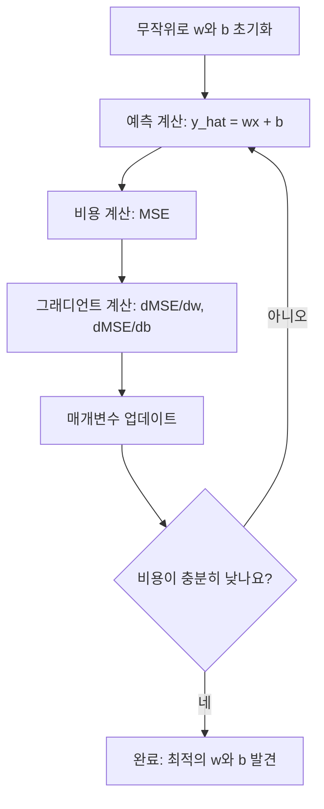

# 선형 회귀

> 선형 회귀는 데이터에 가장 적합한 직선을 그립니다. 이것은 머신러닝의 "hello world"입니다.

**유형:** 구현
**언어:** Python
**선수 과목:** Phase 1 (선형대수, 미적분, 최적화), Phase 2 Lesson 1
**소요 시간:** ~90분

## 학습 목표

- 평균 제곱 오차(MSE)에 대한 경사 하강법 업데이트 규칙을 유도하고 선형 회귀를 처음부터 구현한다
- 계산 복잡도 측면에서 경사 하강법과 정규 방정식을 비교하고 각각을 언제 사용할지 결정한다
- 특성 표준화를 포함한 다중 선형 회귀 모델을 구축하고 학습된 가중치를 해석한다
- 릿지 회귀(L2 정규화)가 큰 가중치에 페널티를 부여하여 과적합을 방지하는 방법을 설명한다

## 문제

주택 크기와 판매 가격이 있는 데이터가 있습니다. 크기가 주어졌을 때 새 주택의 가격을 예측하고 싶습니다. 산점도에서 눈대중으로 추정할 수 있지만, 공식이 필요합니다. 어떤 크기든 입력하여 가격 예측을 얻을 수 있도록 데이터에 가장 잘 맞는 선이 필요합니다.

선형 회귀는 그 선을 제공합니다. 더 중요한 것은 전체 ML 훈련 루프를 소개한다는 점입니다: 모델 정의 → 비용 함수 정의 → 매개변수 최적화. 모든 ML 알고리즘은 이 동일한 패턴을 따릅니다. 가장 간단한 사례로 여기서 숙달하면 어디서든 알아볼 수 있습니다.

단순한 문제에만 사용되는 것이 아닙니다. 선형 회귀는 수요 예측, A/B 테스트 분석, 재무 모델링, 그리고 모든 회귀 작업의 기준선(baseline)으로 생산 시스템에서 사용됩니다.

## 개념

### 모델

선형 회귀는 입력(x)과 출력(y) 사이의 선형 관계를 가정합니다:

```
y = wx + b
```

- `w` (가중치/기울기): x가 1 증가할 때 y가 얼마나 변하는지
- `b` (편향/절편): x = 0일 때 y의 값

여러 입력(특성)의 경우 다음과 같이 확장됩니다:

```
y = w1*x1 + w2*x2 + ... + wn*xn + b
```

벡터 형태: `y = w^T * x + b`

목표: 모든 훈련 예제에서 예측된 y가 실제 y에 최대한 가깝도록 w와 b의 값을 찾는 것입니다.

### 비용 함수 (평균 제곱 오차)

"최대한 가깝게"를 어떻게 측정합니까? 예측이 얼마나 틀렸는지를 나타내는 단일 숫자가 필요합니다. 가장 일반적인 선택은 평균 제곱 오차(MSE)입니다:

```
MSE = (1/n) * sum((y_predicted - y_actual)^2)
```

왜 제곱일까요? 두 가지 이유가 있습니다. 첫째, 큰 오차를 작은 오차보다 훨씬 더 페널티를 부여합니다 (오차 10은 오차 1보다 100배 더 나쁩니다, 10배가 아닙니다). 둘째, 제곱 함수는 어디서나 매끄럽고 미분 가능하므로 최적화가 straightforward합니다.

비용 함수는 표면을 만듭니다. 단일 가중치 w와 편향 b에 대해 MSE 표면은 그릇 모양(볼록 포물면)입니다. 그릇의 바닥이 MSE가 최소화되는 곳입니다. 훈련이란 그 바닥을 찾는 것을 의미합니다.

### 경사 하강법

경사 하강법은 그릇의 바닥을 찾아 내려가면서 찾습니다.



그래디언트는 두 가지를 알려줍니다: 각 매개변수를 어떤 방향으로 움직여야 하는지, 그리고 얼마나 움직여야 하는지.

MSE와 y_hat = wx + b에 대해:

```
dMSE/dw = (2/n) * sum((y_hat - y) * x)
dMSE/db = (2/n) * sum(y_hat - y)
```

업데이트 규칙:

```
w = w - learning_rate * dMSE/dw
b = b - learning_rate * dMSE/db
```

학습률은 단계 크기를 제어합니다. 너무 크면: 최소값을 지나쳐 발산합니다. 너무 작으면: 훈련이 영원히 걸립니다. 일반적인 시작 값: 0.01, 0.001, 또는 0.0001.

### 정규 방정식 (폐쇄형 해)

선형 회귀specifically를 위해, 반복 없이 최적의 가중치를 직접 제공하는 공식이 있습니다:

```
w = (X^T * X)^(-1) * X^T * y
```

이것은 한 번의 단계에서 w를 풀기 위해 행렬을 역행렬합니다. 작은 데이터셋에는 완벽하게 작동합니다. 수백만 개의 행이나 수천 개의 특성을 가진 큰 데이터셋에서는 행렬 역행렬이 특성 수에서 O(n^3)이므로 경사 하강법이 선호됩니다.

### 다중 선형 회귀

여러 특성이 있으면 모델은 다음과 같습니다:

```
y = w1*x1 + w2*x2 + ... + wn*xn + b
```

모든 것이 동일하게 작동합니다: MSE가 비용 함수이고, 경사 하강법이 모든 가중치를 동시에 업데이트합니다. 유일한 차이점은 선 대신 초평면을 피팅하고 있다는 것입니다.

특성 스케일링이 여기서 중요합니다. 하나의 특성이 0에서 1까지 범위이고 다른 특성이 0에서 1,000,000까지 범위이면, 비용 표면이 길쭉해져서 경사 하강법이 힘듭니다. 훈련 전 특성을 표준화하세요(평균 빼기, 표준편차로 나누기).

### 다항식 회귀

관계가 선형이 아닌 경우怎么办呢? 다항식 특성을 생성하여 선형 회귀를 계속 사용할 수 있습니다:

```
y = w1*x + w2*x^2 + w3*x^3 + b
```

이것은 여전히 "선형" 회귀입니다 — 가중치에서 선형이기 때문입니다 (w1, w2, w3). 단지 x의 비선형 특성을 사용하고 있을 뿐입니다.

更高 차수의 다항식은 더 복잡한 곡선을 맞출 수 있지만 과적합 위험이 있습니다. 10개 데이터 포인트에 대해 차수 10 다항식은 모든 포인트를 통과하지만 새 데이터에서 poorly 예측합니다.

### R-제곱 점수

MSE는 틀린 정도를 알려주지만, 숫자가 y의 스케일에 dependent합니다. R-제곱(R^2)은 스케일에 Independent한 측정치를 제공합니다:

```
R^2 = 1 - (잔차 제곱합) / (평균からの 편차 제곱합)
    = 1 - SS_res / SS_tot
```

- R^2 = 1.0: 완벽한 예측
- R^2 = 0.0: 모델이 매번 평균을 예측하는 것보다 나은 것이 없음
- R^2 < 0.0: 모델이 평균을 예측하는 것보다 나쁩니다

### 정규화 미리보기 (릿지 회귀)

많은 특성이 있을 때, 모델은 큰 가중치를 할당하여 과적합할 수 있습니다. 릿지 회귀(L2 정규화)는 패널티를 추가합니다:

```
Cost = MSE + lambda * sum(w_i^2)
```

패널티 항은 큰 가중치를 억제합니다. 하이퍼파라미터 lambda는 트레이드오프를 제어합니다: lambda가 높을수록 가중치가 더 작고 정규화가 더 강해집니다. 이것은 나중 수업에서 깊이 다룹니다. 지금은 그것이 존재하는 이유와 왜 도움이 되는지만 알아두세요.

## 실습

### 1단계: 샘플 데이터 생성

```python
import random
import math

random.seed(42)

TRUE_W = 3.0
TRUE_B = 7.0
N_SAMPLES = 100

X = [random.uniform(0, 10) for _ in range(N_SAMPLES)]
y = [TRUE_W * x + TRUE_B + random.gauss(0, 2.0) for x in X]

print(f"Generated {N_SAMPLES} samples")
print(f"True relationship: y = {TRUE_W}x + {TRUE_B} (+ noise)")
print(f"First 5 points: {[(round(X[i], 2), round(y[i], 2)) for i in range(5)]}")
```

### 2단계: 경사 하강법을 사용한 선형 회귀 처음부터 구현

```python
class LinearRegression:
    def __init__(self, learning_rate=0.01):
        self.w = 0.0
        self.b = 0.0
        self.lr = learning_rate
        self.cost_history = []

    def predict(self, X):
        return [self.w * x + self.b for x in X]

    def compute_cost(self, X, y):
        predictions = self.predict(X)
        n = len(y)
        cost = sum((pred - actual) ** 2 for pred, actual in zip(predictions, y)) / n
        return cost

    def compute_gradients(self, X, y):
        predictions = self.predict(X)
        n = len(y)
        dw = (2 / n) * sum((pred - actual) * x for pred, actual, x in zip(predictions, y, X))
        db = (2 / n) * sum(pred - actual for pred, actual in zip(predictions, y))
        return dw, db

    def fit(self, X, y, epochs=1000, print_every=200):
        for epoch in range(epochs):
            dw, db = self.compute_gradients(X, y)
            self.w -= self.lr * dw
            self.b -= self.lr * db
            cost = self.compute_cost(X, y)
            self.cost_history.append(cost)
            if epoch % print_every == 0:
                print(f"  Epoch {epoch:4d} | Cost: {cost:.4f} | w: {self.w:.4f} | b: {self.b:.4f}")
        return self

    def r_squared(self, X, y):
        predictions = self.predict(X)
        y_mean = sum(y) / len(y)
        ss_res = sum((actual - pred) ** 2 for actual, pred in zip(y, predictions))
        ss_tot = sum((actual - y_mean) ** 2 for actual in y)
        return 1 - (ss_res / ss_tot)


print("=== Training Linear Regression (Gradient Descent) ===")
model = LinearRegression(learning_rate=0.005)
model.fit(X, y, epochs=1000, print_every=200)
print(f"\nLearned: y = {model.w:.4f}x + {model.b:.4f}")
print(f"True:    y = {TRUE_W}x + {TRUE_B}")
print(f"R-squared: {model.r_squared(X, y):.4f}")
```

### 3단계: 정규 방정식 (폐쇄형 해)

```python
class LinearRegressionNormal:
    def __init__(self):
        self.w = 0.0
        self.b = 0.0

    def fit(self, X, y):
        n = len(X)
        x_mean = sum(X) / n
        y_mean = sum(y) / n
        numerator = sum((X[i] - x_mean) * (y[i] - y_mean) for i in range(n))
        denominator = sum((X[i] - x_mean) ** 2 for i in range(n))
        self.w = numerator / denominator
        self.b = y_mean - self.w * x_mean
        return self

    def predict(self, X):
        return [self.w * x + self.b for x in X]

    def r_squared(self, X, y):
        predictions = self.predict(X)
        y_mean = sum(y) / len(y)
        ss_res = sum((actual - pred) ** 2 for actual, pred in zip(y, predictions))
        ss_tot = sum((actual - y_mean) ** 2 for actual in y)
        return 1 - (ss_res / ss_tot)


print("\n=== Normal Equation (Closed-Form) ===")
model_normal = LinearRegressionNormal()
model_normal.fit(X, y)
print(f"Learned: y = {model_normal.w:.4f}x + {model_normal.b:.4f}")
print(f"R-squared: {model_normal.r_squared(X, y):.4f}")
```

### 4단계: 다중 선형 회귀

```python
class MultipleLinearRegression:
    def __init__(self, n_features, learning_rate=0.01):
        self.weights = [0.0] * n_features
        self.bias = 0.0
        self.lr = learning_rate
        self.cost_history = []

    def predict_single(self, x):
        return sum(w * xi for w, xi in zip(self.weights, x)) + self.bias

    def predict(self, X):
        return [self.predict_single(x) for x in X]

    def compute_cost(self, X, y):
        predictions = self.predict(X)
        n = len(y)
        return sum((pred - actual) ** 2 for pred, actual in zip(predictions, y)) / n

    def fit(self, X, y, epochs=1000, print_every=200):
        n = len(y)
        n_features = len(X[0])
        for epoch in range(epochs):
            predictions = self.predict(X)
            errors = [pred - actual for pred, actual in zip(predictions, y)]
            for j in range(n_features):
                grad = (2 / n) * sum(errors[i] * X[i][j] for i in range(n))
                self.weights[j] -= self.lr * grad
            grad_b = (2 / n) * sum(errors)
            self.bias -= self.lr * grad_b
            cost = self.compute_cost(X, y)
            self.cost_history.append(cost)
            if epoch % print_every == 0:
                print(f"  Epoch {epoch:4d} | Cost: {cost:.4f}")
        return self

    def r_squared(self, X, y):
        predictions = self.predict(X)
        y_mean = sum(y) / len(y)
        ss_res = sum((actual - pred) ** 2 for actual, pred in zip(y, predictions))
        ss_tot = sum((actual - y_mean) ** 2 for actual in y)
        return 1 - (ss_res / ss_tot)


random.seed(42)
N = 100
X_multi = []
y_multi = []
for _ in range(N):
    size = random.uniform(500, 3000)
    bedrooms = random.randint(1, 5)
    age = random.uniform(0, 50)
    price = 50 * size + 10000 * bedrooms - 1000 * age + 50000 + random.gauss(0, 20000)
    X_multi.append([size, bedrooms, age])
    y_multi.append(price)


def standardize(X):
    n_features = len(X[0])
    means = [sum(X[i][j] for i in range(len(X))) / len(X) for j in range(n_features)]
    stds = []
    for j in range(n_features):
        variance = sum((X[i][j] - means[j]) ** 2 for i in range(len(X))) / len(X)
        stds.append(variance ** 0.5)
    X_scaled = []
    for i in range(len(X)):
        row = [(X[i][j] - means[j]) / stds[j] if stds[j] > 0 else 0 for j in range(n_features)]
        X_scaled.append(row)
    return X_scaled, means, stds


y_mean_val = sum(y_multi) / len(y_multi)
y_std_val = (sum((yi - y_mean_val) ** 2 for yi in y_multi) / len(y_multi)) ** 0.5
y_scaled = [(yi - y_mean_val) / y_std_val for yi in y_multi]

X_scaled, x_means, x_stds = standardize(X_multi)

print("\n=== Multiple Linear Regression (3 features) ===")
print("Features: house size, bedrooms, age")
multi_model = MultipleLinearRegression(n_features=3, learning_rate=0.01)
multi_model.fit(X_scaled, y_scaled, epochs=1000, print_every=200)

print(f"\nWeights (standardized): {[round(w, 4) for w in multi_model.weights]}")
print(f"Bias (standardized): {multi_model.bias:.4f}")
print(f"R-squared: {multi_model.r_squared(X_scaled, y_scaled):.4f}")
```

### 5단계: 다항식 회귀

```python
class PolynomialRegression:
    def __init__(self, degree, learning_rate=0.01):
        self.degree = degree
        self.weights = [0.0] * degree
        self.bias = 0.0
        self.lr = learning_rate

    def make_features(self, X):
        return [[x ** (d + 1) for d in range(self.degree)] for x in X]

    def predict(self, X):
        features = self.make_features(X)
        return [sum(w * f for w, f in zip(self.weights, row)) + self.bias for row in features]

    def fit(self, X, y, epochs=1000, print_every=200):
        features = self.make_features(X)
        n = len(y)
        for epoch in range(epochs):
            predictions = [sum(w * f for w, f in zip(self.weights, row)) + self.bias for row in features]
            errors = [pred - actual for pred, actual in zip(predictions, y)]
            for j in range(self.degree):
                grad = (2 / n) * sum(errors[i] * features[i][j] for i in range(n))
                self.weights[j] -= self.lr * grad
            grad_b = (2 / n) * sum(errors)
            self.bias -= self.lr * grad_b
            if epoch % print_every == 0:
                cost = sum(e ** 2 for e in errors) / n
                print(f"  Epoch {epoch:4d} | Cost: {cost:.6f}")
        return self

    def r_squared(self, X, y):
        predictions = self.predict(X)
        y_mean = sum(y) / len(y)
        ss_res = sum((actual - pred) ** 2 for actual, pred in zip(y, predictions))
        ss_tot = sum((actual - y_mean) ** 2 for actual in y)
        return 1 - (ss_res / ss_tot)


random.seed(42)
X_poly = [x / 10.0 for x in range(0, 50)]
y_poly = [0.5 * x ** 2 - 2 * x + 3 + random.gauss(0, 1.0) for x in X_poly]

x_max = max(abs(x) for x in X_poly)
X_poly_norm = [x / x_max for x in X_poly]
y_poly_mean = sum(y_poly) / len(y_poly)
y_poly_std = (sum((yi - y_poly_mean) ** 2 for yi in y_poly) / len(y_poly)) ** 0.5
y_poly_norm = [(yi - y_poly_mean) / y_poly_std for yi in y_poly]

print("\n=== Polynomial Regression (degree 2 vs degree 5) ===")
print("True relationship: y = 0.5x^2 - 2x + 3")

print("\nDegree 2:")
poly2 = PolynomialRegression(degree=2, learning_rate=0.1)
poly2.fit(X_poly_norm, y_poly_norm, epochs=2000, print_every=500)
print(f"  R-squared: {poly2.r_squared(X_poly_norm, y_poly_norm):.4f}")

print("\nDegree 5:")
poly5 = PolynomialRegression(degree=5, learning_rate=0.1)
poly5.fit(X_poly_norm, y_poly_norm, epochs=2000, print_every=500)
print(f"  R-squared: {poly5.r_squared(X_poly_norm, y_poly_norm):.4f}")

print("\nDegree 2 fits the true curve well. Degree 5 fits training data slightly better")
print("but risks overfitting on new data.")
```

### 6단계: 릿지 회귀 (L2 정규화)

```python
class RidgeRegression:
    def __init__(self, n_features, learning_rate=0.01, alpha=1.0):
        self.weights = [0.0] * n_features
        self.bias = 0.0
        self.lr = learning_rate
        self.alpha = alpha

    def predict_single(self, x):
        return sum(w * xi for w, xi in zip(self.weights, x)) + self.bias

    def predict(self, X):
        return [self.predict_single(x) for x in X]

    def fit(self, X, y, epochs=1000, print_every=200):
        n = len(y)
        n_features = len(X[0])
        for epoch in range(epochs):
            predictions = self.predict(X)
            errors = [pred - actual for pred, actual in zip(predictions, y)]
            mse = sum(e ** 2 for e in errors) / n
            reg_term = self.alpha * sum(w ** 2 for w in self.weights)
            cost = mse + reg_term
            for j in range(n_features):
                grad = (2 / n) * sum(errors[i] * X[i][j] for i in range(n))
                grad += 2 * self.alpha * self.weights[j]
                self.weights[j] -= self.lr * grad
            grad_b = (2 / n) * sum(errors)
            self.bias -= self.lr * grad_b
            if epoch % print_every == 0:
                print(f"  Epoch {epoch:4d} | Cost: {cost:.4f} | L2 penalty: {reg_term:.4f}")
        return self


print("\n=== Ridge Regression (L2 Regularization) ===")
print("Same data as multiple regression, with alpha=0.1")
ridge = RidgeRegression(n_features=3, learning_rate=0.01, alpha=0.1)
ridge.fit(X_scaled, y_scaled, epochs=1000, print_every=200)
print(f"\nRidge weights: {[round(w, 4) for w in ridge.weights]}")
print(f"Plain weights: {[round(w, 4) for w in multi_model.weights]}")
print("Ridge weights are smaller (shrunk toward zero) due to the L2 penalty.")
```

## 활용

이제 production에서 실제로 사용할 scikit-learn 버전입니다.

```python
from sklearn.linear_model import LinearRegression as SklearnLR
from sklearn.linear_model import Ridge
from sklearn.preprocessing import PolynomialFeatures, StandardScaler
from sklearn.model_selection import train_test_split
from sklearn.metrics import mean_squared_error, r2_score
import numpy as np

np.random.seed(42)
X_sk = np.random.uniform(0, 10, (100, 1))
y_sk = 3.0 * X_sk.squeeze() + 7.0 + np.random.normal(0, 2.0, 100)

X_train, X_test, y_train, y_test = train_test_split(X_sk, y_sk, test_size=0.2, random_state=42)

lr = SklearnLR()
lr.fit(X_train, y_train)
y_pred = lr.predict(X_test)

print("=== Scikit-learn Linear Regression ===")
print(f"Coefficient (w): {lr.coef_[0]:.4f}")
print(f"Intercept (b): {lr.intercept_:.4f}")
print(f"R-squared (test): {r2_score(y_test, y_pred):.4f}")
print(f"MSE (test): {mean_squared_error(y_test, y_pred):.4f}")

poly = PolynomialFeatures(degree=2, include_bias=False)
X_poly_sk = poly.fit_transform(X_train)
X_poly_test = poly.transform(X_test)

lr_poly = SklearnLR()
lr_poly.fit(X_poly_sk, y_train)
print(f"\nPolynomial degree 2 R-squared: {r2_score(y_test, lr_poly.predict(X_poly_test)):.4f}")

scaler = StandardScaler()
X_train_scaled = scaler.fit_transform(X_train)
X_test_scaled = scaler.transform(X_test)

ridge = Ridge(alpha=1.0)
ridge.fit(X_train_scaled, y_train)
print(f"Ridge R-squared: {r2_score(y_test, ridge.predict(X_test_scaled)):.4f}")
print(f"Ridge coefficient: {ridge.coef_[0]:.4f}")
```

처음부터 구현한ものと scikit-learn이 동일한 결과를 산출합니다. 차이점: scikit-learn은 edge cases, 수치 안정성, 성능 최적화를 처리합니다. Production에는 라이브러리를 사용하세요. 무슨 일이 일어나는지 이해하려면 처음부터 구현한 버전을 사용하세요.

## 결과물

이 수업은 다음을 생성합니다:
- `outputs/skill-regression.md` - 문제에 따라 올바른 회귀 접근 방식을 선택하기 위한 skill

## 연습 문제

1. 배치 경사 하강법, 확률적 경사 하강법(SGD), 미니배치 경사 하강법을 구현하세요. 동일한 데이터셋에서 수렴 속도를 비교하세요.哪个 수렴最快?哪个의 비용 곡선이 가장 smooth합니까?

2. 3차 함수(y = ax^3 + bx^2 + cx + d + noise)에서 데이터를 생성하세요. 차수 1, 3, 10의 다항식을 피팅하세요. 훈련 R^2와 테스트 R^2를 비교하세요. 과적합이 명확해지는 차수는 어느 것입니까?

3. 라쏘 회귀(L1 정규화: penalty = alpha * sum(|w_i|))를 구현하세요. 다중 특，房价 데이터에서 훈련하세요. 어떤 가중치가 0이 되는지 릿지와 비교하세요. 왜 L1이 희소(sparse) 솔루션을 생성하지만 L2는 그렇지 않은지 설명하세요.

## 핵심 용어

| 용어 | 사람들이 말하는 것 | 실제 의미 |
|------|----------------|----------------------|
| 선형 회귀 | "데이터에 선을 그린다" | wx+b와 실제 y 값 사이의 제곱差的 합을最小화하는 가중치 w와 편향 b를 찾습니다 |
| 비용 함수 | "모델이 얼마나 나쁜지" | 예측 오차를 측정하는 단일 숫자로 모델 매개변수를 매핑하는 함수, 최적화가 최소화합니다 |
| 평균 제곱 오차 | "제곱 오차의 평균" | (1/n) * sum of (예측 - 실제)^2, 큰 오차에 비례하여 페널티를 부여합니다 |
| 경사 하강법 | "下화로 걸어간다" | 부분 미분을 사용하여 비용 함수를 줄이는 방향으로 매개변수를 반복적으로 조정합니다 |
| 학습률 | "단계 크기" | 경사 하강법 단계에서 매개변수가 얼마나 변하는지를 제어하는 스칼라 |
| 정규 방정식 | "직접 풀다" | 반복 없이 최적의 가중치를 제공하는 폐쇄형 해 w = (X^T X)^-1 X^T y |
| R-제곱 | "적합이 얼마나 좋은지" | 모델에서 설명되는 y의 분산 비율, -무한대에서 1.0까지 범위 |
| 특성 스케일링 | "특성을 비교 가능하게 만든다" | (예: 평균 0, 단위 분산) 특성을 유사한 범위로 변환하여 경사 하강법이更快게 수렴합니다 |
| 정규화 | "복잡성에 페널티를 부여한다" | 과적합을，防止하기 위해 비용 함수에 가중치를 축소시키는 항을 추가합니다 |
| 릿지 회귀 | "L2 정규화" | MSE에 lambda * sum(w_i^2) 패널티가 추가된 선형 회귀 |
| 다항식 회귀 | "선형 수학으로 곡선을 피팅한다" | 다항식 특성(x, x^2, x^3, ...)에 대한 선형 회귀, 가중치에서 여전히 선형입니다 |
| 과적합 | "훈련 데이터를 기억한다" | 모델이 훈련 데이터의 노이즈를 피팅하여 새 데이터에서 실패할 만큼 복잡합니다 |

## 추가 자료

- [An Introduction to Statistical Learning (ISLR)](https://www.statlearning.com/) -- 모든 고전 ML 方法을 실용적인 R 예제와 함께 다루는 무료 PDF, 3장과 6장
- [The Elements of Statistical Learning (ESL)](https://hastie.su.domains/ElemStatLearn/) -- ISLR의 더 수학적인 동반자, 릿지와 라쏘에 대한 더深い 치료
- [Stanford CS229 Lecture Notes on Linear Regression](https://cs229.stanford.edu/main_notes.pdf) -- 정규 방정식과 경사 하강법을 pertama 원리에서 유도하는 Andrew Ng의 노트
- [scikit-learn LinearRegression documentation](https://scikit-learn.org/stable/modules/linear_model.html) -- LinearRegression, Ridge, Lasso, ElasticNet에 대한 실용적 참조와 코드 예제