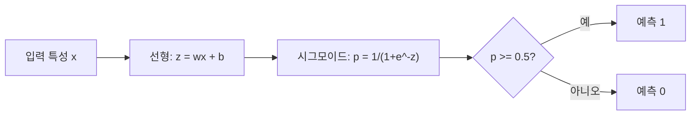
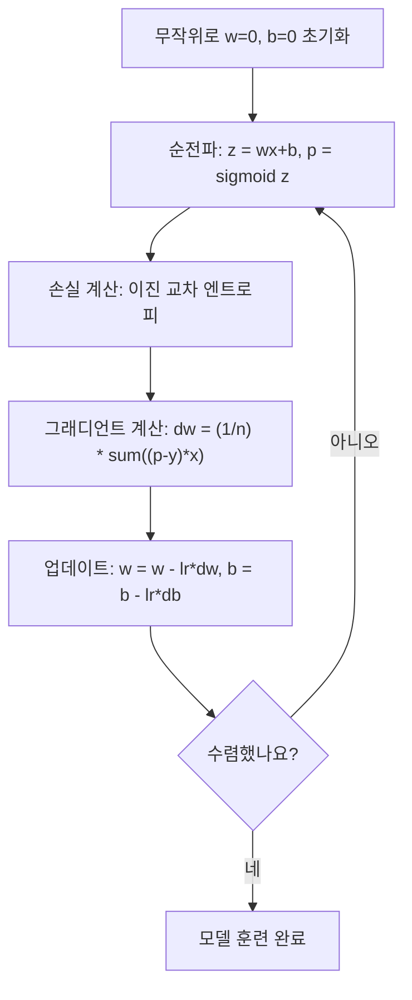

# 로지스틱 회귀

> 로지스틱 회귀는 직선을 S-곡선으로 구부려 확률로 예/아니오 질문에 답합니다.

**유형:** 구현
**언어:** Python
**선수 과목:** Phase 2 Lesson 1-2 (머신러닝이란, 선형 회귀)
**소요 시간:** ~90분

## 학습 목표

- 시그모이드 함수와 이진 교차 엔트로피 손실을 사용하여 로지스틱 회귀를 처음부터 구현한다
- 이진 분류를 위한 정밀도, 재현율, F1 점수, 혼동 행렬을 계산하고 해석한다
- MSE가 분류에 실패하는 이유와 이진 교차 엔트로피가 볼록한 비용 곡면을 생성하는 이유를 설명한다
- 다중 클래스 분류를 위한 소프트맥스 회귀 모델을 구축하고 임계값 조정 트레이드오프를 평가한다

## 문제

종양의 크기를 기반으로 악성인지 양성인지 예측하고 싶습니다. 선형 회귀를 시도하면 0.3, 1.7, -0.5 같은 숫자를 출력합니다. 이것들이 무슨 뜻입니까? 1.7이 "매우 악성"인가? -0.5가 "매우 양성"인가? 선형 회귀는 제한 없는 숫자를 출력합니다. 분류에는 0과 1 사이의 확률과 명확한 결정(예 또는 아니오)이 필요합니다.

로지스틱 회귀는 이것을 해결합니다. 동일한 선형 결합(wx + b)을 가져와서 시그모이드 함수를 통과시켜 어떤 숫자든 (0, 1) 범위로 압축합니다. 출력은 확률입니다. 임계값(일반적으로 0.5)을 설정하고 결정을 내립니다.

이것은 실제로 가장 널리 사용되는 알고리즘 중 하나입니다. 이름과 달리 로지스틱 회귀는 분류 알고리즘이지 회귀 알고리즘이 아닙니다. 이름은 사용하는 로지스틱(시그모이드) 함수에서 유래했습니다.

## 개념

### 왜 선형 회귀가 분류에 실패하는가

공부 시간을 기반으로 합격/불합격(1/0)을 예측한다고 상상해보세요. 선형 회귀는 데이터를 통과하는 직선을 맞춥니다:

```
hours:  1   2   3   4   5   6   7   8   9   10
actual: 0   0   0   0   1   1   1   1   1   1
```

선형 피팅은 시간 1에서 -0.2, 시간 10에서 1.3 같은 예측을 생성할 수 있습니다. 이러한 값들은 확률이 아닙니다. 0 아래로 떨어지고 1을 초과합니다. 게다가 단일 이상치(50시간 동안 공부한 누군가)가 전체 선을 끌어당겨 모든 사람의 예측을 변경합니다.

분류에는 다음 조건을 충족하는 함수가 필요합니다:
- 0과 1 사이의 값 출력 (확률)
- 날카로운 전환 생성 (의사 결정 경계)
- 경계에서 멀리 있는 이상치에 의해 변형되지 않음

### 시그모이드 함수

시그모이드 함수가 정확히 이것을 합니다:

```
sigmoid(z) = 1 / (1 + e^(-z))
```

속성:
- z가 크고 양수이면, sigmoid(z)는 1에 접근합니다
- z가 크고 음수이면, sigmoid(z)는 0에 접근합니다
- z = 0일 때, sigmoid(z) = 0.5
- 출력은 항상 0과 1 사이입니다
- 함수는 어디서나 매끄럽고 미분 가능합니다

도함수는 편리한 형태를 가집니다: sigmoid'(z) = sigmoid(z) * (1 - sigmoid(z)). 이것은 그래디언트 계산을 효율적으로 만듭니다.

### 로지스틱 회귀 = 선형 모델 + 시그모이드

모델은 z = wx + b (선형 회귀와 동일)를 계산한 다음 시그모이드를 적용합니다:



출력 p는 P(y=1 | x), 즉 입력이 클래스 1에 속할 확률로 해석됩니다. 의사 결정 경계는 wx + b = 0인 곳으로, 시그모이드 출력이 정확히 0.5인 곳입니다.

### 이진 교차 엔트로피 손실

로지스틱 회귀에 MSE를 사용할 수 없습니다. 시그모이드와 함께 MSE를 사용하면 많은 지역 최소값을 가진 비볼록 비용 곡면을 생성합니다. 대신 이진 교차 엔트로피(로그 손실)를 사용하세요:

```
Loss = -(1/n) * sum(y * log(p) + (1-y) * log(1-p))
```

왜 이것이 작동합니까:
- y=1이고 p가 1에 가까우면: log(1) = 0, 그래서 손실은 0에 가깝습니다 (정답, 낮은 비용)
- y=1이고 p가 0에 가까우면: log(0)은 음의 무한대에 접근합니다, 그래서 손실은 큽니다 (틀림, 높은 비용)
- y=0이고 p가 0에 가까우면: log(1) = 0, 그래서 손실은 0에 가깝습니다 (정답, 낮은 비용)
- y=0이고 p가 1에 가까우면: log(0)은 음의 무한대에 접근합니다, 그래서 손실은 큽니다 (틀림, 높은 비용)

이 손실 함수는 로지스틱 회귀에 대해 볼록하여, 단일 전역 최소값을 보장합니다.

### 로지스틱 회귀의 경사 하강법

시그모이드와 이진 교차 엔트로피에 대한 그래디언트는 깔끔한 형태를 가집니다:

```
dL/dw = (1/n) * sum((p - y) * x)
dL/db = (1/n) * sum(p - y)
```

이것들은 선형 회귀 그래디언트와 동일해 보입니다. 차이점은 p = sigmoid(wx + b)而不是 p = wx + b라는 것입니다. 시그모이드가 비선형성을 도입하지만, 그래디언트 업데이트 규칙은 동일하게 유지됩니다.



### 의사 결정 경계

2D 입력(두 특성)의 경우, 의사 결정 경계는:

```
w1*x1 + w2*x2 + b = 0
```

한쪽의 포인트는 1로 분류되고, 다른쪽의 포인트는 0으로 분류됩니다. 로지스틱 회귀는 항상 선형 의사 결정 경계를 생성합니다. 곡선 경계가 필요하면 다항식 특성을 추가하거나 비선형 모델을 사용하세요.

### 소프트맥스를 사용한 다중 클래스 분류

이진 로지스틱 회귀는 두 클래스를 처리합니다. k개의 클래스의 경우 소프트맥스 함수를 사용하세요:

```
softmax(z_i) = e^(z_i) / sum(e^(z_j) for all j)
```

각 클래스는 자체 가중치 벡터를 가집니다. 모델은 각 클래스에 대한 점수를 계산한 다음 소프트맥스가 점수를 합이 1인 확률로 변환합니다. 예측된 클래스는 확률이 가장 높은 클래스입니다.

손실 함수는 범주형 교차 엔트로피가 됩니다:

```
Loss = -(1/n) * sum(sum(y_k * log(p_k)))
```

여기서 y_k는 실제 클래스에 대해 1이고 다른 모든 클래스에 대해 0입니다 (원핫 인코딩).

### 평가 지표

정확도만으로는 충분하지 않습니다. 95% 부정类和 5% 긍정类가 있는 데이터셋에서 항상 "부정"을 예측하는 모델이 95% 정확도를 얻지만 완전히 쓸모없습니다.

**혼동 행렬**:

|  | 예측 긍정 | 예측 부정 |
|---|---|---|
| 실제 긍정 | 진짜 긍정 (TP) | 거짓 부정 (FN) |
| 실제 부정 | 거짓 긍정 (FP) | 진짜 부정 (TN) |

**정밀도**: 예측한 긍정 중 실제 긍정인 것의 비율
```
Precision = TP / (TP + FP)
```

**재현율**(민감도): 실제 긍정 중 포착한 것의 비율
```
Recall = TP / (TP + FN)
```

**F1 점수**: 정밀도와 재현율의 조화 평균. 두 지표를 균형시킵니다.
```
F1 = 2 * (Precision * Recall) / (Precision + Recall)
```

언제 우선시할지:
- **정밀도**: 거짓 긍정 비용이 클 때 (스팸 필터, 합법적 이메일을 차단하고 싶지 않음)
- **재현율**: 거짓 부정 비용이 클 때 (암筛查, 종양을 놓치고 싶지 않음)
- **F1**: 단일 균형 지표가 필요할 때

## 실습

### 1단계: 시그모이드 함수와 데이터 생성

```python
import random
import math

def sigmoid(z):
    z = max(-500, min(500, z))
    return 1.0 / (1.0 + math.exp(-z))


random.seed(42)
N = 200
X = []
y = []

for _ in range(N // 2):
    X.append([random.gauss(2, 1), random.gauss(2, 1)])
    y.append(0)

for _ in range(N // 2):
    X.append([random.gauss(5, 1), random.gauss(5, 1)])
    y.append(1)

combined = list(zip(X, y))
random.shuffle(combined)
X, y = zip(*combined)
X = list(X)
y = list(y)

print(f"Generated {N} samples (2 classes, 2 features)")
print(f"Class 0 center: (2, 2), Class 1 center: (5, 5)")
print(f"First 5 samples:")
for i in range(5):
    print(f"  Features: [{X[i][0]:.2f}, {X[i][1]:.2f}], Label: {y[i]}")
```

### 2단계: 처음부터 로지스틱 회귀

```python
class LogisticRegression:
    def __init__(self, n_features, learning_rate=0.01):
        self.weights = [0.0] * n_features
        self.bias = 0.0
        self.lr = learning_rate
        self.loss_history = []

    def predict_proba(self, x):
        z = sum(w * xi for w, xi in zip(self.weights, x)) + self.bias
        return sigmoid(z)

    def predict(self, x, threshold=0.5):
        return 1 if self.predict_proba(x) >= threshold else 0

    def compute_loss(self, X, y):
        n = len(y)
        total = 0.0
        for i in range(n):
            p = self.predict_proba(X[i])
            p = max(1e-15, min(1 - 1e-15, p))
            total += y[i] * math.log(p) + (1 - y[i]) * math.log(1 - p)
        return -total / n

    def fit(self, X, y, epochs=1000, print_every=200):
        n = len(y)
        n_features = len(X[0])
        for epoch in range(epochs):
            dw = [0.0] * n_features
            db = 0.0
            for i in range(n):
                p = self.predict_proba(X[i])
                error = p - y[i]
                for j in range(n_features):
                    dw[j] += error * X[i][j]
                db += error
            for j in range(n_features):
                self.weights[j] -= self.lr * (dw[j] / n)
            self.bias -= self.lr * (db / n)
            loss = self.compute_loss(X, y)
            self.loss_history.append(loss)
            if epoch % print_every == 0:
                print(f"  Epoch {epoch:4d} | Loss: {loss:.4f} | w: [{self.weights[0]:.3f}, {self.weights[1]:.3f}] | b: {self.bias:.3f}")
        return self

    def accuracy(self, X, y):
        correct = sum(1 for i in range(len(y)) if self.predict(X[i]) == y[i])
        return correct / len(y)


split = int(0.8 * N)
X_train, X_test = X[:split], X[split:]
y_train, y_test = y[:split], y[split:]

print("\n=== Training Logistic Regression ===")
model = LogisticRegression(n_features=2, learning_rate=0.1)
model.fit(X_train, y_train, epochs=1000, print_every=200)

print(f"\nTrain accuracy: {model.accuracy(X_train, y_train):.4f}")
print(f"Test accuracy:  {model.accuracy(X_test, y_test):.4f}")
print(f"Weights: [{model.weights[0]:.4f}, {model.weights[1]:.4f}]")
print(f"Bias: {model.bias:.4f}")
```

### 3단계: 처음부터 혼동 행렬과 지표

```python
class ClassificationMetrics:
    def __init__(self, y_true, y_pred):
        self.tp = sum(1 for t, p in zip(y_true, y_pred) if t == 1 and p == 1)
        self.tn = sum(1 for t, p in zip(y_true, y_pred) if t == 0 and p == 0)
        self.fp = sum(1 for t, p in zip(y_true, y_pred) if t == 0 and p == 1)
        self.fn = sum(1 for t, p in zip(y_true, y_pred) if t == 1 and p == 0)

    def accuracy(self):
        total = self.tp + self.tn + self.fp + self.fn
        return (self.tp + self.tn) / total if total > 0 else 0

    def precision(self):
        denom = self.tp + self.fp
        return self.tp / denom if denom > 0 else 0

    def recall(self):
        denom = self.tp + self.fn
        return self.tp / denom if denom > 0 else 0

    def f1(self):
        p = self.precision()
        r = self.recall()
        return 2 * p * r / (p + r) if (p + r) > 0 else 0

    def print_confusion_matrix(self):
        print(f"\n  혼동 행렬:")
        print(f"                  예측")
        print(f"                  긍정   부정")
        print(f"  실제 긍정     {self.tp:4d}  {self.fn:4d}")
        print(f"  실제 부정     {self.fp:4d}  {self.tn:4d}")

    def print_report(self):
        self.print_confusion_matrix()
        print(f"\n  정확도:  {self.accuracy():.4f}")
        print(f"  정밀도: {self.precision():.4f}")
        print(f"  재현율:    {self.recall():.4f}")
        print(f"  F1 점수:  {self.f1():.4f}")


y_pred_test = [model.predict(x) for x in X_test]
print("\n=== 분류 리포트 (테스트 세트) ===")
metrics = ClassificationMetrics(y_test, y_pred_test)
metrics.print_report()
```

### 4단계: 의사 결정 경계 분석

```python
print("\n=== 의사 결정 경계 ===")
w1, w2 = model.weights
b = model.bias
print(f"의사 결정 경계: {w1:.4f}*x1 + {w2:.4f}*x2 + {b:.4f} = 0")
if abs(w2) > 1e-10:
    print(f"x2 대해 풀면:     x2 = {-w1/w2:.4f}*x1 + {-b/w2:.4f}")

print("\n경계 근처 샘플 예측:")
test_points = [
    [3.0, 3.0],
    [3.5, 3.5],
    [4.0, 4.0],
    [2.5, 2.5],
    [5.0, 5.0],
]
for point in test_points:
    prob = model.predict_proba(point)
    pred = model.predict(point)
    print(f"  [{point[0]}, {point[1]}] -> prob={prob:.4f}, class={pred}")
```

### 5단계: 소프트맥스를 사용한 다중 클래스

```python
class SoftmaxRegression:
    def __init__(self, n_features, n_classes, learning_rate=0.01):
        self.n_features = n_features
        self.n_classes = n_classes
        self.lr = learning_rate
        self.weights = [[0.0] * n_features for _ in range(n_classes)]
        self.biases = [0.0] * n_classes

    def softmax(self, scores):
        max_score = max(scores)
        exp_scores = [math.exp(s - max_score) for s in scores]
        total = sum(exp_scores)
        return [e / total for e in exp_scores]

    def predict_proba(self, x):
        scores = [
            sum(self.weights[k][j] * x[j] for j in range(self.n_features)) + self.biases[k]
            for k in range(self.n_classes)
        ]
        return self.softmax(scores)

    def predict(self, x):
        probs = self.predict_proba(x)
        return probs.index(max(probs))

    def fit(self, X, y, epochs=1000, print_every=200):
        n = len(y)
        for epoch in range(epochs):
            grad_w = [[0.0] * self.n_features for _ in range(self.n_classes)]
            grad_b = [0.0] * self.n_classes
            total_loss = 0.0
            for i in range(n):
                probs = self.predict_proba(X[i])
                for k in range(self.n_classes):
                    target = 1.0 if y[i] == k else 0.0
                    error = probs[k] - target
                    for j in range(self.n_features):
                        grad_w[k][j] += error * X[i][j]
                    grad_b[k] += error
                true_prob = max(probs[y[i]], 1e-15)
                total_loss -= math.log(true_prob)
            for k in range(self.n_classes):
                for j in range(self.n_features):
                    self.weights[k][j] -= self.lr * (grad_w[k][j] / n)
                self.biases[k] -= self.lr * (grad_b[k] / n)
            if epoch % print_every == 0:
                print(f"  Epoch {epoch:4d} | Loss: {total_loss / n:.4f}")
        return self

    def accuracy(self, X, y):
        correct = sum(1 for i in range(len(y)) if self.predict(X[i]) == y[i])
        return correct / len(y)


random.seed(42)
X_3class = []
y_3class = []

centers = [(1, 1), (5, 1), (3, 5)]
for label, (cx, cy) in enumerate(centers):
    for _ in range(50):
        X_3class.append([random.gauss(cx, 0.8), random.gauss(cy, 0.8)])
        y_3class.append(label)

combined = list(zip(X_3class, y_3class))
random.shuffle(combined)
X_3class, y_3class = zip(*combined)
X_3class = list(X_3class)
y_3class = list(y_3class)

split_3 = int(0.8 * len(X_3class))
X_train_3 = X_3class[:split_3]
y_train_3 = y_3class[:split_3]
X_test_3 = X_3class[split_3:]
y_test_3 = y_3class[split_3:]

print("\n=== 다중 클래스 소프트맥스 회귀 (3 클래스) ===")
softmax_model = SoftmaxRegression(n_features=2, n_classes=3, learning_rate=0.1)
softmax_model.fit(X_train_3, y_train_3, epochs=1000, print_every=200)
print(f"\nTrain accuracy: {softmax_model.accuracy(X_train_3, y_train_3):.4f}")
print(f"Test accuracy:  {softmax_model.accuracy(X_test_3, y_test_3):.4f}")

print("\n샘플 예측:")
for i in range(5):
    probs = softmax_model.predict_proba(X_test_3[i])
    pred = softmax_model.predict(X_test_3[i])
    print(f"  실제: {y_test_3[i]}, 예측: {pred}, 확률: [{', '.join(f'{p:.3f}' for p in probs)}]")
```

### 6단계: 임계값 튜닝

```python
print("\n=== 임계값 튜닝 ===")
print("기본 임계값: 0.5. 임계값을 조정하면 정밀도와 재현율 사이의 트레이드오프가 조절됩니다.\n")

thresholds = [0.3, 0.4, 0.5, 0.6, 0.7]
print(f"{'임계값':>10} {'정확도':>10} {'정밀도':>10} {'재현율':>10} {'F1':>10}")
print("-" * 52)

for t in thresholds:
    y_pred_t = [1 if model.predict_proba(x) >= t else 0 for x in X_test]
    m = ClassificationMetrics(y_test, y_pred_t)
    print(f"{t:>10.1f} {m.accuracy():>10.4f} {m.precision():>10.4f} {m.recall():>10.4f} {m.f1():>10.4f}")
```

## 활용

이제 동일한 것을 scikit-learn으로 합니다.

```python
from sklearn.linear_model import LogisticRegression as SklearnLR
from sklearn.metrics import accuracy_score, precision_score, recall_score, f1_score
from sklearn.metrics import confusion_matrix, classification_report
from sklearn.model_selection import train_test_split
from sklearn.preprocessing import StandardScaler
import numpy as np

np.random.seed(42)
X_0 = np.random.randn(100, 2) + [2, 2]
X_1 = np.random.randn(100, 2) + [5, 5]
X_sk = np.vstack([X_0, X_1])
y_sk = np.array([0] * 100 + [1] * 100)

X_tr, X_te, y_tr, y_te = train_test_split(X_sk, y_sk, test_size=0.2, random_state=42)

scaler = StandardScaler()
X_tr_sc = scaler.fit_transform(X_tr)
X_te_sc = scaler.transform(X_te)

lr = SklearnLR()
lr.fit(X_tr_sc, y_tr)
y_pred = lr.predict(X_te_sc)

print("=== Scikit-learn 로지스틱 회귀 ===")
print(f"정확도:  {accuracy_score(y_te, y_pred):.4f}")
print(f"정밀도: {precision_score(y_te, y_pred):.4f}")
print(f"재현율:    {recall_score(y_te, y_pred):.4f}")
print(f"F1:        {f1_score(y_te, y_pred):.4f}")
print(f"\n혼동 행렬:\n{confusion_matrix(y_te, y_pred)}")
print(f"\n분류 리포트:\n{classification_report(y_te, y_pred)}")
```

처음부터 구현한 것이 동일한 의사 결정 경계와 지표를 생성합니다. Scikit-learn은 솔버 옵션(liblinear, lbfgs, saga), 자동 정규화, 다중 클래스 전략(one-vs-rest, multinomial), 수치 안정성 최적화를 추가합니다.

## 결과물

이 수업은 다음을 생성합니다:
- `code/logistic_regression.py` - 처음부터实现的 로지스틱 회귀와 지표

## 연습 문제

1. 선형으로 분리되지 않는 데이터셋(예: 두 개의 동심원)을 생성하세요. 로지스틱 회귀를 훈련시키고 실패를 관찰하세요. 그런 다음 다항식 특성(x1^2, x2^2, x1*x2)을 추가하고 다시 훈련하세요. 정확도가 향상됨을 보여주세요.

2. 3클래스 소프트맥스 모델에 대한 다중 클래스 혼동 행렬을 구현하세요. 클래스별 정밀도와 재현율을 계산하세요. 어떤 클래스가 분류하기 가장 어려운가요?

3. 처음부터 ROC 곡선을 구축하세요. 0에서 1까지 100개의 임계값에 대해 진짜 긍정률과 거짓 긍정률을 계산하세요. 사다리꼴 규칙을 사용하여 AUC(곡선 아래 면적)를 계산하세요.

## 핵심 용어

| 용어 | 사람들이 말하는 것 | 실제 의미 |
|------|----------------|----------------------|
| 로지스틱 회귀 | "분류를 위한 회귀" | 클래스 확률을 출력하는 시그모이드 함수 다음에 오는 선형 모델 |
| 시그모이드 함수 | "S-곡선" | 모든 실수를 (0, 1) 범위로 매핑하는 함수 1/(1+e^(-z)) |
| 이진 교차 엔트로피 | "로그 손실" |自信作に 틀린 예측에 강한 페널티를 부여하는 손실 함수 -[y*log(p) + (1-y)*log(1-p)] |
| 의사 결정 경계 | "분리선" | 모델 출력 확률이 0.5인 표면, 예측된 클래스들을 분리합니다 |
| 소프트맥스 | "다중 클래스 시그모이드" | 점수 벡터를 합이 1인 확률로 변환하는 함수 |
| 정밀도 | "선택한 것 중 관련된 것" | TP / (TP + FP), 실제로 긍정인 예측된 양성의 비율 |
| 재현율 | "관련된 것 중 선택한 것" | TP / (TP + FN), 모델이 올바르게 식별한 실제 양성의 비율 |
| F1 점수 | "균형 정확도" | 정밀도와 재현율의 조화 평균: 2*P*R / (P+R) |
| 혼동 행렬 | "오차 분해" | 각 클래스 쌍에 대한 TP, TN, FP, FN 수를 보여주는 표 |
| 임계값 | "절단점" | 모델이 클래스 1을 예측하는 확률 값 (기본 0.5, 조정 가능) |
| 원핫 인코딩 | "범주를 위한 이진 열" | 클래스 k를 위치 k에 1이 있는 영벡터로 표현 |
| 범주형 교차 엔트로피 | "다중 클래스 로그 손실" | 원핫 인코딩된 레이블을 사용하여 k 클래스로 이진 교차 엔트로피를 확장한 것 |

## 추가 자료

- [scikit-learn Logistic Regression documentation](https://scikit-learn.org/stable/modules/linear_model.html#logistic-regression) -- 로지스틱 회귀의 실용적 참조와 구현 세부사항
- [Stanford CS229 Classification notes](https://cs229.stanford.edu/notes2022fall/cs229-notes1.pdf) -- 분류에 대한 Andrew Ng의 강의 노트, 로지스틱 회귀를 포함
- [Peter Flach: Precision-Recall-Fidelity curves](https://arxiv.org/abs/1807.00236) -- 정밀도-재현율 곡선의 이론적 분석