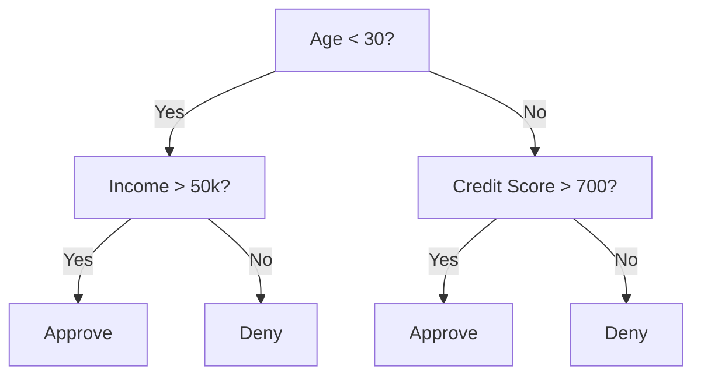
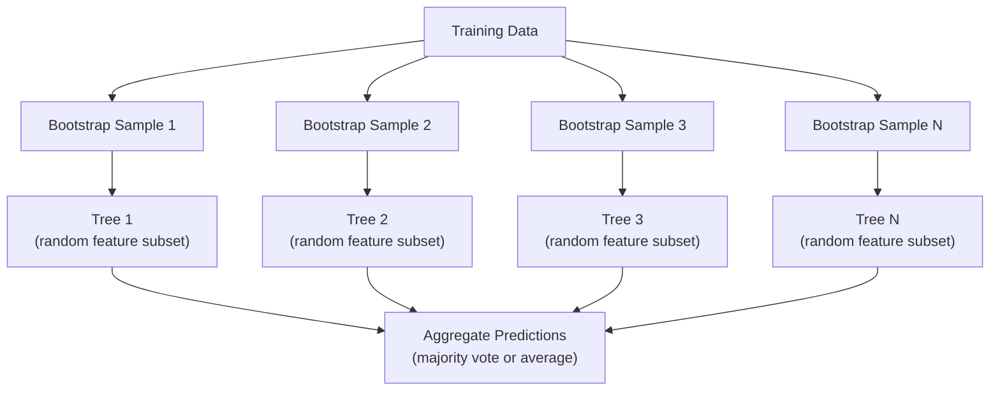

# 결정 트리와 랜덤 포레스트

> 결정 트리는 그냥 순서도다. 하지만 트리의 숲(포레스트)은 ML에서 가장 강력한 도구 중 하나다.

**유형:** 구현
**언어:** Python
**선수 과목:** Phase 1 (09 정보 이론, 06 확률)
**소요 시간:** ~90분

## 학습 목표

- 지니 불순도, 엔트로피, 정보 이득 계산을 구현하여 최적의 결정 트리 분할을 찾는다
- 사전 가지치기 제어(최대 깊이, 최소 샘플 수)를 포함한 결정 트리 분류기를 처음부터 구축한다
- 부트스트랩 샘플링과 특성 무작위화를 사용하여 랜덤 포레스트를 구성하고 분산이 감소하는 이유를 설명한다
- MDI 특성 중요도와 순열 중요도를 비교하고 MDI가 편향되는 시기를 식별한다

## 문제

테이블 형식의 데이터가 있다. 행은 샘플, 열은 특성, 예측할 대상 열이 있다. 신경망을 던질 수도 있지만, 테이블 데이터의 경우 트리 기반 모델(결정 트리, 랜덤 포레스트, 그래디언트 부스팅 트리)이 딥러닝을 지속적으로 능가한다. 구조화된 데이터에 대한 Kaggle 대회는 XGBoost와 LightGBM이 지배한다. 트랜스포머가 아니다.

왜일까? 트리는 전처리 없이 혼합 특성 유형(수치형과 범주형)을 처리한다. 특성 공학 없이 비선형 관계를 처리한다. 해석 가능하다: 트리를 보고 예측이 왜 이루어졌는지 정확히 알 수 있다. 그리고 많은 트리를 평균화하는 랜덤 포레스트는 중간 규모 데이터셋에서 과적합에 매우 강하다.

이 수업은 재귀적 분할을 사용하여 처음부터 결정 트리를 구축한 다음, 그 위에 랜덤 포레스트를 구축한다. 분할 기준(지니 불순도, 엔트로피, 정보 이득) 뒤의 수학을 구현하고, 약한 학습자들의 앙상블이 왜 강한 학습자가 되는지 이해할 것이다.

## 개념

### 결정 트리가 하는 일

결정 트리는 예/아니오 질문의 시퀀스를 통해 특성 공간을 직사각형 영역으로 분할한다.



각 내부 노드는 특성과 임계값을 테스트한다. 각 리프 노드는 예측을 한다. 새로운 데이터 포인트를 분류하려면, 루트에서 시작하여 리프에 도달할 때까지 분기를 따른다.

트리는 각 노드에서 가장 잘 분리하는 특성과 임계값을 선택하여 위에서 아래로 구축된다. "최상"은 분할 기준에 의해 정의된다.

### 분할 기준: 불순도 측정

각 노드에서 샘플 세트가 있다. 그들을 가능한 한 "순수"(각 자식이 주로 하나의 클래스를 포함)하게 하는 하위 노드로 분할したい.

**지니 불순도**는 무작위로 선택된 샘플이 해당 노드의 클래스 분포에 따라 레이블될 경우 잘못 분류될 확률을 측정한다.

```
Gini(S) = 1 - sum(p_k^2)

여기서 p_k는 세트 S에서 클래스 k의 비율이다.
```

순수 노드(하나의 클래스만 있는 경우)에서는 Gini = 0이다. 50/50 클래스인 이진 분할에서는 Gini = 0.5이다. 낮을수록 좋다.

```
예시: 고양이 6마리, 개 4마리

Gini = 1 - (0.6^2 + 0.4^2) = 1 - (0.36 + 0.16) = 0.48
```

**엔트로피**는 노드의 정보 내용(무질서도)을 측정한다. Phase 1 Lesson 09에서 다루었다.

```
Entropy(S) = -sum(p_k * log2(p_k))
```

순수 노드에서는 엔트로피 = 0이다. 50/50 이진 분할에서는 엔트로피 = 1.0이다. 낮을수록 좋다.

```
예시: 고양이 6마리, 개 4마리

Entropy = -(0.6 * log2(0.6) + 0.4 * log2(0.4))
        = -(0.6 * -0.737 + 0.4 * -1.322)
        = 0.442 + 0.529
        = 0.971 bits
```

**정보 이득**은 분할 후 불순도(엔트로피 또는 지니) 감소량이다.

```
IG(S, feature, threshold) = Impurity(S) - weighted_avg(Impurity(S_left), Impurity(S_right))

여기서 가중치는 각 자식의 샘플 비율이다.
```

각 노드에서의 탐욕적 알고리즘: 모든 특성과 모든 가능한 임계값을 시도한다. 정보 이득을 최대화하는 (특성, 임계값) 쌍을 선택한다.

### 분할 작동 방식

현재 노드에서 n개의 특성과 m개의 샘플이 있는 데이터셋에 대해:

1. 각 특성 j에 대해 (j = 1부터 n):
   - 특성 j로 샘플을 정렬한다
   - 연속된 고유 값 사이의 모든 중간점을 임계값으로 시도한다
   - 각 임계값에 대한 정보 이득을 계산한다
2. 정보 이득이 가장 높은 특성과 임계값을 선택한다
3. 데이터를 왼쪽(특성 <= 임계값)과 오른쪽(특성 > 임계값)으로 분할한다
4. 각 자식에서 재귀한다

이 탐욕적 접근은 전역적으로 최적의 트리를 보장하지 않는다. 최적 트리를 찾는 것은 NP-hard이다. 하지만 탐욕적 분할은 실제로 잘 작동한다.

### 중지 조건

중지 조건 없으면, 트리는 모든 리프가 순수할 때까지(리프당 하나의 샘플) 자란다. 이것은 훈련 데이터를 완벽히 기억하고 일반화는 참혹하다.

**사전 가지치기**는 트리가 완전히 자라기 전에 중지한다:
- 최대 깊이: 트리가 설정된 깊이에 도달하면 분할을 중지한다
- 리프당 최소 샘플 수: 노드에 k 미만의 샘플이 있으면 중지한다
- 최소 정보 이득: 최상의 분할이 불순도를 임계값 이하로 개선하면 중지한다
- 최대 리프 노드 수: 리프의 총 수를 제한한다

**사후 가지치기**는 전체 트리를umbuhkan 다음 트리밍한다:
- 비용 복잡도 가지치기(scikit-learn에서 사용): 리프 수에 비례하는 페널티를 추가한다. 페널티를 높이면 더 작은 트리를 얻는다
- 감소된 오차 가지치기: 검증 오차가 증가하지 않으면 하위 트리를 제거한다

사전 가지치기가 더 간단하고 빠르다. 사후 가지치기는 종종 더 나은 트리를 생성한다. 이는 나중에 유용한 분할로 이어질 수 있는 분할을过早에 중지하지 않기 때문이다.

### 회귀용 결정 트리

회귀의 경우, 리프 예측은 해당 리프의 목표 값들의 평균이다. 분할 기준도 변경된다:

**분산 감소**가 정보 이득을 대체한다:

```
VR(S, feature, threshold) = Var(S) - weighted_avg(Var(S_left), Var(S_right))
```

분산을 가장 많이 감소시키는 분할을 선택한다. 트리는 입력 공간을 영역으로 분할하고, 각 영역에서 상수(평균)를 예측한다.

### 랜덤 포레스트: 앙상블의 힘

단일 결정 트리는 높은 분산을 가진다. 데이터의 작은 변경은 완전히 다른 트리를 생성할 수 있다. 랜덤 포레스트는 많은 트리를 평균하여 이것을 해결한다.



두 가지 무작위성 소스가 트리들을 다양하게 만든다:

**배깅(부트스트랩 집계):** 각 트리는 훈련 데이터에서 replacement로 무작위 샘플링한 부트스트랩 샘플에서 훈련된다. 각 부트스트랩에는 원본 샘플의 약 63%가 나타나며(나머지는 OOB 샘플로 검증에 사용될 수 있다).

**특성 무작위화:** 각 분할에서 고려되는 특성의 무작위 하위 집합만 있다. 분류의 경우 기본값은 sqrt(n_features)이다. 회귀의 경우 n_features/3이다. 이것은 모든 트리가 동일한 지배적 특성에서 분할되는 것을 방지한다.

핵심 통찰: 많은 무상관 트리를 평균하면 편향 증가 없이 분산을 감소시킨다. 각 개별 트리는 그저닐 수 있다. 앙상블이 강력하다.

### 특성 중요도

랜덤 포레스트는 본질적으로 특성 중요도 점수를 제공한다. 가장 일반적인 방법:

**평균 불순도 감소(MDI):** 각 특성에 대해 그 특성이 사용되는 모든 트리와 모든 노드에서 불순도 감소总量的을 합산한다. earlier splits에서 더 큰 불순도 감소를产生하는 특성이 더 중요하다.

```
importance(feature_j) = feature_j가 사용되는 모든 노드에 대해 합산:
    (n_samples_at_node / n_total_samples) * impurity_decrease
```

이것은 빠르다(훈련 중 계산됨)지만 고카디널리티 특성과 많은 가능한 분할점을 가진 특성에 편향된다.

**순열 중요도**는 대안이다: 하나의 특성의 값을 섞고 모델의 정확도가 얼마나 떨어지는지 측정한다. 더 신뢰할 수 있지만 느리다.

### 트리가 신경망을 능가하는 경우

트리와 포레스트는 테이블 데이터에서 신경망을 지배한다. 여러 이유가 있다:

| 요소 | 트리 | 신경망 |
|------|-----|--------|
| 혼합 유형(수치 + 범주) | 네이티브 지원 | 인코딩 필요 |
| 작은 데이터셋(< 10k 행) | 잘 작동 | 과적합 |
| 특성 상호작용 | 분할로 발견 | 아키텍처 설계 필요 |
| 해석 가능성 | 완전한 투명성 | 블랙 박스 |
| 훈련 시간 | 수 분 | 수 시간 |
| 하이퍼파라미터 민감도 | 낮음 | 높음 |

신경망은 데이터에 공간적 또는 순차적 구조(이미지, 텍스트, 오디오)가 있을 때 승리한다. 특성의 플랫 테이블의 경우, 트리가 기본값이다.

## 구현

### 1단계: 지니 불순도와 엔트로피

두 분할 기준을 처음부터 구축하고 어떤 분할이 좋은지Agreeすることを確認한다.

```python
import math

def gini_impurity(labels):
    n = len(labels)
    if n == 0:
        return 0.0
    counts = {}
    for label in labels:
        counts[label] = counts.get(label, 0) + 1
    return 1.0 - sum((c / n) ** 2 for c in counts.values())

def entropy(labels):
    n = len(labels)
    if n == 0:
        return 0.0
    counts = {}
    for label in labels:
        counts[label] = counts.get(label, 0) + 1
    return -sum(
        (c / n) * math.log2(c / n) for c in counts.values() if c > 0
    )
```

### 2단계: 최상의 분할 찾기

모든 특성과 모든 임계값을 시도한다. 정보 이득이 가장 높은 것을 반환한다.

```python
def information_gain(parent_labels, left_labels, right_labels, criterion="gini"):
    measure = gini_impurity if criterion == "gini" else entropy
    n = len(parent_labels)
    n_left = len(left_labels)
    n_right = len(right_labels)
    if n_left == 0 or n_right == 0:
        return 0.0
    parent_impurity = measure(parent_labels)
    child_impurity = (
        (n_left / n) * measure(left_labels) +
        (n_right / n) * measure(right_labels)
    )
    return parent_impurity - child_impurity
```

### 3단계: DecisionTree 클래스 구축

재귀적 분할, 예측 및 특성 중요도 추적.

```python
class DecisionTree:
    def __init__(self, max_depth=None, min_samples_split=2,
                 min_samples_leaf=1, criterion="gini",
                 max_features=None):
        self.max_depth = max_depth
        self.min_samples_split = min_samples_split
        self.min_samples_leaf = min_samples_leaf
        self.criterion = criterion
        self.max_features = max_features
        self.tree = None
        self.feature_importances_ = None

    def fit(self, X, y):
        self.n_features = len(X[0])
        self.feature_importances_ = [0.0] * self.n_features
        self.n_samples = len(X)
        self.tree = self._build(X, y, depth=0)
        total = sum(self.feature_importances_)
        if total > 0:
            self.feature_importances_ = [
                fi / total for fi in self.feature_importances_
            ]

    def predict(self, X):
        return [self._predict_one(x, self.tree) for x in X]
```

### 4단계: RandomForest 클래스 구축

부트스트랩 샘플링, 특성 무작위화 및 다수결 투표.

```python
class RandomForest:
    def __init__(self, n_trees=100, max_depth=None,
                 min_samples_split=2, max_features="sqrt",
                 criterion="gini"):
        self.n_trees = n_trees
        self.max_depth = max_depth
        self.min_samples_split = min_samples_split
        self.max_features = max_features
        self.criterion = criterion
        self.trees = []

    def fit(self, X, y):
        n = len(X)
        for _ in range(self.n_trees):
            indices = [random.randint(0, n - 1) for _ in range(n)]
            X_boot = [X[i] for i in indices]
            y_boot = [y[i] for i in indices]
            tree = DecisionTree(
                max_depth=self.max_depth,
                min_samples_split=self.min_samples_split,
                max_features=self.max_features,
                criterion=self.criterion,
            )
            tree.fit(X_boot, y_boot)
            self.trees.append(tree)

    def predict(self, X):
        all_preds = [tree.predict(X) for tree in self.trees]
        predictions = []
        for i in range(len(X)):
            votes = {}
            for preds in all_preds:
                v = preds[i]
                votes[v] = votes.get(v, 0) + 1
            predictions.append(max(votes, key=votes.get))
        return predictions
```

완전한 구현과 모든 헬퍼 메서드는 `code/trees.py`를参照。

## 활용

scikit-learn을 사용하면 랜덤 포레스트 훈련이 3줄이다:

```python
from sklearn.ensemble import RandomForestClassifier
from sklearn.datasets import load_iris
from sklearn.model_selection import train_test_split

X, y = load_iris(return_X_y=True)
X_train, X_test, y_train, y_test = train_test_split(X, y, random_state=42)

rf = RandomForestClassifier(n_estimators=100, random_state=42)
rf.fit(X_train, y_train)
print(f"Accuracy: {rf.score(X_test, y_test):.4f}")
print(f"Feature importances: {rf.feature_importances_}")
```

실제로 그래디언트 부스팅 트리(XGBoost, LightGBM, CatBoost)가 이전 것들의 오류를 각 새 트리가 수정하면서 순차적으로 트리를 구축하기 때문에 랜덤 포레스트보다 종종 더 강하다. 하지만 랜덤 포레스트는 잘못 구성하기 어렵고 하이퍼파라미터 튜닝이 거의 필요하지 않다.

## 결과물

이 수업은 `outputs/prompt-tree-interpreter.md`를 생성한다 -- 결정 트리 분할을 비즈니스 이해관계자에게 해석하는 프롬프트. 훈련된 트리의 구조(깊이, 특성, 분할 임계값, 정확도)를 제공하고 모델을 평범한 언어 규칙으로 변환하고, 특성 중요도를 순위를 매기고, 과적합 또는 누수를 플래그하고, 다음 단계를 권장한다. 트리 기반 모델을 코드를 읽지 않는 사람에게 설명해야 할 때마다 사용한다.

## 연습 문제

1. 3개의 클래스가 있는 2D 데이터셋에서 단일 결정 트리를 훈련시킨다. 분할을 수동으로 추적하고 직사각형 결정 경계를 그린다. max_depth=2 vs max_depth=10에서 경계를 비교한다.

2. 회귀 트리에 대한 분산 감소 분할을 구현한다. 200개의 포인트에 대해 y = sin(x) + noise를 생성하고 회귀 트리를 피팅한다. 트리의 조각별 상수 예측을 실제 곡선과 함께 플롯한다.

3. 1, 5, 10, 50, 200개의 트리로 랜덤 포레스트를 구축한다. 트리 수에 대한 훈련 정확도와 테스트 정확도를 플롯한다. 테스트 정확도가 평평해지지만 감소하지 않음(포레스트는 과적합에 저항)을 관찰한다.

4. 5개의 다른 데이터셋에서 분할 기준으로 지니 불순도와 엔트로피를 비교한다. 정확도와 트리 깊이를 측정한다. 대부분의 경우 거의 동일한 결과를 생성한다. 왜 그런지 설명한다.

5. 순열 중요도를 구현한다. 하나의 특성이 무작위 노이즈이지만 고카디널리티인 데이터셋에서 MDI 중요도와 비교한다. MDI는 노이즈 특성을 높게 순위를 매길 것이다. 순열 중요도는 그렇지 않을 것이다.

## 핵심 용어

| 용어 | 사람들이 말하는 것 | 실제 의미 |
|------|----------------|----------------------|
| 결정 트리 | "예측을 위한 순서도" | if/else 분할의 시퀀스를 학습하여 특성 공간을 직사각형 영역으로 분할하는 모델 |
| 지니 불순도 | "노드가 얼마나 혼합되었는지" | 노드에서 무작위 샘플을 잘못 분류할 확률. 0 = 순수, 0.5 = 이진 분류에서의 최대 불순도 |
| 엔트로피 | "노드의 무질서도" | 노드의 정보 내용. 0 = 순수, 1.0 = 이진 분류에서의 최대 불확실성. 정보 이론에서 유래 |
| 정보 이득 | "분할이 얼마나 좋은지" | 분할 후 불순도 감소량. 분할 선택을 위한 탐욕적 기준 |
| 사전 가지치기 | "이르게 트리를 중지" | 최대 깊이, 최소 샘플 또는 최소 이득 임계값을 설정하여 트리 성장 조기 중지 |
| 사후 가지치기 | "이후에 트리를 트리밍" | 전체 트리를 그린 다음 검증 성능을 개선하지 않는 하위 트리를 제거 |
| 배깅 | "무작위 부분집합에서 훈련" | 부트스트랩 집계. 각 모델을 replacement가 있는 다른 무작위 샘플에서 훈련 |
| 랜덤 포레스트 | "많은 트리" | 결정 트리의 앙상블, 각 트리는 부트스트랩 샘플과 각 분할에서 무작위 특성 하위 집합으로 훈련 |
| 특성 중요도(MDI) | "어떤 특성이 중요한지" | 각 특성이 기여하는 총 불순도 감소, 모든 트리와 노드에 대해 합산 |
| 순열 중요도 | "섞고 확인" | 특성의 값이 무작위로 섞일 때 정확도 하락. 노이즈가 있는 특성에 대해 MDI보다 더 신뢰할 수 있음 |
| 분산 감소 | "정보 이득의 회귀 버전" | 정보 이득의 회귀 트리 analogue. 목표 분산을 가장 많이 감소시키는 분할을 선택 |
| 부트스트랩 샘플 | "반복이 있는 무작위 샘플" | 원본 데이터셋에서 replacement로 그린 무작위 샘플. 동일한 크기이지만 중복이 있음 |

## 추가 자료

- [Breiman: Random Forests (2001)](https://link.springer.com/article/10.1023/A:1010933404324) - 원래 랜덤 포레스트 논문
- [Grinsztajn et al.: Why do tree-based models still outperform deep learning on tabular data? (2022)](https://arxiv.org/abs/2207.08815) - 테이블 데이터에서 트리 대 신경망의 엄격한 비교
- [scikit-learn Decision Trees documentation](https://scikit-learn.org/stable/modules/tree.html) - 시각화 도구가 있는 실용적 가이드
- [XGBoost: A Scalable Tree Boosting System (Chen & Guestrin, 2016)](https://arxiv.org/abs/1603.02754) - Kaggle을 지배하는 그래디언트 부스팅 논문