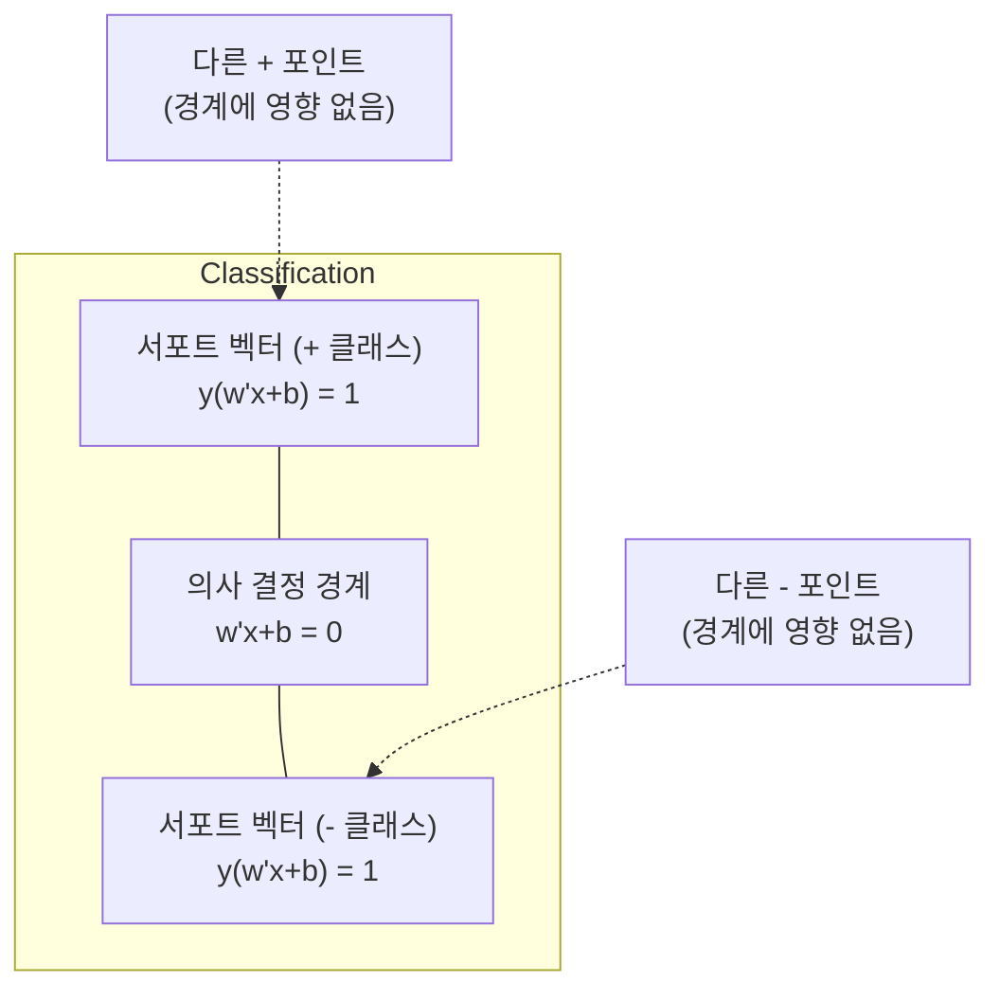
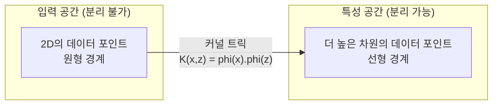

# 서포트 벡터 머신 (SVM)

> 두 클래스 사이에서 가장 넓은 거리를 찾아라. 그것이 전부다.

**유형:** 구현
**언어:** Python
**선수 과목:** Phase 1 (최적화 레슨, 노름과 거리, 볼록 최적화)
**소요 시간:** ~90분

## 학습 목표

- 힌지 손실과 원시 형식의 경사 하강법을 사용하여 선형 SVM을 처음부터 구현한다
- 최대 마진 원리를 설명하고 훈련된 모델에서 서포트 벡터를 식별한다
- 선형, 다항식, RBF 커널을 비교하고 커널 트릭이 명시적인 고차원 매핑을 피하는 방법을 설명한다
- C 매개변수가 제어하는 마진 너비와 분류 오류 사이의 트레이드오프를 평가한다

## 문제

두 클래스의 데이터 포인트가 있고 이를 분리하는 선(또는 초평면)을 그려야 합니다. 무한히 많은 선이 작동할 수 있습니다. 어떤 것을 선택해야 할까요?

가장 큰 마진을 가진 것을 선택합니다. 마진은 의사 결정 경계와 각 측면에서 가장 가까운 데이터 포인트 사이의 거리입니다. 더 넓은 마진은 분류기가 더 자신감 있고 보지 못한 데이터에 더 잘 일반화된다는 뜻입니다.

이 직관은 ML에서 가장 수학적으로 우아한 알고리즘 중 하나인 서포트 벡터 머신으로 이어집니다. SVM은 딥러닝 이전에 지배적인 분류 방법이었으며, 작은 데이터셋, 고차원 데이터, 그리고 이론적 보장이 있는 원칙적이고 잘 이해된 모델이 필요한 문제에 여전히 최선의 선택입니다.

SVM은 Phase 1에 직접 연결됩니다: 최적화는 볼록합니다 (레슨 18), 마진은 노름으로 측정됩니다 (레슨 14), 그리고 커널 트릭은 고차원 공간에서 결코 계산하지 않고도 비선형 경계를 처리하기 위해 내적을 활용합니다.

## 개념

### 최대 마진 분류기

레이블 y_i가 {-1, +1}이고 특성 벡터 x_i가 있는 선형으로 분리 가능한 데이터가 주어지면, 클래스를 분리하는 초평면 w^T x + b = 0을 원합니다.

점에서 초평면까지의 거리는:

```
distance = |w^T x_i + b| / ||w||
```

올바르게 분류된 포인트의 경우: y_i * (w^T x_i + b) > 0. 마진은 양쪽에서 가장 가까운 포인트까지 초평면까지 거리의 두 배입니다.

최적화 문제:

```
maximize    2 / ||w||     (마진 너비)
subject to  y_i * (w^T x_i + b) >= 1  for all i
```

동등하게 (||w||^2 최소화の方が最適化しやすい):

```
minimize    (1/2) ||w||^2
subject to  y_i * (w^T x_i + b) >= 1  for all i
```

이는 볼록 이차 프로그래밍입니다. 유일한 전역 해가 있습니다. 마진 경계에 정확히 앉아있는 데이터 포인트(y_i * (w^T x_i + b) = 1인)가 서포트 벡터입니다. 그것들이 의사 결정 경계를 결정하는 유일한 포인트입니다. 비서포트 벡터 포인트를 이동하거나 제거하면 경계가 변경되지 않습니다.

### 서포트 벡터: 중요한 소수



훈련 포인트의 대부분은 무관합니다. 오직 서포트 벡터만 중요합니다. 이것이 SVM이 예측 시점에 메모리 효율적인 이유입니다: 전체 훈련 세트를 저장할 필요 없이 서포트 벡터만 저장하면 됩니다.

서프트 벡터의 수는 또한 일반화 오차에 대한 범위를 제공합니다. 데이터셋 크기에 비해 서프트 벡터가 적을수록 일반화가 더 좋습니다.

### C 매개변수로 핸들링하는 소프트 마진: 노이즈

실제 데이터는 거의 완벽하게 분리되지 않습니다. 일부 포인트가 경계의 잘못된 측면에 있거나 마진 안에 있을 수 있습니다. 소프트 마진 공식은 슬랙 변수를 도입하여 위반을 허용합니다.

```
minimize    (1/2) ||w||^2 + C * sum(xi_i)
subject to  y_i * (w^T x_i + b) >= 1 - xi_i
            xi_i >= 0  for all i
```

슬랙 변수 xi_i는 포인트 i가 마진을 얼마나 위반하는지를 측정합니다. C가 트레이드오프를 제어합니다:

| C 값 | 동작 |
|---------|----------|
| 큰 C | 위반에 강한 페널티. 좁은 마진, 적은 오분류. 과적합 |
| 작은 C | 더 많은 위반 허용. 넓은 마진, 더 많은 오분류. 과소적합 |

C는 정규화 강도를 반전시킨 것입니다. 큰 C = 덜 정규화. 작은 C = 더 많은 정규화.

### 힌지 손실: SVM 손실 함수

소프트 마진 SVM은 비제약 최적화로 다시 작성할 수 있습니다:

```
minimize    (1/2) ||w||^2 + C * sum(max(0, 1 - y_i * (w^T x_i + b)))
```

항 max(0, 1 - y_i * f(x_i))가 힌지 손실입니다. 포인트가 올바르게 분류되고 마진 밖에 있으면 제로입니다. 포인트가 마진 안이나 오분류되면 선형입니다.

```
단일 포인트에 대한 힌지 손실:

loss
  |
  | \
  |  \
  |   \
  |    \
  |     \_______________
  |
  +-----|-----|-------->  y * f(x)
       0     1

y*f(x) >= 1일 때 (올바르게 분류됨, 마진 밖) 제로 손실.
y*f(x) < 1일 때 선형 페널티.
```

로지스틱 손실과 비교:

```
힌지:     max(0, 1 - y*f(x))          마진에서 하드 컷오프
로지스틱:  log(1 + exp(-y*f(x)))        매끄럽고 절대 제로가 아님
```

힌지 손실은 희소 솔루션을 생성합니다 (비가진 기여를 가진 서포트 벡터만 있음). 로지스틱 손실은 모든 데이터 포인트를 사용합니다. 이것이 SVM이 예측 시점에 더 메모리 효율적인 이유입니다.

### 경사 하강법으로 선형 SVM 훈련

힌지 손실 플러스 L2 정규화에 대한 경사 하강법을 사용하여 선형 SVM을 훈련할 수 있습니다, 제약된 QP를 풀 필요 없이:

```
L(w, b) = (lambda/2) * ||w||^2 + (1/n) * sum(max(0, 1 - y_i * (w^T x_i + b)))

w에 대한 그래디언트:
  If y_i * (w^T x_i + b) >= 1:  dL/dw = lambda * w
  If y_i * (w^T x_i + b) < 1:   dL/dw = lambda * w - y_i * x_i

b에 대한 그래디언트:
  If y_i * (w^T x_i + b) >= 1:  dL/db = 0
  If y_i * (w^T x_i + b) < 1:   dL/db = -y_i
```

이를 원시 형식이라고 합니다. 에포크당 O(n * d)로 실행됩니다, 여기서 n은 샘플 수이고 d는 특성 수입니다. 크고 희소한 고차원 데이터(텍스트 분류)의 경우 이것이 빠릅니다.

### 쌍대 형식과 커널 트릭

SVM 문제의 라그랑주 쌍대 (Phase 1 레슨 18, KKT 조건에서):

```
maximize    sum(alpha_i) - (1/2) * sum_ij(alpha_i * alpha_j * y_i * y_j * (x_i . x_j))
subject to  0 <= alpha_i <= C
            sum(alpha_i * y_i) = 0
```

쌍대 형식은 오직 데이터 포인트 사이의 내적 x_i . x_j만 포함합니다. 이것이 핵심 통찰력입니다. 모든 내적을 커널 함수 K(x_i, x_j)로 교체하면 SVM은 고차원 매핑을 명시적으로 계산하지 않고도 비선형 경계를 학습할 수 있습니다.

```
선형 커널:      K(x, z) = x . z
다항식 커널:  K(x, z) = (x . z + c)^d
RBF (가우시안):     K(x, z) = exp(-gamma * ||x - z||^2)
```

RBF 커널은 데이터를 무한 차원 공간으로 매핑합니다. 입력 공간에서 가까운 포인트는 커널 값이 1에 가깝습니다. 먼 포인트는 커널 값이 0에 가깝습니다. 매끄러운 의사 결정 경계를 모두 학습할 수 있습니다.



커널 트릭은 그 공간으로 결코 가지 않고도 고차원 공간에서 내적을 계산합니다. 차수 d의 D 차원에서 다항식 커널의 명시적 특성 공간은 O(D^d) 차원을 가집니다. 그러나 K(x, z)는 O(D) 시간에 계산됩니다.

### SVM 회귀 (SVR)

서포트 벡터 회귀는 데이터 주위에 epsilon 너비의 튜브를 맞춥니다. 튜브 안의 포인트는 제로 손실을 가집니다. 튜브 밖의 포인트는 선형으로 페널티를 부여합니다.

```
minimize    (1/2) ||w||^2 + C * sum(xi_i + xi_i*)
subject to  y_i - (w^T x_i + b) <= epsilon + xi_i
            (w^T x_i + b) - y_i <= epsilon + xi_i*
            xi_i, xi_i* >= 0
```

epsilon 매개변수는 튜브 너비를 제어합니다. 더 넓은 튜브 = 더 적은 서프트 벡터 = 더 smooth한 피팅. 더 좁은 튜브 = 더 많은 서프트 벡터 = 더 tight한 피팅.

### SVM이 딥러닝에게 진了一口 (그리고 언제 이기는지)

SVM은 1990년대 후반부터 2010년대 초반까지 ML을 지배했습니다. 딥러닝이 여러 이유로 그것을 능가했습니다:

| 요인 | SVM | 딥러닝 |
|------|------|---------------|
| 특성 공학 | 필요함 | 특성 학습 |
| 확장성 | O(n^2) ~ O(n^3) 커널 | SGD로 에포크당 O(n) |
| 이미지/텍스트/오디오 | 수작업 특성 필요 | 원시 데이터에서 학습 |
| 큰 데이터셋 (>100k) | 느림 | 잘 확장 |
| GPU 가속 | 제한된 이점 | 대규모 스피드업 |

SVM이 여전히 이기는 상황:
- 작은 데이터셋 (수백~수천 샘플)
- 고차원 희소 데이터 (TF-IDF 특성의 텍스트)
- 수학적 보장이 필요할 때 (마진 범위)
- 훈련 시간이 최소로 필요할 때 (선형 SVM은 매우 빠름)
- 이진 분류와 명확한 마진 구조
- 이상 탐지 (one-class SVM)

## 실습

### 1단계: 힌지 손실과 그래디언트

기초. 배칭에 대한 힌지 손실과 그래디언트를 계산합니다.

```python
def hinge_loss(X, y, w, b):
    n = len(X)
    total_loss = 0.0
    for i in range(n):
        margin = y[i] * (dot(w, X[i]) + b)
        total_loss += max(0.0, 1.0 - margin)
    return total_loss / n
```

### 2단계: 경사 하강법을 통한 선형 SVM

일반화된 힌지 손실. QP 솔버 불필요.

```python
class LinearSVM:
    def __init__(self, lr=0.001, lambda_param=0.01, n_epochs=1000):
        self.lr = lr
        self.lambda_param = lambda_param
        self.n_epochs = n_epochs
        self.w = None
        self.b = 0.0

    def fit(self, X, y):
        n_features = len(X[0])
        self.w = [0.0] * n_features
        self.b = 0.0

        for epoch in range(self.n_epochs):
            for i in range(len(X)):
                margin = y[i] * (dot(self.w, X[i]) + self.b)
                if margin >= 1:
                    self.w = [wj - self.lr * self.lambda_param * wj
                              for wj in self.w]
                else:
                    self.w = [wj - self.lr * (self.lambda_param * wj - y[i] * X[i][j])
                              for j, wj in enumerate(self.w)]
                    self.b -= self.lr * (-y[i])

    def predict(self, X):
        return [1 if dot(self.w, x) + self.b >= 0 else -1 for x in X]
```

### 3단계: 커널 함수

선형, 다항식, RBF 커널을 구현합니다.

```python
def linear_kernel(x, z):
    return dot(x, z)

def polynomial_kernel(x, z, degree=3, c=1.0):
    return (dot(x, z) + c) ** degree

def rbf_kernel(x, z, gamma=0.5):
    diff = [xi - zi for xi, zi in zip(x, z)]
    return math.exp(-gamma * dot(diff, diff))
```

### 4단계: 마진과 서포트 벡터 식별

훈련 후 어떤 포인트가 서프트 벡터인지 식별하고 마진 너비를 계산합니다.

```python
def find_support_vectors(X, y, w, b, tol=1e-3):
    support_vectors = []
    for i in range(len(X)):
        margin = y[i] * (dot(w, X[i]) + b)
        if abs(margin - 1.0) < tol:
            support_vectors.append(i)
    return support_vectors
```

완전한 구현은 `code/svm.py`를 참조하세요.

## 활용

scikit-learn으로:

```python
from sklearn.svm import SVC, LinearSVC, SVR
from sklearn.preprocessing import StandardScaler
from sklearn.pipeline import Pipeline

clf = Pipeline([
    ("scaler", StandardScaler()),
    ("svm", SVC(kernel="rbf", C=1.0, gamma="scale")),
])
clf.fit(X_train, y_train)
print(f"Accuracy: {clf.score(X_test, y_test):.4f}")
print(f"Support vectors: {clf['svm'].n_support_}")
```

중요: 훈련 전에 항상 특성을 스케일링하세요. SVM은 마진이 ||w||에 의존하기 때문에 특성 크기에 민감합니다. 스케일되지 않은 특성은 기하학을 왜곡합니다.

큰 데이터셋의 경우, `LinearSVC`(원시 형식, 에포크당 O(n))를 `SVC`(쌍대 형식, O(n^2) ~ O(n^3)) 대신 사용하세요.

```python
from sklearn.svm import LinearSVC

clf = Pipeline([
    ("scaler", StandardScaler()),
    ("svm", LinearSVC(C=1.0, max_iter=10000)),
])
```

## 연습 문제

1. 2D 선형으로 분리 가능한 데이터셋을 생성하세요. LinearSVM을 훈련시키고 서프트 벡터를 식별하세요. 서프트 벡터가 의사 결정 경계에 가장 가까운 포인트인지 확인하세요.

2. 노이즈가 있는 데이터셋에서 C를 0.001에서 1000까지 변경하세요. 각 C 값에 대한 의사 결정 경계를 플롯하세요. 넓은 마진(과소적합)에서 좁은 마진(과적합)으로의 전환을 관찰하세요.

3. 클래스 경계가 원형(선형이 아닌)인 데이터셋을 생성하세요. 선형 SVM이 실패함을 보여주세요. RBF 커널 행렬을 계산하고 클래스가 커널 유발 특성 공간에서 분리 가능해짐을 보여주세요.

4. 동일한 데이터셋에 힌지 손실 대 로지스틱 손실을 비교하세요. 선형 SVM과 로지스틱 회귀를 훈련시키세요. 각 모델의 의사 결정 경계에 기여하는 훈련 포인트 수(서프트 벡터 대 모든 포인트)를 세세요.

5. SVR(엡실론 비민감 손실)을 구현하세요. y = sin(x) + noise에 맞춰보세요. 예측 주위의 엡실론 튜브를 플롯하고 서프트 벡터(튜�브 바깥의 포인트)를 강조표시하세요.

## 핵심 용어

| 용어 | 실제 의미 |
|------|----------------------|
| 서프트 벡터 | 훈련 데이터에서 의사 결정 경계에 가장 가까운 포인트. 초평면을 결정하는 유일한 포인트 |
| 마진 | 의사 결정 경계에서 가장 가까운 서프트 벡터까지의 거리. SVM이 이것을 최대화합니다 |
| 힌지 손실 | max(0, 1 - y*f(x)). 올바르게 분류되고 마진 밖에 있으면 제로. 그렇지 않으면 선형 페널티 |
| C 매개변수 | 마진 너비와 분류 오류 사이의 트레이드오프. 큰 C = 좁은 마진, 작은 C = 넓은 마진 |
| 소프트 마진 | 슬랙 변수를 통해 마진 위반을 허용하는 SVM 공식. 비분리 가능 데이터 처리 |
| 커널 트릭 | 고차원 특성 공간에서 내적을 명시적으로 매핑하지 않고 계산합니다 |
| 선형 커널 | K(x, z) = x . z. 표준 내적과 동등. 선형으로 분리 가능한 데이터용 |
| RBF 커널 | K(x, z) = exp(-gamma * \|\|x-z\|\|^2). 무한 차원에 매핑. 매끄러운 경계를 모두 학습 |
| 다항식 커널 | K(x, z) = (x . z + c)^d. 다항식 조합의 특성 공간으로 매핑 |
| 쌍대 형식 | 데이터 포인트 사이의 내적에만 의존하는 SVM 문제의 재구성. 커널 활성화 |
| SVR | 서포트 벡터 회귀. 데이터 주위에 엡실론 튜브를 맞춤. 튜브 안의 포인트는 제로 손실 |
| 슬랙 변수 | xi_i: 포인트가 마진을 얼마나 위반하는지 측정. 올바르게 분류되고 마진 밖이면 제로 |
| 최대 마진 | 각 클래스의 가장 가까운 포인트까지의 거리를 최대화하는 초평면을 선택하는 원리 |

## 추가 자료

- [Vapnik: The Nature of Statistical Learning Theory (1995)](https://link.springer.com/book/10.1007/978-1-4757-3264-1) -- SVM과 통계적 학습 이론에 대한 기본 텍스트
- [Cortes & Vapnik: Support-vector networks (1995)](https://link.springer.com/article/10.1007/BF00994018) -- 원래 SVM 논문
- [Platt: Sequential Minimal Optimization (1998)](https://www.microsoft.com/en-us/research/publication/sequential-minimal-optimization-a-fast-algorithm-for-training-support-vector-machines/) -- SVM 훈련을 실용적으로 만든 SMO 알고리즘
- [scikit-learn SVM documentation](https://scikit-learn.org/stable/modules/svm.html) -- 구현 세부사항이 있는 실용적 가이드
- [LIBSVM: A Library for Support Vector Machines](https://www.csie.ntu.edu.tw/~cjlin/libsvm/) -- 대부분의 SVM 구현 뒤에 있는 C++ 라이브러리