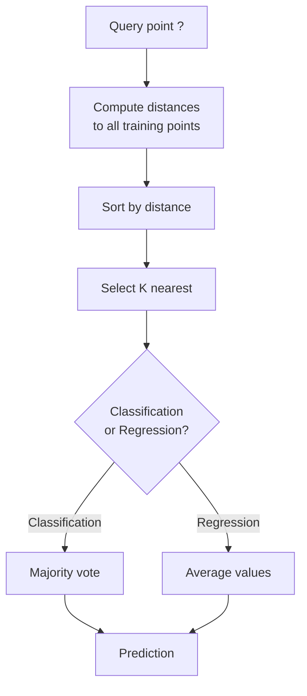
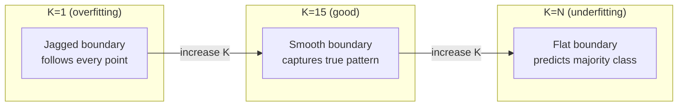
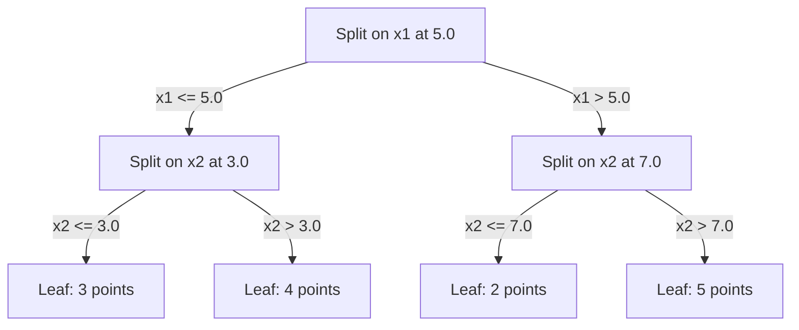

# K-최근접 이웃과 거리

> 모든 것을 저장한다. 이웃을 보고 예측한다. 실제로 작동하는 가장 단순한 알고리즘.

**유형:** 구현
**언어:** Python
**선수 과목:** Phase 1 (Lesson 14 Norms and Distances)
**소요 시간:** ~90분

## 학습 목표

- 구성 가능한 K와 거리 가중 투표를 사용하여 KNN 분류 및 회귀를 처음부터 구현한다
- L1, L2, 코사인, 민코프스키 거리 측정법을 비교하고 주어진 데이터 유형에 적합한 것을 선택한다
- 차원의 저주를 설명하고 KNN이 고차원 공간에서 성능이 저하되는 이유를 실증한다
- 효율적인 최근접 이웃 검색을 위한 KD-트리를 구축하고 언제 브루트포스보다 성능이 뛰어난지 분석한다

## 문제

데이터셋이 있다. 새로운 데이터 포인트가 도착한다. 분류하거나 값을 예측해야 한다. 데이터에서 매개변수를 학습하는 대신(선형 회귀나 SVM처럼), 새 포인트에 가장 가까운 K개의 훈련 포인트를 찾아 투표하게 한다.

이것이 K-최근접 이웃이다. 훈련 단계가 없다. 학습할 매개변수도 없다. 최소화할 손실 함수도 없다. 전체 훈련 세트를 저장하고 예측 시점에 거리를 계산한다.

너무 단순해서 작동하지 않을 것 같지만, KNN은 많은 문제에서 놀랍도록 경쟁력이 있으며, 특히 중소 규모 데이터셋에서 그렇다. KNN을 깊이 이해하면 근본적인 개념들이 드러난다: 거리 측정법의 선택(Phase 1 Lesson 14와 연결), 차원의 저주, 지연 학습과 즉시 학습의 차이.

KNN은 또한 현대 AI의 모든 곳에 다른 이름으로 등장한다. 벡터 데이터베이스는 임베딩에 대해 KNN 검색을 수행한다. 검색 증강 생성(RAG)은 K개의 가장 가까운 문서 청크를 찾는다. 추천 시스템은 유사한 사용자나 항목을 찾는다. 알고리즘은 동일하다. 규모와 데이터 구조가 다를 뿐이다.

## 개념

### KNN 작동 방식

레이블이 지정된 포인트의 데이터셋과 새로운 쿼리 포인트가 주어졌을 때:

1. 데이터셋의 모든 포인트에서 쿼리까지의 거리를 계산한다
2. 거리별로 정렬한다
3. 가장 가까운 K개의 포인트를 선택한다
4. 분류: K개의 이웃 간 다수결 투표
5. 회귀: K개의 이웃 값의 평균(또는 가중 평균)



그것이 전체 알고리즘이다. 피팅 없음. 경사 하강 없음. 에포크 없음.

### K 선택

K는 단일 하이퍼파라미터이다. 편향-분산 트레이드오프를 제어한다:

| K | 동작 |
|---|------|
| K = 1 | 결정 경계가 모든 포인트를 따른다. 훈련 오차 영. 높은 분산. 과적합 |
| 작은 K (3-5) | 로컬 구조에 민감. 복잡한 경계를 포착할 수 있음 |
| 큰 K | 더 부드러운 경계. 노이즈에 더 강건. 과소적합 가능 |
| K = N | 모든 포인트에 대해 다수 클래스를 예측. 최대 편향 |

N개의 포인트가 있는 데이터셋에 대해 일반적인 시작점은 K = sqrt(N)이다. 동점을 피하려면 이진 분류에 보통 홀수 K를 사용한다.



### 거리 측정법

거리 함수는 "근접"의 정의를 정의한다. 다른 측정법은 다른 이웃, 다른 예측을 생성한다.

**L2 (유클리드)**가 기본값이다. 직선 거리이다.

```
d(a, b) = sqrt(sum((a_i - b_i)^2))
```

특성 스케일에 민감하다. L2와 KNN을 사용할 때는 항상 특성을 표준화한다.

**L1 (맨해튼)**은 절대 차이의 합이다. 차이를 제곱하지 않기 때문에 L2보다 이상값에 더 강건하다.

```
d(a, b) = sum(|a_i - b_i|)
```

**코사인 거리**는 크기를 무시하고 벡터 간의 각도를 측정한다. 텍스트와 임베딩 데이터에 필수적이다.

```
d(a, b) = 1 - (a . b) / (||a|| * ||b||)
```

**민코프스키**는 매개변수 p로 L1과 L2를 일반화한다.

```
d(a, b) = (sum(|a_i - b_i|^p))^(1/p)

p=1: Manhattan
p=2: Euclidean
p->inf: Chebyshev (max absolute difference)
```

어떤 측정법을 사용할지는 데이터에 따라 다르다:

| 데이터 유형 | 최선의 측정법 | 이유 |
|-----------|------------|-----|
| 유사한 스케일의 수치형 특성 | L2 (유클리드) | 기본값, 공간 데이터에 작동 |
| 이상값이 있는 수치형 특성 | L1 (맨해튼) | 강건, 큰 차이를 증폭하지 않음 |
| 텍스트 임베딩 | 코사인 | 크기는 노이즈, 방향이 의미 |
| 고차원 희소 데이터 | 코사인 또는 L1 | L2는 차원의 저주에 고통받음 |
| 혼합 유형 | 커스텀 거리 | 특성 유형별로 측정법을 결합 |

### 가중 KNN

표준 KNN은 모든 K개의 이웃에 동일한 가중치를 부여한다. 하지만 거리 0.1인 이웃은 거리 5.0인 이웃보다 더 중요해야 한다.

**거리 가중 KNN**은 각 이웃을 거리에 반비례하게 가중치 부여한다:

```
weight_i = 1 / (distance_i + epsilon)

분류: 가중 투표
회귀:     가중 평균 = sum(w_i * y_i) / sum(w_i)
```

epsilon은 쿼리 포인트가 훈련 포인트와 정확히 일치할 때 0으로 나누기를 방지한다.

가중 KNN은 먼 이웃이 관계없이 매우 적게 기여하기 때문에 K 선택에 덜 민감하다.

### 차원의 저주

KNN 성능은 고차원에서 저하된다. 이것은 모호한 우려가 아니다. 수학적 사실이다.

**문제 1: 거리가 수렴한다.** 차원이 증가함에 따라 최대 거리 대 최소 거리의 비율이 1에 접근한다. 모든 포인트가 쿼리에서同等에 "멀다".

```
d 차원에서 무작위 균일 포인트의 경우:

d=2:    max_dist / min_dist = 다양하게 변함
d=100:  max_dist / min_dist ~ 1.01
d=1000: max_dist / min_dist ~ 1.001

모든 거리가 거의 같을 때, "가장 가까운"은 의미가 없다.
```

**문제 2: 부피가 폭발한다.** 고정된 데이터 비율 내에서 K개의 이웃을 포착하려면 더 큰 특성 공간 비율을 커버하도록 검색 반경을 확장해야 한다. 고차원에서의 "이웃"은 공간의 대부분을포괄한다.

**문제 3: 모서리가 지배한다.** d 차원의 단위 초입방체에서 부피의 대부분은 중심이 아닌 모서리 근처에 집중된다. 입방체에 내접한 구는 d가 증가함에 따라 부피의 극히 일부만 포함한다.

실용적 결과: KNN은 약 20-50개의 특성까지 잘 작동한다. 그 이상에서는 KNN을 적용하기 전에 차원 축소(PCA, UMAP, t-SNE)가 필요하거나, 데이터의 내재적 낮은 차원을 활용하는 트리 기반 검색 구조를 사용해야 한다.

### KD-트리: 빠른 최근접 이웃 검색

브루트포스 KNN은 쿼리에서 모든 훈련 포인트까지의 거리를 계산한다. 쿼리당 O(n * d)이다. 큰 데이터셋에서는 이것이 너무 느리다.

KD-트리는 특성 축을 따라 재귀적으로 공간을 분할한다. 각 레벨에서 중앙값에서 하나의 차원으로 분할한다.



가장 가까운 이웃을 찾으려면, 쿼리를 포함하는 리프까지 트리를 탐색한 다음, 백트래킹하여 더 가까운 포인트를 포함할 수 있는 인접 파티션만 확인한다.

평균 쿼리 시간: 낮은 차원에서 O(log n)이다. 하지만 KD-트리는 백트래킹이越来越少의 분기를 제거하기 때문에 고차원(d > 20)에서 O(n)으로 저하된다.

### Ball 트리:中等 차원에 더 나은

Ball 트리는 축 정렬 상자가 아닌 중첩된 초구로 데이터를 분할한다. 각 노드는 해당 하위 트리의 모든 포인트를 포함하는 공(중심 + 반경)을 정의한다.

KD-트리보다 장점:
- 中等 차원(~50까지)에서 더 잘 작동
- 축 정렬이 아닌 구조를 처리
- 더 엄격한 경계 볼륨은 검색 중 더 많은 분기가 제거됨을 의미

KD-트리와 Ball 트리 모두 정확한 알고리즘이다. 진정으로 대규모 검색(수백만 포인트, 수백 차원)의 경우, 근사 최근접 이웃 방법(HNSW, IVF, 제품 양자화)이 대신 사용된다. 이는 Phase 1 Lesson 14에서 다룬다.

### 지연 학습 대 즉시 학습

KNN은 지연 학습자이다: 훈련 시점에 아무 작업도 하지 않고 예측 시점에 모든 작업을 한다. 다른 대부분의 알고리즘(선형 회귀, SVM, 신경망)은 즉시 학습자이다: 훈련 시점에 컴팩트 모델을 구축하기 위해 무거운 계산을 하고, 예측은 빠르다.

| 측면 | 지연 (KNN) | 즉시 (SVM, 신경망) |
|------|------------|------------------------|
| 훈련 시간 | O(1) 데이터 저장만 | O(n * epochs) |
| 예측 시간 | 쿼리당 O(n * d) | O(d) 또는 O(매개변수) |
| 예측 시 메모리 | 전체 훈련 세트 저장 | 모델 매개변수만 저장 |
| 새 데이터에 적응 | 즉시 포인트 추가 | 모델 재훈련 |
| 결정 경계 | 암시적, 그때그때 계산 | 명시적, 훈련 후 고정 |

지연 학습이 이상적인 경우:
- 데이터셋이 자주 변경되는 경우(재훈련 없이 포인트 추가/제거)
- 매우 적은 쿼리에 대한 예측이 필요한 경우
- 제로 훈련 시간이 필요한 경우
- 브루트포스 검색이 충분히 빠른 정도로 데이터셋이 작은 경우

### 회귀용 KNN

다수결 투표 대신, 회귀용 KNN은 K개의 이웃의 목표 값을 평균한다.

```
prediction = (1/K) * sum(y_i for i in K nearest neighbors)

거리 가중 시:
prediction = sum(w_i * y_i) / sum(w_i)
where w_i = 1 / distance_i
```

KNN 회귀는 조각별 상수(또는 가중 시 조각별 부드러운) 예측을 생성한다. 훈련 데이터 범위를 넘어 외삽할 수 없다. 훈련 목표가 모두 0에서 100 사이이면, KNN은 절대 200을 예측하지 않는다.

## 구현

### 1단계: 거리 함수

L1, L2, 코사인, 민코프스키 거리를 구현한다. 이것들은 Phase 1 Lesson 14와 직접 연결된다.

```python
import math

def l2_distance(a, b):
    return math.sqrt(sum((ai - bi) ** 2 for ai, bi in zip(a, b)))

def l1_distance(a, b):
    return sum(abs(ai - bi) for ai, bi in zip(a, b))

def cosine_distance(a, b):
    dot_val = sum(ai * bi for ai, bi in zip(a, b))
    norm_a = math.sqrt(sum(ai ** 2 for ai in a))
    norm_b = math.sqrt(sum(bi ** 2 for bi in b))
    if norm_a == 0 or norm_b == 0:
        return 1.0
    return 1.0 - dot_val / (norm_a * norm_b)

def minkowski_distance(a, b, p=2):
    if p == float('inf'):
        return max(abs(ai - bi) for ai, bi in zip(a, b))
    return sum(abs(ai - bi) ** p for ai, bi in zip(a, b)) ** (1 / p)
```

### 2단계: KNN 분류기 및 회귀기

구성 가능한 K, 거리 측정법, 선택적 거리 가중치를 포함한 완전한 KNN을 구축한다.

```python
class KNN:
    def __init__(self, k=5, distance_fn=l2_distance, weighted=False,
                 task="classification"):
        self.k = k
        self.distance_fn = distance_fn
        self.weighted = weighted
        self.task = task
        self.X_train = None
        self.y_train = None

    def fit(self, X, y):
        self.X_train = X
        self.y_train = y

    def predict(self, X):
        return [self._predict_one(x) for x in X]
```

### 3단계: 효율적 검색을 위한 KD-트리

각 차원의 중앙값에서 재귀적으로 분할하는 KD-트리를 처음부터 구축한다.

```python
class KDTree:
    def __init__(self, X, indices=None, depth=0):
        # Recursively partition the data
        self.axis = depth % len(X[0])
        # Split on median of the current axis
        ...

    def query(self, point, k=1):
        # Traverse to leaf, then backtrack
        ...
```

완전한 구현과 모든 헬퍼 메서드 및 데모는 `code/knn.py`를 참조.

### 4단계: 특성 스케일링

KNN은 거리가 특성 크기에 민감하기 때문에 특성 스케일링이 필요하다. 0에서 1000까지 범위인 특성은 0에서 1까지 범위인 특성을 지배한다.

```python
def standardize(X):
    n = len(X)
    d = len(X[0])
    means = [sum(X[i][j] for i in range(n)) / n for j in range(d)]
    stds = [
        max(1e-10, (sum((X[i][j] - means[j]) ** 2 for i in range(n)) / n) ** 0.5)
        for j in range(d)
    ]
    return [[((X[i][j] - means[j]) / stds[j]) for j in range(d)] for i in range(n)], means, stds
```

## 활용

scikit-learn 사용:

```python
from sklearn.neighbors import KNeighborsClassifier
from sklearn.preprocessing import StandardScaler
from sklearn.pipeline import Pipeline

clf = Pipeline([
    ("scaler", StandardScaler()),
    ("knn", KNeighborsClassifier(n_neighbors=5, metric="euclidean")),
])
clf.fit(X_train, y_train)
print(f"Accuracy: {clf.score(X_test, y_test):.4f}")
```

scikit-learn은 데이터셋이 충분히 크고 차원이 충분히 낮은 경우 자동으로 KD-트리 또는 Ball 트리를 사용한다. 고차원 데이터의 경우 브루트포스로 돌아간다. `algorithm` 매개변수로 제어할 수 있다.

대규모 최근접 이웃 검색(수백만 벡터)의 경우 FAISS, Annoy 또는 벡터 데이터베이스 사용:

```python
import faiss

index = faiss.IndexFlatL2(dimension)
index.add(embeddings)
distances, indices = index.search(query_vectors, k=5)
```

## 연습 문제

1. 3개의 클래스가 있는 2D 데이터셋에서 KNN 분류를 구현한다. K=1, K=5, K=15, K=N에 대한 결정 경계를 플롯한다. 과적합에서 과소적합으로의 전환을 관찰한다.

2. 2, 5, 10, 50, 100, 500 차원에서 1000개의 무작위 포인트를 생성한다. 각 차원에 대해 최대 쌍거리 대 최소 쌍거리의 비율을 계산한다. 차원의 저주를 시각화하기 위해 비율 대 차원을 플롯한다.

3. 텍스트 분류 문제(TF-IDF 벡터 사용)에서 KNN에 대해 L1, L2, 코사인 거리를 비교한다. 어떤 측정법이 가장 좋은 정확도를 제공하는가? 코사인이 텍스트에勝利傾向이 있는 이유는 무엇인가?

4. KD-트리를 구현하고 2D, 10D, 50D에서 1k, 10k, 100k 포인트의 데이터셋에 대해 쿼리 시간 대 브루트포스를 측정한다. 어떤 차원에서 KD-트리가 브루트포스보다 느려지는가?

5. y = sin(x) + noise에 대해 가중 KNN 회귀기를 구축한다. K=3, 10, 30에서 가중이 아닌 KNN과 비교한다. 가중치가 더 부드러운 예측을 생성함을 보여준다, 특히 큰 K에 대해.

## 핵심 용어

| 용어 | 실제 의미 |
|------|----------------------|
| K-최근접 이웃 | 쿼리에 가장 가까운 K개의 훈련 포인트를 찾아 예측하는 비모수 알고리즘 |
| 지연 학습 | 훈련 시점의 컴퓨팅 없음. 모든 작업이 예측 시점에 발생. KNN이 정형적 예시 |
| 즉시 학습 | 컴팩트 모델을 구축하기 위해 훈련 시점에 무거운 컴퓨팅. 대부분의 ML 알고리즘이 즉시 학습 |
| 차원의 저주 | 고차원에서는 거리가 수렴하고 이웃이 공간의 대부분을 커버하여 KNN이 비효율적이 됨 |
| KD-트리 | 특성 축을 따라 재귀적으로 공간을 분할하는 이진 트리. 낮은 차원에서 O(log n) 쿼리 |
| Ball 트리 | 중첩된 초구의 트리. 中等 차원(~50까지)에서 KD-트리보다 더 잘 작동 |
| 가중 KNN | 거리 반비례로 가중된 이웃. 더 가까운 이웃이 예측에 더 큰 영향 |
| 특성 스케일링 | 특성을 유사한 범위로 정규화. KNN과 같은 거리 기반 방법에 필요 |
| 다수결 투표 | K개의 이웃 중 어느 클래스가 가장 일반적인지 세어서 분류 |
| 브루트포스 검색 | 모든 훈련 포인트까지의 거리를 계산. 쿼리당 O(n*d). 정확하지만 n이 크면 느림 |
| 근사 최근접 이웃 | 정확한 검색보다 훨씬 빠르게 대략적으로 가장 가까운 포인트를 찾는 알고리즘(HNSW, LSH, IVF) |
| 보로노이 다이어그램 | 각 영역이 다른 훈련 포인트보다 하나의 훈련 포인트에 더 가까운 모든 포인트를 포함하는 공간 분할. K=1 KNN은 보로노이 경계를 생성 |

## 추가 자료

- [Cover & Hart: Nearest Neighbor Pattern Classification (1967)](https://ieeexplore.ieee.org/document/1053964) - 베이즈 최적보다 오차율이 최대 2배임을 증명하는奠基적 KNN 논문
- [Friedman, Bentley, Finkel: An Algorithm for Finding Best Matches in Logarithmic Expected Time (1977)](https://dl.acm.org/doi/10.1145/355744.355745) - 원래 KD-트리 논문
- [Beyer et al.: When Is "Nearest Neighbor" Meaningful? (1999)](https://link.springer.com/chapter/10.1007/3-540-49257-7_15) - 최근접 이웃에 대한 차원의 저주의 형식적 분석
- [scikit-learn Nearest Neighbors documentation](https://scikit-learn.org/stable/modules/neighbors.html) - 알고리즘 선택이 있는 실용적 가이드
- [FAISS: A Library for Efficient Similarity Search](https://github.com/facebookresearch/faiss) - 10억 규모 근사 최근접 이웃 검색을 위한 Meta의 라이브러리