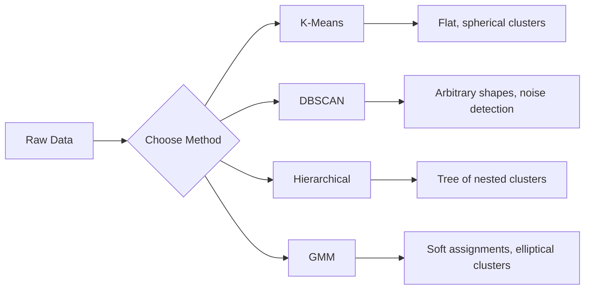

# 비지도 학습

> 레이블도, 선생님도 없습니다. 알고리즘이 스스로 구조를 찾습니다.

**유형:** 빌드
**언어:** Python
**선수 과목:** Phase 1 (Norms & Distances, Probability & Distributions), Phase 2 Lessons 1-6
**소요 시간:** ~90분

## 학습 목표

- K-평균, DBSCAN, 가우시안 혼합 모델을 처음부터 구현하고 클러스터링 동작 비교하기
- 실루엣 점수와 엘보우 방법으로 최적 K 선택하고 클러스터 품질 평가하기
- DBSCAN이 K-평균을 능가하는 시기와 어떤 알고리즘이 비구형 클러스터/이상치를 처리하는지 식별하기
- 클러스터링 방법으로 정상 패턴에서 벗어난 점을 표시하는 이상 탐지 파이프라인 구축하기

## 문제

지금까지의 모든 ML 수업은 레이블이 지정된 데이터를 가정했다: "여기에 입력이 있고, 여기에 올바른 출력이 있다." 현실 세계에서 레이블은 비싸다. 병원은 수백만 개의 환자 기록을 가지고 있지만 누구도 각 레코드에 질병 범주를 수동으로 태깅하지 않았다. 이커머스 사이트는 수백만 개의 사용자 세션을 가지고 있지만 누구도 고객 세그먼트를 수동으로 레이블링하지 않았다. 보안 팀은 네트워크 로그를 가지고 있지만 누구도 모든 이상을 플래그하지 않았다.

비지도 학습은 무엇을 찾아야 하는지 알려주지 않아도 패턴을 찾는다. 유사한 데이터 포인트를 그룹화하고, 숨겨진 구조를 발견하며, 이상을 표면화한다. 지도 학습이 답변이 있는 교과서로 배우는 것이라면, 비지도 학습은 패턴이 스스로 드러날 때까지 날것의 데이터를 응시하는 것이다.

문제: 레이블이 없으면 "맞음" 또는 "틀림"을 직접 측정할 수 없다. 알고리즘이 찾은 구조가 의미 있는지 평가하기 위해 다른 도구가 필요하다.

## 개념

### 클러스터링: 비슷한 것들을 함께 그룹화

클러스터링은 각 데이터 포인트를 그룹(클러스터)에 할당하여 동일한 그룹 내의 포인트가 다른 그룹의 포인트보다 더 유사하도록 한다. 질문은 항상: "유사"의 의미는 무엇인가?



### K-평균: 작업horse

K-평균은 데이터를 정확히 K개의 클러스터로 분할한다. 각 클러스터는 중심(질량 중심)을 가지고 있으며, 모든 포인트는 가장 가까운中心に 할당된다.

Lloyd의 알고리즘:

1. K개의 무작위 포인트를 초기 중심으로 선택
2. 각 데이터 포인트를 가장 가까운中心に 할당
3. 할당된 포인트의 평균으로 각 중심을 재계산
4. 할당이 더 이상 변경되지 않을 때까지 단계 2-3 반복

목적 함수(관성)는 각 포인트에서 할당된 중심으로의 총 제곱 거리를 측정한다. K-평균은 이를 최소화하지만 지역 최소값만 찾는다. 다른 초기화는 다른 결과를 줄 수 있다.

### K 선택

두 가지 표준 방법:

**엘보우 방법:** K = 1, 2, 3, ..., n에 대해 K-평균을 실행한다. 관성 대 K를 플롯한다. 더 많은 클러스터를 추가해도 관성이 크게 감소하지 않는 "팔꿈치"를 찾는다.

**실루엣 점수:** 각 포인트에 대해 자체 클러스터와의 유사성(a)과 가장 가까운 다른 클러스터와의 유사성(b)을 측정한다. 실루엣 계수는 (b - a) / max(a, b)이고, -1(잘못된 클러스터)에서 +1(잘 클러스터링됨)까지 범위이다. 글로벌 점수를 위해 모든 포인트에서 평균을낸다.

### DBSCAN: 밀도 기반 클러스터링

K-평균은 클러스터가 구형이라고 가정하고事前に K를 선택해야 한다. DBSCAN은 두 가지 가정 모두를 하지 않는다. 희소한 영역으로 분리된 밀도 높은 영역으로 클러스터를 찾는다.

두 가지 매개변수:
- **eps**: 이웃의 반경
- **min_samples**: 밀도 높은 영역을 형성하는 데 필요한 최소 포인트 수

세 가지 유형의 포인트:
- **핵심점**: eps 거리 내에 min_samples 이상의 포인트가 있다
- **경계점**: 핵심점의 eps 내에 있지만 자체는 핵심점이 아니다
- **노이즈점**: 핵심점도 경계점도 아니다. 이것들이 이상값이다.

DBSCAN은 eps 내의 핵심점을 동일한 클러스터로 연결한다. 경계점은 nearby 핵심점의 클러스터에 합류한다. 노이즈점은 어떤 클러스터에도 속하지 않는다.

강점: любой 형태의 클러스터를 찾고, 자동으로 클러스터 수를 결정하며, 이상치를 식별한다. 약점: 다양한 밀도의 클러스터에 어려움을 겪는다.

### 계층적 클러스터링

중첩된 클러스터의 트리(벽돌다그램)를 구축한다.

응집형(bottom-up):
1. 각 포인트를 자체 클러스터로 시작
2. 가장 가까운 두 클러스터를 병합
3. 하나의 클러스터만 남을 때까지 반복
4. 원하는 수준에서 벽돌다그램을 잘라 K개의 클러스터 얻기

클러스터 간의 "근접성"은 다음과 같이 측정할 수 있다:
- **단일 연결**: 두 클러스터의 두 포인트 간 최소 거리
- **완전 연결**: 두 클러스터의 두 포인트 간 최대 거리
- **평균 연결**: 모든 쌍 간 평균 거리
- **Ward 방법**: 총 클러스터 내 분산을 가장 적게 증가시키는 병합

### 가우시안 혼합 모델 (GMM)

K-평균은 하드 할당을 제공한다: 각 포인트는 정확히 하나의 클러스터에 속한다. GMM은 소프트 할당을 제공한다: 각 포인트는 각 클러스터에 속할 확률을 가진다.

GMM은 데이터가 각자의 평균과 공분산을 가진 K개의 가우시안 분포의 혼합에서 생성되었다고 가정한다. 기대값-최대화(EM) 알고리즘은 다음 사이를 교대로 진행한다:

- **E-단계**: 각 포인트가 각 가우시안에 속할 확률을 계산
- **M-단계**: 데이터의 우도를 최대화하도록 각 가우시안의 평균, 공분산, 혼합 가중치를 업데이트

GMM은 타원 클러스터(K-평균처럼 구형만 아닌)를 모델링하고 자연스럽게 overlapping 클러스터를 처리할 수 있다.

### 언제 무엇을 사용할지

| 방법 | 최적 | 피할 때 |
|------|------|---------|
| K-평균 | 큰 데이터셋, 구형 클러스터, 알려진 K | 불규칙한 형태, 이상치 존재 |
| DBSCAN | 알려지지 않은 K, 임의의 형태, 이상치 탐지 | 다양한 밀도, 매우 높은 차원 |
| 계층적 | 작은 데이터셋, 벽돌다그램 필요, 알려지지 않은 K | 큰 데이터셋 (O(n^2) 메모리) |
| GMM | overlapping 클러스터, 소프트 할당 필요 | 매우 큰 데이터셋, 너무 많은 차원 |

### 클러스터링을 사용한 이상 탐지

클러스터링은 자연스럽게 이상 탐지를 지원한다:
- **K-평균**: 어떤 중심으로부터 멀리 떨어진 포인트가 이상치이다
- **DBSCAN**: 노이즈 포인트가 정의에 의해 이상치이다
- **GMM**: 모든 가우시안에서 낮은 확률을 가진 포인트가 이상치이다

## 빌드

### 1단계: 처음부터 K-평균

```python
import math
import random


def euclidean_distance(a, b):
    return math.sqrt(sum((ai - bi) ** 2 for ai, bi in zip(a, b)))


def kmeans(data, k, max_iterations=100, seed=42):
    random.seed(seed)
    n_features = len(data[0])

    centroids = random.sample(data, k)

    for iteration in range(max_iterations):
        clusters = [[] for _ in range(k)]
        assignments = []

        for point in data:
            distances = [euclidean_distance(point, c) for c in centroids]
            nearest = distances.index(min(distances))
            clusters[nearest].append(point)
            assignments.append(nearest)

        new_centroids = []
        for cluster in clusters:
            if len(cluster) == 0:
                new_centroids.append(random.choice(data))
                continue
            centroid = [
                sum(point[j] for point in cluster) / len(cluster)
                for j in range(n_features)
            ]
            new_centroids.append(centroid)

        if all(
            euclidean_distance(old, new) < 1e-6
            for old, new in zip(centroids, new_centroids)
        ):
            print(f"  Converged at iteration {iteration + 1}")
            break

        centroids = new_centroids

    return assignments, centroids
```

### 2단계: 엘보우 방법과 실루엣 점수

```python
def compute_inertia(data, assignments, centroids):
    total = 0.0
    for point, cluster_id in zip(data, assignments):
        total += euclidean_distance(point, centroids[cluster_id]) ** 2
    return total


def silhouette_score(data, assignments):
    n = len(data)
    if n < 2:
        return 0.0

    clusters = {}
    for i, c in enumerate(assignments):
        clusters.setdefault(c, []).append(i)

    if len(clusters) < 2:
        return 0.0

    scores = []
    for i in range(n):
        own_cluster = assignments[i]
        own_members = [j for j in clusters[own_cluster] if j != i]

        if len(own_members) == 0:
            scores.append(0.0)
            continue

        a = sum(euclidean_distance(data[i], data[j]) for j in own_members) / len(own_members)

        b = float("inf")
        for cluster_id, members in clusters.items():
            if cluster_id == own_cluster:
                continue
            avg_dist = sum(euclidean_distance(data[i], data[j]) for j in members) / len(members)
            b = min(b, avg_dist)

        if max(a, b) == 0:
            scores.append(0.0)
        else:
            scores.append((b - a) / max(a, b))

    return sum(scores) / len(scores)


def find_best_k(data, max_k=10):
    print("Elbow method:")
    inertias = []
    for k in range(1, max_k + 1):
        assignments, centroids = kmeans(data, k)
        inertia = compute_inertia(data, assignments, centroids)
        inertias.append(inertia)
        print(f"  K={k}: inertia={inertia:.2f}")

    print("\nSilhouette scores:")
    for k in range(2, max_k + 1):
        assignments, centroids = kmeans(data, k)
        score = silhouette_score(data, assignments)
        print(f"  K={k}: silhouette={score:.4f}")

    return inertias
```

### 3단계: 처음부터 DBSCAN

```python
def dbscan(data, eps, min_samples):
    n = len(data)
    labels = [-1] * n
    cluster_id = 0

    def region_query(point_idx):
        neighbors = []
        for i in range(n):
            if euclidean_distance(data[point_idx], data[i]) <= eps:
                neighbors.append(i)
        return neighbors

    visited = [False] * n

    for i in range(n):
        if visited[i]:
            continue
        visited[i] = True

        neighbors = region_query(i)

        if len(neighbors) < min_samples:
            labels[i] = -1
            continue

        labels[i] = cluster_id
        seed_set = list(neighbors)
        seed_set.remove(i)

        j = 0
        while j < len(seed_set):
            q = seed_set[j]

            if not visited[q]:
                visited[q] = True
                q_neighbors = region_query(q)
                if len(q_neighbors) >= min_samples:
                    for nb in q_neighbors:
                        if nb not in seed_set:
                            seed_set.append(nb)

            if labels[q] == -1:
                labels[q] = cluster_id

            j += 1

        cluster_id += 1

    return labels
```

### 4단계: 가우시안 혼합 모델 (EM 알고리즘)

```python
def gmm(data, k, max_iterations=100, seed=42):
    random.seed(seed)
    n = len(data)
    d = len(data[0])

    indices = random.sample(range(n), k)
    means = [list(data[i]) for i in indices]
    variances = [1.0] * k
    weights = [1.0 / k] * k

    def gaussian_pdf(x, mean, variance):
        d = len(x)
        coeff = 1.0 / ((2 * math.pi * variance) ** (d / 2))
        exponent = -sum((xi - mi) ** 2 for xi, mi in zip(x, mean)) / (2 * variance)
        return coeff * math.exp(max(exponent, -500))

    for iteration in range(max_iterations):
        responsibilities = []
        for i in range(n):
            probs = []
            for j in range(k):
                probs.append(weights[j] * gaussian_pdf(data[i], means[j], variances[j]))
            total = sum(probs)
            if total == 0:
                total = 1e-300
            responsibilities.append([p / total for p in probs])

        old_means = [list(m) for m in means]

        for j in range(k):
            r_sum = sum(responsibilities[i][j] for i in range(n))
            if r_sum < 1e-10:
                continue

            weights[j] = r_sum / n

            for dim in range(d):
                means[j][dim] = sum(
                    responsibilities[i][j] * data[i][dim] for i in range(n)
                ) / r_sum

            variances[j] = sum(
                responsibilities[i][j]
                * sum((data[i][dim] - means[j][dim]) ** 2 for dim in range(d))
                for i in range(n)
            ) / (r_sum * d)
            variances[j] = max(variances[j], 1e-6)

        shift = sum(
            euclidean_distance(old_means[j], means[j]) for j in range(k)
        )
        if shift < 1e-6:
            print(f"  GMM converged at iteration {iteration + 1}")
            break

    assignments = []
    for i in range(n):
        assignments.append(responsibilities[i].index(max(responsibilities[i])))

    return assignments, means, weights, responsibilities
```

### 5단계: 테스트 데이터 생성 및 모두 실행

```python
def make_blobs(centers, n_per_cluster=50, spread=0.5, seed=42):
    random.seed(seed)
    data = []
    true_labels = []
    for label, (cx, cy) in enumerate(centers):
        for _ in range(n_per_cluster):
            x = cx + random.gauss(0, spread)
            y = cy + random.gauss(0, spread)
            data.append([x, y])
            true_labels.append(label)
    return data, true_labels


def make_moons(n_samples=200, noise=0.1, seed=42):
    random.seed(seed)
    data = []
    labels = []
    n_half = n_samples // 2
    for i in range(n_half):
        angle = math.pi * i / n_half
        x = math.cos(angle) + random.gauss(0, noise)
        y = math.sin(angle) + random.gauss(0, noise)
        data.append([x, y])
        labels.append(0)
    for i in range(n_half):
        angle = math.pi * i / n_half
        x = 1 - math.cos(angle) + random.gauss(0, noise)
        y = 1 - math.sin(angle) - 0.5 + random.gauss(0, noise)
        data.append([x, y])
        labels.append(1)
    return data, labels


if __name__ == "__main__":
    centers = [[2, 2], [8, 3], [5, 8]]
    data, true_labels = make_blobs(centers, n_per_cluster=50, spread=0.8)

    print("=== K-Means on 3 blobs ===")
    assignments, centroids = kmeans(data, k=3)
    print(f"  Centroids: {[[round(c, 2) for c in cent] for cent in centroids]}")
    sil = silhouette_score(data, assignments)
    print(f"  Silhouette score: {sil:.4f}")

    print("\n=== Elbow Method ===")
    find_best_k(data, max_k=6)

    print("\n=== DBSCAN on 3 blobs ===")
    db_labels = dbscan(data, eps=1.5, min_samples=5)
    n_clusters = len(set(db_labels) - {-1})
    n_noise = db_labels.count(-1)
    print(f"  Found {n_clusters} clusters, {n_noise} noise points")

    print("\n=== GMM on 3 blobs ===")
    gmm_assignments, gmm_means, gmm_weights, _ = gmm(data, k=3)
    print(f"  Means: {[[round(m, 2) for m in mean] for mean in gmm_means]}")
    print(f"  Weights: {[round(w, 3) for w in gmm_weights]}")
    gmm_sil = silhouette_score(data, gmm_assignments)
    print(f"  Silhouette score: {gmm_sil:.4f}")

    print("\n=== DBSCAN on moons (non-spherical clusters) ===")
    moon_data, moon_labels = make_moons(n_samples=200, noise=0.1)
    moon_db = dbscan(moon_data, eps=0.3, min_samples=5)
    n_moon_clusters = len(set(moon_db) - {-1})
    n_moon_noise = moon_db.count(-1)
    print(f"  Found {n_moon_clusters} clusters, {n_moon_noise} noise points")

    print("\n=== K-Means on moons (will fail to separate) ===")
    moon_km, moon_centroids = kmeans(moon_data, k=2)
    moon_sil = silhouette_score(moon_data, moon_km)
    print(f"  Silhouette score: {moon_sil:.4f}")
    print("  K-Means splits moons poorly because they are not spherical")

    print("\n=== Anomaly detection with DBSCAN ===")
    anomaly_data = list(data)
    anomaly_data.append([20.0, 20.0])
    anomaly_data.append([-5.0, -5.0])
    anomaly_data.append([15.0, 0.0])
    anomaly_labels = dbscan(anomaly_data, eps=1.5, min_samples=5)
    anomalies = [
        anomaly_data[i]
        for i in range(len(anomaly_labels))
        if anomaly_labels[i] == -1
    ]
    print(f"  Detected {len(anonyms)} anomalies")
    for a in anomalies[-3:]:
        print(f"    Point {[round(v, 2) for v in a]}")
```

## 활용

scikit-learn을 사용하면 동일한 알고리즘이 한 줄이다:

```python
from sklearn.cluster import KMeans, DBSCAN, AgglomerativeClustering
from sklearn.mixture import GaussianMixture
from sklearn.metrics import silhouette_score as sklearn_silhouette

km = KMeans(n_clusters=3, random_state=42).fit(data)
db = DBSCAN(eps=1.5, min_samples=5).fit(data)
agg = AgglomerativeClustering(n_clusters=3).fit(data)
gmm_model = GaussianMixture(n_components=3, random_state=42).fit(data)
```

처음부터 작성한 버전은 이러한 라이브러리가 정확히 무엇을 계산하는지 보여준다. K-평균은 할당과 재계산 사이를 반복한다. DBSCAN은 밀도 있는 시드에서 클러스터를 성장시킨다. GMM은 기대값과 최대화 사이를 교대로 진행한다. 라이브러리 버전은 수치적 안정성, 더 똑똑한 초기화(K-평균++), GPU 가속을 추가하지만 핵심 로직은 동일하다.

## 결과물

이 수업은 처음부터 K-평균, DBSCAN, GMM의 작동 가능한 구현을 생성한다. 클러스터링 코드는 더 고급 비지도 메서드의 기반로 재사용될 수 있다.

## 연습 문제

1. K-평균++ 초기화를 구현한다: 무작위로 중심을 선택하는 대신, 첫 번째는 무작위로 선택하고 각 후속 중심은 가장 가까운 기존 중심으로부터의 제곱 거리에 비례하는 확률로 선택한다. 무작위 초기화와 수렴 속도를 비교한다.

2. 코드에 계층적 응집 클러스터링을 추가한다. Ward 연결을 구현하고 벽돌다그램(병합의 중첩된 리스트로)을 생성한다. 다양한 수준에서 잘라서 K-평균 결과와 비교한다.

3. 간단한 이상 탐지 파이프라인을 구축한다: 동일한 데이터에서 DBSCAN과 GMM을 실행하고, 두 메서드가 모두 이상치라고 동의하는 포인트를 플래그한다(DBSCAN의 노이즈, GMM의 낮은 확률). 중복을 측정하고 메서드가 언제 의견이 불일치하는지 논의한다.

## 핵심 용어

| 용어 | 사람들이 말하는 것 | 실제 의미 |
|------|----------------|----------------------|
| 클러스터링 | "유사한 것 그룹화" | 그룹 내 유사성이 그룹 간 유사성을 초과하도록 데이터를 하위 집합으로 분할, 특정 거리 측정법으로 측정 |
| 중심 | "클러스터의 중심" | 클러스터에 할당된 모든 포인트의 평균; K-평균에서 클러스터 대표자로 사용 |
| 관성 | "클러스터가 얼마나 단단한지" | 각 포인트에서 할당된 중심으로부터의 제곱 거리의 합; 낮을수록 단단함 |
| 실루엣 점수 | "클러스터가 얼마나 잘 분리되었는지" | 각 포인트에 대해 (b - a) / max(a, b), 여기서 a는 평균簇内 거리이고 b는 가장 가까운 클러스터 평균 거리 |
| 핵심점 | "밀도 높은 영역의 포인트" | DBSCAN에서 eps 거리 내에 min_samples 이상의 이웃을 가진 포인트 |
| EM 알고리즘 | "소프트 K-평균" | 기대값-최대화: 반복적으로 멤버십 확률(E-단계)을 계산하고 분포 매개변수(M-단계)를 업데이트 |
| 벽돌다그램 | "클러스터의 트리" | 계층적 클러스터링에서 클러스터가 병합된 순서와 거리를 보여주는 트리 다이어그램 |
| 이상 | "이상치" | 예상 패턴에Conform하지 않는 데이터 포인트, DBSCAN에서는 노이즈로,GMM에서는 낮은 확률로 식별됨 |

## 추가 자료

- [Stanford CS229 - Unsupervised Learning](https://cs229.stanford.edu/notes2022fall/main_notes.pdf) - Andrew Ng의 클러스터링 및 EM 강연 노트
- [scikit-learn Clustering Guide](https://scikit-learn.org/stable/modules/clustering.html) - 모든 클러스터링 알고리즘의 실용적 비교와 시각적 예제
- [DBSCAN original paper (Ester et al., 1996)](https://www.aaai.org/Papers/KDD/1996/KDD96-037.pdf) - 밀도 기반 클러스터링을 소개한 논문