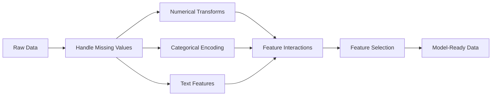

# 특성 공학 & 선택

> 좋은 특성 하나가 천 개의 데이터 포인트보다 가치 있습니다.

**유형:** 빌드
**언어:** Python
**선수 과목:** Phase 1 (Statistics for ML, Linear Algebra), Phase 2 Lessons 1-7
**소요 시간:** ~90분

## 학습 목표

- 수치 변환(표준화, 최소-최대 스케일링, 로그 변환, 비닝) 구현하고 각각 적절한 시기 설명하기
- 범주형 특성을 위한 원-핫, 레이블, 타겟 인코딩 구축, 타겟 인코딩의 데이터 누수 위험 식별하기
- TF-IDF 벡터라이저를 처음부터 구축하고 원시 단어 개수보다 텍스트 분류에 나은 이유 설명하기
- 차원 축소를 위한 필터 기반 특성 선택(분산 임계값, 상관관계, 상호 정보량) 적용하기

## 문제

데이터셋이 있다. 알고리즘을 선택한다. 훈련시킨다. 결과는 그럭저럭하다. 더 복잡한 알고리즘을 시도한다. 여전히 그럭저럭하다. 하이퍼파라미터 튜닝에 일주일을 보낸다. 개선은 미미하다.

그러다 누군가가 원시 데이터를 더 나은 특성으로 변환하고, 간단한 로지스틱 회귀가 튜닝된 그래디언트 부스팅 앙상블을 누른다.

이것은 지속적으로 발생한다. 고전 ML에서 데이터의 표현이 알고리즘 선택보다更重要하다. "면적"과 "침실 수"가 있는 집 가격 모델은 "원시 문자열인 주소"보다 항상 나을 것이다 — 학습자가 얼마나 정교하든 상관없이. 알고리즘은 사용자가 제공하는 것만으로 작업할 수 있다.

특성 공학은 원시 데이터를 모델이 패턴을 더 쉽게 찾을 수 있는 표현으로 변환하는 프로세스이다. 특성 선택은 신호를 추가하지 않고 노이즈를 추가하는 특성을 버리는 프로세스이다. 함께 고전 ML에서 가장 높은 레버리지 활동이다.

## 개념

### 특성 파이프라인



### 수치형 특성

원시 숫자는 rarely 모델 준비가 되어 있다. 일반적인 변환:

**스케일링:** 거리 기반 알고리즘(K-평균, KNN, SVM)이 모든 특성을平等하게 behandelt 있도록 특성을 동일한 범위에 놓는다. 최소-최대 스케일링은 [0, 1]로 매핑한다. 표준화(z-점수)는 평균=0, 표준편차=1로 매핑한다.

**로그 변환:** 오른쪽으로 치우친 분포(소득, 인구, 단어 수)를 압축한다. 승법적 관계를 가법적 관계로 전환한다.

**비닝:** 연속 값을 범주로 변환한다. 특성과 대상 간의 관계가 비선형이지만 단계별일 때 유용하다(예: 연령대).

**다항식 특성:** x^2, x^3, x1*x2 항을 생성한다. 선형 모델이 더 많은 특성을 비용으로 비선형 관계를 포착할 수 있게 한다.

### 범주형 특성

모델은 숫자가 필요한다. 범주는 인코딩이 필요하다.

**원-핫 인코딩:** 각 범주마다 이진 열을 생성한다. "색상 = 빨강/파랑/초록"은 세 개의 열이 된다: is_red, is_blue, is_green. 낮은 카디널리티 특성에 잘 작동하지만 많은 범주와 함께 폭발한다.

**레이블 인코딩:** 각 범주를 정수로 매핑한다: red=0, blue=1, green=2. 가짜 순서를 도입한다(모델이 green > blue > red라고 생각할 수 있다). 개별 값에서 분할하는 트리 기반 모델에만 적합하다.

**타겟 인코딩:** 각 범주를 해당 범주에 대한 대상 변수의 평균으로 대체한다. 강력하지만 위험하다: 데이터 누수의 높은 위험. 훈련 데이터에서만 계산하고 테스트 데이터에 적용해야 한다.

### 텍스트 특성

**카운트 벡터라이저:** 각 단어가 문서에 몇 번 나타나는지 셉다. "the cat sat on the mat"는 {the: 2, cat: 1, sat: 1, on: 1, mat: 1}이 된다.

**TF-IDF:** 용어 빈도-역문서 빈도. 문서 전반에서 얼마나 고유한지에 따라 단어를 가중치 부여한다. "the"와 같은 일반적인 단어는 낮은 가중치를 받는다. 희소하고 독특한 단어는 높은 가중치를 받는다.

```
TF(word, doc) = count(word in doc) / total words in doc
IDF(word) = log(total docs / docs containing word)
TF-IDF = TF * IDF
```

### 결측치

실제 데이터에는 구멍이 있다. 전략:

- **행 삭제:** 결측 데이터가 드물고 무작위일 때만
- **평균/중앙값 대입:** 간단하고 분포 형태를 보존(중앙값이 이상값에 더 강건함)
- **최빈값 대입:** 범주형 특성에 대해
- **결측지 표시기:** 대입하기 전에 이진 열 "was_this_missing" 추가. 데이터가 없다는 사실 자체가 정보가 될 수 있음
- **전방/후방 채우기:** 시계열 데이터에 대해

### 특성 상호작용

때때로 관계는 조합에 있다. "키"와 "체중" alone은 "BMI = 체중 / 키^2"보다 예측력이 낮다. 특성 상호작용은 특성 공간을 확장하므로 올바른 ones을 선택하기 위해 도메인 지식을 사용한다.

### 특성 선택

더 많은 특성이 항상 더 좋은 것은 아니다. 무관한 특성은 노이즈를 추가하고 훈련 시간을 증가시키며 과적합을 유발할 수 있다.

**필터 방법(모델 전):**
- 상관관계: 서로 높은 상관관계가 있는 특성 제거(중복)
- 상호 정보량: 특성을 알면 대상에 대한 불확실성이 얼마나 감소하는지 측정
- 분산 임계값: 거의 변하지 않는 특성 제거

**래퍼 방법(모델 기반):**
- L1 정규화(Lasso): 무관한 특성 가중치를 정확히 0으로 driving
- 순환적 특성 제거: 훈련, 가장 덜 중요한 특성 제거, 반복

**왜 선택이 중요한지:** 10개의 좋은 특성을 가진 모델은 通常 10개의 좋은 특성과 90개의 노이즈가 있는 특성보다 나은 성능을 낸다. 노이즈 특성은 모델이 일반화하지 않는 훈련 데이터 패턴에서 과적합할 기회를 제공한다.

## 빌드

### 1단계: 처음부터 수치 변환

```python
import math


def min_max_scale(values):
    min_val = min(values)
    max_val = max(values)
    if max_val == min_val:
        return [0.0] * len(values)
    return [(v - min_val) / (max_val - min_val) for v in values]


def standardize(values):
    n = len(values)
    mean = sum(values) / n
    variance = sum((v - mean) ** 2 for v in values) / n
    std = math.sqrt(variance) if variance > 0 else 1.0
    return [(v - mean) / std for v in values]


def log_transform(values):
    return [math.log(v + 1) for v in values]


def bin_values(values, n_bins=5):
    min_val = min(values)
    max_val = max(values)
    bin_width = (max_val - min_val) / n_bins
    if bin_width == 0:
        return [0] * len(values)
    result = []
    for v in values:
        bin_idx = int((v - min_val) / bin_width)
        bin_idx = min(bin_idx, n_bins - 1)
        result.append(bin_idx)
    return result


def polynomial_features(row, degree=2):
    n = len(row)
    result = list(row)
    if degree >= 2:
        for i in range(n):
            result.append(row[i] ** 2)
        for i in range(n):
            for j in range(i + 1, n):
                result.append(row[i] * row[j])
    return result
```

### 2단계: 처음부터 범주형 인코딩

```python
def one_hot_encode(values):
    categories = sorted(set(values))
    cat_to_idx = {cat: i for i, cat in enumerate(categories)}
    n_cats = len(categories)

    encoded = []
    for v in values:
        row = [0] * n_cats
        row[cat_to_idx[v]] = 1
        encoded.append(row)

    return encoded, categories


def label_encode(values):
    categories = sorted(set(values))
    cat_to_int = {cat: i for i, cat in enumerate(categories)}
    return [cat_to_int[v] for v in values], cat_to_int


def target_encode(feature_values, target_values, smoothing=10):
    global_mean = sum(target_values) / len(target_values)

    category_stats = {}
    for feat, target in zip(feature_values, target_values):
        if feat not in category_stats:
            category_stats[feat] = {"sum": 0.0, "count": 0}
        category_stats[feat]["sum"] += target
        category_stats[feat]["count"] += 1

    encoding = {}
    for cat, stats in category_stats.items():
        cat_mean = stats["sum"] / stats["count"]
        weight = stats["count"] / (stats["count"] + smoothing)
        encoding[cat] = weight * cat_mean + (1 - weight) * global_mean

    return [encoding[v] for v in feature_values], encoding
```

### 3단계: 처음부터 텍스트 특성

```python
def count_vectorize(documents):
    vocab = {}
    idx = 0
    for doc in documents:
        for word in doc.lower().split():
            if word not in vocab:
                vocab[word] = idx
                idx += 1

    vectors = []
    for doc in documents:
        vec = [0] * len(vocab)
        for word in doc.lower().split():
            vec[vocab[word]] += 1
        vectors.append(vec)

    return vectors, vocab


def tfidf(documents):
    n_docs = len(documents)

    vocab = {}
    idx = 0
    for doc in documents:
        for word in doc.lower().split():
            if word not in vocab:
                vocab[word] = idx
                idx += 1

    doc_freq = {}
    for doc in documents:
        seen = set()
        for word in doc.lower().split():
            if word not in seen:
                doc_freq[word] = doc_freq.get(word, 0) + 1
                seen.add(word)

    vectors = []
    for doc in documents:
        words = doc.lower().split()
        word_count = len(words)
        tf_map = {}
        for word in words:
            tf_map[word] = tf_map.get(word, 0) + 1

        vec = [0.0] * len(vocab)
        for word, count in tf_map.items():
            tf = count / word_count
            idf = math.log(n_docs / doc_freq[word])
            vec[vocab[word]] = tf * idf
        vectors.append(vec)

    return vectors, vocab
```

### 4단계: 처음부터 결측치 대입

```python
def impute_mean(values):
    present = [v for v in values if v is not None]
    if not present:
        return [0.0] * len(values), 0.0
    mean = sum(present) / len(present)
    return [v if v is not None else mean for v in values], mean


def impute_median(values):
    present = sorted(v for v in values if v is not None)
    if not present:
        return [0.0] * len(values), 0.0
    n = len(present)
    if n % 2 == 0:
        median = (present[n // 2 - 1] + present[n // 2]) / 2
    else:
        median = present[n // 2]
    return [v if v is not None else median for v in values], median


def impute_mode(values):
    present = [v for v in values if v is not None]
    if not present:
        return values, None
    counts = {}
    for v in present:
        counts[v] = counts.get(v, 0) + 1
    mode = max(counts, key=counts.get)
    return [v if v is not None else mode for v in values], mode


def add_missing_indicator(values):
    return [0 if v is not None else 1 for v in values]
```

### 5단계: 처음부터 특성 선택

```python
def correlation(x, y):
    n = len(x)
    mean_x = sum(x) / n
    mean_y = sum(y) / n
    cov = sum((xi - mean_x) * (yi - mean_y) for xi, yi in zip(x, y)) / n
    std_x = math.sqrt(sum((xi - mean_x) ** 2 for xi in x) / n)
    std_y = math.sqrt(sum((yi - mean_y) ** 2 for yi in y)) / n
    if std_x == 0 or std_y == 0:
        return 0.0
    return cov / (std_x * std_y)


def mutual_information(feature, target, n_bins=10):
    feat_min = min(feature)
    feat_max = max(feature)
    bin_width = (feat_max - feat_min) / n_bins if feat_max != feat_min else 1.0
    feat_binned = [
        min(int((f - feat_min) / bin_width), n_bins - 1) for f in feature
    ]

    n = len(feature)
    target_classes = sorted(set(target))

    feat_bins = sorted(set(feat_binned))
    p_feat = {}
    for b in feat_bins:
        p_feat[b] = feat_binned.count(b) / n

    p_target = {}
    for t in target_classes:
        p_target[t] = target.count(t) / n

    mi = 0.0
    for b in feat_bins:
        for t in target_classes:
            joint_count = sum(
                1 for fb, tv in zip(feat_binned, target) if fb == b and tv == t
            )
            p_joint = joint_count / n
            if p_joint > 0:
                mi += p_joint * math.log(p_joint / (p_feat[b] * p_target[t]))

    return mi


def variance_threshold(features, threshold=0.01):
    n_features = len(features[0])
    n_samples = len(features)
    selected = []

    for j in range(n_features):
        col = [features[i][j] for i in range(n_samples)]
        mean = sum(col) / n_samples
        var = sum((v - mean) ** 2 for v in col) / n_samples
        if var >= threshold:
            selected.append(j)

    return selected


def remove_correlated(features, threshold=0.9):
    n_features = len(features[0])
    n_samples = len(features)

    to_remove = set()
    for i in range(n_features):
        if i in to_remove:
            continue
        col_i = [features[r][i] for r in range(n_samples)]
        for j in range(i + 1, n_features):
            if j in to_remove:
                continue
            col_j = [features[r][j] for r in range(n_samples)]
            corr = abs(correlation(col_i, col_j))
            if corr >= threshold:
                to_remove.add(j)

    return [i for i in range(n_features) if i not in to_remove]
```

### 6단계: 전체 파이프라인 및 데모

```python
import random


def make_housing_data(n=200, seed=42):
    random.seed(seed)
    data = []
    for _ in range(n):
        sqft = random.uniform(500, 5000)
        bedrooms = random.choice([1, 2, 3, 4, 5])
        age = random.uniform(0, 50)
        neighborhood = random.choice(["downtown", "suburbs", "rural"])
        has_pool = random.choice([True, False])

        sqft_with_missing = sqft if random.random() > 0.05 else None
        age_with_missing = age if random.random() > 0.08 else None

        price = (
            50 * sqft
            + 20000 * bedrooms
            - 1000 * age
            + (50000 if neighborhood == "downtown" else 10000 if neighborhood == "suburbs" else 0)
            + (15000 if has_pool else 0)
            + random.gauss(0, 20000)
        )

        data.append({
            "sqft": sqft_with_missing,
            "bedrooms": bedrooms,
            "age": age_with_missing,
            "neighborhood": neighborhood,
            "has_pool": has_pool,
            "price": price,
        })
    return data


if __name__ == "__main__":
    data = make_housing_data(200)

    print("=== Raw Data Sample ===")
    for row in data[:3]:
        print(f"  {row}")

    sqft_raw = [d["sqft"] for d in data]
    age_raw = [d["age"] for d in data]
    prices = [d["price"] for d in data]

    print("\n=== Missing Value Handling ===")
    sqft_missing = sum(1 for v in sqft_raw if v is None)
    age_missing = sum(1 for v in age_raw if v is None)
    print(f"  sqft missing: {sqft_missing}/{len(sqft_raw)}")
    print(f"  age missing: {age_missing}/{len(age_raw)}")

    sqft_indicator = add_missing_indicator(sqft_raw)
    age_indicator = add_missing_indicator(age_raw)
    sqft_imputed, sqft_fill = impute_median(sqft_raw)
    age_imputed, age_fill = impute_mean(age_raw)
    print(f"  sqft filled with median: {sqft_fill:.0f}")
    print(f"  age filled with mean: {age_fill:.1f}")

    print("\n=== Numerical Transforms ===")
    sqft_scaled = standardize(sqft_imputed)
    age_scaled = min_max_scale(age_imputed)
    sqft_log = log_transform(sqft_imputed)
    age_binned = bin_values(age_imputed, n_bins=5)
    print(f"  sqft standardized: mean={sum(sqft_scaled)/len(sqft_scaled):.4f}, std={math.sqrt(sum(v**2 for v in sqft_scaled)/len(sqft_scaled)):.4f}")
    print(f"  age min-max: [{min(age_scaled):.2f}, {max(age_scaled):.2f}]")
    print(f"  age bins: {sorted(set(age_binned))}")

    print("\n=== Categorical Encoding ===")
    neighborhoods = [d["neighborhood"] for d in data]

    ohe, ohe_cats = one_hot_encode(neighborhoods)
    print(f"  One-hot categories: {ohe_cats}")
    print(f"  Sample encoding: {neighborhoods[0]} -> {ohe[0]}")

    le, le_map = label_encode(neighborhoods)
    print(f"  Label encoding map: {le_map}")

    te, te_map = target_encode(neighborhoods, prices, smoothing=10)
    print(f"  Target encoding: {({k: round(v) for k, v in te_map.items()})}")

    print("\n=== Text Features ===")
    descriptions = [
        "large modern house with pool",
        "small cozy cottage near downtown",
        "spacious family home with large yard",
        "modern apartment downtown with view",
        "rustic cabin in rural area",
    ]
    cv, cv_vocab = count_vectorize(descriptions)
    print(f"  Vocabulary size: {len(cv_vocab)}")
    print(f"  Doc 0 non-zero features: {sum(1 for v in cv[0] if v > 0)}")

    tf, tf_vocab = tfidf(descriptions)
    print(f"  TF-IDF vocabulary size: {len(tf_vocab)}")
    top_words = sorted(tf_vocab.keys(), key=lambda w: tf[0][tf_vocab[w]], reverse=True)[:3]
    print(f"  Doc 0 top TF-IDF words: {top_words}")

    print("\n=== Polynomial Features ===")
    sample_row = [sqft_scaled[0], age_scaled[0]]
    poly = polynomial_features(sample_row, degree=2)
    print(f"  Input: {[round(v, 4) for v in sample_row]}")
    print(f"  Polynomial: {[round(v, 4) for v in poly]}")
    print(f"  Features: [x1, x2, x1^2, x2^2, x1*x2]")

    print("\n=== Feature Selection ===")
    feature_matrix = [
        [sqft_scaled[i], age_scaled[i], float(sqft_indicator[i]), float(age_indicator[i])]
        + ohe[i]
        for i in range(len(data))
    ]

    print(f"  Total features: {len(feature_matrix[0])}")

    surviving_var = variance_threshold(feature_matrix, threshold=0.01)
    print(f"  After variance threshold (0.01): {len(surviving_var)} features kept")

    surviving_corr = remove_correlated(feature_matrix, threshold=0.9)
    print(f"  After correlation filter (0.9): {len(surviving_corr)} features kept")

    binary_prices = [1 if p > sum(prices) / len(prices) else 0 for p in prices]
    print("\n  Mutual information with target:")
    feature_names = ["sqft", "age", "sqft_missing", "age_missing"] + [f"neigh_{c}" for c in ohe_cats]
    for j in range(len(feature_matrix[0])):
        col = [feature_matrix[i][j] for i in range(len(feature_matrix))]
        mi = mutual_information(col, binary_prices, n_bins=10)
        print(f"    {feature_names[j]}: MI={mi:.4f}")

    print("\n  Correlation with price:")
    for j in range(len(feature_matrix[0])):
        col = [feature_matrix[i][j] for i in range(len(feature_matrix))]
        corr = correlation(col, prices)
        print(f"    {feature_names[j]}: r={corr:.4f}")
```

## 활용

scikit-learn을 사용하면 이러한 변환은 구성 가능한 파이프라인이다:

```python
from sklearn.preprocessing import StandardScaler, OneHotEncoder, PolynomialFeatures
from sklearn.impute import SimpleImputer
from sklearn.feature_extraction.text import TfidfVectorizer
from sklearn.feature_selection import mutual_info_classif, VarianceThreshold
from sklearn.compose import ColumnTransformer
from sklearn.pipeline import Pipeline

numeric_pipe = Pipeline([
    ("imputer", SimpleImputer(strategy="median")),
    ("scaler", StandardScaler()),
])

categorical_pipe = Pipeline([
    ("encoder", OneHotEncoder(sparse_output=False)),
])

preprocessor = ColumnTransformer([
    ("num", numeric_pipe, ["sqft", "age"]),
    ("cat", categorical_pipe, ["neighborhood"]),
])
```

처음부터 작성한 버전은 각 변환 내부에서 정확히 무슨 일이 발생하는지 보여준다. 라이브러리 버전은 가장자리 케이스 처리, 희소 행렬 지원, 파이프라인 구성을 추가하지만 수학은 동일하다.

## 결과물

이 수업은 다음을 생성한다:
- `outputs/prompt-feature-engineer.md` - 원시 데이터에서 체계적으로 특성을 공학하기 위한 프롬프트

## 연습 문제

1. 로버트 스케일링(평균과 표준 편차 대신 중앙값과 사분위 범위를 사용)을 수치 변환에 추가한다.极端 이상값이 있는 데이터에서 표준 스케일링과 비교한다.

2. Leave-one-out 타겟 인코딩을 구현한다: 각 행에 대해 해당 행의 자체 대상 값을 제외한 대상 평균을 계산한다. 순진한 타겟 인코딩 대비 이것이 과적합을 줄이는 방법을 보여준다.

3. 분산 임계값, 상관관계 필터링, 상호 정보량 순위를 결합하는 자동화된 특성 선택 파이프라인을 구축한다. 주택 데이터셋에 적용하고 모든 특성 대 선택된 특성과의 모델 성능(간단한 선형 회귀 사용)을 비교한다.

## 핵심 용어

| 용어 | 사람들이 말하는 것 | 실제 의미 |
|------|----------------|----------------------|
| 특성 공학 | "새 열 만들기" | 모델이 패턴을 쉽게 찾을 수 있도록 원시 데이터를 표현으로 변환 |
| 표준화 | "정규분포로 만들기" | 평균을 빼고 표준 편차로 나누어 특성이 평균=0, 표준편차=1을 갖도록 함 |
| 원-핫 인코딩 | "더미 변수 만들기" | 각 범주마다 하나의 이진 열을 생성, 각 행에서 정확히 하나의 열이 1임 |
| 타겟 인코딩 | "답변을 사용하여 인코딩" | 각 범주를 해당 범주에 대한 평균 대상 값으로 대체, 과적합 방지를 위해 스무딩 적용 |
| TF-IDF | "고급 단어 수" | 용어 빈도 × 역문서 빈도:文集 전반에서 얼마나 distinctive한지에 따라 가중치 부여된 단어 |
| 대입 | "공백 채우기" | 결측치를 추정된 값(평균, 중앙값, 최빈값 또는 모델 예측)으로 대체 |
| 특성 선택 | "나쁜 열 버리기" | 노이즈나 중복을 추가하는 특성을 제거, 대상에 대한 신호가 있는 특성만 유지 |
| 상호 정보량 | "한 가지가 다른 것에 대해 얼마나 많은 것을 알려주는지" | 변수 X를 관찰하여 변수 Y에 대한 불확실성이 감소하는 정도의 측정 |
| 데이터 누수 | "우연히 치트" | 예측 시점에 사용할 수 없었던 정보를 훈련 중에 사용하여, 허위 낙관적 결과를产生함 |

## 추가 자료

- [Feature Engineering and Selection (Max Kuhn & Kjell Johnson)](http://www.feat.engineering/) - 특성 공학의 전체 풍경을 다루는 무료 온라인 도서
- [scikit-learn Preprocessing Guide](https://scikit-learn.org/stable/modules/preprocessing.html) - 모든 표준 변환에 대한 실용적 참고 자료
- [Target Encoding Done Right (Micci-Barreca, 2001)](https://dl.acm.org/doi/10.1145/507533.507538) - 스무딩과 함께 타겟 인코딩에 대한 원래 논문