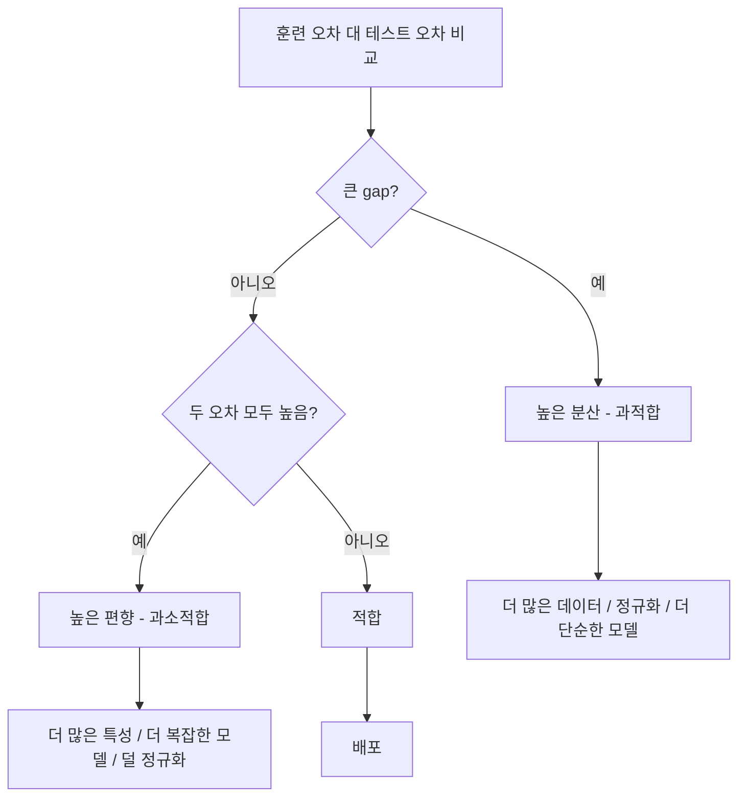

# 편향-분산 트레이드오프

> 모든 모델 오차는 세 가지 출처 중 하나에서 비롯됩니다: 편향, 분산, 또는 노이즈. 처음 두 가지만 제어할 수 있습니다.

**유형:** 학습
**언어:** Python
**선수 과목:** Phase 2, Lessons 01-09 (ML 기초, 회귀, 분류, 평가)
**소요 시간:** ~75분

## 학습 목표

- 예측 오차의 편향-분산 분해를 유도하고 불가역적 노이즈의 역할을 설명한다
- 훈련 및 테스트 오차 패턴으로 높은 편향 대 높은 분산을 진단한다
- 정규화 기법(L1, L2, 드롭아웃, 조기 종료)이 편향과 분산을 교환하는 방법을 설명한다
- 모델 복잡도가 증가함에 따라 편향-분산 트레이드오프를 시각화하는 실험을 구현한다

## 문제

모델을 훈련시켰습니다. 테스트 데이터에서 일부 오차가 있습니다. 그 오차가 어디서 왔습니까?

모델이 너무 단순하면(곡선 데이터에 선형 회귀), 항상 실제 패턴을 놓칩니다. 그것이 편향입니다. 모델이 너무 복잡하면(15개의 데이터 포인트에 차수 20 다항식), 훈련 데이터를 완벽히 맞추지만 새 데이터에서 wildly 다른 예측을 제공합니다. 그것이 분산입니다.

고정된 모델 용량에서는 동시에 둘 다 최소화할 수 없습니다. 편향을 낮추면 분산이 올라갑니다. 분산을 낮추면 편향이 올라갑니다. 이 트레이드오프를 이해하는 것이 머신러닝에서 가장 유용한 진단 기술입니다. 그것은 모델을 더 복잡하게 해야 하는지 아니면 덜 복잡하게 해야 하는지, 더 많은 데이터를 확보해야 하는지 아니면 더 나은 특성을 공학해야 하는지, 더 많이 정규화해야 하는지 아니면 덜 정규화해야 하는지를 알려줍니다.

## 개념

### 편향: 체계적 오차

편향은 모델의 평균 예측이 실제 값에서 얼마나 떨어져 있는지 측정합니다. 동일한 분포에서 추출된 다른 훈련 세트로 동일한 모델을 훈련시키고 예측을 평균하면, 편향은 그 평균과 진실 사이의 gap입니다.

높은 편향은 모델이 실제 패턴을 포착하기 위해 너무 rigid함을 의미합니다. 포물선에 직선을 피팅하면 데이터를 얼마나 제공하든 항상 곡선을 놓칩니다. 이것이 과소적합입니다.

```
높은 편향 (과소적합):
  모델이 항상 roughly 동일한 잘못된 것을 예측합니다.
  훈련 오차: 높음
  테스트 오차: 높음
  둘 사이의 gap: 작음
```

### 분산: 훈련 데이터에 대한 민감도

분산은 다른 데이터 부분집합에서 훈련할 때 예측이 얼마나 변하는지 측정합니다. 훈련 세트의 작은 변경이 모델에서 큰 변경을 일으키면 분산이 높습니다.

높은 분산은 모델이 훈련 데이터의 노이즈를 피팅하고 있는 것이지 기본 신호를 피팅하고 있지 않음을 의미합니다. 차수 20 다항식은 모든 훈련 포인트를 통과하지만 그 사이에서 wildly 진동합니다. 이것이 과적합입니다.

```
높은 분산 (과적합):
  모델이 훈련 데이터를 완벽히 맞추지만 새 데이터에서 실패합니다.
  훈련 오차: 낮음
  테스트 오차: 높음
  둘 사이의 gap: 큼
```

### 분해

임의의 점 x에서 제곱 손실 하에서의 예상 예측 오차는 정확하게 분해됩니다:

```
Expected Error = Bias^2 + Variance + Irreducible Noise

where:
  Bias^2   = (E[f_hat(x)] - f(x))^2
  Variance = E[(f_hat(x) - E[f_hat(x)])^2]
  Noise    = E[(y - f(x))^2]             (sigma^2)
```

- `f(x)`는 실제 함수입니다
- `f_hat(x)`는 모델의 예측입니다
- `E[...]`는 다른 훈련 세트에 대한 기대값입니다
- `y`는 실제 레이블입니다 (실제 함수 플러스 노이즈)

노이즈 항은 불가역적입니다. 노이즈가 있는 데이터에서 sigma^2보다 더 잘할 수 있는 모델은 없습니다.工作是-finding 편향^2와 분산 사이의 적절한 균형입니다.

### 모델 복잡도 대 오차

고전적인 U-형 곡선:

| 복잡도 | 편향 | 분산 | 총 오차 |
|-----------|------|----------|-------------|
| 너무 낮음 | 높음 | 낮음 | 높음 (과소적합) |
| 적절함 | 보통 | 보통 | 가장 낮음 |
| 너무 높음 | 낮음 | 높음 | 높음 (과적합) |

### 정규화를 편향-분산 제어として

정규화는 명시적으로 분산을 줄이기 위해 편향을 높입니다. 모델이 노이즈를 추격할 수 없도록 모델에 제약합니다.

- **L2 (Ridge)**: 모든 가중치를 0으로 축소합니다. 모든 특성을 유지하되 영향을 줄입니다.
- **L1 (Lasso)**: 일부 가중치를 정확히 0으로 푸시합니다. 특성 선택을 수행합니다.
- **Dropout**: 훈련 중 무작위로 뉴런을 비활성화합니다. 중복 표현을 강제합니다.
- **Early stopping**: 모델이 훈련 데이터를 완전히 피팅하기 전에 중지합니다.

정규화 강도(lambda, 드롭아웃률, 에포크 수)는 편향-분산 곡선에서 어디에 있는지를 직접 제어합니다. 더 많은 정규화 = 더 많은 편향, 더 적은 분산.

### 이중 하강: 현대적 관점

고전 이론에 따르면: 스위트 스팟 이후, 더 많은 복잡성은 항상 해릅니다. 그러나 2019년 이후 연구는 예상치 못한 것을 보여주었습니다. 모델 용량을 보간 임계값(모델이 훈련 데이터를 완벽히 피팅할 만큼十分な 매개변수를 가짐)을 넘어 계속 증가시키면, 테스트 오차가 다시 감소할 수 있습니다.

이 "이중 하강" 현상은 매우 과매개변수화된 신경망(훈련 예제보다 훨씬 많은 매개변수)이 여전히 잘 일반화되는理由を 설명합니다. 고전적 편향-분산 트레이드오프는 틀린 것이 아니지만 현대적 체제에는不完全합니다.

이중 하강에 대한 주요 관찰:
- 선형 모델, 결정 트리, 신경망에서 발생합니다
- 더 많은 데이터가 실제로 보간 영역에서 해칠 수 있습니다 (샘플별 이중 하강)
- 더 많은 훈련 에포크도 그것을 유발할 수 있습니다 (에포크별 이중 하강)
- 정규화는 피크를 완만하게 하지만 eliminate하지 않습니다

왜 이것이 발생합니까? 보간 임계점에서 모델은 모든 포인트를 맞추기에 충분한 용량을 방금 가집니다. 모든 포인트를 통과하는 매우 specific한 솔루션에 강제됩니다, 그리고 데이터의 작은 섭동이 피팅에서 큰 변경을 유발합니다. 이것이 분산이 피크에 도달하는 곳입니다. 임계점을 지나면, 모델은 데이터를 완벽히 맞추는 많은 가능한 솔루션을 가집니다. 학습 알고리즘(예: 명시적 정규화가 있는 경사 하강)은 그들 사이에서 가장 단순한 것을 선택하는 경향이 있습니다. 단순한 것에 대한 이러한 암묵적 편향이 과매개변수화된 모델이 일반화하는 이유입니다.

| 체제 | 매개변수 대 샘플 | 동작 |
|--------|----------------------|----------|
| 과소매개변수화 | p << n | 고전적 트레이드오프 적용 |
| 보간 임계점 | p ~ n | 분산이 피크, 테스트 오차가 스파이크 |
| 과매개변수화 | p >> n | 암묵적 정규화가 작동, 테스트 오차 감소 |

실용적 목적: 신경망이나 큰 트리 앙상블을 사용하는 경우, 보간 임계점에서 중지하지 마세요. 명시적 정규화와 함께 잘 Below에 있거나(통해) 충분히 past it로 가세요. 최악의 위치는 정확히 임계점에 있는 것입니다.

### 모델 진단



| 증상 | 진단 | 수정 |
|---------|-----------|-----|
| 훈련 오차 높음, 테스트 오차 높음 | 편향 | 더 많은 특성, 더 복잡한 모델, 덜 정규화 |
| 훈련 오차 낮음, 테스트 오차 높음 | 분산 | 더 많은 데이터, 정규화, 더 단순한 모델, 드롭아웃 |
| 훈련 오차 낮음, 테스트 오차 낮음 | 적합 | 배포 |
| 훈련 오차 감소 중, 테스트 오차 증가 중 | 진행 중 과적합 | 조기 종료 |

### 실용적 전략

**편향이 문제일 때:**
- 다항식 또는 상호작용 특성 추가
- 더 유연한 모델 사용 (선형 대신 트리 앙상블)
- 정규화 강도 줄이기
- (아직 수렴하지 않은 경우) 더 오래 훈련

**분산이 문제일 때:**
- 더 많은 훈련 데이터 확보
- 배깅 사용 (랜덤 포레스트)
- 정규화 증가 (더 높은 lambda, 더 많은 드롭아웃)
- 특성 선택 (노이즈 특성 제거)
- 조기 감지를 위해 교차 검증 사용

### 앙상블 방법과 분산 감소

앙상블 방법은 분산과戦うための 가장 실용적인 도구입니다.

**배깅 (Bootstrap Aggregating)**은 훈련 데이터의 다른 부트스트랩 샘플에서 여러 모델을 훈련시킨 다음 예측을 평균합니다. 각 개별 모델은 높은 분산을 가집니다, 하지만 평균은 훨씬 낮은 분산을 가집니다. 랜덤 포레스트는 결정 트리에 적용된 배깅입니다.

수학적으로 작동하는 이유: N개의 독립 예측을 평균하면, 각각 분산 sigma^2를 가지면, 평균의 분산은 sigma^2/N입니다. 모델은 진정으로 독립적이지 않습니다(모두 유사한 데이터를 보기 때문에), 그래서 감소는 1/N보다 적지만 여전히 상당합니다.

**부스팅**은 앙상블이 지금까지犯了한 오류를 각 새로운 모델이 집중함으로써 편향을 줄입니다. 그래디언트 부스팅과 AdaBoost가 주요 예입니다. 부스팅은 너무 많은 모델을 추가하면 과적합될 수 있으므로, 조기 종료 또는 정규화가 필요합니다.

| 방법 | 기본 효과 | 편향 변경 | 분산 변경 |
|--------|---------------|-------------|----------------|
| 배깅 | 분산 감소 | 변경 없음 | 감소 |
| 부스팅 | 편향 감소 | 감소 | 증가할 수 있음 |
| 스태킹 | 둘 다 감소 | 메타 학습기에 따라 다름 | 기본 모델에 따라 다름 |
| 드롭아웃 | 암묵적 배깅 | 약간 증가 | 감소 |

**실용적 규칙:** 기본 모델이 높은 분산을 가지면(깊은 트리, 고차 다항식), 배깅을 사용하세요. 기본 모델이 높은 편향을 가지면(얕은 stubs, 단순 선형 모델), 부스팅을 사용하세요.

### 학습 곡선

학습 곡선은 훈련 세트 크기의 함수로서 훈련 및 검증 오차를 플롯합니다. 이것이 가장 실용적인 진단 도구입니다. 단일 훈련/테스트 비교와 달리, 학습 곡선은 모델의 궤적을 보여주고 더 많은 데이터가 도움이 될지 여부를 알려줍니다.


판독 방법:

| 시나리오 | 훈련 오차 | 검증 오차 | Gap | 의미 | 할 일 |
|----------|---------------|-----------------|-----|---------------|------------|
| 높은 편향 | 높음 | 높음 | 작음 | 모델이 패턴을 포착할 수 없음 | 더 많은 특성, 더 복잡한 모델, 덜 정규화 |
| 높은 분산 | 낮음 | 높음 | 큼 | 모델이 훈련 데이터를 기억함 | 더 많은 데이터, 정규화, 더 단순한 모델 |
| 적합 | 보통 | 보통 | 작음 | 모델이 잘 일반화함 | 배포 |
| 높은 분산, 개선 중 | 낮음 | 감소 중 | 축소 중 | 데이터로 해결할 수 있는 분산 문제 | 더 많은 데이터 수집 |
| 높은 편향, 평탄 | 높음 | 높고 평탄 | 작고 평탄 | 더 많은 데이터는 도움되지 않음 | 모델 아키텍처 변경 |

중요한 통찰: 두 곡선이 모두 plateau이고 gap이 작지만 둘 다 오차가 높으면, 더 많은 데이터는 쓸모없습니다. 더 나은 모델이 필요합니다. gap이 크고 여전히 감소하고 있으면, 더 많은 데이터가 도울 것입니다.

### 학습 곡선 생성 방법

두 가지 접근법이 있습니다:

**접근법 1: 훈련 세트 크기 변경, 고정 모델.** 모델과 하이퍼파라미터를 일정하게 유지합니다. 점점 더 큰 훈련 데이터 부분집합에서 훈련합니다. 각 크기에서 훈련 오차와 검증 오차를 측정합니다. 이것이 표준 학습 곡선입니다.

**접근법 2: 모델 복잡도 변경, 고정 데이터.** 데이터를 일정하게 유지합니다. 복잡도 매개변수(다항식 차수, 트리 깊이, 레이어 수)를 스윕합니다. 각 복잡도에서 훈련 오차와 검증 오차를 측정합니다. 이것은 검증 곡선이며 직접적으로 편향-분산 트레이드오프를 보여줍니다.

둘 다互补적입니다. 첫 번째는 더 많은 데이터가 도울지 여부를 알려줍니다. 두 번째는 다른 모델이 도울지 여부를 알려줍니다. 결정을 내리기 전에 둘 다 실행하세요.

```mermaid
flowchart TD
    A[모델 성능 저하] --> B[학습 곡선 생성]
    B --> C{훈련과 검증의 gap?}
    C -->|"큰 gap, 검증 여전히 감소"| D[더 많은 데이터가 도울 것"]
    C -->|"작은 gap, 둘 다 높음"| E[더 많은 데이터는 도움되지 않음"]
    C -->|"큰 gap, 검증 평탄"| F[정규화 또는 단순화"]
    E --> G[검증 곡선 생성]
    G --> H[더 복잡한 모델 시도"]
```

## 실습

`code/bias_variance.py`의 코드는 완전한 편향-분산 분해 실험을 실행합니다. 접근법은 단계별로 다음과 같습니다.

### 1단계: 알려진 함수에서合成 데이터 생성

`f(x) = sin(1.5x) + 0.5x`와 가우시안 노이즈를 사용합니다. 실제 함수를 알면 정확한 편향과 분산을計算할 수 있습니다.

```python
def true_function(x):
    return np.sin(1.5 * x) + 0.5 * x

def generate_data(n_samples=30, noise_std=0.5, x_range=(-3, 3), seed=None):
    rng = np.random.RandomState(seed)
    x = rng.uniform(x_range[0], x_range[1], n_samples)
    y = true_function(x) + rng.normal(0, noise_std, n_samples)
    return x, y
```

### 2단계: 부트스트랩 샘플링과 다항식 피팅

각 다항식 차수에 대해 많은 부트스트랩 훈련 세트를 그리고, 고정된 테스트 그리드에서 예측을 기록합니다. 이것은 각 테스트 포인트에서 예측의 분포를줍니다.

```python
def fit_polynomial(x_train, y_train, degree, lam=0.0):
    X = np.column_stack([x_train ** d for d in range(degree + 1)])
    if lam > 0:
        penalty = lam * np.eye(X.shape[1])
        penalty[0, 0] = 0
        w = np.linalg.solve(X.T @ X + penalty, X.T @ y_train)
    else:
        w = np.linalg.lstsq(X, y_train, rcond=None)[0]
    return w
```

200개의 다른 부트스트랩 샘플에서 피팅합니다. 각 부트스트랩 샘플은 동일한 기본 분포에서drawn되지만 다른 포인트를 포함합니다.

### 3단계: Bias^2, Variance 분해 계산

각 테스트 포인트에서 200개의 예측 세트로, 분해의 정의를 사용하여 직접 분해할 수 있습니다:

```python
mean_pred = predictions.mean(axis=0)
bias_sq = np.mean((mean_pred - y_true) ** 2)
variance = np.mean(predictions.var(axis=0))
total_error = np.mean(np.mean((predictions - y_true) ** 2, axis=1))
```

- `mean_pred`는 부트스트랩 샘플에서 추정된 E[f_hat(x)]입니다
- `bias_sq`는 평균 예측과 진실 사이의 제곱 gap입니다
- `variance`는 부트스트랩 샘플 전반의 예측 확산입니다
- `total_error`는 approximately bias^2 + variance + noise와 같아야 합니다

### 4단계: 학습 곡선

학습 곡선은 모델 복잡도를 고정하고 훈련 세트 크기를 스윕합니다. 모델이 데이터에 의해 제한되는지 용량에 의해限制되는지 보여줍니다.

```python
def demo_learning_curves():
    sizes = [10, 15, 20, 30, 50, 75, 100, 150, 200, 300]
    degree = 5

    for n in sizes:
        train_errors = []
        test_errors = []
        for seed in range(50):
            x_train, y_train = generate_data(n_samples=n, seed=seed * 100)
            w = fit_polynomial(x_train, y_train, degree)
            train_pred = predict_polynomial(x_train, w)
            train_mse = np.mean((train_pred - y_train) ** 2)
            test_pred = predict_polynomial(x_test, w)
            test_mse = np.mean((test_pred - y_test) ** 2)
            train_errors.append(train_mse)
            test_errors.append(test_mse)
```

### 5단계: 정규화 스윕

코드는 또한 `demo_regularization_sweep()`를 포함하는데, 이는 고차 다항식(차수 15)을修正하고 릿지 정규화 강도를 0.001에서 100까지 스윕합니다. 이것은 모델 복잡도를 변경하는 대신 제약 강도를 변경하여 편향-분산 트레이드오프를 다른 각도에서 보여줍니다.

```python
def demo_regularization_sweep():
    alphas = [0.001, 0.005, 0.01, 0.05, 0.1, 0.5, 1.0, 5.0, 10.0, 50.0, 100.0]
    for alpha in alphas:
        results = bias_variance_decomposition([15], lam=alpha)
        r = results[15]
        print(f"alpha={alpha:.3f}  bias={r['bias_sq']:.4f}  var={r['variance']:.4f}")
```

낮은 alpha에서 차수 15 다항식은 거의 무제약입니다. 분산이 지배합니다 — 모델이 각 부트스트랩 샘플에서 노이즈를 추격합니다. 높은 alpha에서 페널티가 너무 강해서 모델이 사실상 near-constant 함수가 됩니다. 편향이 지배합니다. 최적의 alpha는 이 극단들 사이 어딘가에 있습니다.

## 활용

sklearn은 이러한 진단을 자동화하는 `learning_curve`와 `validation_curve`를 제공합니다.

### 검증 곡선: 모델 복잡도 스윕

```python
from sklearn.model_selection import validation_curve
from sklearn.pipeline import make_pipeline
from sklearn.preprocessing import PolynomialFeatures
from sklearn.linear_model import Ridge

degrees = list(range(1, 16))
train_scores_all = []
val_scores_all = []

for d in degrees:
    pipe = make_pipeline(PolynomialFeatures(d), Ridge(alpha=0.01))
    train_scores, val_scores = validation_curve(
        pipe, X, y, param_name="polynomialfeatures__degree",
        param_range=[d], cv=5, scoring="neg_mean_squared_error"
    )
    train_scores_all.append(-train_scores.mean())
    val_scores_all.append(-val_scores.mean())
```

### 학습 곡선: 훈련 세트 크기 스윕

```python
from sklearn.model_selection import learning_curve

pipe = make_pipeline(PolynomialFeatures(5), Ridge(alpha=0.01))
train_sizes, train_scores, val_scores = learning_curve(
    pipe, X, y, train_sizes=np.linspace(0.1, 1.0, 10),
    cv=5, scoring="neg_mean_squared_error"
)
train_mse = -train_scores.mean(axis=1)
val_mse = -val_scores.mean(axis=1)
```

`train_mse`와 `val_mse`를 `train_sizes`에 대해 플롯하세요. 모양이 모델에 대한 모든 것을 알려줍니다.

### 교차 검증과 정규화 스윕

```python
from sklearn.model_selection import cross_val_score

alphas = [0.001, 0.01, 0.1, 1.0, 10.0, 100.0]
for alpha in alphas:
    pipe = make_pipeline(PolynomialFeatures(10), Ridge(alpha=alpha))
    scores = cross_val_score(pipe, X, y, cv=5, scoring="neg_mean_squared_error")
    print(f"alpha={alpha:>7.3f}  MSE={-scores.mean():.4f} +/- {scores.std():.4f}")
```

고정 모델 복잡도에 대해 정규화 강도를 스윕합니다. 동일한 편향-분산 트레이드오프를 보게 됩니다: 낮은 alpha는 높은 분산, 높은 alpha는 높은 편향.

### 완전한 진단 워크플로우

실제로 이러한 진단을 순서대로 실행합니다:

1. 모델을 훈련시킵니다. 훈련과 테스트 오차를 계산합니다.
2. 둘 다 높으면: 편향 문제가 있습니다. 4단계로 건너뜁니다.
3. 훈련은 낮지만 테스트가 높으면: 분산 문제가 있습니다. 더 많은 데이터가 도울지 보기 위해 학습 곡선을 생성합니다. 그렇지 않으면 정규화합니다.
4. 주요 복잡도 매개변수를 스윕하여 검증 곡선을 생성합니다. 스위트 스팟을 찾습니다.
5. 스위트 스팟에서 학습 곡선을 생성합니다. gap이 여전히 크면 더 많은 데이터 또는 정규화가 필요합니다.
6. 다른 alpha 값으로 Ridge/Lasso를 시도합니다. 교차 검증된 오차가 가장 낮은 alpha를 선택합니다.

이것은 대부분의 표 형식 데이터셋에 대해 10-15분 컴퓨팅가 소요되며 추측에 시간을 절약합니다.

## 결과물

이 수업은 다음을 생성합니다: `outputs/prompt-model-diagnostics.md`

## 연습 문제

1. `noise_std=0`(노이즈 없음)으로 분해을 실행합니다. 불가역적 오차 항에 무슨 일이 발생합니까? 최적 복잡도가 변경됨니까?

2. 훈련 세트 크기를 30에서 300으로 증가합니다. 분산 구성 요소에 어떤 영향을 미칩니까? 최적 다항식 차수가 이동합니까?

3. L2 정규화(릿지 회귀)를 실험에 추가합니다. 고정 고차 다항식(차수 15)에 대해 lambda를 0에서 100까지 스윕합니다. lambda의 함수로서 bias^2와 분산을 플롯합니다.

4. 실제 함수를 다항식에서 `sin(x)`로 변경합니다. 편향-분산 분해가 어떻게 변경됨니까? 여전히 명확한 최적 차수가 있습니까?

5. 간단한 배깅 앙상블(배깅)을 구현합니다: 부트스트랩 샘플에서 10개의 모델을 훈련하고 예측을 평균합니다. 이것이 분산을 증가시키지 않고 분산을 감소시킴을 보여주세요.

## 핵심 용어

| 용어 | 사람들이 말하는 것 | 실제 의미 |
|------|----------------|----------------------|
| 편향 | "모델이 너무 단순하다" | 잘못된 가정에서 비롯된 체계적 오차. 평균 모델 예측과 진실 사이의 gap. |
| 분산 | "모델이 과적합이다" | 훈련 데이터에 대한 민감도에서 비롯된 오차. 다른 훈련 세트에서 예측이 얼마나 변하는지. |
| 불가역적 오차 | "데이터의 노이즈" | 실제 데이터 생성 프로세스의 무작위성에서 비롯된 오차. 어떤 모델도 그것을 제거할 수 없습니다. |
| 과소적합 | "충분히 학습하지 않았다" | 모델이 높은 편향을 가집니다. 훈련 데이터에서도 실제 패턴을 놓칩니다. |
| 과적합 | "데이터를 기억한다" | 모델이 높은 분산을 가집니다. 훈련 데이터의 노이즈를 피팅하여 일반화하지 못합니다. |
| 정규화 | "모델에 제약을 가한다" | 모델 복잡도를 줄이기 위해 비용 함수에 페널티를 추가하여 편향을 교환하여 더 낮은 분산을 얻습니다. |
| 이중 하강 | "더 많은 매개변수가 도울 수 있다" | 모델 용량이 보간 임계점을 훨씬 초과하면 테스트 오차가 다시 감소합니다. |
| 모델 복잡도 | "모델이 얼마나 유연한가" | 모델이 임의의 패턴을 피팅하는 용량. 아키텍처, 특성 또는 정규화로 제어됩니다. |

## 추가 자료

- [Hastie, Tibshirani, Friedman: Elements of Statistical Learning, Ch. 7](https://hastie.su.domains/ElemStatLearn/) -- 편향-분산 분해의 결정적 치료
- [Belkin et al., Reconciling modern machine learning practice and the bias-variance trade-off (2019)](https://arxiv.org/abs/1812.11118) -- 이중 하강 논문
- [Nakkiran et al., Deep Double Descent (2019)](https://arxiv.org/abs/1912.02292) -- 에포크별 및 샘플별 이중 하강
- [Scott Fortmann-Roe: Understanding the Bias-Variance Tradeoff](http://scott.fortmann-roe.com/docs/BiasVariance.html) -- 명확한 시각적 설명