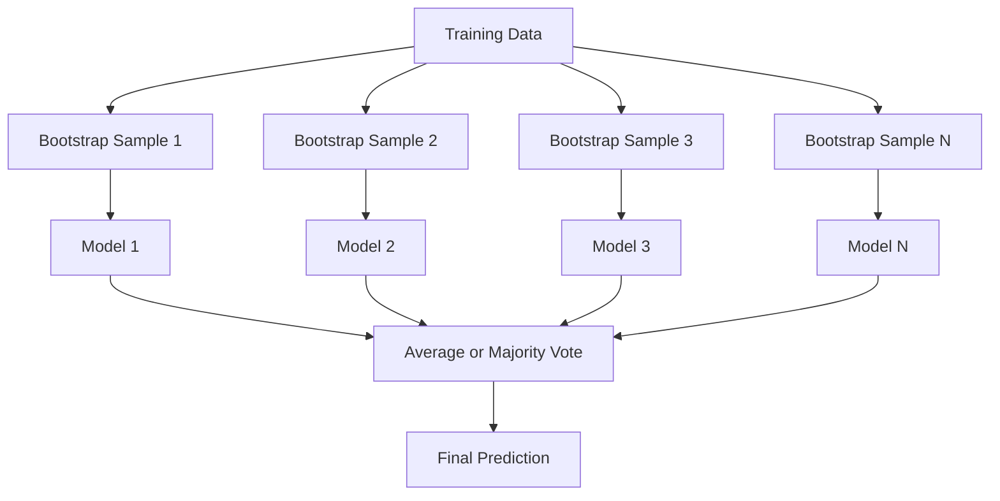
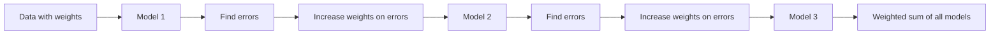
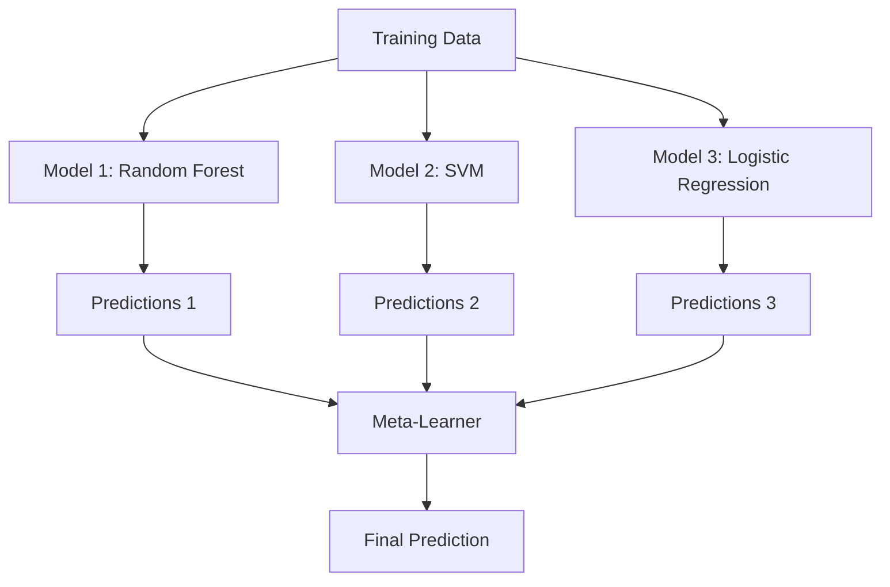

# 앙상블 방법

> 약한 학습기 그룹이 올바르게 결합되면 강한 학습기가 됩니다. 은유가 아닌 정리입니다.

**유형:** 빌드
**언어:** Python
**선수 과목:** Phase 2, Lesson 10 (Bias-Variance Tradeoff)
**소요 시간:** ~120분

## 학습 목표

- AdaBoost와 그래디언트 부스팅을 처음부터 구현하고 부스팅이 순차적으로 편향을 줄이는 방법 설명
- 배깅 앙상블을 구축하고 상관관계 없는 모델 평균화가 편향 증가 없이 분산 감소 시연
- 배깅, 부스팅, 스태킹을 각 방법이 목표로 하는 오차 구성 요소 측면에서 비교
- 앙상블 다양성 평가하고 약한 학습기가 더 독립적일수록 다수결 정확도가 향상되는 이유 설명

## 문제

단일 결정 트리는 훈련이 빠르고 해석이 쉽지만 과적합된다. 단일 선형 모델은 복잡한 경계에서 과소적합된다. 완벽한 모델 아키텍처를 엔지니어링하는 데 며칠을 보낼 수 있다. 또는 불완전한 모델들을 결합하여 개별적으로보다 더 나은 것을 얻을 수 있다.

앙상블 방법은 정확히 이것을 수행한다. 테이블 데이터에서 Kaggle 경쟁에서 우승하는 가장 확실한 기술이며, 대부분의 프로덕션 ML 시스템을 구동하며, 동작에서 편향-분산 트레이드오프를 설명한다. 배깅은 분산을 줄인다. 부스팅은 편향을 줄인다. 스태킹은 어떤 입력에서 어떤 모델을 신뢰할지 학습한다.

## 개념

### 앙상블이 작동하는 이유

정확도 p > 0.5인 N개의 독립 분류기가 있다고 가정한다. 다수결 투표의 정확도는 다음과 같다:

```
P(majority correct) = sum over k > N/2 of C(N,k) * p^k * (1-p)^(N-k)
```

60% 정확도를 가진 21개의 분류기의 경우, 다수결 투표 정확도는 약 74%이다. 101개의 분류기로上升到 84%이다. 모델들이 다른 실수를 하면 오차가 상쇄된다.

핵심 요구사항은 **다양성**이다. 모든 모델이 동일한 실수를 하면 결합이 도움이 되지 않는다. 앙상블이 작동하는 이유는 다음을 통해 다양한 모델을 생성하기 때문이다:

- 다른 훈련 부분집합(배깅)
- 다른 특성 부분집합(랜덤 포레스트)
- 순차적 오차 수정(부스팅)
- 다른 모델 패밀리(스태킹)

### 배깅 (부트스트랩 집계)

배깅은 각 모델을 훈련 데이터의 다른 부트스트랩 샘플에서 훈련하여 다양성을 만든다.



부트스트랩 샘플은 원본 데이터에서 replacement로 drawn되므로 원본과 동일한 크기이다. 각 부트스트랩에는 약 63.2%의 고유 샘플이 나타난다. 나머지 36.8%(OOB 샘플)는 무료 검증 세트를 제공한다.

배깅은 편향을 많이 증가시키지 않으면서 분산을 줄인다. 각 개별 트리는 부트스트랩 샘플에 과적합하지만, 각 트리의 과적합이 다르므로 평균화하면 노이즈가 상쇄된다.

**랜덤 포레스트**는 추가 트위스트가 있는 배깅이다: 각 분할에서 고려되는 특성의 무작위 하위 집합만 있다. 이것은 트리들 사이의 다양성을 강제한다. 분류에는 일반적으로 `sqrt(n_features)`, 회귀에는 `n_features / 3`이다.

### 부스팅 (순차적 오차 수정)

부스팅은 순차적으로 모델을 훈련한다. 각 새 모델은 이전 모델이 잘못한 예제에 집중한다.



부스팅은 편향을 줄인다. 각 새 모델은 현재까지의 앙상블의 체계적 오차를 수정한다. 최종 예측은 모든 모델의 가중 합계이며, 더 나은 모델이 더 높은 가중치를 받는다.

트레이드오프: 너무 많은 라운드를 실행하면 부스팅이 과적합될 수 있다. 계속해서 더 어려운 예제에 피팅하기 때문이다, 그 중 일부는 노이즈일 수 있다.

### AdaBoost

AdaBoost(적응형 부스팅)는最初の 실용적인 부스팅 알고리즘이다. 모든 기본 학습기로 작동하며,通常 결정 스텀(깊이 1 트리)을 사용한다.

알고리즘:

```
1. 샘플 가중치 초기화: 모든 i에 대해 w_i = 1/N

2. t = 1에서 T까지:
   a. 가중 데이터에서 약한 학습기 h_t 훈련
   b. 가중 오차 계산:
      err_t = sum(w_i * I(h_t(x_i) != y_i)) / sum(w_i)
   c. 모델 가중치 계산:
      alpha_t = 0.5 * ln((1 - err_t) / err_t)
   d. 샘플 가중치 업데이트:
      w_i = w_i * exp(-alpha_t * y_i * h_t(x_i))
   e. 가중치를 합이 1이 되도록 정규화

3. 최종 예측: H(x) = sign(sum(alpha_t * h_t(x)))
```

오차가 더 낮은 모델이 더 높은 alpha를 받는다. 오분류된 샘플은 더 높은 가중치를 받아 다음 모델이 그들에게 집중한다.

### 그래디언트 부스팅

그래디언트 부스팅은 임의의 손실 함수로 부스팅을 일반화한다. 샘플을 재가중하는 대신, 각 새 모델을 현재 앙상블의 잔차(손실의 음수 기울기)에 적합시킨다.

```
1. 초기화: F_0(x) = argmin_c sum(L(y_i, c))

2. t = 1에서 T까지:
   a. 의사 잔차 계산:
      r_i = -dL(y_i, F_{t-1}(x_i)) / dF_{t-1}(x_i)
   b. 잔차 r_i에 트리 h_t 적합
   c. 최적 단계 크기 찾기:
      gamma_t = argmin_gamma sum(L(y_i, F_{t-1}(x_i) + gamma * h_t(x_i)))
   d. 업데이트:
      F_t(x) = F_{t-1}(x) + learning_rate * gamma_t * h_t(x)

3. 최종 예측: F_T(x)
```

제곱 오차 손실의 경우, 의사 잔차는 실제 잔차이다: `r_i = y_i - F_{t-1}(x_i)`. 각 트리는文字 그대로 이전 앙상블의 오류에 적합한다.

학습률(수축)은 각 트리가 얼마나 기여하는지를 제어한다. 더 작은 학습률은 더 많은 트리를 요구하지만 더 잘 일반화한다. 일반적인 값: 0.01에서 0.3.

### XGBoost: 왜 테이블 데이터를 지배하는가

XGBoost(eXtreme Gradient Boosting)는 빠르고 정확하며 과적합에 강한 엔지니어링 최적화가 있는 그래디언트 부스팅이다:

- **정규화된 목적 함수:** 리프 가중치에 대한 L1 및 L2 페널티가 개별 트리가 너무 자신감하지 못하도록防止
- **2차 근사:** 분할 결정에 더 나은 손실의 1차 및 2차 도함수를 모두 사용
- **희소성 인식 분할:** 각 분할에서 누락된 데이터에 대한 최선의 방향을 학습하여 네이티브하게 누락 값 처리
- **열 서브샘플링:** 랜덤 포레스트처럼 다양성을 위해 각 분할에서 특성 샘플링
- **가중 분위수 스케치:** 분산 데이터에서 연속 특성에 대한 분할 포인트를 효율적으로 찾음
- **캐시 인식 블록 구조:** CPU 캐시 라인에 최적화된 메모리 레이아웃

테이블 데이터의 경우, XGBoost(와 그 후계자 LightGBM)는 지속적으로 신경망을 능가한다. 이것은 당분간 바뀌지 않을 것이다. 데이터가 행과 열이 있는 테이블에 적합하면, 그래디언트 부스팅으로 시작하라.

### 스태킹 (메타 학습)

스태킹은 다중 기본 모델의 예측을 메타 학습기에 대한 특성으로 사용한다.



메타 학습기는 어떤 기본 모델을 어떤 입력에서 신뢰할지 학습한다. 랜덤 포레스트가 특정 영역에서 더 나고 SVM이 다른 영역에서 더 좋으면, 메타 학습기는 그에 따라 라우팅하도록 학습한다.

데이터 누수를 피하려면, 기본 모델 예측은 훈련 세트에 대한 교차 검증을 통해 생성되어야 한다. 동일한 데이터에서 기본 모델을 훈련시키고 메타 피처를 생성하면 안 된다.

### 투표

가장 간단한 앙상블. 예측을 직접 결합한다.

- **하드 투표:** 클래스 레이블에 대한 다수결 투표.
- **소프트 투표:** 예측된 확률의 평균, 가장 높은 평균 확률을 가진 클래스 선택. 신뢰도 정보를 사용하기 때문에 보통 더 좋다.

## 빌드

### 1단계: 결정 스텝 (기본 학습기)

`code/ensembles.py`의 코드는 처음부터 모든 것을 구현한다. 결정 스텝, 즉 단일 분할이 있는 트리로 시작한다.

```python
class DecisionStump:
    def __init__(self):
        self.feature_idx = None
        self.threshold = None
        self.polarity = 1
        self.alpha = None

    def fit(self, X, y, weights):
        n_samples, n_features = X.shape
        best_error = float("inf")

        for f in range(n_features):
            thresholds = np.unique(X[:, f])
            for thresh in thresholds:
                for polarity in [1, -1]:
                    pred = np.ones(n_samples)
                    pred[polarity * X[:, f] < polarity * thresh] = -1
                    error = np.sum(weights[pred != y])
                    if error < best_error:
                        best_error = error
                        self.feature_idx = f
                        self.threshold = thresh
                        self.polarity = polarity

    def predict(self, X):
        n = X.shape[0]
        pred = np.ones(n)
        idx = self.polarity * X[:, self.feature_idx] < self.polarity * self.threshold
        pred[idx] = -1
        return pred
```

### 2단계: 처음부터 AdaBoost

```python
class AdaBoostScratch:
    def __init__(self, n_estimators=50):
        self.n_estimators = n_estimators
        self.stumps = []
        self.alphas = []

    def fit(self, X, y):
        n = X.shape[0]
        weights = np.full(n, 1 / n)

        for _ in range(self.n_estimators):
            stump = DecisionStump()
            stump.fit(X, y, weights)
            pred = stump.predict(X)

            err = np.sum(weights[pred != y])
            err = np.clip(err, 1e-10, 1 - 1e-10)

            alpha = 0.5 * np.log((1 - err) / err)
            weights *= np.exp(-alpha * y * pred)
            weights /= weights.sum()

            stump.alpha = alpha
            self.stumps.append(stump)
            self.alphas.append(alpha)

    def predict(self, X):
        total = sum(a * s.predict(X) for a, s in zip(self.alphas, self.stumps))
        return np.sign(total)
```

### 3단계: 처음부터 그래디언트 부스팅

```python
class GradientBoostingScratch:
    def __init__(self, n_estimators=100, learning_rate=0.1, max_depth=3):
        self.n_estimators = n_estimators
        self.lr = learning_rate
        self.max_depth = max_depth
        self.trees = []
        self.initial_pred = None

    def fit(self, X, y):
        self.initial_pred = np.mean(y)
        current_pred = np.full(len(y), self.initial_pred)

        for _ in range(self.n_estimators):
            residuals = y - current_pred
            tree = SimpleRegressionTree(max_depth=self.max_depth)
            tree.fit(X, residuals)
            update = tree.predict(X)
            current_pred += self.lr * update
            self.trees.append(tree)

    def predict(self, X):
        pred = np.full(X.shape[0], self.initial_pred)
        for tree in self.trees:
            pred += self.lr * tree.predict(X)
        return pred
```

### 4단계: sklearn과 비교

코드는 처음부터 작성한 구현이 sklearn의 `AdaBoostClassifier` 및 `GradientBoostingClassifier`와 유사한 정확도를 산출하고, 모든 방법을 나란히 비교함을 확인한다.

## 활용

### 각 방법을 언제 사용할지

| 방법 | 감소 | 최적 | 주의 |
|------|------|------|------|
| 배깅 / 랜덤 포레스트 | 분산 | 노이즈 데이터, 많은 특성 | 편향에 도움되지 않음 |
| AdaBoost | 편향 | 깔끔한 데이터, 단순 기본 학습기 | 이상값과 노이즈에 민감 |
| 그래디언트 부스팅 | 편향 | 테이블 데이터, 대회 | 훈련이 느림, 튜닝 없이는 과적합 fácil |
| XGBoost / LightGBM | 둘 다 | 프로덕션 테이블 ML | 많은 하이퍼파라미터 |
| 스태킹 | 둘 다 | 마지막 1-2% 정확도 확보 | 복잡함, 메타 학습기 과적합 위험 |
| 투표 | 분산 | 다양한 모델의 빠른 결합 | 모델이 다양해야만 도움 |

### 테이블 데이터용 프로덕션 스택

 대부분의 테이블 예측 문제에 대해, 시도할 순서는 다음과 같다:

1. **LightGBM 또는 XGBoost** 기본 매개변수로
2. n_estimators, learning_rate, max_depth, min_child_weight 튜닝
3. 마지막 0.5%가 필요하면 3-5개의 다양한 모델로 스태킹 앙상블 구축
4. 전체에서 교차 검증 사용

테이블 데이터에 대한 신경망은 지속적인 연구 노력에도 불구하고 거의 항상 그래디언트 부스팅보다 나쁘다. TabNet, NODE 및 유사 아키텍처는 가끔 일치하지만 잘 튜닝된 XGBoost를 rarely 누른다.

## 결과물

이 수업은 `outputs/prompt-ensemble-selector.md`를 생성한다 -- 주어진 데이터셋에 적합한 앙상블 방법을 선택하는 데 도움이 되는 프롬프트. 데이터(크기, 특성 유형, 노이즈 수준, 클래스 균형)와 해결하는 문제를 설명한다. 프롬프트는 결정 체크리스트를 진행하여 방법을 권장하고, 시작 하이퍼파라미터를 제안하며, 해당 방법의 일반적인 실수에 대해 경고한다. 전체 선택 가이드와 함께 `outputs/skill-ensemble-builder.md`도 생성한다.

## 연습 문제

1. AdaBoost 구현을 수정하여 각 라운드 후 훈련 정확도를 추적한다. 추정기 수 대 정확도를 플롯한다. 언제 수렴하는가?

2. 각 분할에서 무작위 특성 하위 샘플링을 추가하여 처음부터 랜덤 포레스트를 구현한다. `max_features=sqrt(n_features)`로 100개의 트리를 훈련하고 예측을 평균화한다. 단일 트리와 비교하여 분산 감소를 비교한다.

3. 그래디언트 부스팅 구현에 조기 종료를 추가한다: 각 라운드 후 검증 손실을 추적하고 10 consecutive 라운드 동안 개선되지 않으면 중지한다. 실제로 얼마나 많은 트리가 필요한가?

4. 세 개의 기본 모델(로지스틱 회귀, 결정 트리, k-최근접 이웃)과 로지스틱 회귀 메타 학습기로 스태킹 앙상블을 구축한다. 메타 피처를 생성하기 위해 5-fold 교차 검증을 사용한다. 각 기본 모델 alone과 비교한다.

5. 기본 매개변수로 동일한 데이터셋에서 XGBoost를 실행한다. 처음부터 작성한 그래디언트 부스팅과 정확도를 비교한다. 둘 다 시간을 측정한다. 속도 차이가 얼마나 큰가?

## 핵심 용어

| 용어 | 사람들이 말하는 것 | 실제 의미 |
|------|----------------|----------------------|
| 배깅 | "무작위 부분집합에서 훈련" | 부트스트랩 집계: 부트스트랩 샘플에서 모델을 훈련하고 예측을 평균화하여 분산 감소 |
| 부스팅 | "어려운 예제에 집중" | 모델을 순차적으로 훈련하여 현재까지의 앙상블 오차를 각각 수정하여 편향 감소 |
| AdaBoost | "데이터 재가중" | 샘플 가중치 업데이트를 통한 부스팅; 오분류된 포인트가 다음 학습기에 대해 더 높은 가중치 받음 |
| 그래디언트 부스팅 | "잔차에 적합" | 손실 함수의 음수 기울기에 각 새 모델을 적합시키는 부스팅 |
| XGBoost | "Kaggle 무기" | 정규화, 2차 최적화 및 시스템 수준 속도 트릭이 있는 그래디언트 부스팅 |
| 스태킹 | "모델之上的 모델" | 기본 모델의 예측을 메타 학습기에 대한 입력 특성으로 사용 |
| 랜덤 포레스트 | "많은 무작위화 트리" | 결정 트리에 대한 배깅, 각 분할에서 다양성을 위해 무작위 특성 서브샘플링 추가 |
| 앙상블 다양성 | "다른 실수 하기" | 앙상블이 개별보다 개선되려면 모델의 오차가 상관관계 없어야 함 |
| OOB 오차 | "무료 검증" | 부트스트랩_draw에 없는 샘플(~36.8%)이 holdout 없이 검증 세트로 사용됨 |

## 추가 자료

- [Schapire & Freund: Boosting: Foundations and Algorithms](https://mitpress.mit.edu/9780262526036/) -- AdaBoost 창립자의 도서
- [Friedman: Greedy Function Approximation: A Gradient Boosting Machine (2001)](https://statweb.stanford.edu/~jhf/ftp/trebst.pdf) -- 원래 그래디언트 부스팅 논문
- [Chen & Guestrin: XGBoost (2016)](https://arxiv.org/abs/1603.02754) -- XGBoost 논문
- [Wolpert: Stacked Generalization (1992)](https://www.sciencedirect.com/science/article/abs/pii/S0893608005800231) -- 원래 스태킹 논문
- [scikit-learn Ensemble Methods](https://scikit-learn.org/stable/modules/ensemble.html) -- 실용적 참고 자료