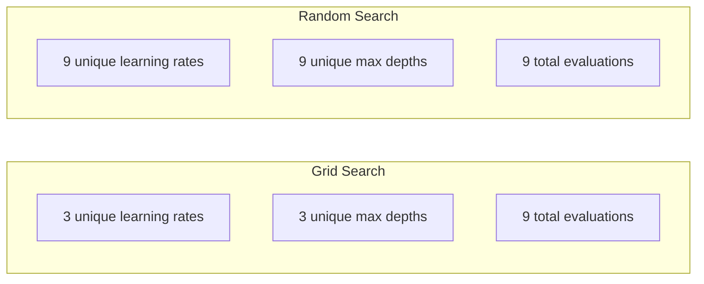
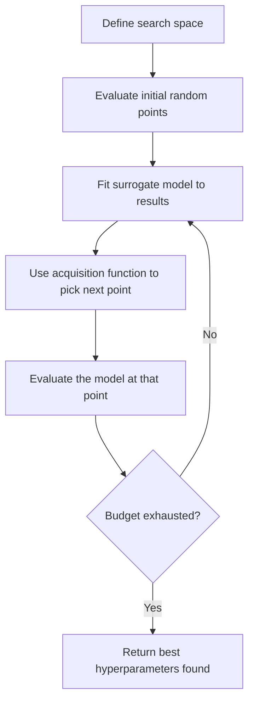
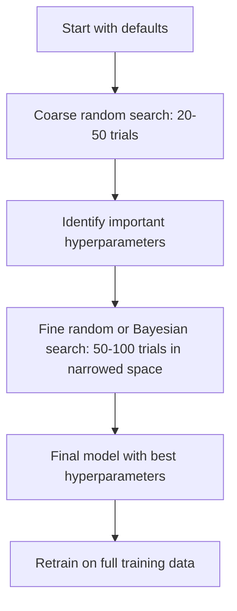
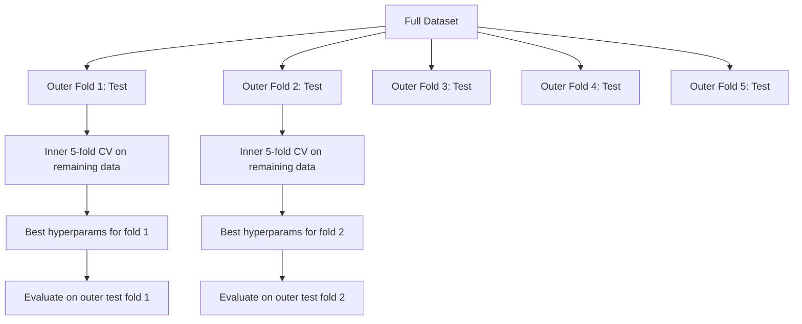

# 하이퍼파라미터 튜닝

> 하이퍼파라미터는 훈련 시작 전에 돌리는 손잡이입니다. 잘 돌리면 평범한 모델과 훌륭한 모델의 차이를 만듭니다.

**유형:** 빌드
**언어:** Python
**선수 과목:** Phase 2, Lesson 11 (Ensemble Methods)
**소요 시간:** ~90분

## 학습 목표

- 그리드 서치, 랜덤 서치, 베이지안 최적화를 처음부터 구현하고 표본 효율성 비교하기
- 대부분의 하이퍼파라미터가 낮은 유효 차원을 가질 때 랜덤 서치가 그리드 서치를 능가하는 이유 설명
- 대리 모델과 획득 함수로 검색을 안내하는 베이지안 최적화 루프 구축하기
- 적절한 교차 검증으로 검증 세트 과적합을 방지하는 하이퍼파라미터 튜닝 전략 설계

## 문제

그래디언트 부스팅 모델에는 학습률, 트리 수, 최대 깊이, 리프당 최소 샘플 수, 서브샘플 비율, 열 샘플 비율이 있습니다. 6개의 하이퍼파라미터입니다. 각각에 5개의 합리적인 값이 있으면 그리드는 5^6 = 15,625개의 조합이 됩니다. 각각 훈련하는 데 10초가 걸립니다. 모두 시도하려면 43시간의 컴퓨팅이 필요합니다.

그리드 서치는 명확한 접근법이고 규모에서는 최악의 접근법입니다. 랜덤 서치는 더 적은 컴퓨팅으로 더 잘합니다. 베이지안 최적화는 과거 평가에서 학습하여 더욱 잘합니다. 어떤 전략을 사용할지, 그리고 어떤 하이퍼파라미터가 실제로 중요한지를 알면 낭비되는 GPU 시간을 며칠 절약할 수 있습니다.

## 개념

### 파라미터 vs 하이퍼파라미터

파라미터는 훈련 중 학습됩니다(가중치, 편향, 분할 임계값). 하이퍼파라미터는 훈련 시작 전에 설정되며 학습이 어떻게 발생하는지를 제어합니다.

| 하이퍼파라미터 | 제어 대상 | 일반적 범위 |
|---------------|-----------------|---------------|
| 학습률 | 업데이트당 단계 크기 | 0.001 ~ 1.0 |
| 트리/에포크 수 | 훈련 기간 | 10 ~ 10,000 |
| 최대 깊이 | 모델 복잡도 | 1 ~ 30 |
| 정규화 (lambda) | 과적합 방지 | 0.0001 ~ 100 |
| 배치 크기 | 그래디언트 추정 노이즈 | 16 ~ 512 |
| 드롭아웃률 | 삭제되는 뉴런의 비율 | 0.0 ~ 0.5 |

### 그리드 서치

그리드 서치는 지정된 값의 모든 조합을 평가합니다. exhaustive하고 이해하기 쉽지만 하이퍼파라미터 수에 따라 지수적으로 확장됩니다.

```
2개의 하이퍼파라미터에 대한 그리드:

  learning_rate: [0.01, 0.1, 1.0]
  max_depth:     [3, 5, 7]

  평가: 3 x 3 = 9개 조합

  (0.01, 3)  (0.01, 5)  (0.01, 7)
  (0.1,  3)  (0.1,  5)  (0.1,  7)
  (1.0,  3)  (1.0,  5)  (1.0,  7)
```

그리드 서치에는 근본적인 결함이 있습니다. 하나의 하이퍼파라미터가 중요하고 다른 하나는 그렇지 않으면, 대부분의 평가가 낭비됩니다. 9개의 평가에서 중요한 파라미터의 고유 값은 3개만 얻습니다.

### 랜덤 서치

랜덤 서치는 그리드 대신 분포에서 하이퍼파라미터를 샘플링합니다. 9개 평가의 동일한 예산으로 각 하이퍼파라미터의 9개 고유 값을 얻습니다.



랜덤이 그리드를 이기는 이유 (Bergstra & Bengio, 2012):

- 대부분의 하이퍼파라미터는 낮은 유효 차원을 가집니다. 주어진 문제에 대해 通常 6개 중 1-2개만 중요합니다.
- 그리드 서치는不重要한 차원에서 평가를 낭비합니다.
- 랜덤 서치는 동일한 예산으로 중요한 차원을 더 밀도 있게 커버합니다.
- 60개의 무작위 시도와 5%의 최적 지점 내에 도달할 확률이 95%입니다(검색 공간에 존재하는 경우).

### 베이지안 최적화

랜덤 서치는 결과를 무시합니다. 높은 학습률이 발산을 유발하거나 깊이 3이 깊이 10보다 지속적으로 나은 것을 학습하지 않습니다. 베이지안 최적화는 과거 평가를 사용하여 다음에 어디를 검색할지 결정합니다.



두 가지 핵심 구성 요소:

**대리 모델:** 비싼 목적 함수를 근사하는 cheap-to-evaluate 모델(일반적으로 가우시안 프로세스). 검색 공간의 어떤 지점에서든 예측과 불확실성 추정을 모두 제공합니다.

**획득 함수:** 활용(알려진 좋은 지점 근처 검색)과 탐색(불확실성이 높은 곳 검색) 사이의 균형을 맞춰 다음에 어디를 평가할지 결정합니다. 일반적인 선택:

- **기대 개선 (EI):** 이 지점에서 현재 최고 대비 얼마나 많은 개선을 기대합니까?
- **상위 신뢰 범위 (UCB):** 예측 plus 불확실성의 배수. 높은 UCB는 유망하거나 미탐색임을 의미합니다.
- **개선 확률 (PI):** 이 지점이 현재 최고를 누를 확률은 얼마입니까?

베이지안 최적화는 일반적으로 2-5배 더 적은 평가로 랜덤 서치보다 더 나은 하이퍼파라미터를 찾습니다. 대리 모델 피팅의 오버헤드는 실제 모델 훈련에 비해 미미합니다.

### 조기 종료

모든 훈련 실행이 완료될 필요는 없습니다. 구성이 10 에포크 후明显히 나쁘면 중지하고 이동합니다. 이것이 하이퍼파라미터 검색 맥락에서의 조기 종료입니다.

전략:
- **인내 기반:** N개의 연속 에포크 동안 검증 손실이 개선되지 않으면 중지
- **중앙값 프루닝:** 시험의 중간 결과가 동일한 단계에서 완료된 시험의 중앙값보다 나쁘면 중지
- **Hyperband:** 많은 구성에 작은 예산을 할당하고, 가장 좋은 구성의 예산을 점진적으로 늘립니다

Hyperband는特に 효과적입니다. 각각 1 에포크로 81개 구성을 시작하고, 상위 3분의 1을 유지하고, 3 에포크를 제공하고, 3분의 1을 유지하는 식으로 진행됩니다. 전체 예산으로 모든 구성을 평가하는 것보다 10-50배 빠르게 좋은 구성을 찾습니다.

### 학습률 스케줄러

학습률은 거의 항상 가장 중요한 하이퍼파라미터입니다. 고정 유지 대신, 스케줄러는 훈련 중에 조정합니다.

| 스케줄러 | 공식 | 사용 시기 |
|---------|---------|-------------|
| 단계 감쇠 | N 에포크마다 0.1 곱하기 | 클래식 CNN 훈련 |
| 코사인 어닐링 | lr * 0.5 * (1 + cos(pi * t / T)) | 현대 기본값 |
| 워밍업 + 감쇠 | 선형 증가 후 코사인 감쇠 | 트랜스포머 |
| 원 사이클 | 하나의 사이클에 걸쳐 증가 후 감소 | 빠른 수렴 |
| 플래토에서 감소 | 지표가 정체될 때 계수 감소 | 안전한 기본값 |

### 하이퍼파라미터 중요도

모든 하이퍼파라미터가同等 중요하지는 않습니다. 랜덤 포레스트(Probst et al., 2019)와 그래디언트 부스팅에 대한 연구는 일관된 패턴을 보여줍니다:

**높은 중요도:**
- 학습률 (항상 먼저 튜닝)
- 추정기 수 / 에포크 (튜닝 대신 조기 종료 사용)
- 정규화 강도

**중간 중요도:**
- 최대 깊이 / 레이어 수
- 리프당 최소 샘플 수 / 가중치 감쇠
- 서브샘플 비율

**낮은 중요도:**
- 최대 특성 수 (랜덤 포레스트의 경우)
- 특정 활성화 함수 선택
- 배치 크기 (합리적인 범위 내)

중요한 것들을 먼저 튜닝하고 나머지는 기본값에 둡니다.

### 실용적 전략



구체적인 워크플로우:

1. **라이브러리 기본값으로 시작.** 경험 많은 실무자들이 선택하며, Often 80%까지 도달합니다.
2. **거친 무작위 서치.** 넓은 범위, 20-50회 시도. 조기 종료를 사용하여 나쁜 실행을 빠르게 중단합니다.
3. **결과 분석.** 어떤 하이퍼파라미터가 성능과 상관관계가 있습니까? 검색 공간을 좁힙니다.
4. **세밀한 검색.** 좁해진 공간에서 베이지안 최적화 또는 집중 무작위 서치. 50-100회 시도.
5. **찾은 최상의 하이퍼파라미터로 전체 훈련 데이터에 대해 다시 훈련.**

### 교차 검증 통합

단일 검증 분할에서 하이퍼파라미터를 튜닝하는 것은 위험합니다. 최상의 하이퍼파라미터가 특정 검증 폴드에 과적합될 수 있습니다. 중첩 교차 검증은 두 개의 루프를 사용하여 이를 해결합니다:

- **외부 루프** (평가): 데이터를 train+val와 test로 분할. 편향되지 않은 성능을 보고합니다.
- **내부 루프** (튜닝): train+val를 train과 val로 분할. 최상의 하이퍼파라미터를 찾습니다.



각 외부 폴드는 독립적으로 자체 최상의 하이퍼파라미터를 찾습니다. 외부 점수는 일반화 성능에 대한 편향되지 않은 추정입니다.

sklearn 사용:

```python
from sklearn.model_selection import cross_val_score, GridSearchCV
from sklearn.ensemble import GradientBoostingRegressor

inner_cv = GridSearchCV(
    GradientBoostingRegressor(),
    param_grid={
        "learning_rate": [0.01, 0.05, 0.1],
        "max_depth": [2, 3, 5],
        "n_estimators": [50, 100, 200],
    },
    cv=5,
    scoring="neg_mean_squared_error",
)

outer_scores = cross_val_score(
    inner_cv, X, y, cv=5, scoring="neg_mean_squared_error"
)

print(f"Nested CV MSE: {-outer_scores.mean():.4f} +/- {outer_scores.std():.4f}")
```

이것은expensive (5 외부 폴드 x 5 내부 폴드 x 27 그리드 포인트 = 675 모델 피팅)지만 신뢰할 수 있는 성능 추정을 제공합니다. 논문에서 최종 결과를 보고하거나 결정의 스테이크가 높을 때 사용합니다.

### 실용적 팁

**학습률로 시작.** 그래디언트 기반 방법에는 항상 가장 중요한 하이퍼파라미터입니다. 나쁜 학습률은 다른 모든 것을 관련 없게 만듭니다. 다른 하이퍼파라미터를 기본값에 두고 먼저 학습률을 스윕합니다.

**학습률과 정규화에 대해서는 log-uniform 분포를 사용합니다.** 0.001과 0.01의 차이는 0.1과 1.0의 차이만큼 중요합니다. 선형으로 검색하면 큰 쪽에서 예산을 낭비합니다.

**n_estimators 대신 조기 종료를 사용합니다.** 부스팅과 신경망의 경우, n_estimators 또는 에포크를 높게 설정하고 조기 종료가 언제 중지할지 결정하게 합니다. 이것은 검색에서 하나의 하이퍼파라미터를 제거합니다.

**예산 배분.** 튜닝 예산의 60%를 가장 중요한 2개의 하이퍼파라미터에 지출합니다. 나머지 40%를 다른 모든 것에 지출합니다. 상위 2개가 대부분의 성능 변동을 차지합니다.

**스케일이 중요합니다.** 배치 크기는 로그 스케일로 검색하지 마세요 (16, 32, 64는 괜찮습니다). 학습률은 항상 로그 스케일로 검색합니다. 검색 분포를 하이퍼파라미터가 모델에 영향을 미치는 방식과 일치시킵니다.

| 모델 유형 | 주요 하이퍼파라미터 | 권장 검색 | 예산 |
|-----------|--------------------|--------------------|--------|
| 랜덤 포레스트 | n_estimators, max_depth, min_samples_leaf | 무작위 서치, 50회 시도 | 낮음 (빠른 훈련) |
| 그래디언트 부스팅 | learning_rate, n_estimators, max_depth | 베이지안, 100회 시도 + 조기 종료 | 중간 |
| 신경망 | learning_rate, weight_decay, batch_size | 베이지안 또는 무작위, 100+회 시도 | 높음 (느린 훈련) |
| SVM | C, gamma (RBF 커널) | 로그 스케일의 그리드, 25-50회 시도 | 낮음 (2개 매개변수) |
| Lasso/Ridge | alpha | 로그 스케일의 1D 검색, 20회 시도 | 매우 낮음 |
| XGBoost | learning_rate, max_depth, subsample, colsample | 베이지안, 100-200회 시도 + 조기 종료 | 중간 |

**확실하지 않을 때:** 시도 횟수에 하이퍼파라미터 수의 2배를 사용(예: 6개 하이퍼파라미터 = 최소 12회 시도). 50회 시도로 신중하게 설계된 그리드 서치를 이기는 경우가 많습니다.

## 빌드

### 1단계: 처음부터 그리드 서치

`code/tuning.py`의 코드는 그리드 서치, 무작위 서치, 간단한 베이지안 옵티마이저를 처음부터 구현합니다.

```python
def grid_search(model_fn, param_grid, X_train, y_train, X_val, y_val):
    keys = list(param_grid.keys())
    values = list(param_grid.values())
    best_score = -float("inf")
    best_params = None
    n_evals = 0

    for combo in itertools.product(*values):
        params = dict(zip(keys, combo))
        model = model_fn(**params)
        model.fit(X_train, y_train)
        score = evaluate(model, X_val, y_val)
        n_evals += 1

        if score > best_score:
            best_score = score
            best_params = params

    return best_params, best_score, n_evals
```

### 2단계: 처음부터 무작위 서치

```python
def random_search(model_fn, param_distributions, X_train, y_train,
                  X_val, y_val, n_iter=50, seed=42):
    rng = np.random.RandomState(seed)
    best_score = -float("inf")
    best_params = None

    for _ in range(n_iter):
        params = {k: sample(v, rng) for k, v in param_distributions.items()}
        model = model_fn(**params)
        model.fit(X_train, y_train)
        score = evaluate(model, X_val, y_val)

        if score > best_score:
            best_score = score
            best_params = params

    return best_params, best_score, n_iter
```

### 3단계: 베이지안 최적화 (단순화)

핵심 아이디어: 관찰된 (하이퍼파라미터, 점수) 쌍에 가우시안 프로세스를 피팅한 다음 획득 함수를 사용하여 다음에 어디를 볼지 결정합니다.

```python
class SimpleBayesianOptimizer:
    def __init__(self, search_space, n_initial=5):
        self.search_space = search_space
        self.n_initial = n_initial
        self.X_observed = []
        self.y_observed = []

    def _kernel(self, x1, x2, length_scale=1.0):
        dists = np.sum((x1[:, None, :] - x2[None, :, :]) ** 2, axis=2)
        return np.exp(-0.5 * dists / length_scale ** 2)

    def _fit_gp(self, X_new):
        X_obs = np.array(self.X_observed)
        y_obs = np.array(self.y_observed)
        y_mean = y_obs.mean()
        y_centered = y_obs - y_mean

        K = self._kernel(X_obs, X_obs) + 1e-4 * np.eye(len(X_obs))
        K_star = self._kernel(X_new, X_obs)

        L = np.linalg.cholesky(K)
        alpha = np.linalg.solve(L.T, np.linalg.solve(L, y_centered))
        mu = K_star @ alpha + y_mean

        v = np.linalg.solve(L, K_star.T)
        var = 1.0 - np.sum(v ** 2, axis=0)
        var = np.maximum(var, 1e-6)

        return mu, var

    def _expected_improvement(self, mu, var, best_y):
        sigma = np.sqrt(var)
        z = (mu - best_y) / (sigma + 1e-10)
        ei = sigma * (z * norm_cdf(z) + norm_pdf(z))
        return ei

    def suggest(self):
        if len(self.X_observed) < self.n_initial:
            return sample_random(self.search_space)

        candidates = [sample_random(self.search_space) for _ in range(500)]
        X_cand = np.array([to_vector(c) for c in candidates])
        mu, var = self._fit_gp(X_cand)
        ei = self._expected_improvement(mu, var, max(self.y_observed))
        return candidates[np.argmax(ei)]

    def observe(self, params, score):
        self.X_observed.append(to_vector(params))
        self.y_observed.append(score)
```

GP 대리는 각 후보 지점에서 두 가지를 제공합니다: 예측된 점수(mu)와 불확실성(var). 기대 개선은 이를 균형 맞춥니다: 모델이 높은 점수를 예측하거나 불확실성이 높은 지점을 선호합니다.初期에는 대부분의 지점에서 불확실성이 높으므로 옵티마이저가 탐색합니다. 나중에는 가장 유망한 영역에 집중합니다.

### 4단계: 모든 방법 비교

동일한 합성 목적 함수에서 모든 세 가지 방법을 실행하고 비교합니다. 이 비교는 직접 목적 함수로 각 옵티마이저를 호출하는 단순화된 래퍼를 사용하므로 API는 위의 모델 기반 구현과 다릅니다:

```python
def synthetic_objective(params):
    lr = params["learning_rate"]
    depth = params["max_depth"]
    return -(np.log10(lr) + 2) ** 2 - (depth - 4) ** 2 + 10

param_grid = {
    "learning_rate": [0.001, 0.01, 0.1, 1.0],
    "max_depth": [2, 3, 4, 5, 6, 7, 8],
}

grid_best = None
grid_score = -float("inf")
grid_history = []
for combo in itertools.product(*param_grid.values()):
    params = dict(zip(param_grid.keys(), combo))
    score = synthetic_objective(params)
    grid_history.append((params, score))
    if score > grid_score:
        grid_score = score
        grid_best = params

param_dist = {
    "learning_rate": ("log_float", 0.001, 1.0),
    "max_depth": ("int", 2, 8),
}

rand_best = None
rand_score = -float("inf")
rand_history = []
rng = np.random.RandomState(42)
for _ in range(28):
    params = {k: sample(v, rng) for k, v in param_dist.items()}
    score = synthetic_objective(params)
    rand_history.append((params, score))
    if score > rand_score:
        rand_score = score
        rand_best = params

optimizer = SimpleBayesianOptimizer(param_dist, n_initial=5)
bayes_history = []
for _ in range(28):
    params = optimizer.suggest()
    score = synthetic_objective(params)
    optimizer.observe(params, score)
    bayes_history.append((params, score))
bayes_score = max(s for _, s in bayes_history)

print(f"{'Method':<20} {'Best Score':>12} {'Evaluations':>12}")
print("-" * 50)
print(f"{'Grid Search':<20} {grid_score:>12.4f} {len(grid_history):>12}")
print(f"{'Random Search':<20} {rand_score:>12.4f} {len(rand_history):>12}")
print(f"{'Bayesian Opt':<20} {bayes_score:>12.4f} {len(bayes_history):>12}")
```

동일한 예산으로, 베이지안 최적화는 분명히 나쁜 영역에서 평가를 낭비하지 않으므로通常 가장 빠른 속도로 최상의 점수를 찾습니다. 무작위 서치는 그리드 서치보다 더 많은 영역을 커버합니다. 매우 적은 하이퍼파라미터만 있고 완전히 소진할 여유가 있을 때만 그리드 서치가 승리합니다.

## 활용

### Optuna 실전

Optuna는本格的な 하이퍼파라미터 튜닝에 권장되는 라이브러리입니다. box에서 즉시 프루닝, 분산 검색, 시각화를 지원합니다.

```python
import optuna

def objective(trial):
    lr = trial.suggest_float("learning_rate", 1e-4, 1e-1, log=True)
    n_est = trial.suggest_int("n_estimators", 50, 500)
    max_depth = trial.suggest_int("max_depth", 2, 10)

    model = GradientBoostingRegressor(
        learning_rate=lr,
        n_estimators=n_est,
        max_depth=max_depth,
    )
    model.fit(X_train, y_train)
    return mean_squared_error(y_val, model.predict(X_val))

study = optuna.create_study(direction="minimize")
study.optimize(objective, n_trials=100)

print(f"Best params: {study.best_params}")
print(f"Best MSE: {study.best_value:.4f}")
```

주요 Optuna 기능:
- 학습률, 정규화에最适合検索するため`suggest_float(..., log=True)`
- 정수 매개변수용 `suggest_int`
- 이산 선택용 `suggest_categorical`
- 나쁜 시험의 조기 종료를 위한 내장 MedianPruner
- 분석을 위한 `study.trials_dataframe()`

### 프루닝과 함께 Optuna

프루닝은 유망하지 않은 시험을 조기에停止하여 대규모 컴퓨트를 절약합니다. 패턴은 다음과 같습니다:

```python
import optuna
from sklearn.model_selection import cross_val_score

def objective(trial):
    params = {
        "learning_rate": trial.suggest_float("lr", 1e-4, 0.5, log=True),
        "max_depth": trial.suggest_int("max_depth", 2, 10),
        "n_estimators": trial.suggest_int("n_estimators", 50, 500),
        "subsample": trial.suggest_float("subsample", 0.5, 1.0),
    }

    model = GradientBoostingRegressor(**params)
    scores = cross_val_score(model, X_train, y_train, cv=3,
                             scoring="neg_mean_squared_error")
    mean_score = -scores.mean()

    trial.report(mean_score, step=0)
    if trial.should_prune():
        raise optuna.TrialPruned()

    return mean_score

pruner = optuna.pruners.MedianPruner(n_startup_trials=10, n_warmup_steps=5)
study = optuna.create_study(direction="minimize", pruner=pruner)
study.optimize(objective, n_trials=200)
```

`MedianPruner`은 시험의 중간 값이 동일한 단계에서 완료된 모든 시험의 중앙값보다 나쁘면 시험을 중지합니다. 프루닝에는 중간 지표를 보고하기 위해 `trial.report()`를 호출하고 시험이 중지되어야 하는지 확인하기 위해 `trial.should_prune()`를 호출해야 합니다. `n_startup_trials=10`은 프루닝이 작동하기 전에 최소 10개의 시험이 완전히 완료되도록 합니다. 이것은通常 총 컴퓨트의 40-60%를 절약합니다.

### sklearn의 내장 튜너

빠른 실험을 위해 sklearn은 `GridSearchCV`, `RandomizedSearchCV`, `HalvingRandomSearchCV`를 제공합니다:

```python
from sklearn.model_selection import RandomizedSearchCV
from scipy.stats import loguniform, randint

param_dist = {
    "learning_rate": loguniform(1e-4, 0.5),
    "max_depth": randint(2, 10),
    "n_estimators": randint(50, 500),
}

search = RandomizedSearchCV(
    GradientBoostingRegressor(),
    param_dist,
    n_iter=100,
    cv=5,
    scoring="neg_mean_squared_error",
    random_state=42,
    n_jobs=-1,
)
search.fit(X_train, y_train)
print(f"Best params: {search.best_params_}")
print(f"Best CV MSE: {-search.best_score_:.4f}")
```

학습률과 정규화에는 scipy의 `loguniform`을 사용합니다. 정수 하이퍼파라미터에는 `randint`를 사용합니다. `n_jobs=-1` 플래그는 모든 CPU 코어에 걸쳐 병렬화합니다.

### 하이퍼파라미터 튜닝의 일반적인 실수

**전처리를 통한 데이터 누수.** 교차 검증 전에 전체 데이터셋에서 스케일러를 피팅하면 검증 폴드의 정보가 훈련으로 유출됩니다. 항상 전처리를 `Pipeline` 안에 넣어 훈련 폴드에서만 피팅되도록 합니다.

**검증 세트에 과적합.**数千 개의 시험을 실행하면 효과적으로 검증 세트에서 훈련하게 됩니다. 최종 성능 추정에 대해서는 중첩 교차 검증을 사용하거나, 튜닝 중에 절대 만지지 않는 별도의 테스트 세트를 보유합니다.

**너무 좁은 범위 검색.** 최상의 값이 검색 공간의 경계에 있으면 충분히 넓게 검색하지 않은 것입니다. 최적의 값이 범위 밖에 있을 수 있습니다. 최상의 매개변수가 가장자리에 있는지 항상 확인합니다.

**상호작용 효과 무시.** 학습률과 추정기 수는 부스팅에서 강하게 상호작용합니다. 낮은 학습률은 더 많은 추정기가 필요합니다. 독립적으로 튜닝하면 함께 튜닝하는 것보다 더 나쁜 결과가 나옵니다.

**반복 모델에 조기 종료 미사용.** 그래디언트 부스팅과 신경망의 경우 n_estimators 또는 에포크를 높은 값으로 설정하고 조기 종료를 사용합니다. 이것은 반복 횟수를 하이퍼파라미터로 튜닝하는 것보다 엄격히 더 낫습니다.

## 연습 문제

1. 동일한 총 예산(예: 50회 평가)으로 그리드 서치와 무작위 서치를 실행합니다. 찾은 최상의 점수를 비교합니다. 다른 시드로 10번 실험을 실행합니다. 무작위 서치가 얼마나 자주 이깁니까?

2. 처음부터 Hyperband를 구현합니다. 각각 1 에포크로 훈련된 81개 구성으로 시작합니다. 각 라운드에서 상위 3분의 1을 유지하고 예산을 3배로 늘립니다. 전체 예산으로 81개 구성을 실행하는 것 대비 총 컴퓨트(모든 구성의 모든 에포크 합계)를 비교합니다.

3. Lesson 11의 그래디언트 부스팅 구현에 학습률 스케줄러(코사인 어닐링)를 추가합니다. 고정 학습률 대비 도움이 됩니까?

4. Optuna를 사용하여 실제 데이터셋(예: sklearn의 유방암 데이터셋)에서 RandomForestClassifier를 튜닝합니다. `optuna.visualization.plot_param_importances(study)`를 사용하여 어떤 하이퍼파라미터가 가장 중요한지 확인합니다. 이 수업의 중요도 순위와 일치합니까?

5. 간단한 획득 함수(기대 개선)를 구현하고 탐색 대 활용을 시연합니다. 대리 모델의 평균과 불확실성을 플롯하고 EI가 다음에 어디를 평가할지 선택하는지 보여줍니다.

## 핵심 용어

| 용어 | 사람들이 말하는 것 | 실제 의미 |
|------|----------------|----------------------|
| 하이퍼파라미터 | "선택하는 설정" | 훈련 전에 설정되며 학습 프로세스를 제어하는 값, 데이터에서 학습되지 않음 |
| 그리드 서치 | "모든 조합 시도" | 지정된 매개변수 그리드에 대한 exhaustive 검색. 지수적 비용. |
| 무작위 서치 | "무작위로 샘플링" | 분포에서 하이퍼파라미터를 샘플링. 그리드 서치보다 중요한 차원을 더 잘 커버합니다. |
| 베이지안 최적화 | "스마트 검색" | 다음에 어디를 평가할지 결정하기 위해 목적 함수의 대리 모델을 사용, 탐색과 활용의 균형 |
| 대리 모델 | "저렴한 근사" | 관찰된 평가에서 비싼 목적 함수를 근사하는 모델(일반적으로 가우시안 프로세스) |
| 획득 함수 | "다음에 어디를 볼지" | 기대되는 개선과 불확실성을 균형 맞춰 후보 지점에 점수를 매깁니다. EI와 UCB가 일반적인 선택입니다. |
| 조기 종료 | "시간 낭비 중지" | 검증 성능이 개선을 멈출 때 훈련을 일찍 종료 |
| Hyperband | "구성을 위한 토너먼트 브라켓" | 적응형 리소스 할당: 적은 예산으로 많은 구성을 시작하고, 가장 좋은 구성을 유지하여 예산 증가 |
| 학습률 스케줄러 | "훈련 중 lr 변경" | 더 나은 수렴을 위해 훈련 과정を通じて 학습률을 조정하는 함수 |

## 추가 자료

- [Bergstra & Bengio: Random Search for Hyper-Parameter Optimization (2012)](https://jmlr.org/papers/v13/bergstra12a.html) -- 무작위 서치가 그리드를 이긴다는 것을 보여준 논문
- [Snoek et al., Practical Bayesian Optimization of Machine Learning Algorithms (2012)](https://arxiv.org/abs/1206.2944) -- ML용 베이지안 최적화
- [Li et al., Hyperband: A Novel Bandit-Based Approach (2018)](https://jmlr.org/papers/v18/16-558.html) -- Hyperband 논문
- [Optuna: A Next-generation Hyperparameter Optimization Framework](https://arxiv.org/abs/1907.10902) -- Optuna 논문
- [Probst et al., Tunability: Importance of Hyperparameters (2019)](https://jmlr.org/papers/v20/18-444.html) --哪些 하이퍼파라미터가 중요한지