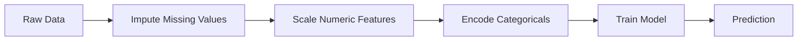
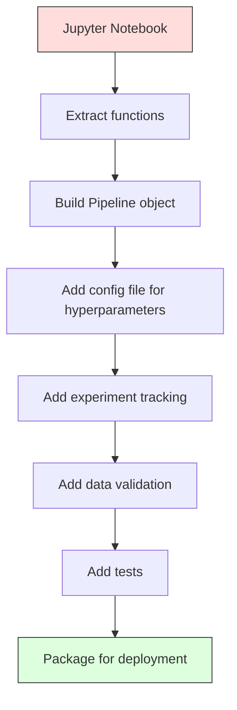

# ML 파이프라인

> 모델은 제품이 아닙니다. 파이프라인이 제품입니다. 파이프라인은 원시 데이터부터 배포된 예측까지 모든 것이며, 모든 단계가 재현 가능해야 합니다.

**유형:** 빌드
**언어:** Python
**선수 과목:** Phase 2, Lesson 12 (Hyperparameter Tuning)
**소요 시간:** ~120분

## 학습 목표

- 결측치 대체, 스케일링, 인코딩, 모델 훈련을 단일 재현 가능 객체로 연결하는 ML 파이프라인을 처음부터 구축
- 데이터 누수 시나리오를 식별하고 파이프라인이 변환기를 훈련 데이터에만 적합시켜 누수를 방지하는 방법 설명
- 수치 특성과 범주형 특성에 다른 전처리를 적용하는 ColumnTransformer 구축
- 파이프라인 직렬화를 구현하고 동일한 적합 파이프라인이 훈련과 프로덕션에서 동일한 결과를 생성함을 시연

## 문제

데이터를 로드하고, 중앙값으로 결측치를 채우고, 특성을 스케일하고, 모델을 훈련하고, 정확도를 출력하는 노트북이 있습니다. 작동합니다. 출시합니다.

한 달 후, 누군가가 모델을 재훈련하고 다른 결과를 얻습니다. 중앙값이 테스트 데이터를 포함한 전체 데이터셋에서 계산되었습니다(데이터 누수). 스케일링 매개변수가 저장되지 않아 추론에 다른 통계가 사용됩니다. 기능 엔지니어링 코드가 훈련과 제공 사이에 복사粘贴되었고 복사본이 갈라졌습니다. 범주형 열이 프로덕션에서 인코더가 본 적이 없는 새로운 값을 얻었습니다.

이것들은 가상이 아닙니다. ML 시스템이 프로덕션에서 실패하는 가장 일반적인 이유입니다. 파이프라인은 모든 변환 단계를 단일, 순서가 있고 재현 가능한 객체로 패키징하여这些问题를 모두 해결합니다.

## 개념

### 파이프라인이란 무엇인가

파이프라인은 모델 preceded by 데이터 변환의ordered 시퀀스입니다. 각 단계는 이전 단계의 출력을 입력으로 사용합니다. 전체 파이프라인은 훈련 데이터에서 한 번 적합됩니다. 추론 시점에 동일한 적합 파이프라인이 새 데이터를 변환하고 예측을 생성합니다.



파이프라인이 보장하는 것:
- 변환은 훈련 데이터에만 적합됩니다(누수 없음)
- 동일한 변환이 추론 시점에 적용됩니다
- 전체 객체를 하나의 아티팩트로 직렬화하고 배포할 수 있습니다
- 교차 검증은 폴드당 파이프라인을 적용하여 미묘한 누수를 방지합니다

### 데이터 누수: 침묵의 킬러

데이터 누수는 테스트 세트나 미래 데이터의 정보가 훈련을 오염시킬 때 발생합니다. 파이프라인은 가장 일반적인 형태를 방지합니다.

**누수가 있는 (잘못된):**
```python
X = df.drop("target", axis=1)
y = df["target"]

scaler = StandardScaler()
X_scaled = scaler.fit_transform(X)

X_train, X_test = X_scaled[:800], X_scaled[800:]
y_train, y_test = y[:800], y[800:]
```

스케일러가 테스트 데이터를 보았습니다. 평균과 표준 편차가 테스트 샘플을 포함합니다. 이것은 정확도 추정치를 부풀립니다.

**올바른:**
```python
X_train, X_test = X[:800], X[800:]

scaler = StandardScaler()
X_train_scaled = scaler.fit_transform(X_train)
X_test_scaled = scaler.transform(X_test)
```

파이프라인을 사용하면 이것에 대해 생각할 필요가 없습니다. 파이프라인이 자동으로 처리합니다.

### sklearn 파이프라인

sklearn의 `Pipeline`은 변환기와 추정기를 연결합니다. 모든 단계를 순서대로 적용하는 `.fit()`, `.predict()`, `.score()`를 노출합니다.

```python
from sklearn.pipeline import Pipeline
from sklearn.preprocessing import StandardScaler
from sklearn.linear_model import LogisticRegression

pipe = Pipeline([
    ("scaler", StandardScaler()),
    ("model", LogisticRegression()),
])

pipe.fit(X_train, y_train)
predictions = pipe.predict(X_test)
```

`pipe.fit(X_train, y_train)`를 호출할 때:
1. 스케일러가 X_train에서 `fit_transform`을 호출합니다
2. 모델이 스케일된 X_train에서 `fit`을 호출합니다

`pipe.predict(X_test)`를 호출할 때:
1. 스케일러가 X_test에서 `transform`을 호출합니다 (fit_transform이 아닌)
2. 모델이 스케일된 X_test에서 `predict`를 호출합니다

스케일러가 적합 중에 테스트 데이터를 절대 보지 않습니다. 이것이 핵심입니다.

### ColumnTransformer: 다른 열에 다른 파이프라인

실제 데이터셋은異なる 전처리가 필요한 수치형과 범주형 열이 있습니다. `ColumnTransformer`가 이를 처리합니다.

```python
from sklearn.compose import ColumnTransformer
from sklearn.preprocessing import StandardScaler, OneHotEncoder
from sklearn.impute import SimpleImputer

numeric_pipe = Pipeline([
    ("impute", SimpleImputer(strategy="median")),
    ("scale", StandardScaler()),
])

categorical_pipe = Pipeline([
    ("impute", SimpleImputer(strategy="most_frequent")),
    ("encode", OneHotEncoder(handle_unknown="ignore")),
])

preprocessor = ColumnTransformer([
    ("num", numeric_pipe, ["age", "income", "score"]),
    ("cat", categorical_pipe, ["city", "gender", "plan"]),
])

full_pipeline = Pipeline([
    ("preprocess", preprocessor),
    ("model", GradientBoostingClassifier()),
])
```

OneHotEncoder의 `handle_unknown="ignore"`는 프로덕션에非常重要합니다. 새로운 범주(모델이 본 적이 없는 도시)가 나타나면 충돌하는 대신 영벡터를 생성합니다.

### 실험 추적

파이프라인은 훈련을 재현 가능하게 하지만, 실험 전반에 걸쳐 무슨 일이 있었는지도 추적해야 합니다: 어떤 하이퍼파라미터가 사용되었는지, 어떤 데이터셋 버전, 어떤 지표였는지, 어떤 코드가 실행되고 있었는지.

**MLflow**가 가장 일반적인 오픈소스 솔루션입니다:

```python
import mlflow

with mlflow.start_run():
    mlflow.log_param("max_depth", 5)
    mlflow.log_param("n_estimators", 100)
    mlflow.log_param("learning_rate", 0.1)

    pipe.fit(X_train, y_train)
    accuracy = pipe.score(X_test, y_test)

    mlflow.log_metric("accuracy", accuracy)
    mlflow.sklearn.log_model(pipe, "model")
```

모든 실행은 매개변수, 지표, 아티팩트, 전체 모델과 함께 기록됩니다. 실행을 비교하고, qualquer 실험을 재현하고, qualquer 모델 버전을 배포할 수 있습니다.

**Weights & Biases (wandb)**는 호스팅 대시보드로 동일한 기능을 제공합니다:

```python
import wandb

wandb.init(project="my-pipeline")
wandb.config.update({"max_depth": 5, "n_estimators": 100})

pipe.fit(X_train, y_train)
accuracy = pipe.score(X_test, y_test)

wandb.log({"accuracy": accuracy})
```

### 모델 버전 관리

실험 추적 후 모델 버전을 관리해야 합니다. 프로덕션에 있는 모델은 어느 것입니까? 스테이징은 어느 것입니까? 지난 주 것은 어느 것입니까?

MLflow의 Model Registry는 다음을 제공합니다:
- **버전 추적:** 저장된 모든 모델이 버전 번호를 받습니다
- **단계 전환:** "Staging", "Production", "Archived"
- **승인 워크플로:** 모델이 명시적으로 프로덕션으로 승격되어야 합니다
- **롤백:** 이전 버전으로 즉시 전환

### DVC로 데이터 버전 관리

코드는 git으로 버전 관리됩니다. 데이터도 버전 관리되어야 하지만 git은 큰 파일을 처리할 수 없습니다. DVC(Data Version Control)가 이를 해결합니다.

```
dvc init
dvc add data/training.csv
git add data/training.csv.dvc data/.gitignore
git commit -m "Track training data"
dvc push
```

DVC는 실제 데이터를 원격 스토리지(S3, GCS, Azure)에 저장하고 해시를 기록하는 작은 `.dvc` 파일을 git에 유지합니다. git 커밋을 체크아웃할 때 `dvc checkout`이 사용된 정확한 데이터를 복원합니다.

이는 모든 git 커밋이 코드와 데이터를 모두 고정함을 의미합니다. 완전한 재현 가능성.

### 재현 가능한 실험

재현 가능한 실험에는 네 가지가 필요합니다:

1. **고정 무작위 시드:** numpy, random, 프레임워크(torch, sklearn)의 시드 설정
2. **고정된 종속성:** 정확한 버전의 requirements.txt 또는 poetry.lock
3. **버전이 지정된 데이터:** DVC 또는 유사한もの
4. **구성 파일:** 모든 하이퍼파라미터를 구성에, 하드코딩하지 않음

```python
import numpy as np
import random

def set_seed(seed=42):
    random.seed(seed)
    np.random.seed(seed)
    try:
        import torch
        torch.manual_seed(seed)
        torch.cuda.manual_seed_all(seed)
        torch.backends.cudnn.deterministic = True
    except ImportError:
        pass
```

### 노트북에서 프로덕션 파이프라인으로



일반적인 진행:

1. **노트북 탐색:** 빠른 실험, 시각화, 특성 아이디어
2. **함수 추출:** 전처리, 기능 엔지니어링, 평가를 모듈로 이동
3. **파이프라인 구축:** sklearn Pipeline 또는 커스텀 클래스로 변환 연결
4. **구성 관리:** 모든 하이퍼파라미터를 YAML/JSON 구성으로 이동
5. **실험 추적:** MLflow 또는 wandb 로깅 추가
6. **데이터 검증:** 훈련 전 스키마, 분포, 결측치 패턴 확인
7. **테스트:** 변환기에 대한 단위 테스트, 전체 파이프라인에 대한 통합 테스트
8. **배포:** 파이프라인 직렬화, API로 래핑(FastAPI, Flask), 컨테이너화

### 일반적인 파이프라인 실수

| 실수 | 왜 나쁜지 | 수정 |
|------|-------------|-----|
| 분할 전 전체 데이터에 적합 | 데이터 누수 | 교차_val_score와 함께 Pipeline 사용 |
| 파이프라인 외부의 기능 엔지니어링 | 훈련 vs 제공 시 다른 변환 | 모든 변환을 Pipeline에 넣기 |
| 알 수 없는 범주 처리 안 함 | 새 값에서 프로덕션 충돌 | OneHotEncoder(handle_unknown="ignore") |
| 하드코딩된 열 이름 | 스키마가 변경되면 중단 | 구성에서 열 이름 목록 사용 |
| 데이터 검증 없음 | 잘못된 데이터에서 조용히 잘못된 예측 | 예측 전 스키마 체크 추가 |
| 훈련/제공 왜곡 | "노트북에서 작동했는데" | 둘 모두에 하나의 Pipeline 객체 |

## 빌드

`code/pipeline.py`의 코드는 처음부터 완전한 ML 파이프라인을 구축합니다:

### 1단계: 커스텀 변환기

```python
class CustomTransformer:
    def __init__(self):
        self.means = None
        self.stds = None

    def fit(self, X):
        self.means = np.mean(X, axis=0)
        self.stds = np.std(X, axis=0)
        self.stds[self.stds == 0] = 1.0
        return self

    def transform(self, X):
        return (X - self.means) / self.stds

    def fit_transform(self, X):
        return self.fit(X).transform(X)
```

### 2단계: 처음부터 파이프라인

```python
class PipelineFromScratch:
    def __init__(self, steps):
        self.steps = steps

    def fit(self, X, y=None):
        X_current = X.copy()
        for name, step in self.steps[:-1]:
            X_current = step.fit_transform(X_current)
        name, model = self.steps[-1]
        model.fit(X_current, y)
        return self

    def predict(self, X):
        X_current = X.copy()
        for name, step in self.steps[:-1]:
            X_current = step.transform(X_current)
        name, model = self.steps[-1]
        return model.predict(X_current)
```

### 3단계: 파이프라인과 함께 교차 검증

코드는 파이프라인과의 교차 검증이 데이터 누수를 방지하는 방법을演示합니다: 스케일러는 각 폴드의 훈련 데이터에서 별도로 적합됩니다.

### 4단계: sklearn을 사용한 완전한 프로덕션 파이프라인

적절한 교차 검증과 실험 로깅으로 훈련된 모델, ColumnTransformer, multiple 전처리 경로가 있는 완전한 파이프라인.

## 결과물

이 수업은 다음을 생성합니다:
- `outputs/prompt-ml-pipeline.md` -- ML 파이프라인 구축 및 디버깅을 위한 스킬
- `code/pipeline.py` -- 처음부터 sklearn까지 완전한 파이프라인

## 연습 문제

1. 3개의 수치형 열과 2개의 범주형 열이 있는 데이터셋을 처리하는 파이프라인을 구축합니다. ColumnTransformer를 사용하여 수치형에는 중앙값 대체 + 스케일링을, 범주형에는 최빈값 대체 + 원-핫 인코딩을 적용합니다. 5-fold 교차 검증으로 훈련합니다.

2. 의도적으로 데이터 누수를 도입합니다: 분할 전에 전체 데이터셋에 스케일러를 적합합니다. (누수가 있는) 교차 검증 점수와 파이프라인 교차 검증 점수(干净的)를 비교합니다. 차이가 얼마나 됩니까?

3. `joblib.dump`로 파이프라인을 직렬화합니다. 별도의 스크립트에서 로드하고 예측을 실행합니다. 예측이 동일한지 확인합니다.

4. 파이프라인에 두 개의 가장 중요한 수치형 열에 대해 다항식 특성(2차)을 생성하는 커스텀 변환기를 추가합니다. 파이프라인에서 어디에 위치해야 합니까?

5. 파이프라인에 대한 MLflow 추적을 설정합니다. 다른 하이퍼파라미터로 5번의 실험을 실행합니다. MLflow UI(`mlflow ui`)를 사용하여 실행을 비교하고 최상의 모델을 선택합니다.

## 핵심 용어

| 용어 | 사람들이 말하는 것 | 실제 의미 |
|------|----------------|----------------------|
| 파이프라인 | "변환 + 모델 체인" | 누수를 방지하기 위해 하나의 단위로 적용되는 적합된 변환기와 모델의 순서 시퀀스 |
| 데이터 누수 | "테스트 정보가 훈련에 유출됨" | 모델 구축에 훈련 세트 외부의 정보를 사용하여 성능 추정치를 부풀림 |
| ColumnTransformer | "열마다 다른 전처리" | 다른 열 하위 집합에 다른 파이프라인을 적용하여 결과를 결합 |
| 실험 추적 | "실행 로깅" | 모든 훈련 실행에 대한 매개변수, 지표, 아티팩트, 코드 버전 기록 |
| MLflow | "모델 추적 및 배포" | 실험 추적, 모델 레지스트리, 배포를 위한 오픈소스 플랫폼 |
| DVC | "데이터용 git" | 큰 데이터 파일용 버전 제어 시스템으로, git에 해시를 저장하고 데이터를 원격 스토리에 저장 |
| 모델 레지스트리 | "모델 버전 카탈로그" | 단계 레이블(staging, production, archived)이 있는 모델 버전을 추적하는 시스템 |
| 훈련/제공 왜곡 | "노트북에서 작동했는데" | 훈련과 추론 중에 데이터가 다르게 처리되어 발생하는无声 오류 |
| 재현 가능성 | "같은 코드, 같은 결과" | 동일한 코드, 데이터, 구성에서 동일한 결과를 얻을 수 있는 능력 |

## 추가 자료

- [scikit-learn Pipeline docs](https://scikit-learn.org/stable/modules/compose.html) -- 공식 파이프라인 참고 자료
- [MLflow documentation](https://mlflow.org/docs/latest/index.html) -- 실험 추적 및 모델 레지스트리
- [DVC documentation](https://dvc.org/doc) -- 데이터 버전 관리
- [Sculley et al., Hidden Technical Debt in Machine Learning Systems (2015)](https://papers.nips.cc/paper/2015/hash/86df7dcfd896fcaf2674f757a2463eba-Abstract.html) -- ML 시스템 복잡성에 관한奠基적 논문
- [Google ML Best Practices: Rules of ML](https://developers.google.com/machine-learning/guides/rules-of-ml) -- 실용적 프로덕션 ML 조언