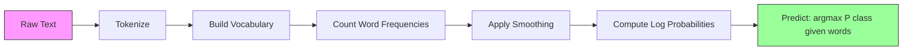

# 나이브 베이즈

> "순진한" 가정은 틀렸지만, 어쨌든 작동합니다. 그게 이 방법의 아름다움입니다.

**유형:** 빌드
**언어:** Python
**선수 과목:** Phase 2, Lessons 01-07 (classification, Bayes' theorem)
**소요 시간:** ~75분

## 학습 목표

- 텍스트 분류를 위해 라플라스 평활화로 다항 나이브 베이즈를 처음부터 구현하기
- 순진한 독립성 가정이 수학적으로는 틀렸지만 실제로 올바른 클래스 순위를 생성하는 이유 설명
- 다항, 베르누이, 가우시안 나이브 베이즈 변형 비교하고 주어진 특성 유형에 적합한 것 선택
- 고차원 희소 데이터에서 로지스틱 회귀와 비교 평가하고 작동하는 편향-분산 트레이드오프 설명

## 문제

텍스트를 분류해야 합니다. 이메일을 스팸 또는 스팸 아님으로. 고객 리뷰를 긍정 또는 부정으로. 지원 티켓을 범주로. 수천 개의 특성(단어당 하나씩)이 있고 훈련 데이터가 제한적입니다.

대부분의 분류기는 여기서 뭔캐합니다. 로지스틱 회귀는 수천 개의 가중치를 신뢰할 수 있게 추정하기에 충분한 샘플이 필요합니다. 결정 트리는 한 번에 하나의 단어에서 분할하고 wild하게 과적합됩니다. 10,000 차원에서의 KNN은 모든 포인트가 모든 다른 포인트에서同等 멀리 있기 때문에 의미가 없습니다.

나이브 베이즈는 이를 처리합니다. 수학적으로 틀린 가정(모든 특성이 클래스가 주어지면 모든 다른 특성과 독립)이 있지만, 특히 작은 훈련 세트에서 텍스트 분류에서 "更 inteligência" 모델보다 여전히 outperorms. 훈련 데이터 전체를 한 번 통과하는 것으로 훈련됩니다. 수백만 개의 특성으로 확장됩니다. 확률 추정을 생성합니다(그러나 independence 가정으로 인해 Often poorly calibration됨).

잘못된 가정이 좋은 예측으로 이끄는 이유를 이해하면 머신러닝에 대한根本적인 것을 가르칩니다: 최선의 모델은 가장 정확한 모델이 아니라 데이터에 대해 가장 좋은 편향-분산 트레이드오프를 가진 모델입니다.

## 개념

### 베이즈 정리 (빠른 복습)

베이즈 정리는 조건부 확률을 뒤집습니다:

```
P(class | features) = P(features | class) * P(class) / P(features)
```

`P(class | features)` -- 문서의 단어들이 주어졌을 때 문서가 클래스에 속할 확률 -- 가 필요합니다. 이것은 다음에서 계산할 수 있습니다:
- `P(features | class)` -- 이 클래스의 문서에서 이러한 단어를 볼 가능성
- `P(class)` -- 클래스의 사전 확률 (일반적으로 스팸이 얼마나 흔합니까?)
- `P(features)` -- 증거, 모든 클래스에 동일, поэтому 비교할 때 무시 가능

최고의 `P(class | features)`를 가진 클래스가 승리합니다.

### 순진한 독립성 가정

`P(features | class)`를 정확히 계산하려면 모든 특성의 결합 확률을 추정해야 합니다. 10,000개 단어의 어휘로 2^10,000 가능한 조합에 대한 분포를 추정해야 합니다. 불가능.

순진한 가정: 모든 특성은 클래스가 주어지면 조건부로 독립입니다.

```
P(w1, w2, ..., wn | class) = P(w1 | class) * P(w2 | class) * ... * P(wn | class)
```

하나의 불가능한 결합 분포 대신 n개의 단순 per-feature 분포를 추정합니다. 각각은 단지 count만 필요합니다.

이 가정은明らかに 틀렸습니다. "machine"과 "learning"이라는 단어는 어떤 문서에서도 독립이 아닙니다. 그러나 분류기는 정확한 확률 추정이 필요하지 않습니다. 올바른 순위 -- 어느 클래스가 가장 높은 확률을 갖는지 -- 가 필요합니다. 독립성 가정은 체계적 오류를 도입하지만, 이러한 오류는 모든 클래스에 Similar하게 영향을 미치므로 순위가 올바른 상태로 유지됩니다.

### 왜 여전히 작동하는가

세 가지 이유:

1. **Calibration보다 순위.** 분류는 올바른 상위 순위 클래스만 올바르면 됩니다. 진짜 확률이 0.7인데 P(spam) = 0.99999여도 분류기는 여전히 스팸을 올바르게 선택합니다. 정확한 확률이 필요하지 않습니다. 올바른 승자가 필요합니다.

2. **높은 편향, 낮은 분산.** 독립성 가정은 강한 사전입니다. 모델을 강하게 제약하여 과적합을 방지합니다. 제한된 훈련 데이터로, 이론적으로 틀렸지만 안정적인 모델이 이론적으로 정확하지만wild하게 불안정한 모델보다 낫습니다. 이것이 작동하는 편향-분산 트레이드오프입니다.

3. **기능 중복성이 상쇄됩니다.** 상관된 특성은 중복된 증거를 제공합니다. 분류기는 이 증거를 이중 계산합니다. 그러나 올바른 클래스에도 이중 계산합니다. "machine"과 "learning"이 항상 함께 나타나면 둘 다 "tech" 클래스에 대한 증거를 제공합니다. NB는 두 번 계산하지만 올바른 클래스에 대해 두 번 계산합니다.

네 번째实用的 이유: 나이브 베이즈는extremely 빠릅니다. 훈련은 빈도数を 세는 데이터 한 번 통과입니다. 예측은 행렬 곱셈입니다. 수백만 개의 문서를 수 초 내에 훈련할 수 있습니다. 이 속도로 더 빠르게 반복하고, 더 많은 기능 세트를 시도하고, 더 느린 모델보다 더 많은 실험을 실행할 수 있습니다.

### 단계별 수학

구체적인 예시를 추적해 보겠습니다. 스팸과 스팸 아님의 두 클래스가 있다고 가정합니다. 어휘에는 세 개의 단어가 있습니다: "free", "money", "meeting".

훈련 데이터:
- 스팸 이메일은 "free"를 80번, "money"를 60번, "meeting"을 10번 언급합니다 (총 150개 단어)
- 스팸 아님 이메일은 "free"를 5번, "money"를 10번, "meeting"을 100번 언급합니다 (총 115개 단어)
- 이메일의 40%는 스팸, 60%는 스팸 아님

라플라스 평활(alpha=1)와 함께:

```
P(free | spam)    = (80 + 1) / (150 + 3) = 81/153 = 0.529
P(money | spam)   = (60 + 1) / (150 + 3) = 61/153 = 0.399
P(meeting | spam) = (10 + 1) / (150 + 3) = 11/153 = 0.072

P(free | not-spam)    = (5 + 1) / (115 + 3) = 6/118 = 0.051
P(money | not-spam)   = (10 + 1) / (115 + 3) = 11/118 = 0.093
P(meeting | not-spam) = (100 + 1) / (115 + 3) = 101/118 = 0.856
```

새 이메일 내용: "free" (2회), "money" (1회), "meeting" (0회).

```
log P(spam | email) = log(0.4) + 2*log(0.529) + 1*log(0.399) + 0*log(0.072)
                    = -0.916 + 2*(-0.637) + (-0.919) + 0
                    = -3.109

log P(not-spam | email) = log(0.6) + 2*log(0.051) + 1*log(0.093) + 0*log(0.856)
                        = -0.511 + 2*(-2.976) + (-2.375) + 0
                        = -8.838
```

스팸이 큰 차이로 승리합니다. "free"가 두 번 나오는 것은 스팸에 대한 강한 증거입니다. "meeting"이 나오지 않는 것은 두 로그 합계에 0을 기여합니다 (0 * log(P)) -- 다항 NB에서는 absent 단어가 효과가 없습니다. 단어 부재를 명시적으로 모델링하는 것은 베르누이 NB입니다.

### 세 가지 변형

나이브 베이즈는 세 가지 맛으로 제공됩니다. 각각 `P(feature | class)`를 다르게 모델링합니다.

#### 다항 나이브 베이즈

각 특성을 카운트로 모델링합니다. 특성이 단어 빈도 또는 TF-IDF 값인 텍스트 데이터에 가장 좋습니다.

```
P(word_i | class) = (count of word_i in class + alpha) / (total words in class + alpha * vocab_size)
```

`alpha`는 라플라스 평활입니다(아래 설명). 이 변형은 텍스트 분류의 workhorse입니다.

#### 가우시안 나이브 베이즈

각 특성을 정규 분포로 모델링합니다. 연속 특성에 가장 좋습니다.

```
P(x_i | class) = (1 / sqrt(2 * pi * var)) * exp(-(x_i - mean)^2 / (2 * var))
```

각 클래스는 각 특성당 고유한 평균과 분산을 얻습니다. 이것은 특성이 각 클래스 내에서 실제로 종 모양을 따를 때 잘 작동합니다.

#### 베르누이 나이브 베이즈

각 특성을 이진(있음/부재)으로 모델링합니다. 짧은 텍스트 또는 이진 특성 벡터에 가장 좋습니다.

```
P(word_i | class) = (docs in class containing word_i + alpha) / (total docs in class + 2 * alpha)
```

다항과 달리, 베르누이는 단어의 부재를 명시적으로 페널티합니다. "free"가 通常 스팸에 나타나지만 이 이메일에는 없으면, 베르누이는 그것을 스팸에 대한 증거로 간주합니다.

### 각 변형을 언제 사용할지

| 변형 | 특성 유형 | 최적 | 예시 |
|------|-------------|----------|---------|
| 다항 | 카운트 또는 빈도 | 텍스트 분류, 단어 가방 | 이메일 스팸, 주제 분류 |
| 가우시안 | 연속 값 | 정규분포에 가까운 특성이 있는 테이블 데이터 | Iris 분류, 센서 데이터 |
| 베르누이 | 이진 (0/1) | 짧은 텍스트, 존재/부재 특성 | SMS 스팸, Presence/absence 특성 |

### 라플라스 평활

테스트 데이터에 특정 클래스의 훈련 데이터에서 나타나지 않은 단어가 나타나면 어떻게 됩니까?

평활 없음: `P(word | class) = 0/N = 0`. 하나의 영이 전체 제품에 곱해져 `P(class | features) = 0`이 됩니다, 다른 모든 증거에 상관없이. 단일 unseen 단어가 다른 모든 증거가 얼마나 지원하든 상관없이 전체 예측을 파괴합니다.

라플라스 평활은 모든 특성 카운트에 작은 카운트 `alpha`(보통 1)를 추가합니다:

```
P(word_i | class) = (count(word_i, class) + alpha) / (total_words_in_class + alpha * vocab_size)
```

alpha=1과 함께, 모든 단어는 최소한의 확률을 얻습니다. 테스트 이메일에서 "discombobulate"가 나타나더라도 스팸 확률을 죽이지 않습니다. 평활에는 베이지안 해석이 있습니다: 이것은 단어 분포에 균일 디리클레 사전을 배치하는 것과 동일합니다.

더 높은 alpha는 더 강한 평활(더 균일한 분포)을 의미합니다. 더 낮은 alpha는 모델이 데이터를 더 신뢰함을 의미합니다. alpha는 튜닝하는 하이퍼파라미터입니다.

alpha의 효과:

| Alpha | 효과 | 언제 사용 |
|-------|--------|-------------|
| 0.001 | 거의 평활 없음, 데이터 신뢰 |非常大的 훈련 세트, unseen 특성 예상되지 않음 |
| 0.1 | 가벼운 평활 | 큰 훈련 세트 |
| 1.0 | 표준 라플라스 평활 | 기본 시작점 |
| 10.0 | 무거운 평활, 분포 평탄 | 매우 작은 훈련 세트, 많은 unseen 특성 예상 |

### 로그 공간 계산

수백 개의 확률(각각 1 미만)을 곱하면 부동 소수점 언더플로가 발생합니다. 실제 값이 매우 작은 양수인데도 제품이 부동 소수점에서 0이 됩니다.

해결책: 로그 공간에서 작업합니다. 확률을 곱하는 대신 로그를 더합니다:

```
log P(class | x1, x2, ..., xn) = log P(class) + sum_i log P(xi | class)
```

이것은 예측을 행렬 곱셈으로 전환합니다:

```
log_scores = X @ log_feature_probs.T + log_class_priors
prediction = argmax(log_scores)
```

행렬 곱셈. 이것이 나이브 베이즈 예측이如此 빠릅니다 -- 단일 레이어 선형 모델과 동일한 작업입니다.

### 나이브 베이즈 vs 로지스틱 회귀

둘 다 텍스트용 선형 분류기입니다. 차이는 모델링하는 방식에 있습니다.

| 측면 | 나이브 베이즈 | 로지스틱 회귀 |
|------|------------|-------------------|
| 유형 | 생성적 (P(X|Y) 모델링) | 판별적 (P(Y|X) 모델링) |
| 훈련 | 빈도 수 세기 | 손실 함수 최적화 |
| 작은 데이터 | 더 나음 (강한 사전 도움) | 더 나쁨 (가중치 추정에 충분한 데이터 없음) |
| 큰 데이터 | 더 나쁨 (틀린 가정 해) | 더 나음 (유연한 경계) |
| 특성 | 독립성 가정 | 상관관계 처리 |
| 속도 | 한 번 통과, 매우 빠름 | 반복적 최적화 |
| Calibration | 낮음 | 더 나은 확률 |

경험적 규칙: 나이브 베이즈로 시작합니다. 충분한 데이터가 있고 NB가 plateau에 도달하면 로지스틱 회귀로 전환합니다.

### 분류 파이프라인



실제로는 부동 소수점 언더플로를 피하기 위해 로그 공간에서 작업합니다. 많은 작은 확률을 곱하는 대신 로그를 더합니다:

```
log P(class | features) = log P(class) + sum_i log P(feature_i | class)
```

## 빌드

`code/naive_bayes.py`의 코드는 다항 NB와 가우시안 NB를 모두 처음부터 구현합니다.

### 다항 NB

처음부터 구현:

1. **fit(X, y)**: 각 클래스에 대해 각 특성의 빈도를 셉니다. 라플라스 평활을 추가합니다. 로그 확률을 계산합니다. 클래스 사전(클래스 빈도의 로그)을 저장합니다.

2. **predict_log_proba(X)**: 각 샘플에 대해 모든 클래스에 대해 log P(class) + sum of log P(feature_i | class)를 계산합니다. 이것은 행렬 곱셈입니다: X @ log_probs.T + log_priors.

3. **predict(X)**: 로그 확률이 가장 높은 클래스를 반환합니다.

```python
class MultinomialNB:
    def __init__(self, alpha=1.0):
        self.alpha = alpha

    def fit(self, X, y):
        classes = np.unique(y)
        n_classes = len(classes)
        n_features = X.shape[1]

        self.classes_ = classes
        self.class_log_prior_ = np.zeros(n_classes)
        self.feature_log_prob_ = np.zeros((n_classes, n_features))

        for i, c in enumerate(classes):
            X_c = X[y == c]
            self.class_log_prior_[i] = np.log(X_c.shape[0] / X.shape[0])
            counts = X_c.sum(axis=0) + self.alpha
            self.feature_log_prob_[i] = np.log(counts / counts.sum())

        return self
```

핵심 통찰: 피팅 후 예측은 단순히 행렬 곱셈 plus 바이어스입니다. 이것이 나이브 베이즈가如此 빠른 이유입니다.

### 가우시안 NB

연속 특성의 경우 클래스당 특성당 평균과 분산을 추정합니다:

```python
class GaussianNB:
    def __init__(self):
        pass

    def fit(self, X, y):
        classes = np.unique(y)
        self.classes_ = classes
        self.means_ = np.zeros((len(classes), X.shape[1]))
        self.vars_ = np.zeros((len(classes), X.shape[1]))
        self.priors_ = np.zeros(len(classes))

        for i, c in enumerate(classes):
            X_c = X[y == c]
            self.means_[i] = X_c.mean(axis=0)
            self.vars_[i] = X_c.var(axis=0) + 1e-9
            self.priors_[i] = X_c.shape[0] / X.shape[0]

        return self
```

예측은 특성당 가우시안 PDF를 사용하고 특성 전반에 곱합니다(로그 공간에서 더함).

### 데모: 텍스트 분류

코드는 두 클래스(테크 기사 vs 스포츠 기사)를 시뮬레이션하는 합성 단어 가방 데이터를 생성합니다. 각 클래스는 다른 단어 빈도 분포를 가집니다. MultinomialNB는 단어 수를 사용하여 분류합니다.

합성 데이터 작동 방식: 200개의 "단어"(특성 열)를 생성합니다. 단어 0-39는 테크 기사에 높은 빈도, 스포츠에 낮은 빈도를 가집니다. 단어 80-119는 스포츠에 높은 빈도, 테크에 낮은 빈도를 가집니다. 단어 40-79는 둘 다에서 중간 빈도입니다. 이것은 일부 단어가 강한 클래스 지시자이고 다른 것은 노이즈인 현실적인 시나리오를 생성합니다.

### 데모: 연속 특성

코드는 Iris 유사 데이터(3 클래스, 4 특성, 가우시안 클러스터)를 생성합니다. GaussianNB는 클래스당 평균과 분산을 사용하여 분류합니다. 각 클래스는 다른 중심(평균 벡터)과 다른 spread(분산)를 가집니다, 측정값이 범주별로 체계적으로 다른 실제 데이터를 모방합니다.

코드는 다음을演示합니다:
- **평활 비교:** 다양한 alpha 값으로 MultinomialNB를 훈련하여 평활 강도가 정확도에 미치는 효과를 보여줍니다.
- **훈련 크기 실험:** NB 정확도가 훈련 데이터가 20에서 1600 샘플로 증가함에 따라 개선되는 방식. NB는 매우 적은 샘플으로도 적절한 정확도에 도달합니다 -- 이것이 주요 장점입니다.
- **혼동 행렬:** NB가 실수하는 곳을 보여주는 클래스당 정밀도, 재현율, F1 점수.

### 예측 속도

나이브 베이즈 예측은 행렬 곱셈입니다. d 특성과 k 클래스가 있는 n 샘플에 대해:
- MultinomialNB: 하나의 행렬 곱셈 (n x d) @ (d x k) = O(n * d * k)
- GaussianNB: n * k 가우시안 PDF 평가, 각각 d 특성에 대해 = O(n * d * k)

둘 다 모든 차원에서 선형입니다. 이를 KNN(모든 훈련 포인트까지의 거리 계산 필요) 또는 RBF 커널이 있는 SVM(모든 지원 벡터에 대한 커널 평가 필요)과 비교합니다. NB는 예측 시점에 수 차원으로 더 빠릅니다.

## 활용

sklearn과 함께 두 변형 모두 원라이너입니다:

```python
from sklearn.naive_bayes import GaussianNB, MultinomialNB

gnb = GaussianNB()
gnb.fit(X_train, y_train)
print(f"GaussianNB accuracy: {gnb.score(X_test, y_test):.3f}")

mnb = MultinomialNB(alpha=1.0)
mnb.fit(X_train_counts, y_train)
print(f"MultinomialNB accuracy: {mnb.score(X_test_counts, y_test):.3f}")
```

sklearn을 사용한 텍스트 분류:

```python
from sklearn.feature_extraction.text import CountVectorizer
from sklearn.naive_bayes import MultinomialNB
from sklearn.pipeline import Pipeline

text_clf = Pipeline([
    ("vectorizer", CountVectorizer()),
    ("classifier", MultinomialNB(alpha=1.0)),
])

text_clf.fit(train_texts, train_labels)
accuracy = text_clf.score(test_texts, test_labels)
```

`naive_bayes.py`의 코드는 동일한 데이터에서 처음부터 구현을 sklearn과 비교하여 정확성을 검증합니다.

### TF-IDF와 나이브 베이즈

원시 단어 수는 발생 시 모든 단어에 동일한 가중치를 부여합니다. 하지만 "the"와 "is"와 같은 일반적인 단어는 모든 클래스에서 자주 나타나며 정보를 담지 않습니다. TF-IDF(Term Frequency - Inverse Document Frequency)는 일반적인 단어에 가중치를 낮추고 희소하고 판별적인 단어에 가중치를 높입니다.

```python
from sklearn.feature_extraction.text import TfidfVectorizer
from sklearn.naive_bayes import MultinomialNB
from sklearn.pipeline import Pipeline

text_clf = Pipeline([
    ("tfidf", TfidfVectorizer()),
    ("classifier", MultinomialNB(alpha=0.1)),
])
```

TF-IDF 값은 음수가 아니므로 MultinomialNB와 함께 작동합니다. TF-IDF + MultinomialNB의 조합은 텍스트 분류의 가장 강력한 기준 중 하나입니다. 10,000개 미만의 훈련 샘플이 있는 데이터셋에서 더 복잡한 모델을 frequently 능가합니다.

### 짧은 텍스트용 BernoulliNB

짧은 텍스트(트윗, SMS, 채팅 메시지)의 경우 BernoulliNB가 MultinomialNB보다 outperform할 수 있습니다. 짧은 텍스트는 단어 수가 적어 MultinomialNB가 의존하는 빈도 정보가 노이즈입니다. BernoulliNB는 presence 또는 absence만 신경 쓰며, 짧은 텍스트에서 더 신뢰할 수 있습니다.

```python
from sklearn.naive_bayes import BernoulliNB
from sklearn.feature_extraction.text import CountVectorizer

text_clf = Pipeline([
    ("vectorizer", CountVectorizer(binary=True)),
    ("classifier", BernoulliNB(alpha=1.0)),
])
```

CountVectorizer의 `binary=True` 플래그는 모든 카운트를 0/1로 변환합니다. 없으면 BernoulliNB는 여전히 작동하지만 설계된 카운트가 아닙니다.

### NB 확률 Calibration

NB 확률은 poorly calibrated됩니다. NB가 P(spam) = 0.95라고 할 때 진짜 확률은 0.7일 수 있습니다. 신뢰할 수 있는 확률 추정이 필요하면(예:しきい值 설정 또는 다른 모델과 결합) sklearn의 CalibratedClassifierCV를 사용합니다:

```python
from sklearn.calibration import CalibratedClassifierCV

calibrated_nb = CalibratedClassifierCV(MultinomialNB(), cv=5, method="sigmoid")
calibrated_nb.fit(X_train, y_train)
proba = calibrated_nb.predict_proba(X_test)
```

이것은 교차 검증을 사용하여 NB의 원시 점수 위에 로지스틱 회귀를 피팅합니다. 결과 확률은 진짜 클래스 빈도에 훨씬 가깝습니다.

### 일반적인 함정

1. **음수 특성 값.** MultinomialNB는 음수가 아닌 특성을 요구합니다. 음수 값이 있으면(특정 설정의 TF-IDF 또는 표준화된 특성처럼) 대신 GaussianNB를 사용하거나 특성을 positive로 이동합니다.

2. **영 분산 특성.** GaussianNB는 분산으로 나눕니다. 클래스에 대해 특성이 영 분산을 가지면(모든 값이 동일) 확률 계산이 중단됩니다. 코드는 이를 방지하기 위해 모든 분산에 작은 평활 항(1e-9)을 추가합니다.

3. **클래스 불균형.** 이메일이 99%이면 P(not-spam) = 0.99로 사전 확률이 너무 강해서 우도 증거를 압도합니다. 클래스 사전概率을 수동으로 설정하거나 sklearn에서 class_prior 매개변수를 사용할 수 있습니다.

4. **특성 스케일링.** MultinomialNB는 스케일링이 필요하지 않습니다(카운트에서 작동). GaussianNB도 스케일링이 필요하지 않습니다(특성당 통계 추정). 이것은 특성 스케일에 민감한 로지스틱 회귀와 SVM에 대한 이점입니다.

## 결과물

이 수업은 다음을 생성합니다:
- `outputs/skill-naive-bayes-chooser.md` -- 올바른 NB 변형 선택을 위한 결정 스킬
- `code/naive_bayes.py` -- sklearn 비교와 함께 처음부터의 MultinomialNB 및 GaussianNB

### 나이브 베이즈가 실패할 때

독립성 가정으로 인해不正确한 순위(단순히不正确한 확률이 아닌)가 발생할 때 NB가 실패합니다. 이것은 다음 때 발생합니다:

1. **강한 특성 상호작용.** 클래스가 둘erappropriate 특성의 조합에 의존하지만 둘 alone에는 의존하지 않으면(XOR 유사 패턴), NB는 그것을完全に 놓칩니다. 각 특성 alone은 증거를 제공하지 않고, NB는 비선형적으로 결합할 수 없습니다.

2. **반대 evidence가 있는高度 상관된 특성.** 특성 A가 "스팸"이라고 하고 특성 B가 "스팸 아님"이라고 하지만 A와 B가 완벽히 상관되면(실제로 항상 동의) NB는 없음에서 충돌하는 evidence를 봅니다.

3. **매우 큰 훈련 세트.** 충분한 데이터로 판별 모델(如 로지스틱 회귀)은 진짜 결정 경계를 학습하고 NB를 능가합니다. 작은 데이터에 도왔던 독립성 가정이 이제 모델을 붙잡습니다.

실제로 이러한 실패 모드는 텍스트 분류에서는 드뭅니다. 텍스트 특성은 numerous하고 individually weak하며 독립성 가정의 오류가cancel out되는 경향があります. 강한 상관된 특성이 적은 테이블 데이터의 경우 먼저 로지스틱 회귀 또는 트리 기반 모델을 고려하세요.

## 연습 문제

1. **평활 실험.** alpha 값이 0.01, 0.1, 1.0, 10.0, 100.0인 텍스트 데이터로 MultinomialNB를 훈련합니다. 정확도 대 alpha를 플롯합니다. 성능이 정점에 있는 곳은 어디입니까? 왜 매우 높은 alpha가 해릅니까?

2. **특성 독립성 테스트.** 실제 텍스트 데이터셋을 가져갑니다. 명백히 상관된 두 개의 단어를 선택합니다("machine"과 "learning"). P(word1 | class) * P(word2 | class)와 P(word1 AND word2 | class)를 비교합니다. 독립성 가정이 얼마나 틀렸습니까? 분류 정확도에 영향을 미칩니까?

3. **베르누이 구현.** BernoulliNB 클래스로 코드를 확장합니다. 단어 가방을 이진(presence/absent)으로 변환하고 텍스트 데이터에서 MultinomialNB와 정확도를 비교합니다. 베르누이가 이기는 때는 언제입니까?

4. **NB vs 로지스틱 회귀.** 텍스트 데이터에서 둘 다 훈련합니다. 100개의 훈련 샘플로 시작하여 10,000까지 증가합니다. 둘 다에 대해 훈련 세트 크기 대 정확도를 플롯합니다. 로지스틱 회귀가 나이브 베이즈를 넘是什么时候?

5. **스팸 필터.** 완전한 스팸 분류기를 구축합니다: 원시 이메일 텍스트를 토큰화하고, 어휘를 구축하고, 단어 가방 특성을 생성하고, MultinomialNB를 훈련하고, 정밀도와 재현율로 평가합니다(정확도만 아니라 -- 왜?).

## 핵심 용어

| 용어 | 사람들이 말하는 것 | 실제 의미 |
|------|----------------|----------------------|
| 나이브 베이즈 | "간단한 확률 분류기" | 특성이 클래스가 주어지면 조건부로 독립이라고 가정하는 베이즈 정리를 적용하는 분류기 |
| 조건부 독립 | "특성이 서로에게 영향을 주지 않음" | P(A, B \| C) = P(A \| C) * P(B \| C) -- C를 알면 B가 A에 대해 새로운 것을 알려주지 않음 |
| 라플라스 평활 | "추가 平滑" | 예측에서 영 확률이 지배하는 것을 방지하기 위해 모든 특성에 작은 카운트 추가 |
| 사전 | "데이터를 보기 전 믿었던 것" | P(class) -- 특성을 관찰하기 전 각 클래스의 확률 |
| 우도 | "데이터가 얼마나 잘 맞는지" | P(features \| class) -- 클래스가 알려지면 이러한 특성을 관찰할 확률 |
| 사후 | "데이터를 본 후 믿는 것" | P(class \| features) -- 특성을 관찰한 후 업데이트된 클래스 확률 |
| 생성적 모델 | "데이터가 생성되는 방식을 모델링" | P(X \| Y)와 P(Y)를 학습한 다음 P(Y \| X)를 얻기 위해 베이즈 정리를 사용하는 모델 |
| 판별적 모델 | "결정 경계를 모델링" | X가 어떻게 생성되는지 모델링하지 않고 P(Y \| X)를 직접 학습하는 모델 |
| 로그 확률 | "언더플로 방지" | 부동 소수점에서 많은 작은 숫자의 곱이 0이 되는 것을 방지하기 위해 log P 대신 log P로 작업 |

## 추가 자료

- [scikit-learn Naive Bayes docs](https://scikit-learn.org/stable/modules/naive_bayes.html) -- 수학적 세부 사항과 함께 세 가지 변형 모두
- [McCallum and Nigam, A Comparison of Event Models for Naive Bayes Text Classification (1998)](https://www.cs.cmu.edu/~knigam/papers/multinomial-aaaiws98.pdf) -- 텍스트용 Multinomial vs Bernoulli의 클래식 비교
- [Rennie et al., Tackling the Poor Assumptions of Naive Bayes Text Classifiers (2003)](https://people.csail.mit.edu/jrennie/papers/icml03-nb.pdf) -- 텍스트용 NB 개선
- [Ng and Jordan, On Discriminative vs. Generative Classifiers (2001)](https://ai.stanford.edu/~ang/papers/nips01-discriminativegenerative.pdf) -- NB가 더 적은 데이터로 더 빠르게 수렴함을 증명