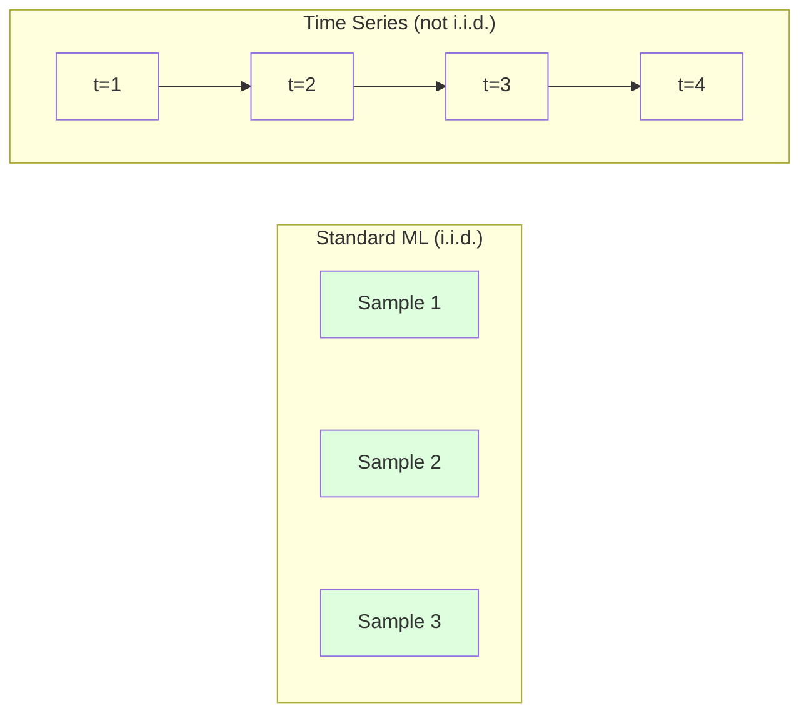
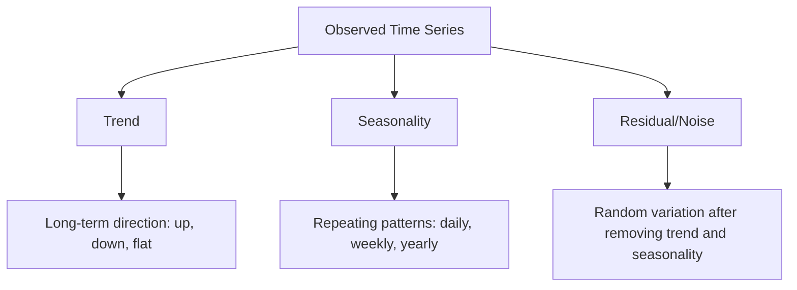
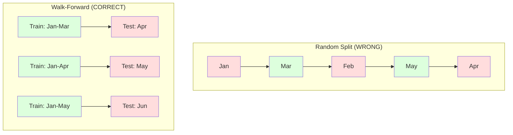

# 시계열 기초

> 과거 성과는 미래 결과를 예측합니다 — 먼저 정상성을 확인한다면.

**유형:** 빌드
**언어:** Python
**선수 과목:** Phase 2, Lessons 01-09
**소요 시간:** ~90분

## 학습 목표

- 시계열을 추세, 계절성, 잔차 성분으로 분해하고 정상성 검정하기
- 지연 특성과 이동 통계량으로 시계열을 지도 학습 문제로 변환하기
- 미래 데이터가 훈련으로 누수되는 것을 방지하는 전진 검증 프레임워크 구축
- 시계열에 무작위 분할이 유효하지 않은 이유 설명, 적절한 시간적 분할과의 성능 차이 시연

## 문제

시간 순서로 정렬된 데이터가 있습니다. 일일 판매량, 시간별 온도, 분별 CPU 사용량, 주간 주가. 다음 값, 다음 주, 다음 분기를 예측하고 싶습니다.

표준 ML 도구(무작위 훈련/테스트 분할, 교차 검증, 특성 행렬 입력, 예측 출력)를 사용합니다. 모든 단계가 틀립니다.

시계열은 표준 ML이 의존하는 가정을 깨뜨립니다. 샘플이 독립적이지 않습니다 -- 오늘의 온도는 어제의 온도에依赖합니다. 무작위 분할은 미래 정보를 과거로 누수합니다. 백테스트에서 훌륭해 보였던 특성은 시간이 지나면서 변화하는 패턴에依赖하기 때문에 프로덕션에서 실패합니다.

무작위 교차 검증으로 95% 정확도를 얻는 모델이 적절한 시간 기반 평가로 55%를 얻을 수 있습니다. 이 차이는 기술적 문제가 아닙니다. 종이 위에서 작동하는 모델과 프로덕션에서 작동하는 모델의 차이입니다.

이 수업은 기반을 다룹니다: 시간 데이터가 다른 이유, 모델을 정직하게 평가하는 방법, 표준 ML 모델이消費할 수 있는 특성으로 시계열을 변환하는 방법.

## 개념

### 시계열이 다른 이유

표준 ML은 i.i.d.를 가정합니다 -- independent and identically distributed. 각 샘플이 동일한 분포에서drawn되고, 다른 샘플에 독립적입니다. 시계열은 둘 다 위반합니다:

- **독립적이지 않음.** 오늘의 주가는 어제에依存합니다. 이번 주 판매량은 지난 주와 상관됩니다.
- **동일하게 분포되지 않음.** 분포가 시간이 지나면서 변화합니다. 12월 판매량은 3월 판매량과 다릅니다.

이러한 위반은 사소하지 않습니다. 특성을 구축하는 방식, 모델을 평가하는 방식, 어떤 알고리즘이 작동하는지를 변경합니다.



표준 ML에서 샘플은 교환 가능합니다. 它们를 섞어도 아무것도 변경되지 않습니다. 시계열에서 순서는すべてです. 섞으면 신호가destroyされます.

### 시계열의 구성 요소

모든 시계열은 다음의 조합입니다:



- **추세**: 장기 방향. 연 10% 성장하는 수익률. 상승하는 지구 온도.
- **계절성**: 고정 간격으로 반복되는 패턴. 12월 소매 판매량 급증. 7월 에어컨 사용량 정점.
- **잔차**: 추세와 계절성을 제거한 후 남는 것. 잔차가白ノイズ처럼 보이면 분해가 신호를 포착한 것입니다.

### 정상성

시계열의 통계적 속성(평균, 분산, 자기상관)이 시간이 지나도변하지 않으면 정상입니다. 대부분의 예측 방법이 정상성을 가정합니다.

**왜 중요한지:** 비정상 시리즈는 드리프트하는 평균을 가집니다. 1월 데이터에서 훈련된 모델은 2월이 보여줄 것보다 다른 평균을 학습했습니다. 그것은 체계적으로 틀릴 것입니다.

**확인 방법:** 이동 평균과 이동 표준 편차를 창에서 계산합니다. 它们가 드리프트하면 시리즈가 비정상입니다.

**수정 방법:** 차분. 원시 값이 아니라 연속 값 간의 변경을 모델링합니다:

```
diff[t] = value[t] - value[t-1]
```

한 번의 차분으로 시리즈가 정상하지 않으면 다시 적용합니다(2차 차분). 대부분의 실제 시리즈는 최대 2라운드가 필요합니다.

**예시:**

원시 시리즈: [100, 102, 106, 112, 120]
1차 차분:  [2, 4, 6, 8] (여전히 위로 trending)
2차 차분:  [2, 2, 2] (일정 -- 정상)

원시 시리즈는 이차 추세가 있었습니다. 1차 차분은 그것을 선형 추세로 전환했습니다. 2차 차분은 그것을 평평하게 만들었습니다. 실제로는 2라운드 이상을 필요로することは 드뭅니다.

**형식적 검정:** Augmented Dickey-Fuller (ADF) 검정은 정상성에 대한 표준 통계 검정입니다. 귀무仮説는 "시리즈가 비정상입니다"입니다. p값이 0.05 미만이면 귀무仮説를 기각하고 정상성을 결론낼 수 있습니다. ADF를 처음부터 구현하지 않습니다(점근적 분포 테이블이 필요합니다). 그러나 코드에서 이동 통계량 접근법이实用的 시각적 검사를 제공합니다.

### 자기상관

자기상관은 시간 t의 값이 시간 t-k(k 단계 전)의 값과 얼마나 상관되는지를 측정합니다. 자기상관 함수(ACF)는 각 지연 k에 대한 이 상관을 플롯합니다.

**ACF가 알려주는 것:**
- 시리즈가 얼마나 멀리까지 기억하는지. ACF가 지연 5 후에 0이 되면, 5단계 이상 전의 값은 무관합니다.
- 계절성이 있는지. ACF가 지연 12에서 spike(월별 데이터)하면 연간 계절성이 있습니다.
- 몇 개의 지연 특성을 만들어야 하는지. ACF가 무시할 수 없을 때까지의 지연까지 사용합니다.

**PACF(偏自己相関関数)**는 간접 상관을 제거합니다. 오늘이 어제와 상관되어 있기 때문에 3일 전과만 상관되면, 지연 3에서의 PACF는 0이지만 ACF는 그렇지 않습니다.

### 지연 특성: 시계열을 지도 학습으로 변환

표준 ML 모델은 특성 행렬 X와 대상 y가 필요합니다. 시계열은 단일 값 열을 제공합니다. 다리는 지연 특성입니다.

 시리즈 [10, 12, 14, 13, 15]를 가져와서 지연-1 및 지연-2 특성을 만듭니다:

| lag_2 | lag_1 | target |
|-------|-------|--------|
| 10    | 12    | 14     |
| 12    | 14    | 13     |
| 14    | 13    | 15     |

이제 표준 회귀 문제가 있습니다. Any ML 모델(선형 회귀, 랜덤 포레스트, 그래디언트 부스팅)이 지연에서 대상을 예측할 수 있습니다.

엔지니어링할 수 있는 추가 특성:
- **이동 통계:** 마지막 k 값의 평균, 표준편차, 최솟값, 최대값
- **달력 특성:** 요일, 월, 공휴일 여부, 주말 여부
- **차분 값:** 이전 단계에서의 변경
- **확장 통계:** 누적 평균, 누적 합계
- **비율 특성:** 현재 값 / 이동 평균 (최근 평균에서 얼마나 떨어져 있는지)
- **상호작용 특성:** lag_1 * day_of_week (모멘텀에 대한 요일 효과)

**얼마나 많은 지연?** 자기상관 함수를 사용합니다. ACF가 지연 10까지 유의미하면 최소 10개의 지연을 사용합니다. 주간 계절성이 있으면 지연 7을 포함합니다(가능하면 14도). 더 많은 지연이 모델에 더 많은 기록을 제공하지만 또한 피팅할 특성도 더 많이 제공하여 과적합 위험을 증가시킵니다.

**대상 정렬 함정.** 지연 특성을 만들 때 대상은 시간 t의 값이어야 하며, 모든 특성은 시간 t-1 이하의 값을 사용해야 합니다. 실수로 시간 t의 값을 특성으로 포함하면 완벽한 예측 변수를 가지게 됩니다 -- 그리고完全に 유용하지 않은 모델. 이것이 시계열 특성 엔지니어링에서 가장 일반적인 버그입니다.

### 전진 검증

이것이 이 수업에서 가장 중요한 개념입니다. 표준 k-폴드 교차 검증은 무작위로 샘플을 훈련 및 테스트에 할당합니다. 시계열의 경우 이것은 미래 정보를 누수합니다.



전진 검증:
1. 시간 t까지의 데이터로 훈련
2. 시간 t+1에서 예측 (또는 multi-step의 경우 t+1 ~ t+k)
3. 창을 앞으로 밀기
4. 반복

각 테스트 폴드는 모든 훈련 데이터 다음에 오는 데이터만 포함합니다. 미래 누수 없음. 이것은 배포될 때 모델이 어떻게 수행될지에 대한 정직한 추정을 제공합니다.

**확장 창**은 훈련에 모든 이력 데이터를 사용합니다(창이 증가). **슬라이딩 창**은 고정 크기 훈련 창을 사용합니다(창이 밀림). 오래된 데이터가 여전히 관련성이 있다고 믿으면 확장을 사용합니다. 세계가变化하고 오래된 데이터가 해르면 슬라이딩을 사용합니다.

### ARIMA 직관

ARIMA는 클래식 시계열 모델입니다. 세 가지 구성 요소가 있습니다:

- **AR (자기회귀):** 과거 값에서 예측. AR(p)는 마지막 p 값을 사용합니다.
- **I (차분):** 정상성을 달성하기 위한 차분. I(d)는 d 라운드의 차분을 적용합니다.
- **MA (이동평균):** 과거 예측 오류에서 예측. MA(q)는 마지막 q 오류를 사용합니다.

ARIMA(p, d, q)는 세 가지를 결합합니다. ACF/PACF 분석 또는 자동 검색(auto-ARIMA)에 따라 p, d, q를 선택합니다.

이 수업의 범위를 넘어서는 수치적 최적화가 필요하므로 ARIMA를 처음부터 구현하지 않습니다. 핵심 통찰은 각 구성 요소가 하는 일을 이해하여 ARIMA 결과를 해석하고 언제 사용할지 알 수 있도록 하는 것입니다.

### 언제 무엇을 사용할지

| 접근법 | 최적 | 계절성 처리 | 외부 특성 처리 |
|--------|------|-------------|----------------|
| 지연 특성 + ML | 많은 외부 특성이 있는 테이블 | 달력 특성으로 | 예 |
| ARIMA | 단일 일변량 시리즈, 단기 | SARIMA 변형 | 제한적 (ARIMAX) |
| 지수 평활 | 단순 추세 + 계절성 | 예 (Holt-Winters) | 아니오 |
| Prophet | 비즈니스 예측, 공휴일 | 예 (푸리에 항) | 제한적 |
| 신경망 (LSTM, Transformer) | 긴 시퀀스, 많은 시리즈 | 학습됨 | 예 |

대부분의实际问题에 대해 지연 특성 + 그래디언트 부스팅이 가장 강력한 시작점입니다. 외부 특성을 자연스럽게 처리하고, 정상성을必要로 하지 않으며, 디버깅이 쉽습니다.

### 예측 수평선 및 전략

단일 단계 예측은 한 시간 단계를 예측합니다. 다단계 예측은 여러 단계를 예측합니다. 세 가지 전략이 있습니다:

**재귀적(반복):** 한 단계 ahead를 예측하고, 다음 단계의 입력으로 예측을 사용합니다. 간단하지만 오류가 누적됩니다 -- 각 예측이 이전 예측을 사용하여 실수가 복합됩니다.

**직접:** 각 수평선에 대해 별도의 모델을 훈련합니다. Model-1은 t+1을 예측하고, Model-5는 t+5를 예측합니다. 오류 누적이 없지만 각 모델의 훈련 샘플이 적고 정보를共有하지 않습니다.

**다중 출력:** 모든 수평선을 동시에 출력하는 하나의 모델을 훈련합니다. 수평선 전반에 정보를 공유하지만 다중 출력을 지원하는 모델(또는 커스텀 손실 함수)이 필요합니다.

대부분의实际问题에 대해 짧은 수평선(1-5 단계)에는 재귀적으로 시작하고 더 긴 수평선에는 직접 사용합니다.

### 시계열의 일반적인 실수

| 실수 | 왜 발생하는지 | 수정 방법 |
|------|---------------|-----------|
| 무작위 훈련/테스트 분할 | 표준 ML의 습관 | 전진 또는 시간 분할 사용 |
| 미래 특성 사용 | 실수로 시간 t의 특성이 포함됨 | 모든 특성의 시간 정렬 감사 |
| 계절성에 과적합 | 모델이 달력 패턴을 기억 | 테스트 세트에서 전체 계절 주기 유지 |
| 규모 변화 무시 | 수익이 doubled되지만 패턴은 유지 | 절대值 대신 비율 변경 모델링 |
| 너무 많은 지연 특성 | "더 많은 이력이 더 낫다" | ACF를 사용하여 관련 지연 결정 |
| 차분하지 않음 | "모델이 알아서 할 것이다" | 트리 모델은 추세를 처리; 선형 모델은 정상성 필요 |

## 빌드

`code/time_series.py`의 코드는 핵심 빌딩 블록을 처음부터 구현합니다.

### 지연 특성 생성기

```python
def make_lag_features(series, n_lags):
    n = len(series)
    X = np.full((n, n_lags), np.nan)
    for lag in range(1, n_lags + 1):
        X[lag:, lag - 1] = series[:-lag]
    valid = ~np.isnan(X).any(axis=1)
    return X[valid], series[valid]
```

이것은 1D 시리즈를 특성 행렬로 변환합니다. 여기서 각 행은 마지막 `n_lags` 값을 특성으로, 현재 값을 대상으로 합니다.

### 전진 교차 검증

```python
def walk_forward_split(n_samples, n_splits=5, min_train=50):
    assert min_train < n_samples, "min_train must be less than n_samples"
    step = max(1, (n_samples - min_train) // n_splits)
    for i in range(n_splits):
        train_end = min_train + i * step
        test_end = min(train_end + step, n_samples)
        if train_end >= n_samples:
            break
        yield slice(0, train_end), slice(train_end, test_end)
```

각 분할은 훈련 데이터가 테스트 데이터보다严格하게 앞에 오는 것을 보장합니다. 훈련 창이 각 폴드로 확장됩니다.

### 단순 자기회귀 모델

순수 AR 모델은 지연 특성에 대한 선형 회귀일 뿐입니다:

```python
class SimpleAR:
    def __init__(self, n_lags=5):
        self.n_lags = n_lags
        self.weights = None
        self.bias = None

    def fit(self, series):
        X, y = make_lag_features(series, self.n_lags)
        # 정규 방정식으로求解
        X_b = np.column_stack([np.ones(len(X)), X])
        theta = np.linalg.lstsq(X_b, y, rcond=None)[0]
        self.bias = theta[0]
        self.weights = theta[1:]
        return self
```

이것은 개념적으로 Lesson 02의 선형 회귀와 동일하지만 동일한 변수의 시간 지연 버전에 적용됩니다.

### 정상성 검사

코드는 이동 통계를 계산하여 시각적 및 수치적으로 정상성을 평가합니다:

```python
def check_stationarity(series, window=50):
    rolling_mean = np.array([
        series[max(0, i - window):i].mean()
        for i in range(1, len(series) + 1)
    ])
    rolling_std = np.array([
        series[max(0, i - window):i].std()
        for i in range(1, len(series) + 1)
    ])
    return rolling_mean, rolling_std
```

이동 평균이 드리프트하거나 이동 표준 편차가变化하면 시리즈가 비정상입니다. 차분을 적용하고 다시 확인합니다.

코드는 또한 시리즈의 첫 번째 절반과 두 번째 절반을 비교하여 정상성을 检查합니다. 평균이 표준 편차의 절반 이상 다르거나 분산比为 2x를 초과하면 시리즈가 비정상으로 플래그됩니다.

### 자기상관

```python
def autocorrelation(series, max_lag=20):
    n = len(series)
    mean = series.mean()
    var = series.var()
    acf = np.zeros(max_lag + 1)
    for k in range(max_lag + 1):
        cov = np.mean((series[:n-k] - mean) * (series[k:] - mean))
        acf[k] = cov / var if var > 0 else 0
    return acf
```

## 활용

sklearn과 함께 지연 특성을 직접 any 회귀기와 함께 사용합니다:

```python
from sklearn.linear_model import Ridge
from sklearn.ensemble import GradientBoostingRegressor

X, y = make_lag_features(series, n_lags=10)

for train_idx, test_idx in walk_forward_split(len(X)):
    model = Ridge(alpha=1.0)
    model.fit(X[train_idx], y[train_idx])
    predictions = model.predict(X[test_idx])
```

ARIMA의 경우 statsmodels를 사용합니다:

```python
from statsmodels.tsa.arima.model import ARIMA

model = ARIMA(train_series, order=(5, 1, 2))
fitted = model.fit()
forecast = fitted.forecast(steps=30)
```

`time_series.py`의 코드는 두 접근법을 모두演示하고 전진 검증을 사용하여 비교합니다.

### sklearn TimeSeriesSplit

sklearn은 전진 검증을 구현하는 `TimeSeriesSplit`을 제공합니다:

```python
from sklearn.model_selection import TimeSeriesSplit

tscv = TimeSeriesSplit(n_splits=5)
for train_index, test_index in tscv.split(X):
    X_train, X_test = X[train_index], X[test_index]
    y_train, y_test = y[train_index], y[test_index]
    model.fit(X_train, y_train)
    score = model.score(X_test, y_test)
```

이것은 처음부터 작성한 `walk_forward_split`과 동일하지만 sklearn의 교차 검증 프레임워크에 통합되었습니다. `cross_val_score`와 함께 사용할 수 있습니다:

```python
from sklearn.model_selection import cross_val_score

scores = cross_val_score(model, X, y, cv=TimeSeriesSplit(n_splits=5))
print(f"Mean score: {scores.mean():.4f} +/- {scores.std():.4f}")
```

### 평가 지표

시계열 예측은 회귀 지표를 사용하지만 시간 인식 컨텍스트가 있습니다:

- **MAE (평균 절대 오차):** |y_true - y_pred|의 평균. 원래 단위에서 해석하기 쉽습니다. "평균적으로 예측이 3.2도 벗어납니다."
- **RMSE (제곱 평균 제곱근 오차):** 평균 제곱 오차의 제곱근. 큰 오류를 MAE보다 더 페널티합니다. 많은 작은 오류보다 큰 오류가 더 나쁜 경우 사용합니다.
- **MAPE (평균 절대 백분율 오차):** |error / true_value| * 100의 평균. 규모에 독립적이어서 서로 다른 시리즈를 비교하는 데 유용합니다. 하지만 진짜 값이 0일 때 정의되지 않습니다.
- **순진한 기준선 비교:** 항상 단순한 기준선과 비교합니다. 계절적 순진한 기준선은 한 기간 전(어제, 지난 주)의 값을 예측합니다. 모델이 순진을 이기지 못하면 무언가 잘못된 것입니다.

### 이동 특성

코드는 지연 특성에 이동 통계(7일 및 14일 창에서 평균, 표준편차, 최솟값, 최대값)를 추가하는 방법을演示합니다. 이것은 모델에 지연 특성만으로는 캡처할 수 없는 최근 추세와 변동성에 대한 정보를 제공합니다.

예를 들어 이동 평균이上升하면 상승 추세를 시사합니다. 이동 표준 편차가 증가하면 변동성이 커지고 있음을 시사합니다. 트리 기반 모델이 학습할 수 있지만 선형 모델은 학습할 수 없는 종류의 패턴입니다.

## 결과물

이 수업은 다음을 생성합니다:
- `outputs/prompt-time-series-advisor.md` -- 시계열 문제를 프레이밍하기 위한 프롬프트
- `code/time_series.py` -- 지연 특성, 전진 검증, AR 모델, 정상성 검사

### 반드시 이겨야 하는 기준선

모델을 구축하기 전에 기준선을 설정합니다:

1. **마지막 값 (지속성).** 내일이 오늘과 동일할 것이라 예측합니다. 많은 시리즈에서 이것은 놀랍도록이기 어렵습니다.
2. **계절적 순진.** 오늘이 지난 주(또는去年的) 같은 날과 동일할 것이라 예측합니다. 모델이 이를 이기지 못하면 계절성을 넘어有用的 패턴을 학습하지 않은 것입니다.
3. **이동 평균.** 마지막 k 값의 평균을 예측합니다. 노이즈를 평활하게 하지만 급격한 변경을 캡처할 수 없습니다.

판타지 ML 모델이 계절적 순진한 기준선을지면 버그가 있는 것입니다. 가장 일반적인: 특성에서의 미래 누수, 잘못된 평가 방법, 또는 시리즈가 진짜로 무작위이고 예측할 수 없습니다.

### 실용적 팁

1. **플롯으로 시작.** 모델링 전, 원시 시리즈를 플롯합니다. 추세, 계절성, 이상값, 구조적 중단(행동의突如其来的 변경)을 찾습니다. 30초의 시각적 검사가 종종 1시간의 자동화된 분석보다 더 많이 알려줍니다.

2. **차분 먼저, 모델 둘째.** 시리즈에明確な 추세가 있으면 지연 특성을 만들기 전에 차분합니다. 트리 기반 모델은 추세를 처리할 수 있지만 선형 모델은 처리할 수 없으며, 차분은 해르지 않습니다.

3. **테스트 세트에 최소한 하나의 전체 계절 주기를 유지합니다.** 주간 계절성이 있으면 테스트 세트에 최소한 전체 주가 필요합니다. 월별이면 최소한 전체 월이 필요합니다. 그렇지 않으면 모델이 계절적 패턴을 캡처했는지 평가할 수 없습니다.

4. **프로덕션에서 모니터링.** 시계열 모델은 세계가变化함에 따라 시간이 지나면서 저하됩니다. 롤링 기반으로 예측 오차를 추적합니다. 오차가 증가하기 시작하면 최근 데이터로 모델을 재훈련합니다.

5. **체제 변경을 경계합니다.** 팬데믹 이전 데이터로 훈련된 모델은 팬데믹 이후 행동을 예측하지 못합니다. 알려진 체제 변경의 지표를 특성으로 포함하거나 오래된 데이터를 잊는 슬라이딩 창을 사용합니다.

6. **치우친 시리즈에 로그 변환.** 수익, 가격, 카운트는 Often 오른쪽으로 치우칩니다. 로그를 취하면 분산을 안정시키고 승법적 패턴을 가법적으로 만들어 선형 모델이 처리할 수 있습니다. 로그 공간에서 예측한 다음 지수화하여 원래 단위로 돌아갑니다.

## 연습 문제

1. **정상성 실험.** 선형 추세가 있는 시리즈를 생성합니다. 이동 통계로 정상성을 확인합니다. 1차 차분을 적용합니다. 다시 확인합니다. 이차 추구에 몇 라운드의 차분이 필요합니까?

2. **지연 선택.** 계절성 시리즈(기간=7)에서 ACF를 계산합니다. 어떤 지연이 가장 높은 자기상관을 가집니까? 연속 지연이 아닌 those lags만 사용하여 지연 특성을 만듭니다. 지연 1~7을 사용하는 것 대비 정확도가 개선됨니까?

3. **전진 vs 무작위 분할.** 지연 특성에서 Ridge 회귀를 훈련합니다. 무작위 80/20 분할과 전진 검증을 사용하여 평가합니다. 무작위 분할이 성능을 얼마나 overestimation합니까?

4. **특성 엔지니어링.** 지연 특성에 이동 평균(창=7), 이동 표준편차(창=7), 요일 특성을 추가합니다. 전진 검증을 사용하여 이러한 추가 항목의 유무에 따라 정확도를 비교합니다.

5. **다단계 예측.** AR 모델을 수정하여 5단계 ahead 대신 1단을 예측합니다. 두 가지 전략을 비교합니다: (a) 한 단계를 예측하고 다음 단계의 입력으로 예측을 사용(재귀), (b) 각 수평선에 대해 별도의 모델을 훈련(직접). 어느 것이 더 정확합니까?

## 핵심 용어

| 용어 | 사람들이 말하는 것 | 실제 의미 |
|------|----------------|----------------------|
| 정상성 | "통계가 시간에 따라 변하지 않음" | 평균, 분산, 자기상관 구조가 시간에 따라 일정한 시리즈 |
| 차분 | "연속 값 빼기" | 추세를 제거하고 정상성을 달성하기 위해 y[t] - y[t-1] 계산 |
| 자기상관 (ACF) | "시리즈가 자체와 상관되는 방식" | 지연의 함수로서 시계열과 자체의 지연된 복사본 간의 상관관계 |
| 편자기상관 (PACF) | "직접 상관만" | 더 짧은 지연의 효과를 제거한 후 지연 k에서의 자기상관 |
| 지연 특성 | "과거 값을 입력으로" | y[t]를 예측하기 위해 y[t-1], y[t-2], ..., y[t-k]를 특성으로 사용 |
| 전진 검증 | "시간을 존중하는 교차 검증" | 훈련 데이터가 테스트 데이터보다 chronologically 앞서야 하는 평가 |
| ARIMA | "클래식 시계열 모델" | AutoRegressive Integrated Moving Average: 과거 값(AR), 차분(I), 과거 오차(MA)를 결합 |
| 계절성 | "반복 달력 패턴" | 달력 기간(매일, 매주, 매년)에 연결된 시계열의 규칙적이고 예측 가능한 사이클 |
| 추세 | "장기 방향" | 시간에 따른 시리즈 수준의 지속적인 증가 또는 감소 |
| 확장 창 | "모든 이력 사용" | 각 폴드로 훈련 세트가 증가하는 전진 검증 |
| 슬라이딩 창 | "고정 크기 이력" | 앞으로 밀리는 고정 길이 창인 전진 검증 |

## 추가 자료

- [Hyndman and Athanasopoulos, Forecasting: Principles and Practice (3rd ed.)](https://otexts.com/fpp3/) -- 시계열 예측에 대한 최상의 무료 교과서
- [scikit-learn Time Series Split](https://scikit-learn.org/stable/modules/generated/sklearn.model_selection.TimeSeriesSplit.html) -- sklearn의 전진 분할기
- [statsmodels ARIMA docs](https://www.statsmodels.org/stable/generated/statsmodels.tsa.arima.model.ARIMA.html) -- 진단과 함께한 ARIMA 구현