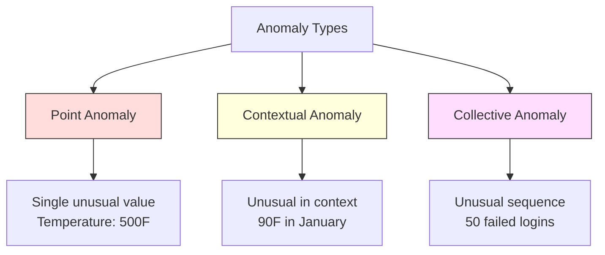
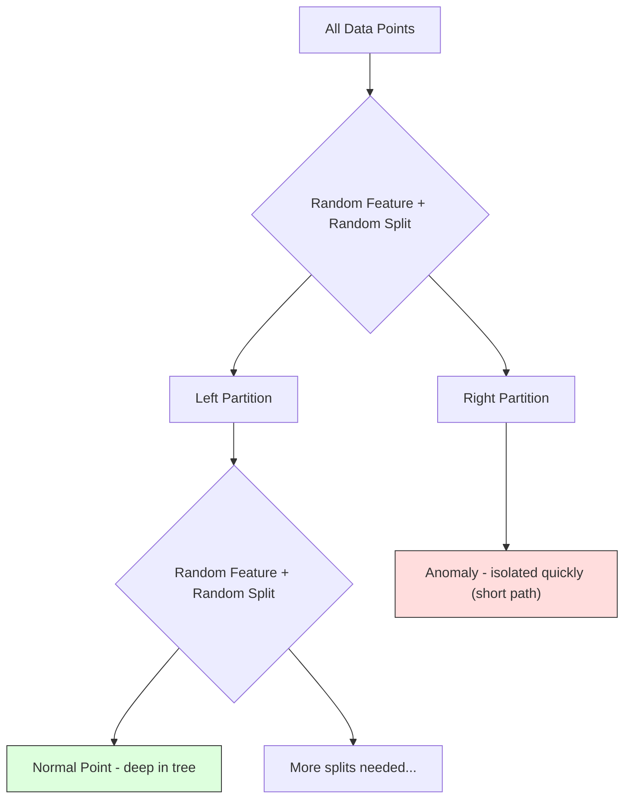
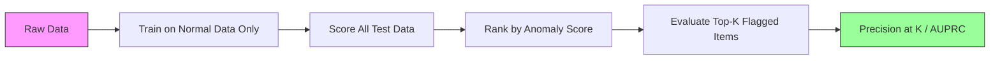

# 이상 탐지

> 정상은 정의하기 쉽습니다. 비정상이는 맞지 않는 모든 것입니다.

**유형:** 빌드
**언어:** Python
**선수 과목:** Phase 2, Lessons 01-09
**소요 시간:** ~75분

## 학습 목표

- Z-점수, IQR, 고립 포레스트 이상 탐지 방법을 처음부터 구현하기
- 점 이상, 맥락 이상, 집단 이상을 구분하고 각각에 적절한 탐지 방법 선택
- 이상 탐지가 이상 분류보다 정상 데이터 모델링으로 구성되는 이유 설명
- 비지도 이상 탐지와 지도 분류를 비교하고 새로운 이상 커버리지와 정밀도 간의 트레이드오프 평가

## 문제

신용카드가 오후 2시에 뉴욕에서 사용된 후 오후 2:05에 도쿄에서 사용됩니다. 공장 센서가 정상 범위(80-120)일 때 150도를 읽습니다. 서버가 일일 평균이 200일 때 초당 50,000개의 요청을 보냅니다.

이것들은 이상입니다. 그것들을 찾는 것이 중요합니다. 사기는 수십억 달러를 줍니다. 장비 고장은 가동 중지를 줍니다. 네트워크 침입은 데이터를 줍니다.

도전: 이상 레이블 예제가 거의 없습니다. 사기는 거래의 0.1%를 차지합니다. 장비 고장은每年 몇 번 발생합니다. "이상" 클래스에 학습할 거의 것이 없으므로 표준 분류기를 훈련할 수 없습니다. 약간의 레이블이 있더라도 본 이상은 마주칠 유일한 유형이 아닙니다. 내일의 사기 시도는 오늘과 다르게 보입니다.

이상 탐지는 문제를 뒤집습니다. 비정상인 것을 학습하는 대신 정상인 것을 학습합니다. 정상에서 벗어나는 것은 모두 의심스럽습니다. 이것은 레이블 없이 작동하고, 새로운 유형의 이상에 적응하며, 대규모 데이터셋으로 확장됩니다.

## 개념

### 이상의 유형

모든 이상이 동일한 것은 아닙니다:

- **점 이상.** 맥락에 관계없이 비정상적인 단일 데이터 포인트. 500도의 온도 읽기. 일반적으로 $50을 지출하는 계정에서 $50,000의 거래.
- **맥락 이상.** 맥락에 따라 비정상적인 데이터 포인트. 90도의 온도는 여름에는 정상이고 겨울에는 비정상입니다. 동일한 값, 다른 맥락.
- **집단 이상.** 개별적일 때는 모두 정상일 수 있지만 그룹으로 비정상적인 데이터 포인트 시퀀스. 5번의 로그인 실패는 정상입니다. 50번 연속은 무차별 대입 공격입니다.

대부분의 방법은 점 이상을 탐지합니다. 맥락 이상은 시간 또는 위치 특성이 필요합니다. 집단 이상은 시퀀스를 인식하는 방법이 필요합니다.



### 비지도 프레이밍

표준 분류에서 두 클래스에 대한 레이블이 있습니다. 이상 탐지에서通常 세 가지 상황 중 하나가 있습니다:

1. **완전 비지도.** 레이블이 전혀 없습니다. 감지기를 모든 데이터에 적합시키고 이상은 정상 모델을 손상시킬 정도로 희소하다고 희망합니다.
2. **반지도.** 정상 데이터만으로된 깨끗한 데이터셋이 있습니다. 이 깨끗은 세트에 적합시키고 다른 모든 것에 점수를 매깁니다. 가능하다면 가장 강한 설정입니다.
3. **약지도.** 몇 개의 레이블이 있는 이상. 평가에 사용하고 훈련에는 사용하지 않습니다. 비지도로 훈련한 다음 레이블이 있는 부분에서 정밀도/재현율을 측정합니다.

핵심 통찰: 이상 탐지는 분류와 근본적으로 다릅니다. 두 클래스 간의 결정 경계를 모델링하는 것이 아니라 정상 데이터의 분포를 모델링합니다.

### 지도 vs 비지도: 트레이드오프

레이블이 있는 이상을 가지고 있다면, 훈련에 사용해야 합니까(지도 분류) 아니면 평가에만 사용해야 합니까(비지도 탐지)?

**지도 (분류로 취급):**
- 이전에 본 정확한 유형의 이상을 포착합니다
- 알려진 이상 유형에서 더 높은 정밀도
- 새로운 이상 유형을完全적으로 놓칩니다
- 새로운 이상 유형이 나타나면 재훈련 필요
- 충분한 이상 예제가 필요합니다 (Often 너무 적음)

**비지도 (정상 모델링, 편차 플래그):**
- 새로운 유형을 포함하여 정상からの 모든 편차를 포착합니다
- 레이블이 있는 이상 불필요
- 더 높은 위양성률 (모든 비정상적인 것이 나쁜 것은 아닙니다)
- 분포 이동에 더 강건합니다

실제로 최고의 시스템은 둘을 결합합니다: 광범위한 커버리를 위한 비지도 탐지, 알려진 고_PRIORITY 이상 유형을 위한 지도 모델, 모호한 경우를 위한 인적 검토.

### Z-점수 방법

가장 간단한 접근법. 각 특성의 평균과 표준 편차를 계산합니다. 평균에서 k 표준 편차 이상離れている 모든 포인트를 플래그합니다.

```text
z_score = (x - mean) / std
anomaly if |z_score| > threshold
```

기본 임계값은 3.0입니다 (가우시안 분포에서 정상 데이터의 99.7%가 3 표준 편차 내에 있습니다).

**강점:** 간단합니다. 빠릅니다. 해석 가능합니다 ("이 값은 정상에서 4.5 표준 편차").

**약점:** 데이터가 정규 분포라고 가정합니다. 훈련 데이터의 이상값에 민감합니다 (이상값이 평균을 이동시키고 std를 부풀려 포착하기更难합니다). 다중 모드 분포에서 실패합니다.

**잘 작동하는 경우:** 데이터가 대략 종 모양인 단일 특성 모니터링. 서버 응답 시간, 제조 허용오차, 안정적인 베이스라인이 있는 센서 판독값.

**실패하는 경우:** 다중 클러스터 데이터 (다른 베이스라인 온도를 가진 두 사무실 위치), 치우친 데이터 ($1000은 드물지만 비정상적이지 않은 거래 금액), 훈련 세트에 이상값이 있는 데이터.

### IQR 방법

Z-점수보다 더 강건합니다. 평균과 표준 편차 대신 사분위 범위를 사용합니다.

```
Q1 = 25번째 백분위수
Q3 = 75번째 백분위수
IQR = Q3 - Q1
lower_bound = Q1 - factor * IQR
upper_bound = Q3 + factor * IQR
anomaly if x < lower_bound or x > upper_bound
```

기본 인수는 1.5입니다.

**강점:** 이상값에 강건합니다 (백분위수는 극단값의 영향을받지 않음). 치우친 분포에서 작동합니다. 정규성 가정 없음.

**약점:** 단변량만 (각 특성에 독립적으로 적용). 결합될 때만 비정상적인 이상을 탐지할 수 없음 (각 특성에 개별적으로 정상일 수 있지만 결합 공간에서는 비정상적인 포인트).

**실용적 참고:** IQR의 1.5 인수는 상자 그림의 수염에 해당합니다. 수염 밖의 포인트는 잠재적 이상값입니다. 1.5 대신 3.0을 사용하면 탐지기가 더 보수적입니다 (더 적은 플래그, 더 적은 위양성). 올바른 인수는 거짓 알람에 대한 허용 범위에 따라 다릅니다.

### 고립 포레스트

핵심 통찰: 이상은 적고 다릅니다. 데이터의 무작위 분할에서 이상은 격리하기更容易합니다 -- 나머지와 분리되려면 더 적은 무작위 분할이 필요합니다.



**작동 방식:**
1. 많은 무작위 트리 (고립 포레스트)를 구축합니다
2. 각 노드에서 특성의 최솟값과 최대값 사이의 무작위 특성 및 무작위 분할 값을 선택합니다
3. 모든 포인트가 분리될 때까지 (자체 리프에서) 분할을 계속합니다
4. 이상은 모든 트리에서 더 짧은 평균 경로 길이를 가집니다

**작동하는 이유:** 정상 포인트는 밀집된 영역에 있습니다. 이웃과 분리하려면 많은 무작위 분할이 필요합니다. 이상은 희소한 영역에 있습니다. 하나 또는 두 개의 무작위 분할로 격리하기에 충분합니다.

이상 점수는 모든 트리에 대한 평균 경로 길이를 기반으로 하며 무작위 이진 검색 트리의 예상 경로 길이로 정규화됩니다:

```
score(x) = 2^(-average_path_length(x) / c(n))
```

여기서 `c(n)`은 n개의 샘플에 대한 예상 경로 길이입니다. 점수 near 1은 이상입니다. 점수 near 0.5는 정상입니다. 점수 near 0은 매우 정상입니다 (밀집된 클러스터의深处).

**강점:** 분포 가정 없음. 고차원에서 작동. 잘 확장됩니다 (각 트리가 부분 집합을 사용하기 때문에 표본 크기에서 아線형). 혼합 특성 유형을 처리합니다.

**약점:** 밀집된 영역의 이상에서 어려움을 겪습니다 (마스킹 효과). 많은 특성이 무관할 때 무작위 분할이 효과적이지 않습니다.

**주요 하이퍼파라미터:**
- `n_estimators`: 트리 수. 100이면 usually 충분합니다. 더 많은 트리가 더 안정적인 점수를 주지만 더 느린 계산.
- `max_samples`: 트리당 샘플 수. 원래 논문에서 기본값은 256입니다. 더 작은 값이 개별 트리의 정확도를 낮추지만 다양성을 증가시킵니다. 부분 샘플링이 고립 포레스트를 빠르게 만드는 것입니다 -- 각 트리는 데이터의 작은 부분만 봅니다.
- `contamination`: 예상되는 이상의 분율. 임계값 설정에만 사용됩니다. 점수 자체에는 영향을 미치지 않습니다.

### Local Outlier Factor (LOF)

LOF는 포인트 주변의 지역 밀도를 이웃 주변의 밀도와 비교합니다. 밀집된 영역에 둘러싸인 희소 영역에 있는 포인트는 비정상입니다.

**작동 방식:**
1. 각 포인트에 대해 k개의 가장 가까운 이웃을 찾습니다
2. 지역 도달 가능성 밀도를 계산합니다 (이웃이 얼마나 밀집했는지)
3. 각 포인트의 밀도를 이웃의 밀도와 비교합니다
4. 포인트의 밀도가 이웃보다 훨씬 낮으면 이상치입니다

**LOF 점수:**
- LOF ~ 1.0은 이웃과 유사한 밀도 (정상)
- LOF > 1.0은 이웃보다 낮은 밀도 (잠재적 이상)
- LOF >> 1.0 (예: 2.0+)은 значительно 낮은 밀도 ( probablement 이상)

"지역" 부분이 중요합니다. 두 클러스터가 있는 데이터셋을 고려합니다: 1000개의 포인트로된 밀집된 클러스터와 50개의 포인트로된 희소한 클러스터. 희소한 클러스터 가장자리에 있는 포인트는 全全局적으로 비정상적이지 않습니다 -- 50개의 이웃이 있습니다. 그러나 직접적인 이웃이 그것보다 더 밀집하면 지역적으로 비정상입니다. LOF는 전역 메서드가 놓치는 이러한 뉘앙스를 포착합니다.

**강점:** 지역 이상을 탐지합니다 (국소적으로 비정상적인 포인트, 全全局적으로 비정상적이지 않더라도). 다양한 밀도의 클러스터에서 작동합니다.

**약점:** 큰 데이터셋에서 느립니다 (순진한 구현에서 O(n^2)). k 선택에 민감합니다.非常高 차원에서 잘 작동하지 않습니다 (거리 계산에 차원의 저주).

### 비교

| 방법 | 가정 | 속도 | 고차원 처리 | 지역 이상 탐지 |
|------|------|------|-------------|----------------|
| Z-점수 | 정규 분포 | 매우 빠름 | 예 (특성당) | 아니오 |
| IQR | 없음 (특성당) | 매우 빠름 | 예 (특성당) | 아니오 |
| 고립 포레스트 | 없음 | 빠름 | 예 | 부분적으로 |
| LOF | 거리가 의미 있음 | 느림 | Poorly | 예 |

### 평가 도전

이상 탐지기를 평가하는 것은 분류기를 평가하는 것보다 더 어렵습니다:

- **극심한 클래스 불균형.** 0.1% 이상으로 "정상"을 예측하면 99.9% 정확도가 됩니다. 정확도는 쓸모없습니다.
- **AUROC가误导적입니다.** 심한 불균형으로 AUROC가 실제 임계값에서 대부분의 이상을 놓치더라도 좋아 보일 수 있습니다.
- **더 나은 지표:** Precision@k (상위 k 플래그된 항목 중 실제 이상인지), AUPRC (정밀도-재현율 곡선 아래 면적), 고정 위양성률에서의 재현율.



### 이상 탐지 파이프라인

실제로 이상 탐지는 이 워크플로우를 따릅니다:

1. **베이스라인 데이터 수집.** 이상 이 없거나 매우 적은 기간이 이상적입니다.
2. **특성 엔지니어링.** 원시 특성 plus 파생 특성 (이동 통계, 시간 특성, 비율).
3. **감지기 훈련.** 베이스라인 데이터에 적합합니다. 모델은 "정상"이 어떤 모양인지 학습합니다.
4. **새 데이터에 점수 매기기.** 각 새 관찰은 이상 점수를 얻습니다.
5. **임계값 선택.** 점수 컷오프를 선택합니다. 이것은 사업 결정입니다: 더 높은 임계값은 더 적은 거짓 알람이지만 더 많은 놓친 이상.
6. **알림 및 조사.** 플래그된 포인트는 인적 검토 또는 자동화된 대응으로 이동합니다.
7. **피드백 수집.** 플래그된 항목이 실제 이상인지 위양성인지 기록합니다. 이 데이터를 사용하여 감지기를 평가하고 시간에 따라 임계값을 조정합니다.

파이프라인은 절대 "완료"되지 않습니다. 데이터 분포가 이동하고 새로운 이상 유형이 나타나며 임계값 조정이 필요합니다. 일회성 모델이 아닌 생동하는 시스템으로 이상 탐지를 취급합니다.

## 빌드

`code/anomaly_detection.py`의 코드는 처음부터 Z-점수, IQR, 고립 포레스트를 구현합니다.

### Z-점수 탐지기

```python
def zscore_detect(X, threshold=3.0):
    mean = X.mean(axis=0)
    std = X.std(axis=0)
    std[std == 0] = 1.0
    z = np.abs((X - mean) / std)
    return z.max(axis=1) > threshold
```

단순하고 벡터화됩니다. 모든 특성이 임계값을 초과하면 포인트를 플래그합니다.

### IQR 탐지기

```python
def iqr_detect(X, factor=1.5):
    q1 = np.percentile(X, 25, axis=0)
    q3 = np.percentile(X, 75, axis=0)
    iqr = q3 - q1
    lower = q1 - factor * iqr
    upper = q3 + factor * iqr
    return (X < lower).any(axis=1) | (X > upper).any(axis=1)
```

특성별로 IQR을 계산하고 경계 밖의 포인트를 플래그합니다.

### 고립 포레스트

핵심은 무작위 분할을 수행하고 포인트가 얼마나 빨리 고립되는지 측정하는 것입니다:

```python
class IsolationForest:
    def __init__(self, n_estimators=100, max_samples=256, contamination=0.1):
        self.n_estimators = n_estimators
        self.max_samples = max_samples
        self.contamination = contamination
        self.trees = []

    def fit(self, X):
        n = len(X)
        for _ in range(self.n_estimators):
            indices = np.random.choice(n, min(self.max_samples, n), replace=False)
            X_sample = X[indices]
            tree = self._build_tree(X_sample)
            self.trees.append(tree)
        return self

    def _build_tree(self, X):
        if len(X) <= 1:
            return {"leaf": X}
        feature_idx = np.random.randint(X.shape[1])
        min_val = X[:, feature_idx].min()
        max_val = X[:, feature_idx].max()
        if min_val == max_val:
            return {"leaf": X}
        split_val = np.random.uniform(min_val, max_val)
        left = X[X[:, feature_idx] < split_val]
        right = X[X[:, feature_idx] >= split_val]
        return {
            "feature": feature_idx,
            "split": split_val,
            "left": self._build_tree(left),
            "right": self._build_tree(right),
        }

    def path_length(self, x, tree, depth=0):
        if "leaf" in tree:
            return depth
        feature = tree["feature"]
        split = tree["split"]
        if x[feature] < split:
            return self.path_length(x, tree["left"], depth + 1)
        return self.path_length(x, tree["right"], depth + 1)

    def score(self, X):
        n = len(X)
        avg_length = np.zeros(n)
        for tree in self.trees:
            for i, x in enumerate(X):
                avg_length[i] += self.path_length(x, tree)
        avg_length /= self.n_estimators
        c = 2 * (np.log(n - 1) + 0.5772156649) - (2 * (n - 1) / n)
        scores = 2 ** (-avg_length / c)
        return scores

    def predict(self, X):
        scores = self.score(X)
        threshold = np.percentile(scores, self.contamination * 100)
        return scores < threshold
```

이것은 원래 논문의 핵심 아이디어를 구현합니다: 이상은 평균적으로 더 짧은 경로로 고립됩니다.

## 활용

sklearn과 함께:

```python
from sklearn.ensemble import IsolationForest

iso = IsolationForest(contamination=0.01, random_state=42)
iso.fit(X_train_normal_only)
predictions = iso.predict(X_test)
anomaly_scores = iso.score_samples(X_test)
```

핵심: 훈련은 정상 데이터만으로 합니다. 이상 데이터로 훈련하면 정상 모델을 손상시킵니다.

### 다중 방법 결합

실제로 가장 강력한 시스템은 여러 방법을 결합합니다:

```python
def ensemble_anomaly_detector(X, normal_data):
    z_flags = zscore_detect(X, threshold=3.0)
    iqr_flags = iqr_detect(X, factor=1.5)

    iso = IsolationForest(n_estimators=100, contamination=0.01)
    iso.fit(normal_data)
    iso_scores = iso.score(X)
    iso_flags = iso_scores < np.percentile(iso_scores, 1)

    combined_score = z_flags.astype(float) + iqr_flags.astype(float) + iso_flags.astype(float)
    return combined_score >= 2
```

세 가지 방법 중 두 가지 이상이 플래그하면 이상으로 분류합니다. 이것은 단일 방법의 오탐지를 줄입니다.

## 결과물

이 수업은 다음을 생성합니다:
- `outputs/prompt-anomaly-detector.md` -- 이상 탐지 시스템을 구축하기 위한 프롬프트
- `code/anomaly_detection.py` -- 처음부터 Z-점수, IQR, 고립 포레스트

## 연습 문제

1. **Z-점수 vs IQR.** 두方法的Implementations를 작성합니다. 표준 정규 분포, 균일 분포, 2%의 이상값이 있는 분포에서 성능을 비교합니다. IQR이 왜 더 강건합니까?

2. **마스킹 효과.** 고립 포레스트를 동일한 밀도 영역의 이상과 정상 포인트가 혼합된 데이터에 적용합니다. 모든 포인트가 정상인 것처럼 훈련하면 이상 탐지 성능이 어떻게 됩니까?

3. **고립 포레스트 분석.** 고립 포레스트의 n_estimators와 max_samples가 탐지 성능에 미치는 영향을 연구합니다. 더 많은 트리가 항상 더 나은 성능을 의미합니까?

4. **LOF 구현.** LOF(Local Outlier Factor)를 간단한 형태로 구현합니다. k=k의 선택이 결과에 미치는 영향을 조사합니다.

5. **실제 데이터.** 시계열 센서 데이터(예: 웹 서버 로그)에 이상 탐지를 적용합니다. 점 이상(급격한 스파이크)과 집단 이상(비정상적인 패턴)을 모두 탐지합니다.

## 핵심 용어

| 용어 | 사람들이 말하는 것 | 실제 의미 |
|------|----------------|----------------------|
| 점 이상 | "비정상적인 단일 값" | 맥락에 관계없이 비정상적인 단일 데이터 포인트 |
| 맥락 이상 | "맥락에서 비정상" | 맥락에 따라 비정상적인 데이터 포인트 (겨울에 90도) |
| 집단 이상 | "비정상적인 시퀀스" | 개별적일 때는 정상일 수 있지만 그룹으로 비정상적인 포인트 시퀀스 |
| 고립 포레스트 | "무작위 분할로 격리" | 이상은 더 적은 무작위 분할로 고립될 수 있다는 아이디어에 기반한 비지도 탐지 |
| LOF | "지역 밀도 비교" | 포인트의 지역 밀도를 이웃의 밀도와 비교하여 지역 이상 탐지 |
| Z-점수 | "표준화된 거리" | 평균에서 표준 편차 단위로 측정된 값 |
| IQR | "사분위 범위" | 75번째 백분위수 - 25번째 백분위수, 이상값 탐지에 사용 |
| 비지도 탐지 | "정상 학습" | 레이블 없이 정상 데이터의 분포를 학습하고 편차를 플래그 |
| 마스킹 효과 | "이상 감추기" | 많은 이상값이 서로의 탐지를 방해하는 현상 |
| 오염 | "예상 이상 비율" | 데이터에서 이상으로 예상되는 포인트의 비율, 임계값 설정에 사용 |

## 추가 자료

- [Liu et al., Isolation Forest (2008)](https://ieeexplore.ieee.org/document/4781036) -- 고립 포레스트 원래 논문
- [Breunig et al., LOF (2000)](https://www.dbs.ifi.lmu.de/Publikationen/Papers/LOF.pdf) -- Local Outlier Factor 논문
- [scikit-learn anomaly detection docs](https://scikit-learn.org/stable/modules/outlier_detection.html) -- 실용적 참조