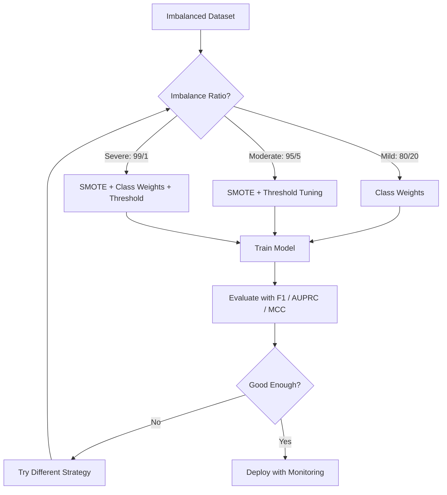
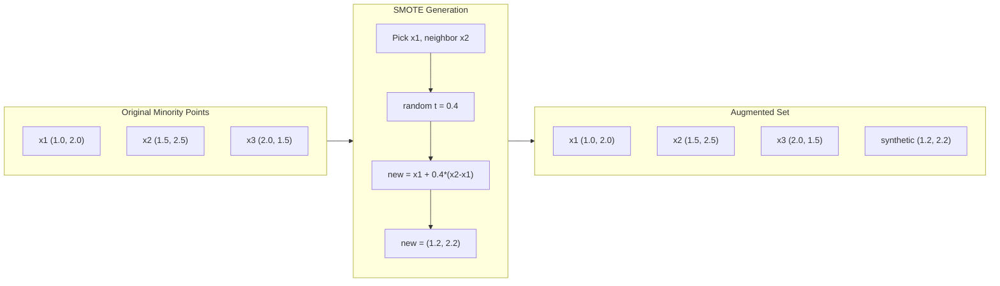
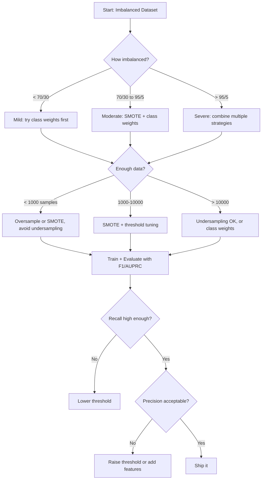

# 불균형 데이터 처리

> 데이터의 99%가 "정상"일 때, 정확도는 거짓말입니다.

**유형:** 빌드
**언어:** Python
**선수 과목:** Phase 2, Lessons 01-09 (특히 평가 지표)
**소요 시간:** ~90분

## 학습 목표

- SMOTE를 처음부터 구현하고 합성 오버샘플링이 무작위 복제와 다른 점 설명
- 정확도 대신 F1, AUPRC, 매튜 상관 계수로 불균형 분류기 평가
- 클래스 가중치, 임계값 튜닝, 리샘플링 전략을 비교하고 주어진 불균형 비율에 적합한 접근법 선택
- SMOTE, 클래스 가중치, 임계값 최적화를 결합한 완전한 불균형 데이터 파이프라인 구축

## 문제

사기 탐지 모델을 구축합니다. 99.9% 정확도를 얻습니다. 축하합니다. 그런 다음 모든 거래에 대해 "사기 아님"을 예측한다는 것을 깨닫습니다.

이것은 버그가 아닙니다. 거래의 0.1%만 사기일 때 합리적인 일입니다. 모델은 전체 오차를最小화하기 위해 항상 다수 클래스를 예측하는 것을 학습합니다. 기술적으로 정확하고 완전히 쓸모없습니다.

이것은 실제 분류가 중요한 곳 어디에서나 발생합니다. 질병 진단: 1% 양성률. 네트워크 침입: 0.01% 공격. 제조 결함: 0.5% 불량. 스팸 필터링: 20% 스팸. 이탈 예측: 5% 이탈자. 소수 클래스가 더 중요할수록 通常 더 희소합니다.

정확도가 실패하는 이유는 모든 올바른 예측을 동일하게 취급하기 때문입니다. 합법적 거래를 올바르게 레이블링하는 것과 사기를 올바르게 잡는 것이 모두 정확도의 한 점으로 계산됩니다. 하지만 사기를 잡는 것이 모델이 존재하는 전체 이유입니다. 희소하지만 중요한 클래스에 모델의 주의를 강제하는 지표, 기술, 훈련 전략이 필요합니다.

## 개념

### 왜 정확도가 실패하는가

1000개 샘플: 990개 음성, 10개 양성. 항상 음성을 예측하는 모델을 고려합니다:

|  | Predicted Positive | Predicted Negative |
|--|---|---|
| Actually Positive | 0 (TP) | 10 (FN) |
| Actually Negative | 0 (FP) | 990 (TN) |

Accuracy = (0 + 990) / 1000 = 99.0%

모델이 사기를 하나도 잡지 못합니다. 질병도 결함도 없습니다. 하지만 정확도는 99%라고 합니다. 이것이 불균형 문제에서 정확도가 위험한 이유입니다.

### 더 나은 지표

**정밀도** = TP / (TP + FP). 양성으로 플래그된 모든 것 중 실제로 양성인 것의 비율. 높으면 거짓 알람이 적습니다.

**재현율** = TP / (TP + FN). 실제로 양성인 모든 것 중 잡은 것의 비율. 높으면 놓친 양성이 적습니다.

**F1 점수** = 2 * 정밀도 * 재현율 / (정밀도 + 재현율). 조화 평균. 산술 평균보다 정밀도와 재현율의極端한 불균형을 더 페널티합니다.

**F-beta 점수** = (1 + beta^2) * 정밀도 * 재현율 / (beta^2 * 정밀도 + 재현율). beta > 1이면 재현율이 더 중요합니다. beta < 1이면 정밀도가 더 중요합니다. F2는 사기 탐지에서 일반적입니다 (사기 놓치는 것이 거짓 알람보다 더 나쁩니다).

**AUPRC** (정밀도-재현율 곡선 아래 면적). AUC-ROC와 같지만 불균형 데이터에 더 유익합니다. 무작위 분류기의 AUPRC는 양성 클래스 비율과 같습니다 (ROC의 0.5가 아닌). 이것이 개선을 더 쉽게 볼 수 있게 합니다.

**매튜 상관 계수** = (TP * TN - FP * FN) / sqrt((TP+FP)(TP+FN)(TN+FP)(TN+FN)). -1에서 +1까지 범위입니다. 두 클래스에서 모두 잘할 때만 높은 점수를 받습니다. 클래스가 매우 다른 크기여도 균형됩니다.

위의 "항상 음성 예측" 모델에 대해: 정밀도 = 0/0 (정의되지 않음, Often 0으로 설정), 재현율 = 0/10 = 0, F1 = 0, MCC = 0. 이 지표들은 모델이 가치가 없다는 것을正しく 식별합니다.

### 불균형 데이터 파이프라인



### SMOTE: 합성 소수 오버샘플링 기술

무작위 오버샘플링은 기존 소수 클래스 샘플을 복제합니다. 작동하지만 모델이 반복적으로 동일한 포인트를 보기 때문에 과적합 위험이 있습니다.

SMOTE는 복사본이 아닌 새롭고 그럴듯한 합성 소수 클래스 샘플을 생성합니다. 알고리즘:

1. 각 소수 샘플 x에 대해 다른 소수 샘플 중 k개의 가장 가까운 이웃을 찾습니다
2. 무작위로 하나의 이웃을 선택합니다
3. x와 그 이웃 사이의 선분에서 새 샘플을 생성합니다

공식: `new_sample = x + random(0, 1) * (neighbor - x)`

이것은 기존 데이터를 복사하지 않고 기능 공간의 동일한 영역에 샘플을 생성하여 소수 포인트를 보간합니다.



### 샘플링 전략 비교

**무작위 오버샘플링**: 소수 클래스 샘플을 다수 클래스 수와 일치하도록 복제.
- 장점: 간단, 정보 손실 없음
- 단점: 정확한 복제본이 과적합을 caused, 훈련 시간 증가

**무작위 언더샘플링**: 소수 클래스 수와 일치하도록 다수 클래스 샘플을 제거.
- 장점: 빠른 훈련, 간단
- 단점: 잠재적으로有用的인 다수 데이터 폐기, 더 높은 분산

**SMOTE**: 보간을 통해 합성 소수 클래스 샘플 생성.
- 장점: 새 데이터 포인트 생성, 무작위 오버샘플링 대비 과적합 감소
- 단점: 결정 경계 근처에서 노이즈 샘플 생성 가능, 다수 클래스 분포를 고려하지 않음

| 전략 | 변경된 데이터 | 위험 | 사용 시기 |
|------|-------------|------|-------------|
| 오버샘플링 | 복제된 소수 | 과적합 | 작은 데이터셋, moderate 불균형 |
| 언더샘플링 | 제거된 다수 | 정보 손실 | 큰 데이터셋, 빠른 훈련 원하는 경우 |
| SMOTE | 추가된 합성 소수 | 경계 노이즈 | moderate 불균형, k-NN에 충분한 소수 샘플 |

### 클래스 가중치

데이터를 변경하는 대신 모델이 오류를 treat하는 방식을 변경합니다. 소수 클래스 misclassifying에 더 높은 가중치를 할당합니다.

950개 음성과 50개 양성이 있는 이진 문제의 경우:
- 음성 클래스의 가중치 = n_samples / (2 * n_negative) = 1000 / (2 * 950) = 0.526
- 양성 클래스의 가중치 = n_samples / (2 * n_positive) = 1000 / (2 * 50) = 10.0

양성 클래스가 19배 높은 가중치를 가집니다. 하나의 양성 샘플을 잘못 분류하는 것이 19개의 음성 샘플을 잘못 분류하는 것과 같은 비용입니다. 모델이 소수 클래스에 주의를 기울이도록 강제됩니다.

로지스틱 회귀에서 이는 손실 함수를 수정합니다:

```
weighted_loss = -sum(w_i * [y_i * log(p_i) + (1-y_i) * log(1-p_i)])
```

여기서 w_i는 샘플 i의 클래스에 따라 다릅니다.

클래스 가중치는 기대값에서 오버샘플링과 수학적으로 동일하지만, 새로운 데이터 포인트를 생성하지 않습니다. 이것이它们更快 만들고 복제된 샘플의 과적합 위험을 피합니다.

### 임계값 튜닝

대부분의 분류기는 확률을 출력합니다. 기본 임계값은 0.5입니다: P(양성) >= 0.5이면 양성으로 예측. 하지만 0.5는任意입니다. 클래스가 불균형할 때 최적 임계값은通常 훨씬 낮습니다.

프로세스:
1. 모델 훈련
2. 검증 세트에서 예측 확률 얻기
3. 0.0에서 1.0까지 임계값 스윕
4. 각 임계값에서 F1 (또는 선택한 지표) 계산
5. 지표를 최대화하는 임계값 선택

모델이 사기 거래에 대해 P(fraud) = 0.15를 출력할 수 있습니다. 임계값 0.5에서 이것은 사기가 아닌 것으로 분류됩니다. 임계값 0.10에서 그것은 올바르게 잡힙니다. 확률 보정보다 순위가 더 중요합니다 -- 사기가 비사기보다 높은 확률을 받는 한,它们을 분리하는 임계값이 존재합니다.

### 비용 민감 학습

클래스 가중치의 일반화. 균일한 비용 대신 특정 misclassification 비용을 할당합니다:

| | 예측 양성 | 예측 음성 |
|--|---|---|
| 실제로 양성 | 0 (정답) | C_FN = 100 |
| 실제로 음성 | C_FP = 1 | 0 (정답) |

사기 거래를 놓치는 것(FN)이 거짓 알람(FP)보다 100배 더 비용이 듭니다. 모델은 총 오류 수가 아니라 총 비용을 최적화합니다.

실제 비용을 추정할 수 있을 때 가장 원칙적인 접근법입니다. 놓친 암 진단 비용은 추가 생검으로 이끄는 거짓 알람보다 매우 다릅니다. 이러한 비용을 명시적으로 하면 올바른 트레이드오프가 강제됩니다.

### 결정 흐름도



## 빌드

### 1단계: 불균형 데이터셋 생성

```python
import numpy as np


def make_imbalanced_data(n_majority=950, n_minority=50, seed=42):
    rng = np.random.RandomState(seed)

    X_maj = rng.randn(n_majority, 2) * 1.0 + np.array([0.0, 0.0])
    X_min = rng.randn(n_minority, 2) * 0.8 + np.array([2.5, 2.5])

    X = np.vstack([X_maj, X_min])
    y = np.concatenate([np.zeros(n_majority), np.ones(n_minority)])

    shuffle_idx = rng.permutation(len(y))
    return X[shuffle_idx], y[shuffle_idx]
```

### 2단계: 처음부터 SMOTE

```python
def euclidean_distance(a, b):
    return np.sqrt(np.sum((a - b) ** 2))


def find_k_neighbors(X, idx, k):
    distances = []
    for i in range(len(X)):
        if i == idx:
            continue
        d = euclidean_distance(X[idx], X[i])
        distances.append((i, d))
    distances.sort(key=lambda x: x[1])
    return [d[0] for d in distances[:k]]


def smote(X_minority, k=5, n_synthetic=100, seed=42):
    rng = np.random.RandomState(seed)
    n_samples = len(X_minority)
    k = min(k, n_samples - 1)
    synthetic = []

    for _ in range(n_synthetic):
        idx = rng.randint(0, n_samples)
        neighbors = find_k_neighbors(X_minority, idx, k)
        neighbor_idx = neighbors[rng.randint(0, len(neighbors))]
        t = rng.random()
        new_point = X_minority[idx] + t * (X_minority[neighbor_idx] - X_minority[idx])
        synthetic.append(new_point)

    return np.array(synthetic)
```

### 3단계: 무작위 오버샘플링 및 언더샘플링

```python
def random_oversample(X, y, seed=42):
    rng = np.random.RandomState(seed)
    classes, counts = np.unique(y, return_counts=True)
    max_count = counts.max()

    X_resampled = list(X)
    y_resampled = list(y)

    for cls, count in zip(classes, counts):
        if count < max_count:
            cls_indices = np.where(y == cls)[0]
            n_needed = max_count - count
            chosen = rng.choice(cls_indices, size=n_needed, replace=True)
            X_resampled.extend(X[chosen])
            y_resampled.extend(y[chosen])

    X_out = np.array(X_resampled)
    y_out = np.array(y_resampled)
    shuffle = rng.permutation(len(y_out))
    return X_out[shuffle], y_out[shuffle]


def random_undersample(X, y, seed=42):
    rng = np.random.RandomState(seed)
    classes, counts = np.unique(y, return_counts=True)
    min_count = counts.min()

    X_resampled = []
    y_resampled = []

    for cls in classes:
        cls_indices = np.where(y == cls)[0]
        chosen = rng.choice(cls_indices, size=min_count, replace=False)
        X_resampled.extend(X[chosen])
        y_resampled.extend(y[chosen])

    X_out = np.array(X_resampled)
    y_out = np.array(y_resampled)
    shuffle = rng.permutation(len(y_out))
    return X_out[shuffle], y_out[shuffle]
```

### 4단계: 클래스 가중치가 있는 로지스틱 회귀

```python
def sigmoid(z):
    return 1.0 / (1.0 + np.exp(-np.clip(z, -500, 500)))


def logistic_regression_weighted(X, y, weights, lr=0.01, epochs=200):
    n_samples, n_features = X.shape
    w = np.zeros(n_features)
    b = 0.0

    for _ in range(epochs):
        z = X @ w + b
        pred = sigmoid(z)
        error = pred - y
        weighted_error = error * weights

        gradient_w = (X.T @ weighted_error) / n_samples
        gradient_b = np.mean(weighted_error)

        w -= lr * gradient_w
        b -= lr * gradient_b

    return w, b


def compute_class_weights(y):
    classes, counts = np.unique(y, return_counts=True)
    n_samples = len(y)
    n_classes = len(classes)
    weight_map = {}
    for cls, count in zip(classes, counts):
        weight_map[cls] = n_samples / (n_classes * count)
    return np.array([weight_map[yi] for yi in y])
```

### 5단계: 임계값 튜닝

```python
def find_optimal_threshold(y_true, y_probs, metric="f1"):
    best_threshold = 0.5
    best_score = -1.0

    for threshold in np.arange(0.05, 0.96, 0.01):
        y_pred = (y_probs >= threshold).astype(int)
        tp = np.sum((y_pred == 1) & (y_true == 1))
        fp = np.sum((y_pred == 1) & (y_true == 0))
        fn = np.sum((y_pred == 0) & (y_true == 1))

        if metric == "f1":
            precision = tp / (tp + fp) if (tp + fp) > 0 else 0.0
            recall = tp / (tp + fn) if (tp + fn) > 0 else 0.0
            score = 2 * precision * recall / (precision + recall) if (precision + recall) > 0 else 0.0
        elif metric == "recall":
            score = tp / (tp + fn) if (tp + fn) > 0 else 0.0
        elif metric == "precision":
            score = tp / (tp + fp) if (tp + fp) > 0 else 0.0

        if score > best_score:
            best_score = score
            best_threshold = threshold

    return best_threshold, best_score
```

### 6단계: 평가 함수

```python
def confusion_matrix_values(y_true, y_pred):
    tp = np.sum((y_pred == 1) & (y_true == 1))
    tn = np.sum((y_pred == 0) & (y_true == 0))
    fp = np.sum((y_pred == 1) & (y_true == 0))
    fn = np.sum((y_pred == 0) & (y_true == 1))
    return tp, tn, fp, fn


def compute_metrics(y_true, y_pred):
    tp, tn, fp, fn = confusion_matrix_values(y_true, y_pred)
    accuracy = (tp + tn) / (tp + tn + fp + fn)
    precision = tp / (tp + fp) if (tp + fp) > 0 else 0.0
    recall = tp / (tp + fn) if (tp + fn) > 0 else 0.0
    f1 = 2 * precision * recall / (precision + recall) if (precision + recall) > 0 else 0.0

    denom = np.sqrt(float((tp + fp) * (tp + fn) * (tn + fp) * (tn + fn)))
    mcc = (tp * tn - fp * fn) / denom if denom > 0 else 0.0

    return {
        "accuracy": accuracy,
        "precision": precision,
        "recall": recall,
        "f1": f1,
        "mcc": mcc,
    }
```

### 7단계: 모든 접근법 비교

```python
X, y = make_imbalanced_data(950, 50, seed=42)
split = int(0.8 * len(y))
X_train, X_test = X[:split], X[split:]
y_train, y_test = y[:split], y[split:]

# Baseline: no treatment
w_base, b_base = logistic_regression_weighted(
    X_train, y_train, np.ones(len(y_train)), lr=0.1, epochs=300
)
probs_base = sigmoid(X_test @ w_base + b_base)
preds_base = (probs_base >= 0.5).astype(int)
```

## 활용

sklearn과 함께:

```python
from sklearn.linear_model import LogisticRegression
from sklearn.metrics import classification_report

# 클래스 가중치
clf = LogisticRegression(class_weight="balanced")
clf.fit(X_train, y_train)

# 사용자 정의 가중치
clf = LogisticRegression(class_weight={0: 1, 1: 20})
clf.fit(X_train, y_train)

print(classification_report(y_test, clf.predict(X_test)))
```

## 결과물

이 수업은 다음을 생성합니다:
- `outputs/prompt-imbalanced-data.md` -- 불균형 데이터 문제에 대한 프롬프트
- `code/imbalanced.py` -- 처음부터의 SMOTE, 리샘플링, 임계값 튜닝

## 연습 문제

1. **정확도의 함정.** 99% 정상, 1% 이상인 데이터셋을 생성합니다. "항상 정상 예측" 모델의 정확도, 정밀도, 재현율, F1을 계산합니다. 이것이 왜误导적인지 설명합니다.

2. **SMOTE 대 무작위 복제.** 두 접근법으로 훈련한 모델의 성능을 비교합니다. SMOTE가 왜 과적합을 줄이는지 설명합니다.

3. **임계값 스윕.** 다양한 불균형 비율에서 최적 임계값이 어떻게 변화하는지 研究합니다. 더 불균형할수록 임계값이 더 낮아집니까?

4. **클래스 가중치Experiment.** 클래스 가중치를 다양하게 설정하고 F1에 미치는 영향을 研究합니다. 균형 가중치(1:1)에서 극단적 가중치(1:100)까지 실험합니다.

5. **다양한 지표.**同一 모델을 정확도, F1, AUPRC, MCC로 평가합니다. 지표가 다른 순위를 매기는 경우를 찾습니다.

## 핵심 용어

| 용어 | 사람들이 말하는 것 | 실제 의미 |
|------|----------------|----------------------|
| 클래스 불균형 | "한 클래스가 지배적" | 한 클래스가 다른 클래스보다 훨씬 더 많은 샘플을 가짐 |
| SMOTE | "합성 샘플 생성" | 소수 클래스의 포인트 사이를 보간하여 합성 샘플을 생성하는 오버샘플링 기법 |
| 오버샘플링 | "소수 클래스 복제" | 소수 클래스 샘플을 복제하여 다수 클래스와 균형을 맞춤 |
| 언더샘플링 | "다수 클래스 제거" | 다수 클래스 샘플을 무작위로 제거하여 균형을 맞춤 |
| 클래스 가중치 | "오류에 가중치 부여" | 소수 클래스 misclassification에 더 높은 비용을 부여하여 모델이 그것에 더 주의를 기울이도록 함 |
| 임계값 튜닝 | "0.5가 최적이 아님" | 불균형 문제에서 최적의 분류 임계값을 찾기 위해 확률 임계값을 sweep |
| F1 점수 | "정밀도와 재현율의 조화 평균" | 정밀도와 재현율의 균형을 측정하는 지표 |
| AUPRC | "불균형 데이터에 더 나은 ROC 대안" | 정밀도-재현율 곡선 아래 면적으로, 불균형 문제에서 더 유익함 |
| 매튜 상관 계수 | "균형 잡힌 지표" | -1에서 +1까지, 두 클래스에서 모두 잘할 때만 높은 점수 |
| 비용 민감 학습 | "오류마다 다른 비용" | misclassification 비용이 클래스마다 다를 수 있음 |

## 추가 자료

- [Chawla et al., SMOTE (2002)](https://arxiv.org/abs/1106.1813) -- SMOTE 원래 논문
- [scikit-learn imbalanced data docs](https://scikit-learn.org/stable/modules/imbalanced.html) -- 실용적 참조
- [F1 vs AUPRC](https://www.ncbi.nlm.nih.gov/pmc/articles/PMC4349800/) -- 불균형 문제에서 올바른 지표를 선택하는 방법