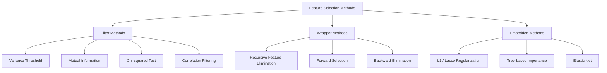
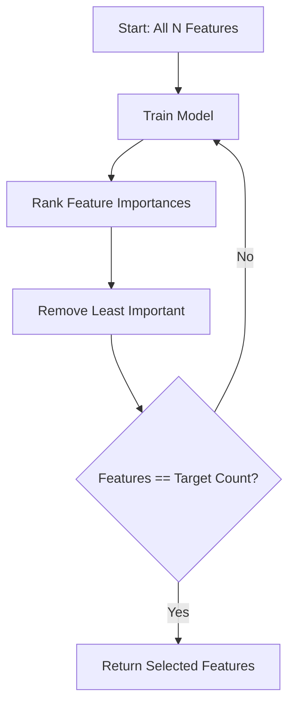
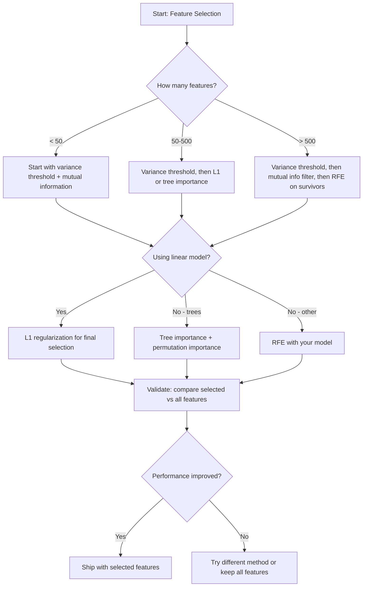

# 특성 선택

> 더 많은 특성이 더 나은 것은 아닙니다. 올바른 특성이 더 낫습니다.

**유형:** 빌드
**언어:** Python
**선수 과목:** Phase 2, Lessons 01-09, 08 (feature engineering)
**소요 시간:** ~75분

## 학습 목표

- 필터 방법(분산 임계값, 상호 정보량, 카이제곱)과 래퍼 방법(RFE, 전진 선택)을 처음부터 구현
- 상호 정보량이 상관관계가 놓치는 비선형 특성-타겟 관계를 포착하는 이유 설명
- L1 정규화(임베디드 선택)와 RFE(래퍼 선택)를 비교하고 계산 트레이드오프 평가
- 여러 방법을 결합한 특성 선택 파이프라인을 구축하고 홀드아웃 데이터에서 일반화 향상 시연

## 문제

500개의 특성이 있습니다. 모델이 느리게 훈련되고, 지속적으로 과적합되며, 아무도 그것이 무엇을 학습했는지 설명할 수 없습니다. 더 나은 성능을期望하여 더 많은 특성을 추가합니다. 더 나빠집니다.

이것은 동작에서 차원의 저주입니다. 특성 수가 증가함에 따라 특성 공간의 부피가 폭발합니다. 데이터 포인트가 희소해집니다. 포인트 간 거리가 수렴합니다. 모델은 실제 패턴을 찾기 위해 기하급수적으로 더 많은 데이터를 필요로 합니다. 노이즈 특성이 신호 특성을 drown out합니다. 과적합이 기본값이 됩니다.

특성 선택은 해독제입니다. 노이즈를 벗어냅니다. 중복을 제거합니다. 타겟에 대한 실제 정보를 담은 특성만 유지합니다. 결과: 더 빠른 훈련, 더 나은 일반화, 실제로 설명할 수 있는 모델.

목표는 모든 사용 가능한 정보를 사용하는 것이 아닙니다. 올바른 정보를 사용하는 것입니다.

## 개념

### 특성 선택의 세 가지 범주

모든 특성 선택 방법은 세 가지 범주 중 하나에 속합니다:



**필터 방법**은 통계적 측정값을 사용하여 각 특성을 독립적으로 점수 매깁니다. 모델을 사용하지 않습니다. 빠르지만 특성 상호작용을 놓칩니다.

**래퍼 방법**은 모델 성능을 사용하여 특성 부분집합을 평가합니다. 점수로 모델 성능을 사용합니다. 더 나은 결과이지만 모델을 many times 재훈련해야 하므로expensive합니다.

**임베디드 방법**은 모델 훈련의 일부로 특성을 선택합니다. L1 정규화는 가중치를 0으로 driving합니다. 결정 트리는 가장有用的な特性에서 분할합니다. 선택이 별도의 단계가 아닌 피팅 중에 발생합니다.

### 분산 임계값

가장 간단한 필터입니다. 샘플 전반에 걸쳐 특성이 거의 변하지 않으면 거의 정보를 담지 않습니다.

1000개 샘플 중 999개에서 0.0인 특성을 생각해 봅니다. 분산은几乎 영입니다. 어떤 모델도 클래스를 구분하는 데 그것을 사용할 수 없습니다. 제거합니다.

```
variance(x) = mean((x - mean(x))^2)
```

임계값(예: 0.01)을 설정합니다. 분산이 그 아래인 모든 특성을 삭제합니다. 이것은 대상 변수을 전혀 보지 않고 상수 또는 거의 상수인 특성을 제거합니다.

사용 시기: 다른 방법 이전의 전처리 단계로. 거의ゼロ成本에서明显히无用한 특성을 포착합니다.

제한: 특성이 높은 분산을 가질 수 있지만 여전히 순수 노이즈일 수 있습니다. 분산 임계값은 필요하지만 충분하지 않습니다.

### 상호 정보량

상호 정보량은 특성 X의 값을 알면 대상 Y에 대한 불확실성이 얼마나 감소하는지를 측정합니다.

```
I(X; Y) = sum_x sum_y p(x, y) * log(p(x, y) / (p(x) * p(y)))
```

X와 Y가 독립이면, p(x, y) = p(x) * p(y)이므로 로그 항은 0이고 I(X; Y) = 0입니다. X가 Y에 대해 더 많이 알려줄수록 상호 정보량이更高합니다.

상관관계보다 주요 장점: 상호 정보량은 비선형 관계를 포착합니다. 특성이 타겟과 zero 상관관계를 가질 수 있지만 관계가 2차 또는 주기적이기 때문에 높은 상호 정보량을 가질 수 있습니다.

연속 특성의 경우, 먼저 bin으로离散화합니다 (히스토그램 기반 추정). bin 수는 추정에 영향을 미칩니다 -- bin이 너무 적으면 정보가 손실되고, 너무 많으면 노이즈가 추가됩니다. 일반적인 선택: sqrt(n) bin 또는 Sturges 규칙 (1 + log2(n)).


### 재귀적 특성 제거 (RFE)

RFE는 래퍼 방법입니다. 모델 자체의 특성 중요도를 사용하여 반복적으로 pruning합니다:

1. 모든 특성으로 모델 훈련
2. 중요도로 특성 순위 매기기 (선형 모델의係数, 트리의 불순도 감소)
3. 가장 덜 중요한 특성 제거
4. 원하는 특성 수가 남을 때까지 반복



RFE는 모델이 함께 모든 나머지 특성을 보기 때문에 특성 상호작용을 고려합니다. 하나의 특성을 제거하면 다른 특성의 중요도가 변경됩니다. 이것이 필터 방법보다 더彻底적입니다.

비용: N - target번 모델을 훈련합니다. 500개 특성과目标是 10이면 490번의 훈련 실행입니다. 비싼 모델의 경우 이것이 느립니다. 각 단계에서 multiple 특성을 제거하여高速化할 수 있습니다 (예: 각 라운드에서 하위 10% 제거).

### L1 (Lasso) 정규화

L1 정규화는 손실 함수에 가중치의 절대값을 추가합니다:

```
loss = prediction_error + alpha * sum(|w_i|)
```

alpha 매개변수는 특성이 얼마나 aggressively 제거되는지를 제어합니다. alpha가 높을수록 더 많은 가중치가 정확히 0이 됩니다.

왜 정확히 0입니까? L1 페널티는 가중치 공간에서 diamond 모양의 제약 영역을 만듭니다. 최적 해는 종종 이 diamond의 모서리에 도달하며, 하나 이상의 가중치가 0입니다. L2 정규화(릿지)는 circular 제약으로 가중치가 축소되지만 rarely 0에 도달합니다.

이것은 임베디드 특성 선택입니다: 모델이 훈련 중에 어떤 특성을 무시할지 학습합니다. 가중치가 0인 특성은 효과적으로 제거됩니다.

장점: 단일 훈련 실행, 상관된 특성 처리 (하나는 선택하고 다른 것은 0으로), 대부분의 선형 모델 구현에 내장.

제한: 선형 모델에서만 작동합니다. 비선형 특성 중요도를 포착할 수 없습니다.

### 트리 기반 특성 중요도

결정 트리와 그 앙상블(랜덤 포레스트, 그래디언트 부스팅)은 자연스럽게 특성을 순위 매깁니다. 모든 분할이 불순도(Gini 또는 분류의 엔트로피, 회귀의 분산)를 감소시킵니다. 더 큰 불순도 감소를产生하는 특성이 더 중요합니다.

T개의 트리가 있는 랜덤 포레스트의 경우:

```
importance(feature_j) = (1/T) * sum over all trees of
    sum over all nodes splitting on feature_j of
        (n_samples * impurity_decrease)
```

각 특성에 대한 정규화된 중요도 점수를 제공합니다. 비선형 관계와 특성 상호작용을 자동으로 처리합니다.

경고: 트리 기반 중요도는 많은 고유 값(높은 카디널리티)을 가진 특성에 편향됩니다. 무작위 ID 열은 모든 샘플을 완벽히 분할하기 때문에 중요해 보일 것입니다. 순열 중요도를 건전성 검사로 사용하세요.

### 순열 중요도

모델에依存しない 방법:

1. 모델을 훈련하고 검증 데이터에서 기본 성능 기록
2. 각 특성에 대해: 값을 무작위로 섞고 성능 하락 측정
3. 하락이 클수록 특성이 더 중요

특성을 섞어도 성능이 해르지 않으면 모델이それに의존하지 않습니다. 성능이崩壊하면 그 특성이 중요합니다.

순열 중요도는 트리 기반 중요도의 카디널리티 편향을避けます. 하지만 느립니다: 특성당 하나의 전체 평가, 안정성을 위해 여러 번 반복.

### 비교표

| 방법 | 유형 | 속도 | 비선형 | 특성 상호작용 |
|------|------|-------|-----------|---------------------|
| 분산 임계값 | 필터 | 매우 빠름 | 아니오 | 아니오 |
| 상호 정보량 | 필터 | 빠름 | 예 | 아니오 |
| 상관관계 필터 | 필터 | 빠름 | 아니오 | 아니오 |
| RFE | 래퍼 | 느림 | 모델에 따라 다름 | 예 |
| L1 / Lasso | 임베디드 | 빠름 | 아니오 (선형) | 아니오 |
| 트리 중요도 | 임베디드 | 중간 | 예 | 예 |
| 순열 중요도 | 모델에依存しない | 느림 | 예 | 예 |

### 결정 흐름도



## 빌드

### 1단계: 알려진 특성 구조로 합성 데이터 생성

```python
import numpy as np


def make_feature_selection_data(n_samples=500, seed=42):
    rng = np.random.RandomState(seed)

    x1 = rng.randn(n_samples)
    x2 = rng.randn(n_samples)
    x3 = rng.randn(n_samples)
    x4 = x1 + 0.1 * rng.randn(n_samples)
    x5 = x2 + 0.1 * rng.randn(n_samples)

    informative = np.column_stack([x1, x2, x3, x4, x5])

    correlated = np.column_stack([
        x1 * 0.9 + 0.1 * rng.randn(n_samples),
        x2 * 0.8 + 0.2 * rng.randn(n_samples),
        x3 * 0.7 + 0.3 * rng.randn(n_samples),
        x1 * 0.5 + x2 * 0.5 + 0.1 * rng.randn(n_samples),
        x2 * 0.6 + x3 * 0.4 + 0.1 * rng.randn(n_samples),
    ])

    noise = rng.randn(n_samples, 10) * 0.5

    X = np.hstack([informative, correlated, noise])
    y = (2 * x1 - 1.5 * x2 + x3 + 0.5 * rng.randn(n_samples) > 0).astype(int)

    feature_names = (
        [f"info_{i}" for i in range(5)]
        + [f"corr_{i}" for i in range(5)]
        + [f"noise_{i}" for i in range(10)]
    )

    return X, y, feature_names
```

진실한ground truth를 알고 있습니다: 특성 0-4는 정보 제공 (3과 4는 0과 1의 상관된 복사본), 특성 5-9는 정보 제공 특성과 상관됨, 특성 10-19는 순수 노이즈입니다. 좋은 선택 방법이 0-4를 highest로, 10-19를 lowest로 순위 매겨야 합니다.

### 2단계: 분산 임계값

```python
def variance_threshold(X, threshold=0.01):
    variances = np.var(X, axis=0)
    mask = variances > threshold
    return mask, variances
```

### 3단계: 상호 정보량 (이산)

```python
def discretize(x, n_bins=10):
    min_val, max_val = x.min(), x.max()
    if max_val == min_val:
        return np.zeros_like(x, dtype=int)
    bin_edges = np.linspace(min_val, max_val, n_bins + 1)
    binned = np.digitize(x, bin_edges[1:-1])
    return binned


def mutual_information(X, y, n_bins=10):
    n_samples, n_features = X.shape
    mi_scores = np.zeros(n_features)

    y_vals, y_counts = np.unique(y, return_counts=True)
    p_y = y_counts / n_samples

    for f in range(n_features):
        x_binned = discretize(X[:, f], n_bins)
        x_vals, x_counts = np.unique(x_binned, return_counts=True)
        p_x = dict(zip(x_vals, x_counts / n_samples))

        mi = 0.0
        for xv in x_vals:
            for yi, yv in enumerate(y_vals):
                joint_mask = (x_binned == xv) & (y == yv)
                p_xy = np.sum(joint_mask) / n_samples
                if p_xy > 0:
                    mi += p_xy * np.log(p_xy / (p_x[xv] * p_y[yi]))
        mi_scores[f] = mi

    return mi_scores
```

### 4단계: 재귀적 특성 제거

```python
def simple_logistic_importance(X, y, lr=0.1, epochs=100):
    n_samples, n_features = X.shape
    w = np.zeros(n_features)
    b = 0.0

    for _ in range(epochs):
        z = X @ w + b
        pred = 1.0 / (1.0 + np.exp(-np.clip(z, -500, 500)))
        error = pred - y
        w -= lr * (X.T @ error) / n_samples
        b -= lr * np.mean(error)

    return w, b


def rfe(X, y, n_features_to_select=5, lr=0.1, epochs=100):
    n_total = X.shape[1]
    remaining = list(range(n_total))
    rankings = np.ones(n_total, dtype=int)
    rank = n_total

    while len(remaining) > n_features_to_select:
        X_subset = X[:, remaining]
        w, _ = simple_logistic_importance(X_subset, y, lr, epochs)
        importances = np.abs(w)

        least_idx = np.argmin(importances)
        original_idx = remaining[least_idx]
        rankings[original_idx] = rank
        rank -= 1
        remaining.pop(least_idx)

    for idx in remaining:
        rankings[idx] = 1

    selected_mask = rankings == 1
    return selected_mask, rankings
```

### 5단계: L1 특성 선택

```python
def soft_threshold(w, alpha):
    return np.sign(w) * np.maximum(np.abs(w) - alpha, 0)


def l1_feature_selection(X, y, alpha=0.1, lr=0.01, epochs=500):
    n_samples, n_features = X.shape
    w = np.zeros(n_features)
    b = 0.0

    for _ in range(epochs):
        z = X @ w + b
        pred = 1.0 / (1.0 + np.exp(-np.clip(z, -500, 500)))
        error = pred - y

        gradient_w = (X.T @ error) / n_samples
        gradient_b = np.mean(error)

        w -= lr * gradient_w
        w = soft_threshold(w, lr * alpha)
        b -= lr * gradient_b

    selected_mask = np.abs(w) > 1e-6
    return selected_mask, w
```

### 6단계: 트리 기반 중요도 (간단한 결정 트리)

```python
def gini_impurity(y):
    if len(y) == 0:
        return 0.0
    classes, counts = np.unique(y, return_counts=True)
    probs = counts / len(y)
    return 1.0 - np.sum(probs ** 2)


def best_split(X, y, feature_idx):
    values = np.unique(X[:, feature_idx])
    if len(values) <= 1:
        return None, -1.0

    best_threshold = None
    best_gain = -1.0
    parent_gini = gini_impurity(y)
    n = len(y)

    for i in range(len(values) - 1):
        threshold = (values[i] + values[i + 1]) / 2.0
        left_mask = X[:, feature_idx] <= threshold
        right_mask = ~left_mask

        n_left = np.sum(left_mask)
        n_right = np.sum(right_mask)

        if n_left == 0 or n_right == 0:
            continue

        gain = parent_gini - (n_left / n) * gini_impurity(y[left_mask]) - (n_right / n) * gini_impurity(y[right_mask])

        if gain > best_gain:
            best_gain = gain
            best_threshold = threshold

    return best_threshold, best_gain


def tree_importance(X, y, n_trees=50, max_depth=5, seed=42):
    rng = np.random.RandomState(seed)
    n_samples, n_features = X.shape
    importances = np.zeros(n_features)

    for _ in range(n_trees):
        sample_idx = rng.choice(n_samples, size=n_samples, replace=True)
        feature_subset = rng.choice(n_features, size=max(1, int(np.sqrt(n_features))), replace=False)

        X_boot = X[sample_idx]
        y_boot = y[sample_idx]

        tree_imp = _build_tree_importance(X_boot, y_boot, feature_subset, max_depth)
        importances += tree_imp

    total = importances.sum()
    if total > 0:
        importances /= total

    return importances


def _build_tree_importance(X, y, feature_subset, max_depth, depth=0):
    n_features = X.shape[1]
    importances = np.zeros(n_features)

    if depth >= max_depth or len(np.unique(y)) <= 1 or len(y) < 4:
        return importances

    best_feature = None
    best_threshold = None
    best_gain = -1.0

    for f in feature_subset:
        threshold, gain = best_split(X, y, f)
        if gain > best_gain:
            best_gain = gain
            best_feature = f
            best_threshold = threshold

    if best_feature is None or best_gain <= 0:
        return importances

    importances[best_feature] += best_gain * len(y)

    left_mask = X[:, best_feature] <= best_threshold
    right_mask = ~left_mask

    importances += _build_tree_importance(X[left_mask], y[left_mask], feature_subset, max_depth, depth + 1)
    importances += _build_tree_importance(X[right_mask], y[right_mask], feature_subset, max_depth, depth + 1)

    return importances
```

### 7단계: 모든 방법 실행 및 비교

코드 파일은 동일한 합성 데이터셋에서 모든 5가지 방법을 실행하고 각 방법이 어떤 특성을 선택하는지 보여주는 비교 테이블을 인쇄합니다.

## 활용

sklearn과 함께 특성 선택이 파이프라인에 내장되어 있습니다:

```python
from sklearn.feature_selection import (
    VarianceThreshold,
    mutual_info_classif,
    RFE,
    SelectFromModel,
)
from sklearn.linear_model import Lasso, LogisticRegression
from sklearn.ensemble import RandomForestClassifier

vt = VarianceThreshold(threshold=0.01)
X_filtered = vt.fit_transform(X)

mi_scores = mutual_info_classif(X, y)
top_k = np.argsort(mi_scores)[-10:]

rfe_selector = RFE(LogisticRegression(), n_features_to_select=10)
rfe_selector.fit(X, y)
X_rfe = rfe_selector.transform(X)

lasso_selector = SelectFromModel(Lasso(alpha=0.01))
lasso_selector.fit(X, y)
X_lasso = lasso_selector.transform(X)

rf = RandomForestClassifier(n_estimators=100)
rf.fit(X, y)
importances = rf.feature_importances_
```

처음부터 작성한 구현은 각 방법 내부에서 정확히 무슨 일이 발생하는지 보여줍니다. 분산 임계값은 그냥 `var(X, axis=0)`를 계산하고 마스크를 적용하는 것입니다. 상호 정보량은 contingency table에서 결합 및 주변 빈도를 counting합니다. RFE는 훈련, 순위 매기기, pruning하는 루프입니다. L1은 soft-thresholding 단계가 있는 경사 하강법입니다. 트리 중요도는 분할 전반에 불순도 감소를 누적합니다. 마법이 아닙니다 -- 그냥 통계와 루프입니다.

sklearn 버전은 탄력성(예: mutual_info_classif는 binning 대신 k-NN 밀도 추정 사용), 속도(C 구현), 파이프라인 통합을 추가합니다.

## 결과물

이 수업은 다음을 생성합니다:
- `outputs/skill-feature-selector.md` -- 올바른 특성 선택 방법을 선택하기 위한 빠른 참조 결정 트리

## 연습 문제

1. **전진 선택**: RFE의 반대를 구현합니다. 0개의 특성으로 시작합니다. 각 단계에서 모델 성능을 가장 많이 개선하는 특성을 추가합니다. 특성을 추가해도 더 이상 도움이 되지 않을 때 중지합니다. 선택된 특성을 RFE 결과와 비교합니다. 어느 것이 더 빠릅니까? 어느 것이 더 나은 결과를 줍니까?

2. **안정성 선택**: L1 특성 선택을 50번 실행하고, 매번 데이터의 무작위 80% 부분집합에서略微 다른 alpha 값으로 실행합니다. 각 특성이 선택되는 횟수를 셉니다. 80% 이상의 실행에서 선택된 특성은 "안정적"입니다. 안정적 특성을 단일 실행 L1 선택과 비교합니다. 어느 것이 더 신뢰할 수 있습니까?

3. **다중공선성 감지**: 모든 특성에 대한 상관관계 행렬을 계산합니다. 주어진 상관관계 임계값(예: 0.9)에 대해 각 높게 상관된 쌍에서 하나의 특성을 제거하는 함수를 구현합니다(타겟과의 상호 정보량이 더 높은 특성 유지). 합성 데이터셋에서 테스트하고冗長한 상관된 특성이 제거되었는지 확인합니다.

4. **특성 선택 파이프라인**: 분산 임계값, 상호 정보량 필터, RFE를 단일 파이프라인으로 연결합니다. 먼저 거의 영 분산 특성을 제거한 다음 상호 정보량으로 상위 50%를 유지한 다음 생존자에 대해 RFE를 실행합니다. 이 파이프라인을 모든 특성에 대해 RFE만 실행하는 것과 비교합니다. 파이프라인이 더 빠릅니까?同等히 정확합니까?

5. **처음부터 순열 중요도**: 순열 중요도를 구현합니다. 각 특성에 대해 값을 10번 섞고 F1 점수의 평균 하락을 측정합니다. 순위와 트리 기반 중요도를 비교합니다. 그것들이 의견이 불일치하는 경우를 찾고 왜 그런지 설명합니다(힌트: 상관된 특성).

## 핵심 용어

| 용어 | 사람들이 말하는 것 | 실제 의미 |
|------|----------------|----------------------|
| 필터 방법 | "특성을 독립적으로 점수 매기기" | 모델을 훈련하지 않고 통계적 측정값을 사용하여 특성을 순위 매기는 특성 선택 접근법, 각 특성을 절연에서 평가 |
| 래퍼 방법 | "모델을 사용하여 특성 선택" | 모델 성능을 선택 기준으로 사용하여 특성 부분집합을 평가하는 특성 선택 접근법 |
| 임베디드 방법 | "모델이 훈련 중에 특성 선택" | L1 정규화가 가중치를 0으로 driving하는 것처럼 모델 피팅의 일부로 발생하는 특성 선택 |
| 상호 정보량 | "한 변수가 다른 변수에 대해 얼마나 많은 것을 알려주는지" | X의 지식이 주어지면 Y에 대한 불확실성의 감소를 측정하여 선형 및 비선형 종속성을 모두 포착 |
| 재귀적 특성 제거 | "훈련, 순위 매기기, pruning, 반복" | 대상 수에 도달할 때까지 모델을 훈련하고, 가장 덜 중요한 특성을 제거하고, 반복하는 반복적 래퍼 방법 |
| L1 / Lasso 정규화 | "특성을 죽이는 페널티" | 손실 함수에 가중치 절대값의 합을 추가하여不重要한 특성 가중치를 정확히 0으로 driving |
| 분산 임계값 | "상수 특성 제거" | 샘플 전반의 분산이 지정된 임계값 아래로 떨어지는 특성을 삭제하여 정보를 담지 않는 특성을 필터링 |
| 특성 중요도 | "어떤 특성이 가장 중요한지" | 분할 감소(트리) 또는係数 크기(선형)에서 계산되는 각 특성 기여도에 대한 점수 |
| 순열 중요도 | "섞고 손실 측정" | 각 특성의 값을 무작위로 섞어서 모델 성능의 resulting 하락을 측정하여 특성 중요도 평가 |
| 차원의 저주 | "특성이 너무 많고 데이터가 충분히 없음" | 특성을 추가하면 특성 공간의 부피가 지수적으로 증가하여 데이터가 희소해지고 거리가 의미 없어지는 현상 |

## 추가 자료

- [An Introduction to Variable and Feature Selection (Guyon & Elisseeff, 2003)](https://jmlr.org/papers/v3/guyon03a.html) -- 특성 선택 방법에 대한奠基적 연구, 여전히 널리 참조됨
- [scikit-learn Feature Selection Guide](https://scikit-learn.org/stable/modules/feature_selection.html) -- 필터, 래퍼, 임베디드 방법에 대한 실용적 참조 (코드 예제 포함)
- [Stability Selection (Meinshausen & Buhlmann, 2010)](https://arxiv.org/abs/0809.2932) --堅牢하고再現 가능한 결과를 위해 부분 샘플링과 특성 선택을 결합
- [Beware Default Random Forest Importances (Strobl et al., 2007)](https://bmcbioinformatics.biomedcentral.com/articles/10.1186/1471-2105-8-25) -- 트리 기반 중요도의 카디널리티 편향을 demonstrades하고 대안으로 조건부 중요도를 제안