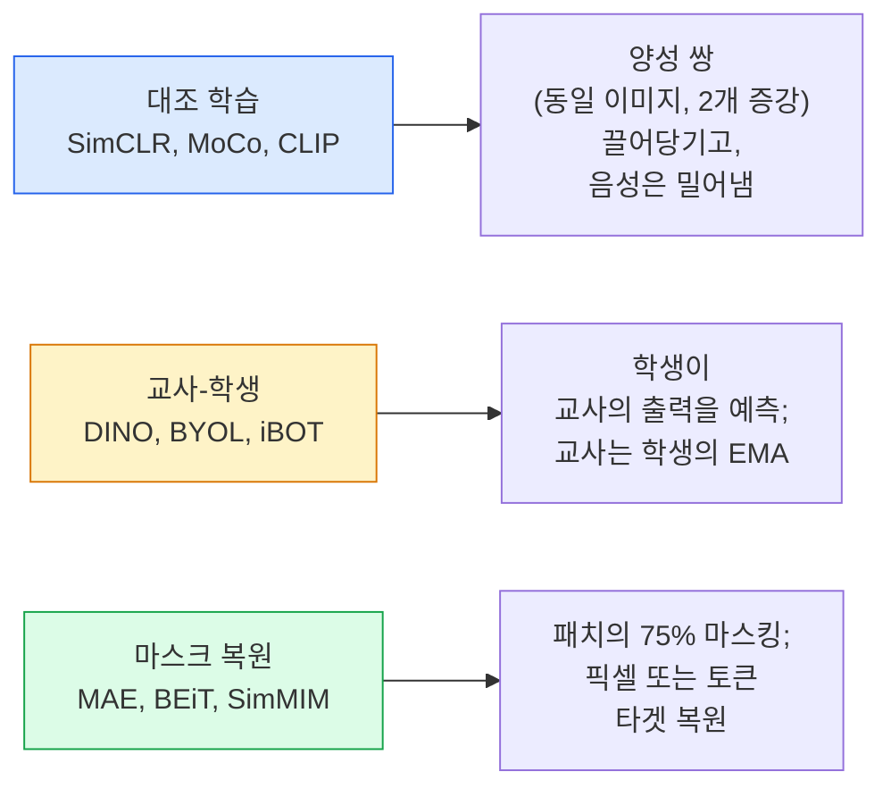

# 자기지도 비전 — SimCLR, DINO, MAE

> 레이블이 지도 비전의 병목이다. 자기지도 사전학습이 이를 제거한다: 1억 개의 레이블 없는 이미지에서 시각 특징을 학습하고, 1만 개의 레이블된 이미지로 미세조정하라.

**유형:** 학습 + 빌드
**언어:** Python
**사전 요구사항:** 4단계 04과(이미지 분류), 4단계 14과(ViT)
**시간:** ~75분

## 학습 목표

- 세 가지 주요 자기지도 계열 — 대조 학습(SimCLR), 교사-학생(DINO), 마스크 복원(MAE) — 을 추적하고 각각이 최적화하는 대상을 설명한다
- InfoNCE 손실을 처음부터 구현하고 배치 크기 512는 작동하지만 32는 실패하는 이유를 설명한다
- MAE의 75% 마스킹 비율이 임의적이지 않은 이유와 BERT의 텍스트용 15%와 어떻게 다른지 설명한다
- DINOv2 또는 MAE ImageNet 체크포인트를 선형 프로빙 및 제로샷 검색에 사용한다

## 문제

지도 ImageNet에는 130만 개의 레이블된 이미지가 있으며, 주석을 다는 데 약 1,000만 달러가 소요된 것으로 추정된다. 의료 및 산업 데이터셋은 더 작고 레이블링 비용은 더욱 비싸다. 모든 비전 팀은 묻는다: 값싼 레이블 없는 데이터(YouTube 프레임, 웹 크롤, 웹캠 영상, 위성 스캔)로 사전학습하고 작은 레이블된 세트로 미세조정할 수 있을까?

자기지도 학습이 답이다. LAION 또는 JFT에서 학습된 최신 자기지도 ViT는 미세조정 시 지도 ImageNet 정확도에 도달하거나 능가한다. 또한 하류 작업(검출, 분할, 깊이)으로의 전이도 지도 사전학습보다 더 좋다. DINOv2(Meta, 2023)와 MAE(Meta, 2022)는 현재 전이 가능한 비전 특징을 위한 프로덕션 기본값이다.

개념적 전환은 가설 작업(pretext task) — 모델이 학습하도록 훈련된 작업 — 이 하류 작업일 필요가 없다는 점이다. 중요한 것은 모델이 유용한 특징을 학습하도록 강제한다는 것이다. 회색조 이미지의 색상을 예측하거나, 이미지를 회전시키고 모델이 회전을 분류하도록 하거나, 패치를 마스킹하고 복원하는 것 — 모두 효과가 있었다. 확장 가능한 세 가지 접근법은 대조 학습, 교사-학생 증류, 그리고 마스크 복원이다.

## 개념

### 세 가지 계열



### 대조 학습 (SimCLR)

하나의 이미지를 가져와 두 개의 무작위 증강을 적용하고 두 개의 뷰를 얻는다. 둘 다 동일한 인코더와 프로젝션 헤드를 통과시킨다. "이 두 임베딩은 가까워야 한다"와 "이 임베딩은 배치 내 다른 모든 이미지의 임베딩과 멀어야 한다"는 손실을 최소화한다.

```
배치 내 2N개의 뷰 중 양성 쌍 (z_i, z_j)에 대한 손실:

   L_ij = -log( exp(sim(z_i, z_j) / tau) / sum_k in batch \ {i} exp(sim(z_i, z_k) / tau) )

sim = 코사인 유사도
tau = 온도 (표준 0.1)
```

이것이 InfoNCE 손실이다. 양성당 많은 음성이 필요하므로 배치 크기가 중요하다 — SimCLR은 512-8192가 필요하다. MoCo는 과거 배치의 모멘텀 큐를 도입하여 음성 수를 배치 크기에서 분리했다.

### 교사-학생 (DINO)

동일한 아키텍처의 두 네트워크: 학생과 교사. 교사는 학생 가중치의 지수 이동 평균(EMA)이다. 둘 다 이미지의 증강된 뷰를 본다. 학생의 출력은 교사의 출력과 일치하도록 훈련된다 — 명시적 음성 없음.

```
loss = CE( student_output(view_1),  teacher_output(view_2) )
     + CE( student_output(view_2),  teacher_output(view_1) )

teacher_weights = m * teacher_weights + (1 - m) * student_weights   (m ≈ 0.996)
```

왜 "상수 예측"으로 붕괴하지 않는가: 교사의 출력은 중앙화(차원별 평균 차감)되고 샤프닝(작은 온도로 나눔)된다. 중앙화는 하나의 차원이 지배하는 것을 방지하고, 샤프닝은 출력이 균등 분포로 붕괴하는 것을 방지한다.

DINO는 DINOv2가 확장한 방식으로, 1억 4200만 개의 선별된 이미지로 학습된다. 결과 특징은 제로샷 시각 검색 및 밀집 예측을 위한 현재 SOTA이다.

### 마스크 복원 (MAE)

ViT 입력의 패치 75%를 마스킹한다. 보이는 25%만 인코더를 통과시킨다. 작은 디코더는 인코더의 출력과 마스크된 위치의 마스크 토큰을 받아 마스크된 패치의 픽셀을 복원하도록 훈련된다.

```
Encoder:  visible 25% of patches -> features
Decoder:  features + mask tokens at masked positions -> reconstructed pixels
Loss:     MSE between reconstructed and original pixels on masked patches only
```

MAE를 작동하게 만드는 핵심 설계 선택:

- **75% 마스크 비율** — 높음. 인코더가 의미 특징을 학습하도록 강제한다; 25%를 복원하는 것은 거의 사소할 것이다(인접 픽셀은 CNN이 쉽게 처리할 수 있을 정도로 상관관계가 높다).
- **비대칭 인코더/디코더** — 큰 ViT 인코더는 보이는 패치만 보고; 작은 디코더(8계층, 512차원)가 복원을 처리한다. 단순 BEiT보다 3배 빠른 사전학습.
- **픽셀 공간 복원 타겟** — BEiT의 토큰화된 타겟보다 간단하며 ViT에서 더 잘 작동한다.

사전학습 후 디코더는 폐기한다. 인코더가 특징 추출기이다.

### 75%인 이유, 15%가 아닌 이유

BERT는 토큰의 15%를 마스킹한다. MAE는 75%를 마스킹한다. 차이는 정보 밀도이다.

- 자연어는 토큰당 높은 엔트로피를 가진다. 토큰의 15%를 예측하는 것은 여전히 어렵다. 각 마스크된 위치에는 많은 그럴듯한 완성이 있기 때문이다.
- 이미지 패치는 낮은 엔트로피를 가진다 — 마스크되지 않은 이웃이 마스크된 패치의 픽셀을 거의 정확히 결정하는 경우가 많다. 예측이 의미 이해를 요구하게 하려면 공격적으로 마스킹해야 한다.

75%는 단순한 공간 외삽으로는 작업을 해결할 수 없을 만큼 충분히 높다; 인코더는 이미지 내용을 표현해야 한다.

### 선형 프로브 평가

자기지도 사전학습 후 표준 평가는 **선형 프로브**이다: 인코더를 고정하고, ImageNet 레이블 위에 단일 선형 분류기를 학습시킨다. Top-1 정확도를 보고한다.

- SimCLR ResNet-50: ~71% (2020)
- DINO ViT-S/16: ~77% (2021)
- MAE ViT-L/16: ~76% (2022)
- DINOv2 ViT-g/14: ~86% (2023)

선형 프로브는 특징 품질의 순수한 척도이다; 미세조정은 일반적으로 2-5포인트를 추가하지만 헤드 재학습의 효과도 섞인다.

## 빌드 It

### 단계 1: 두 뷰 증강 파이프라인

```python
import torch
import torchvision.transforms as T

two_view_train = lambda: T.Compose([
    T.RandomResizedCrop(96, scale=(0.2, 1.0)),
    T.RandomHorizontalFlip(),
    T.ColorJitter(0.4, 0.4, 0.4, 0.1),
    T.RandomGrayscale(p=0.2),
    T.ToTensor(),
])


class TwoViewDataset(torch.utils.data.Dataset):
    def __init__(self, base):
        self.base = base
        self.aug = two_view_train()

    def __len__(self):
        return len(self.base)

    def __getitem__(self, i):
        img, _ = self.base[i]
        v1 = self.aug(img)
        v2 = self.aug(img)
        return v1, v2
```

각 `__getitem__`은 동일한 이미지의 두 개의 증강된 뷰를 반환한다; 레이블은 필요하지 않다.

### 단계 2: InfoNCE 손실

```python
import torch.nn.functional as F

def info_nce(z1, z2, tau=0.1):
    """
    z1, z2: (N, D) L2 정규화된 짝 지어진 뷰의 임베딩
    """
    N, D = z1.shape
    z = torch.cat([z1, z2], dim=0)  # (2N, D)
    sim = z @ z.T / tau              # (2N, 2N)

    mask = torch.eye(2 * N, dtype=torch.bool, device=z.device)
    sim = sim.masked_fill(mask, float("-inf"))

    targets = torch.cat([torch.arange(N, 2 * N), torch.arange(0, N)]).to(z.device)
    return F.cross_entropy(sim, targets)
```

호출 전에 임베딩을 L2 정규화한다. `tau=0.1`은 SimCLR 기본값이다; 낮을수록 손실이 더 샤프해지고 더 많은 음성이 필요하다.

### 단계 3: InfoNCE 건전성 검사

```python
z1 = F.normalize(torch.randn(16, 32), dim=-1)
z2 = z1.clone()
loss_same = info_nce(z1, z2, tau=0.1).item()
z2_random = F.normalize(torch.randn(16, 32), dim=-1)
loss_random = info_nce(z1, z2_random, tau=0.1).item()
print(f"InfoNCE with identical pairs:  {loss_same:.3f}")
print(f"InfoNCE with random pairs:     {loss_random:.3f}")
```

동일한 쌍은 낮은 손실(큰 배치와 차가운 온도에서 0에 가까움)을 주어야 한다. 무작위 쌍은 16쌍 배치에서 log(2N-1) = ~log(31) = ~3.4를 주어야 한다.

### 단계 4: MAE 스타일 마스킹

```python
def random_mask_indices(num_patches, mask_ratio=0.75, seed=0):
    g = torch.Generator().manual_seed(seed)
    n_keep = int(num_patches * (1 - mask_ratio))
    perm = torch.randperm(num_patches, generator=g)
    visible = perm[:n_keep]
    masked = perm[n_keep:]
    return visible.sort().values, masked.sort().values


num_patches = 196
visible, masked = random_mask_indices(num_patches, mask_ratio=0.75)
print(f"visible: {len(visible)} / {num_patches}")
print(f"masked:  {len(masked)} / {num_patches}")
```

주어진 시드에 대해 간단하고 빠르며 결정론적이다. 실제 MAE 구현은 이것을 배치로 처리하고 샘플별 마스크를 유지한다.

## 사용 It

DINOv2는 2026년 프로덕션 표준이다:

```python
import torch
from transformers import AutoImageProcessor, AutoModel

processor = AutoImageProcessor.from_pretrained("facebook/dinov2-base")
model = AutoModel.from_pretrained("facebook/dinov2-base")
model.eval()

# 제로샷 검색을 위한 이미지별 임베딩
with torch.no_grad():
    inputs = processor(images=[pil_image], return_tensors="pt")
    outputs = model(**inputs)
    embedding = outputs.last_hidden_state[:, 0]  # CLS 토큰
```

결과 768차원 임베딩은 최신 이미지 검색, 밀집 대응, 제로샷 전이 파이프라인의 백본이다. 하류 작업에서 미세조정은 거의 선형 헤드 이상을 필요로 하지 않는다.

이미지-텍스트 임베딩의 경우 SigLIP 또는 OpenCLIP이 동등하며, MAE 스타일 미세조정의 경우 `timm` 저장소가 모든 MAE 체크포인트를 제공한다.

## 배송 It

이 과목은 다음을 제공한다:

- `outputs/prompt-ssl-pretraining-picker.md` — 데이터셋 크기, 컴퓨팅, 하류 작업에 따라 SimCLR / MAE / DINOv2를 선택하는 프롬프트.
- `outputs/skill-linear-probe-runner.md` — 고정된 인코더 + 레이블된 데이터셋에 대한 선형 프로브 평가를 작성하는 스킬.

## 연습 문제

1. **(쉬움)** InfoNCE 손실이 잘 정렬된 임베딩에 대해 온도를 낮추면 감소하고 무작위 임베딩에 대해 온도를 낮추면 증가하는지 확인한다. `tau in [0.05, 0.1, 0.2, 0.5]`에 대한 손실 플롯을 생성한다.
2. **(중간)** DINO 스타일 센터 버퍼를 구현한다. 중앙화 없이 학생이 몇 에폭 내에 상수 벡터로 붕괴하는 것을 보여준다.
3. **(어려움)** 10과의 TinyUNet을 백본으로 사용하여 CIFAR-100에서 MAE를 훈련한다. 10, 50, 200 에폭에서 선형 프로브 정확도를 보고한다. MAE 사전학습된 선형 프로브가 동일한 1,000개 이미지 서브셋에서 처음부터 학습된 지도 선형 프로브를 능가함을 보여준다.

## 주요 용어

| 용어 | 사람들이 말하는 것 | 실제 의미 |
|------|----------------|----------------------|
| 자기지도 학습 | "레이블 프리" | 레이블 없는 데이터에서 유용한 표현을 생성하는 가설 작업 |
| 가설 작업 | "가짜 작업" | SSL 중에 사용되는 목적 함수(패치 복원, 뷰 일치); 사전학습 후 폐기 |
| 선형 프로브 | "고정 인코더 + 선형 헤드" | 표준 SSL 평가: 고정된 특징 위에 선형 분류기만 훈련 |
| InfoNCE | "대조 손실" | 코사인 유사도에 대한 softmax; 양성 쌍이 타겟 클래스, 나머지는 모두 음성 |
| EMA 교사 | "이동 평균 교사" | 가중치가 학생의 지수 이동 평균인 교사; BYOL, MoCo, DINO에서 사용 |
| 마스크 비율 | "숨겨진 패치 %" | MAE 중 마스크된 패치의 비율; 비전은 75%, 텍스트는 15% |
| 표현 붕괴 | "상수 출력" | 인코더가 모든 입력에 대해 상수 벡터를 출력하는 SSL 실패; 중앙화, 샤프닝, 또는 음성으로 방지 |
| DINOv2 | "프로덕션 SSL 백본" | Meta의 2023 자기지도 ViT; 2026년 가장 강력한 범용 이미지 특징 |

## 추가 읽기

- [SimCLR (Chen et al., 2020)](https://arxiv.org/abs/2002.05709) — 대조 학습 참고 자료
- [DINO (Caron et al., 2021)](https://arxiv.org/abs/2104.14294) — 모멘텀, 중앙화, 샤프닝을 사용한 교사-학생
- [MAE (He et al., 2022)](https://arxiv.org/abs/2111.06377) — ViT를 위한 마스크 오토인코더 사전학습
- [DINOv2 (Oquab et al., 2023)](https://arxiv.org/abs/2304.07193) — 자기지도 ViT를 프로덕션 특징으로 확장
