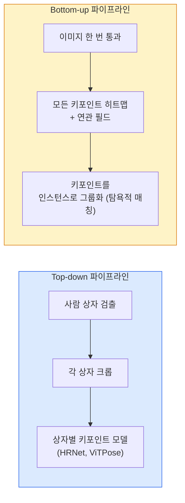

# 키포인트 검출 & 포즈 추정

> 포즈는 정렬된 키포인트의 집합이다. 키포인트 검출기는 히트맵 회귀기이다. 나머지는 모두 부기(bookkeeping)일 뿐이다.

**유형:** 빌드
**언어:** Python
**사전 요구사항:** 4단계 06과(검출), 4단계 07과(U-Net)
**시간:** ~45분

## 학습 목표

- Top-down과 bottom-up 포즈 추정을 구별하고 각각이 사용되는 시기를 설명한다
- 가우시안-퍼-키포인트 타겟을 사용하여 K개의 키포인트에 대한 히트맵을 회귀하고 추론 시 키포인트 좌표를 추출한다
- PAF(Part Affinity Fields)와 bottom-up 파이프라인이 키포인트를 인스턴스로 연관시키는 방법을 설명한다
- 프로덕션 키포인트 추정을 위해 MediaPipe Pose 또는 MMPose를 사용하고 그 출력 형식을 이해한다

## 문제

키포인트 작업은 여러 이름으로 숨겨져 있다: 인간 포즈(17개 신체 관절), 얼굴 랜드마크(68 또는 478개 포인트), 손(21개 포인트), 동물 포즈, 로봇 객체 포즈, 의료 해부학 랜드마크. 모든 작업은 동일한 구조를 공유한다: 객체에서 K개의 개별 포인트를 검출하고 (x, y) 좌표를 출력한다.

포즈 추정은 모션 캡처, 피트니스 앱, 스포츠 분석, 제스처 제어, 애니메이션, AR 시착, 로봇 그리핑의 기초이다. 2D 경우는 성숙했으며; 3D 포즈(단일 카메라에서 세계 좌표의 관절 위치 추정)는 현재 연구 최전선이다.

공학적 문제는 규모이다. 단일 이미지, 단일 인물 포즈는 20ms 문제이다. 30fps에서 군중 속의 다중 인물 포즈는 다른 아키텍처가 필요한 다른 문제이다.

## 개념

### Top-down vs bottom-up



- **Top-down** — 먼저 사람을 검출한 후, 각 크롭에 대해 인물별 키포인트 모델을 실행한다. 가장 높은 정확도; 사람 수에 따라 선형적으로 확장된다.
- **Bottom-up** — 한 번의 순방향 패스로 모든 키포인트와 연관 필드를 예측하고 그룹화한다. 군중 크기에 관계없이 일정한 시간.

Top-down(HRNet, ViTPose)은 정확도 리더이고; bottom-up(OpenPose, HigherHRNet)은 혼잡한 장면에서 처리량 리더이다.

### 히트맵 회귀

`(x, y)`를 직접 회귀하는 대신, 실제 위치에 가우시안 블롭이 있는 키포인트당 `H x W` 히트맵을 예측한다.

```
target[k, y, x] = exp(-((x - cx_k)^2 + (y - cy_k)^2) / (2 sigma^2))
```

추론 시 각 히트맵의 argmax가 예측된 키포인트 위치이다.

히트맵이 직접 회귀보다 더 잘 작동하는 이유: 네트워크의 공간 구조(conv 특징 맵)가 공간 출력과 자연스럽게 정렬된다. 가우시안 타겟은 또한 정규화한다 — 작은 위치 오차는 0이 아닌 작은 손실을 생성한다.

### 서브픽셀 위치 추정

Argmax는 정수 좌표를 제공한다. 서브픽셀 정밀도를 위해, argmax와 그 이웃에 포물선을 피팅하거나 잘 알려진 오프셋 `(dx, dy) = 0.25 * (heatmap[y, x+1] - heatmap[y, x-1], ...)` 방향을 사용하여 정제한다.

### PAF (Part Affinity Fields)

Bottom-up 연관을 위한 OpenPose의 트릭. 연결된 키포인트의 각 쌍(예: 왼쪽 어깨에서 왼쪽 팔꿈치)에 대해, 하나에서 다른 하나로 향하는 단위 벡터를 인코딩하는 2-채널 필드를 예측한다. 어깨를 팔꿈치와 연관시키기 위해, 후보 쌍을 연결하는 선을 따라 PAF를 적분한다; 가장 높은 적분을 가진 쌍이 일치된다.

```
각 연결(사지)에 대해:
  PAF 채널: 2 (단위 벡터 x, y)
  선 적분: 샘플 포인트에 걸친 (PAF . line_direction)의 합
  더 높은 적분 = 더 강한 일치
```

우아하며 인물별 크롭 없이 임의의 군중 크기로 확장된다.

### COCO 키포인트

표준 신체 포즈 데이터셋: 인물당 17개 키포인트, PCK(Percentage of Correct Keypoints)와 OKS(Object Keypoint Similarity)를 지표로 사용한다. OKS는 키포인트의 IoU 유사체이며 COCO mAP@OKS가 보고하는 것이다.

### 2D vs 3D

- **2D 포즈** — 이미지 좌표; 프로덕션 품질로 해결됨(MediaPipe, HRNet, ViTPose).
- **3D 포즈** — 세계/카메라 좌표; 여전히 활발한 연구. 일반적인 접근법:
  - 작은 MLP로 2D 예측을 3D로 리프트(VideoPose3D).
  - 이미지에서 직접 3D 회귀(PyMAF, MHFormer).
  - 다중 뷰 설정(CMU Panoptic)으로 정답 확보.

## 빌드 It

### 단계 1: 가우시안 히트맵 타겟

```python
import numpy as np
import torch

def gaussian_heatmap(size, cx, cy, sigma=2.0):
    yy, xx = np.meshgrid(np.arange(size), np.arange(size), indexing="ij")
    return np.exp(-((xx - cx) ** 2 + (yy - cy) ** 2) / (2 * sigma ** 2)).astype(np.float32)

hm = gaussian_heatmap(64, 32, 32, sigma=2.0)
print(f"peak: {hm.max():.3f} at ({hm.argmax() % 64}, {hm.argmax() // 64})")
```

채널 축을 따라 쌓인 키포인트별 히트맵이 전체 타겟 텐서를 제공한다.

### 단계 2: Tiny 키포인트 헤드

K개의 히트맵 채널을 출력하는 U-Net 스타일 모델.

```python
import torch.nn as nn
import torch.nn.functional as F

class TinyKeypointNet(nn.Module):
    def __init__(self, num_keypoints=4, base=16):
        super().__init__()
        self.down1 = nn.Sequential(nn.Conv2d(3, base, 3, 2, 1), nn.ReLU(inplace=True))
        self.down2 = nn.Sequential(nn.Conv2d(base, base * 2, 3, 2, 1), nn.ReLU(inplace=True))
        self.mid = nn.Sequential(nn.Conv2d(base * 2, base * 2, 3, 1, 1), nn.ReLU(inplace=True))
        self.up1 = nn.ConvTranspose2d(base * 2, base, 2, 2)
        self.up2 = nn.ConvTranspose2d(base, num_keypoints, 2, 2)

    def forward(self, x):
        h1 = self.down1(x)
        h2 = self.down2(h1)
        h3 = self.mid(h2)
        u1 = self.up1(h3)
        return self.up2(u1)
```

입력 `(N, 3, H, W)`, 출력 `(N, K, H, W)`. 손실은 가우시안 타겟에 대한 픽셀별 MSE이다.

### 단계 3: 추론 — 키포인트 좌표 추출

```python
def heatmap_to_coords(heatmaps):
    """
    heatmaps: (N, K, H, W)
    returns:  (N, K, 2) 이미지 픽셀 단위 float 좌표
    """
    N, K, H, W = heatmaps.shape
    hm = heatmaps.reshape(N, K, -1)
    idx = hm.argmax(dim=-1)
    ys = (idx // W).float()
    xs = (idx % W).float()
    return torch.stack([xs, ys], dim=-1)

coords = heatmap_to_coords(torch.randn(2, 4, 32, 32))
print(f"coords: {coords.shape}")  # (2, 4, 2)
```

추론에서 한 줄. 서브픽셀 정제를 위해 argmax 주변을 보간한다.

### 단계 4: 합성 키포인트 데이터셋

간단함: 흰색 캔버스에 네 개의 점을 그리고 예측하는 법을 학습한다.

```python
def make_synthetic_sample(size=64):
    img = np.ones((3, size, size), dtype=np.float32)
    rng = np.random.default_rng()
    kps = rng.integers(8, size - 8, size=(4, 2))
    for cx, cy in kps:
        img[:, cy - 2:cy + 2, cx - 2:cx + 2] = 0.0
    hms = np.stack([gaussian_heatmap(size, cx, cy) for cx, cy in kps])
    return img, hms, kps
```

작은 모델이 1분 안에 학습하기에 충분히 쉽다.

### 단계 5: 훈련

```python
model = TinyKeypointNet(num_keypoints=4)
opt = torch.optim.Adam(model.parameters(), lr=3e-3)

for step in range(200):
    batch = [make_synthetic_sample() for _ in range(16)]
    imgs = torch.from_numpy(np.stack([b[0] for b in batch]))
    hms = torch.from_numpy(np.stack([b[1] for b in batch]))
    pred = model(imgs)
    pred = F.interpolate(pred, size=hms.shape[-2:], mode="bilinear", align_corners=False)
    loss = F.mse_loss(pred, hms)
    opt.zero_grad(); loss.backward(); opt.step()
```

## 사용 It

- **MediaPipe Pose** — Google의 프로덕션 포즈 추정기; WebGL + 모바일 런타임 탑재, 10ms 미만 지연 시간.
- **MMPose** (OpenMMLab) — 포괄적인 연구 코드베이스; 사전학습된 가중치를 가진 모든 SOTA 아키텍처.
- **YOLOv8-pose** — 단일 순방향 패스로 가장 빠른 실시간 다중 인물 포즈.
- **transformers HumanDPT / PoseAnything** — 개방 어휘 포즈(모든 객체, 모든 키포인트 세트)를 위한 최신 비전-언어 접근법.

## 배송 It

이 과목은 다음을 제공한다:

- `outputs/prompt-pose-stack-picker.md` — 지연 시간, 군중 크기, 2D vs 3D 필요에 따라 MediaPipe / YOLOv8-pose / HRNet / ViTPose를 선택하는 프롬프트.
- `outputs/skill-heatmap-to-coords.md` — 모든 프로덕션 포즈 모델이 사용하는 서브픽셀 히트맵-투-좌표 루틴을 작성하는 스킬.

## 연습 문제

1. **(쉬움)** 작은 키포인트 모델을 합성 4-점 데이터셋에서 훈련한다. 200단계 후 예측된 키포인트와 실제 키포인트 간의 평균 L2 오차를 보고한다.
2. **(중간)** 서브픽셀 정제 추가: argmax 위치가 주어지면, 이웃 픽셀에서 x와 y를 따라 1D 포물선을 피팅한다. 정수 argmax 대비 정확도 향상을 보고한다.
3. **(어려움)** 각 이미지가 4-키포인트 패턴의 두 인스턴스를 보여주는 2-인물 합성 데이터셋을 구축한다. 어떤 키포인트가 어떤 인스턴스에 속하는지 예측하는 PAF를 가진 bottom-up 파이프라인을 훈련하고 OKS를 평가한다.

## 주요 용어

| 용어 | 사람들이 말하는 것 | 실제 의미 |
|------|----------------|----------------------|
| 키포인트 | "랜드마크" | 객체의 특정 정렬된 점(관절, 코너, 특징) |
| 포즈 | "골격" | 하나의 인스턴스에 속하는 정렬된 키포인트 집합 |
| Top-down | "검출 후 포즈" | 2단계 파이프라인: 사람 검출기 + 크롭별 키포인트 모델; 가장 높은 정확도 |
| Bottom-up | "포즈 먼저, 그룹은 나중에" | 단일 패스 모든-키포인트 예측 + 그룹화; 군중 크기에서 일정한 시간 |
| 히트맵 | "가우시안 타겟" | 키포인트당 H x W 텐서, 실제 위치에 피크; 선호되는 회귀 타겟 |
| PAF | "Part Affinity Field" | 사지 방향을 인코딩하는 2채널 단위 벡터 필드; 키포인트를 인스턴스로 그룹화하는 데 사용 |
| OKS | "키포인트 IoU" | Object Keypoint Similarity; COCO 포즈 지표 |
| HRNet | "고해상도 네트워크" | 지배적인 top-down 키포인트 아키텍처; 전체적으로 고해상도 특징 유지 |

## 추가 읽기

- [OpenPose (Cao et al., 2017)](https://arxiv.org/abs/1812.08008) — PAF를 사용한 bottom-up; 여전히 접근법에 대한 최고의 설명
- [HRNet (Sun et al., 2019)](https://arxiv.org/abs/1902.09212) — top-down 참조 아키텍처
- [ViTPose (Xu et al., 2022)](https://arxiv.org/abs/2204.12484) — 포즈 백본으로서의 일반 ViT; 많은 벤치마크에서 현재 SOTA
- [MediaPipe Pose](https://developers.google.com/mediapipe/solutions/vision/pose_landmarker) — 프로덕션 실시간 포즈; 2026년 가장 빠른 배포 스택
