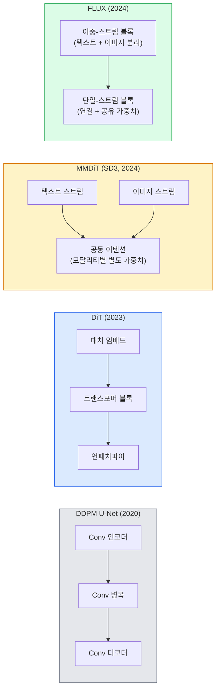

# 확산 트랜스포머 & Rectified Flow

> U-Net이 확산의 비결이 아니다. 그것을 트랜스포머로 교체하고, 노이즈 스케줄을 직선 흐름으로 바꾸면, 갑자기 SD3, FLUX, 그리고 모든 2026년 텍스트-투-이미지 모델이 된다.

**유형:** 학습 + 빌드
**언어:** Python
**사전 요구사항:** 4단계 10과(확산 DDPM), 4단계 14과(ViT), 7단계 02과(셀프 어텐션)
**시간:** ~75분

## 학습 목표

- U-Net DDPM(10과)에서 Diffusion Transformer(DiT), MMDiT(SD3), 단일+이중 스트림 DiT(FLUX)로의 진화를 추적한다
- Rectified flow를 설명한다: 노이즈와 데이터 사이의 직선 궤적이 모델이 1000단계 대신 20단계로 샘플링할 수 있게 하는 이유
- 100줄 미만으로 작은 DiT 블록과 rectified-flow 훈련 루프를 구현한다
- 모델 변형(SD3, FLUX.1-dev, FLUX.1-schnell, Z-Image, Qwen-Image)을 아키텍처, 매개변수 수, 라이선스별로 구별한다

## 문제

10과는 U-Net 노이즈 제거기를 가진 DDPM을 구축했다. 그 레시피는 2020-2023년을 지배했다: U-Net + 베타 스케줄 + 노이즈 예측 손실. 그것은 Stable Diffusion 1.5와 2.1, DALL-E 2를 생산했다.

2026년의 모든 최첨단 텍스트-투-이미지 모델은 그것을 넘어섰다. Stable Diffusion 3, FLUX, SD4, Z-Image, Qwen-Image, Hunyuan-Image — 어느 것도 U-Net을 사용하지 않는다. 그들은 Diffusion Transformers(DiT)를 사용한다. SD3와 FLUX는 또한 DDPM 노이즈 스케줄을 rectified flow로 교체하여, 노이즈에서 데이터로의 경로를 직선화하고 일관성 또는 증류 변형으로 1-4단계 추론을 가능하게 한다.

이 전환은 확산 기반 이미지 생성이 제어 가능하고, 프롬프트 정확도가 높아지며(SD3/SD4가 텍스트 렌더링을 해결함), 프로덕션 속도가 빨라진 이유이기 때문에 중요하다. DiT + rectified flow를 이해하는 것은 2026년 생성 이미지 스택을 이해하는 것이다.

## 개념

### U-Net에서 트랜스포머로



- **DiT** (Peebles & Xie, 2023) — U-Net을 잠재 패치의 ViT 유사 트랜스포머로 교체. 적응형 계층 정규화(AdaLN)를 통한 조건화.
- **MMDiT** (SD3, Esser et al., 2024) — 공동 어텐션을 공유하는 텍스트 및 이미지 토큰을 위한 별도 가중치를 가진 두 개의 스트림.
- **FLUX** (Black Forest Labs, 2024) — 처음 N개 블록은 SD3처럼 이중-스트림, 이후 블록은 연결하고 가중치를 공유(단일-스트림)하여 깊이가 높을 때 효율성 확보.
- **Z-Image** (2025) — "무조건 확장"에 도전하는 6B 매개변수의 효율적인 단일-스트림 DiT.

### Rectified flow를 한 단락으로

DDPM은 순방향 과정을 `x_t`가 점점 더 손상되는 노이즈 SDE로 정의한다. 학습된 역방향은 두 번째 SDE이며, 1000개의 작은 단계로 해결된다.

Rectified flow는 깨끗한 데이터와 순수 노이즈 사이의 **직선** 보간을 정의한다:

```
x_t = (1 - t) * x_0 + t * epsilon,     t in [0, 1]
```

속도 `v_theta(x_t, t) = epsilon - x_0` — 깨끗한 데이터에서 노이즈로의 직선 경로를 따른 순방향 방향(`dx_t/dt`) — 을 예측하도록 네트워크를 훈련한다. 샘플링 중에, 이 속도를 역방향으로 적분하여 노이즈에서 데이터로 단계적으로 이동한다. 결과 ODE는 직선에 훨씬 더 가깝기 때문에, 샘플링에 필요한 적분 단계가 훨씬 적다.

SD3는 이것을 **Rectified Flow Matching**이라고 부른다. FLUX, Z-Image, 그리고 대부분의 2026년 모델은 동일한 목적 함수를 사용한다. 일반적인 추론: 20-30 Euler 단계(결정론적) vs 이전 DDPM 체제의 50+ DDIM 단계. 증류된 / turbo / schnell / LCM 변형은 1-4단계로 줄인다.

### AdaLN 조건화

DiT는 **적응형 계층 정규화**를 통해 시간 단계와 클래스/텍스트를 조건화한다: 조건화 벡터에서 `scale`과 `shift`를 예측하고 LayerNorm 후에 적용한다. U-Net의 FiLM 스타일 변조보다 훨씬 깔끔하며 모든 최신 DiT의 기본값이다.

```
cond -> MLP -> (scale, shift, gate)
norm(x) * (1 + scale) + shift, then residual add * gate
```

### SD3와 FLUX의 텍스트 인코더

- **SD3**는 세 개의 텍스트 인코더를 사용한다: 두 개의 CLIP 모델 + T5-XXL. 임베딩이 연결되어 텍스트 조건화로 이미지 스트림에 공급된다.
- **FLUX**는 하나의 CLIP-L + T5-XXL을 사용한다.
- **Qwen-Image / Z-Image** 변형은 그들의 기본 LLM에 정렬된 자체 사내 텍스트 인코더를 사용한다.

텍스트 인코더는 SD3/FLUX가 SD1.5보다 프롬프트를 훨씬 잘 이해하는 큰 이유 중 하나이다. T5-XXL만 해도 4.7B 매개변수이다.

### 분류기-프리 가이던스는 여전히 유효

Rectified flow는 샘플러를 바꾸지, 조건화를 바꾸지 않는다. 분류기-프리 가이던스(훈련 중 10% 확률로 텍스트 드롭, 추론에서 조건부 및 무조건 예측 혼합)는 rectified flow와 동일하게 작동한다. 대부분의 2026년 모델은 가이던스 스케일 3.5-5를 사용한다 — SD1.5의 7.5보다 낮은데, rectified-flow 모델이 기본적으로 프롬프트를 더 잘 따르기 때문이다.

### 일관성, Turbo, Schnell, LCM

동일한 아이디어의 네 가지 이름: 느린 다단계 모델을 빠른 소수-단계 모델로 증류한다.

- **LCM (Latent Consistency Model)** — 중간 `x_t`에서 최종 `x_0`를 한 단계에 예측하는 학생을 훈련.
- **SDXL Turbo / FLUX schnell** — 적대적 확산 증류로 훈련된 1-4 단계 모델.
- **SD Turbo** — OpenAI 스타일 일관성 모델을 잠재 확산에 적용.

새 모델의 프로덕션 서빙은 "전체 품질" 체크포인트와 "turbo / schnell" 변형을 모두 제공한다. Schnell(독일어로 "빠름", Black Forest Labs의 관례)은 1-4 단계로 실행되며 실시간 파이프라인에 적합하다.

### 2026년 모델 환경

| 모델 | 크기 | 아키텍처 | 라이선스 |
|-------|------|--------------|---------|
| Stable Diffusion 3 Medium | 2B | MMDiT | SAI Community |
| Stable Diffusion 3.5 Large | 8B | MMDiT | SAI Community |
| FLUX.1-dev | 12B | 이중 + 단일 스트림 DiT | 비상업적 |
| FLUX.1-schnell | 12B | 동일, 증류됨 | Apache 2.0 |
| FLUX.2 | — | FLUX.1 반복 | 혼합 |
| Z-Image | 6B | S3-DiT (확장 가능 단일 스트림) | 허용적 |
| Qwen-Image | ~20B | DiT + Qwen 텍스트 타워 | Apache 2.0 |
| Hunyuan-Image-3.0 | ~80B | DiT | 연구 |
| SD4 Turbo | 3B | DiT + 증류 | SAI Commercial |

FLUX.1-schnell은 2026년 오픈소스 기본값이다. Z-Image는 효율성 리더이다. FLUX.2와 SD4는 현재 품질 최고점이다.

### 이 단계 전환이 중요한 이유

DDPM + U-Net은 작동했다. DiT + rectified flow는 **더 잘, 더 빠르게, 더 깔끔하게 확장된다**. 이 전환은 NLP에서 RNN에서 트랜스포머로의 전환과 유사하다: 두 아키텍처 모두 동일한 문제를 해결했지만, 트랜스포머가 확장되어 현재 지배한다. 2026년 이미지, 비디오, 또는 3D 생성에 관한 모든 논문은 DiT 형태의 노이즈 제거기와 일반적으로 rectified flow 목적 함수를 사용한다. U-Net DDPM은 이제 주로 교육적이다(10과).

## 빌드 It

### 단계 1: AdaLN을 가진 DiT 블록

```python
import torch
import torch.nn as nn


class AdaLNZero(nn.Module):
    """
    게이트가 있는 적응형 LayerNorm. 조건화에서 (scale, shift, gate)를 예측한다.
    전체 블록이 항등원으로 시작하도록 초기화("제로 초기화").
    """

    def __init__(self, dim, cond_dim):
        super().__init__()
        self.norm = nn.LayerNorm(dim, elementwise_affine=False)
        self.mlp = nn.Linear(cond_dim, dim * 3)
        nn.init.zeros_(self.mlp.weight)
        nn.init.zeros_(self.mlp.bias)

    def forward(self, x, cond):
        scale, shift, gate = self.mlp(cond).chunk(3, dim=-1)
        h = self.norm(x) * (1 + scale.unsqueeze(1)) + shift.unsqueeze(1)
        return h, gate.unsqueeze(1)


class DiTBlock(nn.Module):
    def __init__(self, dim=192, heads=3, mlp_ratio=4, cond_dim=192):
        super().__init__()
        self.adaln1 = AdaLNZero(dim, cond_dim)
        self.attn = nn.MultiheadAttention(dim, heads, batch_first=True)
        self.adaln2 = AdaLNZero(dim, cond_dim)
        self.mlp = nn.Sequential(
            nn.Linear(dim, dim * mlp_ratio),
            nn.GELU(),
            nn.Linear(dim * mlp_ratio, dim),
        )

    def forward(self, x, cond):
        h, gate1 = self.adaln1(x, cond)
        a, _ = self.attn(h, h, h, need_weights=False)
        x = x + gate1 * a
        h, gate2 = self.adaln2(x, cond)
        x = x + gate2 * self.mlp(h)
        return x
```

`AdaLNZero`는 MLP 가중치가 0으로 초기화되어 항등 매핑으로 시작한다. 훈련은 블록을 항등원에서 벗어나게 움직인다; 이것은 깊은 트랜스포머 확산 모델을 극적으로 안정화한다.

### 단계 2: 작은 DiT

```python
def timestep_embedding(t, dim):
    import math
    half = dim // 2
    freqs = torch.exp(-math.log(10000) * torch.arange(half, device=t.device) / half)
    args = t[:, None].float() * freqs[None]
    return torch.cat([args.sin(), args.cos()], dim=-1)


class TinyDiT(nn.Module):
    def __init__(self, image_size=16, patch_size=2, in_channels=3, dim=96, depth=4, heads=3):
        super().__init__()
        self.patch_size = patch_size
        self.num_patches = (image_size // patch_size) ** 2
        self.patch = nn.Conv2d(in_channels, dim, kernel_size=patch_size, stride=patch_size)
        self.pos = nn.Parameter(torch.zeros(1, self.num_patches, dim))
        self.time_mlp = nn.Sequential(
            nn.Linear(dim, dim * 2),
            nn.SiLU(),
            nn.Linear(dim * 2, dim),
        )
        self.blocks = nn.ModuleList([DiTBlock(dim, heads, cond_dim=dim) for _ in range(depth)])
        self.norm_out = nn.LayerNorm(dim, elementwise_affine=False)
        self.head = nn.Linear(dim, patch_size * patch_size * in_channels)

    def forward(self, x, t):
        n = x.size(0)
        x = self.patch(x)
        x = x.flatten(2).transpose(1, 2) + self.pos
        t_emb = self.time_mlp(timestep_embedding(t, self.pos.size(-1)))
        for blk in self.blocks:
            x = blk(x, t_emb)
        x = self.norm_out(x)
        x = self.head(x)
        return self._unpatchify(x, n)

    def _unpatchify(self, x, n):
        p = self.patch_size
        h = w = int(self.num_patches ** 0.5)
        x = x.view(n, h, w, p, p, -1).permute(0, 5, 1, 3, 2, 4).reshape(n, -1, h * p, w * p)
        return x
```

### 단계 3: Rectified flow 훈련

```python
import torch.nn.functional as F

def rectified_flow_train_step(model, x0, optimizer, device):
    model.train()
    x0 = x0.to(device)
    n = x0.size(0)
    t = torch.rand(n, device=device)
    epsilon = torch.randn_like(x0)
    x_t = (1 - t[:, None, None, None]) * x0 + t[:, None, None, None] * epsilon

    target_velocity = epsilon - x0
    pred_velocity = model(x_t, t)

    loss = F.mse_loss(pred_velocity, target_velocity)
    optimizer.zero_grad()
    loss.backward()
    optimizer.step()
    return loss.item()
```

DDPM의 노이즈 예측 손실(10과)과 비교: 동일한 구조, 다른 타겟. 노이즈 `epsilon`을 예측하는 대신, 직선 보간을 따라 데이터에서 노이즈를 가리키는 **속도** `epsilon - x_0`를 예측한다.

### 단계 4: Euler 샘플러

Rectified flow는 ODE이다. Euler의 방법은 가장 간단하며, 잘 훈련된 rectified-flow 모델의 경우 20+ 단계에서 고차 솔버만큼 정확하다.

```python
@torch.no_grad()
def rectified_flow_sample(model, shape, steps=20, device="cpu"):
    model.eval()
    x = torch.randn(shape, device=device)
    dt = 1.0 / steps
    t = torch.ones(shape[0], device=device)
    for _ in range(steps):
        v = model(x, t)
        x = x - dt * v
        t = t - dt
    return x
```

20단계. 훈련된 모델에서 이것은 1000단계 DDPM과 비교할 수 있는 샘플을 생성한다.

### 단계 5: 종단간 연기 테스트

```python
import numpy as np

def synthetic_blobs(num=200, size=16, seed=0):
    rng = np.random.default_rng(seed)
    out = np.zeros((num, 3, size, size), dtype=np.float32)
    yy, xx = np.meshgrid(np.arange(size), np.arange(size), indexing="ij")
    for i in range(num):
        cx, cy = rng.uniform(4, size - 4, size=2)
        r = rng.uniform(2, 4)
        mask = (xx - cx) ** 2 + (yy - cy) ** 2 < r ** 2
        colour = rng.uniform(-1, 1, size=3)
        for c in range(3):
            out[i, c][mask] = colour[c]
    return torch.from_numpy(out)
```

이것으로 rectified flow를 사용하여 `TinyDiT`를 훈련한다. 500단계 후, 샘플링된 출력이 희미한 색상 블롭처럼 보여야 한다.

## 사용 It

FLUX / SD3 / Z-Image를 사용한 실제 이미지 생성을 위해, `diffusers`는 통일된 API로 각각을 제공한다:

```python
from diffusers import FluxPipeline, StableDiffusion3Pipeline
import torch

pipe = FluxPipeline.from_pretrained(
    "black-forest-labs/FLUX.1-schnell",
    torch_dtype=torch.bfloat16,
).to("cuda")

out = pipe(
    prompt="a golden retriever surfing a tsunami, hyperrealistic, studio lighting",
    guidance_scale=0.0,           # schnell은 CFG 없이 훈련됨
    num_inference_steps=4,
    max_sequence_length=256,
).images[0]
out.save("surf.png")
```

세 줄. `FLUX.1-schnell`을 4단계로. 더 높은 품질을 위해 모델 ID를 `black-forest-labs/FLUX.1-dev`로 바꾸고 CFG로 20-30단계 실행.

SD3:

```python
pipe = StableDiffusion3Pipeline.from_pretrained(
    "stabilityai/stable-diffusion-3.5-large",
    torch_dtype=torch.bfloat16,
).to("cuda")
out = pipe(prompt, guidance_scale=3.5, num_inference_steps=28).images[0]
```

## 배송 It

이 과목은 다음을 제공한다:

- `outputs/prompt-dit-model-picker.md` — 품질, 지연 시간, 라이선스 제약 조건에 따라 SD3, FLUX.1-dev, FLUX.1-schnell, Z-Image, SD4 Turbo 중에서 선택하는 프롬프트.
- `outputs/skill-rectified-flow-trainer.md` — AdaLN DiT 및 Euler 샘플링을 사용한 rectified flow의 완전한 훈련 루프를 작성하는 스킬.

## 연습 문제

1. **(쉬움)** 위의 TinyDiT를 합성 블롭 데이터셋에서 500단계 훈련한다. 10, 20, 50 Euler 단계로 생성된 샘플을 비교한다.
2. **(중간)** 시간 임베딩에 학습된 클래스 임베딩을 연결하여 텍스트 조건화를 추가한다(색상별 10개 블롭 "클래스"). 클래스 0, 5, 9로 샘플링하고 색상이 일치하는지 확인한다.
3. **(어려움)** 동일한 크기 네트워크의 rectified-flow 및 DDPM 버전에서 동일한 데이터로 동일한 단계 수 동안 훈련된 생성 샘플 간의 Fréchet 거리(FID 프록시)를 계산한다. 어느 것이 더 빨리 수렴하는지 보고한다.

## 주요 용어

| 용어 | 사람들이 말하는 것 | 실제 의미 |
|------|----------------|----------------------|
| DiT | "확산 트랜스포머" | U-Net을 확산 노이즈 제거기로 대체하는 트랜스포머; 패치화된 잠재에서 작동 |
| AdaLN | "적응형 계층 정규화" | LayerNorm 후 적용되는 학습된 scale, shift, gate를 통한 시간 단계/텍스트 조건화; 모든 최신 DiT의 표준 |
| MMDiT | "다중 모달 DiT (SD3)" | 공동 셀프 어텐션을 공유하는 텍스트 및 이미지 토큰을 위한 별도 가중치 스트림 |
| 단일 스트림 / 이중 스트림 | "FLUX 트릭" | 처음 N개 블록 이중 스트림(모달리티별 별도 가중치), 이후 블록 단일 스트림(연결 + 공유 가중치) |
| Rectified flow | "직선 노이즈-투-데이터" | 데이터와 노이즈 사이의 선형 보간; 네트워크는 속도를 예측; 추론에서 더 적은 ODE 단계 필요 |
| 속도 타겟 | "epsilon - x_0" | Rectified flow의 회귀 타겟; 깨끗한 데이터에서 노이즈를 가리킴 |
| CFG 가이던스 | "분류기-프리 가이던스" | 조건부 및 무조건 예측 혼합; rectified-flow 모델에서도 여전히 사용됨 |
| Schnell / turbo / LCM | "1-4단계 증류" | 전체 품질 모델에서 증류된 소수-단계 변형; 프로덕션 실시간 |

## 추가 읽기

- [Scalable Diffusion Models with Transformers (Peebles & Xie, 2023)](https://arxiv.org/abs/2212.09748) — DiT 논문
- [Scaling Rectified Flow Transformers (Esser et al., SD3 paper)](https://arxiv.org/abs/2403.03206) — 대규모 MMDiT 및 rectified flow
- [FLUX.1 model card and technical report (Black Forest Labs)](https://huggingface.co/black-forest-labs/FLUX.1-dev) — 이중 + 단일 스트림 세부 사항
- [Z-Image: Efficient Image Generation Foundation Model (2025)](https://arxiv.org/html/2511.22699v1) — 6B 단일 스트림 DiT
- [Elucidating the Design Space of Diffusion (Karras et al., 2022)](https://arxiv.org/abs/2206.00364) — 모든 확산 설계 절충에 대한 참고 자료
- [Latent Consistency Models (Luo et al., 2023)](https://arxiv.org/abs/2310.04378) — LCM-LoRA가 4단계 추론을 제공하는 방법
