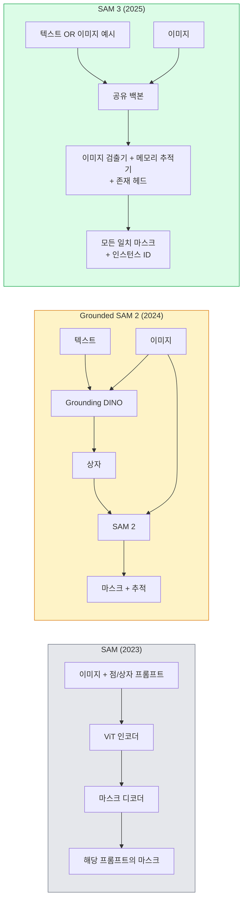

# SAM 3 & 개방 어휘 분할

> 모델에 텍스트 프롬프트와 이미지를 주고 일치하는 모든 객체에 대한 마스크를 얻는다. SAM 3가 그것을 단일 순방향 패스로 만들었다.

**유형:** 사용 + 빌드
**언어:** Python
**사전 요구사항:** 4단계 07과(U-Net), 4단계 08과(Mask R-CNN), 4단계 18과(CLIP)
**시간:** ~60분

## 학습 목표

- SAM(시각 프롬프트만), Grounded SAM / SAM 2(검출기 + SAM), SAM 3(네이티브 텍스트 프롬프트 via Promptable Concept Segmentation)을 구별한다
- SAM 3 아키텍처를 설명한다: 공유 백본 + 이미지 검출기 + 메모리 기반 비디오 추적기 + 존재 헤드 + 분리된 검출기-추적기 설계
- Hugging Face `transformers` SAM 3 통합을 텍스트 프롬프트 기반 검출, 분할, 비디오 추적에 사용한다
- 지연 시간, 개념 복잡성, 배포 타겟에 따라 SAM 3, Grounded SAM 2, YOLO-World, SAM-MI 중에서 선택한다

## 문제

2023년의 SAM은 시각 프롬프트 전용 모델이었다: 점을 클릭하거나 상자를 그리면 마스크를 반환했다. "이 사진에서 모든 오렌지를 찾아줘"를 위해서는 검출기(Grounding DINO)가 상자를 생성한 다음 SAM이 각각을 분할해야 했다. Grounded SAM은 이것을 파이프라인으로 만들었지만, 두 개의 고정된 모델의 캐스케이드로 필연적인 오류 누적이 있었다.

SAM 3(Meta, 2025년 11월, ICLR 2026)은 캐스케이드를 붕괴시켰다. 짧은 명사구나 이미지 예시를 프롬프트로 받아들이고 단일 순방향 패스로 모든 일치하는 마스크와 인스턴스 ID를 반환한다. 이것이 **Promptable Concept Segmentation (PCS)** 이다. 2026년 3월의 Object Multiplex 업데이트(SAM 3.1)와 결합하여, 비디오를 통해 동일한 개념의 여러 인스턴스를 효율적으로 추적한다.

이 과목은 이것이 나타내는 구조적 전환에 관한 것이다. 2D 분할, 검출, 텍스트-이미지 접지가 하나의 모델로 합쳐졌다. 프로덕션 질문은 더 이상 "어떤 파이프라인을 연결할까"가 아니라 "어떤 프롬프트 가능 모델이 내 사용 사례를 종단간 처리할까"이다.

## 개념

### 세 세대



### Promptable Concept Segmentation

"개념 프롬프트"는 짧은 명사구(`"노란색 스쿨버스"`, `"줄무늬 빨간 우산"`, `"머그잔을 든 손"`) 또는 이미지 예시이다. 모델은 이미지에서 개념과 일치하는 모든 인스턴스에 대한 분할 마스크와 일치당 고유 인스턴스 ID를 반환한다.

이것은 고전적인 시각 프롬프트 SAM과 세 가지 측면에서 다르다:

1. 인스턴스별 프롬프트 불필요 — 하나의 텍스트 프롬프트로 모든 일치 항목을 반환한다.
2. 개방 어휘 — 개념은 자연어로 설명 가능한 모든 것이 될 수 있다.
3. 프롬프트당 하나의 마스크가 아닌 한 번에 여러 인스턴스를 반환한다.

### 주요 아키텍처 구성 요소

- **공유 백본** — 단일 ViT가 이미지를 처리한다. 검출기 헤드와 메모리 기반 추적기가 모두 여기에서 읽는다.
- **존재 헤드** — 개념이 이미지에 전혀 존재하는지 예측한다. "여기 있나?"와 "어디 있나?"를 분리한다. 존재하지 않는 개념에 대한 거짓 양성을 줄인다.
- **분리된 검출기-추적기** — 이미지 수준 검출과 비디오 수준 추적은 간섭하지 않도록 별도의 헤드를 가진다.
- **메모리 뱅크** — 비디오 추적을 위해 프레임 전체에 걸쳐 인스턴스별 특징을 저장한다(SAM 2와 동일한 메커니즘).

### 대규모 훈련

SAM 3는 AI + 인간 검토를 사용하여 반복적으로 주석을 달고 수정하는 데이터 엔진에 의해 생성된 **4백만 개의 고유 개념**으로 훈련되었다. 새로운 **SA-CO 벤치마크**는 270K개의 고유 개념을 포함하며, 이전 벤치마크보다 50배 더 크다. SAM 3는 SA-CO에서 인간 성능의 75-80%에 도달하고 이미지 + 비디오 PCS에서 기존 시스템을 두 배 능가한다.

### SAM 3.1 Object Multiplex

2026년 3월 업데이트: **Object Multiplex**는 한 번에 동일한 개념의 많은 인스턴스를 공동 추적하기 위한 공유 메모리 메커니즘을 도입한다. 이전에는 N개의 인스턴스를 추적하는 것이 N개의 별도 메모리 뱅크를 의미했다. Multiplex는 인스턴스별 쿼리를 가진 하나의 공유 메모리로 축소한다. 결과: 정확도를 희생하지 않고 다중 객체 추적이 훨씬 빨라진다.

### 2026년에 Grounded SAM이 여전히 중요한 곳

- 특정 개방 어휘 검출기(DINO-X, Florence-2)를 교체해야 할 때.
- SAM 3 라이선스(HF 게이트)가 장애물일 때.
- SAM 3가 노출하는 것보다 검출기 임계값에 대한 더 많은 제어가 필요할 때.
- 검출기 구성 요소에 대한 연구/절제 작업을 위해.

모듈식 파이프라인은 여전히 자리가 있다. 대부분의 프로덕션 작업에서 SAM 3가 더 간단한 답이다.

### YOLO-World vs SAM 3

- **YOLO-World** — 개방 어휘 검출기 전용(마스크 없음). 실시간. 높은 fps에서 상자가 필요할 때 최적.
- **SAM 3** — 전체 분할 + 추적. 느리지만 더 풍부한 출력.

프로덕션 분할: YOLO-World는 빠른 검출 전용 파이프라인(로보틱스 내비게이션, 빠른 대시보드)용, SAM 3는 마스크나 추적이 필요한 모든 것용.

### SAM-MI 효율성

SAM-MI(2025-2026)는 SAM의 디코더 병목을 해결한다. 핵심 아이디어:

- **희소 점 프롬프팅** — 밀집 프롬프트 대신 잘 선택된 몇 개의 점을 사용; 디코더 호출을 96% 감소.
- **얕은 마스크 집계** — 대략적인 마스크 예측을 하나의 더 선명한 마스크로 병합.
- **분리된 마스크 주입** — 디코더가 재실행 대신 미리 계산된 마스크 특징을 받음.

결과: 개방 어휘 벤치마크에서 Grounded-SAM 대비 ~1.6배 속도 향상.

### 세 모델의 출력 형식

모두 동일한 일반 구조(상자 + 레이블 + 점수 + 마스크 + ID)를 반환하며, 이는 도움이 된다 — 하류 파이프라인이 어떤 모델이 실행되었는지에 따라 분기할 필요가 없다.

## 빌드 It

### 단계 1: 프롬프트 구성

사용자 문장을 SAM 3 개념 프롬프트 목록으로 변환하는 헬퍼를 구축한다. 이것이 "사용자가 입력한 것"과 "모델이 소비하는 것"의 경계이다.

```python
def split_concepts(sentence):
    """
    다중 개념 프롬프트를 위한 휴리스틱 분할기.
    짧은 명사구 리스트를 반환한다.
    """
    for sep in [",", ";", "and", "or", "&"]:
        if sep in sentence:
            parts = [p.strip() for p in sentence.replace("and ", ",").split(",")]
            return [p for p in parts if p]
    return [sentence.strip()]

print(split_concepts("cats, dogs and balloons"))
```

SAM 3는 순방향 패스당 하나의 개념을 받아들인다; 다중 개념 쿼리의 경우 루프 또는 배치 처리한다.

### 단계 2: 후처리 헬퍼

SAM 3의 원시 출력을 4단계 16과 파이프라인 계약과 일치하는 깔끔한 검출 목록으로 변환한다.

```python
from dataclasses import dataclass
from typing import List

@dataclass
class ConceptDetection:
    concept: str
    instance_id: int
    box: tuple          # (x1, y1, x2, y2)
    score: float
    mask_rle: str       # 런-렝스 인코딩


def rle_encode(binary_mask):
    flat = binary_mask.flatten().astype("uint8")
    runs = []
    prev, count = flat[0], 0
    for v in flat:
        if v == prev:
            count += 1
        else:
            runs.append((int(prev), count))
            prev, count = v, 1
    runs.append((int(prev), count))
    return ";".join(f"{v}x{c}" for v, c in runs)
```

RLE는 많은 고해상도 마스크에서도 응답 페이로드를 작게 유지한다. 동일한 형식이 SAM 2, SAM 3, Grounded SAM 2에서 작동한다.

### 단계 3: 통합된 개방 어휘 분할 인터페이스

가지고 있는 모든 백엔드(SAM 3, Grounded SAM 2, YOLO-World + SAM 2)를 단일 메서드 뒤에 래핑한다. 백엔드가 변경되어도 하류 코드는 변경되지 않는다.

```python
from abc import ABC, abstractmethod
import numpy as np

class OpenVocabSeg(ABC):
    @abstractmethod
    def detect(self, image: np.ndarray, concept: str) -> List[ConceptDetection]:
        ...


class StubOpenVocabSeg(OpenVocabSeg):
    """
    실제 모델이 로드되지 않았을 때 파이프라인 테스트에 사용되는 결정론적 스텁.
    """
    def detect(self, image, concept):
        h, w = image.shape[:2]
        return [
            ConceptDetection(
                concept=concept,
                instance_id=0,
                box=(w * 0.2, h * 0.3, w * 0.5, h * 0.8),
                score=0.89,
                mask_rle="0x100;1x50;0x200",
            ),
            ConceptDetection(
                concept=concept,
                instance_id=1,
                box=(w * 0.55, h * 0.25, w * 0.85, h * 0.75),
                score=0.74,
                mask_rle="0x80;1x40;0x220",
            ),
        ]
```

실제 `SAM3OpenVocabSeg` 서브클래스는 `transformers.Sam3Model`과 `Sam3Processor`를 래핑할 것이다.

### 단계 4: Hugging Face SAM 3 사용법 (참조)

실제 모델의 경우, `transformers` 통합:

```python
from transformers import Sam3Processor, Sam3Model
import torch

processor = Sam3Processor.from_pretrained("facebook/sam3")
model = Sam3Model.from_pretrained("facebook/sam3").eval()

inputs = processor(images=pil_image, return_tensors="pt")
inputs = processor.set_text_prompt(inputs, "yellow school bus")

with torch.no_grad():
    outputs = model(**inputs)

masks = processor.post_process_masks(
    outputs.masks, inputs.original_sizes, inputs.reshaped_input_sizes
)
boxes = outputs.boxes
scores = outputs.scores
```

하나의 프롬프트, 모든 일치 항목이 단일 호출로 반환된다.

### 단계 5: Grounded SAM 2가 무료로 제공했던 것을 측정

정직한 벤치마크: 실제 파이프라인에서 Grounded SAM 2를 SAM 3로 교체하면 어떤 일이 일어날까?

- 지연 시간: SAM 3는 한 번의 순방향 패스를 절약(별도 검출기 없음)하지만 모델 자체는 더 무겁다; 일반적으로 중립 또는 약간의 속도 향상.
- 정확도: SAM 3는 드물거나 구성적 개념("줄무늬 빨간 우산")에서 상당히 우수하다. 일반적인 단일 단어 개념에서는 유사.
- 유연성: Grounded SAM 2는 검출기 교체(DINO-X, Florence-2, Grounding DINO 1.5)를 허용; SAM 3는 모놀리식이다.

결론: SAM 3는 2026년 개방 어휘 분할의 기본값이다. Grounded SAM 2는 검출기 유연성이나 다른 라이선스 조건이 필요할 때 여전히 올바른 답이다.

## 사용 It

프로덕션 배포 패턴:

- **실시간 주석** — SAM 3 + CVAT의 레이블-애즈-텍스트-프롬프트 기능. 주석자가 레이블 이름을 선택; SAM 3가 모든 일치 인스턴스를 사전 레이블링. 검토 및 수정.
- **비디오 분석** — SAM 3.1 Object Multiplex를 다중 객체 추적용으로 사용; 메모리 기반 추적기에 프레임 공급.
- **로보틱스** — SAM 3를 개방 어휘 조작("빨간 컵 집어")용으로 사용; 계획 프리미티브로 실행.
- **의료 이미징** — 의료 개념에 미세조정된 SAM 3; HF에서 액세스 요청 필요.

Ultralytics는 SAM 3를 Python 패키지에 래핑한다:

```python
from ultralytics import SAM

model = SAM("sam3.pt")
results = model(image_path, prompts="yellow school bus")
```

YOLO 및 SAM 2와 동일한 인터페이스.

## 배송 It

이 과목은 다음을 제공한다:

- `outputs/prompt-open-vocab-stack-picker.md` — 지연 시간, 개념 복잡성, 라이선스에 따라 SAM 3 / Grounded SAM 2 / YOLO-World / SAM-MI를 선택하는 프롬프트.
- `outputs/skill-concept-prompt-designer.md` — 사용자 발화를 잘 형성된 SAM 3 개념 프롬프트로 변환하는 스킬(분할, 명확화, 폴백).

## 연습 문제

1. **(쉬움)** 선택한 개념 프롬프트로 10개 이미지에서 SAM 3를 실행한다. 동일한 이미지에서 SAM 2 + Grounding DINO 1.5와 비교한다. 각 모델이 놓친 개념을 보고한다.
2. **(중간)** SAM 3 위에 "클릭-투-포함 / 클릭-투-제외" UI를 구축한다: 텍스트 프롬프트가 후보 인스턴스를 반환; 사용자가 양성으로 간주할 항목을 클릭. 최종 개념 세트를 JSON으로 출력한다.
3. **(어려움)** 사용자 정의 개념 세트(예: 5가지 유형의 전자 부품)에 대해 각각 20개의 레이블된 이미지로 SAM 3를 미세조정한다. 동일한 테스트 세트에서 제로샷 SAM 3와 비교; 마스크 IoU 향상을 측정한다.

## 주요 용어

| 용어 | 사람들이 말하는 것 | 실제 의미 |
|------|----------------|----------------------|
| 개방 어휘 분할 | "텍스트로 분할" | 고정 레이블 세트가 아닌 자연어로 설명된 객체에 대한 마스크 생성 |
| PCS | "Promptable Concept Segmentation" | SAM 3의 핵심 작업 — 명사구 또는 이미지 예시가 주어지면 모든 일치 인스턴스 분할 |
| 개념 프롬프트 | "텍스트 입력" | 짧은 명사구 또는 이미지 예시; 완전한 문장이 아님 |
| 존재 헤드 | "여기 있나?" | 위치 파악 전에 개념이 이미지에 존재하는지 결정하는 SAM 3 모듈 |
| SA-CO | "SAM 3 벤치마크" | 270K 개념 개방 어휘 분할 벤치마크; 이전 개방 어휘 벤치마크보다 50배 큼 |
| Object Multiplex | "SAM 3.1 업데이트" | 공유 메모리 다중 객체 추적; 많은 인스턴스의 빠른 공동 추적 |
| Grounded SAM 2 | "모듈식 파이프라인" | 검출기 + SAM 2 캐스케이드; 검출기 교체가 중요할 때 여전히 관련 있음 |
| SAM-MI | "효율적인 SAM 변형" | Grounded-SAM 대비 1.6배 속도 향상을 위한 마스크 주입 |

## 추가 읽기

- [SAM 3: Segment Anything with Concepts (arXiv 2511.16719)](https://arxiv.org/abs/2511.16719)
- [SAM 3.1 Object Multiplex (Meta AI, March 2026)](https://ai.meta.com/blog/segment-anything-model-3/)
- [SAM 3 model page on Hugging Face](https://huggingface.co/facebook/sam3)
- [Grounded SAM 2 tutorial (PyImageSearch)](https://pyimagesearch.com/2026/01/19/grounded-sam-2-from-open-set-detection-to-segmentation-and-tracking/)
- [Ultralytics SAM 3 docs](https://docs.ultralytics.com/models/sam-3/)
- [SAM3-I: Instruction-aware SAM (arXiv 2512.04585)](https://arxiv.org/abs/2512.04585)
