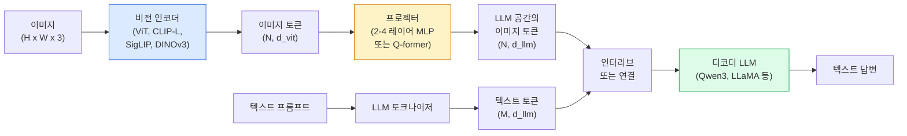

# 비전-언어 모델 — ViT-MLP-LLM 패턴

> 비전 인코더가 이미지를 토큰으로 변환한다. MLP 프로젝터가 그 토큰을 LLM의 임베딩 공간으로 매핑한다. 언어 모델이 나머지를 처리한다. 이 패턴 — ViT-MLP-LLM — 은 2026년의 모든 프로덕션 VLM이다.

**유형:** 학습 + 사용
**언어:** Python
**사전 요구사항:** 4단계 14과(ViT), 4단계 18과(CLIP), 7단계 02과(셀프 어텐션)
**시간:** ~75분

## 학습 목표

- ViT-MLP-LLM 아키텍처를 설명하고 세 가지 구성 요소 각각이 기여하는 바를 설명한다
- Qwen3-VL, InternVL3.5, LLaVA-Next, GLM-4.6V를 매개변수 수, 컨텍스트 길이, 벤치마크 성능별로 비교한다
- DeepStack을 설명한다: 단일 마지막 계층 특징보다 다중 레벨 ViT 특징이 비전-언어 정렬을 더 강화하는 이유
- 프로덕션에서 Cross-Modal Error Rate(CMER)로 VLM 환각을 측정하고 신호에 따라 조치한다

## 문제

CLIP(4단계 18과)은 이미지와 텍스트에 대한 공유 임베딩 공간을 제공하여 제로샷 분류 및 검색에 충분하다. CLIP은 텍스트를 생성하지 않고 유사도만 점수를 매기기 때문에 "이 이미지에 빨간 자동차가 몇 대인가?"에 답할 수 없다.

비전-언어 모델(VLM) — Qwen3-VL, InternVL3.5, LLaVA-Next, GLM-4.6V — 은 CLIP 계열 이미지 인코더를 전체 언어 모델에 연결한다. 모델은 이미지와 질문을 보고 답변을 생성한다. 2026년 오픈소스 VLM은 다중 모달 벤치마크(MMMU, MMBench, DocVQA, ChartQA, MathVista, OSWorld)에서 GPT-5 및 Gemini-2.5-Pro와 경쟁하거나 능가한다.

세 가지 구성 요소(ViT, 프로젝터, LLM)의 조합이 표준이다. 모델 간의 차이는 어떤 ViT, 어떤 프로젝터, 어떤 LLM, 훈련 데이터, 정렬 레시피에 있다. 패턴을 이해하면 어떤 구성 요소를 교체하는 것이 기계적으로 이루어진다.

## 개념

### ViT-MLP-LLM 아키텍처



1. **비전 인코더** — 사전학습된 ViT(CLIP-L/14, SigLIP, DINOv3 또는 미세조정 변형). 패치 토큰을 생성한다.
2. **프로젝터** — 비전 토큰을 LLM의 임베딩 차원으로 매핑하는 작은 모듈(2-4 레이어 MLP 또는 Q-former). 대부분의 미세조정이 여기서 일어난다.
3. **LLM** — 디코더 전용 언어 모델(Qwen3, Llama, Mistral, GLM, InternLM). 비전 + 텍스트 토큰을 순서대로 읽고 텍스트를 생성한다.

세 가지 구성 요소 모두 원칙적으로 훈련 가능하다. 실제로는 비전 인코더와 LLM이 대부분 고정된 상태로 프로젝터가 훈련된다 — 수십억 개의 매개변수 신호를 저렴하게 처리.

### DeepStack

바닐라 프로젝션은 마지막 ViT 계층만 사용한다. DeepStack(Qwen3-VL)은 여러 ViT 깊이에서 특징을 샘플링하고 쌓는다. 더 깊은 계층은 고수준 의미를 전달하고; 더 얕은 계층은 세밀한 공간 및 질감 정보를 전달한다. 둘 다 LLM에 공급하면 "이미지에 무엇이 있는가"(의미)와 "정확히 어디에"(공간 접지) 사이의 간격을 좁힌다.

### 세 가지 훈련 단계

최신 VLM은 단계별로 훈련한다:

1. **정렬** — ViT와 LLM을 고정한다. 이미지-캡션 쌍에서 프로젝터만 훈련한다. 프로젝터가 비전 공간을 언어 공간으로 매핑하는 방법을 가르친다.
2. **사전 훈련** — 모든 것을 고정 해제한다. 대규모 인터리브 이미지-텍스트 데이터(5억+ 쌍)에서 훈련한다. 모델의 시각적 지식을 구축한다.
3. **명령어 튜닝** — 선별된 (이미지, 질문, 답변) 트리플에서 미세조정한다. 대화 행동과 작업 형식을 가르친다. 이것이 "비전 인식 LM"을 사용 가능한 어시스턴트로 바꾸는 것이다.

대부분의 LoRA 미세조정은 작은 레이블된 데이터셋으로 3단계를 대상으로 한다.

### 모델 계열 비교 (2026년 초)

| 모델 | 매개변수 | 비전 인코더 | LLM | 컨텍스트 | 강점 |
|-------|--------|----------------|-----|---------|-----------|
| Qwen3-VL-235B-A22B (MoE) | 235B (22B 활성) | 맞춤 ViT + DeepStack | Qwen3 | 256K | 일반 SOTA, GUI 에이전트 |
| Qwen3-VL-30B-A3B (MoE) | 30B (3B 활성) | 맞춤 ViT + DeepStack | Qwen3 | 256K | 더 작은 MoE 대안 |
| Qwen3-VL-8B (dense) | 8B | 맞춤 ViT | Qwen3 | 128K | 프로덕션 밀집 기본값 |
| InternVL3.5-38B | 38B | InternViT-6B | Qwen3 + GPT-OSS | 128K | 강력한 MMBench / MMVet |
| InternVL3.5-241B-A28B | 241B (28B 활성) | InternViT-6B | Qwen3 | 128K | GPT-4o와 경쟁 |
| LLaVA-Next 72B | 72B | SigLIP | Llama-3 | 32K | 개방형, 미세조정 용이 |
| GLM-4.6V | ~70B | 맞춤 | GLM | 64K | 오픈소스, 강력한 OCR |
| MiniCPM-V-2.6 | 8B | SigLIP | MiniCPM | 32K | 엣지 친화적 |

### 시각 에이전트

Qwen3-VL-235B는 OSWorld — GUI(데스크톱, 모바일, 웹)를 조작하는 **시각 에이전트**를 위한 벤치마크 — 에서 최고 글로벌 성능에 도달한다. 모델은 스크린샷을 보고, UI를 이해하며, 작업(클릭, 입력, 스크롤)을 출력한다. 도구와 결합하여 일반적인 데스크톱 작업에 대한 루프를 닫는다. 이것이 대부분의 2026년 "AI PC" 데모가 내부에서 실행하는 것이다.

### 에이전트 기능 + RoPE 변형

VLM은 비디오에서 프레임이 **언제**인지 알아야 한다. Qwen3-VL은 T-RoPE(시간 회전 위치 임베딩)에서 **텍스트 기반 시간 정렬**로 진화했다 — 비디오 프레임과 인터리브된 명시적 타임스탬프 텍스트 토큰. 모델은 "`<timestamp 00:32>` frame, prompt"를 보고 시간적 관계에 대해 추론할 수 있다.

### 정렬 문제

크롤링된 데이터셋의 이미지-텍스트 쌍 중 12%는 이미지에 완전히 근거하지 않은 설명을 포함한다. 이것으로 훈련된 VLM은 조용히 환각을 학습한다 — 객체를 조작하고, 숫자를 잘못 읽고, 관계를 발명한다. 프로덕션에서 이것이 지배적인 실패 모드이다.

Skywork.ai는 이를 추적하기 위해 **Cross-Modal Error Rate (CMER)** 를 도입했다:

```
CMER = 텍스트 신뢰도는 높지만 이미지-텍스트 유사도(CLIP 계열 검사기 사용)가 낮은 출력의 비율
```

높은 CMER은 모델이 이미지에 근거하지 않은 것을 자신있게 말하고 있다는 의미이다. CMER을 모니터링하고 프로덕션 KPI로 처리하면 그들의 배포에서 환각률을 ~35% 줄였다. 비결은 "모델 수정"이 아니라 "높은 CMER 출력을 인간 검토로 라우팅"하는 것이다.

### LoRA / QLoRA로 미세조정

70B VLM의 전체 미세조정은 대부분의 팀이 접근할 수 없다. 어텐션 + 프로젝터 레이어에 대한 LoRA(랭크 16-64) 또는 4비트 기본 가중치를 사용한 QLoRA는 단일 A100 / H100에 맞는다. 비용: 5,000-50,000 예제, $100-$5,000 컴퓨팅, 2-10시간 훈련.

### 공간 추론은 여전히 약함

현재 VLM은 공간 추론 벤치마크(위-아래, 왼-오른쪽, 세기, 거리)에서 50-60% 점수를 받는다. 사용 사례가 "어느 객체가 어느 위에 있는지"에 의존하는 경우, 철저히 검증하라 — 일반 VLM 성능은 인간 이하이다. 순수 공간 작업을 위한 VLM보다 나은 대안: 특수 키포인트 / 포즈 추정기, 깊이 모델, 또는 상자 기하학이 후처리된 검출 모델.

## 빌드 It

### 단계 1: 프로젝터

가장 자주 훈련하게 될 부분. GELU를 가진 2-4 레이어 MLP.

```python
import torch
import torch.nn as nn


class Projector(nn.Module):
    def __init__(self, vit_dim=768, llm_dim=4096, hidden=4096):
        super().__init__()
        self.net = nn.Sequential(
            nn.Linear(vit_dim, hidden),
            nn.GELU(),
            nn.Linear(hidden, llm_dim),
        )

    def forward(self, x):
        return self.net(x)
```

입력은 `(N_patches, d_vit)` 토큰 텐서이다. 출력은 `(N_patches, d_llm)`이다. LLM은 모든 출력 행을 또 다른 토큰으로 취급한다.

### 단계 2: ViT-MLP-LLM 종단간 조립

최소 VLM의 순방향 패스 스켈레톤. 실제 코드는 `transformers`를 사용; 이것은 개념적 레이아웃이다.

```python
class MinimalVLM(nn.Module):
    def __init__(self, vit, projector, llm, image_token_id):
        super().__init__()
        self.vit = vit
        self.projector = projector
        self.llm = llm
        self.image_token_id = image_token_id  # 텍스트 프롬프트의 플레이스홀더 토큰

    def forward(self, image, input_ids, attention_mask):
        # 1. 비전 특징
        vision_tokens = self.vit(image)                     # (B, N_patches, d_vit)
        vision_embeds = self.projector(vision_tokens)       # (B, N_patches, d_llm)

        # 2. 텍스트 임베딩
        text_embeds = self.llm.get_input_embeddings()(input_ids)  # (B, M, d_llm)

        # 3. 이미지 플레이스홀더 토큰을 비전 임베딩으로 교체
        merged = self._merge(text_embeds, vision_embeds, input_ids)

        # 4. LLM 실행
        return self.llm(inputs_embeds=merged, attention_mask=attention_mask)

    def _merge(self, text_embeds, vision_embeds, input_ids):
        out = text_embeds.clone()
        expected = vision_embeds.size(1)
        for b in range(input_ids.size(0)):
            positions = (input_ids[b] == self.image_token_id).nonzero(as_tuple=True)[0]
            if len(positions) != expected:
                raise ValueError(
                    f"batch item {b} has {len(positions)} image tokens but vision_embeds has {expected} patches."
                    " Batch의 모든 샘플은 동일한 수의 이미지 플레이스홀더 토큰으로 사전 패딩되어야 합니다.")
            out[b, positions] = vision_embeds[b]
        return out
```

텍스트의 `<image>` 플레이스홀더 토큰이 실제 이미지 임베딩으로 교체된다 — LLaVA, Qwen-VL, InternVL이 사용하는 동일한 패턴.

### 단계 3: CMER 계산

경량 런타임 검사.

```python
import torch.nn.functional as F


def cross_modal_error_rate(image_emb, text_emb, text_confidence, sim_threshold=0.25, conf_threshold=0.8):
    """
    image_emb, text_emb: 이미지 및 생성된 텍스트의 임베딩 (내부적으로 정규화됨)
    text_confidence:     [0, 1]의 평균 토큰별 확률
    Returns:             높은 신뢰도 출력 중 이미지-텍스트 정렬이 낮은 비율
    """
    image_emb = F.normalize(image_emb, dim=-1)
    text_emb = F.normalize(text_emb, dim=-1)
    sim = (image_emb * text_emb).sum(dim=-1)        # 코사인 유사도
    high_conf_low_sim = (text_confidence > conf_threshold) & (sim < sim_threshold)
    return high_conf_low_sim.float().mean().item()
```

CMER을 프로덕션 KPI로 처리한다. 엔드포인트별, 프롬프트 유형별, 고객별로 모니터링한다. 상승하는 CMER은 모델이 일부 입력 분포에서 환각을 시작하고 있음을 나타낸다.

### 단계 4: 장난감 VLM 분류기 (실행 가능)

프로젝터가 훈련된다는 것을 보여준다. 가짜 "ViT 특징"이 들어가고; 작은 LLM 스타일 토큰이 클래스를 예측한다.

```python
class ToyVLM(nn.Module):
    def __init__(self, vit_dim=32, llm_dim=64, num_classes=5):
        super().__init__()
        self.projector = Projector(vit_dim, llm_dim, hidden=64)
        self.head = nn.Linear(llm_dim, num_classes)

    def forward(self, vision_tokens):
        projected = self.projector(vision_tokens)
        pooled = projected.mean(dim=1)
        return self.head(pooled)
```

합성(특징, 클래스) 쌍에서 200단계 미만으로 피팅 가능 — 프로젝터 패턴이 작동함을 보여주기에 충분하다.

## 사용 It

2026년 프로덕션 팀이 VLM을 사용하는 세 가지 방법:

- **호스티드 API** — OpenAI Vision, Anthropic Claude Vision, Google Gemini Vision. 제로 인프라, 벤더 리스크.
- **오픈소스 자체 호스팅** — `transformers` 및 `vllm`을 통한 Qwen3-VL 또는 InternVL3.5. 완전한 제어, 더 높은 초기 노력.
- **도메인에 미세조정** — Qwen2.5-VL-7B 또는 LLaVA-1.6-7B 로드, 5k-50k 맞춤 예제에서 LoRA, `vllm` 또는 `TGI`로 서빙.

```python
from transformers import AutoProcessor, AutoModelForVision2Seq
import torch
from PIL import Image

model_id = "Qwen/Qwen3-VL-8B-Instruct"
processor = AutoProcessor.from_pretrained(model_id)
model = AutoModelForVision2Seq.from_pretrained(model_id, torch_dtype=torch.bfloat16, device_map="auto")

messages = [{
    "role": "user",
    "content": [
        {"type": "image", "image": Image.open("plot.png")},
        {"type": "text", "text": "What does this chart show?"},
    ],
}]
inputs = processor.apply_chat_template(messages, add_generation_prompt=True, tokenize=True, return_dict=True, return_tensors="pt").to("cuda")
generated = model.generate(**inputs, max_new_tokens=256)
answer = processor.decode(generated[0][inputs["input_ids"].shape[1]:], skip_special_tokens=True)
```

`apply_chat_template`은 `<image>` 플레이스홀더 토큰화를 숨긴다; 모델이 내부적으로 병합을 처리한다.

## 배송 It

이 과목은 다음을 제공한다:

- `outputs/prompt-vlm-selector.md` — 정확도, 지연 시간, 컨텍스트 길이, 예산에 따라 Qwen3-VL / InternVL3.5 / LLaVA-Next / API를 선택하는 프롬프트.
- `outputs/skill-cmer-monitor.md` — 프로덕션 VLM 엔드포인트를 교차 모달 오류율, 엔드포인트별 대시보드, 알람 임계값으로 계측하는 코드를 제공하는 스킬.

## 연습 문제

1. **(쉬움)** 다섯 개 이미지에서 세 가지 프롬프트("이게 뭐지?", "객체 수를 세어봐", "장면을 설명해봐")를 오픈 VLM을 통해 실행한다. 각 답변을 수동으로 올바름 / 부분적으로 올바름 / 환각으로 채점한다. 첫 번째 통과 CMER 유사 비율을 계산한다.
2. **(중간)** LoRA(랭크 16)로 Qwen2.5-VL-3B 또는 LLaVA-1.6-7B를 캡션이 있는 타겟 도메인의 500개 이미지에 미세조정한다. 제로샷 대비 미세조정된 MMBench 스타일 정확도를 비교한다.
3. **(어려움)** VLM의 이미지 인코더를 기본 SigLIP/CLIP 대신 DINOv3로 교체한다. 프로젝터만 재훈련(고정 LLM + 고정 DINOv3). 밀집 예측 작업(세기, 공간 추론)이 향상되는지 측정한다.

## 주요 용어

| 용어 | 사람들이 말하는 것 | 실제 의미 |
|------|----------------|----------------------|
| ViT-MLP-LLM | "VLM 패턴" | 비전 인코더 + 프로젝터 + 언어 모델; 모든 2026 VLM |
| 프로젝터 | "브리지" | 비전 토큰을 LLM 임베딩 공간으로 매핑하는 2-4 레이어 MLP(또는 Q-former) |
| DeepStack | "Qwen3-VL 특징 트릭" | 마지막 계층만이 아닌 다중 레벨 ViT 특징 스택 |
| 이미지 토큰 | "<image> 플레이스홀더" | 텍스트 스트림에서 투영된 비전 임베딩으로 교체되는 특수 토큰 |
| CMER | "환각 KPI" | Cross-Modal Error Rate; 텍스트 신뢰도는 높지만 이미지-텍스트 유사도가 낮을 때 높음 |
| 시각 에이전트 | "클릭하는 VLM" | 도구 호출로 GUI(OSWorld, 모바일, 웹)를 조작하는 VLM |
| Q-former | "고정 개수 토큰 브리지" | 고정된 수의 시각 쿼리 토큰을 생성하는 BLIP-2 스타일 프로젝터 |
| 정렬 / 사전 훈련 / 명령어 튜닝 | "세 단계" | 표준 VLM 훈련 파이프라인 |

## 추가 읽기

- [Qwen3-VL Technical Report (arXiv 2511.21631)](https://arxiv.org/abs/2511.21631)
- [InternVL3.5 Advancing Open-Source Multimodal Models (arXiv 2508.18265)](https://arxiv.org/html/2508.18265v1)
- [LLaVA-Next series](https://llava-vl.github.io/blog/2024-05-10-llava-next-stronger-llms/)
- [BentoML: Best Open-Source VLMs 2026](https://www.bentoml.com/blog/multimodal-ai-a-guide-to-open-source-vision-language-models)
- [MMMU: Multi-discipline Multimodal Understanding benchmark](https://mmmu-benchmark.github.io/)
- [VLMs in manufacturing (Robotics Tomorrow, March 2026)](https://www.roboticstomorrow.com/story/2026/03/when-machines-learn-to-see-like-experts-the-rise-of-vision-language-models-in-manufacturing/26335/)
