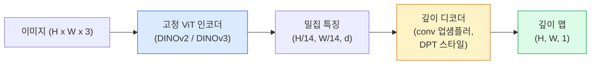

# 단안 깊이 & 기하학 추정

> 깊이 맵은 각 픽셀이 카메라로부터의 거리인 단일 채널 이미지이다. 하나의 RGB 프레임에서 이를 예측하는 것은 스테레오나 LiDAR 없이는 불가능했었다. 2026년에는 고정된 ViT 인코더와 경량 헤드로 정답의 몇 퍼센트 이내에 도달한다.

**유형:** 빌드 + 사용
**언어:** Python
**사전 요구사항:** 4단계 14과(ViT), 4단계 17과(자기지도 비전), 4단계 07과(U-Net)
**시간:** ~60분

## 학습 목표

- 상대 깊이와 메트릭 깊이를 구별하고 각 프로덕션 모델(MiDaS, Marigold, Depth Anything V3, ZoeDepth)이 어느 것을 해결하는지 설명한다
- Depth Anything V3(DINOv2 백본)를 사용하여 캘리브레이션 없이 임의의 단일 이미지에 대한 깊이를 예측한다
- 단안 깊이가 단일 이미지에서 어떻게 작동하는지(원근 단서, 텍스처 그래디언트, 학습된 사전 지식)와 회복할 수 없는 것(절대 스케일, 가려진 기하학)을 설명한다
- 깊이 맵과 핀홀 카메라 내부 파라미터를 사용하여 2D 검출을 3D 포인트로 리프트한다

## 문제

깊이는 2D 컴퓨터 비전에서 누락된 축이다. RGB가 주어지면 이미지 평면에서 사물이 어디에 나타나는지는 알지만, 얼마나 멀리 있는지는 알 수 없다. 깊이 센서(스테레오 리그, LiDAR, ToF)는 이를 직접 해결하지만 비싸고, 깨지기 쉬우며, 범위가 제한적이다.

단안 깊이 추정 — 단일 RGB 프레임에서 깊이 예측 — 은 흐릿하고 신뢰할 수 없는 출력을 생성했다. 2026년까지 대규모 사전학습 인코더가 이를 바꾸었다: Depth Anything V3는 고정된 DINOv2 백본을 사용하여 실내, 실외, 의료, 위성 도메인 전반에 걸쳐 일반화되는 깊이 맵을 생성한다. Marigold는 깊이를 조건부 확산 문제로 재구성한다. ZoeDepth는 실제 메트릭 거리를 회귀한다.

깊이는 또한 2D 검출과 3D 이해 사이의 다리이다: 검출된 상자의 픽셀에 깊이를 곱하면 2D 객체를 3D 포인트 클라우드로 리프트한다. 이것은 모든 AR 폐색 시스템, 모든 장애물 회피 파이프라인, 모든 "컵 집기" 로봇의 핵심이다.

## 개념

### 상대 vs 메트릭 깊이

- **상대 깊이** — 실제 세계 단위가 없는 정렬된 `z` 값. "픽셀 A가 픽셀 B보다 가깝지만 거리 비율이 미터로 고정되지는 않음."
- **메트릭 깊이** — 카메라로부터의 절대 거리(미터). 모델이 이미지 단서와 실제 거리 사이의 통계적 관계를 학습해야 함.

MiDaS와 Depth Anything V3는 상대 깊이를 생성한다. Marigold는 상대 깊이를 생성한다. ZoeDepth, UniDepth, Metric3D는 메트릭 깊이를 생성한다. 메트릭 모델은 카메라 내부 파라미터에 민감하다; 상대 모델은 그렇지 않다.

### 인코더-디코더 패턴



Depth Anything V3는 인코더를 고정하고 DPT 스타일 디코더만 훈련한다. 인코더는 풍부한 특징을 제공하고; 디코더는 이를 이미지 해상도로 보간하고 깊이를 회귀한다.

### 단일 이미지가 깊이를 생성하는 이유

2D 이미지에는 깊이와 상관관계가 있는 많은 단안 단서가 포함되어 있다:

- **원근법** — 3D의 평행선이 2D에서 수렴한다.
- **텍스처 그래디언트** — 먼 표면은 더 작고 밀집된 텍스처를 가진다.
- **폐색 순서** — 가까운 객체가 먼 객체를 가린다.
- **크기 항상성** — 알려진 객체(자동차, 사람)가 대략적인 스케일을 제공한다.
- **대기 원근법** — 실외 장면에서 먼 객체가 더 흐릿하고 푸르게 보인다.

수십억 개의 이미지에서 훈련된 ViT는 이러한 단서를 내면화한다. 충분한 데이터와 강력한 백본으로, 단안 깊이는 명시적 3D 감독 없이도 합리적인 정확도에 도달한다.

### 단안 깊이가 할 수 없는 것

- **절대 메트릭 스케일** — 내부 파라미터나 장면 내 알려진 객체 없이는 불가능. 네트워크는 "컵이 숟가락보다 두 배 멀다"라고 예측할 수 있지만 컵이 1m인지 10m인지는 알 수 없다.
- **가려진 기하학** — 의자의 뒷면은 보이지 않으며 안정적으로 추론할 수 없다.
- **진정한 무질감/반사 표면** — 거울, 유리, 균일한 벽. 네트워크는 그럴듯하지만 잘못된 깊이를 보고한다.

### 2026년의 Depth Anything V3

- 바닐라 DINOv2 ViT-L/14를 인코더로 사용(고정).
- DPT 디코더.
- 다양한 소스의 포즈가 있는 이미지 쌍에서 훈련(광도 일관성 이상의 명시적 깊이 감독 불필요).
- **알려진 카메라 포즈 유무에 관계없이 임의의 수의 시각 입력**에서 공간적으로 일관된 기하학을 예측한다.
- 단안 깊이, 임의 뷰 기하학, 시각 렌더링, 카메라 포즈 추정 전반에 걸친 SOTA.

이것이 2026년에 깊이가 필요할 때 호출할 드롭인 모델이다.

### Marigold — 깊이를 위한 확산

Marigold(Ke et al., CVPR 2024)는 깊이 추정을 조건부 이미지-투-이미지 확산으로 재구성한다. 조건화: RGB. 타겟: 깊이 맵. 사전학습된 Stable Diffusion 2 U-Net을 백본으로 사용한다. 출력 깊이 맵은 객체 경계에서 예외적으로 선명하다. 절충: 피드포워드 모델보다 느린 추론(10-50 노이즈 제거 단계).

### 내부 파라미터와 핀홀 카메라

픽셀 `(u, v)`를 깊이 `d`로 카메라 좌표의 3D 포인트 `(X, Y, Z)`로 리프트하려면:

```
fx, fy, cx, cy = camera intrinsics
X = (u - cx) * d / fx
Y = (v - cy) * d / fy
Z = d
```

내부 파라미터는 EXIF 메타데이터, 캘리브레이션 패턴, 또는 단안 내부 파라미터 추정기(Perspective Fields, UniDepth)에서 온다. 내부 파라미터 없이도 60-70° FOV와 적당한 해상도 원칙을 가정하여 포인트 클라우드를 렌더링할 수 있다 — 측정이 아닌 시각화에 사용 가능.

### 평가

두 가지 표준 지표:

- **AbsRel (절대 상대 오차)**: `mean(|d_pred - d_gt| / d_gt)`. 낮을수록 좋음. 프로덕션 모델에서 0.05-0.1.
- **delta < 1.25 (임계값 정확도)**: `max(d_pred/d_gt, d_gt/d_pred) < 1.25`인 픽셀의 비율. 높을수록 좋음. SOTA에서 0.9+.

상대 깊이(Depth Anything V3, MiDaS)의 경우, 두 지표의 스케일-및-시프트 불변 버전을 사용하여 평가한다.

## 빌드 It

### 단계 1: 깊이 지표

```python
import torch

def abs_rel_error(pred, target, mask=None):
    if mask is not None:
        pred = pred[mask]
        target = target[mask]
    return (torch.abs(pred - target) / target.clamp(min=1e-6)).mean().item()


def delta_accuracy(pred, target, threshold=1.25, mask=None):
    if mask is not None:
        pred = pred[mask]
        target = target[mask]
    ratio = torch.maximum(pred / target.clamp(min=1e-6), target / pred.clamp(min=1e-6))
    return (ratio < threshold).float().mean().item()
```

평가 전에 항상 유효하지 않은 깊이 픽셀(0, NaN, 포화)을 마스킹한다.

### 단계 2: 스케일-및-시프트 정렬

상대 깊이 모델의 경우, 지표를 계산하기 전에 예측을 정답에 정렬한다. `a * pred + b = target`의 최소제곱 피팅:

```python
def align_scale_shift(pred, target, mask=None):
    if mask is not None:
        p = pred[mask]
        t = target[mask]
    else:
        p = pred.flatten()
        t = target.flatten()
    A = torch.stack([p, torch.ones_like(p)], dim=1)
    coeffs, *_ = torch.linalg.lstsq(A, t.unsqueeze(-1))
    a, b = coeffs[:2, 0]
    return a * pred + b
```

MiDaS / Depth Anything을 평가할 때 `align_scale_shift`를 `abs_rel_error` 전에 실행한다.

### 단계 3: 깊이를 포인트 클라우드로 리프트

```python
import numpy as np

def depth_to_point_cloud(depth, intrinsics):
    H, W = depth.shape
    fx, fy, cx, cy = intrinsics
    v, u = np.meshgrid(np.arange(H), np.arange(W), indexing="ij")
    z = depth
    x = (u - cx) * z / fx
    y = (v - cy) * z / fy
    return np.stack([x, y, z], axis=-1)


depth = np.random.uniform(0.5, 4.0, (240, 320))
intr = (320.0, 320.0, 160.0, 120.0)
pc = depth_to_point_cloud(depth, intr)
print(f"point cloud shape: {pc.shape}  (H, W, 3)")
```

하나의 함수, 모든 3D 리프트 응용 프로그램. 포인트 클라우드를 `.ply`로 내보내고 MeshLab 또는 CloudCompare에서 연다.

### 단계 4: 합성 깊이 장면으로 연기 테스트

```python
def synthetic_depth(size=96):
    yy, xx = np.meshgrid(np.arange(size), np.arange(size), indexing="ij")
    # 바닥: 가까움(위)에서 멂(아래)으로 선형 그래디언트
    depth = 1.0 + (yy / size) * 4.0
    # 중간의 상자: 더 가까움
    mask = (np.abs(xx - size / 2) < size / 6) & (np.abs(yy - size * 0.6) < size / 6)
    depth[mask] = 2.0
    return depth.astype(np.float32)


gt = torch.from_numpy(synthetic_depth(96))
pred = gt + 0.3 * torch.randn_like(gt)
aligned = align_scale_shift(pred, gt)
print(f"before align  absRel = {abs_rel_error(pred, gt):.3f}")
print(f"after align   absRel = {abs_rel_error(aligned, gt):.3f}")
```

### 단계 5: Depth Anything V3 사용법 (참조)

```python
import torch
from transformers import pipeline
from PIL import Image

pipe = pipeline(task="depth-estimation", model="LiheYoung/depth-anything-v2-large")

image = Image.open("street.jpg").convert("RGB")
out = pipe(image)
depth_np = np.array(out["depth"])
```

세 줄. `out["depth"]`는 PIL 회색조; 수학을 위해 numpy로 변환. Depth Anything V3의 경우, 출시되면 모델 ID를 교체; API는 변경되지 않는다.

## 사용 It

- **Depth Anything V3** (Meta AI / ByteDance, 2024-2026) — 상대 깊이의 기본값. 프로덕션에서 가장 빠른 ViT-large-백본 모델.
- **Marigold** (ETH, 2024) — 가장 높은 시각적 품질, 느린 추론.
- **UniDepth** (ETH, 2024) — 카메라 내부 파라미터 추정이 포함된 메트릭 깊이.
- **ZoeDepth** (Intel, 2023) — 메트릭 깊이; 오래되었지만 여전히 신뢰할 수 있음.
- **MiDaS v3.1** — 레거시지만 안정적; 비교를 위한 좋은 기준선.

일반적인 통합 패턴:

1. RGB 프레임 도착.
2. 깊이 모델이 깊이 맵 생성.
3. 검출기가 상자 생성.
4. 상자 중심을 깊이를 통해 3D로 리프트; 가능하면 포인트 클라우드와 병합.
5. 하류: AR 폐색, 경로 계획, 객체 크기 추정, 스테레오 대체.

실시간 사용의 경우, Depth Anything V2 Small(INT8 양자화)은 518x518에서 소비자 GPU에서 ~30fps에 도달한다.

## 배송 It

이 과목은 다음을 제공한다:

- `outputs/prompt-depth-model-picker.md` — 지연 시간, 메트릭-vs-상대 필요, 장면 유형에 따라 Depth Anything V3, Marigold, UniDepth, MiDaS 중에서 선택하는 프롬프트.
- `outputs/skill-depth-to-pointcloud.md` — 올바른 내부 파라미터 처리와 `.ply` 내보내기로 깊이 맵에서 포인트 클라우드를 구축하는 스킬.

## 연습 문제

1. **(쉬움)** Depth Anything V2를 책상의 10개 이미지에서 실행한다. 깊이를 회색조 PNG로 저장하고 검사한다. 예측된 깊이가 잘못된 것처럼 보이는 한 객체를 식별하고 단안 단서가 실패한 이유를 설명한다.
2. **(중간)** RGB + Depth Anything V2의 깊이가 주어지면, 포인트 클라우드로 리프트하고 `open3d`로 렌더링한다. 두 장면(실내/실외)을 비교하고 어느 것이 더 그럴듯해 보이는지 기록한다.
3. **(어려움)** 알려진 객체의 위치만 다른 다섯 쌍의 이미지를 가져온다(예: 병을 30cm 더 가까이 이동). UniDepth를 사용하여 둘 다에서 메트릭 깊이를 예측한다. 예측된 거리 델타 대 실제 30cm를 보고한다.

## 주요 용어

| 용어 | 사람들이 말하는 것 | 실제 의미 |
|------|----------------|----------------------|
| 단안 깊이 | "단일 이미지 깊이" | 하나의 RGB 프레임에서 깊이 추정, 스테레오나 LiDAR 없음 |
| 상대 깊이 | "정렬된 깊이" | 실제 세계 단위 없는 정렬된 z-값 |
| 메트릭 깊이 | "절대 거리" | 미터 단위의 깊이; 캘리브레이션 또는 메트릭 감독으로 훈련된 모델 필요 |
| AbsRel | "절대 상대 오차" | 평균 \|d_pred - d_gt\| / d_gt; 표준 깊이 지표 |
| 델타 정확도 | "delta < 1.25" | 예측이 정답의 25% 이내인 픽셀의 비율 |
| 핀홀 카메라 | "fx, fy, cx, cy" | (u, v, d)를 (X, Y, Z)로 리프트하는 데 사용되는 카메라 모델 |
| DPT | "Dense Prediction Transformer" | 깊이를 위해 고정 ViT 인코더 위에 사용되는 conv 기반 디코더 |
| DINOv2 백본 | "작동하는 이유" | 깊이 레이블 없이 도메인 전반에 걸쳐 일반화되는 자기지도 특징 |

## 추가 읽기

- [Depth Anything V3 paper page](https://depth-anything.github.io/) — DINOv2 인코더를 사용한 SOTA 단안 깊이
- [Marigold (Ke et al., CVPR 2024)](https://marigoldmonodepth.github.io/) — 확산 기반 깊이 추정
- [UniDepth (Piccinelli et al., 2024)](https://arxiv.org/abs/2403.18913) — 내부 파라미터가 있는 메트릭 깊이
- [MiDaS v3.1 (Intel ISL)](https://github.com/isl-org/MiDaS) — 표준 상대 깊이 기준선
- [DINOv3 blog post (Meta)](https://ai.meta.com/blog/dinov3-self-supervised-vision-model/) — 깊이 정확도를 높이는 인코더 계열
