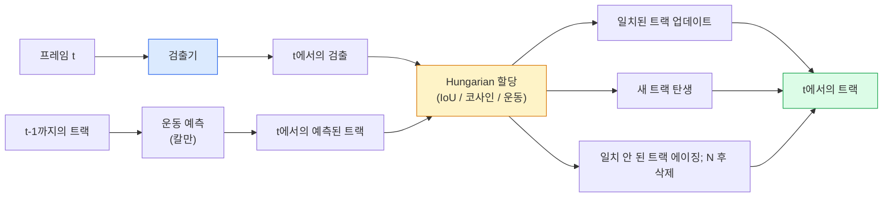

# 다중 객체 추적 & 비디오 메모리

> 추적은 검출 + 연관이다. 모든 프레임을 검출한다. 이번 프레임의 검출을 지난 프레임의 트랙과 ID별로 일치시킨다.

**유형:** 빌드
**언어:** Python
**사전 요구사항:** 4단계 06과(YOLO 검출), 4단계 08과(Mask R-CNN), 4단계 24과(SAM 3)
**시간:** ~60분

## 학습 목표

- 추적-바이-검출과 쿼리 기반 추적을 구별하고 알고리즘 계열(SORT, DeepSORT, ByteTrack, BoT-SORT, SAM 2 메모리 추적기, SAM 3.1 Object Multiplex)을 명명한다
- 고전적 추적-바이-검출을 위한 IoU + Hungarian 할당을 처음부터 구현한다
- SAM 2의 메모리 뱅크와 IoU 기반 연관보다 폐색을 더 잘 처리하는 이유를 설명한다
- 세 가지 추적 지표(MOTA, IDF1, HOTA)를 읽고 주어진 사용 사례에 어느 것이 중요한지 선택한다

## 문제

검출기는 단일 프레임에서 객체가 어디에 있는지 알려준다. 추적기는 프레임 `t`의 어떤 검출이 프레임 `t-1`의 검출과 동일한 객체인지 알려준다. 이것이 없으면, 선을 교차하는 객체를 세거나, 폐색을 통해 공을 추적하거나, "자동차 #4가 8초 동안 차선에 있었다"를 알 수 없다.

추적은 모든 비디오 관련 제품에 필수적이다: 스포츠 분석, 감시, 자율주행, 의료 비디오 분석, 야생동물 모니터링, 워드마크 카운팅. 핵심 빌딩 블록은 공유된다: 프레임별 검출기, 운동 모델(칼만 필터 또는 더 풍부한 것), 연관 단계(IoU / 코사인 / 학습된 특징에 대한 Hungarian 알고리즘), 트랙 생애 주기(탄생, 업데이트, 사망).

2026년은 두 가지 새로운 패턴을 가져왔다: **SAM 2 메모리 기반 추적**(운동 모델 연관 대신 특징-메모리)과 **SAM 3.1 Object Multiplex**(동일한 개념의 많은 인스턴스를 위한 공유 메모리). 이 과목은 먼저 고전적 스택을, 그 다음 메모리 기반 접근법을 다룬다.

## 개념

### 추적-바이-검출



2026년에 만나게 될 모든 추적기는 이 루프의 변형이다. 차이점:

- **SORT** (2016): 칼만 필터 + IoU Hungarian. 간단함, 빠름, 외관 모델 없음.
- **DeepSORT** (2017): SORT + 트랙당 CNN 기반 외관 특징(ReID 임베딩). 교차 처리 개선.
- **ByteTrack** (2021): 낮은 신뢰도 검출을 두 번째 단계로 연관; 외관 특징 불필요하지만 MOT17에서 최고 성능.
- **BoT-SORT** (2022): Byte + 카메라 움직임 보정 + ReID.
- **StrongSORT / OC-SORT** — ByteTrack 후손, 더 나은 운동 및 외관.

### 칼만 필터를 한 단락으로

칼만 필터는 트랙별 상태 `(x, y, w, h, dx, dy, dw, dh)`를 공분산과 함께 유지한다. 각 프레임에서, 등속 모델을 사용하여 상태를 **예측**한 다음, 일치된 검출로 **업데이트**한다. 업데이트는 예측 불확실성이 높을 때 검출을 더 신뢰한다. 이것은 부드러운 궤적과 짧은 폐색(1-5프레임)을 통한 트랙 지속 능력을 제공한다.

모든 고전적 추적기는 운동 예측 단계에서 칼만 필터를 사용한다.

### Hungarian 알고리즘

`M x N` 비용 행렬(트랙 x 검출)이 주어지면, 총 비용을 최소화하는 일대일 할당을 찾는다. 비용은 일반적으로 `1 - IoU(track_bbox, detection_bbox)` 또는 외관 특징의 음의 코사인 유사도이다. 런타임은 O((M+N)^3); M, N이 최대 ~1000일 때 `scipy.optimize.linear_sum_assignment`를 통해 Python에서 충분히 빠르다.

### ByteTrack의 핵심 아이디어

표준 추적기는 낮은 신뢰도 검출(< 0.5)을 버린다. ByteTrack은 이를 **두 번째 단계 후보**로 유지한다: 트랙을 높은 신뢰도 검출에 일치시킨 후, 일치되지 않은 트랙은 약간 더 느슨한 IoU 임계값으로 낮은 신뢰도 검출과 일치를 시도한다. 짧은 폐색, 군중 근처의 ID 전환을 복구한다.

### SAM 2 메모리 기반 추적

SAM 2는 인스턴스별 시공간 특징의 **메모리 뱅크**를 유지하여 비디오를 처리한다. 한 프레임에서 프롬프트(클릭, 상자, 텍스트)가 주어지면, 인스턴스를 메모리에 인코딩한다. 이후 프레임에서, 메모리는 새 프레임의 특징에 대해 크로스-어텐션되고, 디코더는 새 프레임에서 동일한 인스턴스에 대한 마스크를 생성한다.

칼만 필터 없음, Hungarian 할당 없음. 연관은 메모리-어텐션 연산에 암시적이다.

장점:
- 큰 폐색에 강함(메모리가 여러 프레임에 걸쳐 인스턴스 정체성을 유지).
- SAM 3의 텍스트 프롬프트와 결합될 때 개방 어휘.
- 별도의 운동 모델 없이 작동.

단점:
- 많은 객체 추적에서 ByteTrack보다 느림.
- 메모리 뱅크 증가; 컨텍스트 윈도우 제한.

### SAM 3.1 Object Multiplex

이전 SAM 2 / SAM 3 추적은 인스턴스당 별도의 메모리 뱅크를 유지했다. 50개 객체에 50개 메모리 뱅크. Object Multiplex(2026년 3월)는 **인스턴스별 쿼리 토큰**을 가진 하나의 공유 메모리로 축소한다. 비용은 인스턴스 수에 대해 하위 선형으로 확장된다.

Multiplex는 2026년 군중 추적의 새로운 기본값이다: 콘서트 군중, 창고 작업자, 교차로.

### 알아야 할 세 가지 지표

- **MOTA (다중 객체 추적 정확도)** — 1 - (FN + FP + ID 전환) / GT. 오류 유형별 가중치; 검출과 연관 실패를 혼합하는 단일 지표.
- **IDF1 (ID F1)** — ID 정밀도와 재현율의 조화 평균. 각 정답 트랙이 시간이 지남에 따라 ID를 얼마나 잘 유지하는지에 특별히 초점. ID-전환 민감 작업에서 MOTA보다 나음.
- **HOTA (고차 추적 정확도)** — 검출 정확도(DetA)와 연관 정확도(AssA)로 분해. 2020년 이후 커뮤니티 표준; 가장 포괄적.

감시(누가 누군지): IDF1을 보고한다. 스포츠 분석(패스 카운팅): HOTA. 일반 학술 비교: HOTA.

## 빌드 It

### 단계 1: IoU 기반 비용 행렬

```python
import numpy as np


def bbox_iou(a, b):
    """
    a, b: (N, 4) [x1, y1, x2, y2] 배열.
    (N_a, N_b) IoU 행렬 반환.
    """
    ax1, ay1, ax2, ay2 = a[:, 0], a[:, 1], a[:, 2], a[:, 3]
    bx1, by1, bx2, by2 = b[:, 0], b[:, 1], b[:, 2], b[:, 3]
    inter_x1 = np.maximum(ax1[:, None], bx1[None, :])
    inter_y1 = np.maximum(ay1[:, None], by1[None, :])
    inter_x2 = np.minimum(ax2[:, None], bx2[None, :])
    inter_y2 = np.minimum(ay2[:, None], by2[None, :])
    inter = np.clip(inter_x2 - inter_x1, 0, None) * np.clip(inter_y2 - inter_y1, 0, None)
    area_a = (ax2 - ax1) * (ay2 - ay1)
    area_b = (bx2 - bx1) * (by2 - by1)
    union = area_a[:, None] + area_b[None, :] - inter
    return inter / np.clip(union, 1e-8, None)
```

### 단계 2: 최소 SORT 스타일 추적기

등속 칼만은 간결함을 위해 생략 — 여기서는 간단한 IoU 연관을 사용; 프로덕션에서는 칼만 예측이 필수적이다. `sort` Python 패키지가 전체 버전을 제공한다.

```python
from scipy.optimize import linear_sum_assignment


class Track:
    def __init__(self, tid, bbox, frame):
        self.id = tid
        self.bbox = bbox
        self.last_frame = frame
        self.hits = 1

    def update(self, bbox, frame):
        self.bbox = bbox
        self.last_frame = frame
        self.hits += 1


class SimpleTracker:
    def __init__(self, iou_threshold=0.3, max_age=5):
        self.tracks = []
        self.next_id = 1
        self.iou_threshold = iou_threshold
        self.max_age = max_age

    def step(self, detections, frame):
        if not self.tracks:
            for d in detections:
                self.tracks.append(Track(self.next_id, d, frame))
                self.next_id += 1
            return [(t.id, t.bbox) for t in self.tracks]

        track_boxes = np.array([t.bbox for t in self.tracks])
        det_boxes = np.array(detections) if len(detections) else np.empty((0, 4))

        iou = bbox_iou(track_boxes, det_boxes) if len(det_boxes) else np.zeros((len(track_boxes), 0))
        cost = 1 - iou
        cost[iou < self.iou_threshold] = 1e6

        matched_track = set()
        matched_det = set()
        if cost.size > 0:
            row, col = linear_sum_assignment(cost)
            for r, c in zip(row, col):
                if cost[r, c] < 1.0:
                    self.tracks[r].update(det_boxes[c], frame)
                    matched_track.add(r); matched_det.add(c)

        for i, d in enumerate(det_boxes):
            if i not in matched_det:
                self.tracks.append(Track(self.next_id, d, frame))
                self.next_id += 1

        self.tracks = [t for t in self.tracks if frame - t.last_frame <= self.max_age]
        return [(t.id, t.bbox) for t in self.tracks]
```

60줄. 프레임별 검출을 받아 프레임별 트랙 ID를 반환한다. 실제 시스템은 칼만 예측, ByteTrack의 두 번째 단계 재일치, 외관 특징을 추가한다.

### 단계 3: 합성 궤적 테스트

```python
def synthetic_frames(num_frames=20, num_objects=3, H=240, W=320, seed=0):
    rng = np.random.default_rng(seed)
    starts = rng.uniform(20, 200, size=(num_objects, 2))
    velocities = rng.uniform(-5, 5, size=(num_objects, 2))
    frames = []
    for f in range(num_frames):
        dets = []
        for i in range(num_objects):
            cx, cy = starts[i] + f * velocities[i]
            dets.append([cx - 10, cy - 10, cx + 10, cy + 10])
        frames.append(dets)
    return frames


tracker = SimpleTracker()
for f, dets in enumerate(synthetic_frames()):
    tracks = tracker.step(dets, f)
```

직선으로 움직이는 세 객체는 20개 프레임 전체에서 ID를 유지해야 한다.

### 단계 4: ID-전환 지표

```python
def count_id_switches(tracks_per_frame, gt_per_frame):
    """
    tracks_per_frame:  (track_id, bbox) 리스트의 리스트
    gt_per_frame:      (gt_id, bbox) 리스트의 리스트
    ID 전환 수 반환.
    """
    prev_assignment = {}
    switches = 0
    for tracks, gts in zip(tracks_per_frame, gt_per_frame):
        if not tracks or not gts:
            continue
        t_boxes = np.array([b for _, b in tracks])
        g_boxes = np.array([b for _, b in gts])
        iou = bbox_iou(g_boxes, t_boxes)
        for g_idx, (gt_id, _) in enumerate(gts):
            j = iou[g_idx].argmax()
            if iou[g_idx, j] > 0.5:
                t_id = tracks[j][0]
                if gt_id in prev_assignment and prev_assignment[gt_id] != t_id:
                    switches += 1
                prev_assignment[gt_id] = t_id
    return switches
```

이것은 단순화된 IDF1-인접 지표이다: 정답 객체가 할당된 예측 트랙 ID를 변경한 횟수를 계산한다. 실제 MOTA / IDF1 / HOTA 도구는 `py-motmetrics`와 `TrackEval`에 있다.

## 사용 It

2026년 프로덕션 추적기:

- `ultralytics` — YOLOv8 + ByteTrack / BoT-SORT 내장. `results = model.track(source, tracker="bytetrack.yaml")`. 기본값.
- `supervision` (Roboflow) — ByteTrack 래퍼 + 주석 유틸리티.
- SAM 2 / SAM 3.1 — `processor.track()`을 통한 메모리 기반 추적.
- 맞춤 스택: 검출기(YOLOv8 / RT-DETR) + `sort-tracker` / `OC-SORT` / `StrongSORT`.

선택:

- 30+ fps의 보행자 / 자동차 / 상자: **ultralytics로 ByteTrack**.
- 군중에서 한 클래스의 많은 인스턴스: **SAM 3.1 Object Multiplex**.
- 식별 가능한 외관이 있는 심한 폐색: **DeepSORT / StrongSORT** (ReID 특징).
- 스포츠 / 복잡한 상호작용: **BoT-SORT** 또는 학습된 추적기(MOTRv3).

## 배송 It

이 과목은 다음을 제공한다:

- `outputs/prompt-tracker-picker.md` — 장면 유형, 폐색 패턴, 지연 시간 예산에 따라 SORT / ByteTrack / BoT-SORT / SAM 2 / SAM 3.1을 선택하는 프롬프트.
- `outputs/skill-mot-evaluator.md` — 정답 트랙에 대한 MOTA / IDF1 / HOTA의 완전한 평가 하네스를 작성하는 스킬.

## 연습 문제

1. **(쉬움)** 위의 합성 추적기를 3, 10, 30개 객체로 실행한다. 각 경우의 ID-전환 수를 보고한다. 단순 IoU 전용 연관이 실패하기 시작하는 지점을 식별한다.
2. **(중간)** 연관 전에 등속 칼만 예측 단계를 추가한다. 짧은(2-3프레임) 폐색이 더 이상 ID 전환을 일으키지 않음을 보여준다.
3. **(어려움)** SAM 2의 메모리 기반 추적기(`transformers` 통해)를 대체 추적기 백엔드로 통합한다. 30초 군중 클립에서 SimpleTracker와 SAM 2를 모두 실행하고 ID-전환 수를 비교하며, 5명의 두드러진 사람에 대한 정답 ID를 수동으로 레이블링한다.

## 주요 용어

| 용어 | 사람들이 말하는 것 | 실제 의미 |
|------|----------------|----------------------|
| 추적-바이-검출 | "검출 후 연관" | 프레임별 검출기 + IoU/외관에 대한 Hungarian 할당 |
| 칼만 필터 | "운동 예측" | 선형 동역학 + 공분산으로 부드러운 트랙 예측 및 폐색 처리 |
| Hungarian 알고리즘 | "최적 할당" | 최소 비용 이분 매칭 문제 해결; `scipy.optimize.linear_sum_assignment` |
| ByteTrack | "낮은 신뢰도 두 번째 패스" | 일치되지 않은 트랙을 낮은 신뢰도 검출과 재일치시켜 짧은 폐색 복구 |
| DeepSORT | "SORT + 외관" | 프레임 간 매칭을 위한 ReID 특징 추가; ID 보존에 더 좋음 |
| 메모리 뱅크 | "SAM 2 트릭" | 프레임 전체에 저장된 인스턴스별 시공간 특징; 크로스-어텐션이 명시적 연관 대체 |
| Object Multiplex | "SAM 3.1 공유 메모리" | 빠른 다중 객체 추적을 위한 인스턴스별 쿼리를 가진 단일 공유 메모리 |
| HOTA | "현대 추적 지표" | 검출 및 연관 정확도로 분해; 커뮤니티 표준 |

## 추가 읽기

- [SORT (Bewley et al., 2016)](https://arxiv.org/abs/1602.00763) — 최소 추적-바이-검출 논문
- [DeepSORT (Wojke et al., 2017)](https://arxiv.org/abs/1703.07402) — 외관 특징 추가
- [ByteTrack (Zhang et al., 2022)](https://arxiv.org/abs/2110.06864) — 낮은 신뢰도 두 번째 패스
- [BoT-SORT (Aharon et al., 2022)](https://arxiv.org/abs/2206.14651) — 카메라 움직임 보정
- [HOTA (Luiten et al., 2020)](https://arxiv.org/abs/2009.07736) — 분해된 추적 지표
- [SAM 2 video segmentation (Meta, 2024)](https://ai.meta.com/sam2/) — 메모리 기반 추적기
- [SAM 3.1 Object Multiplex (Meta, March 2026)](https://ai.meta.com/blog/segment-anything-model-3/)
