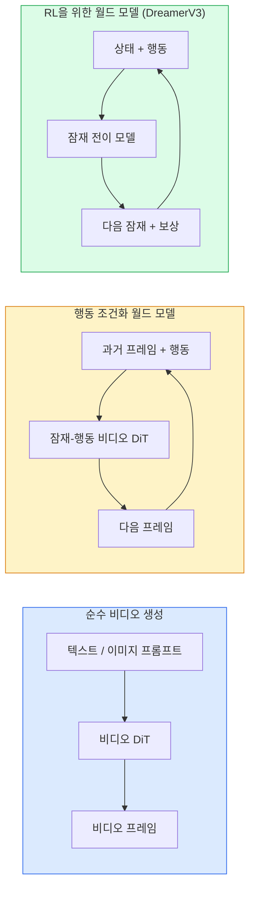

# 월드 모델 & 비디오 확산

> 장면의 다음 몇 초를 예측하는 비디오 모델은 월드 시뮬레이터이다. 그 예측을 행동에 조건화하면 학습된 게임 엔진을 가진다.

**유형:** 학습 + 빌드
**언어:** Python
**사전 요구사항:** 4단계 10과(확산), 4단계 12과(비디오 이해), 4단계 23과(DiT + Rectified Flow)
**시간:** ~75분

## 학습 목표

- 순수 비디오 생성 모델(Sora 2)과 행동 조건화 월드 모델(Genie 3, DreamerV3)의 차이를 설명한다
- 비디오 DiT를 설명한다: 시공간 패치, 3D 위치 인코딩, (T, H, W) 토큰 전반의 공동 어텐션
- 월드 모델이 로보틱스에 어떻게 연결되는지 추적한다: VLM 계획 → 비디오 모델 시뮬레이션 → 역동역학이 행동 출력
- 주어진 사용 사례(창의적 비디오, 대화형 시뮬레이터, 자율주행 합성)에 대해 Sora 2, Genie 3, Runway GWM-1 Worlds, Wan-Video, HunyuanVideo 중에서 선택한다

## 문제

비디오 생성과 월드 모델링은 2026년에 수렴했다. 일관된 1분 비디오를 생성할 수 있는 모델은 어떤 의미에서 세상이 어떻게 움직이는지 배웠다: 객체 영속성, 중력, 인과성, 스타일. 그 예측을 행동(왼쪽으로 걷기, 문 열기)에 조건화하면, 비디오 모델은 게임 엔진, 운전 시뮬레이터, 또는 로보틱스 환경을 대체할 수 있는 학습 가능한 시뮬레이터가 된다.

그 중요성은 구체적이다. Genie 3는 단일 이미지에서 플레이 가능한 환경을 생성한다. Runway GWM-1 Worlds는 무한한 탐험 가능한 장면을 합성한다. Sora 2는 동기화된 오디오와 모델링된 물리 법칙을 가진 1분 비디오를 생성한다. NVIDIA Cosmos-Drive, Wayve Gaia-2, Tesla DrivingWorld는 자율주행차 훈련 데이터를 위한 사실적인 운전 비디오를 생성한다. 월드 모델 패러다임은 로보틱스에서 시뮬-투-리얼을 조용히 장악하고 있다.

이 과목은 4단계의 "큰 그림" 수업이다. 이미지 생성, 비디오 이해, 에이전트 추론을 연구가 향해 나아가고 있는 아키텍처 패턴으로 연결한다.

## 개념

### 월드 모델링의 세 가지 계열



- **Sora 2**는 프롬프트에 조건화된 순수 비디오 생성이다. 행동 인터페이스 없음. 중간에 "조종"할 수 없다.
- **Genie 3**, **GWM-1 Worlds**, **Mirage / Magica**는 행동 조건화 월드 모델이다. 관찰된 비디오에서 잠재 행동을 추론한 다음, 미래 프레임 예측을 행동에 조건화한다. 대화형 — 키를 누르거나 카메라를 움직이면 장면이 반응한다.
- **DreamerV3**와 고전적 RL 월드 모델 계열은 명시적 행동 조건화로 잠재 공간에서 예측하며, 보상 신호로 훈련된다. 덜 시각적; 샘플 효율적인 RL에 더 유용.

### 비디오 DiT 아키텍처

```
비디오 잠재:          (C, T, H, W)
패치화 (공간):    프레임당 P_h x P_w 패치 격자
패치화 (시간):   P_t 프레임을 시간 패치로 그룹화
결과 토큰:      (T / P_t) * (H / P_h) * (W / P_w) 토큰
```

위치 인코딩은 3D이다: (t, h, w) 좌표당 회전 또는 학습된 임베딩. 어텐션은 다음과 같을 수 있다:

- **전체 공동** — 모든 토큰이 모든 토큰에 어텐션. N 토큰에 대해 O(N^2). 긴 비디오에 금지적.
- **분할** — 시간 어텐션(동일 공간 위치, 시간 전체: `(H*W) * T^2`)과 공간 어텐션(동일 시간 단계, 공간 전체: `T * (H*W)^2`)을 번갈아. TimeSformer와 대부분의 비디오 DiT에서 사용.
- **윈도우** — (t, h, w)의 로컬 윈도우. Video Swin에서 사용.

모든 2026년 비디오 확산 모델은 이 세 가지 패턴 중 하나와 AdaLN 조건화(23과) 및 rectified flow를 사용한다.

### 행동에 조건화: 잠재 행동 모델

Genie는 연속된 프레임 쌍 사이의 행동을 판별적으로 예측하여 프레임당 **잠재 행동**을 학습한다. 모델의 디코더는 추론된 잠재 행동에 조건화한다 — 명시적 키보드 키가 아니다. 추론 시, 사용자는 잠재 행동을 지정하거나(또는 새로운 사전에서 샘플링)하고 모델은 그 행동과 일관된 다음 프레임을 생성한다.

Sora는 행동 인터페이스를 완전히 건너뛴다. 디코더는 과거 시공간 토큰에서 다음 시공간 토큰을 예측한다. 프롬프트는 시작을 조건화하며; 아무것도 중간에 조종하지 않는다.

### 물리적 그럴듯함

Sora 2의 2026년 릴리스는 명시적으로 **물리적 그럴듯함**을 광고했다: 무게, 균형, 객체 영속성, 원인-결과. 팀이 수동 평가된 그럴듯함 점수로 측정; 모델은 Sora 1에 비해 떨어뜨린 객체, 충돌하는 캐릭터, 의도적 실패(놓친 점프)에서 눈에 띄게 개선되었다.

그럴듯함은 여전히 지배적인 실패 모드이다. 2024-2025년 스파게티를 먹거나 유리잔에서 마시는 사람들의 비디오는 모델의 지속적인 객체 표현 부족을 드러냈다. 2026년 모델(Sora 2, Runway Gen-5, HunyuanVideo)은 이를 줄이지만 제거하지는 않는다.

### 자율주행 월드 모델

운전 월드 모델은 궤적, 경계 상자, 또는 내비게이션 맵에 조건화된 사실적인 도로 장면을 생성한다. 용도:

- **Cosmos-Drive-Dreams** (NVIDIA) — RL 훈련을 위한 수 분의 운전 비디오 생성.
- **Gaia-2** (Wayve) — 정책 평가를 위한 궤적 조건화 장면 합성.
- **DrivingWorld** (Tesla) — 다양한 날씨, 시간대, 교통 조건 시뮬레이션.
- **Vista** (ByteDance) — 반응형 운전 장면 합성.

이들은 그렇지 않으면 수백만 마일의 운전이 필요한 코너 케이스 — 야간 보행자 무단횡단, 빙판 교차로, 특이한 차량 유형 — 를 위한 값비싼 실제 데이터 수집을 대체한다.

### 로보틱스 스택: VLM + 비디오 모델 + 역동역학

떠오르는 세 가지 구성 요소 로보틱스 루프:

1. **VLM**이 목표를 분석("빨간 컵 집어"), 고수준 행동 시퀀스를 계획한다.
2. **비디오 생성 모델**이 각 행동을 실행하는 것이 어떻게 보일지 시뮬레이션한다 — N 프레임 앞의 관찰을 예측한다.
3. **역동역학 모델**이 그 관찰을 생성할 구체적인 모터 명령을 추출한다.

이것은 보상 형성과 샘플-집약적 RL을 대체한다. 월드 모델이 상상을 하고; 역동역학이 작동 루프를 닫는다. Genie Envisioner는 하나의 구체화이며; 많은 연구 그룹이 이 구조로 수렴하고 있다.

### 평가

- **시각적 품질** — FVD (Fréchet Video Distance), 사용자 연구.
- **프롬프트 정렬** — 프레임당 CLIPScore, VQA 스타일 평가.
- **물리적 그럴듯함** — 벤치마크 제품군에서 수동 평가(Sora 2의 내부 벤치마크, VBench).
- **제어 가능성** (대화형 월드 모델의 경우) — 행동 → 관찰 일관성; 이전 상태로 돌아갈 수 있는가?

### 2026년 모델 환경

| 모델 | 용도 | 매개변수 | 출력 | 라이선스 |
|-------|-----|------------|--------|---------|
| Sora 2 | 텍스트-투-비디오, 오디오 | — | 1분 1080p + 오디오 | API 전용 |
| Runway Gen-5 | 텍스트/이미지-투-비디오 | — | 10초 클립 | API |
| Runway GWM-1 Worlds | 대화형 월드 | — | 무한 3D 롤아웃 | API |
| Genie 3 | 이미지에서 대화형 월드 | 11B+ | 플레이 가능 프레임 | 연구 프리뷰 |
| Wan-Video 2.1 | 오픈 텍스트-투-비디오 | 14B | 고품질 클립 | 비상업적 |
| HunyuanVideo | 오픈 텍스트-투-비디오 | 13B | 10초 클립 | 허용적 |
| Cosmos / Cosmos-Drive | 자율주행 시뮬레이션 | 7-14B | 운전 장면 | NVIDIA 오픈 |
| Magica / Mirage 2 | AI-네이티브 게임 엔진 | — | 수정 가능 월드 | 제품 |

## 빌드 It

### 단계 1: 비디오용 3D 패치화

```python
import torch
import torch.nn as nn


class VideoPatch3D(nn.Module):
    def __init__(self, in_channels=4, dim=64, patch_t=2, patch_h=2, patch_w=2):
        super().__init__()
        self.proj = nn.Conv3d(
            in_channels, dim,
            kernel_size=(patch_t, patch_h, patch_w),
            stride=(patch_t, patch_h, patch_w),
        )
        self.patch_t = patch_t
        self.patch_h = patch_h
        self.patch_w = patch_w

    def forward(self, x):
        # x: (N, C, T, H, W)
        x = self.proj(x)
        n, c, t, h, w = x.shape
        tokens = x.reshape(n, c, t * h * w).transpose(1, 2)
        return tokens, (t, h, w)
```

스트라이드가 커널과 동일한 3D conv는 시공간 패치파이어 역할을 한다. `(T, H, W) -> (T/2, H/2, W/2)` 토큰 격자.

### 단계 2: 3D 회전 위치 인코딩

RoPE를 `t`, `h`, `w` 축을 따라 별도로 적용:

```python
def rope_3d(tokens, t_dim, h_dim, w_dim, grid):
    """
    tokens: (N, T*H*W, D)
    grid: (T, H, W) 크기
    t_dim + h_dim + w_dim == D
    """
    T, H, W = grid
    n, seq, d = tokens.shape
    if t_dim + h_dim + w_dim != d:
        raise ValueError(f"t_dim+h_dim+w_dim ({t_dim}+{h_dim}+{w_dim}) must equal D={d}")
    assert seq == T * H * W
    t_idx = torch.arange(T, device=tokens.device).repeat_interleave(H * W)
    h_idx = torch.arange(H, device=tokens.device).repeat_interleave(W).repeat(T)
    w_idx = torch.arange(W, device=tokens.device).repeat(T * H)
    freqs_t = torch.exp(-torch.log(torch.tensor(10000.0)) * torch.arange(t_dim // 2, device=tokens.device) / (t_dim // 2))
    freqs_h = torch.exp(-torch.log(torch.tensor(10000.0)) * torch.arange(h_dim // 2, device=tokens.device) / (h_dim // 2))
    freqs_w = torch.exp(-torch.log(torch.tensor(10000.0)) * torch.arange(w_dim // 2, device=tokens.device) / (w_dim // 2))
    emb_t = torch.cat([torch.sin(t_idx[:, None] * freqs_t), torch.cos(t_idx[:, None] * freqs_t)], dim=-1)
    emb_h = torch.cat([torch.sin(h_idx[:, None] * freqs_h), torch.cos(h_idx[:, None] * freqs_h)], dim=-1)
    emb_w = torch.cat([torch.sin(w_idx[:, None] * freqs_w), torch.cos(w_idx[:, None] * freqs_w)], dim=-1)
    return tokens + torch.cat([emb_t, emb_h, emb_w], dim=-1)
```

단순화된 가산 형태. 실제 RoPE는 주파수에서 쌍을 이룬 채널을 회전시키지만; 위치 정보는 동일하다.

### 단계 3: 분할 어텐션 블록

```python
class DividedAttentionBlock(nn.Module):
    def __init__(self, dim=64, heads=2):
        super().__init__()
        self.time_attn = nn.MultiheadAttention(dim, heads, batch_first=True)
        self.space_attn = nn.MultiheadAttention(dim, heads, batch_first=True)
        self.ln1 = nn.LayerNorm(dim)
        self.ln2 = nn.LayerNorm(dim)
        self.ln3 = nn.LayerNorm(dim)
        self.mlp = nn.Sequential(nn.Linear(dim, 4 * dim), nn.GELU(), nn.Linear(4 * dim, dim))

    def forward(self, x, grid):
        T, H, W = grid
        n, seq, d = x.shape
        xt = x.view(n, T, H * W, d).permute(0, 2, 1, 3).reshape(n * H * W, T, d)
        a, _ = self.time_attn(self.ln1(xt), self.ln1(xt), self.ln1(xt), need_weights=False)
        xt = (xt + a).reshape(n, H * W, T, d).permute(0, 2, 1, 3).reshape(n, seq, d)
        xs = xt.view(n, T, H * W, d).reshape(n * T, H * W, d)
        a, _ = self.space_attn(self.ln2(xs), self.ln2(xs), self.ln2(xs), need_weights=False)
        xs = (xs + a).reshape(n, T, H * W, d).reshape(n, seq, d)
        xs = xs + self.mlp(self.ln3(xs))
        return xs
```

시간 어텐션은 각 공간 위치 내에서 시간 전체에 걸쳐 어텐션; 공간 어텐션은 각 프레임 내에서 위치 전체에 걸쳐 어텐션. 하나의 O((THW)^2) 대신 두 개의 O(T^2 + (HW)^2) 연산. 이것이 TimeSformer와 모든 현대 비디오 DiT의 핵심이다.

### 단계 4: 작은 비디오 DiT 구성

```python
class TinyVideoDiT(nn.Module):
    def __init__(self, in_channels=4, dim=64, depth=2, heads=2):
        super().__init__()
        self.patch = VideoPatch3D(in_channels=in_channels, dim=dim, patch_t=2, patch_h=2, patch_w=2)
        self.blocks = nn.ModuleList([DividedAttentionBlock(dim, heads) for _ in range(depth)])
        self.out = nn.Linear(dim, in_channels * 2 * 2 * 2)

    def forward(self, x):
        tokens, grid = self.patch(x)
        for blk in self.blocks:
            tokens = blk(tokens, grid)
        return self.out(tokens), grid
```

작동하는 비디오 생성기가 아님; 모든 조각이 올바르게 형성되는 구조적 데모.

### 단계 5: 형태 확인

```python
vid = torch.randn(1, 4, 8, 16, 16)  # (N, C, T, H, W)
model = TinyVideoDiT()
out, grid = model(vid)
print(f"input  {tuple(vid.shape)}")
print(f"tokens grid {grid}")
print(f"output {tuple(out.shape)}")
```

패치 후 `grid = (4, 8, 8)` 및 `out = (1, 256, 32)` 예상; 헤드는 토큰별 시공간 패치로 투영, 다시 비디오로 언패치화 준비.

## 사용 It

2026년 프로덕션 액세스 패턴:

- **Sora 2 API** (OpenAI) — 텍스트-투-비디오, 동기화된 오디오. 프리미엄 가격.
- **Runway Gen-5 / GWM-1** (Runway) — 이미지-투-비디오, 대화형 월드.
- **Wan-Video 2.1 / HunyuanVideo** — 오픈소스 자체 호스팅.
- **Cosmos / Cosmos-Drive** (NVIDIA) — 운전 시뮬레이션 오픈 가중치.
- **Genie 3** — 연구 프리뷰, 액세스 요청.

대화형 월드 모델 데모 구축: 품질을 위해 Wan-Video으로 시작, 상호작용성을 위해 잠재-행동 어댑터 추가. 자율주행 시뮬레이션: Cosmos-Drive가 2026년 오픈 참조.

로보틱스의 경우, 실제 스택:

1. 언어 목표 -> VLM (Qwen3-VL) -> 고수준 계획.
2. 계획 -> 잠재-행동 비디오 모델 -> 상상된 롤아웃.
3. 롤아웃 -> 역동역학 모델 -> 저수준 행동.
4. 행동 실행 -> 관찰이 1단계로 피드백.

## 배송 It

이 과목은 다음을 제공한다:

- `outputs/prompt-video-model-picker.md` — 작업, 라이선스, 지연 시간에 따라 Sora 2 / Runway / Wan / HunyuanVideo / Cosmos 중에서 선택하는 프롬프트.
- `outputs/skill-physical-plausibility-checks.md` — 배송 전에 생성된 비디오에서 실행할 자동화된 검사(객체 영속성, 중력, 연속성)를 정의하는 스킬.

## 연습 문제

1. **(쉬움)** patch-t=2, patch-h=8, patch-w=8에서 5초 360p 비디오의 토큰 수를 계산한다. 이 크기에서 어텐션을 위한 메모리에 대해 추론한다.
2. **(중간)** 위의 분할 어텐션 블록을 전체 공동 어텐션 블록으로 교체하고 형태와 매개변수 수를 측정한다. 실제 비디오 모델에 분할 어텐션이 필요한 이유를 설명한다.
3. **(어려움)** 최소 잠재-행동 비디오 모델을 구축한다: (frame_t, action_t, frame_{t+1}) 트리플 데이터셋(모든 간단한 2D 게임)을 가져와 행동 임베딩에 조건화된 작은 비디오 DiT를 훈련하고, 다른 행동이 다른 다음 프레임을 생성함을 보여준다.

## 주요 용어

| 용어 | 사람들이 말하는 것 | 실제 의미 |
|------|----------------|----------------------|
| 월드 모델 | "학습된 시뮬레이터" | 상태와 행동이 주어졌을 때 미래 관찰을 예측하는 모델 |
| 비디오 DiT | "시공간 트랜스포머" | 3D 패치화와 분할 어텐션을 가진 확산 트랜스포머 |
| 잠재 행동 | "추론된 제어" | 프레임 쌍에서 추론된 이산 또는 연속 행동 잠재; 다음 프레임 생성을 조건화하는 데 사용 |
| 분할 어텐션 | "시간 ثم 공간" | 블록당 두 개의 어텐션 연산 — 시간 전체, 그 다음 공간 전체 — O(N^2)을 관리 가능하게 유지 |
| 객체 영속성 | "사물은 계속 존재함" | 비디오 모델이 학습해야 하는 장면 속성; 음식, 유리 제품의 고전적 실패 모드 |
| FVD | "Fréchet Video Distance" | FID의 비디오 등가물; 주요 시각적 품질 지표 |
| 역동역학 모델 | "관찰을 행동으로" | (상태, 다음 상태)가 주어지면, 이를 연결하는 행동 출력; 로보틱스 루프 닫음 |
| Cosmos-Drive | "NVIDIA 운전 시뮬" | RL 및 평가를 위한 오픈 가중치 자율주행 월드 모델 |

## 추가 읽기

- [Sora technical report (OpenAI)](https://openai.com/index/video-generation-models-as-world-simulators/)
- [Genie: Generative Interactive Environments (Bruce et al., 2024)](https://arxiv.org/abs/2402.15391) — 잠재 행동 월드 모델
- [TimeSformer (Bertasius et al., 2021)](https://arxiv.org/abs/2102.05095) — 비디오 트랜스포머를 위한 분할 어텐션
- [DreamerV3 (Hafner et al., 2023)](https://arxiv.org/abs/2301.04104) — RL을 위한 월드 모델
- [Cosmos-Drive-Dreams (NVIDIA, 2025)](https://research.nvidia.com/labs/toronto-ai/cosmos-drive-dreams/) — 운전 월드 모델
- [Top 10 Video Generation Models 2026 (DataCamp)](https://www.datacamp.com/blog/top-video-generation-models)
- [From Video Generation to World Model — survey repo](https://github.com/ziqihuangg/Awesome-From-Video-Generation-to-World-Model/)
