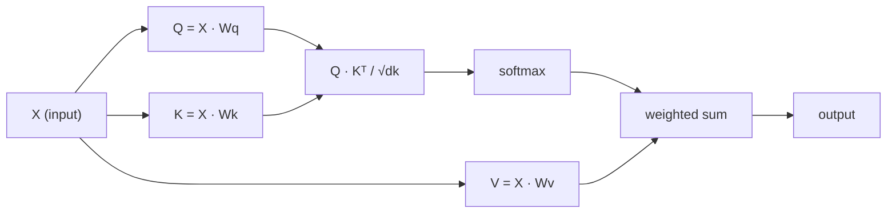

# Scratch에서 시작하는 Self-Attention

> Attention은 모든 단어가 "누구가 나에게 중요한가?"라고 묻는 조회 테이블이며, 그 답을 학습한다.

**유형:** 실습
**언어:** Python
**선수 과목:** Phase 3 (Deep Learning Core), Phase 5 Lesson 10 (Sequence-to-Sequence)
**소요 시간:** ~90분

## 학습 목표

- Query/Key/Value projection과 softmax 가중합을 포함한 Scaled dot-product self-attention을 NumPy만 사용하여 처음부터 구현한다.
- Head를 분할하고, 병렬 attention을 계산하며, 결과를 결합하는 Multi-head attention 레이어를 구축한다.
- Attention 행렬이 토큰 관계를 어떻게 포착하는지 추적하고, sqrt(d_k)로 스케일링하여 softmax 포화을 방지하는 이유를 설명한다.
- Causal masking을 적용하여 양방향 attention을 자기회귀(decoder 스타일) attention으로 변환한다.

## 문제

RNN은 한 번에 하나의 토큰을 처리한다. 50번째 토큰에 도달하면 1번째 토큰의 정보는 50개의 압축 단계를 거쳤다. Long-range 의존성은 고정 크기 hidden state로 압축된다 - LSTM gating으로도 완전히 해결되지 않는 병목 현상이다.

2014년 Bahdanau attention 논문은 해결책을 보였다: decoder가 encoder의 모든 위치를 살펴보게 하고, 현재 단계에 중요한 것이 무엇인지 결정하게 하자. 하지만 이것은 여전히 RNN에 붙여진 것이었다. 2017년 "Attention Is All You Need" 논문은 더 날카로운 질문을 했다: attention이 유일한 메커니즘이라면 어떻게 될까? 순환 없음. Convolution 없음. Attention만.

Self-attention은 시퀀스의 모든 위치가 단일 병렬 단계에서 다른 모든 위치에 attend할 수 있게 한다. 이것이 transformers를 빠르고 확장 가능하며 지배적으로 만든다.

## 개념

### 데이터베이스 조회 비유

Attention을 부드러운 데이터베이스 조회로 생각해보자:

```
전통적인 데이터베이스:
  Query: "프랑스의 수도"  -->  정확한 매치  -->  "파리"

Attention:
  Query: "프랑스의 수도"  -->  모든 키와의 유사도  -->  모든 값의 가중치 블렌드
```

모든 토큰은 세 개의 벡터를 생성한다:
- **Query (Q)**: "나는 무엇을 찾고 있는가?"
- **Key (K)**: "나는 무엇을 포함하는가?"
- **Value (V)**: "선택되면 나는 어떤 정보를 제공하는가?"

Query와 모든 키 사이의 내적이 attention 점수를 생성한다. 점수가 높으면 "이 키가 내 query와 일치한다"는 의미다. 이 점수들이 값을 가중치화한다. 출력은 값의 가중합이다.

### Q, K, V 계산

각 토큰 임베딩은 세 개의 학습된 가중치 행렬을 통해 projection된다:

```
입력 임베딩 (n개의 토큰 시퀀스, 각 d차원):

  X = [x1, x2, x3, ..., xn]       shape: (n, d)

세 개의 가중치 행렬:

  Wq  shape: (d, dk)
  Wk  shape: (d, dk)
  Wv  shape: (d, dv)

Projection:

  Q = X @ Wq    shape: (n, dk)      각 토큰의 query
  K = X @ Wk    shape: (n, dk)      각 토큰의 key
  V = X @ Wv    shape: (n, dv)      각 토큰의 value
```

하나의 토큰에 대해 시각적으로:

```
              Wq
   x_i ------[*]------> q_i    "나는 무엇을 찾고 있는가?"
        |
        |     Wk
        +----[*]------> k_i    "나는 무엇을 포함하는가?"
        |
        |     Wv
        +----[*]------> v_i    "내가 제공하는 것은?"
```

### Attention 행렬

모든 토큰에 대한 Q, K, V를 얻으면, attention 점수는 행렬을 형성한다:

```
Scores = Q @ K^T    shape: (n, n)

               k1    k2    k3    k4    k5
         +-----+-----+-----+-----+-----+
    q1   | 2.1 | 0.3 | 0.1 | 0.8 | 0.2 |   <- q1이 각 키에 attend하는 정도
         +-----+-----+-----+-----+-----+
    q2   | 0.4 | 1.9 | 0.7 | 0.1 | 0.3 |
         +-----+-----+-----+-----+-----+
    q3   | 0.2 | 0.6 | 2.3 | 0.5 | 0.1 |
         +-----+-----+-----+-----+-----+
    q4   | 0.9 | 0.1 | 0.4 | 1.7 | 0.6 |
         +-----+-----+-----+-----+-----+
    q5   | 0.1 | 0.3 | 0.2 | 0.5 | 2.0 |
         +-----+-----+-----+-----+-----+

각 행: 하나의 토큰이 전체 시퀀스에 대한 attention
```

한 번에 하나의 query가 키를 훑보는 것을 지켜보자: 각 행은 모든 토큰에 점수를 매기고, softmax가 점수를 가중치로 변환하고, context 벡터는 값의 가중치 블렌드이다.

```figure
attention-matrix
```

### 왜 스케일링하는가?

내적은 차원 dk과 함께 증가한다. dk = 64이면, 내적은 수십 범위에 이를 수 있어 softmax를 vanishing gradient 영역으로 밀어낸다. 해결책: sqrt(dk)로 나눈다.

```
Scaled scores = (Q @ K^T) / sqrt(dk)
```

이것은 softmax가 유용한 gradient를 생성하는 범위 내에서 값을 유지한다.

### Softmax가 점수를 가중치로 변환

Softmax는 각 행에서 raw 점수를 시퀀스에 대한 확률 분포로 변환한다:

```
q1의 raw 점수:   [2.1, 0.3, 0.1, 0.8, 0.2]
                            |
                         softmax
                            |
Attention 가중치:   [0.52, 0.09, 0.07, 0.14, 0.08]   (합계 ≈ 1.0)
```

이제 각 토큰은 다른 모든 토큰에 attend할 정도를 나타내는 가중치 세트를 갖는다.

### Value의 가중합

각 토큰에 대한 최종 출력은 모든 value 벡터의 가중합이다:

```
output_i = sum( attention_weight[i][j] * v_j  for all j )

토큰 1의 경우:
  output_1 = 0.52 * v1 + 0.09 * v2 + 0.07 * v3 + 0.14 * v4 + 0.08 * v5
```

### 전체 파이프라인



한 줄 공식:

```
Attention(Q, K, V) = softmax( Q @ K^T / sqrt(dk) ) @ V
```

## 실습

### Step 1: Scratch에서 Softmax

Softmax는 raw 로짓을 확률로 변환한다. 수치적 안정성을 위해 최대값을 뺀다.

```python
import numpy as np

def softmax(x):
    shifted = x - np.max(x, axis=-1, keepdims=True)
    exp_x = np.exp(shifted)
    return exp_x / np.sum(exp_x, axis=-1, keepdims=True)

logits = np.array([2.0, 1.0, 0.1])
print(f"logits:  {logits}")
print(f"softmax: {softmax(logits)}")
print(f"sum:     {softmax(logits).sum():.4f}")
```

### Step 2: Scaled dot-product attention

핵심 함수. Q, K, V 행렬을 받아 attention 출력과 가중치 행렬을 반환한다.

```python
def scaled_dot_product_attention(Q, K, V):
    dk = Q.shape[-1]
    scores = Q @ K.T / np.sqrt(dk)
    weights = softmax(scores)
    output = weights @ V
    return output, weights
```

### Step 3: 학습된 projection이 있는 Self-attention 클래스

Xavier 스케일링으로 초기화된 Wq, Wk, Wv 가중치 행렬을 가진 완전한 self-attention 모듈.

```python
class SelfAttention:
    def __init__(self, d_model, dk, dv, seed=42):
        rng = np.random.default_rng(seed)
        scale = np.sqrt(2.0 / (d_model + dk))
        self.Wq = rng.normal(0, scale, (d_model, dk))
        self.Wk = rng.normal(0, scale, (d_model, dk))
        scale_v = np.sqrt(2.0 / (d_model + dv))
        self.Wv = rng.normal(0, scale_v, (d_model, dv))
        self.dk = dk

    def forward(self, X):
        Q = X @ self.Wq
        K = X @ self.Wk
        V = X @ self.Wv
        output, weights = scaled_dot_product_attention(Q, K, V)
        return output, weights
```

### Step 4: 문장에서 실행

문장에 대한 가짜 임베딩을 만들고 attention 가중치를 살펴본다.

```python
sentence = ["The", "cat", "sat", "on", "the", "mat"]
n_tokens = len(sentence)
d_model = 8
dk = 4
dv = 4

rng = np.random.default_rng(42)
X = rng.normal(0, 1, (n_tokens, d_model))

attn = SelfAttention(d_model, dk, dv, seed=42)
output, weights = attn.forward(X)

print("Attention 가중치 (각 행: 해당 토큰이 어디를 바라보는지):\n")
print(f"{'':>6}", end="")
for token in sentence:
    print(f"{token:>6}", end="")
print()

for i, token in enumerate(sentence):
    print(f"{token:>6}", end="")
    for j in range(n_tokens):
        w = weights[i][j]
        print(f"{w:6.3f}", end="")
    print()
```

### Step 5: ASCII 히트맵으로 attention 시각화

빠른 시각화를 위해 attention 가중치를 문자에 매핑한다.

```python
def ascii_heatmap(weights, tokens, chars=" ░▒▓█"):
    n = len(tokens)
    print(f"\n{'':>6}", end="")
    for t in tokens:
        print(f"{t:>6}", end="")
    print()

    for i in range(n):
        print(f"{tokens[i]:>6}", end="")
        for j in range(n):
            level = int(weights[i][j] * (len(chars) - 1) / weights.max())
            level = min(level, len(chars) - 1)
            print(f"{'  ' + chars[level] + '   '}", end="")
        print()

ascii_heatmap(weights, sentence)
```

## 활용

PyTorch의 `nn.MultiheadAttention`은 우리가 구축한 것과 정확히 동일하며, 추가적으로 multi-head 분할과 출력 projection을 수행한다:

```python
import torch
import torch.nn as nn

d_model = 8
n_heads = 2
seq_len = 6

mha = nn.MultiheadAttention(embed_dim=d_model, num_heads=n_heads, batch_first=True)

X_torch = torch.randn(1, seq_len, d_model)

output, attn_weights = mha(X_torch, X_torch, X_torch)

print(f"입력 shape:            {X_torch.shape}")
print(f"출력 shape:           {output.shape}")
print(f"Attention 가중치 shape: {attn_weights.shape}")
print(f"\nAttn 가중치 (heads 평균):")
print(attn_weights[0].detach().numpy().round(3))
```

주요 차이점: multi-head attention은 각각 고유한 Q, K, V projection을 가진 여러 attention 함수를 병렬로 실행하고, 결과를 연결한다. 이를 통해 모델이 다양한 관계 유형에 동시에 attend할 수 있다.

## 결과물

이 수업은 다음을 생산한다:
- `outputs/prompt-attention-explainer.md` - 데이터베이스 조회 비유를 통해 attention을 설명하기 위한 프롬프트

## 연습 문제

1. `scaled_dot_product_attention`을 수정하여 softmax 전에 특정 위치를 음의 무한대로 설정하는 선택적 mask 행렬을 받아들이도록 한다 (causal/decoder masking이 작동하는 방식).
2. 처음부터 multi-head attention을 구현한다: Q, K, V를 `n_heads` 청크로 분할하고, attention을 실행하고, 연결한 후 마지막 가중치 행렬 Wo를 통해 projection한다.
3. 동일한 길이의 두 다른 문장을 가져와서 동일한 SelfAttention 인스턴스를 통해 통과시키고, attention 패턴을 비교한다. 무엇이 변하는가? 무엇이 동일한가?

## 핵심 용어

| 용어 | 사람들이 말하는 것 | 실제 의미 |
|------|-----------------|----------------------|
| Query (Q) | "질문 벡터" | 입력의 학습된 projection으로, 이 토큰이 어떤 정보를 찾고 있는지를 나타낸다 |
| Key (K) | "라벨 벡터" | 학습된 projection으로, query와 일치시킬 때 이 토큰이 어떤 정보를 포함하는지를 나타낸다 |
| Value (V) | "콘텐츠 벡터" | attention 점수에 따라 집계되는 실제 정보를運ぶ 학습된 projection |
| Scaled dot-product attention | "attention 공식" | softmax(QK^T / sqrt(dk)) @ V - 스케일링은 고차원에서 softmax 포화를 방지한다 |
| Self-attention | "토큰이 자신과 다른 것들을 본다" | Q, K, V가 모두 동일한 시퀀스에서 나오는 attention으로, 모든 위치가 다른 모든 위치에 attend할 수 있다 |
| Attention 가중치 | "얼마나 집중하는가" | softmax를 통과한_scaled dot product에서 생성된 위치에 대한 확률 분포 |
| Multi-head attention | "병렬 attention" | 서로 다른 projection을 가진 여러 attention 함수를 실행한 후 richer 표현을 위해 결과를 연결 |

## 추가 자료

- [Attention Is All You Need (Vaswani et al., 2017)](https://arxiv.org/abs/1706.03762) - 원래 transformer 논문
- [The Illustrated Transformer (Jay Alammar)](https://jalammar.github.io/illustrated-transformer/) - 전체 아키텍처의 최고의 시각적 워크스루
- [The Annotated Transformer (Harvard NLP)](https://nlp.seas.harvard.edu/annotated-transformer/) - 설명과 함께 줄바꿈 PyTorch 구현