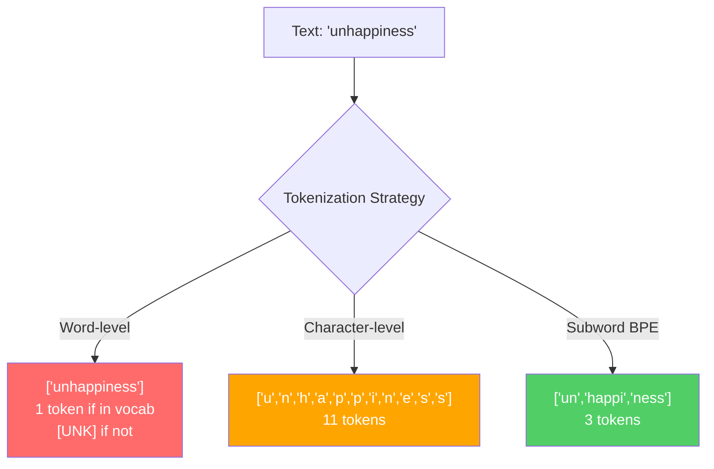
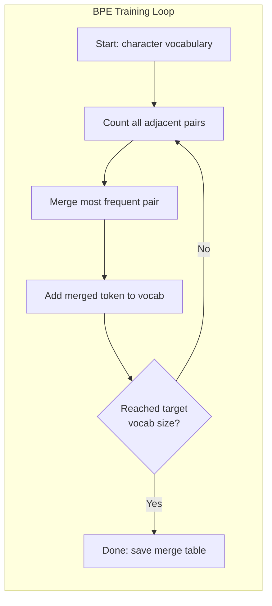
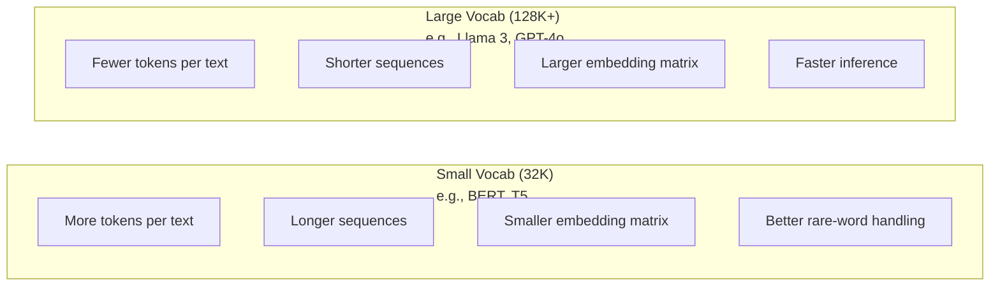

# 토크나이저: BPE, WordPiece, SentencePiece

> LLM은 영어로 읽지 않습니다. 숫자로 읽습니다. 토크나이저가 그 숫자가 의미를 담는지 낭비하는지를 결정합니다.

**유형:** 빌드
**언어:** Python
**선행 요건:** Phase 05 (NLP Foundations)
**시간:** ~90분

## 학습 목표

- BPE, WordPiece, Unigram 토큰화 알고리즘을 처음부터 구현하고 병합 전략 비교하기
- 어휘 크기가 모델 효율성에 미치는 영향 설명:太小은 긴 시퀀스를,太大는 임베딩 파라미터를 낭비
- 언어와 코드 전반의 토큰화 아티팩트 분석, 특정 토크나이저가 실패하는 지점 식별하기
- tiktoken과 sentencepiece 라이브러리를 사용하여 텍스트 토큰화하고 결과 토큰 ID 검사하기

## 문제

LLM은 영어로 읽지 않습니다. 어떤 언어도 읽지 않습니다. 숫자를 읽습니다.

"Hello, world!"와 [15496, 11, 995, 0] 사이의 간격이 토크나이저입니다. 모든 단어, 모든 공백, 모든 마침표는 모델이 처리할 수 있도록 정수로 변환되어야 합니다. 이 변환은 중립적이지 않습니다. 나중에 되돌릴 수 없는 가정들을 모델에 베이크합니다.

잘못하면 모델은 일반적인 단어를 여러 토큰으로 인코딩하는 데 용량을 낭비합니다. "unfortunately"는 하나의 토큰 대신 4개의 토큰이 됩니다. 128K 컨텍스트 창이 다음어절이 많은 텍스트에서 75% 축소됩니다. 올바르게 하면 같은 컨텍스트 창이 두 배 더 많은 의미를 담습니다. "this model handles code well"과 "this model chokes on Python"의 차이는 종종 토크나이저가 어떻게 훈련되었는지에 달려 있습니다.

GPT-4 또는 Claude에 보내는 모든 API 호출은 토큰당 과금됩니다. 모델이 생성하는 모든 토큰은 연산 비용이 듭니다. 출력을 나타내는 데 필요한 토큰이 적을수록 종단 간 추론이 빨라집니다. 토큰화는 전처리가 아닙니다. 아키텍처입니다.

## 개념

### 실패한 세 가지 접근법 (그리고 하나가勝った)

텍스트를 숫자로 변환하는 세 가지显而易한 방법이 있습니다. 두 가지는 규모에 맞지 않습니다.

**단어 수준 토큰화**는 공백과 구두점에서 분할합니다. "The cat sat"은 ["The", "cat", "sat"]이 됩니다. 간단합니다. 하지만 "tokenization"은 어떨까요? 또는 "GPT-4o"? 또는 "Geschwindigkeitsbegrenzung"과 같은 독일어 합성어는요? 단어 수준은 모든 언어의 모든 단어를 커버하기 위해 방대한 어휘가 필요합니다. 단어를 놓치면 두려운 `[UNK]` 토큰을 얻습니다 -- 모델이 "이게 뭔지 모르겠어요"라고 말하는 방법입니다. 영어만 해도 100만 개 이상의 단어 형태가 있습니다. 코드, URL, 과학적 표기법, 다른 100개 언어를 추가하면 무한한 어휘가 필요합니다.

**문자 수준 토큰화**는 반대로 갑니다. "hello"는 ["h", "e", "l", "l", "o"]가 됩니다. 어휘는 극도로 작습니다(수백 자). 모르는 토큰은 절대 없습니다. 하지만 시퀀스가 extremely 길어집니다. 10개의 단어 수준 토큰인 문장은 50개의 문자 수준 토큰이 됩니다. 모델은 "t", "h", "e"가 함께 "the"를 의미한다는 것을 학습해야 합니다 -- 인간이 세 살에 배우는 것을 위해 어텐션 용량을 소모하는 것입니다.

**서브워드 토큰화**는 딱 맞는 지점을 찾습니다. 일반적인 단어는 유지됩니다: "the"는 하나의 토큰입니다. 드문 단어는 의미 있는 조각으로 분해됩니다: "unhappiness"는 ["un", "happi", "ness"]가 됩니다. 어휘는 관리 가능한 범위입니다(30K~128K 토큰). 시퀀스는 짧게 유지됩니다. 모르는 토큰은 사실상 사라집니다 -- 어떤 단어도 서브워드 조각으로 构建될 수 있기 때문입니다.

모든 현대 LLM은 서브워드 토큰화를 사용합니다. GPT-2, GPT-4, BERT, Llama 3, Claude -- 모두 마찬가지입니다. 질문은 어떤 알고리즘을 쓰느냐입니다.



### BPE: 바이트 쌍 인코딩

BPE는 토큰화를 위해 재활용된 탐욕적 압축 알고리즘입니다. 아이디어는 인덱스 카드에 맞을 만큼 간단합니다.

개별 문자에서 시작합니다. 훈련 코퍼스에서 모든 인접 쌍을 카운트합니다. 가장 빈번한 쌍을 새 토큰으로 병합합니다. 목표 어휘 크기에 도달할 때까지 반복합니다.

```figure
tokenizer-bpe
```

"lower", "lowest", "newest"라는 단어가 있는tiny 코퍼스에서 BPE를 실행하는 예시입니다:

```
Corpus (with word frequencies):
  "lower"  x5
  "lowest" x2
  "newest" x6

Step 0 -- Start with characters:
  l o w e r       (x5)
  l o w e s t     (x2)
  n e w e s t     (x6)

Step 1 -- Count adjacent pairs:
  (e,s): 8    (s,t): 8    (l,o): 7    (o,w): 7
  (w,e): 13   (e,r): 5    (n,e): 6    ...

Step 2 -- Merge most frequent pair (w,e) -> "we":
  l o we r        (x5)
  l o we s t      (x2)
  n e we s t      (x6)

Step 3 -- Recount and merge (e,s) -> "es":
  l o we r        (x5)
  l o we s t      (x2)    <- 'es' only forms from 'e'+'s', not 'we'+'s'
  n e we s t      (x6)    <- wait, the 'e' before 'we' and 's' after 'we'

Actually tracking this precisely:
  After "we" merge, remaining pairs:
  (l,o): 7   (o,we): 7   (we,r): 5   (we,s): 8
  (s,t): 8   (n,e): 6    (e,we): 6

Step 3 -- Merge (we,s) -> "wes" or (s,t) -> "st" (tied at 8, pick first):
  Merge (we,s) -> "wes":
  l o we r        (x5)
  l o wes t       (x2)
  n e wes t       (x6)

Step 4 -- Merge (wes,t) -> "west":
  l o we r        (x5)
  l o west        (x2)
  n e west        (x6)

...continue until target vocab size reached.
```

병합 테이블이 토크나이저입니다. 새 텍스트를 인코딩하려면 배운 순서대로 병합을 적용합니다. 훈련 코퍼스가 어떤 병합이 존재하는지를 결정하며, 그 선택은 모델이 보는 것을 영구적으로 형성합니다.



### 바이트 수준 BPE (GPT-2, GPT-3, GPT-4)

표준 BPE는 유니코드 문자에서 작동합니다. 바이트 수준 BPE는 raw 바이트(0-255)에서 작동합니다. 이로 인해 기본 어휘가 정확히 256이 되고, 모든 언어나 인코딩을 처리하며, 모르는 토큰을 절대 생성하지 않습니다.

GPT-2가 이 접근법을 도입했습니다. 기본 어휘는 Every 가능한 바이트를 커버합니다. BPE 병합이 그 위에 구축됩니다. OpenAI의 tiktoken 라이브러리는 이러한 어휘 크기로 바이트 수준 BPE를 구현합니다:

- GPT-2: 50,257 토큰
- GPT-3.5/GPT-4: ~100,256 토큰 (cl100k_base 인코딩)
- GPT-4o: 200,019 토큰 (o200k_base 인코딩)

### WordPiece (BERT)

WordPiece는 BPE와 비슷해 보이지만 병합을 다르게 선택합니다. Raw 빈도 대신 훈련 데이터의 우도를最大化합니다:

```
BPE merge criterion:      count(A, B)
WordPiece merge criterion: count(AB) / (count(A) * count(B))
```

BPE는 묻습니다: "어떤 쌍이 가장 자주 나타납니까?" WordPiece는 묻습니다: "어떤 쌍이 우연에 의해 예상되는 것보다 더 자주 함께 나타납니까?" 이 subtle한 차이가 다른 어휘를 생성합니다. WordPiece는 단순히 빈번한 것이 아니라 共起가 놀라운 병합을 선호합니다.

WordPiece는 또한 연속 서브워드에 "##" 접두사를 사용합니다:

```
"unhappiness" -> ["un", "##happi", "##ness"]
"embedding"   -> ["em", "##bed", "##ding"]
```

"##" 접두사는 이 조각이 이전 토큰을 계속한다는 것을 알려줍니다. BERT는 30,522 토큰의 어휘로 WordPiece를 사용합니다. 모든 BERT 변형 -- DistilBERT, RoBERTa의 토크나이저는 실제로 BPE이지만, BERT 자체는 WordPiece입니다.

### SentencePiece (Llama, T5)

SentencePiece는 입력을 유니코드 문자의 raw 스트림으로, 공백을 포함하여 처리합니다. 사전 토큰화 단계 없음. 단어 경계에 대한 언어별 규칙 없음. 이것이 진정한 언어에 중립적 -- Chinese, Japanese, Thai, 공백이 단어를 분리하지 않는 다른 언어에서 작동합니다.

SentencePiece는 두 가지 알고리즘을 지원합니다:
- **BPE 모드**: 표준 BPE와 동일한 병합 로직, raw 문자 시퀀스에 적용
- **Unigram 모드**: 큰 어휘로 시작하여 전체 우도에 최소한으로 영향을 미치는 토큰을 반복적으로 제거. BPE의 역방향 -- 병합 대신 제거.

Llama 2는 32,000 토큰의 어휘로 SentencePiece BPE를 사용합니다. T5는 32,000 토큰으로 SentencePiece Unigram을 사용합니다. 참고: Llama 3은 128,256 토큰으로 tiktoken 기반 바이트 수준 BPE 토크나이저로 전환했습니다.

### 어휘 크기 트레이드오프

이것은 측정 가능한 결과가 있는 진정한 엔지니어링 결정입니다.



구체적인 숫자입니다. 4,096 차원 임베딩을 사용하는 128K 어휘의 경우, 임베딩 행렬만으로 128,000 x 4,096 = 5억 2,400만 파라미터입니다. 32K 어휘의 경우 1억 3,100만 파라미터입니다. 토크나이저 선택만으로 4억 파라미터 차이가 납니다.

하지만 더 큰 어휘는 텍스트를 더 적극적으로 압축합니다. 32K 어휘에서 100토큰이 걸리는 같은 영어 단락이 128K 어휘에서는 70토큰이 걸릴 수 있습니다. 이는 생성 중 포워드 패스가 30% 적음을 의미합니다. 수백만 개의 요청을 처리하는 모델의 경우, 이는 연산 비용의 직접적인 감소입니다.

추세가 명확합니다: 어휘 크기가 증가하고 있습니다. GPT-2는 50,257을 사용했습니다. GPT-4는 ~100K를 사용합니다. Llama 3은 128K를 사용합니다. GPT-4o는 200K를 사용합니다.

| 모델 | 어휘 크기 | 토크나이저 유형 | 영어 단어당 평균 토큰 수 |
|-------|-----------|----------------|---------------------------|
| BERT | 30,522 | WordPiece | ~1.4 |
| GPT-2 | 50,257 | 바이트 수준 BPE | ~1.3 |
| Llama 2 | 32,000 | SentencePiece BPE | ~1.4 |
| GPT-4 | ~100,256 | 바이트 수준 BPE | ~1.2 |
| Llama 3 | 128,256 | 바이트 수준 BPE (tiktoken) | ~1.1 |
| GPT-4o | 200,019 | 바이트 수준 BPE | ~1.0 |

### 다국어 세금

주로 영어로 훈련된 토크나이저는 다른 언어에 대해 무겁습니다. GPT-2 토크나이저에서 한국어 텍스트는 단어당 평균 2-3 토큰입니다. 중국어는 더 나쁠 수 있습니다. 이는 한국 사용자가 영어 사용자의 절반 크기인 효과적인 컨텍스트 창을 갖게 된다는 것을 의미합니다 -- 같은 가격으로 더 적은 정보 밀도를 얻습니다.

이것이 Llama 3이 어휘를 32K에서 128K로 4배 늘린 이유입니다. 비영어 스크립트에 더 많은 토큰을 할당하면 언어 간 더 공정한 압축을 보장합니다.

## 빌드 It

### Step 1: 문자 수준 토크나이저

기초에서 시작합니다. 문자 수준 토크나이저는 각 문자를 유니코드 코드 포인트에 매핑합니다. 훈련 필요 없음. 모르는 토큰 없음. 직접 매핑뿐입니다.

```python
class CharTokenizer:
    def encode(self, text):
        return [ord(c) for c in text]

    def decode(self, tokens):
        return "".join(chr(t) for t in tokens)
```

"hello"는 [104, 101, 108, 108, 111]이 됩니다. 모든 문자가 자체 토큰입니다. 이것이 우리가 개선할 기준입니다.

### Step 2: 처음부터 만드는 BPE 토크나이저

진짜 구현입니다. raw 바이트에서 훈련합니다(GPT-2처럼), 쌍을 카운트하고, 가장 빈번한 것을 병합하고, 모든 병합을 순서대로 기록합니다. 병합 테이블이 토크나이저입니다.

```python
from collections import Counter

class BPETokenizer:
    def __init__(self):
        self.merges = {}
        self.vocab = {}

    def _get_pairs(self, tokens):
        pairs = Counter()
        for i in range(len(tokens) - 1):
            pairs[(tokens[i], tokens[i + 1])] += 1
        return pairs

    def _merge_pair(self, tokens, pair, new_token):
        merged = []
        i = 0
        while i < len(tokens):
            if i < len(tokens) - 1 and tokens[i] == pair[0] and tokens[i + 1] == pair[1]:
                merged.append(new_token)
                i += 2
            else:
                merged.append(tokens[i])
                i += 1
        return merged

    def train(self, text, num_merges):
        tokens = list(text.encode("utf-8"))
        self.vocab = {i: bytes([i]) for i in range(256)}

        for i in range(num_merges):
            pairs = self._get_pairs(tokens)
            if not pairs:
                break
            best_pair = max(pairs, key=pairs.get)
            new_token = 256 + i
            tokens = self._merge_pair(tokens, best_pair, new_token)
            self.merges[best_pair] = new_token
            self.vocab[new_token] = self.vocab[best_pair[0]] + self.vocab[best_pair[1]]

        return self

    def encode(self, text):
        tokens = list(text.encode("utf-8"))
        for pair, new_token in self.merges.items():
            tokens = self._merge_pair(tokens, pair, new_token)
        return tokens

    def decode(self, tokens):
        byte_sequence = b"".join(self.vocab[t] for t in tokens)
        return byte_sequence.decode("utf-8", errors="replace")
```

훈련 루프가 BPE의 핵심입니다: 쌍을 카운트하고,胜者를 병합하고, 반복합니다. 각 병합은 총 토큰 수를 줄입니다. `num_merges` 라운드 후 어휘가 256(base 바이트)에서 256 + num_merges로 성장합니다.

인코딩은 배운 정확한 순서대로 병합을 적용합니다. 이것이 중요합니다. 병합 1이 "th"를 만들고 병합 5가 "the"를 만들었다면, 인코딩은 병합 5에서 "th" + "e"에서 "the"가 형성될 수 있도록 병합 1을 먼저 적용해야 합니다.

디코딩은 역방향입니다: 어휘에서 각 토큰 ID를 찾고, 바이트를 연결하고, UTF-8로 디코딩합니다.

### Step 3: 인코딩 및 디코딩 라운드트립

```python
corpus = (
    "The cat sat on the mat. The cat ate the rat. "
    "The dog sat on the log. The dog ate the frog. "
    "Natural language processing is the study of how computers "
    "understand and generate human language. "
    "Tokenization is the first step in any NLP pipeline."
)

tokenizer = BPETokenizer()
tokenizer.train(corpus, num_merges=40)

test_sentences = [
    "The cat sat on the mat.",
    "Natural language processing",
    "tokenization pipeline",
    "unhappiness",
]

for sentence in test_sentences:
    encoded = tokenizer.encode(sentence)
    decoded = tokenizer.decode(encoded)
    raw_bytes = len(sentence.encode("utf-8"))
    ratio = len(encoded) / raw_bytes
    print(f"'{sentence}'")
    print(f"  Tokens: {len(encoded)} (from {raw_bytes} bytes) -- ratio: {ratio:.2f}")
    print(f"  Roundtrip: {'PASS' if decoded == sentence else 'FAIL'}")
```

압축 비율이 토크나이저의 효과도를 알려줍니다. 0.50의 비율은 토크나이저가 텍스트를 raw 바이트의 절반으로 압축했다는 의미입니다. 낮을수록 좋습니다. 훈련 코퍼스에서 비율은 좋습니다. "unhappiness"(코퍼스에 나타나지 않음)와 같은 분산 외 텍스트에서 비율은 더 나쁩니다 -- 토크나이저가未见 패턴에 대해 문자 수준 인코딩으로 돌아갑니다.

### Step 4: tiktoken과 비교

```python
import tiktoken

enc = tiktoken.get_encoding("cl100k_base")

texts = [
    "The cat sat on the mat.",
    "unhappiness",
    "Hello, world!",
    "def fibonacci(n): return n if n < 2 else fibonacci(n-1) + fibonacci(n-2)",
    "Geschwindigkeitsbegrenzung",
]

for text in texts:
    our_tokens = tokenizer.encode(text)
    tiktoken_tokens = enc.encode(text)
    tiktoken_pieces = [enc.decode([t]) for t in tiktoken_tokens]
    print(f"'{text}'")
    print(f"  Our BPE:   {len(our_tokens)} tokens")
    print(f"  tiktoken:  {len(tiktoken_tokens)} tokens -> {tiktoken_pieces}")
```

tiktoken은 동일한 알고리즘을 사용하지만 수백 기가바이트의 텍스트에서 100,000 병합으로 훈련되었습니다. 알고리즘은 동일합니다. 차이점은 훈련 데이터와 병합 수입니다. 40병합으로 단락에서 훈련한 토크나이저가 대규모 코퍼스에서 100K 병합을 가진 tiktoken과 경쟁할 수 없습니다. 하지만 메커니즘은 동일합니다.

### Step 5: 어휘 분석

```python
def analyze_vocabulary(tokenizer, test_texts):
    total_tokens = 0
    total_chars = 0
    token_usage = Counter()

    for text in test_texts:
        encoded = tokenizer.encode(text)
        total_tokens += len(encoded)
        total_chars += len(text)
        for t in encoded:
            token_usage[t] += 1

    print(f"Vocabulary size: {len(tokenizer.vocab)}")
    print(f"Total tokens across all texts: {total_tokens}")
    print(f"Total characters: {total_chars}")
    print(f"Avg tokens per character: {total_tokens / total_chars:.2f}")

    print(f"\nMost used tokens:")
    for token_id, count in token_usage.most_common(10):
        token_bytes = tokenizer.vocab[token_id]
        display = token_bytes.decode("utf-8", errors="replace")
        print(f"  Token {token_id:4d}: '{display}' (used {count} times)")

    unused = [t for t in tokenizer.vocab if t not in token_usage]
    print(f"\nUnused tokens: {len(unused)} out of {len(tokenizer.vocab)}")
```

이것은 어휘에서 지프 분포를 보여줍니다. 소수의 토큰이 지배합니다(공백, "the", "e"). 대부분의 토큰은 거의 사용되지 않습니다. 프로덕션 토크나이저는 이 분포를 최적화합니다 -- 일반적인 패턴은 짧은 토큰 ID를 받고, 드문 패턴은 더 긴 표현을 얻습니다.

## 사용 It

당신의 처음부터 만든 BPE가 작동합니다. 이제 프로덕션 도구가 어떻게 생겼는지 확인하세요.

### tiktoken (OpenAI)

```python
import tiktoken

enc = tiktoken.get_encoding("cl100k_base")

text = "Tokenizers convert text to integers"
tokens = enc.encode(text)
print(f"Tokens: {tokens}")
print(f"Pieces: {[enc.decode([t]) for t in tokens]}")
print(f"Roundtrip: {enc.decode(tokens)}")
```

tiktoken은 Python 바인딩이 있는 Rust로 작성되었습니다. 초당 수백만 토큰을 인코딩합니다. 동일한 BPE 알고리즘, 산업 강도 구현.

### Hugging Face 토크나이저

```python
from tokenizers import Tokenizer
from tokenizers.models import BPE
from tokenizers.trainers import BpeTrainer
from tokenizers.pre_tokenizers import ByteLevel

tokenizer = Tokenizer(BPE())
tokenizer.pre_tokenizer = ByteLevel()

trainer = BpeTrainer(vocab_size=1000, special_tokens=["<pad>", "<eos>", "<unk>"])
tokenizer.train(["corpus.txt"], trainer)

output = tokenizer.encode("The cat sat on the mat.")
print(f"Tokens: {output.tokens}")
print(f"IDs: {output.ids}")
```

Hugging Face 토크나이저 라이브러리도 내부적으로 Rust입니다. 기가바이트 규모 코퍼스에서 BPE를 초 단위로 훈련합니다. 자신의 모델을 훈련할 때 사용하는 것입니다.

### Llama의 토크나이저 로드하기

```python
from transformers import AutoTokenizer

tokenizer = AutoTokenizer.from_pretrained("meta-llama/Llama-3.1-8B")

text = "Tokenizers are the unsung heroes of LLMs"
tokens = tokenizer.encode(text)
print(f"Token IDs: {tokens}")
print(f"Tokens: {tokenizer.convert_ids_to_tokens(tokens)}")
print(f"Vocab size: {tokenizer.vocab_size}")

multilingual = ["Hello world", "Hola mundo", "Bonjour le monde"]
for text in multilingual:
    ids = tokenizer.encode(text)
    print(f"'{text}' -> {len(ids)} tokens")
```

Llama 3의 128K 어휘는 GPT-2의 50K 어휘보다 non-English 텍스트를 훨씬 더 잘 압축합니다. 직접 확인할 수 있습니다 -- 같은 문장을 여러 언어로 인코딩하고 토큰을 카운트하세요.

## 출하 It

이 레슨은 `outputs/prompt-tokenizer-analyzer.md` -- 모든 텍스트 및 모델 조합에 대한 토큰화 효율성을 分析하는 재사용 가능한 프롬프트를 생성합니다. 텍스트 샘플을 먹이면 어떤 모델의 토크나이저가 가장 잘 처리하는지 알려줍니다.

## 연습문제

1. BPE 토크나이저를 수정하여 각 병합 단계에서 어휘를 출력하도록 합니다. "t" + "h"가 "th"로, 그 다음 "th" + "e"가 "the"로 되는 것을 지켜보세요. 일반적인 영어 단어가 조각씩 어떻게 조합되는지 추적합니다.

2. 특수 토큰(`<pad>`, `<eos>`, `<unk>`)을 BPE 토크나이저에 추가합니다. ID 0, 1, 2를 할당하고 다른 모든 토큰을 accordingly 이동합니다. BPE를実行하기 전에 공백에서 분할하는 사전 토큰화 단계를実装합니다.

3. WordPiece 병합 기준(빈도 대신 우도 비율)을 구현합니다. 동일한 코퍼스에서 동일한 수의 병합으로 BPE와 WordPiece를 모두 훈련합니다. 결과 어휘를 비교합니다 -- 어느 것이 더 linguistically 의미 있는 서브워드를 생성합니까?

4. 다국어 토크나이저 효율성 벤치마크를 구축합니다. 영어, 스페인어, 중국어, 한국어, 아랍어로 10개의 문장을 가져옵니다. tiktoken(cl100k_base)으로 각 언어의 토큰화를 수행하고 문자당 평균 토큰을 측정합니다. 각 언어에 대한 "다국어 세금"을 정량화합니다.

5. 더 큰 코퍼스에서 BPE 토크나이저를 훈련합니다(위키피디아 기사를 다운로드). 동일한 텍스트에서 tiktoken의 10% 이내 압축 비율을 달성하도록 병합 수를 조정합니다. 이것은 코퍼스 크기, 병합 수, 압축 품질 사이의 관계를 이해하게 합니다.

## 핵심 용어

| 용어 | 사람들이 말하는 것 | 실제로 의미하는 것 |
|------|----------------|----------------------|
| Token | "A word" | 모델 어휘의 단위 -- 문자, 서브워드, 단어 또는 여러 단어 청크일 수 있음 |
| BPE | "Some compression thing" | 바이트 쌍 인코딩 -- 목표 어휘 크기에 도달할 때까지 가장 빈번한 인접 쌍을 반복적으로 병합 |
| WordPiece | "BERT's tokenizer" | BPE와 유사하지만 count(AB)/(count(A)*count(B)) 우도 비율을 최대화하여 병합 |
| SentencePiece | "A tokenizer library" | 사전 토큰화 없이 raw 유니코드에서 작동하는 언어에 중립적인 토크나이저, BPE 및 Unigram 알고리즘 지원 |
| Vocabulary size | "How many words it knows" | 고유 토큰의 총 수: GPT-2는 50,257, BERT는 30,522, Llama 3은 128,256 |
| Fertility | "Not a tokenizer term" | 단어당 평균 토큰 수 -- 언어 전반의 토크나이저 효율성 측정 (1.0이 완벽, 3.0은 모델이 세 배 더 열심히 일함) |
| Byte-level BPE | "GPT's tokenizer" | 유니코드 문자 대신 raw 바이트(0-255)에서 작동하는 BPE, 모든 입력에 대해 모르는 토큰이 없음을 보장 |
| Merge table | "The tokenizer file" | 훈련 중 배운 순서화된 쌍 병합 목록 -- 이것이 토크나이저이며, 순서가 중요함 |
| Pre-tokenization | "Splitting on spaces" | 서브워드 토큰화 전에 적용되는 규칙: 공백 분할, 숫자 분리, 구두점 처리 |
| Compression ratio | "How efficient the tokenizer is" | 생성된 토큰 수를 입력 바이트로 나눈 값 -- 낮을수록 압축이 좋고 추론이 빠름 |

## 추가 읽기

- [Sennrich et al., 2016 -- "Neural Machine Translation of Rare Words with Subword Units"](https://arxiv.org/abs/1508.07909) -- BPE를 NLP에 도입하고 1994년 압축 알고리즘을 현대 토큰화의 토대로 만든 논문
- [Kudo & Richardson, 2018 -- "SentencePiece: A simple and language independent subword tokenizer"](https://arxiv.org/abs/1808.06226) -- 다국어 모델을 실용적으로 만든 언어에 중립적인 토큰화
- [OpenAI tiktoken 저장소](https://github.com/openai/tiktoken) -- Python 바인딩이 있는 Rust의 프로덕션 BPE 구현, GPT-3.5/4/4o에서 사용
- [Hugging Face Tokenizers 문서](https://huggingface.co/docs/tokenizers) -- Rust 성능의 프로덕션급 토크나이저 훈련