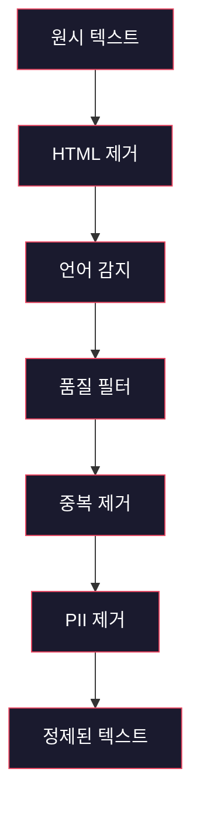
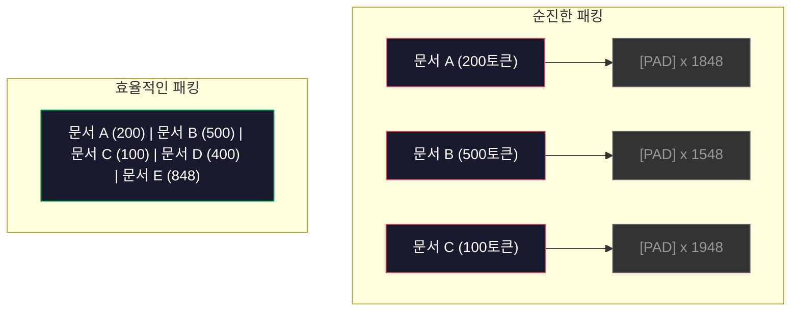

# 사전 훈련을 위한 데이터 파이프라인

> 모델은 거울입니다. 당신이 공급하는 데이터를 그대로 반영합니다. 쓰레기를 공급하면 완벽한 유창함으로 쓰레기를 반영합니다.

**유형:** 빌드
**언어:** Python
**사전 필요 지식:** 10단계, 01-02과 (토크나이저, 토크나이저 구축)
**소요 시간:** ~90분

## 학습 목표

- 모든 데이터를 메모리에 로드하지 않고 수 테라바이트의 텍스트를 토크나이즈, 청킹, 셔플, 배칭하는 스트리밍 데이터 파이프라인 구축
- 실제 사전 훈련 파이프라인에서 사용되는 데이터 품질 필터(중복 제거, 언어 감지, 콘텐츠 필터링) 구현
- 적절한 어텐션 마스크와 문서 경계 처리를 사용한 고정 길이 훈련 시퀀스 생성
- 데이터로더가 GPU 훈련 속도를 따라잡을 수 있도록 파이프라인 처리량 프로파일링

## 문제

토크나이저가 있습니다. 이제 데이터가 필요합니다.

데이터셋이 아닙니다. CSV 파일이 아닙니다. 테라바이트 단위의 텍스트 — 정제되고, 중복 제거되며, 품질 필터링되고, 고정 길이 시퀀스로 토크나이즈되고, 무작위 배치로 제공되어 8-GPU 클러스터가 다음 배치를 기다리지 않을 정도로 빨라야 합니다.

대부분의 사람들은 LLM 훈련이 모델 아키텍처에 관한 것이라고 생각합니다. 그렇지 않습니다. Llama 3는 15.6조 개의 토큰을 사용했습니다. GPT-3는 3000억 개를 사용했습니다. DeepSeek-V2는 8.1조 개를 사용했습니다. 세 모델의 아키텍처는 거의 동일합니다: 어텐션과 피드포워드 레이어가 있는 쌓인 트랜스포머 블록. 출력 품질의 차이는 압도적으로 데이터에서 비롯됩니다.

DeepMind의 Chinchilla 논문이 이를 정밀하게 만들었습니다. 주어진 계산 예산에 대해 모델 파라미터와 훈련 토큰 사이에 최적의 비율이 있습니다. Chinchilla는 2022년의 대부분의 모델이 극적으로 덜 훈련되었음을 보여주었습니다 — 그들이 본 데이터 양에 비해 너무 많은 파라미터를 가지고 있었습니다. 1.4조 개의 토큰으로 훈련된 70B 파라미터 모델(Chinchilla-최적)은 3000억 개의 토큰으로 훈련된 280B 모델(Gopher)을 능가했습니다.

여러분의 데이터 파라미터는 모델이 언어를 학습할지 노이즈를 학습할지를 결정합니다.

## 개념

### 데이터의 출처

모든 대규모 언어 모델은 소스의 혼합으로 훈련됩니다. 정확한 구성은 대부분의 연구소에서 철저히 비밀이지만, 범주를 이해하기에는 충분히 알고 있습니다.

| 소스 | 크기 | 품질 | 사용처 |
|---|---|---|---|
| Common Crawl | ~250 TB 원시 | 낮음 (많은 필터링 필요) | GPT-3, Llama, 대부분의 오픈 모델 |
| Wikipedia | ~20 GB | 높음 | 모든 주요 LLM |
| GitHub 코드 | ~1 TB+ | 중간 (많은 중복, 죽은 코드) | StarCoder, CodeLlama, DeepSeek-Coder |
| 도서 (BookCorpus, The Pile) | ~100 GB | 높음 | GPT-2, GPT-3, 초기 모델 |
| 학술 논문 (arXiv, S2ORC) | ~100 GB | STEM 분야 높음 | Llama, Galactica |
| StackOverflow, Reddit | ~100 GB | 중간 | Llama, Falcon |
| 큐레이션된 웹 (C4, RefinedWeb) | ~5 TB | 중간-높음 (사전 필터링됨) | T5, Falcon |

Llama 3는 데이터 구성을 공개했습니다: 약 50% 웹 데이터, 25% 코드, 13% 도서 및 학술 논문, 8% 수학 데이터, 4% 다국어 웹 데이터. 총 15.6조 개의 토큰으로 5 TB를 초과하는 원시 텍스트 소스에서 가져왔습니다.

비율은 전체 크기만큼 중요합니다. 웹 데이터가 너무 많으면 모델은 Reddit 앵무새가 됩니다. 코드가 너무 적으면 프로그래밍을 할 수 없습니다. 수학이 너무 적으면 추론에 실패합니다. 이 구성을 올바르게 맞추는 것은 LLM 훈련에서 가장 어려운 부분 중 하나이며, 공식이 없습니다 — 실험과 평가가 필요합니다.

### 데이터 정제

원시 웹 데이터는 더럽습니다. 일반적인 Common Crawl 덤프에는 다음이 포함됩니다:

- HTML 태그와 JavaScript
- 상용구 헤더, 푸터, 네비게이션 메뉴
- 중복 페이지 (정확한 중복 및 유사 중복)
- 기계 생성 스팸
- 개인 식별 정보(PII)
- 저품질 텍스트 (키워드 목록, SEO 스팸)
- 텍스트로 인코딩된 비-텍스트 콘텐츠

이것을 정제하는 것은 선택이 아닙니다. 일관된 문단을 생성하는 모델과 HTML 태그를 제품 목록과 섞어 출력하는 모델의 차이입니다.



각 단계는 노이즈의 한 범주를 제거합니다:

**HTML 제거:** 모든 마크업을 제거합니다. 보이는 텍스트 콘텐츠만 유지합니다. `trafilatura` 또는 `readability`와 같은 라이브러리는 네비게이션, 광고, 상용구를 버리면서 기사 콘텐츠를 추출합니다.

**언어 감지:** fastText의 언어 식별 모델(lid.176.bin)을 사용하여 각 문서를 분류합니다. 대상 언어로 필터링합니다. 0.8 미만의 신뢰도로 영어로 분류된 문서는 아마 깨끗한 영어가 아닙니다.

**품질 필터링:** 여기가 흥미로워지는 부분입니다. RefinedWeb(Falcon 뒤의 데이터셋)은 perplexity 기반 필터를 사용합니다: Wikipedia에서 작은 언어 모델을 훈련시킨 다음 각 문서를 점수 매깁니다. 높은 perplexity는 문서가 Wikipedia와 다르다는 것을 의미합니다 — 아마 스팸, 키워드 목록 또는 기계 생성 콘텐츠일 것입니다. 임계값 이상의 perplexity를 가진 문서는 제거됩니다.

**중복 제거:** 가장 영향력 있는 단일 정제 단계입니다. Common Crawl은 엄청난 양의 중복 페이지를 포함합니다 — 법적 면책 조항, 쿠키 알림, 서비스 약관. 중복에 대한 훈련은 계산을 낭비하고 모델이 특정 구절을 그대로 암기하고 재생산하게 할 수 있습니다.

**PII 제거:** 이름, 이메일 주소, 전화번호, 사회 보장 번호. 구조화된 PII에 대한 정규식 기반 탐지, 문맥상 이름에 대한 NER 모델.

### MinHash를 사용한 중복 제거

정확한 중복 제거는 쉽습니다: 각 문서를 해시하고 중복을 제거합니다. 그러나 유사 중복이 실제 문제입니다. 약간 다른 광고가 있는 동일한 뉴스 기사의 두 복사본은 유사 중복입니다. 콘텐츠는 95% 동일하지만 바이트 단위로는 다릅니다.

MinHash + Locality-Sensitive Hashing(LSH)이 이를 효율적으로 해결합니다.


아이디어:

1. **샤잉글링:** 각 문서를 n-gram 집합으로 변환합니다(예: 5-gram 단어 또는 문자). "the quick brown fox"를 3-단어 샤잉글로 만들면 {"the quick brown", "quick brown fox"}가 됩니다.

2. **MinHash:** 각 문서의 샤잉글 집합에 대해 k개의 해시 값을 계산합니다. 각 해시 값은 다른 해시 함수 아래 모든 샤잉글에 걸친 최소 해시입니다. 이는 두 문서 간의 Jaccard 유사도를 근사하는 고정 크기 "서명"을 생성합니다.

3. **LSH:** MinHash 서명의 밴드를 기반으로 문서를 버킷으로 그룹화합니다. 같은 버킷에 있는 문서는 유사 중복 후보입니다. 이는 모든 쌍을 비교하는 것을 피합니다 — 후보만 비교합니다.

4. **확인:** 각 후보 쌍에 대해 정확한 Jaccard 유사도를 계산합니다. 유사도가 임계값(보통 0.8)을 초과하면 하나의 복사본을 제거합니다.

Llama 팀은 중복 제거를 통해 웹 데이터의 약 38%를 제거했다고 보고했습니다. 이는 작은 숫자가 아닙니다. Common Crawl의 3분의 1 이상이 중복 또는 유사 중복 콘텐츠입니다.

### 시퀀스 패킹

모델은 고정 길이 입력 시퀀스를 기대합니다. 문서는 가변 길이입니다. 어떤 것은 50토큰이고, 어떤 것은 50,000토큰입니다.

순진한 접근법: 모든 문서를 최대 시퀀스 길이로 패딩합니다. 이는 학습에 전혀 기여하지 않는 패딩 토큰에 엄청난 계산을 낭비합니다.

더 나은 접근법: 시퀀스 종료 토큰으로 구분하여 여러 문서를 하나의 시퀀스에 패킹합니다. 2048-토큰 시퀀스는 [EOS] 토큰으로 구분된 세 개의 짧은 문서를 연결한 것일 수 있습니다.



어텐션 마스크는 올바르게 설정되어야 합니다. 문서 A의 토큰은 같은 패킹된 시퀀스 내에서 문서 B의 토큰에 주목할 수 없습니다. 이는 블록-대각선 어텐션 마스크가 필요합니다.

긴 문서는 시퀀스 경계에서 잘리거나 청크로 분할됩니다. 분할 지점이 중요합니다: 문장 중간에서 분할하면 모델이 불완전한 생각을 보게 됩니다. 일부 파이프라인은 가능할 때 분할을 문단 또는 문장 경계에 맞춥니다.

### Chinchilla 스케일링 법칙

고정된 계산 예산 C(FLOPs로 측정)에 대해 최적의 모델 크기 N과 데이터셋 크기 D는 다음을 따릅니다:

```
N_opt ~ C^0.5
D_opt ~ C^0.5
```

실제로 이는 모델 크기와 데이터셋 크기를 대략 동일하게 확장해야 함을 의미합니다. 10배 더 많은 파라미터를 가진 모델은 동일한 손실에 도달하기 위해 대략 10배 더 많은 훈련 토큰이 필요합니다.

| 모델 | 파라미터 | 훈련 토큰 | Chinchilla-최적? |
|---|---|---|---|
| GPT-3 | 175B | 300B | 아니오 (3-4배 덜 훈련됨) |
| Chinchilla | 70B | 1.4T | 예 (설계상) |
| Llama 2 | 70B | 2T | 과도 훈련됨 (의도적) |
| Llama 3 | 70B | 15T | 심하게 과도 훈련됨 |

Llama 3는 의도적으로 Chinchilla 법칙을 위반합니다. Meta는 계산-최적 비율을 훨씬 넘어 더 많은 데이터로 과도 훈련하는 것이 추론에 더 나은 모델을 생성한다는 것을 발견했습니다. 추가 훈련 비용은 한 번 지불되지만, 더 작은 모델은 영원히 서빙하기에 더 저렴합니다. 이것은 때때로 "추론-최적" 스케일링 접근법이라고 불리며, 2024년 이후 업계 표준이 되었습니다.

## 직접 구축하기

### 1단계: 텍스트 정제

HTML 제거, 공백 정규화, 비-텍스트 콘텐츠 제거. 작은 말뭉치로 공개 도메인 텍스트(Project Gutenberg)를 사용할 것입니다.

```python
import re

def clean_text(text):
    text = re.sub(r"<[^>]+>", "", text)
    text = re.sub(r"http\S+", "", text)
    text = re.sub(r"[^\x20-\x7E\n]", "", text)
    text = re.sub(r"\n{3,}", "\n\n", text)
    text = re.sub(r" {2,}", " ", text)
    return text.strip()

def quality_filter(text, min_words=50, max_ratio_caps=0.3, max_ratio_special=0.1):
    words = text.split()
    if len(words) < min_words:
        return False
    caps_ratio = sum(1 for w in words if w.isupper()) / len(words)
    if caps_ratio > max_ratio_caps:
        return False
    special_chars = sum(1 for c in text if not c.isalnum() and not c.isspace())
    if special_chars / max(len(text), 1) > max_ratio_special:
        return False
    return True
```

품질 필터는 SEO 스팸(모두 대문자), 기계 생성 노이즈(높은 특수 문자 비율), 스텁 페이지(너무 짧음)를 잡아냅니다. 이 세 가지 검사만으로도 웹 크롤에서 놀라운 양의 쓰레기가 제거됩니다.

### 2단계: MinHash 중복 제거

MinHash를 처음부터 구현합니다. 외부 라이브러리가 필요하지 않습니다 — `hashlib`만 있으면 됩니다.

```python
import hashlib
from collections import defaultdict

def get_shingles(text, k=5):
    words = text.lower().split()
    if len(words) < k:
        return set()
    return {" ".join(words[i:i+k]) for i in range(len(words) - k + 1)}

def minhash_signature(shingles, num_hashes=128):
    signature = []
    for i in range(num_hashes):
        min_hash = float("inf")
        for shingle in shingles:
            h = int(hashlib.sha256(f"{i}:{shingle}".encode()).hexdigest(), 16)
            min_hash = min(min_hash, h)
        signature.append(min_hash)
    return signature

def lsh_buckets(signature, bands=16):
    rows_per_band = len(signature) // bands
    buckets = []
    for b in range(bands):
        start = b * rows_per_band
        band_data = tuple(signature[start:start + rows_per_band])
        bucket_hash = hashlib.md5(str(band_data).encode()).hexdigest()
        buckets.append((b, bucket_hash))
    return buckets

def deduplicate(documents, threshold=0.8, num_hashes=128, bands=16):
    signatures = []
    shingle_sets = []
    for doc in documents:
        shingles = get_shingles(doc)
        shingle_sets.append(shingles)
        signatures.append(minhash_signature(shingles, num_hashes))

    bucket_map = defaultdict(list)
    for doc_idx, sig in enumerate(signatures):
        for band_id, bucket_hash in lsh_buckets(sig, bands):
            bucket_map[(band_id, bucket_hash)].append(doc_idx)

    duplicate_pairs = set()
    for bucket_docs in bucket_map.values():
        if len(bucket_docs) < 2:
            continue
        for i in range(len(bucket_docs)):
            for j in range(i + 1, len(bucket_docs)):
                duplicate_pairs.add((bucket_docs[i], bucket_docs[j]))

    removed = set()
    for i, j in duplicate_pairs:
        if i in removed or j in removed:
            continue
        s1, s2 = shingle_sets[i], shingle_sets[j]
        if not s1 or not s2:
            continue
        jaccard = len(s1 & s2) / len(s1 | s2)
        if jaccard >= threshold:
            removed.add(j)

    return [doc for idx, doc in enumerate(documents) if idx not in removed], len(removed)
```

`num_hashes=128`과 `bands=16` 파라미터는 정밀도-재현율 트레이드오프를 제어합니다. 더 많은 해시는 더 정확한 유사도 추정을 제공합니다. 더 많은 밴드는 재현율을 높여(더 많은 중복을 잡음) 더 많은 거짓 양성의 비용이 듭니다. 이 값들은 일반적인 웹 텍스트에 잘 작동합니다.

### 3단계: 토크나이즈 및 시퀀스 패킹

정제되고 중복 제거된 텍스트를 가져와 토크나이즈하고 훈련을 위한 고정 길이 시퀀스로 패킹합니다.

```python
def tokenize_corpus(documents, tokenizer):
    all_tokens = []
    for doc in documents:
        tokens = tokenizer.encode(doc)
        all_tokens.extend(tokens)
        all_tokens.append(tokenizer.eos_id)
    return all_tokens

def pack_sequences(token_ids, seq_length, pad_id=0):
    sequences = []
    attention_masks = []
    for i in range(0, len(token_ids), seq_length):
        seq = token_ids[i:i + seq_length]
        mask = [1] * len(seq)
        if len(seq) < seq_length:
            pad_count = seq_length - len(seq)
            seq = seq + [pad_id] * pad_count
            mask = mask + [0] * pad_count
        sequences.append(seq)
        attention_masks.append(mask)
    return sequences, attention_masks
```

### 4단계: 훈련용 데이터로더

패킹된 시퀀스의 무작위 배치를 생성합니다. 이것이 훈련 루프가 소비하는 것입니다.

```python
import random

class PreTrainingDataLoader:
    def __init__(self, sequences, attention_masks, batch_size, shuffle=True):
        self.sequences = sequences
        self.attention_masks = attention_masks
        self.batch_size = batch_size
        self.shuffle = shuffle

    def __len__(self):
        return (len(self.sequences) + self.batch_size - 1) // self.batch_size

    def __iter__(self):
        indices = list(range(len(self.sequences)))
        if self.shuffle:
            random.shuffle(indices)
        for start in range(0, len(indices), self.batch_size):
            batch_idx = indices[start:start + self.batch_size]
            batch_seqs = [self.sequences[i] for i in batch_idx]
            batch_masks = [self.attention_masks[i] for i in batch_idx]
            yield batch_seqs, batch_masks
```

### 5단계: 데이터셋 통계

중요한 숫자들을 계산합니다: 총 토큰, 고유 토큰, 압축률, 문서 길이 분포.

```python
from collections import Counter

def compute_statistics(documents, token_ids, sequences, tokenizer_vocab_size):
    total_chars = sum(len(d) for d in documents)
    total_tokens = len(token_ids)
    unique_tokens = len(set(token_ids))
    compression_ratio = total_chars / total_tokens

    doc_lengths = [len(d.split()) for d in documents]
    avg_doc_length = sum(doc_lengths) / max(len(doc_lengths), 1)
    max_doc_length = max(doc_lengths) if doc_lengths else 0
    min_doc_length = min(doc_lengths) if doc_lengths else 0

    token_counts = Counter(token_ids)
    top_tokens = token_counts.most_common(10)

    non_pad_tokens = sum(sum(1 for t in seq if t != 0) for seq in sequences)
    total_positions = sum(len(seq) for seq in sequences)
    utilization = non_pad_tokens / max(total_positions, 1)

    stats = {
        "total_documents": len(documents),
        "total_characters": total_chars,
        "total_tokens": total_tokens,
        "unique_tokens": unique_tokens,
        "vocab_utilization": unique_tokens / tokenizer_vocab_size,
        "compression_ratio": compression_ratio,
        "avg_doc_length_words": avg_doc_length,
        "max_doc_length_words": max_doc_length,
        "min_doc_length_words": min_doc_length,
        "num_sequences": len(sequences),
        "sequence_utilization": utilization,
        "top_10_tokens": top_tokens,
    }
    return stats
```

압축률은 이 말뭉치에서 토크나이저가 얼마나 효율적인지 알려줍니다. 영어 텍스트는 일반적으로 토큰당 약 3-4자로 압축됩니다. 토큰당 1.5자를 보면 토크나이저가 너무 공격적으로 분할하는 것입니다. 8+를 보면 매우 도메인 특화된 병합을 학습한 것입니다.

시퀀스 활용률은 패킹된 시퀀스 중 실제 데이터 대 패딩의 비율을 알려줍니다. 90% 미만은 패킹이 비효율적이라는 의미입니다 — 패딩 토큰에 계산을 낭비하고 있는 것입니다.

## 사용해보기

### HuggingFace Datasets와 비교

HuggingFace의 datasets 라이브러리를 통해 동일한 말뭉치를 로드하고 파이프라인 속도를 비교합니다.

```python
from datasets import load_dataset
from transformers import AutoTokenizer

ds = load_dataset("wikitext", "wikitext-2-raw-v1", split="train")
tokenizer = AutoTokenizer.from_pretrained("meta-llama/Meta-Llama-3-8B")

import time

start = time.time()
tokenized = ds.map(
    lambda x: tokenizer(x["text"], truncation=True, max_length=2048),
    batched=True,
    num_proc=4,
)
hf_time = time.time() - start
total_tokens = sum(len(t) for t in tokenized["input_ids"])
print(f"HuggingFace: {total_tokens:,} tokens in {hf_time:.2f}s ({total_tokens/hf_time:,.0f} tokens/sec)")
```

HuggingFace 파이프라인은 내부적으로 Rust 토크나이저를 사용하고 4개 코어에서 병렬 처리를 사용합니다. 순수 Python 파이프라인은 10-50배 느릴 것입니다. 그 격차가 프로덕션 팀이 컴파일된 토크나이저를 사용하는 이유입니다. 알고리즘은 동일합니다. 구현 언어가 차이입니다.

## 배포하기

이 과는 LLM 훈련 파이프라인에서 데이터 품질을 검증하고 디버깅하기 위한 프롬프트를 제공합니다. `outputs/prompt-data-quality-checker.md`를 참조하세요.

## 연습 문제

1. **쉬움:** 간단한 휴리스틱(문자 집합 분석)을 사용하여 정제 파이프라인에 언어 감지를 추가하세요. 영어 문서만 필터링하고 얼마나 많은 문서가 제거되는지 측정하세요.
2. **중간:** MinHash 유사 중복 제거와 함께 SHA-256 해시를 사용한 정확한 중복 제거를 구현하세요. 웹 스크래핑된 말뭉치에서 각 방법이 잡아내는 중복 수를 비교하세요.
3. **어려움:** Perplexity 기반 품질 필터를 구축하세요. Wikipedia 텍스트에서 작은 바이그램 언어 모델을 훈련시키고, 각 문서를 perplexity로 점수 매긴 후 하위 20%를 제거하세요. 필터링된 데이터와 필터링되지 않은 데이터로 훈련할 때 모델 출력 품질을 비교하세요.

## 주요 용어

| 용어 | 사람들이 말하는 것 | 실제 의미 |
|---|---|---|
| Common Crawl | "인터넷" | 매월 웹을 크롤링하는 비영리 단체 — ~250TB 원시, 대부분 LLM 훈련 데이터의 시작점 |
| MinHash | "어떤 해싱 트릭" | 고정 크기 서명을 사용하여 집합 간 Jaccard 유사도를 추정하는 기술 — 대규모 유사 중복 탐지 가능 |
| LSH | "Locality-Sensitive Hashing" | 유사한 항목을 같은 버킷으로 그룹화하는 방법 — 쌍별 비교를 O(n^2)에서 거의 선형으로 줄임 |
| 시퀀스 패킹 | "문서 연결" | 적절한 어텐션 마스크로 여러 문서를 고정 길이 시퀀스에 맞추기 — 패딩 낭비 제거 |
| Chinchilla 스케일링 | "더 많은 데이터로 훈련" | 고정 계산 예산에 대해 최적 성능은 모델 크기와 훈련 토큰을 대략 동일하게 확장해야 함 |
| 출산율(Fertility) | "단어당 토큰 수" | 단어당 평균 토큰 수 — GPT-4에서 영어는 1.3, 비-로마자 스크립트에서는 더 높음 |
| 데이터 혼합 | "훈련 데이터 선택" | 코드 대 텍스트 대 수학 대 다국어 데이터의 비율 — 공식 없음, 실험 필요 |
| Perplexity 필터 | "품질 점수 매기기" | 작은 언어 모델을 사용하여 문서 점수 매기기 — 높은 perplexity는 텍스트가 깨끗한 참조 데이터와 다름을 의미 |
| 중복 제거 | "복사본 제거" | 정확한 중복 및 유사 중복 문서 제거 — 일반적으로 원시 웹 데이터의 30-40% 제거 |
| 어텐션 마스크 | "어떤 토큰을 볼지" | 패킹된 시퀀스에서 문서 경계를 넘나드는 어텐션을 방지하는 이진 마스크 |

## 추가 자료

- [Hoffmann et al., 2022 — Training Compute-Optimal Large Language Models (Chinchilla)](https://arxiv.org/abs/2203.15556) — 데이터 규모에 대한 생각을 바꾼 논문
- [Penedo et al., 2023 — The RefinedWeb Dataset for Falcon LLM](https://arxiv.org/abs/2306.01116) — Common Crawl을 고품질로 필터링하는 방법
- [Touvron et al., 2023 — Llama 2: Open Foundation and Fine-Tuned Chat Models](https://arxiv.org/abs/2307.09288) — Llama 2의 데이터 파이프라인 세부 사항
- [Lee et al., 2022 — Deduplicating Training Data Makes Language Models Better](https://arxiv.org/abs/2107.06499) — 중복 제거가 생각보다 더 중요한 이유
- [Broder, 1997 — On the Resemblance and Containment of Documents](https://ieeexplore.ieee.org/document/666900) — 원래 MinHash 논문
- [Meta, 2024 — Llama 3 Technical Report](https://arxiv.org/abs/2407.21783) — 15.6T 토큰, 데이터 혼합 비율, 필터링 파이프라인
