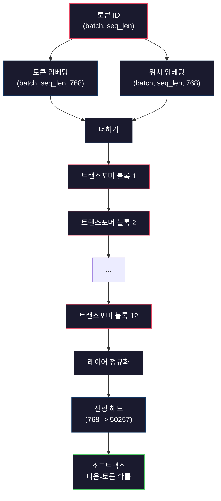
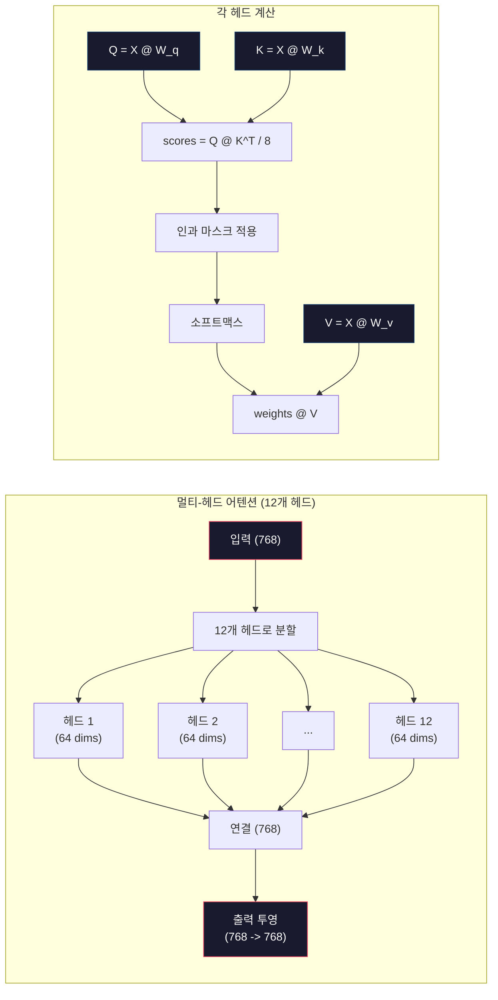
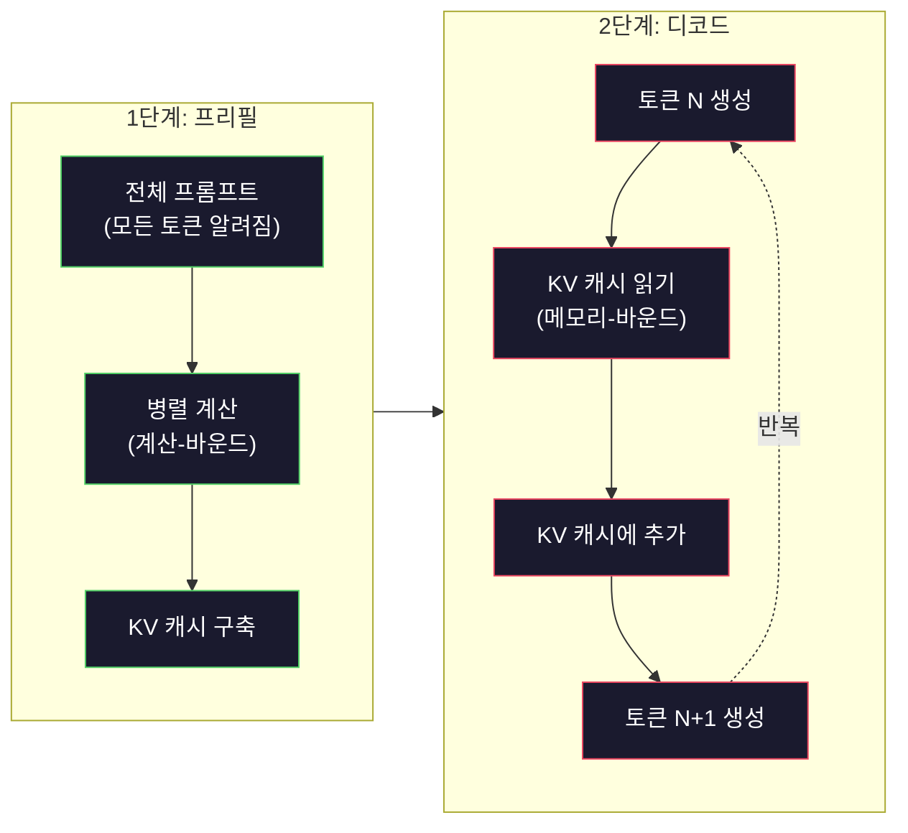

# 미니 GPT 사전 훈련 (124M 파라미터)

> GPT-2 Small은 1억 2400만 개의 파라미터를 가집니다. 12개의 트랜스포머 레이어, 12개의 어텐션 헤드, 768차원 임베딩입니다. 단일 GPU에서 몇 시간 만에 처음부터 훈련할 수 있습니다. 대부분의 사람들은 절대 이렇게 하지 않습니다. 그들은 사전 훈련된 체크포인트를 사용합니다. 그러나 직접 훈련해보지 않으면, 당신이 제품을 구축하고 있는 모델 내부에서 실제로 무슨 일이 일어나는지 이해하지 못합니다.

**유형:** 빌드
**언어:** Python (with numpy)
**사전 필요 지식:** 10단계, 01-03과 (토크나이저, 토크나이저 구축, 데이터 파이프라인)
**소요 시간:** ~120분

## 학습 목표

- 처음부터 전체 GPT-2 아키텍처(124M 파라미터) 구현: 토큰 임베딩, 위치 임베딩, 트랜스포머 블록, 언어 모델 헤드
- 교차-엔트로피 손실로 다음-토큰 예측을 사용하여 텍스트 말뭉치에서 GPT 모델 훈련
- 온도 샘플링과 top-k/top-p 필터링을 사용한 자기회귀 텍스트 생성 구현
- 훈련 손실 곡선 모니터링 및 모델이 일관된 언어 패턴을 학습하는지 검증

## 문제

트랜스포머가 무엇인지 알고 있습니다. 다이어그램을 읽었습니다. "어텐션 이즈 올 유 니드"를 암송할 수 있고 화이트보드에 "멀티-헤드 어텐션"이라고 적힌 상자를 그릴 수 있습니다.

그렇다고 해서 모델이 텍스트를 생성할 때 무슨 일이 일어나는지 이해한다는 의미는 아닙니다.

GPT-2 Small에는 (weight tying 포함) 124,438,272개의 파라미터가 있습니다. 그 모든 것은 훈련 루프를 실행함으로써 설정되었습니다: 순방향 전파, 손실 계산, 역방향 전파, 가중치 업데이트. 12개의 트랜스포머 블록. 블록당 12개의 어텐션 헤드. 768차원 임베딩 공간. 50,257개의 토큰으로 구성된 어휘. 모델이 토큰을 생성할 때마다 1억 2400만 개의 모든 파라미터가 하나의 행렬 곱셈 체인에 참여하여 토큰 ID 시퀀스를 받아 다음 토큰에 대한 확률 분포를 생성합니다.

이것을 직접 구축해본 적이 없다면, 블랙 박스로 작업하고 있는 것입니다. API를 사용할 수 있습니다. 미세 조정할 수 있습니다. 그러나 문제가 발생했을 때 — 모델이 환각을 보거나, 반복하거나, 지시를 따르지 않을 때 — *왜* 그런지에 대한 정신적 모델이 없습니다.

이 과는 GPT-2 Small을 처음부터 구축합니다. PyTorch가 아닙니다. numpy로 합니다. 모든 행렬 곱셈이 보입니다. 모든 기울기가 여러분의 코드에 의해 계산됩니다. 1억 2400만 개의 숫자가 어떻게 공모하여 다음 단어를 예측하는지 정확히 보게 될 것입니다.

## 개념

### GPT 아키텍처

GPT는 자기회귀 언어 모델입니다. "자기회귀"는 한 번에 하나의 토큰을 생성하며, 각 토큰은 이전의 모든 토큰에 조건화됨을 의미합니다. 아키텍처는 트랜스포머 디코더 블록의 스택입니다.

토큰 ID에서 다음-토큰 확률까지의 전체 계산 그래프입니다:

1. 토큰 ID 입력. 형태: (batch_size, seq_len).
2. 토큰 임베딩 조회. 각 ID는 768차원 벡터에 매핑됩니다. 형태: (batch_size, seq_len, 768).
3. 위치 임베딩 조회. 각 위치(0, 1, 2, ...)는 768차원 벡터에 매핑됩니다. 동일한 형태.
4. 토큰 임베딩 + 위치 임베딩 더하기.
5. 12개의 트랜스포머 블록 통과.
6. 최종 레이어 정규화.
7. 어휘 크기로 선형 투영. 형태: (batch_size, seq_len, vocab_size).
8. 소프트맥스로 확률 획득.

이것이 전체 모델입니다. 합성곱 없음. 순환 없음. 임베딩, 어텐션, 피드포워드 네트워크, 레이어 정규화가 12번 쌓인 것뿐입니다.



### 트랜스포머 블록

12개 블록 각각은 동일한 패턴을 따릅니다. 프리-노름 아키텍처(GPT-2는 원래 트랜스포머와 달리 포스트-노름이 아닌 프리-노름 사용):

1. LayerNorm
2. 멀티-헤드 셀프-어텐션
3. 잔차 연결 (입력을 다시 더함)
4. LayerNorm
5. 피드-포워드 네트워크 (MLP)
6. 잔차 연결 (입력을 다시 더함)

잔차 연결은 중요합니다. 이것이 없으면 역전파 중에 기울기가 블록 1에 도달할 때쯤 소멸됩니다. 잔차 연결이 있으면 기울기가 "스킵" 경로를 통해 손실에서 모든 레이어로 직접 흐를 수 있습니다. 이것이 12개, 32개, 또는 심지어 96개 블록(GPT-4는 120개를 사용한다고 알려짐)을 쌓을 수 있는 이유입니다.

### 어텐션: 핵심 메커니즘

셀프-어텐션은 모든 토큰이 이전의 모든 토큰을 보고 각각에 얼마나 주목할지 결정할 수 있게 합니다. 수학은 다음과 같습니다.

각 토큰 위치에 대해 입력에서 세 개의 벡터를 계산합니다:
- **쿼리 (Q)**: "내가 무엇을 찾고 있나?"
- **키 (K)**: "내가 무엇을 포함하고 있나?"
- **값 (V)**: "내가 어떤 정보를 전달하나?"

```
Q = input @ W_q    (768 -> 768)
K = input @ W_k    (768 -> 768)
V = input @ W_v    (768 -> 768)

attention_scores = Q @ K^T / sqrt(d_k)
attention_scores = mask(attention_scores)   # 인과 마스크: 미래 위치에 대해 -inf
attention_weights = softmax(attention_scores)
output = attention_weights @ V
```

인과 마스크가 GPT를 자기회귀적으로 만듭니다. 위치 5는 위치 0-5에 주목할 수 있지만 6, 7, 8 등에는 주목할 수 없습니다. 이는 훈련 중에 모델이 미래 토큰을 보고 "커닝"하는 것을 방지합니다.

**멀티-헤드 어텐션**은 768차원 공간을 각각 64차원의 12개 헤드로 분할합니다. 각 헤드는 다른 어텐션 패턴을 학습합니다. 한 헤드는 통사적 관계(주어-동사 일치)를 추적할 수 있습니다. 다른 헤드는 의미적 유사성(동의어)을 추적할 수 있습니다. 또 다른 헤드는 위치적 근접성(가까운 단어)을 추적할 수 있습니다. 12개 헤드 모두의 출력은 연결되고 다시 768차원으로 투영됩니다.



sqrt(d_k) — sqrt(64) = 8 — 로 나누는 것은 스케일링입니다. 이것이 없으면 고차원 벡터에 대해 내적이 커져서 소프트맥스를 기울기가 거의 0인 영역으로 밀어넣습니다. 이것은 원래 "Attention Is All You Need" 논문의 핵심 통찰 중 하나였습니다.

### KV 캐시: 추론이 빠른 이유

훈련 중에는 전체 시퀀스를 한 번에 처리합니다. 추론 중에는 한 번에 하나의 토큰을 생성합니다. 최적화 없이 토큰 N을 생성하려면 이전 N-1개 토큰 모두에 대해 어텐션을 다시 계산해야 합니다. 생성된 토큰당 O(N^2)이며, 길이 N의 시퀀스에 대해 총 O(N^3)입니다.

KV 캐시가 이를 해결합니다. 각 토큰에 대해 K와 V를 계산한 후 저장합니다. 토큰 N+1을 생성할 때 새 토큰에 대해서만 Q를 계산하고 이전 토큰의 캐시된 K와 V를 조회하면 됩니다. 이렇게 하면 토큰당 K와 V 계산 비용이 O(N)에서 O(1)로 줄어듭니다. 어텐션 점수 계산은 여전히 O(N)입니다(모든 이전 위치에 주목하기 때문에), 그러나 입력에 대한 중복 행렬 곱셈을 피합니다.

GPT-2(12레이어, 12헤드)의 경우 KV 캐시는 토큰당 2(K+V) x 12레이어 x 12헤드 x 64차원 = 18,432개의 값을 저장합니다. 1024-토큰 시퀀스의 경우 FP32에서 약 75MB입니다. Llama 3 405B(128레이어)의 경우 단일 시퀀스에 대한 KV 캐시가 10GB를 초과할 수 있습니다. 이것이 긴 컨텍스트 추론이 메모리 바운드인 이유입니다.

### 프리필 vs 디코드: 추론의 두 단계

LLM에 프롬프트를 보낼 때 추론은 두 개의 뚜렷한 단계로 발생합니다.

**프리필(Prefill)** 은 전체 프롬프트를 병렬로 처리합니다. 모든 토큰이 알려져 있으므로 모델이 모든 위치에 대해 동시에 어텐션을 계산할 수 있습니다. 이 단계는 계산-바운드입니다 — GPU가 최대 처리량으로 행렬 곱셈을 수행합니다. A100에서 1000-토큰 프롬프트의 경우 프리필은 약 20-50ms가 걸립니다.

**디코드(Decode)** 는 토큰을 한 번에 하나씩 생성합니다. 각 새 토큰은 모든 이전 토큰에 의존합니다. 이 단계는 메모리-바운드입니다 — 병목은 행렬 수학 자체가 아니라 GPU 메모리에서 모델 가중치와 KV 캐시를 읽는 것입니다. GPU의 계산 코어는 대부분 유휴 상태로 메모리 읽기를 기다립니다. GPT-2의 경우 각 디코드 단계는 행렬 곱셈에 필요한 FLOPs 수에 관계없이 거의 동일한 시간이 걸리는데, 메모리 대역폭이 제약이기 때문입니다.

이 구분은 프로덕션 시스템에 중요합니다. 프리필 처리량은 GPU 계산(더 많은 FLOPS = 더 빠른 프리필)에 따라 확장됩니다. 디코드 처리량은 메모리 대역폭(더 빠른 메모리 = 더 빠른 디코드)에 따라 확장됩니다. 이것이 NVIDIA의 H100이 A100보다 메모리 대역폭 개선에 집중한 이유입니다 — 토큰 생성을 직접 가속화합니다.



### 훈련 루프

LLM 훈련은 다음-토큰 예측입니다. 토큰 [0, 1, 2, ..., N-1]이 주어지면 토큰 [1, 2, 3, ..., N]을 예측합니다. 손실 함수는 모델의 예측 확률 분포와 실제 다음 토큰 간의 교차-엔트로피입니다.

하나의 훈련 단계:

1. **순방향 전파**: 모든 12개 블록을 통해 배치를 실행합니다. 각 위치에 대한 로짓(소프트맥스 전 점수)을 얻습니다.
2. **손실 계산**: 로짓과 대상 토큰(한 위치씩 이동된 입력) 간의 교차-엔트로피.
3. **역방향 전파**: 역전파를 사용하여 모든 124M 파라미터에 대한 기울기를 계산합니다.
4. **최적화 단계**: 가중치 업데이트. GPT-2는 학습률 웜업과 코사인 감소가 있는 Adam을 사용합니다.

학습률 스케줄은 생각보다 더 중요합니다. GPT-2는 처음 2,000단계에 걸쳐 0에서 최고 학습률까지 웜업한 다음 코사인 곡선을 따라 감소합니다. 높은 학습률로 시작하면 모델이 발산합니다. 일정하게 높은 비율을 유지하면 후반 훈련에서 진동이 발생합니다. 웜업-후-감소 패턴은 모든 주요 LLM에서 사용됩니다.

### GPT-2 Small: 숫자

| 구성요소 | 형태 | 파라미터 |
|---|---|---|
| 토큰 임베딩 | (50257, 768) | 38,597,376 |
| 위치 임베딩 | (1024, 768) | 786,432 |
| 블록당 어텐션 (W_q, W_k, W_v, W_out) | 4 x (768, 768) | 2,359,296 |
| 블록당 FFN (up + down) | (768, 3072) + (3072, 768) | 4,718,592 |
| 블록당 LayerNorm (2x) | 2 x 768 x 2 | 3,072 |
| 최종 LayerNorm | 768 x 2 | 1,536 |
| **블록당 총계** | | **7,080,960** |
| **총계 (12개 블록)** | | **85,054,464 + 39,383,808 = 124,438,272** |

출력 투영(로짓 헤드)은 토큰 임베딩 행렬과 가중치를 공유합니다. 이것을 weight tying이라고 합니다 — 파라미터 수를 38M 줄이고, 입력과 출력에 동일한 표현 공간을 사용하도록 모델을 강제하여 성능을 향상시킵니다.

## 직접 구축하기

### 1단계: 임베딩 레이어

토큰 임베딩은 가능한 50,257개 토큰 각각을 768차원 벡터에 매핑합니다. 위치 임베딩은 각 토큰이 시퀀스에서 어디에 있는지에 대한 정보를 추가합니다. 둘은 합산됩니다.

```python
import numpy as np

class Embedding:
    def __init__(self, vocab_size, embed_dim, max_seq_len):
        self.token_embed = np.random.randn(vocab_size, embed_dim) * 0.02
        self.pos_embed = np.random.randn(max_seq_len, embed_dim) * 0.02

    def forward(self, token_ids):
        seq_len = token_ids.shape[-1]
        tok_emb = self.token_embed[token_ids]
        pos_emb = self.pos_embed[:seq_len]
        return tok_emb + pos_emb
```

초기화를 위한 0.02 표준 편차는 GPT-2 논문에서 비롯되었습니다. 너무 크면 초기 순방향 전파가 훈련을 불안정하게 만드는 극단적인 값을 생성합니다. 너무 작으면 초기 출력이 모든 입력에 대해 거의 동일하여 초기 기울기 신호가 무용지물이 됩니다.

### 2단계: 인과 마스크가 있는 셀프-어텐션

먼저 단일-헤드 어텐션입니다. 인과 마스크는 소프트맥스 전에 미래 위치를 음의 무한대로 설정하여 각 위치가 자신과 이전 위치에만 주목할 수 있도록 보장합니다.

```python
def attention(Q, K, V, mask=None):
    d_k = Q.shape[-1]
    scores = Q @ K.transpose(0, -1, -2 if Q.ndim == 4 else 1) / np.sqrt(d_k)
    if mask is not None:
        scores = scores + mask
    weights = np.exp(scores - scores.max(axis=-1, keepdims=True))
    weights = weights / weights.sum(axis=-1, keepdims=True)
    return weights @ V
```

소프트맥스 구현은 지수화 전에 최대값을 뺍니다. 이것이 없으면 exp(큰_수)가 무한대로 오버플로됩니다. 이것은 출력을 변경하지 않는 수치적 안정성 트릭입니다. 임의의 상수 c에 대해 softmax(x - c) = softmax(x)이기 때문입니다.

### 3단계: 멀티-헤드 어텐션

768차원 입력을 각각 64차원의 12개 헤드로 분할합니다. 각 헤드는 독립적으로 어텐션을 계산합니다. 결과를 연결하고 다시 768차원으로 투영합니다.

```python
class MultiHeadAttention:
    def __init__(self, embed_dim, num_heads):
        self.num_heads = num_heads
        self.head_dim = embed_dim // num_heads
        self.W_q = np.random.randn(embed_dim, embed_dim) * 0.02
        self.W_k = np.random.randn(embed_dim, embed_dim) * 0.02
        self.W_v = np.random.randn(embed_dim, embed_dim) * 0.02
        self.W_out = np.random.randn(embed_dim, embed_dim) * 0.02

    def forward(self, x, mask=None):
        batch, seq_len, d = x.shape
        Q = (x @ self.W_q).reshape(batch, seq_len, self.num_heads, self.head_dim).transpose(0, 2, 1, 3)
        K = (x @ self.W_k).reshape(batch, seq_len, self.num_heads, self.head_dim).transpose(0, 2, 1, 3)
        V = (x @ self.W_v).reshape(batch, seq_len, self.num_heads, self.head_dim).transpose(0, 2, 1, 3)

        scores = Q @ K.transpose(0, 1, 3, 2) / np.sqrt(self.head_dim)
        if mask is not None:
            scores = scores + mask
        weights = np.exp(scores - scores.max(axis=-1, keepdims=True))
        weights = weights / weights.sum(axis=-1, keepdims=True)
        attn_out = weights @ V

        attn_out = attn_out.transpose(0, 2, 1, 3).reshape(batch, seq_len, d)
        return attn_out @ self.W_out
```

reshape-transpose-reshape 댄스는 멀티-헤드 어텐션에서 가장 혼란스러운 부분입니다. 일어나는 일은 다음과 같습니다: (batch, seq_len, 768) 텐서가 (batch, seq_len, 12, 64)가 된 다음 (batch, 12, seq_len, 64)가 됩니다. 이제 12개 헤드 각각이 어텐션을 실행할 자체 (seq_len, 64) 행렬을 가집니다. 어텐션 후에 과정을 역으로 수행합니다: (batch, 12, seq_len, 64)가 (batch, seq_len, 12, 64)가 되고 (batch, seq_len, 768)이 됩니다.

### 4단계: 트랜스포머 블록

하나의 완전한 트랜스포머 블록: LayerNorm, 잔차 연결이 있는 멀티-헤드 어텐션, LayerNorm, 잔차 연결이 있는 피드포워드.

```python
class LayerNorm:
    def __init__(self, dim, eps=1e-5):
        self.gamma = np.ones(dim)
        self.beta = np.zeros(dim)
        self.eps = eps

    def forward(self, x):
        mean = x.mean(axis=-1, keepdims=True)
        var = x.var(axis=-1, keepdims=True)
        return self.gamma * (x - mean) / np.sqrt(var + self.eps) + self.beta


class FeedForward:
    def __init__(self, embed_dim, ff_dim):
        self.W1 = np.random.randn(embed_dim, ff_dim) * 0.02
        self.b1 = np.zeros(ff_dim)
        self.W2 = np.random.randn(ff_dim, embed_dim) * 0.02
        self.b2 = np.zeros(embed_dim)

    def forward(self, x):
        h = x @ self.W1 + self.b1
        h = np.maximum(0, h)  # GELU 근사: 단순화를 위해 ReLU 사용
        return h @ self.W2 + self.b2


class TransformerBlock:
    def __init__(self, embed_dim, num_heads, ff_dim):
        self.ln1 = LayerNorm(embed_dim)
        self.attn = MultiHeadAttention(embed_dim, num_heads)
        self.ln2 = LayerNorm(embed_dim)
        self.ffn = FeedForward(embed_dim, ff_dim)

    def forward(self, x, mask=None):
        x = x + self.attn.forward(self.ln1.forward(x), mask)
        x = x + self.ffn.forward(self.ln2.forward(x))
        return x
```

피드포워드 네트워크는 768차원 입력을 3,072차원(4배)으로 확장하고, 비선형성을 적용한 다음 다시 768로 투영합니다. 이 확장-수축 패턴은 모델이 각 위치에서 작업할 더 "넓은" 내부 표현을 제공합니다. GPT-2는 GELU 활성화를 사용하지만, 여기서는 단순화를 위해 ReLU를 사용합니다 — 아키텍처 이해에는 차이가 미미합니다.

### 5단계: 전체 GPT 모델

12개의 트랜스포머 블록을 쌓습니다. 앞에 임베딩 레이어를, 뒤에 출력 투영을 추가합니다.

```python
class MiniGPT:
    def __init__(self, vocab_size=50257, embed_dim=768, num_heads=12,
                 num_layers=12, max_seq_len=1024, ff_dim=3072):
        self.embedding = Embedding(vocab_size, embed_dim, max_seq_len)
        self.blocks = [
            TransformerBlock(embed_dim, num_heads, ff_dim)
            for _ in range(num_layers)
        ]
        self.ln_f = LayerNorm(embed_dim)
        self.vocab_size = vocab_size
        self.embed_dim = embed_dim

    def forward(self, token_ids):
        seq_len = token_ids.shape[-1]
        mask = np.triu(np.full((seq_len, seq_len), -1e9), k=1)

        x = self.embedding.forward(token_ids)
        for block in self.blocks:
            x = block.forward(x, mask)
        x = self.ln_f.forward(x)

        logits = x @ self.embedding.token_embed.T
        return logits

    def count_parameters(self):
        total = 0
        total += self.embedding.token_embed.size
        total += self.embedding.pos_embed.size
        for block in self.blocks:
            total += block.attn.W_q.size + block.attn.W_k.size
            total += block.attn.W_v.size + block.attn.W_out.size
            total += block.ffn.W1.size + block.ffn.b1.size
            total += block.ffn.W2.size + block.ffn.b2.size
            total += block.ln1.gamma.size + block.ln1.beta.size
            total += block.ln2.gamma.size + block.ln2.beta.size
        total += self.ln_f.gamma.size + self.ln_f.beta.size
        return total
```

weight tying에 주목하세요: `logits = x @ self.embedding.token_embed.T`. 출력 투영은 토큰 임베딩 행렬(전치된)을 재사용합니다. 이것은 단순한 파라미터 절약 트릭이 아닙니다. 모델이 토큰 이해(임베딩)와 예측(출력)에 동일한 벡터 공간을 사용한다는 의미입니다.

### 6단계: 훈련 루프

실제 124M 파라미터 훈련 실행을 위해서는 GPU와 PyTorch가 필요합니다. 이 훈련 루프는 순수 numpy로 실행되는 작은 모델에서 메커니즘을 보여줍니다. 다루기 쉽게 하기 위해 작은 모델(4레이어, 4헤드, 128차원)을 사용합니다.

```python
def cross_entropy_loss(logits, targets):
    batch, seq_len, vocab_size = logits.shape
    logits_flat = logits.reshape(-1, vocab_size)
    targets_flat = targets.reshape(-1)

    max_logits = logits_flat.max(axis=-1, keepdims=True)
    log_softmax = logits_flat - max_logits - np.log(
        np.exp(logits_flat - max_logits).sum(axis=-1, keepdims=True)
    )

    loss = -log_softmax[np.arange(len(targets_flat)), targets_flat].mean()
    return loss


def train_mini_gpt(text, vocab_size=256, embed_dim=128, num_heads=4,
                   num_layers=4, seq_len=64, num_steps=200, lr=3e-4):
    tokens = np.array(list(text.encode("utf-8")[:2048]))
    model = MiniGPT(
        vocab_size=vocab_size, embed_dim=embed_dim, num_heads=num_heads,
        num_layers=num_layers, max_seq_len=seq_len, ff_dim=embed_dim * 4
    )

    print(f"모델 파라미터: {model.count_parameters():,}")
    print(f"훈련 토큰: {len(tokens):,}")
    print(f"설정: {num_layers}레이어, {num_heads}헤드, {embed_dim}차원")
    print()

    for step in range(num_steps):
        start_idx = np.random.randint(0, max(1, len(tokens) - seq_len - 1))
        batch_tokens = tokens[start_idx:start_idx + seq_len + 1]

        input_ids = batch_tokens[:-1].reshape(1, -1)
        target_ids = batch_tokens[1:].reshape(1, -1)

        logits = model.forward(input_ids)
        loss = cross_entropy_loss(logits, target_ids)

        if step % 20 == 0:
            print(f"단계 {step:4d} | 손실: {loss:.4f}")

    return model
```

손실은 ln(vocab_size) 근처에서 시작합니다 — 256-토큰 바이트-수준 어휘의 경우 ln(256) = 5.55입니다. 무작위 모델은 모든 토큰에 동일한 확률을 할당합니다. 훈련이 진행됨에 따라 모델이 일반적인 패턴을 예측하는 법을 배우면서 손실이 감소합니다: "t" 다음에 "th", 마침표 다음에 공백 등입니다.

프로덕션에서는 기울기 누적, 학습률 웜업, 기울기 클리핑이 있는 Adam 최적화기를 사용합니다. 순방향 전파-손실-역방향 전파-업데이트 루프는 동일합니다. 최적화기가 더 정교합니다.

### 7단계: 텍스트 생성

생성은 훈련된 모델을 사용하여 한 번에 하나의 토큰을 예측합니다. 각 예측은 출력 분포에서 샘플링되거나(또는 argmax로 탐욕적으로 취해집니다).

```python
def generate(model, prompt_tokens, max_new_tokens=100, temperature=0.8):
    tokens = list(prompt_tokens)
    seq_len = model.embedding.pos_embed.shape[0]

    for _ in range(max_new_tokens):
        context = np.array(tokens[-seq_len:]).reshape(1, -1)
        logits = model.forward(context)
        next_logits = logits[0, -1, :]

        next_logits = next_logits / temperature
        probs = np.exp(next_logits - next_logits.max())
        probs = probs / probs.sum()

        next_token = np.random.choice(len(probs), p=probs)
        tokens.append(next_token)

    return tokens
```

온도는 무작위성을 제어합니다. 온도 1.0은 원시 분포를 사용합니다. 온도 0.5는 분포를 날카롭게 만듭니다(더 결정론적 — 모델이 상위 선택을 더 자주 선택합니다). 온도 1.5는 분포를 평평하게 만듭니다(더 무작위적 — 낮은 확률의 토큰이 더 큰 기회를 얻습니다). 온도 0.0은 탐욕 디코딩입니다(항상 가장 높은 확률의 토큰을 선택).

`tokens[-seq_len:]` 윈도우는 모델에 최대 컨텍스트 길이(GPT-2의 경우 1024)가 있기 때문에 필요합니다. 이를 초과하면 가장 오래된 토큰을 드롭해야 합니다. 이것이 모두가 말하는 "컨텍스트 윈도우"입니다.

## 사용해보기

### 전체 훈련 및 생성 데모

```python
corpus = """The transformer architecture has revolutionized natural language processing.
Attention mechanisms allow the model to focus on relevant parts of the input.
Self-attention computes relationships between all pairs of positions in a sequence.
Multi-head attention splits the representation into multiple subspaces.
Each attention head can learn different types of relationships.
The feedforward network provides nonlinear transformations at each position.
Residual connections enable gradient flow through deep networks.
Layer normalization stabilizes training by normalizing activations.
Position embeddings give the model information about token ordering.
The causal mask ensures autoregressive generation during training.
Pre-training on large text corpora teaches the model general language understanding.
Fine-tuning adapts the pre-trained model to specific downstream tasks."""

model = train_mini_gpt(corpus, num_steps=200)

prompt = list("The transformer".encode("utf-8"))
output_tokens = generate(model, prompt, max_new_tokens=100, temperature=0.8)
generated_text = bytes(output_tokens).decode("utf-8", errors="replace")
print(f"\n생성됨: {generated_text}")
```

작은 말뭉치와 작은 모델에서 생성된 텍스트는 기껏해야 반쯤 일관성이 있을 것입니다. 훈련 텍스트에서 일부 바이트-수준 패턴을 학습하지만 40GB의 훈련 데이터와 완전한 124M 파라미터 아키텍처를 가진 GPT-2 방식으로 일반화할 수 없습니다. 요점은 출력 품질이 아닙니다. 요점은 모든 단계를 추적할 수 있다는 것입니다: 임베딩 조회, 어텐션 계산, 피드포워드 변환, 로짓 투영, 소프트맥스, 샘플링. 모든 연산이 보입니다.

## 배포하기

이 과는 `outputs/prompt-gpt-architecture-analyzer.md`를 제공합니다 — 모든 GPT-스타일 모델의 아키텍처 선택을 분석하는 프롬프트입니다. 모델 카드나 기술 보고서를 입력하면 파라미터 할당, 어텐션 디자인, 스케일링 결정을 분석합니다.

## 연습 문제

1. 12/12 대신 24레이어와 16헤드를 사용하도록 모델을 수정하세요. 파라미터를 계산하세요. 깊이를 두 배로 늘리는 것과 너비(임베딩 차원)를 두 배로 늘리는 것을 어떻게 비교하나요?

2. GELU 활성화 함수(GELU(x) = x * 0.5 * (1 + erf(x / sqrt(2))))를 구현하고 피드포워드 네트워크의 ReLU를 교체하세요. 각 활성화로 500단계 훈련을 실행하고 최종 손실을 비교하세요.

3. 생성 함수에 KV 캐시를 추가하세요. 첫 번째 순방향 전파 후 각 레이어의 K와 V 텐서를 저장하고, 후속 토큰에 대해 재사용하세요. 속도 향상을 측정하세요: 캐시 유무에 따라 200개 토큰을 생성하고 벽시계 시간을 비교하세요.

4. top-k 샘플링(가장 높은 확률의 k개 토큰만 고려)과 top-p 샘플링(누적 확률이 p를 초과하는 가장 작은 토큰 집합)을 구현하세요. 온도 0.8에서 top-k=50과 top-p=0.95의 출력 품질을 비교하세요.

5. 훈련 손실 곡선 플로터를 구축하세요. 1000단계 동안 모델을 훈련하고 손실 대 단계를 플로팅하세요. 세 단계를 식별하세요: 빠른 초기 하강(공통 바이트 학습), 느린 중간 단계(바이트 패턴 학습), 평탄화(작은 말뭉치에 과적합). 이 곡선의 모양은 128-차원 모델을 훈련하든 GPT-4를 훈련하든 동일합니다.

## 주요 용어

| 용어 | 사람들이 말하는 것 | 실제 의미 |
|---|---|---|
| 자기회귀 | "한 번에 한 단어씩 생성" | 각 출력 토큰은 모든 이전 토큰에 조건화됨 — 모델은 P(token_n \| token_0, ..., token_{n-1})을 예측 |
| 인과 마스크 | "미래를 볼 수 없음" | 훈련 중 미래 위치에 대한 어텐션을 방지하는 -무한대 값의 상삼각 행렬 |
| 멀티-헤드 어텐션 | "여러 어텐션 패턴" | Q, K, V를 병렬 헤드로 분할(GPT-2의 경우 각각 64차원의 12개 헤드)하여 각 헤드가 다른 관계 유형을 학습할 수 있게 함 |
| KV 캐시 | "속도를 위한 캐싱" | 이전 토큰에서 계산된 키와 값 텐서를 저장하여 자기회귀 생성 중 중복 계산 방지 |
| 프리필 | "프롬프트 처리" | 모든 프롬프트 토큰이 병렬로 처리되는 첫 번째 추론 단계 — GPU FLOPS에 계산-바운드 |
| 디코드 | "토큰 생성" | 토큰이 한 번에 하나씩 생성되는 두 번째 추론 단계 — GPU 대역폭에 메모리-바운드 |
| Weight tying | "임베딩 공유" | 입력 토큰 임베딩과 출력 투영 헤드에 동일한 행렬 사용 — GPT-2에서 38M 파라미터 절약 |
| 잔차 연결 | "스킵 연결" | 입력을 하위 레이어의 출력에 직접 추가(x + sublayer(x)) — 깊은 네트워크에서 기울기 흐름 가능 |
| 레이어 정규화 | "활성화 정규화" | 피처 차원에 걸쳐 평균 0, 분산 1로 정규화, 학습 가능한 스케일 및 바이어스 파라미터 포함 |
| 교차-엔트로피 손실 | "예측이 얼마나 틀렸는지" | -log(올바른 다음 토큰에 할당된 확률), 모든 위치에 대해 평균 — 표준 LLM 훈련 목적 함수 |

## 추가 자료

- [Radford et al., 2019 — "Language Models are Unsupervised Multitask Learners" (GPT-2)](https://cdn.openai.com/better-language-models/language_models_are_unsupervised_multitask_learners.pdf) — 124M에서 1.5B 파라미터 제품군을 소개한 GPT-2 논문
- [Vaswani et al., 2017 — "Attention Is All You Need"](https://arxiv.org/abs/1706.03762) — 스케일드 닷-프로덕트 어텐션과 멀티-헤드 어텐션을 포함한 원래 트랜스포머 논문
- [Llama 3 Technical Report](https://arxiv.org/abs/2407.21783) — Meta가 16K GPU로 GPT 아키텍처를 405B 파라미터로 확장한 방법
- [Pope et al., 2022 — "Efficiently Scaling Transformer Inference"](https://arxiv.org/abs/2211.05102) — 프리필 대 디코드 및 KV 캐시 분석을 공식화한 논문
