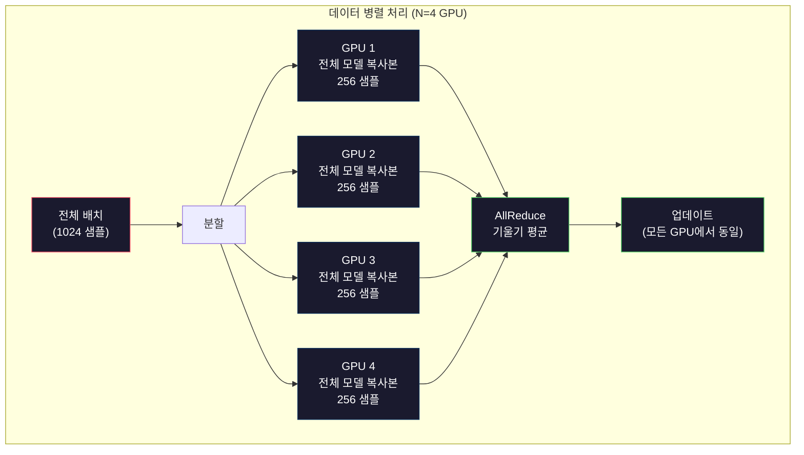
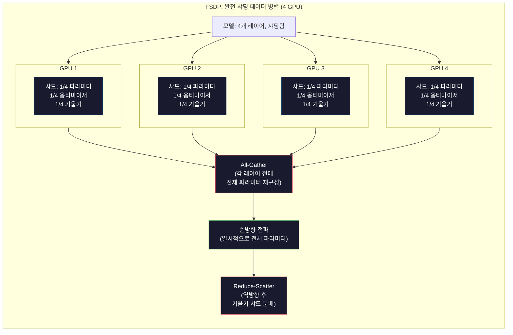
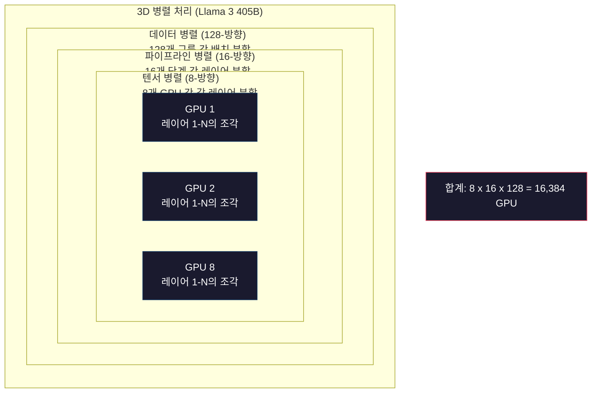

# 스케일링: 분산 훈련, FSDP, DeepSpeed

> 124M 모델이 하나의 GPU에서 훈련되었습니다. 이제 70억 개의 파라미터를 시도해보세요. 모델이 메모리에 맞지 않습니다. 데이터는 단일 머신에서 몇 주가 걸립니다. 분산 훈련은 대규모에서 선택 사항이 아닙니다. 그것이 유일한 길입니다.

**유형:** 빌드
**언어:** Python
**사전 필요 지식:** 10단계, 04과 (미니 GPT 사전 훈련)
**소요 시간:** ~120분

## 학습 목표

- 세 가지 유형의 병렬 처리(데이터, 텐서, 파이프라인)와 각각이 모델 및 클러스터 크기에 따라 언제 필요한지 설명
- PyTorch DDP를 사용하여 여러 GPU에서 기울기 동기화를 통한 데이터-병렬 훈련 구현
- 주어진 모델 크기에 대한 메모리 예산(가중치 + 옵티마이저 상태 + 기울기 + 활성화) 계산하여 최소 하드웨어 결정
- FSDP 또는 DeepSpeed ZeRO 단계를 구성하여 GPU 간 모델 상태 샤딩 및 단일 GPU 메모리를 초과하는 모델 피팅

## 문제

FP16의 7B 파라미터 모델은 가중치만으로 14GB가 필요합니다. Adam 옵티마이저는 모든 파라미터의 두 개 추가 복사본(첫 번째 및 두 번째 모멘트 추정치)을 저장합니다. 그게 또 28GB입니다. 역전파 중 기울기가 추가로 14GB를 더합니다. 단일 활성화가 저장되기 전에 56GB에 도달합니다.

NVIDIA A100의 메모리는 80GB입니다.

80GB 중 56GB가 소비되었습니다. 활성화 — 순방향 전파 중에 계산되어 역전파를 위해 유지되어야 하는 중간 값 — 에는 24GB가 남습니다. 2048-토큰 시퀀스와 4096차원 모델의 경우 단일 레이어의 활성화는 약 64MB를 사용합니다. 32개 레이어의 경우 샘플당 2GB가 필요합니다. 배치 크기 8은 16GB가 필요합니다. 24GB가 있습니다. 배치 크기 12는 폭발합니다.

이제 70B 파라미터를 시도해보세요. 가중치만: FP16에서 140GB. 하나의 GPU에 맞지 않습니다. 가중치만 담아도 최소 2개의 A100(2 x 80GB = 160GB)이 필요합니다. 옵티마이저 상태와 기울기를 추가하면 훨씬 더 많이 필요합니다: 최소 3+ GPU, 그리고 현실적으로 샤딩 전략에 따라 8-16개입니다.

Llama 3 405B는 16,384개의 NVIDIA H100 GPU에서 훈련되었습니다. 훈련 실행 비용은 추정 1억 달러의 컴퓨팅 비용이 들었습니다. DeepSeek V3는 아키텍처(전문가 혼합(Mixture of Experts)은 토큰당 파라미터의 일부만 활성화됨을 의미)와 훈련 효율성에 대해 영리하게 접근하여 약 560만 달러로 비슷한 모델을 훈련했습니다.

이 과는 대규모 훈련을 가능하게 하는 네 가지 전략을 다룹니다: 데이터 병렬 처리, 텐서 병렬 처리, 파이프라인 병렬 처리, 완전 샤딩 데이터 병렬 처리. 분산 훈련 프레임워크를 건드리기 전에 메커니즘을 이해하기 위해 각각을 순수 Python으로 시뮬레이션할 것입니다.

## 개념

### 분산이 필요한 이유

실제 모델에 대한 메모리 계산입니다. 모든 숫자는 추정이 아닌 계산된 것입니다.

| 모델 | 파라미터 | 가중치 (FP16) | Adam 상태 | 기울기 (FP16) | 합계 (활성화 제외) |
|---|---|---|---|---|---|
| GPT-2 Small | 124M | 248 MB | 992 MB | 248 MB | 1.5 GB |
| Llama 3 8B | 8B | 16 GB | 64 GB | 16 GB | 96 GB |
| Llama 3 70B | 70B | 140 GB | 560 GB | 140 GB | 840 GB |
| Llama 3 405B | 405B | 810 GB | 3,240 GB | 810 GB | 4,860 GB |

"Adam 상태" 열이 킬러입니다. Adam은 모든 파라미터에 대해 실행 평균(m)과 실행 분산(v)을 모두 FP32로 저장합니다. 70B 모델의 경우 70B x 4바이트 x 2 = 560GB입니다. 옵티마이저만 7개의 A100이 필요합니다.

단일 H100은 80GB입니다. Llama 3 405B는 가중치, 옵티마이저, 기울기를 담는 데 최소 61개의 H100이 필요합니다. 활성화를 추가하면 숫자가 더 커집니다. Meta가 16,384개의 GPU를 사용한 것은 원해서가 아니라 — 어쩔 수 없었기 때문입니다.

### 데이터 병렬 처리

가장 간단한 분산 전략입니다. 전체 모델을 N개 GPU에 복사합니다. 각 훈련 배치를 N개의 동일한 부분으로 분할합니다. 각 GPU는 데이터 샤드에서 순방향 및 역방향 전파를 실행합니다. 역방향 전파 후 모든 GPU에서 기울기를 평균합니다. 모든 GPU는 동일한 평균 기울기로 가중치 복사본을 업데이트하여 모든 복사본을 동기화 상태로 유지합니다.

**장점:** 선형 처리량 확장. N개 GPU는 단계당 N배 더 많은 데이터를 처리합니다. 통신은 기울기 평균으로 제한되며, 이는 계산과 중첩됩니다.

**단점:** 모든 GPU가 모델, 옵티마이저 상태, 기울기의 완전한 복사본을 보유합니다. 70B 모델의 경우 각 GPU에 840GB가 필요합니다. 데이터 병렬 처리는 GPU당 메모리를 줄이지 않습니다. 훈련 시간만 줄입니다.

**수학:** 유효 배치 크기 = GPU당_배치_크기 x N. N=64 GPU, GPU당 배치 16의 경우 유효 배치는 1,024입니다. Llama 3는 단계당 1,600만 토큰의 유효 배치 크기를 사용했습니다.



### 텐서 병렬 처리

개별 레이어를 GPU 간에 분할합니다. 단일 행렬 곱셈이 GPU 간에 나뉘어 각각 결과의 일부를 계산합니다.

피드포워드 레이어에서 (8192, 8192) 형태의 가중치 행렬을 고려하세요. 4-방향 텐서 병렬 처리를 사용하면 각 GPU가 (8192, 2048) 샤드를 보유합니다. 각 GPU는 입력에 자신의 샤드를 곱하여 부분 결과를 생성합니다. 부분 결과는 결합되어(all-reduce 또는 all-gather를 통해) 전체 출력을 생성합니다.

**장점:** 모델 가중치에 대한 GPU당 메모리를 줄입니다. 8개 GPU에 분할된 70B 모델은 각 GPU가 약 8.75B 파라미터 worth의 가중치를 보유함을 의미합니다.

**단점:** 모든 레이어 후에 빠른 GPU 간 통신이 필요합니다. 각 matmul 후의 all-reduce는 지연 시간을 추가합니다. 이는 동일한 노드 내 GPU 간 NVLink(900 GB/s)에서는 잘 작동하지만 InfiniBand(400 Gb/s, 약 50 GB/s)로 연결된 노드 간에는 성능이 좋지 않습니다. 텐서 병렬 처리는 거의 항상 단일 노드(8 GPU) 내로 제한됩니다.

**실제 사용:** Megatron-LM이 텐서 병렬 처리를 개척했습니다. Llama 3 405B는 각 노드 내에서 8-방향 텐서 병렬 처리를 사용합니다.

### 파이프라인 병렬 처리

레이어별로 모델을 분할합니다. GPU 1은 레이어 1-8을 실행합니다. GPU 2는 레이어 9-16을 실행합니다. GPU 3은 레이어 17-24를 실행합니다. GPU 4는 레이어 25-32를 실행합니다. 데이터는 파이프라인을 통해 흐릅니다: GPU 1이 레이어를 계산하고 활성화를 GPU 2로 보내고, GPU 2가 레이어를 계산하고 GPU 3으로 보내는 식입니다.

**장점:** GPU 간 최소한의 통신 — 레이어 경계에서의 활성화만 필요하며, 이는 기울기나 가중치에 비해 작습니다. 대역폭 요구사항이 낮기 때문에 노드 간에 작동합니다.

**단점:** 파이프라인 버블. GPU 4가 마이크로-배치 1에 대한 순방향 전파를 계산 중일 때 GPU 1, 2, 3은 유휴 상태입니다(이미 자신의 부분을 전달했습니다). 역방향 전파 중에는 패턴이 반전됩니다. 순진한 파이프라이닝을 사용하면 GPU 활용률은 N 파이프라인 단계에 대해 1/N에 불과합니다.

**GPipe와 PipeDream**은 배치를 마이크로-배치로 분할하여 버블 문제를 해결합니다. GPU 1은 마이크로-배치 1 전달을 마치자마자 마이크로-배치 2에서 시작합니다. 이는 파이프라인 단계 전반에 걸쳐 계산을 중첩합니다. M개의 마이크로-배치와 N개의 단계에서 버블 비율은 (N-1)/M로 떨어집니다. N=4 단계와 M=16 마이크로-배치를 사용하면 버블은 3/16 = 18.75% 유휴 시간입니다.

### FSDP: 완전 샤딩 데이터 병렬

FSDP은 데이터 병렬 처리의 확장성과 샤딩의 메모리 효율성을 결합합니다. 각 GPU가 모델의 완전한 복사본을 보유하는 대신, 각 GPU는 파라미터, 기울기, 옵티마이저 상태의 1/N만 보유합니다.

레이어의 순방향 전파 전에 FSDP는 **all-gather**를 실행하여 모든 GPU에서 전체 파라미터를 수집하여 각 GPU의 메모리에 저장합니다. 순방향 전파 후 각 GPU는 로컬이 아닌 파라미터를 폐기합니다. 역방향 전파 중에는 기울기 계산을 위해 파라미터를 재구성하기 위해 all-gather가 다시 실행됩니다. 역방향 전파 후 **reduce-scatter**가 기울기 샤드를 분배하여 각 GPU가 기울기의 1/N만 저장하도록 합니다.

**8개 GPU에서 70B 모델에 대한 수학:**

| 구성요소 | FSDP 없음 | FSDP 사용 |
|---|---|---|
| 가중치 (FP16) | GPU당 140 GB | GPU당 17.5 GB |
| Adam 상태 (FP32) | GPU당 560 GB | GPU당 70 GB |
| 기울기 (FP16) | GPU당 140 GB | GPU당 17.5 GB |
| **합계** | **GPU당 840 GB** | **GPU당 105 GB** |

FSDP 없이 70B 모델을 단일 80GB GPU에 맞출 수 없습니다. 8개 GPU에서 FSDP를 사용하면 각 GPU가 105GB를 사용합니다 — 잠깐, 그래도 맞지 않습니다. GPU당 80GB 미만으로 내려가려면 최소 16개 GPU가 필요하거나, FSDP를 활성화 체크포인팅(역방향 전파 중 활성화를 저장하는 대신 재계산)과 결합해야 합니다.

통신 비용은 각 레이어 전의 all-gather 때문에 바닐라 데이터 병렬 처리보다 높습니다. 그러나 메모리 절약으로 이전에는 불가능했던 훈련 실행이 가능해집니다.



### DeepSpeed ZeRO

DeepSpeed의 ZeRO(Zero Redundancy Optimizer)는 개념적으로 FSDP와 동일하지만 Microsoft에 의해 독립적으로 개발되었습니다. 세 가지 단계를 정의하며, 각 단계는 더 공격적으로 샤딩합니다:

| 단계 | 샤드 | 메모리 절약 | 통신 |
|---|---|---|---|
| ZeRO-1 | 옵티마이저 상태만 | ~4x 감소 | 데이터 병렬과 동일 |
| ZeRO-2 | + 기울기 | ~8x 감소 | 약간 더 많음 |
| ZeRO-3 | + 파라미터 | ~Nx 감소 (N GPU) | 레이어당 all-gather |

ZeRO-3는 FSDP와 동등합니다. 이름만 다를 뿐, 메커니즘은 동일합니다. PyTorch는 DeepSpeed가 개념을 증명한 후 네이티브 구현으로 FSDP를 추가했습니다.

DeepSpeed는 또한 ZeRO-Offload(옵티마이저 상태를 CPU RAM으로 오프로드, 더 저렴하고 더 큼)와 ZeRO-Infinity(NVMe SSD로 오프로드)를 도입했습니다. 이들은 계산 속도를 메모리 용량과 교환합니다 — 오프로드된 연산은 느리지만 GPU 메모리를 확보합니다.

### 혼합 정밀도 훈련

현대 훈련은 여러 부동소수점 형식을 동시에 사용합니다:

- **순방향 전파**: FP16 또는 BF16 (16비트). FP32 메모리의 절반. Matmul은 텐서 코어에서 2배 빠르게 실행됩니다.
- **마스터 가중치**: FP32 (32비트). 가중치 업데이트 중 수치 정밀도를 위해 옵티마이저에 의해 유지됩니다.
- **손실 스케일링**: 역방향 전파 전에 손실에 큰 상수를 곱하여 FP16 기울기가 0으로 언더플로되는 것을 방지합니다. 옵티마이저 단계 전에 동일한 상수로 나눕니다.

BF16(브레인 플로트 16)은 FP32와 동일한 지수 범위(8 지수 비트)를 가지지만 정밀도가 감소합니다(7 가수 비트 vs FP32의 23). 동일한 값 범위를 표현할 수 있기 때문에 손실 스케일링이 거의 필요하지 않습니다. FP16은 5 지수 비트와 10 가수 비트를 가집니다 — 세분화된 값을 표현할 수 있지만 극단적인 크기에서 오버플로/언더플로됩니다.

Google의 TPU는 BF16을 네이티브로 사용합니다. NVIDIA의 A100과 H100은 FP16과 BF16을 모두 지원합니다. 업계는 BF16이 손실 스케일링 문제를 제거하기 때문에 대부분 BF16으로 이동했습니다.

**7B 모델의 메모리 비교:**

| 정밀도 | 가중치 | 옵티마이저 | 기울기 | 합계 |
|---|---|---|---|---|
| 모든 곳에서 FP32 | 28 GB | 56 GB | 28 GB | 112 GB |
| 혼합 (BF16 + FP32 마스터) | 14 GB | 56 GB | 14 GB | 84 GB |

혼합 정밀도는 이 모델에서 28GB를 절약합니다. 옵티마이저 상태는 정밀도에 관계없이 FP32로 유지됩니다 — 이것이 대부분의 메모리가 사용되는 곳입니다.

### Megatron-LM 및 3D 병렬 처리

실제 대규모 훈련은 세 가지 병렬 처리를 모두 결합합니다:

- 노드 그룹 간 **데이터 병렬 처리** (배치 크기 확장)
- 노드 내 **텐서 병렬 처리** (8개 GPU에 레이어 분할)
- 노드 간 **파이프라인 병렬 처리** (레이어 그룹을 머신 간 분할)

16,384개 H100에서의 Llama 3 405B:
- 각 노드 내 8-방향 텐서 병렬 처리 (노드당 8 GPU)
- 노드 간 16-방향 파이프라인 병렬 처리 (16 파이프라인 단계)
- 나머지 차원에서 128-방향 데이터 병렬 처리 (16,384 / 8 / 16 = 128)

이 3D 분해(8 x 16 x 128 = 16,384)가 수천 개의 GPU로 확장하는 방법입니다. 각 GPU는 다른 데이터 샤드를 보고(데이터 병렬), 각 레이어의 한 조각을 보유하며(텐서 병렬), 다른 레이어 집합을 계산합니다(파이프라인 병렬).

DeepSeek V3는 다른 접근법을 취했습니다. 전문가 혼합(Mixture of Experts) 아키텍처는 671B 파라미터 중 37B만 토큰당 활성화합니다. 이는 각 GPU가 활성 파라미터에 대해서만 계산(및 활성화 저장)하면 됨을 의미합니다. 그들은 Meta의 GPU 수의 1/8 미만인 2,048개 H800 GPU에서 Meta의 추정 1억 달러 대비 560만 달러로 훈련했습니다.



## 직접 구축하기

### 1단계: 데이터 병렬 처리 시뮬레이션

시뮬레이션된 GPU 간에 배치를 분할합니다. 각 GPU는 자신의 샤드에서 순방향 전파를 계산합니다. "기울기"(손실 값으로 시뮬레이션)를 평균합니다.

```python
import numpy as np

def simulate_data_parallelism(data, num_gpus, model_fn):
    batch_size = len(data)
    shard_size = batch_size // num_gpus
    remainder = batch_size % num_gpus

    gpu_losses = []
    gpu_gradients = []

    offset = 0
    for gpu_id in range(num_gpus):
        extra = 1 if gpu_id < remainder else 0
        shard = data[offset:offset + shard_size + extra]
        offset += shard_size + extra

        loss, grad = model_fn(shard)
        gpu_losses.append(loss)
        gpu_gradients.append(grad)

    avg_loss = np.mean(gpu_losses)
    avg_gradient = np.mean(gpu_gradients, axis=0)

    return avg_loss, avg_gradient
```

All-reduce 연산(기울기 평균)은 데이터 병렬 처리에서 유일한 통신입니다. 실제로는 NVIDIA GPU에서 NCCL 라이브러리를 사용하며, 이는 링 all-reduce를 구현합니다: 각 GPU는 기울기의 1/N을 이웃으로 보내고, 다른 이웃으로부터 1/N을 받으며, N-1 단계 후 모든 GPU는 완전한 평균을 가집니다. 총 통신량: 2 x gradient_size x (N-1)/N, 큰 N에 대해 기울기 크기의 약 2배에 접근합니다.

### 2단계: 텐서 병렬 처리 시뮬레이션

GPU 간에 가중치 행렬을 분할합니다. 각 GPU는 부분 행렬 곱셈을 계산합니다. 결과를 결합합니다.

```python
def simulate_tensor_parallelism(input_data, weight_matrix, num_gpus):
    d_in, d_out = weight_matrix.shape
    assert d_out % num_gpus == 0, f"d_out {d_out}이(가) num_gpus {num_gpus}로 나누어떨어지지 않음"
    shard_size = d_out // num_gpus

    partial_results = []
    for gpu_id in range(num_gpus):
        start = gpu_id * shard_size
        end = start + shard_size
        weight_shard = weight_matrix[:, start:end]

        partial = input_data @ weight_shard
        partial_results.append(partial)

    full_output = np.concatenate(partial_results, axis=-1)

    direct_output = input_data @ weight_matrix
    error = np.abs(full_output - direct_output).max()

    return full_output, error
```

오류는 정확히 0(또는 기계 엡실론)이어야 합니다. 텐서 병렬 처리는 수학적으로 정확합니다 — 하나의 GPU에서 전체 matmul을 계산하는 것과 동일한 결과를 생성합니다. 분할은 출력 차원을 따라 이루어지므로 각 GPU는 다른 열 청크를 생성하고 연결이 전체 결과를 재구성합니다.

열-병렬 선형 레이어(출력 차원 분할)의 경우 연결(concatenate)합니다. 행-병렬(입력 차원 분할)의 경우 합산합니다. 트랜스포머 FFN에서 첫 번째 선형(확장)은 열-병렬을 사용하고 두 번째 선형(축소)은 행-병렬을 사용합니다. 이는 두 레이어 간의 all-reduce를 피합니다.

### 3단계: 파이프라인 병렬 처리 시뮬레이션

가상 GPU 간에 모델의 레이어를 분할합니다. 초기 단계가 후기 단계가 계산하는 동안 유휴 상태로 앉아 있는 버블 문제를 보여줍니다.

```python
def simulate_pipeline_parallelism(num_layers, num_stages, num_microbatches):
    layers_per_stage = num_layers // num_stages

    timeline = {}
    clock = 0

    for mb in range(num_microbatches):
        for stage in range(num_stages):
            start_time = max(
                timeline.get((stage, mb - 1, "fwd"), (0, 0))[1] if mb > 0 else 0,
                timeline.get((stage - 1, mb, "fwd"), (0, 0))[1] if stage > 0 else 0,
            )
            end_time = start_time + layers_per_stage
            timeline[(stage, mb, "fwd")] = (start_time, end_time)

    last_fwd_end = max(v[1] for v in timeline.values())

    for mb in range(num_microbatches - 1, -1, -1):
        for stage in range(num_stages - 1, -1, -1):
            deps = [last_fwd_end]
            if mb < num_microbatches - 1 and (stage, mb + 1, "bwd") in timeline:
                deps.append(timeline[(stage, mb + 1, "bwd")][1])
            if stage < num_stages - 1 and (stage + 1, mb, "bwd") in timeline:
                deps.append(timeline[(stage + 1, mb, "bwd")][1])
            start_time = max(deps)
            end_time = start_time + layers_per_stage
            timeline[(stage, mb, "bwd")] = (start_time, end_time)

    total_time = max(v[1] for v in timeline.values())
    compute_time = num_microbatches * num_stages * layers_per_stage * 2
    bubble_fraction = 1.0 - compute_time / (total_time * num_stages)

    return timeline, total_time, bubble_fraction
```

4개 단계와 1개 마이크로-배치에서 버블 비율은 75%입니다 — 언제든지 4개 GPU 중 3개가 유휴 상태입니다. 16개 마이크로-배치에서 약 19%로 떨어집니다. 버블을 제거하는 비용은 메모리입니다: 진행 중인 모든 마이크로-배치의 활성화를 동시에 저장해야 합니다.

### 4단계: 메모리 계산기

모든 모델 크기에 대한 정확한 메모리 요구사항을 계산합니다.

```python
def memory_calculator(
    params_billions,
    precision_bytes=2,
    optimizer="adam",
    num_gpus=1,
    sharding="none",
    sequence_length=2048,
    batch_size_per_gpu=1,
    hidden_dim=None,
    num_layers=None,
):
    params = params_billions * 1e9

    weight_memory = params * precision_bytes

    if optimizer == "adam":
        optimizer_memory = params * 4 * 2
    elif optimizer == "sgd":
        optimizer_memory = params * 4
    else:
        optimizer_memory = 0

    gradient_memory = params * precision_bytes

    total_no_activation = weight_memory + optimizer_memory + gradient_memory

    if hidden_dim and num_layers:
        activation_per_layer = (
            sequence_length * batch_size_per_gpu * hidden_dim * precision_bytes * 4
        )
        activation_memory = activation_per_layer * num_layers
    else:
        activation_memory = params * precision_bytes * 0.5

    if sharding == "fsdp" or sharding == "zero3":
        weight_memory /= num_gpus
        optimizer_memory /= num_gpus
        gradient_memory /= num_gpus
    elif sharding == "zero2":
        optimizer_memory /= num_gpus
        gradient_memory /= num_gpus
    elif sharding == "zero1":
        optimizer_memory /= num_gpus

    per_gpu_total = weight_memory + optimizer_memory + gradient_memory + activation_memory

    return {
        "params_billions": params_billions,
        "weights_gb": weight_memory / 1e9,
        "optimizer_gb": optimizer_memory / 1e9,
        "gradients_gb": gradient_memory / 1e9,
        "activations_gb": activation_memory / 1e9,
        "per_gpu_total_gb": per_gpu_total / 1e9,
        "total_across_gpus_gb": per_gpu_total * num_gpus / 1e9,
        "fits_on_80gb": per_gpu_total / 1e9 <= 80,
        "num_gpus": num_gpus,
        "sharding": sharding,
    }
```

이 계산기는 모든 ML 엔지니어가 묻는 질문에 답합니다: "GPU가 몇 개나 필요합니까?" 모델 크기를 입력하고 맞는지 확인합니다. GPU당 합계가 80GB 아래로 떨어질 때까지 샤딩 전략을 조정합니다.

### 5단계: 혼합 정밀도 시뮬레이션

FP32, FP16, 혼합 정밀도 훈련 간의 메모리 사용량을 비교합니다.

```python
def mixed_precision_comparison(params_billions):
    params = params_billions * 1e9

    fp32_weights = params * 4
    fp32_optimizer = params * 4 * 2
    fp32_gradients = params * 4
    fp32_total = fp32_weights + fp32_optimizer + fp32_gradients

    fp16_weights = params * 2
    fp16_master = params * 4
    fp16_optimizer = params * 4 * 2
    fp16_gradients = params * 2
    fp16_total = fp16_weights + fp16_master + fp16_optimizer + fp16_gradients

    mixed_weights = params * 2
    mixed_optimizer = params * 4 * 2
    mixed_gradients = params * 2
    mixed_total = mixed_weights + mixed_optimizer + mixed_gradients

    return {
        "fp32_total_gb": fp32_total / 1e9,
        "fp16_with_master_gb": fp16_total / 1e9,
        "mixed_bf16_gb": mixed_total / 1e9,
        "savings_vs_fp32": 1 - mixed_total / fp32_total,
    }
```

대부분의 사람들에게 가장 큰 놀라움: 혼합 정밀도는 메모리를 반으로 줄이지 않습니다. 옵티마이저 상태(Adam의 m과 v)는 정밀도에 관계없이 FP32로 유지됩니다. 7B 모델의 경우 FP32 훈련은 112GB를 사용합니다. 혼합 정밀도는 84GB를 사용합니다. 50%가 아닌 25% 감소입니다. 옵티마이저가 지배합니다.

## 사용해보기

### 모든 시뮬레이션 실행

```python
def run_all_demos():
    print("=" * 70)
    print("데이터 병렬 처리 시뮬레이션")
    print("=" * 70)

    np.random.seed(42)
    data = np.random.randn(64, 32)
    weight = np.random.randn(32, 16)

    def model_fn(batch):
        output = batch @ weight
        loss = np.mean(output ** 2)
        grad = 2 * batch.T @ (batch @ weight) / len(batch)
        return loss, grad

    for n_gpus in [1, 2, 4, 8]:
        loss, grad = simulate_data_parallelism(data, n_gpus, model_fn)
        print(f"  {n_gpus} GPU: loss={loss:.4f}, grad_norm={np.linalg.norm(grad):.4f}")

    print()
    print("=" * 70)
    print("텐서 병렬 처리 시뮬레이션")
    print("=" * 70)

    x = np.random.randn(4, 8192)
    W = np.random.randn(8192, 8192)

    for n_gpus in [1, 2, 4, 8]:
        output, error = simulate_tensor_parallelism(x, W, n_gpus)
        print(f"  {n_gpus} GPU: output_shape={output.shape}, max_error={error:.2e}")

    print()
    print("=" * 70)
    print("파이프라인 병렬 처리 시뮬레이션")
    print("=" * 70)

    for n_mb in [1, 4, 8, 16, 32]:
        _, total_t, bubble = simulate_pipeline_parallelism(32, 4, n_mb)
        print(f"  {n_mb:2d} 마이크로-배치: total_time={total_t:4d}, bubble={bubble:.1%}")

    print()
    print("=" * 70)
    print("메모리 계산기")
    print("=" * 70)

    configs = [
        (7, "none", 1),
        (7, "fsdp", 8),
        (70, "none", 1),
        (70, "fsdp", 8),
        (70, "fsdp", 16),
        (405, "fsdp", 64),
        (405, "fsdp", 128),
    ]

    print(f"  {'모델':>8} {'샤딩':>8} {'GPU':>5} {'GPU당':>10} {'80GB 적합':>10}")
    print("  " + "-" * 50)
    for params, shard, gpus in configs:
        result = memory_calculator(params, num_gpus=gpus, sharding=shard)
        fits = "예" if result["fits_on_80gb"] else "아니오"
        print(f"  {params:>6}B {shard:>8} {gpus:>5} {result['per_gpu_total_gb']:>8.1f}GB {fits:>10}")

    print()
    print("=" * 70)
    print("혼합 정밀도 비교")
    print("=" * 70)

    for params_b in [7, 13, 70, 405]:
        result = mixed_precision_comparison(params_b)
        print(f"  {params_b}B: FP32={result['fp32_total_gb']:.0f}GB, "
              f"혼합 BF16={result['mixed_bf16_gb']:.0f}GB, "
              f"절약={result['savings_vs_fp32']:.0%}")
```

## 배포하기

이 과는 `outputs/prompt-distributed-training-planner.md`를 제공합니다 — 모델 크기와 사용 가능한 하드웨어를 받아 완전한 분산 훈련 계획(병렬 처리 전략, 메모리 예산, 통신 오버헤드, 예상 처리량)을 생성하는 프롬프트입니다.

## 연습 문제

1. 활성화 체크포인팅을 포함하도록 메모리 계산기를 수정하세요. 체크포인팅을 사용하면 K번째 레이어마다만 활성화를 저장합니다(일반적인 K=1, 모든 것을 재계산 의미). 메모리-계산 트레이드오프를 보여주세요: 체크포인팅이 얼마나 많은 메모리를 절약하고, 훈련을 얼마나 느리게 합니까(전체 체크포인팅의 경우 약 33% 더 많은 계산)?

2. PipeDream에서 사용하는 1F1B(one forward, one backward) 스케줄을 구현하도록 파이프라인 병렬 처리 시뮬레이션을 확장하세요. 4단계와 8개 마이크로-배치에 대한 버블 비율을 순진한 스케줄과 비교하세요. 1F1B 스케줄은 역방향 전파를 더 일찍 시작하기 때문에 더 작은 최고 메모리를 가져야 합니다.

3. 기울기 누적 시뮬레이터를 구현하세요. 매 마이크로-배치 후 all-reduce하는 대신 K단계 동안 로컬로 기울기를 누적한 다음 all-reduce합니다. 이것이 통신을 K배 줄이지만 동일한 최종 기울기(따라서 동일한 훈련)를 생성하는 방법을 보여주세요.

4. 비용 추정기를 구축하세요. 모델 크기, 대상 토큰 수, GPU 유형(A100 시간당 $2, H100 시간당 $3.50), 병렬 처리 전략이 주어지면 총 훈련 비용을 달러로 추정하세요. 알려진 비용에 대해 검증: Llama 3 405B는 약 1억 달러, DeepSeek V3는 약 560만 달러로 알려짐.

5. 메모리 계산기에 ZeRO-Offload를 추가하세요. CPU RAM이 노드당 512GB이고 NVMe가 2TB라고 가정합니다. 옵티마이저 상태를 CPU로 오프로드하면 30-50% 느린 옵티마이저 단계의 비용으로 70B 모델이 16개 GPU 대신 4개 GPU에서 훈련할 수 있는 방법을 보여주세요.

## 주요 용어

| 용어 | 사람들이 말하는 것 | 실제 의미 |
|---|---|---|
| 데이터 병렬 처리 | "모든 GPU에 모델 복사" | 각 GPU는 다른 데이터 샤드를 처리; 각 단계 후 all-reduce를 통해 기울기 평균 |
| 텐서 병렬 처리 | "GPU 간 레이어 분할" | 가중치 행렬을 분할하여 각 GPU가 matmul의 일부 계산; 빠른 NVLink 상호연결 필요 |
| 파이프라인 병렬 처리 | "GPU 간 레이어 분할" | 각 GPU는 다른 레이어 그룹 실행; 데이터는 마이크로-배치로 파이프라인을 통해 흘러 버블 감소 |
| FSDP | "모든 것을 샤딩" | 완전 샤딩 데이터 병렬 — 각 GPU가 가중치, 기울기, 옵티마이저 상태의 1/N 보유; 계산 전 all-gather |
| ZeRO | "DeepSpeed 버전의 FSDP" | 제로 중복 옵티마이저 — 3단계: 옵티마이저 샤드(1단계), + 기울기(2단계), + 파라미터(3단계) |
| All-reduce | "GPU 간 평균" | 모든 GPU가 모든 GPU의 입력의 합(또는 평균)으로 끝나는 집합 연산 — 일반적으로 링 all-reduce로 구현 |
| All-gather | "모든 GPU에서 수집" | 모든 GPU가 모든 GPU의 데이터 연결로 끝나는 집합 연산 — FSDP에서 전체 파라미터 재구성에 사용 |
| Reduce-scatter | "합산 및 분배" | 데이터를 감소(합산)하고 다른 청크를 다른 GPU에 분산하는 집합 연산 — FSDP에서 기울기 샤딩에 사용 |
| 혼합 정밀도 | "반정밀도로 훈련" | 순방향/역방향에 FP16/BF16 사용, 옵티마이저 상태에 FP32 사용 — 옵티마이저가 지배적이므로 50%가 아닌 ~25% 메모리 절약 |
| 파이프라인 버블 | "파이프라인의 유휴 시간" | GPU가 이전 단계의 데이터를 기다리며 유휴 상태로 앉아 있는 시간 비율 — 더 많은 마이크로-배치 사용으로 감소 |

## 추가 자료

- [Rajbhandari et al., 2020 — "ZeRO: Memory Optimizations Toward Training Trillion Parameter Models"](https://arxiv.org/abs/1910.02054) — 세 가지 샤딩 단계를 정의한 DeepSpeed ZeRO 논문
- [Shoeybi et al., 2020 — "Megatron-LM: Training Multi-Billion Parameter Language Models Using Model Parallelism"](https://arxiv.org/abs/1909.08053) — NVIDIA의 트랜스포머용 텐서 병렬 처리
- [Narayanan et al., 2021 — "Efficient Large-Scale Language Model Training on GPU Clusters Using Megatron-LM"](https://arxiv.org/abs/2104.04473) — 데이터, 텐서, 파이프라인을 결합한 3D 병렬 처리
- [Zhao et al., 2023 — "PyTorch FSDP: Experiences on Scaling Fully Sharded Data Parallel"](https://arxiv.org/abs/2304.11277) — PyTorch의 네이티브 FSDP 구현
- [Llama 3 Technical Report](https://arxiv.org/abs/2407.21783) — 3D 병렬 처리 세부 사항이 포함된 16,384 GPU 훈련
- [DeepSeek-V3 Technical Report](https://arxiv.org/abs/2412.19437) — MoE 아키텍처가 훈련 비용을 한 자릿수 줄이는 방법
