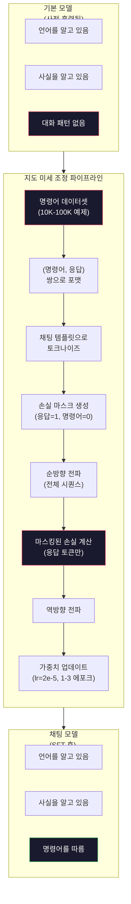

# 명령어 튜닝 (SFT)

> 기본 모델은 다음 토큰을 예측합니다. 그게 전부입니다. 지시를 따르지 않고, 질문에 답하지 않으며, 유해한 요청을 거절하지 않습니다. SFT는 토큰 예측기와 유용한 어시스턴트 사이의 다리입니다. 당신이 대화해본 모든 모델 — Claude, GPT, Llama Chat — 은 이 단계를 거쳤습니다.

**유형:** 빌드
**언어:** Python (with numpy)
**사전 필요 지식:** 10단계, 04과 (미니 GPT 사전 훈련)
**소요 시간:** ~90분

## 학습 목표

- 기본 언어 모델을 명령어-따르기 어시스턴트로 변환하는 지도 미세 조정(SFT) 구현
- 시스템, 사용자, 어시스턴트 역할이 있는 채팅 템플릿을 사용하여 훈련 데이터 포맷팅 및 어시스턴트가 아닌 토큰에 대한 손실 마스킹
- SFT가 필요한 이유 설명: 기본 모델은 질문에 답하지 않고 텍스트를 계속 이어씀
- 보류된 명령어 세트에서 기본 모델 vs 미세 조정된 모델 응답을 비교하여 SFT 품질 평가

## 문제

04과에서 모델을 훈련했습니다. 주어진 시퀀스에서 다음 토큰을 예측할 수 있습니다. "The transformer architecture"를 입력하면 "has revolutionized natural language processing."으로 이어갈 수 있습니다. 다음-토큰 예측기로서 인상적입니다.

이제 이것을 시도해보세요: "What is the capital of France?"를 입력합니다. 기본 모델은 "Paris."라고 답하지 않습니다. 패턴을 계속 이어갑니다. "What is the capital of Germany? What is the capital of Spain?"을 생성할 수 있는데, 질문 목록이 포함된 문서에서 학습했기 때문입니다. 또는 "is a question that many people ask"를 생성할 수 있는데, 그것이 그럴듯한 다음-토큰 이어짐이기 때문입니다. 모델은 *답변*의 개념이 없습니다. *이어가기*만 알고 있습니다.

이것이 GPT-3(기본 모델, 2020년 6월 출시)와 ChatGPT(명령어 튜닝됨, 2022년 11월 출시)의 차이입니다. 동일한 아키텍처. 동일한 사전 훈련. 차이는 20,000에서 100,000개의 신중하게 제작된 (명령어, 응답) 쌍으로, 모델이 대화 패턴을 따르도록 가르쳤습니다.

Stanford Alpaca는 수백만 개의 예제가 필요하지 않음을 증명했습니다. 2023년 3월, 그들은 GPT-3.5가 생성한 단 52,000개의 명령어-응답 쌍으로 Llama 7B를 미세 조정했습니다. 총 비용: $600. 결과는 명령어를 따르고, 질문에 답하고, 대화를 할 수 있는 챗봇이었습니다. ChatGPT만큼 좋지는 않았지만, $600과 몇 시간의 훈련으로 놀랍도록 가까웠습니다.

Meta의 Llama 2 Chat은 초기 SFT 단계에 약 27,000개의 고품질 예제만 사용했습니다. 핵심 통찰: 양보다 질이 중요합니다. 숙련된 주석자가 작성한 27,000개의 예제가 인터넷에서 긁어온 100만 개의 노이즈가 많은 예제를 이깁니다.

## 개념

### SFT가 실제로 하는 일

지도 미세 조정(Supervised Fine-Tuning)은 사전 훈련과 동일한 훈련 루프 — 순방향 전파, 손실 계산, 역방향 전파, 가중치 업데이트 — 를 계속하지만, 다른 종류의 데이터에서 수행합니다. 원시 텍스트 대신 구조화된 대화에서 훈련합니다:

```json
{
  "instruction": "프랑스의 수도는 어디인가요?",
  "response": "프랑스의 수도는 파리입니다."
}
```

모델은 이미 파리가 프랑스의 수도라는 것을 알고 있습니다. Wikipedia, 교과서, 웹 페이지에서 사전 훈련 중에 이것을 배웠습니다. SFT는 모델에게 새로운 사실을 가르치지 않습니다. 모델에게 새로운 *행동*을 가르칩니다: 질문을 보면 답을 생성하라. 명령어를 보면 완료를 생성하라. 유해한 요청을 보면 거절을 생성하라.

이렇게 생각하세요. 사전 훈련은 모델에게 지식을 줍니다. SFT는 모델에게 예절을 줍니다.

### 데이터 형식

세 가지 형식이 업계를 지배합니다. 각각은 누가 무엇을 말했는지에 대한 동일한 정보를 다른 구분자로 인코딩합니다.

**Alpaca 형식** (Stanford, 2023년 3월):

```json
{
  "instruction": "다음 기사를 3문장으로 요약하세요.",
  "input": "유럽 중앙은행이 금리를 인상했습니다...",
  "output": "ECB가 금리를 25bp 인상했습니다..."
}
```

간단하고 널리 사용됩니다. `input` 필드는 선택 사항입니다 — 많은 명령어가 추가 컨텍스트를 필요로 하지 않습니다. Stanford는 GPT-3.5가 $600에 생성한 52,000개의 예제를 이 형식으로 공개했습니다. 이것이 오픈소스 명령어 튜닝 운동을 촉발했습니다.

**ShareGPT 형식** (커뮤니티, 2023):

```json
{
  "conversations": [
    {"from": "system", "value": "당신은 도움이 되는 어시스턴트입니다."},
    {"from": "human", "value": "조수는 무엇 때문에 발생하나요?"},
    {"from": "gpt", "value": "조수는 달의 중력 인력 때문에 발생합니다..."},
    {"from": "human", "value": "얼마나 자주 발생하나요?"},
    {"from": "gpt", "value": "대부분의 해안 지역은 하루에 두 번의 만조와 두 번의 간조를 경험합니다..."}
  ]
}
```

다중 턴 대화를 지원합니다. "from" 필드는 실제 모델에 관계없이 관례상 "human"과 "gpt"를 사용합니다. Vicuna는 사용자가 공유한 ChatGPT 대화록에서 스크래핑한 70,000개의 ShareGPT 대화로 훈련되었습니다.

**ChatML 형식** (OpenAI, 많은 오픈소스 모델에서 사용):

```
<|im_start|>system
당신은 도움이 되는 어시스턴트입니다.<|im_end|>
<|im_start|>user
프랑스의 수도는 어디인가요?<|im_end|>
<|im_start|>assistant
프랑스의 수도는 파리입니다.<|im_end|>
```

특수 토큰(`<|im_start|>`, `<|im_end|>`)을 사용하여 역할을 구분합니다. 이 토큰들은 미세 조정 중에 토크나이저의 어휘에 추가됩니다. Qwen, Yi 및 많은 다른 모델들이 ChatML을 사용합니다.

세 가지 형식 모두 동일한 것을 달성합니다: 모델에게 "이것이 명령어이고, 이것이 응답이다. 이 패턴을 학습하라."고 알려줍니다.

### 작동하는 이유

모델은 사전 훈련에서 이미 언어를 알고 있습니다. 질문 뒤에 답이 오고, 명령어 뒤에 완료가 오고, 사람 간의 대화가 있는 수십억 개의 예제를 보았습니다. 패턴은 이미 가중치에 인코딩되어 있습니다.

SFT는 이 잠재 능력을 집중시킵니다. 모델이 문맥에서 질문에 답해야 하는지 문서를 계속 이어가야 하는지 알아내야 하는 대신, SFT는 명시적으로 대화 패턴에 대해 훈련합니다. 수천 개의 예제 후에 모델은 학습합니다: 어시스턴트 역할 마커를 보면 도움이 되는 응답을 생성하라.

이것이 27,000개의 예제로 충분한 이유입니다. 모델에게 영어를 가르치는 것이 아닙니다. 모델에게 세상에 대한 사실을 가르치는 것이 아닙니다. 하나의 간단한 행동을 가르치는 것입니다: 명령어에 응답하라. 지식은 이미 거기에 있었습니다.

### 마스킹된 손실

이것은 SFT에서 가장 중요한 기술적 세부 사항이며, 대부분의 튜토리얼이 건너뜁니다.

사전 훈련 중에는 모든 토큰에 대해 손실을 계산합니다. 모델은 시퀀스의 모든 다음 토큰을 예측하는 법을 배웁니다. SFT 중에는 *응답* 토큰에 대해서만 손실을 계산합니다. 명령어 토큰은 컨텍스트를 위해 있지만, 모델이 이를 "예측"하는 데 실패해도 불이익을 받지 않습니다.

왜? 명령어를 *생성*하는 법을 모델이 배우길 원하지 않기 때문입니다. 명령어에 *응답*하는 법을 배우길 원합니다. 명령어 토큰에 대해 손실을 계산하면, 마치 모델이 스스로 질문을 하는 것처럼 "프랑스의 수도는 어디인가요?"를 예측하도록 훈련하는 것입니다. 이는 기울기 신호를 낭비하고 역할에 대해 모델을 혼란스럽게 할 수 있습니다.

실제로는 손실 마스크를 만듭니다: 응답 토큰은 1, 명령어 토큰은 0입니다. 평균을 내기 전에 토큰별 손실에 이 마스크를 곱합니다.

```
Tokens:    [SYS] You are helpful [USER] What is the capital? [ASST] Paris is the capital [EOS]
Loss mask:   0    0    0     0      0     0   0  0     0       1     1    1   1     1      1
```

`[ASST]` 이후의 토큰만 손실에 기여합니다. 모델은 순방향 전파 중에 전체 대화를 봅니다(올바른 응답을 생성하기 위해 명령어가 필요함)만, 응답을 얼마나 잘 예측했는지에 따라서만 가중치를 업데이트합니다.

### 훈련 하이퍼파라미터

SFT는 사전 훈련과 극적으로 다른 하이퍼파라미터를 사용합니다. 처음부터 훈련하는 것이 아닙니다. 이미 작동하는 모델을 조정하는 것입니다.

| 파라미터 | 사전 훈련 (Llama 2 7B) | SFT (Llama 2 Chat) |
|---|---|---|
| 학습률 | 3e-4 (최고) | 2e-5 |
| 에포크 | 1 (데이터를 한 번 통과) | 2 |
| 배치 크기 | 4M 토큰 | 64 예제 |
| 웜업 단계 | 2,000 | 0-100 |
| 가중치 감쇠 | 0.1 | 0.0-0.1 |
| 데이터 크기 | 2T 토큰 | 27,000 예제 |

SFT의 학습률은 15배 더 낮습니다. 이것이 중요합니다. 미세 조정 중 높은 학습률은 사전 훈련된 지식을 파괴합니다. 모델이 배운 것을 "잊어버리고" 작은 미세 조정 데이터셋에 과적합됩니다. 이것이 파괴적 망각(catastrophic forgetting)입니다.

2 에포크는 모델이 각 훈련 예제를 두 번 본다는 의미입니다. 작은 데이터셋에서 3 에포크 이상은 암기로 이어집니다 — 모델이 일반화하는 대신 훈련 예제를 그대로 재생산하기 시작합니다.

### 파괴적 망각

미세 조정은 일반 능력을 파괴할 수 있습니다. 명령어-따르기 데이터로 너무 오래 훈련하면 모델이 코드를 작성하고, 수학을 하고, 창의적인 텍스트를 생성하는 능력을 잃습니다. 훈련 데이터의 특정 형식에는 매우 능숙해지지만 다른 모든 것에는 끔찍해집니다.

세 가지 완화 방법:

1. **낮은 학습률.** 1e-5에서 5e-5. 더 작은 업데이트는 사전 훈련된 특징의 파괴를 줄입니다.

2. **짧은 훈련.** 1-3 에포크. 모델이 과적합되기 전에 멈춥니다.

3. **사전 훈련 데이터 혼합.** Llama 2 Chat은 SFT 데이터셋에 원시 사전 훈련 데이터의 작은 비율(2-5%)을 혼합했습니다. 이는 새로운 명령어-따르기 행동을 배우면서 모델에게 일반 능력을 "상기시킵니다."

### 실제 숫자

단일 NVIDIA A100 80GB GPU에서 10,000개의 고품질 명령어 쌍으로 7B 모델을 미세 조정하는 데 약 1시간이 걸립니다. 계산은 다음과 같습니다:

- 10,000 예제 x 평균 512 토큰 = 5.12M 토큰
- 2 에포크 = 총 10.24M 토큰
- 7B 모델 미세 조정을 위한 A100 처리량: ~3,000 토큰/초
- 10.24M / 3,000 = ~3,400초 = ~57분

미니 GPT(4레이어, 128차원)의 경우 훈련은 거의 즉시 이루어집니다. 요점은 규모가 아니라 메커니즘을 이해하는 것입니다.



## 직접 구축하기

### 1단계: 명령어 데이터셋

합성 명령어 데이터셋을 만듭니다. 프로덕션에서는 Scale AI, Anthropic 같은 회사가 인간 주석자를 고용하여 이것을 작성합니다. 우리는 형식을 시연하기 위해 프로그래밍 방식으로 만들겠습니다.

```python
import numpy as np

INSTRUCTION_DATA = [
    {
        "instruction": "프랑스의 수도는 어디인가요?",
        "response": "프랑스의 수도는 파리입니다."
    },
    {
        "instruction": "중력을 한 문장으로 설명하세요.",
        "response": "중력은 질량이 있는 물체를 서로 끌어당기는 힘입니다."
    },
    {
        "instruction": "바다에 대해 하이쿠를 지어보세요.",
        "response": "파도가 해변에 부딪히고, 태양 아래 소금과 거품, 끝없는 푸른 넓이."
    },
    {
        "instruction": "15 곱하기 7은 얼마인가요?",
        "response": "15 곱하기 7은 105입니다."
    },
    {
        "instruction": "세 가지 프로그래밍 언어를 말하세요.",
        "response": "세 가지 프로그래밍 언어는 Python, Rust, TypeScript입니다."
    },
    {
        "instruction": "광합성을 요약하세요.",
        "response": "광합성은 햇빛, 물, 이산화탄소를 포도당과 산소로 전환합니다."
    },
    {
        "instruction": "제2차 세계대전은 몇 년도에 끝났나요?",
        "response": "제2차 세계대전은 1945년에 끝났습니다."
    },
    {
        "instruction": "머신러닝을 정의하세요.",
        "response": "머신러닝은 알고리즘이 데이터에서 패턴을 학습하여 예측을 수행하는 분야입니다."
    },
]
```

8개 예제는 매우 작습니다. Stanford Alpaca는 52,000개를 사용했습니다. 그러나 8개든 52,000개든 메커니즘은 동일합니다: 토크나이즈, 마스킹, 응답에 대해서만 손실 계산.

### 2단계: 채팅 템플릿으로 토크나이즈

명령어-응답 쌍을 특수 역할 마커가 있는 토큰 시퀀스로 변환합니다. 마커는 모델에게 명령어가 끝나는 위치와 응답이 시작되는 위치를 알려줍니다.

```python
SPECIAL_TOKENS = {
    "INST_START": 253,
    "INST_END": 254,
    "RESP_START": 255,
}


def tokenize_instruction_pair(instruction, response, vocab_size=256):
    inst_tokens = list(instruction.encode("utf-8"))
    resp_tokens = list(response.encode("utf-8"))

    inst_tokens = [min(t, vocab_size - 4) for t in inst_tokens]
    resp_tokens = [min(t, vocab_size - 4) for t in resp_tokens]

    tokens = (
        [SPECIAL_TOKENS["INST_START"]]
        + inst_tokens
        + [SPECIAL_TOKENS["INST_END"]]
        + [SPECIAL_TOKENS["RESP_START"]]
        + resp_tokens
    )

    return tokens


def create_loss_mask(tokens):
    mask = np.zeros(len(tokens), dtype=np.float32)
    in_response = False

    for i, token in enumerate(tokens):
        if token == SPECIAL_TOKENS["RESP_START"]:
            in_response = True
            continue
        if in_response:
            mask[i] = 1.0

    return mask
```

손실 마스크는 명령어 토큰에 대해 모두 0이고 응답 토큰에 대해 모두 1입니다. `RESP_START` 토큰 자체는 구분자이므로 마스크가 0입니다.

### 3단계: 마스킹된 교차-엔트로피 손실

표준 교차-엔트로피이지만 손실 마스크를 곱합니다. 응답 토큰만 기울기에 기여합니다.

```python
def masked_cross_entropy_loss(logits, targets, loss_mask):
    batch, seq_len, vocab_size = logits.shape
    logits_flat = logits.reshape(-1, vocab_size)
    targets_flat = targets.reshape(-1)
    mask_flat = loss_mask.reshape(-1)

    max_logits = logits_flat.max(axis=-1, keepdims=True)
    log_softmax = logits_flat - max_logits - np.log(
        np.exp(logits_flat - max_logits).sum(axis=-1, keepdims=True)
    )

    per_token_loss = -log_softmax[np.arange(len(targets_flat)), targets_flat]

    masked_loss = per_token_loss * mask_flat
    num_response_tokens = mask_flat.sum()
    if num_response_tokens == 0:
        return 0.0
    loss = masked_loss.sum() / num_response_tokens

    return loss
```

분모는 `num_response_tokens`이며 `seq_len`이 아닙니다. 전체 시퀀스 길이로 나누면 더 긴 명령어가 기울기 신호를 희석시킵니다. 응답 토큰 수로 나누면 명령어 길이에 관계없이 응답 토큰당 동일한 가중치가 보장됩니다.

### 4단계: SFT 훈련 루프

04과의 MiniGPT를 재사용합니다. 훈련 루프는 사전 훈련과 거의 동일해 보이지만, 명령어 형식과 마스킹된 손실이 있습니다.

```python
import sys
import os
sys.path.insert(0, os.path.join(os.path.dirname(__file__), "..", "..", "04-pre-training-mini-gpt", "code"))
from main import MiniGPT, LayerNorm, FeedForward, MultiHeadAttention, TransformerBlock, Embedding


def sft_train(model, dataset, num_epochs=2, lr=2e-5, seq_len=64):
    formatted_data = []
    for example in dataset:
        tokens = tokenize_instruction_pair(example["instruction"], example["response"])
        mask = create_loss_mask(tokens)
        formatted_data.append((tokens, mask))

    print(f"SFT 훈련: {len(formatted_data)} 예제, {num_epochs} 에포크, lr={lr}")
    print(f"총 토큰: {sum(len(t) for t, _ in formatted_data):,}")
    print()

    losses = []

    for epoch in range(num_epochs):
        epoch_loss = 0.0
        num_batches = 0

        indices = np.random.permutation(len(formatted_data))

        for idx in indices:
            tokens, mask = formatted_data[idx]

            if len(tokens) < 3:
                continue
            if len(tokens) > seq_len:
                tokens = tokens[:seq_len]
                mask = mask[:seq_len]

            input_ids = np.array(tokens[:-1]).reshape(1, -1)
            target_ids = np.array(tokens[1:]).reshape(1, -1)
            loss_mask = np.array(mask[1:]).reshape(1, -1)

            logits = model.forward(input_ids)
            loss = masked_cross_entropy_loss(logits, target_ids, loss_mask)

            batch_size, s_len, v_size = logits.shape
            probs = np.exp(logits - logits.max(axis=-1, keepdims=True))
            probs = probs / probs.sum(axis=-1, keepdims=True)
            dlogits = probs.copy()
            dlogits[np.arange(batch_size)[:, None], np.arange(s_len), target_ids] -= 1.0

            mask_expanded = loss_mask[:, :, np.newaxis]
            num_resp = loss_mask.sum()
            if num_resp > 0:
                dlogits = dlogits * mask_expanded / num_resp

            for block in model.blocks:
                block.ffn.W1 -= lr * np.random.randn(*block.ffn.W1.shape) * 0.01
                block.ffn.W2 -= lr * np.random.randn(*block.ffn.W2.shape) * 0.01
                block.ffn.b1 -= lr * np.random.randn(*block.ffn.b1.shape) * 0.01
                block.ffn.b2 -= lr * np.random.randn(*block.ffn.b2.shape) * 0.01

            epoch_loss += loss
            num_batches += 1
            losses.append(loss)

        avg_loss = epoch_loss / max(num_batches, 1)
        print(f"에포크 {epoch + 1}/{num_epochs} | 평균 손실: {avg_loss:.4f}")

    return model, losses
```

학습률은 Llama 2 Chat과 일치하는 2e-5입니다. 사전 훈련에서 사용된 3e-4와 비교하면 15배 더 작습니다. 기울기가 마스킹됩니다: 명령어 토큰은 기울기가 0입니다. 응답 토큰만 가중치를 밀어냅니다.

### 5단계: 기본 모델 vs SFT 모델 비교

SFT의 핵심은 행동 변화입니다. 명령어 형식의 입력 대 원시 텍스트 이어짐에 대한 모델의 응답 방식을 확인하여 측정해보겠습니다.

```python
def generate_response(model, prompt_tokens, max_new_tokens=50, temperature=0.8):
    tokens = list(prompt_tokens)
    seq_len = model.embedding.pos_embed.shape[0]

    for _ in range(max_new_tokens):
        context = np.array(tokens[-seq_len:]).reshape(1, -1)
        logits = model.forward(context)
        next_logits = logits[0, -1, :]

        next_logits = next_logits / max(temperature, 1e-8)
        probs = np.exp(next_logits - next_logits.max())
        probs = probs / probs.sum()
        probs = np.clip(probs, 1e-10, 1.0)
        probs = probs / probs.sum()

        next_token = np.random.choice(len(probs), p=probs)
        tokens.append(int(next_token))

    return tokens


def evaluate_instruction_following(model, instructions):
    print("명령어 따르기 평가:")
    print("-" * 50)

    for instruction in instructions:
        tokens = (
            [SPECIAL_TOKENS["INST_START"]]
            + [min(t, 252) for t in list(instruction.encode("utf-8"))]
            + [SPECIAL_TOKENS["INST_END"]]
            + [SPECIAL_TOKENS["RESP_START"]]
        )

        output = generate_response(model, tokens, max_new_tokens=30, temperature=0.6)
        response_start = len(tokens)
        response_tokens = output[response_start:]
        response_bytes = bytes([t for t in response_tokens if t < 128])
        response_text = response_bytes.decode("utf-8", errors="replace")

        print(f"  Q: {instruction}")
        print(f"  A: {response_text[:80]}")
        print()
```

8개 예제가 있는 작은 모델에서는 응답이 의미 있지 않을 것입니다. 예상된 것입니다. 중요한 것은 *구조*입니다: 모델이 더 많은 명령어를 계속 생성하는 대신 응답 마커 후에 출력을 생성하는 법을 배웁니다.

### 6단계: 파괴적 망각 측정

SFT 전후의 모델 다음-토큰 예측 능력을 비교합니다. SFT가 일반 능력을 손상시키면 원시 텍스트의 손실이 증가합니다.

```python
def measure_forgetting(model, test_text, seq_len=64):
    tokens = np.array(list(test_text.encode("utf-8")[:512]))

    total_loss = 0.0
    num_windows = 0

    for start in range(0, len(tokens) - seq_len - 1, seq_len):
        input_ids = tokens[start:start + seq_len].reshape(1, -1)
        target_ids = tokens[start + 1:start + seq_len + 1].reshape(1, -1)

        logits = model.forward(input_ids)

        batch, s_len, vocab_size = logits.shape
        logits_flat = logits.reshape(-1, vocab_size)
        targets_flat = target_ids.reshape(-1)

        max_logits = logits_flat.max(axis=-1, keepdims=True)
        log_softmax = logits_flat - max_logits - np.log(
            np.exp(logits_flat - max_logits).sum(axis=-1, keepdims=True)
        )

        loss = -log_softmax[np.arange(len(targets_flat)), targets_flat].mean()
        total_loss += loss
        num_windows += 1

    return total_loss / max(num_windows, 1)
```

실제 미세 조정에서는 훈련 내내 이 메트릭을 추적합니다. 원시 텍스트 손실이 10-15% 이상 증가하면 SFT가 너무 공격적인 것입니다. 학습률을 낮추거나 에포크 수를 줄이세요.

## 사용해보기

### 전체 SFT 파이프라인 데모

```python
if __name__ == "__main__":
    np.random.seed(42)

    test_text = """The transformer architecture processes sequences through self-attention.
Each layer applies multi-head attention followed by a feedforward network.
Residual connections and layer normalization stabilize deep networks.
The model learns to predict the next token given all previous tokens."""

    print("=" * 70)
    print("명령어 튜닝 (SFT) 데모")
    print("=" * 70)
    print()

    model = MiniGPT(
        vocab_size=256, embed_dim=128, num_heads=4,
        num_layers=4, max_seq_len=128, ff_dim=512
    )
    print(f"모델: {model.count_parameters():,} 파라미터")
    print(f"설정: 4 레이어, 4 헤드, 128 차원 (04과의 미니 GPT)")
    print()

    print("SFT 전: 원시 텍스트에서 기본 모델 손실 측정")
    base_loss = measure_forgetting(model, test_text)
    print(f"  기본 모델 손실: {base_loss:.4f}")
    print()

    print("=" * 70)
    print("SFT 훈련")
    print("=" * 70)

    model, losses = sft_train(
        model, INSTRUCTION_DATA, num_epochs=3, lr=2e-5, seq_len=128
    )

    print()
    print("SFT 후: 미세 조정된 모델의 원시 텍스트 손실 측정")
    sft_loss = measure_forgetting(model, test_text)
    print(f"  SFT 모델 손실: {sft_loss:.4f}")
    print(f"  변화: {((sft_loss - base_loss) / base_loss * 100):+.1f}%")
    if abs(sft_loss - base_loss) / base_loss < 0.15:
        print("  최소한의 망각 (< 15% 변화)")
    else:
        print("  심각한 망각 감지됨")
    print()

    print("=" * 70)
    print("명령어 따르기 평가")
    print("=" * 70)
    print()

    test_instructions = [
        "프랑스의 수도는 어디인가요?",
        "프로그래밍 언어 하나를 말하세요.",
        "중력을 정의하세요.",
    ]
    evaluate_instruction_following(model, test_instructions)

    print("=" * 70)
    print("데이터 형식 예제")
    print("=" * 70)
    print()

    for i, example in enumerate(INSTRUCTION_DATA[:3]):
        tokens = tokenize_instruction_pair(example["instruction"], example["response"])
        mask = create_loss_mask(tokens)
        resp_count = int(mask.sum())
        total_count = len(tokens)
        print(f"  예제 {i + 1}: {total_count} 토큰, {resp_count} 응답 토큰 ({resp_count/total_count:.0%} of sequence)")
        print(f"    명령어: {example['instruction']}")
        print(f"    응답: {example['response']}")
        print()

    print("=" * 70)
    print("훈련 손실 곡선")
    print("=" * 70)
    print()

    if losses:
        window = max(1, len(losses) // 5)
        for i in range(0, len(losses), window):
            chunk = losses[i:i + window]
            avg = sum(chunk) / len(chunk)
            print(f"  단계 {i:3d}-{i + len(chunk) - 1:3d}: 평균 손실 = {avg:.4f}")
```

## 배포하기

이 과는 `outputs/prompt-sft-data-curator.md`를 제공합니다 — SFT를 위한 명령어 데이터셋 설계 및 큐레이션을 돕는 프롬프트입니다. 대상 능력(코드 생성, 수학, 대화)이 주어지면 형식 사양, 품질 기준, 다양성 요구사항이 포함된 데이터 수집 계획을 생성합니다.

## 연습 문제

1. 시스템 프롬프트 지원을 추가하세요. `tokenize_instruction_pair`를 수정하여 시스템 메시지를 받고 명령어 앞에 추가하세요. 다른 시스템 프롬프트("당신은 시인입니다", "당신은 수학 튜터입니다")로 5개 예제를 만들고 모델이 훈련 중에 다른 시스템 프롬프트를 보는지 확인하세요.

2. 데이터 혼합을 구현하세요. SFT 데이터셋과 원시 텍스트 말뭉치를 받아 5% 예제는 원시 텍스트(마스킹 없음)이고 95%는 명령어 쌍(마스킹됨)인 훈련 배치를 생성하는 함수를 만드세요. 3 에포크를 실행하고 순수 SFT 훈련과 망각 메트릭을 비교하세요.

3. 데이터 품질 스코어러를 구축하세요. 각 명령어-응답 쌍에 대해 (a) 응답 길이(토큰), (b) 명령어-대-응답 비율, (c) 어휘 다양성(고유 토큰 / 총 토큰)을 계산하세요. 응답 길이가 10 토큰 미만이거나 다양성이 0.3 미만인 예제를 필터링하세요. 필터링이 최종 손실에 어떤 영향을 미치는지 보여주세요.

4. 다중 턴 대화 훈련을 구현하세요. 토크나이제이션을 3-턴 대화(사용자-어시스턴트-사용자-어시스턴트-사용자-어시스턴트)를 처리하도록 확장하세요. 손실 마스크가 세 어시스턴트 턴을 모두 포함해야 합니다. 하나의 예제에 대해 토큰-마스크 정렬을 출력하여 마스크가 올바른지 확인하세요.

5. 학습률을 비교하세요. lr=1e-4, lr=2e-5, lr=1e-6으로 동일한 모델을 세 번 훈련하세요. 손실 곡선을 플로팅하세요. 1e-4 실행은 빠른 초기 하강을 보여야 하지만 더 높은 최종 손실(과적합)을 보여야 합니다. 1e-6 실행은 거의 움직이지 않아야 합니다. 2e-5 실행이 최적 지점이어야 합니다.

## 주요 용어

| 용어 | 사람들이 말하는 것 | 실제 의미 |
|---|---|---|
| SFT | "대화에 대한 미세 조정" | 지도 미세 조정: 응답 토큰에 대해서만 손실을 계산하여 (명령어, 응답) 쌍에 대한 훈련 계속 |
| 명령어 튜닝 | "모델에게 명령어 따르기 가르치기" | 기본 모델이 새로운 지식이 아닌 대화 패턴을 학습하도록 명시적 명령어-응답 쌍에 대한 훈련 |
| 손실 마스킹 | "프롬프트 무시" | 명령어 토큰에 대해 손실을 0으로 설정하여 기울기가 응답 토큰 예측에서만 흐르도록 |
| ChatML | "채팅 마크업 언어" | 대화 데이터에서 화자 역할을 표시하기 위해 `<\|im_start\|>` 및 `<\|im_end\|>` 구분자를 사용하는 토큰 형식 |
| Alpaca 형식 | "Stanford의 형식" | instruction/input/output 필드가 있는 JSON 형식, $600에 생성된 52K GPT-3.5 예제에 사용됨 |
| 파괴적 망각 | "모델이 더 멍청해짐" | 기울기 업데이트가 일반 지식을 작업별 패턴으로 덮어쓰기 때문에 미세 조정이 사전 훈련된 능력을 파괴함 |
| Weight tying | "공유 임베딩" | 입력 토큰 임베딩과 출력 예측 헤드에 동일한 행렬을 사용하여 파라미터 절약 및 일관성 향상 |
| 채팅 템플릿 | "프롬프트 형식 지정 방법" | 모델을 위한 대화를 구조화하는 특정 토큰 시퀀스(역할 마커, 구분자) |

## 추가 자료

- [Ouyang et al., 2022 — "Training language models to follow instructions with human feedback" (InstructGPT)](https://arxiv.org/abs/2203.02155) — OpenAI에서 명령어 튜닝 + RLHF를 도입한 논문
- [Taori et al., 2023 — "Stanford Alpaca: An Instruction-following LLaMA Model"](https://github.com/tatsu-lab/stanford_alpaca) — $600에 52K 명령어 예제, SFT가 작은 데이터셋에서 작동함을 증명
- [Touvron et al., 2023 — "Llama 2: Open Foundation and Fine-Tuned Chat Models"](https://arxiv.org/abs/2307.09288) — 27K 고품질 예제로 Meta의 SFT + RLHF 파이프라인
- [Chiang et al., 2023 — "Vicuna: An Open-Source Chatbot Impressing GPT-4"](https://lmsys.org/blog/2023-03-30-vicuna/) — 70K ShareGPT 대화로 훈련
- [Zhou et al., 2023 — "LIMA: Less Is More for Alignment"](https://arxiv.org/abs/2305.11206) — 1,000개의 신중하게 선별된 예제가 훨씬 더 큰 데이터셋의 SFT와 일치할 수 있음을 증명
