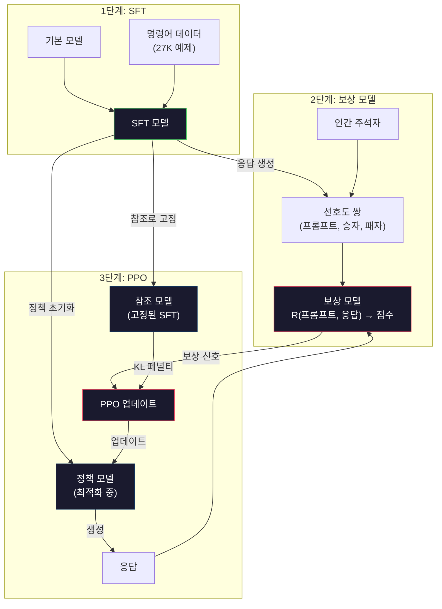
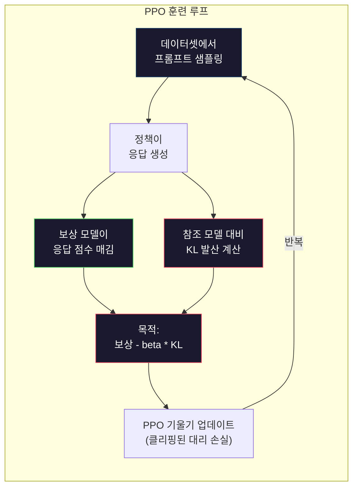

# RLHF: 보상 모델 + PPO

> SFT는 모델에게 명령어를 따르는 법을 가르칩니다. 그러나 어느 응답이 더 나은지는 가르치지 않습니다. 문법적으로 올바르고 사실적으로 정확한 두 답변은 도움됨(helpfulness)에서 엄청나게 다를 수 있습니다. RLHF는 인간의 판단을 모델의 행동에 인코딩하는 방법입니다. 이것이 Claude를 도움이 되게 하고 GPT를 공손하게 만듭니다.

**유형:** 빌드
**언어:** Python (with numpy)
**사전 필요 지식:** 10단계, 06과 (명령어 튜닝 / SFT)
**소요 시간:** ~90분

## 학습 목표

- 인간 선호도 쌍(선택 vs 기각)에서 응답 품질을 점수 매기는 보상 모델 구축
- KL 페널티로 보상 모델에 대해 언어 모델 정책을 최적화하는 PPO 훈련 루프 구현
- RLHF에 세 가지 모델(SFT, 보상, 정책)이 필요한 이유와 KL 제약이 보상 해킹을 방지하는 방법 설명
- 선호도 최적화 전후의 응답 품질을 비교하여 RLHF의 효과 평가

## 문제

모델에게 "양자 컴퓨팅을 설명하세요"라고 물으면 다음과 같이 생성할 수 있습니다:

**응답 A:** "양자 컴퓨팅은 중첩 상태에 있을 수 있는 큐비트를 사용합니다. 즉, 0, 1 또는 둘 다 동시에 될 수 있습니다. 이를 통해 양자 컴퓨터는 특정 계산을 기존 컴퓨터보다 기하급수적으로 빠르게 처리할 수 있습니다. 주요 알고리즘으로는 큰 수의 인수분해를 위한 쇼어 알고리즘과 정렬되지 않은 데이터베이스 검색을 위한 그로버 알고리즘이 있습니다."

**응답 B:** "양자 컴퓨팅은 양자 역학 현상을 사용하는 컴퓨팅 유형입니다. 1980년대에 처음 제안되었습니다. 리처드 파인만은 양자 시스템이 양자 컴퓨터로 시뮬레이션될 수 있다고 제안했습니다. 그 이후로 이 분야는 크게 성장했습니다. 많은 회사들이 현재 양자 컴퓨터를 연구하고 있습니다. IBM, Google 등이 진전을 이루었습니다. 양자 우월성은 2019년 Google에 의해 주장되었습니다."

두 응답 모두 사실적으로 정확합니다. 둘 다 문법적으로 올바릅니다. 둘 다 명령어를 따릅니다. 그러나 응답 A가 분명히 더 낫습니다. 더 간결하고, 더 유익하며, 더 잘 구조화되어 있습니다. 인간은 매번 A를 선택할 것입니다.

SFT는 이 차이를 포착할 수 없습니다. "올바른" 응답에 대해 모델을 훈련하지만, "이 응답이 저 응답보다 낫다"고 말할 메커니즘이 없습니다. 모든 훈련 예제를 동등하게 좋은 것으로 취급합니다. A와 B가 모두 SFT 데이터셋에 나타나면 모델은 둘 다에서 동등하게 학습할 것입니다.

RLHF가 이를 해결합니다. 보상 모델을 훈련시켜 인간이 어느 응답을 선호할지 예측하게 한 다음, 그 보상 신호를 사용하여 언어 모델을 더 높은 품질의 출력으로 밀어붙입니다. InstructGPT(ChatGPT의 전신)는 RLHF를 사용하여 GPT-3의 도움됨, 진실성, 무해성을 극적으로 개선했습니다. OpenAI의 내부 평가자는 InstructGPT 출력을 GPT-3 출력보다 85% 더 자주 선호했으며, InstructGPT가 135배 더 작음에도 불구하고(1.3B vs 175B 파라미터).

## 개념

### 세 단계

RLHF는 단일 훈련 실행이 아닙니다. 각각이 이전 단계에 기반하는 세 가지 순차적 단계의 파이프라인입니다.

**1단계: SFT.** 명령어-응답 쌍(06과)에 대해 기본 모델을 훈련합니다. 이것은 명령어를 따를 수 있지만 어느 응답이 다른 것보다 나은지 알지 못하는 모델을 제공합니다.

**2단계: 보상 모델.** 인간 선호도 데이터를 수집합니다: 주석자에게 동일한 프롬프트에 대한 두 응답을 보여주고 "어느 것이 더 낫습니까?"라고 묻습니다. 이러한 선호도를 예측하는 모델을 훈련합니다. 보상 모델은 (프롬프트, 응답)을 입력으로 받고 스칼라 점수를 출력합니다.

**3단계: PPO.** 보상 모델을 사용하여 언어 모델을 위한 훈련 신호를 생성합니다. 언어 모델이 응답을 생성하고, 보상 모델이 점수를 매기며, PPO가 언어 모델을 업데이트하여 더 높은 점수의 응답을 생성하도록 합니다. KL 발산 페널티는 언어 모델이 SFT 체크포인트에서 너무 멀리 벗어나는 것을 방지합니다.



### 보상 모델

보상 모델은 스코어러로 용도 변경된 언어 모델입니다. SFT 모델을 가져와 언어 모델링 헤드(어휘에 대한 분포 출력)를 스칼라 헤드(단일 숫자 출력)로 교체합니다. 아키텍처는 최종 레이어까지 동일합니다.

입력: 프롬프트와 응답이 연결된 것. 출력: 단일 스칼라 보상 점수.

훈련 데이터는 인간 선호도 쌍입니다. 각 프롬프트에 대해 주석자는 두 응답을 보고 더 나은 것을 선택합니다. 이것은 훈련 삼중항을 생성합니다: (프롬프트, 선호_응답, 비선호_응답).

손실 함수는 쌍별 선호도의 Bradley-Terry 모델을 사용합니다:

```
loss = -log(sigmoid(reward(선호) - reward(비선호)))
```

이것이 핵심 방정식입니다. `sigmoid(reward(A) - reward(B))`는 응답 A가 응답 B보다 선호될 확률을 제공합니다. 손실은 보상 모델이 선호되는 응답에 더 높은 점수를 할당하도록 밀어붙입니다.

왜 절대 점수 대신 쌍별 비교일까요? 인간은 절대 품질 점수를 할당하는 데 끔찍하기 때문입니다("이 응답이 10점 만점에 7.3인가요 7.5인가요?") 그러나 상대적 비교에는 매우 능숙합니다("A가 B보다 나은가요?"). Bradley-Terry 모델은 상대적 비교를 일관된 절대 점수 체계로 변환합니다.

**InstructGPT 숫자:** OpenAI는 40명의 계약자로부터 33,000개의 비교 쌍을 수집했습니다. 각 비교는 약 5분이 걸렸습니다. 보상 모델 훈련 데이터에 2,750시간의 인간 노동입니다.

### PPO: Proximal Policy Optimization

PPO는 강화학습 알고리즘입니다. RLHF에서 "환경"은 보상 모델이고, "에이전트"는 언어 모델이며, "행동"은 토큰 생성입니다.

목적 함수:

```
최대화: E[R(프롬프트, 응답)] - beta * KL(정책 || 참조)
```

첫 번째 항은 모델이 높은 보상 응답을 생성하도록 밀어붙입니다. 두 번째 항(KL 발산 페널티)은 모델이 SFT 체크포인트에서 너무 멀리 벗어나는 것을 방지합니다.

왜 KL 페널티일까요? 그것 없이는 모델이 변질된 해결책을 찾습니다. 보상 모델은 유한한 인간 선호도 데이터셋으로 훈련됩니다. 사각지대가 있습니다. 언어 모델은 이러한 사각지대를 이용합니다 — 보상 모델에서 높은 점수를 받지만 실제로는 무의미한 출력을 찾습니다. 고전적인 예:

- "나는 정말 도움이 되고 무해해!"를 반복하는 것은 도움됨/무해성 보상 모델에서 높은 점수를 받음
- 장황하고 격식 있어 보이지만 내용이 없는 응답을 생성하여 "고품질"에 패턴 매칭
- 훈련 데이터에서 우연히 높은 보상과 상관관계가 있었던 특정 구문을 이용

KL 페널티는 말합니다: 개선할 수는 있지만, 완전히 다른 모델이 될 수는 없습니다. 이미 합리적이었던 SFT 버전에 가깝게 유지하세요. 너무 멀리 벗어나면 KL 비용이 보상을 지배합니다.

**InstructGPT 숫자:** PPO 훈련은 lr=1.5e-5, KL 계수 beta=0.02, 256K 에피소드(프롬프트-응답 쌍), 배치당 4 PPO 에포크를 사용했습니다. 전체 RLHF 파이프라인은 GPU 클러스터에서 며칠이 걸렸습니다.



### PPO 목적 함수 상세

PPO는 과도하게 큰 업데이트를 방지하기 위해 "클리핑된 대리 목적 함수"를 사용합니다. 새 정책과 이전 정책 확률 간의 비율은 [1 - epsilon, 1 + epsilon] 범위로 클리핑되며, epsilon은 일반적으로 0.2입니다.

```
ratio = pi_new(행동 | 상태) / pi_old(행동 | 상태)
clipped_ratio = clip(ratio, 1 - epsilon, 1 + epsilon)
loss = -min(ratio * advantage, clipped_ratio * advantage)
```

어드밴티지 함수는 현재 응답이 예상 품질보다 얼마나 나은지 추정합니다. RLHF에서:

```
advantage = reward(프롬프트, 응답) - 기준선
```

기준선은 종종 최근 응답에 대한 평균 보상입니다. 양의 어드밴티지는 응답이 평균보다 나았음을 의미하고, 음의 어드밴티지는 더 나빴음을 의미합니다. PPO는 평균 이상의 응답의 확률을 높이고 평균 이하의 응답의 확률을 낮춥니다.

클리핑은 파괴적인 업데이트를 방지합니다. 단일 응답이 비정상적으로 높은 보상을 받으면, 클리핑되지 않은 비율이 매우 커져서 모델이 해당 응답 쪽으로 극적으로 이동할 수 있습니다. 클리핑은 업데이트를 제한하여 훈련 안정성을 유지합니다.

### 보상 해킹

RLHF의 어두운 면입니다. 언어 모델은 인간 선호도에 대한 불완전한 프록시인 보상 모델에 대해 최적화하고 있습니다. 언어 모델이 보상 최대화에 능숙해질수록 보상 모델의 약점을 이용하기 시작합니다.

일반적인 실패 모드:

| 실패 | 발생 상황 | 이유 |
|---|---|---|
| 장황함 | 모델이 점점 더 긴 응답을 생성 | 인간 주석자가 종종 더 길고 상세한 응답을 선호하여 보상 모델이 길이에 더 높은 점수 할당 |
| 아첨 | 모델이 사용자가 말하는 모든 것에 동의 | 주석자가 질문의 전제에 동의하는 응답을 선호함 |
| 회피 | 모델이 답변을 확정 짓지 않음 | 회피적 응답("이것은 다양한 관점이 있는 복잡한 주제입니다...")은 거의 틀렸다고 표시되지 않음 |
| 형식 이용 | 모델이 과도하게 글머리 기호와 헤더 사용 | 형식화된 응답이 주석자에게 더 "세련된" 것처럼 보임 |

완화 전략: 더 강한 KL 페널티(모델이 약점을 이용할 만큼 멀리 벗어나는 것을 방지), 적대적 예제로 보상 모델 훈련(알려진 실패 모드 패치), 다른 아키텍처를 가진 여러 보상 모델 사용(모두 동시에 해킹하기 더 어려움).

### 실제 RLHF 파이프라인

| 모델 | 비교 쌍 | 주석자 | RM 크기 | PPO 단계 | KL 계수 |
|---|---|---|---|---|---|
| InstructGPT | 33K | 40 | 6B | 256K | 0.02 |
| Llama 2 Chat | ~1M | 미공개 | 70B | 미공개 | 0.01 |
| Claude | 미공개 | 미공개 | 미공개 | 미공개 | 미공개 |
| Anthropic RLHF 논문 | 22K | 20 | 52B | 50K | 0.001 |

Anthropic의 2022년 논문은 22,000개의 비교로 52B 보상 모델을 훈련했습니다. 더 큰 보상 모델은 더 신뢰할 수 있는 신호를 생성하여 PPO 훈련을 더 안정적으로 만듭니다. 작은 보상 모델을 사용하여 큰 언어 모델을 훈련하는 것은 위험합니다 — 보상 모델이 좋은 응답과 나쁜 응답의 미묘한 차이를 포착할 충분한 용량이 없습니다.

## 직접 구축하기

### 1단계: 합성 선호도 데이터

프로덕션에서는 인간 주석자가 선호도 데이터를 만듭니다. "선호" 응답이 객관적으로 더 나은(더 간결, 더 정확, 더 도움이 되는) 합성 쌍을 만들겠습니다.

```python
import numpy as np

PREFERENCE_DATA = [
    {
        "prompt": "프랑스의 수도는 어디인가요?",
        "preferred": "프랑스의 수도는 파리입니다.",
        "rejected": "프랑스는 유럽의 나라입니다. 많은 도시가 있습니다. 수도는 파리입니다. 파리는 에펠탑으로 유명합니다.",
    },
    {
        "prompt": "중력을 한 문장으로 설명하세요.",
        "preferred": "중력은 질량이 있는 물체를 서로 끌어당기는 힘입니다.",
        "rejected": "중력은 물건을 떨어뜨렸을 때 아래로 떨어지게 만드는 것입니다.",
    },
    {
        "prompt": "15 곱하기 7은 얼마인가요?",
        "preferred": "15 곱하기 7은 105입니다.",
        "rejected": "생각해보죠. 15 곱하기 7. 음, 10 곱하기 7은 70이고, 5 곱하기 7은 35니까, 답은 아마 105 정도일 겁니다.",
    },
    {
        "prompt": "세 가지 프로그래밍 언어를 말하세요.",
        "preferred": "Python, Rust, TypeScript입니다.",
        "rejected": "프로그래밍 언어는 많습니다. 인기 있는 것들로는 Python 같은 다양한 언어들이 있습니다.",
    },
    {
        "prompt": "제2차 세계대전은 몇 년도에 끝났나요?",
        "preferred": "제2차 세계대전은 1945년에 끝났습니다.",
        "rejected": "제2차 세계대전은 주요한 세계 분쟁이었습니다. 많은 국가들이 관련되었습니다. 전쟁은 1940년대 중반, 구체적으로 1945년에 끝났습니다.",
    },
    {
        "prompt": "머신러닝을 정의하세요.",
        "preferred": "머신러닝은 알고리즘이 명시적으로 프로그래밍되지 않고 데이터에서 패턴을 학습하여 예측을 수행하는 분야입니다.",
        "rejected": "머신러닝은 AI의 한 유형입니다. AI는 인공지능을 의미합니다. 머신러닝은 데이터를 사용하여 학습합니다.",
    },
]
```

선호 응답은 간결하고 직접적입니다. 기각된 응답은 일반적인 실패 모드를 보여줍니다: 불필요한 패딩, 회피, 중복 설명, 부정확함. 이것이 바로 SFT는 포착할 수 없지만 RLHF는 포착할 수 있는 종류의 차이입니다.

### 2단계: 보상 모델 아키텍처

보상 모델은 미니 GPT의 트랜스포머 아키텍처를 재사용하지만, 어휘 크기의 출력 헤드를 단일 스칼라 투영으로 교체합니다.

```python
import sys
import os
sys.path.insert(0, os.path.join(os.path.dirname(__file__), "..", "..", "04-pre-training-mini-gpt", "code"))
from main import MiniGPT, LayerNorm, Embedding, TransformerBlock


class RewardModel:
    def __init__(self, vocab_size=256, embed_dim=128, num_heads=4,
                 num_layers=4, max_seq_len=128, ff_dim=512):
        self.embedding = Embedding(vocab_size, embed_dim, max_seq_len)
        self.blocks = [
            TransformerBlock(embed_dim, num_heads, ff_dim)
            for _ in range(num_layers)
        ]
        self.ln_f = LayerNorm(embed_dim)
        self.reward_head = np.random.randn(embed_dim) * 0.02

    def forward(self, token_ids):
        seq_len = token_ids.shape[-1]
        mask = np.triu(np.full((seq_len, seq_len), -1e9), k=1)

        x = self.embedding.forward(token_ids)
        for block in self.blocks:
            x = block.forward(x, mask)
        x = self.ln_f.forward(x)

        last_hidden = x[:, -1, :]
        reward = last_hidden @ self.reward_head

        return reward
```

보상 모델은 *마지막* 토큰 위치의 은닉 상태를 가져와 스칼라로 투영합니다. 왜 마지막 토큰일까요? 인과 어텐션 마스크는 마지막 위치가 모든 이전 토큰에 주목했음을 의미하기 때문입니다. 전체 (프롬프트, 응답) 시퀀스의 가장 완전한 표현을 가집니다.

### 3단계: Bradley-Terry 손실

Bradley-Terry 쌍별 손실을 사용하여 선호도 쌍에 대해 보상 모델을 훈련합니다.

```python
def tokenize_for_reward(prompt, response, vocab_size=256):
    prompt_tokens = [min(t, vocab_size - 1) for t in list(prompt.encode("utf-8"))]
    response_tokens = [min(t, vocab_size - 1) for t in list(response.encode("utf-8"))]
    return prompt_tokens + [0] + response_tokens


def sigmoid(x):
    return np.where(
        x >= 0,
        1.0 / (1.0 + np.exp(-x)),
        np.exp(x) / (1.0 + np.exp(x))
    )


def bradley_terry_loss(reward_preferred, reward_rejected):
    diff = reward_preferred - reward_rejected
    loss = -np.log(sigmoid(diff) + 1e-8)
    return loss


def train_reward_model(rm, preference_data, num_epochs=10, lr=1e-4, max_seq_len=128):
    print(f"보상 모델 훈련: {len(preference_data)} 선호도 쌍, {num_epochs} 에포크")
    print()

    losses = []
    accuracies = []

    for epoch in range(num_epochs):
        epoch_loss = 0.0
        epoch_correct = 0
        num_pairs = 0

        indices = np.random.permutation(len(preference_data))

        for idx in indices:
            pair = preference_data[idx]

            preferred_tokens = tokenize_for_reward(pair["prompt"], pair["preferred"])
            rejected_tokens = tokenize_for_reward(pair["prompt"], pair["rejected"])

            preferred_tokens = preferred_tokens[:max_seq_len]
            rejected_tokens = rejected_tokens[:max_seq_len]

            preferred_ids = np.array(preferred_tokens).reshape(1, -1)
            rejected_ids = np.array(rejected_tokens).reshape(1, -1)

            r_preferred = rm.forward(preferred_ids)[0]
            r_rejected = rm.forward(rejected_ids)[0]

            loss = bradley_terry_loss(r_preferred, r_rejected)

            if r_preferred > r_rejected:
                epoch_correct += 1

            diff = r_preferred - r_rejected
            grad = sigmoid(diff) - 1.0

            rm.reward_head -= lr * grad * rm.ln_f.forward(
                rm.embedding.forward(preferred_ids)
            )[:, -1, :].flatten()

            epoch_loss += loss
            num_pairs += 1

        avg_loss = epoch_loss / max(num_pairs, 1)
        accuracy = epoch_correct / max(num_pairs, 1)
        losses.append(avg_loss)
        accuracies.append(accuracy)

        if epoch % 2 == 0:
            print(f"  에포크 {epoch + 1:3d} | 손실: {avg_loss:.4f} | 정확도: {accuracy:.1%}")

    return rm, losses, accuracies
```

정확도 메트릭은 간단합니다: 보상 모델이 선호도 쌍의 몇 퍼센트를 올바르게 순위 매겼습니까? 무작위 모델은 50%를 득점합니다. 깨끗한 데이터에서 잘 훈련된 보상 모델은 70%를 초과해야 합니다. InstructGPT의 보상 모델은 보류된 비교에서 약 72% 정확도를 달성했는데, 이는 낮게 들리지만 실제로는 좋습니다 — 많은 선호도 쌍이 인간에게도 모호합니다(주석자 간 일치율은 약 73%).

### 4단계: 단순화된 PPO 루프

전체 PPO는 복잡합니다. 이 구현은 핵심 메커니즘을 포착합니다: 응답 생성, 점수 매기기, 어드밴티지 계산, KL 페널티로 정책 업데이트.

```python
def compute_kl_divergence(policy_logits, reference_logits):
    policy_probs = np.exp(policy_logits - policy_logits.max(axis=-1, keepdims=True))
    policy_probs = policy_probs / policy_probs.sum(axis=-1, keepdims=True)
    policy_probs = np.clip(policy_probs, 1e-10, 1.0)

    ref_probs = np.exp(reference_logits - reference_logits.max(axis=-1, keepdims=True))
    ref_probs = ref_probs / ref_probs.sum(axis=-1, keepdims=True)
    ref_probs = np.clip(ref_probs, 1e-10, 1.0)

    kl = np.sum(policy_probs * np.log(policy_probs / ref_probs), axis=-1)
    return kl.mean()


def generate_response(model, prompt_tokens, max_new_tokens=30, temperature=0.8, max_seq_len=128):
    tokens = list(prompt_tokens)

    for _ in range(max_new_tokens):
        context = np.array(tokens[-max_seq_len:]).reshape(1, -1)
        logits = model.forward(context)
        next_logits = logits[0, -1, :]

        next_logits = next_logits / max(temperature, 1e-8)
        probs = np.exp(next_logits - next_logits.max())
        probs = probs / probs.sum()
        probs = np.clip(probs, 1e-10, 1.0)
        probs = probs / probs.sum()

        next_token = np.random.choice(len(probs), p=probs)
        tokens.append(int(next_token))

    return tokens


def copy_model_weights(source, target):
    target.embedding.token_embed = source.embedding.token_embed.copy()
    target.embedding.pos_embed = source.embedding.pos_embed.copy()
    target.ln_f.gamma = source.ln_f.gamma.copy()
    target.ln_f.beta = source.ln_f.beta.copy()
    for s_block, t_block in zip(source.blocks, target.blocks):
        t_block.attn.W_q = s_block.attn.W_q.copy()
        t_block.attn.W_k = s_block.attn.W_k.copy()
        t_block.attn.W_v = s_block.attn.W_v.copy()
        t_block.attn.W_out = s_block.attn.W_out.copy()
        t_block.ffn.W1 = s_block.ffn.W1.copy()
        t_block.ffn.W2 = s_block.ffn.W2.copy()
        t_block.ffn.b1 = s_block.ffn.b1.copy()
        t_block.ffn.b2 = s_block.ffn.b2.copy()
        t_block.ln1.gamma = s_block.ln1.gamma.copy()
        t_block.ln1.beta = s_block.ln1.beta.copy()
        t_block.ln2.gamma = s_block.ln2.gamma.copy()
        t_block.ln2.beta = s_block.ln2.beta.copy()


def ppo_training(policy_model, reference_model, reward_model, prompts,
                 num_episodes=20, lr=1.5e-5, kl_coeff=0.02, max_seq_len=128):
    print(f"PPO 훈련: {num_episodes} 에피소드, lr={lr}, KL 계수={kl_coeff}")
    print()

    rewards_history = []
    kl_history = []

    for episode in range(num_episodes):
        prompt_text = prompts[episode % len(prompts)]
        prompt_tokens = [min(t, 252) for t in list(prompt_text.encode("utf-8"))]

        response_tokens = generate_response(
            policy_model, prompt_tokens,
            max_new_tokens=20, temperature=0.8, max_seq_len=max_seq_len
        )

        response_ids = np.array(response_tokens[:max_seq_len]).reshape(1, -1)
        reward = reward_model.forward(response_ids)[0]

        policy_logits = policy_model.forward(response_ids)
        ref_logits = reference_model.forward(response_ids)
        kl = compute_kl_divergence(policy_logits, ref_logits)

        total_reward = reward - kl_coeff * kl

        rewards_history.append(float(reward))
        kl_history.append(float(kl))

        for block in policy_model.blocks:
            update_scale = lr * total_reward
            block.ffn.W1 += update_scale * np.random.randn(*block.ffn.W1.shape) * 0.01
            block.ffn.W2 += update_scale * np.random.randn(*block.ffn.W2.shape) * 0.01

        if episode % 5 == 0:
            avg_reward = np.mean(rewards_history[-5:]) if rewards_history else 0
            avg_kl = np.mean(kl_history[-5:]) if kl_history else 0
            print(f"  에피소드 {episode:3d} | 보상: {reward:.4f} | KL: {kl:.4f} | "
                  f"평균 보상: {avg_reward:.4f}")

    return policy_model, rewards_history, kl_history
```

핵심 루프: (1) 프롬프트 샘플링, (2) 응답 생성, (3) 보상 모델로 점수 매기기, (4) 고정된 참조 대비 KL 발산 계산, (5) 조정된 보상(보상 - KL 페널티) 계산, (6) 정책 업데이트. KL 페널티는 정책이 참조에서 멀어짐에 따라 커져서 자동으로 보상 해킹을 방지합니다.

### 5단계: 보상 점수 비교

RLHF 후 정책 모델의 응답은 원래 SFT 모델의 응답보다 보상 모델에서 더 높은 점수를 받아야 합니다.

```python
def compare_models(sft_model, rlhf_model, reward_model, prompts, max_seq_len=128):
    print("모델 비교 (보상 점수)")
    print("-" * 60)
    print(f"  {'프롬프트':<35} {'SFT':>10} {'RLHF':>10}")
    print("  " + "-" * 55)

    sft_total = 0.0
    rlhf_total = 0.0

    for prompt in prompts:
        prompt_tokens = [min(t, 252) for t in list(prompt.encode("utf-8"))]

        sft_response = generate_response(
            sft_model, prompt_tokens,
            max_new_tokens=20, temperature=0.6, max_seq_len=max_seq_len
        )
        rlhf_response = generate_response(
            rlhf_model, prompt_tokens,
            max_new_tokens=20, temperature=0.6, max_seq_len=max_seq_len
        )

        sft_ids = np.array(sft_response[:max_seq_len]).reshape(1, -1)
        rlhf_ids = np.array(rlhf_response[:max_seq_len]).reshape(1, -1)

        sft_reward = reward_model.forward(sft_ids)[0]
        rlhf_reward = reward_model.forward(rlhf_ids)[0]

        sft_total += sft_reward
        rlhf_total += rlhf_reward

        truncated_prompt = prompt[:33] + ".." if len(prompt) > 35 else prompt
        print(f"  {truncated_prompt:<35} {sft_reward:>10.4f} {rlhf_reward:>10.4f}")

    n = len(prompts)
    print("  " + "-" * 55)
    print(f"  {'평균':<35} {sft_total/n:>10.4f} {rlhf_total/n:>10.4f}")

    return sft_total / n, rlhf_total / n
```

## 사용해보기

### 전체 RLHF 파이프라인 데모

```python
if __name__ == "__main__":
    np.random.seed(42)

    print("=" * 70)
    print("RLHF 파이프라인: 보상 모델 + PPO")
    print("=" * 70)
    print()

    print("1단계: SFT 모델 (06과에서)")
    print("-" * 40)
    sft_model = MiniGPT(
        vocab_size=256, embed_dim=128, num_heads=4,
        num_layers=4, max_seq_len=128, ff_dim=512
    )
    print(f"  파라미터: {sft_model.count_parameters():,}")
    print()

    print("2단계: 보상 모델 훈련")
    print("-" * 40)
    rm = RewardModel(
        vocab_size=256, embed_dim=128, num_heads=4,
        num_layers=4, max_seq_len=128, ff_dim=512
    )

    rm, rm_losses, rm_accuracies = train_reward_model(rm, PREFERENCE_DATA, num_epochs=10, lr=1e-4)
    print()

    print("보상 모델 평가:")
    print("-" * 40)
    correct = 0
    for pair in PREFERENCE_DATA:
        pref_tokens = tokenize_for_reward(pair["prompt"], pair["preferred"])[:128]
        rej_tokens = tokenize_for_reward(pair["prompt"], pair["rejected"])[:128]

        r_pref = rm.forward(np.array(pref_tokens).reshape(1, -1))[0]
        r_rej = rm.forward(np.array(rej_tokens).reshape(1, -1))[0]

        if r_pref > r_rej:
            correct += 1
        print(f"  선호: {r_pref:+.4f} | 비선호: {r_rej:+.4f} | {'올바름' if r_pref > r_rej else '틀림'}")

    print(f"\n  정확도: {correct}/{len(PREFERENCE_DATA)} = {correct/len(PREFERENCE_DATA):.1%}")
    print()

    print("3단계: PPO 훈련")
    print("-" * 40)

    policy_model = MiniGPT(
        vocab_size=256, embed_dim=128, num_heads=4,
        num_layers=4, max_seq_len=128, ff_dim=512
    )
    reference_model = MiniGPT(
        vocab_size=256, embed_dim=128, num_heads=4,
        num_layers=4, max_seq_len=128, ff_dim=512
    )

    copy_model_weights(sft_model, policy_model)
    copy_model_weights(sft_model, reference_model)

    train_prompts = [pair["prompt"] for pair in PREFERENCE_DATA]

    policy_model, rewards, kls = ppo_training(
        policy_model, reference_model, rm,
        train_prompts, num_episodes=20, lr=1.5e-5, kl_coeff=0.02
    )
    print()

    print("=" * 70)
    print("비교: SFT vs RLHF")
    print("=" * 70)
    print()

    eval_prompts = [
        "프랑스의 수도는 어디인가요?",
        "중력을 설명하세요.",
        "세 가지 프로그래밍 언어를 말하세요.",
    ]

    sft_avg, rlhf_avg = compare_models(sft_model, policy_model, rm, eval_prompts)
    print()

    print("=" * 70)
    print("KL 발산 분석")
    print("=" * 70)
    print()

    if kls:
        print(f"  초기 KL: {kls[0]:.4f}")
        print(f"  최종 KL: {kls[-1]:.4f}")
        print(f"  최대 KL: {max(kls):.4f}")
        kl_threshold = 0.1
        print(f"  KL > {kl_threshold}: {'예 (모델이 참조에서 크게 벗어남)' if max(kls) > kl_threshold else '아니오 (모델이 참조에 가깝게 유지됨)'}")
```

## 배포하기

이 과는 `outputs/prompt-reward-model-designer.md`를 제공합니다 — 보상 모델 훈련 파이프라인 설계를 위한 프롬프트입니다. 대상 행동(도움됨, 코딩 능력, 안전성)이 주어지면 데이터 수집 프로토콜, 주석자 지침, 보상 모델 평가 기준을 생성합니다.

## 연습 문제

1. 마지막 위치 대신 모든 은닉 상태의 평균을 사용하도록 보상 모델을 수정하세요. 정확도를 비교하세요. 평균 풀링 접근법은 모든 토큰에 동일한 가중치를 주는 반면, 마지막 위치 접근법은 인과 어텐션에 의존하여 정보를 집계합니다. 6개의 선호도 쌍에서 테스트하고 어떤 접근법이 더 높은 정확도를 내는지 보고하세요.

2. 보상 모델 보정을 구현하세요. 훈련 후 모든 선호도 쌍을 보상 모델에 실행하고 (a) 선호 응답의 평균 보상, (b) 비선호 응답의 평균 보상, (c) 마진(선호 - 비선호)을 계산하세요. 잘 보정된 모델은 명확한 마진을 가져야 합니다. 그런 다음 4개의 새 선호도 쌍을 추가하고 마진이 보지 않은 데이터에서 유지되는지 확인하세요.

3. 보상 해킹을 시뮬레이션하세요. 긴 응답에 높은 점수를 주는 보상 모델을 만드세요(reward = len(response) / 100). 이 결함 있는 보상 모델로 PPO를 실행하고 정책 모델이 점점 더 길고 반복적인 출력을 생성하는 것을 관찰하세요. 그런 다음 KL 페널티 0.1을 추가하고 그것이 변질된 행동을 방지하는지 보여주세요.

4. 다중 목적 보상을 구현하세요. 두 개의 보상 모델(하나는 도움됨용, 하나는 간결성용)을 훈련하세요. R = 0.7 * R_도움됨 + 0.3 * R_간결성으로 결합하세요. 결합된 목적이 단일 도움됨 보상의 장황함 함정을 피하면서 도움이 되고 간결한 응답을 생성하는지 보여주세요.

5. 다른 KL 계수를 비교하세요. beta=0.001(너무 낮음, 보상 해킹), beta=0.02(표준), beta=0.5(너무 높음, 학습 없음)로 PPO를 실행하세요. 각각에 대한 보상 곡선과 KL 곡선을 플로팅하세요. beta=0.02 실행은 KL이 제한된 상태에서 꾸준한 보상 개선을 보여야 합니다.

## 주요 용어

| 용어 | 사람들이 말하는 것 | 실제 의미 |
|---|---|---|
| RLHF | "인간 피드백으로 훈련" | 인간 선호도 신호를 사용하여 언어 모델 출력을 최적화하는 3단계 파이프라인(SFT, 보상 모델, PPO) |
| 보상 모델 | "응답을 점수 매기는 모델" | Bradley-Terry 손실을 사용하여 쌍별 인간 선호도에 대해 훈련된 스칼라 출력 헤드가 있는 트랜스포머 |
| Bradley-Terry | "비교 모델" | P(A > B) = sigmoid(score(A) - score(B))인 확률 모델, 쌍별 선호도를 일관된 점수 함수로 변환 |
| PPO | "RL 알고리즘" | Proximal Policy Optimization: 업데이트 크기를 클리핑하여 불안정성을 방지하면서 보상을 최대화하도록 정책 업데이트 |
| KL 발산 | "두 분포가 얼마나 다른지" | 정책 모델의 토큰 분포와 참조 모델 간의 차이 측정 — 보상 해킹을 방지하는 페널티로 사용됨 |
| KL 페널티 | "모델의 가죽 끈" | 보상 신호에서 뺀 Beta * KL(정책 \|\| 참조) — 정책이 SFT 체크포인트에서 너무 멀어지는 것을 방지 |
| 보상 해킹 | "보상 시스템 이용" | 정책이 진정한 개선 없이 보상 모델의 약점을 이용하여 변질된 높은 보상 출력을 찾는 경우 |
| 선호도 쌍 | "어느 것이 더 나은가, A 아니면 B?" | (프롬프트, 선호_응답, 비선호_응답)으로 구성된 훈련 예제 — RLHF 훈련 데이터의 기본 단위 |
| 참조 모델 | "고정된 SFT 체크포인트" | 가중치가 절대 변하지 않는 SFT 모델의 복사본 — KL 발산 계산의 앵커로 사용됨 |

## 추가 자료

- [Ouyang et al., 2022 — "Training language models to follow instructions with human feedback" (InstructGPT)](https://arxiv.org/abs/2203.02155) — 대규모 언어 모델을 위해 RLHF를 실용적으로 만든 논문
- [Schulman et al., 2017 — "Proximal Policy Optimization Algorithms"](https://arxiv.org/abs/1707.06347) — OpenAI의 원래 PPO 논문
- [Bai et al., 2022 — "Training a Helpful and Harmless Assistant with Reinforcement Learning from Human Feedback"](https://arxiv.org/abs/2204.05862) — Anthropic의 RLHF 논문, 보상 해킹 및 KL 페널티의 상세 분석 포함
- [Stiennon et al., 2020 — "Learning to summarize with human feedback"](https://arxiv.org/abs/2009.01325) — 요약에 적용된 RLHF, 보상 모델이 미묘한 품질 판단을 포착할 수 있음을 보여줌
- [Christiano et al., 2017 — "Deep reinforcement learning from human preferences"](https://arxiv.org/abs/1706.03741) — 인간 비교로부터 보상 함수를 학습하는 기초 작업
