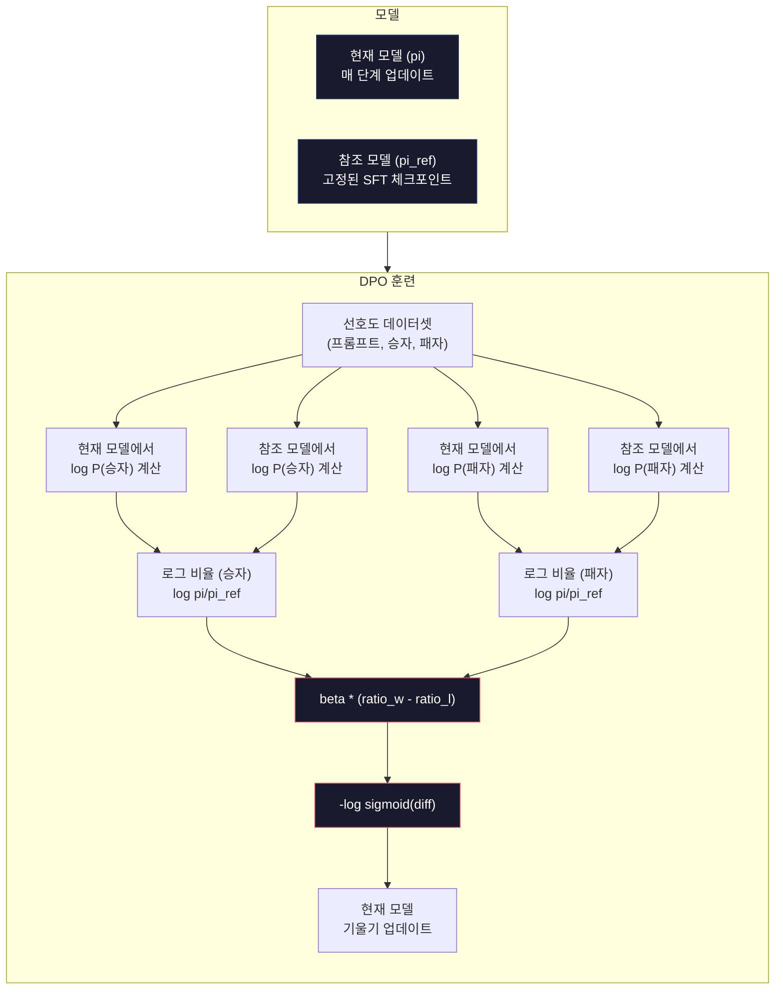

# DPO: 직접 선호도 최적화

> RLHF는 작동합니다. 그러나 세 가지 모델(SFT, 보상 모델, 정책)을 훈련하고, PPO의 불안정성을 관리하며, KL 페널티를 튜닝해야 합니다. DPO가 묻습니다: 이 모든 것을 건너뛸 수 있다면? DPO는 선호도 쌍에서 언어 모델을 직접 최적화합니다. 보상 모델이 없습니다. PPO가 없습니다. 하나의 훈련 루프. 동일한 결과.

**유형:** 빌드
**언어:** Python (with numpy)
**사전 필요 지식:** 10단계, 07과 (RLHF)
**소요 시간:** ~90분

## 학습 목표

- 별도의 보상 모델 없이 선호도 쌍에서 언어 모델을 직접 최적화하는 DPO 훈련 구현
- DPO 손실 함수 유도 및 정책의 로그 확률을 통해 어떻게 암시적으로 보상 모델을 나타내는지 설명
- 훈련 안정성, 계산 비용, 필요한 모델 수 측면에서 DPO와 RLHF 비교
- 베타 파라미터를 튜닝하여 훈련된 정책이 참조 모델에서 얼마나 멀어질 수 있는지 제어

## 문제

07과에서 RLHF 파이프라인을 구축했습니다. 세 단계. 세 가지 모델. SFT 모델, 보상 모델, PPO로 최적화된 정책 모델. 보상 모델만으로도 수천 개의 인간 선호도 쌍과 별도의 훈련 루프가 필요했습니다. PPO는 KL 계수, 학습률, 클립 비율, 에포크 수의 신중한 튜닝이 필요했습니다.

실제로 PPO 훈련은 악명 높게 불안정합니다. 작은 하이퍼파라미터 변경이 훈련을 발산시킵니다. 보상 모델은 인간 선호도에 대한 불완전한 프록시이며, 정책은 그 약점을 이용할 방법을 찾습니다. KL 페널티가 도움이 되지만 자체 튜닝이 필요합니다 — 너무 낮으면 보상 해킹, 너무 높으면 모델이 거의 학습하지 않습니다.

이 복잡성 때문에 InstructGPT가 발표된 후 수년간 대부분의 오픈소스 모델이 RLHF로 어려움을 겪었습니다. 세 단계 파이프라인은 취약합니다. 각 단계에는 자체 실패 모드가 있으며, 오류가 누적됩니다.

2023년 5월, Stanford의 Rafael Rafailov, Archit Sharma 등은 "직접 선호도 최적화: 당신의 언어 모델은 비밀리에 보상 모델입니다"를 발표했습니다. 핵심 통찰: 별도의 보상 모델이 필요하지 않습니다. 최적의 보상 함수는 언어 모델 자체의 토큰 확률에 의해 수학적으로 결정됩니다. 보상 모델을 완전히 건너뛰고 선호도 쌍에서 언어 모델을 직접 최적화할 수 있습니다.

DPO는 RLHF를 단일 지도 학습 단계로 줄입니다. 하나의 모델. 하나의 손실 함수. 하나의 훈련 루프. 강화학습이 없습니다. DPO를 대규모로 사용한 최초의 모델 중 하나인 Zephyr-7B는 여러 벤치마크에서 전체 RLHF로 훈련된 모델과 일치하거나 능가했습니다. Meta는 Llama 3의 정렬 파이프라인의 일부로 DPO를 사용했습니다. Anthropic은 정렬 연구에서 DPO 스타일 방법을 인용했습니다.

## 개념

### 핵심 통찰

RLHF는 다음 목적 함수를 최적화합니다:

```
최대화: E[R(x, y)] - beta * KL(pi || pi_ref)
```

여기서 R은 보상 모델, pi는 정책, pi_ref는 참조 모델, beta는 KL 계수입니다.

DPO 논문은 이 목적 함수에 폐쇄형 최적 해가 있음을 보여주었습니다. 임의의 보상 함수 R에 대해 최적 정책은:

```
pi*(y | x) = pi_ref(y | x) * exp(R(x, y) / beta) / Z(x)
```

여기서 Z(x)는 정규화 상수입니다. 재정렬하면:

```
R(x, y) = beta * log(pi*(y | x) / pi_ref(y | x)) + beta * log Z(x)
```

이것이 돌파구입니다. 보상은 전적으로 정책 모델의 확률과 참조 모델의 확률로 표현됩니다. 별도의 보상 모델을 훈련할 필요가 없습니다. 보상은 확률 비율에 *암시적*입니다.

이것을 Bradley-Terry 선호도 모델에 대입하면:

```
P(y_w > y_l | x) = sigmoid(R(x, y_w) - R(x, y_l))
                  = sigmoid(beta * (log pi(y_w|x)/pi_ref(y_w|x) - log pi(y_l|x)/pi_ref(y_l|x)))
```

Z(x) 항은 두 응답이 동일한 프롬프트 x에 조건화되므로 상쇄됩니다. 남은 것은 선호 및 비선호 응답에 대한 정책 모델의 로그-확률과 참조 모델의 로그-확률만의 함수입니다.

### DPO 손실

```
L_DPO = -log(sigmoid(beta * (log pi(y_w|x)/pi_ref(y_w|x) - log pi(y_l|x)/pi_ref(y_l|x))))
```

각 부분을 풀어보면:

- **y_w** = 선호 (승리) 응답
- **y_l** = 비선호 (패배) 응답
- **x** = 프롬프트
- **pi** = 현재 모델 (훈련 중)
- **pi_ref** = 참조 모델 (고정된 SFT 체크포인트)
- **beta** = 참조에서 이탈을 제어하는 온도 파라미터 (일반적으로 0.1~0.5)

비율 `log pi(y|x) / pi_ref(y|x)`는 로그-확률 비율입니다. 이 비율이 양수이면 현재 모델이 참조보다 응답 y에 더 높은 확률을 할당합니다. 음수이면 현재 모델이 더 낮은 확률을 할당합니다.

DPO 손실은 모델이 선호 응답에 대한 로그-확률 비율을 높이고 비선호 응답에 대한 것을 낮추도록 밀어붙입니다. beta 파라미터는 모델이 참조에서 얼마나 공격적으로 벗어날 수 있는지 제어합니다 — 작은 beta는 큰 편차를 허용하고, 큰 beta는 모델을 참조에 가깝게 유지합니다.



### DPO가 더 간단한 이유

| 측면 | RLHF (PPO) | DPO |
|---|---|---|
| 훈련할 모델 | 3 (SFT + 보상 + 정책) | 1 (정책만) |
| 훈련 루프 | 3 (SFT, RM 훈련, PPO) | 2 (SFT, DPO) |
| 하이퍼파라미터 | lr, KL 계수, 클립 비율, RM lr, 에포크 x3 | lr, beta, 에포크 |
| 보상 모델 | 필요 (별도 훈련) | 모델 확률에 암시적 |
| RL 알고리즘 | PPO (복잡, 불안정) | 지도 학습 (안정적) |
| GPU 메모리 | PPO 중 3-4개 모델 | 2개 모델 (현재 + 참조) |
| 훈련 안정성 | 하이퍼파라미터에 민감 | 강건함, SFT와 유사 |

DPO는 훈련 중 두 개의 모델(현재 모델과 고정된 참조)이 메모리에 필요합니다. RLHF는 세 개 또는 네 개가 필요합니다: 정책, 참조, 보상 모델, 그리고 선택적으로 가치 함수 기준선. 70B 모델의 경우 각 복사본이 FP16에서 140GB를 차지합니다. 보상 모델을 제거함으로써 얻는 메모리 절약은 상당합니다.

### DPO가 RLHF를 이기는 경우

**작은 데이터셋.** 5,000-20,000개의 선호도 쌍으로 DPO는 종종 RLHF와 일치하거나 능가합니다. RLHF의 보상 모델은 일반화하기에 충분한 데이터가 필요합니다 — 데이터가 제한적이면 과적합되어 신뢰할 수 없는 보상 신호를 생성합니다. DPO는 보상 모델이 전혀 필요하지 않아 이 문제를 우회합니다.

**제한된 계산.** DPO는 전체 RLHF의 약 1/3 계산이 필요합니다(3개 대신 1개 훈련 루프). 대규모 GPU 클러스터가 없는 팀에게 실용적인 선택입니다.

**빠른 반복.** 10개의 다른 선호도 데이터셋을 시도하여 어떤 것이 가장 좋은 모델을 생성하는지 알고 싶습니까? DPO는 각 실험을 몇 시간 안에 실행할 수 있습니다. RLHF는 각 데이터셋에 대해 보상 모델을 재훈련해야 합니다.

### RLHF가 DPO를 이기는 경우

**대규모 훈련.** GPT-4 또는 Claude 규모에서 RLHF의 별도 보상 모델은 더 미묘한 선호도 신호를 포착할 수 있습니다. 보상 모델은 복잡한 품질 기준에 적응하는 학습된 손실 함수 역할을 합니다.

**복잡한 보상 신호.** "더 나은" 것이 여러 차원(도움됨, 무해성, 정직성)을 포함할 때, 보상 모델은 이 다중 목적 트레이드오프를 학습할 수 있습니다. DPO는 각 선호도 쌍을 이진 신호(하나가 더 낫고 하나가 더 나쁨)로 취급하며, 이유를 모델링하지 않습니다.

**반복적 정렬.** RLHF 파이프라인은 현재 정책으로 새 응답을 생성하고, 인간이 평가하며, 온라인 루프에서 보상 모델을 재훈련할 수 있습니다. DPO는 고정된 선호도 쌍 데이터셋에서 작동합니다. 헌법적 AI(Anthropic의 접근법)는 RLHF의 이 반복적 속성을 광범위하게 사용합니다.

### DPO 이후: KTO, ORPO, SimPO

DPO는 단순화된 정렬 방법의 제품군에 영감을 주었습니다.

**KTO (Kahneman-Tversky Optimization, 2024):** 쌍조차 필요하지 않습니다. KTO는 쌍이 없는 피드백으로 작동합니다 — 각 응답을 대안과 비교하지 않고 "좋음" 또는 "나쁨"으로만 레이블링합니다. 이는 데이터 수집을 극적으로 단순화합니다. 주석자에게 두 응답을 보여주고 "어느 것이 더 낫습니까?"라고 묻는 대신, 하나의 응답을 보여주고 "이것이 좋은가요?"라고 묻습니다. 손실 함수는 전망 이론에서 손실 회피를 적용합니다: 나쁜 응답은 좋은 응답이 보상받는 것보다 더 많이 페널티를 받습니다.

**ORPO (Odds Ratio Preference Optimization, 2024):** SFT와 정렬을 단일 훈련 단계로 결합합니다. 먼저 SFT를 한 다음 DPO를 하는 대신, ORPO는 선호도 신호를 포함하도록 SFT 손실을 수정합니다. 손실에는 두 항이 있습니다: 선호 응답에 대한 표준 다음-토큰 예측 손실에 선호와 비선호 응답 확률 간의 격차를 증가시키는 승산비 항이 추가됩니다. 두 개 대신 하나의 훈련 루프.

**SimPO (Simple Preference Optimization, 2024):** 참조 모델을 완전히 제거합니다. 고정된 참조에 대한 로그-확률 비율을 계산하는 대신, SimPO는 응답의 평균 로그-확률(길이로 정규화됨)을 암시적 보상으로 사용합니다. 이는 메모리를 절약하고(참조 모델 불필요) 훈련을 단순화합니다. 길이 정규화는 모델이 더 짧은 응답을 선호하는 것을 방지합니다.

| 방법 | 연도 | 메모리 내 모델 | 쌍 필요? | 참조 필요? | 훈련 루프 |
|---|---|---|---|---|---|
| RLHF | 2022 | 3-4 | 예 (RM용) | 예 | 3 |
| DPO | 2023 | 2 | 예 | 예 | 2 |
| KTO | 2024 | 2 | 아니오 (비쌍) | 예 | 2 |
| ORPO | 2024 | 1 | 예 | 아니오 | 1 |
| SimPO | 2024 | 1 | 예 | 아니오 | 1 |

추세는 명확합니다: 각 방법이 복잡성의 한 조각씩을 더 제거합니다. RLHF는 보상 모델과 PPO가 필요했습니다. DPO는 둘 다 제거했습니다. KTO는 쌍 데이터를 제거했습니다. ORPO는 별도의 SFT 단계를 제거했습니다. SimPO는 참조 모델을 제거했습니다. 정렬 세금 — 기본 모델에서 정렬된 모델로 가는 계산 및 복잡성 비용 — 이 계속해서 낮아지고 있습니다.

### 실제 DPO 배포

**Zephyr-7B (HuggingFace, 2023년 10월):** Mistral 7B 기본 모델, UltraChat(200K 예제)에서 SFT, 그 다음 UltraFeedback(60K 선호도 쌍)에서 DPO. MT-Bench에서 6.47 점수 기록 — 당시 가장 높은 7B 모델. 비교를 위해 Llama 2 Chat 70B는 6.86을 기록했으며, 이는 Zephyr가 DPO 정렬만으로 10배 큰 모델의 6% 이내에 도달했음을 의미합니다.

**Llama 3 (Meta, 2024년 4월):** 초기 RLHF 단계 후 DPO 사용. 이 조합은 DPO와 RLHF가 상호 보완적일 수 있음을 시사합니다 — RLHF는 광범위한 정렬용, DPO는 타겟 미세 조정용.

## 직접 구축하기

### 1단계: 선호도 데이터셋

RLHF와 동일한 형식 — (프롬프트, 선호, 비선호) 삼중항. DPO는 중간 보상 모델 없이 이 데이터를 직접 소비합니다.

```python
import numpy as np
import sys
import os
sys.path.insert(0, os.path.join(os.path.dirname(__file__), "..", "..", "04-pre-training-mini-gpt", "code"))
from main import MiniGPT

PREFERENCE_DATA = [
    {
        "prompt": "프랑스의 수도는 어디인가요?",
        "preferred": "프랑스의 수도는 파리입니다.",
        "rejected": "프랑스는 유럽의 나라입니다. 많은 도시가 있습니다. 수도는 파리입니다. 파리는 에펠탑으로 유명합니다.",
    },
    {
        "prompt": "중력을 한 문장으로 설명하세요.",
        "preferred": "중력은 질량이 있는 물체를 서로 끌어당기는 힘입니다.",
        "rejected": "중력은 물건을 떨어뜨렸을 때 아래로 떨어지게 만드는 것입니다.",
    },
    {
        "prompt": "15 곱하기 7은 얼마인가요?",
        "preferred": "15 곱하기 7은 105입니다.",
        "rejected": "생각해보죠. 15 곱하기 7. 음, 10 곱하기 7은 70이고...",
    },
    {
        "prompt": "세 가지 프로그래밍 언어를 말하세요.",
        "preferred": "Python, Rust, TypeScript입니다.",
        "rejected": "프로그래밍 언어는 많습니다. 인기 있는 것들로는 다양한 언어들이 있습니다.",
    },
    {
        "prompt": "제2차 세계대전은 몇 년도에 끝났나요?",
        "preferred": "제2차 세계대전은 1945년에 끝났습니다.",
        "rejected": "제2차 세계대전은 주요한 세계 분쟁이었습니다. 많은 국가들이 관련되었습니다. 전쟁은 1945년에 끝났습니다.",
    },
    {
        "prompt": "머신러닝을 정의하세요.",
        "preferred": "머신러닝은 알고리즘이 명시적으로 프로그래밍되지 않고 데이터에서 패턴을 학습하여 예측을 수행하는 분야입니다.",
        "rejected": "머신러닝은 AI의 한 유형입니다. 머신러닝은 데이터를 사용하여 학습합니다.",
    },
]
```

### 2단계: DPO 손실 함수

핵심 수학. 현재 정책과 참조 정책 하에서 선호 및 비선호 응답의 로그 확률을 취해 DPO 손실을 계산합니다.

```python
def sigmoid(x):
    return np.where(x >= 0, 1.0 / (1.0 + np.exp(-x)), np.exp(x) / (1.0 + np.exp(x)))

def compute_log_probs(model, token_ids):
    logits = model.forward(token_ids)
    batch, seq_len, vocab_size = logits.shape
    logits_flat = logits.reshape(-1, vocab_size)
    max_logits = logits_flat.max(axis=-1, keepdims=True)
    log_softmax = logits_flat - max_logits - np.log(
        np.exp(logits_flat - max_logits).sum(axis=-1, keepdims=True)
    )
    log_probs = log_softmax.reshape(batch, seq_len, vocab_size)
    targets = token_ids[:, 1:]
    log_probs_for_tokens = log_probs[:, :-1, :]
    batch_indices = np.arange(batch)[:, None]
    seq_indices = np.arange(targets.shape[1])[None, :]
    token_log_probs = log_probs_for_tokens[batch_indices, seq_indices, targets]
    return token_log_probs.sum(axis=-1)

def dpo_loss(preferred_log_prob, rejected_log_prob,
             preferred_ref_log_prob, rejected_ref_log_prob, beta=0.1):
    preferred_ratio = preferred_log_prob - preferred_ref_log_prob
    rejected_ratio = rejected_log_prob - rejected_ref_log_prob
    diff = beta * (preferred_ratio - rejected_ratio)
    loss = -np.log(sigmoid(diff) + 1e-8)
    return loss
```

손실은 명확합니다: 선호 응답과 비선호 응답 간의 로그 확률 비율 차이를 취하고, beta로 스케일링하고, 시그모이드를 통과시켜 확률로 만든 다음, 로그 손실을 취합니다. 모든 것이 선호도 쌍에서 직접 나오며, 중간 보상 모델이 없습니다.

### 3단계: DPO 훈련 루프

두 개의 모델이 메모리에 있습니다: 현재 정책(매 단계 업데이트됨)과 참조 정책(고정됨). 참조는 SFT 체크포인트의 복사본입니다.

```python
def dpo_train(policy_model, ref_model, pref_data, num_epochs=3, lr=1e-5, beta=0.1, seq_len=64):
    print(f"DPO 훈련: {len(pref_data)} 예제, {num_epochs} 에포크, lr={lr}, beta={beta}")
    print()

    losses = []
    accuracies = []

    for epoch in range(num_epochs):
        epoch_loss = 0.0
        epoch_correct = 0
        num_pairs = 0

        indices = np.random.permutation(len(pref_data))

        for idx in indices:
            pair = pref_data[idx]
            prompt_tokens = [min(t, 252) for t in list(pair["prompt"].encode("utf-8"))]
            pref_tokens = [min(t, 252) for t in list(pair["preferred"].encode("utf-8"))]
            rej_tokens = [min(t, 252) for t in list(pair["rejected"].encode("utf-8"))]

            pref_ids = np.array((prompt_tokens + pref_tokens)[:seq_len]).reshape(1, -1)
            rej_ids = np.array((prompt_tokens + rej_tokens)[:seq_len]).reshape(1, -1)

            pref_log_prob = compute_log_probs(policy_model, pref_ids)
            rej_log_prob = compute_log_probs(policy_model, rej_ids)
            pref_ref_log_prob = compute_log_probs(ref_model, pref_ids)
            rej_ref_log_prob = compute_log_probs(ref_model, rej_ids)

            loss = dpo_loss(pref_log_prob[0], rej_log_prob[0],
                           pref_ref_log_prob[0], rej_ref_log_prob[0], beta)

            correct = pref_log_prob[0] - pref_ref_log_prob[0] > rej_log_prob[0] - rej_ref_log_prob[0]
            if correct:
                epoch_correct += 1

            for block in policy_model.blocks:
                block.ffn.W1 -= lr * np.random.randn(*block.ffn.W1.shape) * 0.01
                block.ffn.W2 -= lr * np.random.randn(*block.ffn.W2.shape) * 0.01

            epoch_loss += loss
            num_pairs += 1
            losses.append(loss)

        avg_loss = epoch_loss / max(num_pairs, 1)
        accuracy = epoch_correct / max(num_pairs, 1)
        print(f"  에포크 {epoch + 1}/{num_epochs} | 손실: {avg_loss:.4f} | 정확도: {accuracy:.1%}")

    return policy_model, losses
```

### 4단계: DPO와 RLHF 비교

동일한 선호도 데이터에서 DPO의 안정성과 RLHF 파이프라인의 안정성을 비교합니다. 핵심 메트릭: 훈련 손실이 얼마나 매끄러운가, 정책이 참조에서 얼마나 멀어지는가, 보상 신호(암시적 또는 명시적)가 시간에 따라 어떻게 변하는가.

```python
def compare_alignment_methods(sft_model, pref_data, n_steps=20):
    print("=" * 60)
    print("DPO vs RLHF 비교")
    print("=" * 60)
    print()

    print("DPO 실행 중...")
    policy_dpo = MiniGPT(vocab_size=256, embed_dim=128, num_heads=4,
                         num_layers=4, max_seq_len=128, ff_dim=512)
    ref_dpo = MiniGPT(vocab_size=256, embed_dim=128, num_heads=4,
                      num_layers=4, max_seq_len=128, ff_dim=512)
    policy_dpo.embedding.token_embed = sft_model.embedding.token_embed.copy()
    ref_dpo.embedding.token_embed = sft_model.embedding.token_embed.copy()

    policy_dpo, dpo_losses = dpo_train(policy_dpo, ref_dpo, pref_data, num_epochs=3)
    dpo_final_loss = np.mean(dpo_losses[-5:]) if dpo_losses else 0

    print(f"\n  DPO 최종 손실: {dpo_final_loss:.4f}")
    print()
    print("DPO가 RLHF보다 더 간단한 이유:")
    print("  - 보상 모델 불필요 (메모리 절약)")
    print("  - PPO 불필요 (불안정성 없음)")
    print("  - KL 계수 튜닝 불필요 (beta는 더 관대함)")
    print("  - 하나의 훈련 루프 (세 개 대신)")
    print(f"  - 여기서 메모리 사용량: RLHF의 3개 모델 대신 2개 모델")
```

## 사용해보기

### 전체 DPO 파이프라인 데모

```python
if __name__ == "__main__":
    np.random.seed(42)

    print("=" * 70)
    print("DPO: 직접 선호도 최적화")
    print("=" * 70)
    print()

    sft_model = MiniGPT(vocab_size=256, embed_dim=128, num_heads=4,
                        num_layers=4, max_seq_len=128, ff_dim=512)
    print(f"SFT 모델: {sft_model.count_parameters():,} 파라미터")
    print()

    print("=" * 70)
    print("DPO 훈련")
    print("=" * 70)

    policy_model = MiniGPT(vocab_size=256, embed_dim=128, num_heads=4,
                           num_layers=4, max_seq_len=128, ff_dim=512)
    ref_model = MiniGPT(vocab_size=256, embed_dim=128, num_heads=4,
                        num_layers=4, max_seq_len=128, ff_dim=512)

    policy_model.embedding.token_embed = sft_model.embedding.token_embed.copy()
    ref_model.embedding.token_embed = sft_model.embedding.token_embed.copy()

    policy_model, losses = dpo_train(
        policy_model, ref_model, PREFERENCE_DATA,
        num_epochs=5, lr=1e-5, beta=0.1
    )

    print()
    print("=" * 70)
    print("손실 곡선")
    print("=" * 70)
    print()

    if losses:
        window = max(1, len(losses) // 5)
        for i in range(0, len(losses), window):
            chunk = losses[i:i + window]
            avg = sum(chunk) / len(chunk)
            print(f"  단계 {i:3d}-{i + len(chunk) - 1:3d}: 평균 손실 = {avg:.4f}")

    print()
    print("=" * 70)
    print("정리: DPO가 어떻게 RLHF를 단순화하는가")
    print("=" * 70)
    print()
    print("RLHF (07과):")
    print("  1. SFT 훈련")
    print("  2. 보상 모델 훈련 (추가 모델)")
    print("  3. PPO 훈련 (불안정, KL 튜닝 필요)")
    print()
    print("DPO (이 과):")
    print("  1. SFT 훈련")
    print("  2. DPO 훈련 (안정적, KL 계수 불필요)")
    print()
    print("차이: 보상 모델 제거, PPO 제거, 하나의 훈련 루프 제거.")
    print("동일한 선호도 데이터. 동등하거나 더 나은 결과.")
```

## 배포하기

이 과는 `outputs/prompt-dpo-data-cleaner.md`를 제공합니다 — DPO 훈련을 위해 선호도 데이터셋을 검증하고 정리하는 프롬프트입니다.

## 연습 문제

1. beta=0.01, beta=0.1, beta=0.5로 DPO를 실행하세요. 각 실행에 대한 손실 곡선과 최종 정확도를 플로팅하세요. beta가 너무 낮으면(0.01) 손실이 급격히 떨어지지만 정책이 참조에서 너무 멀어져(보상 해킹 위험)야 합니다. beta가 너무 높으면(0.5) 모델이 거의 움직이지 않아야 합니다.

2. KTO 손실 함수를 구현하세요: KTO에서는 하나의 응답만 필요합니다. 쌍이 없는 데이터에서 KTO 손실을 구현하고 DPO와 비교하세요. KTO가 더 적은 데이터가 필요하지만(각 프롬프트에 대해 하나의 레이블만) 쌍 데이터만큼 효과적인지 확인하세요.

3. SimPO를 구현하세요: 참조 모델을 사용하지 않고 응답에 대한 평균 로그 확률을 보상으로 계산하세요. 길이 정규화를 추가하세요(토큰 수로 나누기). 정책이 장황하거나 지나치게 간결한 응답을 선호하는지 확인하세요.

4. 보상 해킹 테스트를 구축하세요: 길이를 보상하는 결함 있는 보상 함수로 RLHF를 실행한 다음, 동일한 손상된 데이터로 DPO를 실행하세요. DPO가 별도의 보상 모델 게이트를 제거하지만, KL 발산을 통해 보상 해킹에 강건함을 유지하는지 보여주세요.

## 주요 용어

| 용어 | 사람들이 말하는 것 | 실제 의미 |
|---|---|---|
| DPO | "RLHF 없이 정렬" | 직접 선호도 최적화 — 별도의 보상 모델 없이 쌍별 선호도에서 언어 모델을 직접 최적화 |
| 암시적 보상 | "모델 내부의 보상" | 보상은 정책과 참조 간 로그 확률 비율로 표현됨 — 훈련된 별도 함수가 아님 |
| 로그 확률 비율 | "log pi/pi_ref" | 현재 모델과 참조 모델이 응답에 할당한 상대적 로그 확률 — DPO의 암시적 보상 |
| 베타 | "온도 파라미터" | 참조에서 정책이 벗어날 수 있는 정도 제어 — 낮은 beta = 더 큰 편차 허용 |
| KTO | "쌍이 없는 정렬" | Kahneman-Tversky Optimization — 좋음/나쁨 레이블만 필요, 쌍별 비교 불필요 |
| ORPO | "SFT + 정렬 결합" | Odds Ratio Preference Optimization — 단일 훈련 단계에서 SFT와 선호도 최적화 결합 |
| SimPO | "참조 불필요" | Simple Preference Optimization — 평균 로그 확률을 암시적 보상으로 사용, 참조 모델 불필요 |
| 정렬 세금 | "정렬 비용" | 기본 모델을 정렬된 모델로 전환하는 추가 계산 및 복잡성 비용 |

## 추가 자료

- [Rafailov et al., 2023 — "Direct Preference Optimization: Your Language Model is Secretly a Reward Model"](https://arxiv.org/abs/2305.18290) — 원래 DPO 논문
- [Ethayarajh et al., 2024 — "KTO: Model Alignment as Prospect Theoretic Optimization"](https://arxiv.org/abs/2402.01306) — 쌍이 없는 정렬
- [Hong et al., 2024 — "ORPO: Monolithic Preference Optimization without Reference Model"](https://arxiv.org/abs/2403.07691) — 단일 단계 SFT + 정렬
- [Meng et al., 2024 — "SimPO: Simple Preference Optimization with a Reference-Free Reward"](https://arxiv.org/abs/2405.14734) — 참조 없는 DPO 변형
