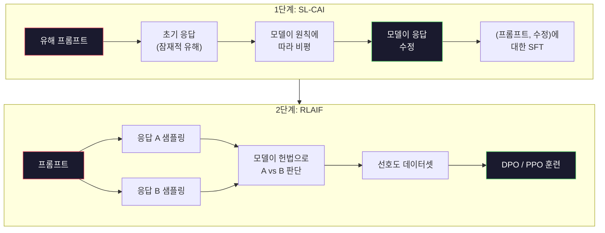
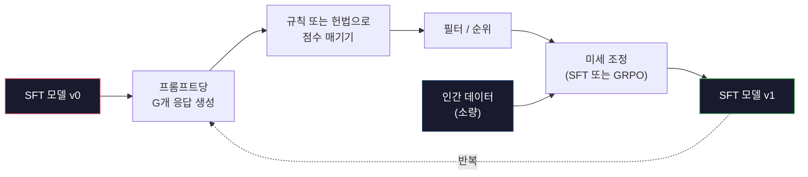

# 헌법적 AI와 자기 개선

> RLHF는 루프에 인간이 필요합니다. 헌법적 AI(Constitutional AI)는 그 대부분을 모델 자체로 대체합니다. 원칙 목록을 작성하고, 모델이 해당 원칙에 대해 자신의 출력을 비평하게 한 다음, 비평에 대해 훈련합니다. DeepSeek-R1은 2025년에 이를 더 발전시켰습니다: 모델이 수백만 개의 추론 궤적을 생성하고, 규칙으로 채점한 다음, 결과에 대해 GRPO를 실행하게 합니다. 2026년 프론티어 모델에서 "정렬 작업"의 대부분은 모델 자체의 정렬입니다. 이 과는 두 루프를 모두 구축합니다.

**유형:** 빌드
**언어:** Python (stdlib + numpy)
**사전 필요 지식:** 10단계, 06-08과 (SFT, RLHF, DPO)
**소요 시간:** ~45분

## 학습 목표

- 헌법적 AI 2단계 루프 구현: 자기 비평 + 자기 수정, 그 다음 수정된 쌍에 대한 선호도 훈련
- GRPO 목적 함수(DeepSeek-R1의 그룹-상대 정책 최적화) 유도 및 PPO의 가치-함수 기준선과 대비
- 검증 가능한 추론 궤적을 규칙 기반 결과 보상으로 생성하고 별도의 보상 모델 없이 채점
- 자기 개선이 인간 선호도 데이터를 이기는 경우와 모드 탐색(mode seeking)으로 붕괴되는 경우 결정

## 문제

07과에서 RLHF를, 08과에서 DPO를 구축했습니다. 둘 다 동일한 비용이 많이 드는 입력에 의존합니다: 인간 선호도 쌍. Anthropic의 InstructGPT-era 파이프라인은 약 33,000개의 비교를 사용했습니다. Llama 2 Chat은 150만 개 이상을 사용했습니다. Claude 3는 더 많이 사용했습니다. 이 데이터는 느리고, 비싸며, 주석자가 평가 당일 우연히 믿었던 것에 편향됩니다.

2022년 헌법적 AI 논문은 간단한 질문을 던졌습니다. 모델이 스스로 선호도 레이블을 생성한다면? 서면 원칙 목록 — "헌법" — 을 제공하고 모델이 자신의 응답을 비평하게 합니다. 비평이 훈련 신호가 됩니다.

2024년 DeepSeek은 아이디어를 더 발전시켰습니다. 검증 가능한 결과가 있는 모든 작업(알려진 답이 있는 수학, 테스트를 통과하거나 실패하는 코드, 이기거나 지는 게임)에 대해 비평가를 완전히 건너뛸 수 있음을 보여주었습니다. 많은 후보 해결책을 생성합니다. 각각을 결정론적 규칙으로 채점합니다. 보상에 대해 정책-기울기 알고리즘을 실행합니다. DeepSeek-R1은 거의 인간 선호도 데이터 없이 이 방식으로 훈련되었으며 o1-급 추론 성능과 일치했습니다.

이 두 루프 — 주관적 행동을 위한 헌법적 AI와 검증 가능한 행동을 위한 규칙 기반 RL — 은 2026년의 지배적인 정렬 레시피입니다. RLHF에 사용되던 인간 선호도 예산은 이제 훨씬 더 작은 단계(헌법 선택 및 보상 규칙 선택)에 사용됩니다.

## 개념

### 헌법적 AI 루프

Bai et al. (2022)은 파이프라인을 두 단계로 구조화했습니다.

**1단계: AI 피드백으로부터의 지도 학습 (SL-CAI).** 도움이 되지만 잠재적으로 유해한 SFT 모델로 시작합니다. 잠재적으로 유해한 요청으로 프롬프트합니다. 각 응답에 대해 *동일한 모델*에게 헌법 원칙에 대해 응답을 비평하도록 요청한 다음 수정합니다. 수정된 응답에 대해 미세 조정합니다. 데이터셋은 (프롬프트, 수정된_응답) 쌍입니다.

**2단계: AI 피드백으로부터의 강화 학습 (RLAIF).** 응답 쌍을 샘플링합니다. 모델에게 어느 것이 헌법을 더 잘 따르는지 묻습니다. 쌍별 선호도가 보상 모델을 훈련합니다. 그런 다음 해당 보상을 사용하여 모델에 대해 PPO 또는 DPO를 실행합니다. RLHF와의 주요 차이점: 선호도가 인간이 아닌 모델에서 나왔습니다.



헌법이 지렛대입니다. Anthropic의 원본은 16개 원칙(나중에 확장됨)이 있었습니다. 원칙은 "다양한 문화적 배경을 가진 사람들에게 이의를 제기할 가능성이 가장 적은 응답을 선택하십시오."와 같이 읽힙니다. 각 단계에 대해 원칙을 선택하며, 때로는 무작위로, 때로는 프롬프트 범주에 따라 선택합니다.

### 헌법이 실제로 하는 일

헌법은 정렬 계약을 *데이터*에서 *텍스트*로 이동시킵니다. RLHF에서 행동을 변경하는 것은 수천 개의 쌍을 다시 레이블링하는 것을 의미합니다. CAI에서 행동을 변경하는 것은 문단을 편집하는 것을 의미합니다. 이것이 주요 실용적 이점입니다.

비용이 따릅니다. 모델의 자기 판단은 시작점의 보정만큼만 좋습니다. SFT 모델에 사각지대가 있으면 — 예를 들어, 조작적 어구를 인식하지 못하면 — 비평 단계가 그 사각지대를 물려받습니다. CAI는 정렬 루프를 압축하지만 기본 모델의 한계를 넘어 신호를 증폭할 수 없습니다. 이것이 모든 프로덕션 CAI 파이프라인이 여전히 일부 인간 선호도 데이터(일반적으로 순수 RLHF 볼륨의 5-10%)를 사용하는 이유입니다.

### GRPO: 그룹-상대 정책 최적화

DeepSeek은 DeepSeekMath 논문(2024)에서 GRPO를 도입하고 DeepSeek-R1(2025)의 백본으로 사용했습니다. GRPO는 가치 함수를 제거하는 PPO의 변형입니다.

PPO의 목적 함수(07과)를 상기하세요:

```
L_PPO = E[min(r(theta) * A, clip(r(theta), 1-eps, 1+eps) * A)]
```

여기서 `A`는 어드밴티지이며, 일반적으로 학습된 가치 네트워크 `V(s)`를 사용한 GAE로 추정됩니다. 가치 네트워크는 정책과 같은 크기의 두 번째 모델입니다. 메모리를 두 배로 늘리고 자체 훈련 루프를 도입합니다.

GRPO는 가치 함수를 버립니다. 각 프롬프트에 대해 G개의 응답 그룹(일반적으로 G=16 또는 64)을 샘플링합니다. 각 응답의 보상을 계산한 다음 그룹 내에서 정규화합니다:

```
A_i = (r_i - mean(r_1, ..., r_G)) / std(r_1, ..., r_G)
```

어드밴티지는 형제들에 대한 응답 보상의 z-점수입니다. 가치 함수가 없습니다. 그룹이 자체 기준선 역할을 합니다.

```
L_GRPO = E[min(r(theta) * A_group, clip(r(theta), 1-eps, 1+eps) * A_group)] - beta * KL(pi || pi_ref)
```

참조 모델에 대한 KL 페널티는 여전히 있으며, PPO와 동일합니다. 클립 비율도 여전히 있습니다. 사라진 것은 별도의 비평가(critic)입니다.

### GRPO가 추론에 중요한 이유

추론 작업의 경우 보상은 종종 희소하고 이진적입니다: 최종 답이 맞거나 틀립니다. 희소한 이진 보상으로 훈련된 가치 함수는 낭비입니다 — 거의 모든 상태가 마지막 단계까지 동일한 예상 수익을 가지므로 유용한 중간 추정치를 학습할 수 없습니다. GRPO의 그룹 정규화는 즉각적인 상대적 신호를 제공합니다: 동일한 수학 문제에 대한 16번의 시도 중에서, 이 문제에 대해 평균 이상인 시도는 무엇인가?

이것이 규칙 기반 보상에서 얻는 신호의 정확한 형태입니다:

- **수학**: sympy 또는 기호 검사기가 최종 답이 일치하는지 결정.
- **코드**: 테스트 스위트가 통과/실패 결정.
- **형식**: 정규식이 답이 필요한 XML 태그 안에 있는지 결정.
- **다단계 증명**: 증명 도우미(Lean, Coq)가 유효성 결정.

DeepSeek-R1-Zero는 두 가지 보상(수학 벤치마크 정확도 및 형식 준수(answer> 태그 안의 답))으로만 훈련되었습니다. 인간 선호도가 없습니다. 비평가 모델이 없습니다. DeepSeek 논문이 설명한 "아하 순간" — 모델이 자발적으로 자기 확인 및 역추적을 학습하는 것 — 은 희소한 규칙 보상만으로 GRPO에서 나타났습니다.

### 프로세스 보상 모델 vs 결과 보상 모델

여전히 설계 선택이 있습니다: 최종 답을 보상(ORM)하거나 각 중간 단계를 보상(PRM)합니다.

| 축 | ORM | PRM |
|---|---|---|
| 궤적당 신호 | 1개 숫자 | N개 숫자 (단계당 하나) |
| 감독 소스 | 최종 답 확인 | 단계 수준 레이블 또는 자기 판단 |
| 훈련 비용 | 저렴함 | 비쌈 |
| 크레딧 할당 | 희소, 노이즈 많음 | 밀집, 타겟팅됨 |
| 보상 해킹 위험 | 낮음 | 높음 (모델이 PRM 인공물 최적화) |
| 사용처 | DeepSeek-R1, R1-Zero | OpenAI o1 (추정), Math-Shepherd |

2024-2025년 컨센서스는 ORM + GRPO가 PRM보다 더 잘 확장된다는 것이었습니다. PRM은 토큰당 샘플 효율이 더 좋지만 값비싼 단계 레이블 데이터가 필요하고 지름길 행동(PRM에 좋아 보이지만 증명을 진행하지 않는 단계 작성)으로 붕괴되는 경향이 있습니다. 대부분의 팀에게 ORM + GRPO가 먼저 시도할 것입니다.

### 자기 개선: 피드백 증배기

두 루프 패턴(비평/수정 및 규칙 보상이 있는 그룹-상대 RL)이 있으면 체인으로 연결할 수 있습니다.

1. SFT 모델로 시작.
2. 프롬프트당 많은 후보 응답 생성.
3. 규칙 기반 보상(검증 가능한 작업) 또는 헌법적 비평가(주관적 작업)로 점수 매기기.
4. 최고 후보를 새로운 SFT 데이터 또는 선호도 쌍으로 유지.
5. 미세 조정. 개선된 모델로 2단계로 이동.

DeepSeek은 R1-Zero 이후 적용될 때 이것을 "rejection sampling fine-tuning"이라고 불렀습니다. Anthropic은 이전 버전을 "constitutional AI distillation"이라고 불렀습니다. 패턴은: 각 반복이 모델에 이미 있는 신호를 증폭합니다. 새로운 신호를 추가하지 않습니다. 모델이 문제 클래스 X를 전혀 해결할 수 없다면, 아무리 자기 개선을 해도 그 능력이 생성되지 않습니다.

위험은 모드 붕괴(mode collapse)입니다. 자체 생성 데이터는 항상 훈련 말뭉치보다 좁은 분포입니다. 3-5 라운드의 자기 증류 후에 모델은 일반적으로 창의적 작업에서 다양성을 잃고, 과잉 확신하게 되며, 특징적인 "AI 음성"(반복적인 어구, 공식적인 구조)을 나타냅니다. 프로덕션 파이프라인은 분포를 정직하게 유지하기 위해 자체 생성 데이터를 소량의 신선한 인간 데이터와 혼합합니다.



### 언제 무엇을 사용할까

- **순수 CAI**: 주관적 행동(어조, 안전성, 거절 스타일). 잘 정의된 헌법이 있음. 깨끗한 검증 가능한 결과가 없음.
- **GRPO + ORM**: 검증 가능한 작업(수학, 코드, 구조화된 추출). 정확성을 저렴하게 확인 가능. 보상이 희소하고 이진적임.
- **자체 생성 쌍에 대한 DPO**: 혼합. 헌법을 사용하여 선호도 쌍을 생성한 다음 PPO/GRPO 대신 DPO(08과)로 훈련.
- **전체 RLHF**: 규칙이나 짧은 헌법으로 표현할 수 없는 다중 목적 트레이드오프가 필요할 때 여전히 적절함.

대부분의 2026년 프론티어 파이프라인은 네 가지를 모두 실행합니다. 안전 레이어용 CAI. 추론 후 훈련 패스용 GRPO. 선호도 광택용 DPO. 다른 방법에 저항하는 잔여 행동용 소규모 RLHF 패스.

## 직접 구축하기

코드는 순수 Python + numpy로 세 가지를 구현합니다. 헌법적 AI 자기 비평 루프. 간단한 산술을 위한 규칙 기반 보상 검사기. 04과의 작은 언어 모델에서 실행되는 최소 GRPO 트레이너.

### 1단계: 헌법

원칙 목록. 프로덕션에서는 각 줄이 더 풍부하고 범주 태그가 지정됩니다. 과를 위해 짧게 유지합니다.

```python
CONSTITUTION = [
    "응답은 회피 없이 질문한 내용에 직접 답해야 합니다.",
    "응답에 불필요한 충전재나 패딩을 포함하지 않아야 합니다.",
    "질문에 단일 숫자 답이 있으면 숫자를 간결하게 말하십시오.",
    "응답은 합리적이고 무해한 요청을 거절하지 않아야 합니다.",
]
```

### 2단계: 자기 비평 및 수정

실제 시스템에서는 모델 자체가 비평합니다. 과에서는 파이프라인이 LLM 호출 없이 실행되도록 수동 루브릭으로 비평가를 시뮬레이션합니다.

```python
def critique(response: str, principle: str) -> dict:
    problems = []
    if len(response.split()) > 40 and "plainly" in principle:
        problems.append("답변이 추가 산문에 묻힘")
    if response.strip().lower().startswith(("난 못해", "난 할 수 없어", "ai로서")):
        problems.append("부당한 거절")
    if response.count(",") > 4:
        problems.append("너무 많은 회피")
    return {"principle": principle, "problems": problems}

def revise(response: str, critique_result: dict) -> str:
    if "추가 산문" in " ".join(critique_result["problems"]):
        return response.split(".")[-2].strip() + "."
    if "부당한 거절" in " ".join(critique_result["problems"]):
        return "여기 답이 있습니다: " + response.split(":")[-1].strip()
    return response
```

수정 함수는 대리 역할입니다. 실제 LLM에서는 "비평을 고려하여 응답을 다시 작성하십시오."라는 두 번째 프롬프트가 됩니다.

### 3단계: 규칙 기반 보상

검증 가능한 작업의 경우 비평가를 완전히 대체합니다. 이 검사기는 산술 답을 채점합니다.

```python
import re
import numpy as np

def reward_math(prompt: str, response: str) -> float:
    try:
        expected = eval(prompt.replace("What is ", "").replace("?", "").strip())
    except Exception:
        return 0.0
    numbers = re.findall(r"-?\d+", response)
    if not numbers:
        return 0.0
    return 1.0 if int(numbers[-1]) == expected else 0.0

def reward_format(response: str) -> float:
    return 1.0 if re.search(r"<answer>.*</answer>", response) else 0.0
```

두 가지 결정론적 규칙. 훈련 데이터 없음. 인간 레이블 없음. 결합된 보상은 `reward_math + 0.1 * reward_format`으로, 정확성을 압도하지 않으면서 누락된 형식에 페널티를 줍니다.

### 4단계: 그룹-상대 어드밴티지

동일한 프롬프트에 대한 응답 그룹의 보상 목록이 주어지면 z-점수를 계산합니다:

```python
def group_relative_advantage(rewards: list[float]) -> np.ndarray:
    r = np.array(rewards, dtype=float)
    if r.std() < 1e-8:
        return np.zeros_like(r)
    return (r - r.mean()) / (r.std() + 1e-8)
```

그룹의 모든 샘플이 동일한 보상을 가지면 어드밴티지는 0이고 기울기 신호가 흐르지 않습니다. 이것은 기능입니다. 현재 정책에 대해 프롬프트가 간단히 해결되거나 불가능하게 어렵다는 것을 알려주며, 단계가 이를 건너뛰어야 합니다.

### 5단계: GRPO 업데이트

한 단계, 기호 기울기. 프로덕션에서는 torch autograd 패스일 것입니다. 여기서는 업데이트 규칙을 직접 보여줍니다.

```python
def grpo_step(policy_logprobs: np.ndarray, ref_logprobs: np.ndarray,
              advantages: np.ndarray, beta: float = 0.01, clip_eps: float = 0.2) -> dict:
    ratios = np.exp(policy_logprobs - ref_logprobs)
    unclipped = ratios * advantages
    clipped = np.clip(ratios, 1 - clip_eps, 1 + clip_eps) * advantages
    policy_loss = -np.minimum(unclipped, clipped).mean()
    kl = (ref_logprobs - policy_logprobs).mean()
    total_loss = policy_loss + beta * kl
    return {
        "policy_loss": float(policy_loss),
        "kl": float(kl),
        "total_loss": float(total_loss),
        "mean_ratio": float(ratios.mean()),
    }
```

이것은 한 가지 변경 사항이 있는 PPO의 클리핑된 대리 손실입니다: 어드밴티지가 가치 함수가 아닌 그룹-상대 z-점수에서 왔습니다. 훈련할 V(s)가 없습니다. GAE가 없습니다. 그룹이 기준선입니다.

### 6단계: 자기 개선 라운드

조각을 함께 묶습니다. 그룹을 샘플링하고, 각 응답을 규칙으로 채점하고, 어드밴티지를 계산하고, 실제 옵티마이저에 공급할 메트릭을 보고합니다.

```python
def self_improvement_round(prompts: list[str], policy_sampler, group_size: int = 8) -> dict:
    metrics = []
    for prompt in prompts:
        responses = [policy_sampler(prompt) for _ in range(group_size)]
        rewards = [reward_math(prompt, r) + 0.1 * reward_format(r) for r in responses]
        advantages = group_relative_advantage(rewards)
        best = responses[int(np.argmax(rewards))]
        metrics.append({
            "prompt": prompt,
            "mean_reward": float(np.mean(rewards)),
            "best_reward": float(np.max(rewards)),
            "std_reward": float(np.std(rewards)),
            "best_response": best,
            "advantages": advantages.tolist(),
        })
    return {"per_prompt": metrics,
            "overall_mean": float(np.mean([m["mean_reward"] for m in metrics]))}
```

## 배포하기

이 과는 `outputs/skill-self-improvement-auditor.md`를 제공합니다. 제안된 자기 개선 파이프라인을 입력하면 비협상 가능한 게이트(실제로 검증 가능한 보상 규칙, 참조에 대한 KL 예산, 다양성 최소값, 인간 데이터 할당량)를 적용합니다. 외부 근거 없이 "순수 자기 개선"이라고 주장하는 루프를 승인하지 않습니다.

## 연습 문제

1. 2단계의 수동 비평가를 LLM 호출로 교체하세요. 로컬 채팅 모델을 사용하세요. 비평과 수정이 실제로 응답을 개선하는 빈도와 변경하지 않는 빈도를 측정하세요.

2. 사실성에 대한 세 번째 헌법 원칙을 추가하세요. 사실적 주장(수도, 날짜)이 필요한 프롬프트에서 파이프라인을 실행하고 얼마나 많은 수정이 사실적 오류를 제거하는지 대 새 오류를 도입하는지 측정하세요.

3. CAI 2단계에서 생성된 선호도 쌍에 대해 DPO를 구현하세요. 20개의 프롬프트를 가져와 각각 두 개의 응답을 생성하고, 비평가가 쌍당 승자를 선택하게 한 다음, 08과의 DPO 손실을 실행하세요. 동일한 데이터에서 GRPO 경로와 비교하세요.

4. GRPO 목적 함수에 엔트로피 정규화를 추가하세요. alpha=0.01로 `-alpha * entropy(정책)` 항은 다양한 샘플링을 장려합니다. 5라운드의 자기 개선에 걸쳐 모드 붕괴를 지연시키는지 측정하세요.

5. 2단계 산술 문제에 대한 프로세스 보상 스코어러를 구축하세요. "(3+4)*5는 얼마인가요?"가 주어지면 모델이 중간 3+4=7 단계를 보여야 합니다. 중간 단계를 최종 답과 별도로 채점하고 10라운드에 걸쳐 PRM-가중 GRPO와 순수 ORM-가중 GRPO를 비교하세요.

## 주요 용어

| 용어 | 사람들이 말하는 것 | 실제 의미 |
|---|---|---|
| 헌법적 AI | "모델이 스스로 정렬" | 대부분의 인간 선호도 레이블을 서면 헌법에 대한 모델 자기 판단으로 대체하는 2단계 파이프라인(자기 비평 + RLAIF) |
| RLAIF | "인간 없는 RLHF" | 모델 자체가 생성한 선호도에 대한 PPO 또는 DPO |
| GRPO | "가치 함수 없는 PPO" | 그룹-상대 정책 최적화 — 프롬프트당 G개 응답 샘플링, z-점수 그룹 보상을 어드밴티지로 사용 |
| ORM | "답을 보상" | 결과 보상 모델 — 최종 답에만 단일 스칼라 보상 |
| PRM | "각 단계를 보상" | 프로세스 보상 모델 — 모든 중간 추론 단계에 보상, 종종 단계 레이블 데이터에서 훈련 |
| 규칙 기반 보상 | "결정론적 채점기" | 학습된 모델 없이 이진 또는 숫자 점수를 반환하는 검증기(정규식, sympy, 테스트 스위트) |
| 거절 샘플링 FT | "승자를 유지, 재훈련" | 많은 응답을 샘플링, 가장 높은 보상의 것으로 필터링, SFT 데이터에 추가, 재훈련 |
| 모드 붕괴 | "모델이 다양성을 잃음" | 사후 훈련 정책이 응답 공간의 좁은 영역에 집중; 그룹 전체의 보상 표준편차 하락으로 측정 |
| KL 예산 | "얼마나 벗어날 수 있는지" | 옵티마이저가 훈련이 중지되기 전에 축적할 수 있는 참조 모델과의 총 KL 발산 |
| R1 순간 | "모델이 역추적을 배움" | DeepSeek이 보고한 행동 — 결과 보상만으로 훈련된 정책이 사고 사슬에서 자기 확인 및 역추적을 자발적으로 개발 |

## 추가 자료

- [Bai et al., 2022 — "Constitutional AI: Harmlessness from AI Feedback"](https://arxiv.org/abs/2212.08073) — Anthropic의 원래 CAI 논문, 2단계 SL-CAI + RLAIF 파이프라인
- [Shao et al., 2024 — "DeepSeekMath: Pushing the Limits of Mathematical Reasoning in Open Language Models"](https://arxiv.org/abs/2402.03300) — GRPO 도입
- [DeepSeek-AI, 2025 — "DeepSeek-R1: Incentivizing Reasoning Capability in LLMs via Reinforcement Learning"](https://arxiv.org/abs/2501.12948) — R1 및 R1-Zero, 대규모 GRPO + 규칙 보상
- [Lightman et al., 2023 — "Let's Verify Step by Step"](https://arxiv.org/abs/2305.20050) — OpenAI의 PRM800K 및 프로세스 보상 모델 사례
- [Huang et al., 2024 — "Large Language Models Cannot Self-Correct Reasoning Yet"](https://arxiv.org/abs/2310.01798) — 외부 근거 없는 자기 개선에 대한 회의적 반론
