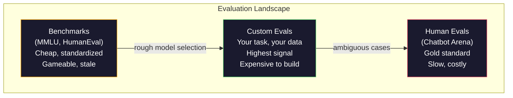
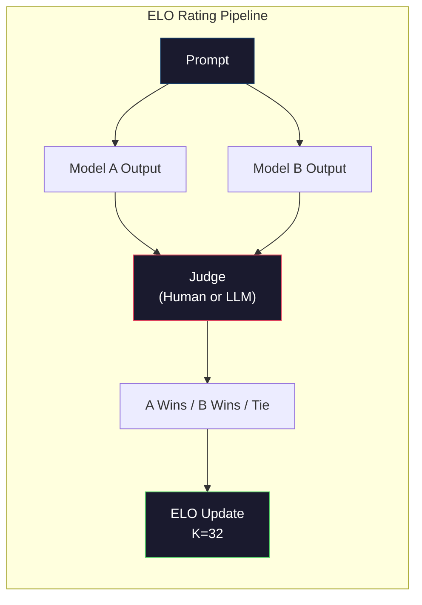

# 평가: 벤치마크, 평가, LM Harness

> Goodhart의 법칙: 측정이 목표가 되면, 그것은 좋은 측정이기를 그만둔다. 모든 프론티어 연구소는 벤치마크를 게임한다. MMLU 점수는 오르지만 모델은 여전히 "strawberry"에 있는 R의 개수를 reliably 셀 수 없다. 유일하게 중요한 평가는 YOUR 평가이다 — YOUR 작업에서, YOUR 데이터로.

**Type:** 구축
**Languages:** Python
**Prerequisites:** Phase 10, Lessons 01-05 (LLMs from Scratch)
**Time:** ~90분

## 학습 목표

- 언어 모델에 대해 객관식 및 개방형 벤치마크를 실행하는 사용자 정의 평가 허니스 구축
- 표준 벤치마크(MMLU, HumanEval)가 왜 포화되고 프론티어 모델을 구별하지 못하는지 설명
- 적절한 메트릭(정확 일치, F1, BLEU, LLM-as-judge 점수)으로 작업별 평가 구현
- 공개 리더보드에만 의존하지 않고 특정 사용 사례를 대상으로 하는 사용자 정의 평가 스위트 설계

## 문제

MMLU는 2020년에 57개 과목에 걸쳐 15,908개의 질문으로 출판되었다. 3년 안에 프론티어 모델이 이를 포화시켰다. GPT-4는 86.4%를 기록했다. Claude 3 Opus는 86.8%를 기록했다. Llama 3 405B는 88.6%를 기록했다. 리더보드는 차이가 통계적 노이즈일 뿐인 3포인트 범위로 압축되었다.

한편, 같은 모델들은 10세 아이가 생각 없이 처리하는 작업에서 실패한다. MMLU에서 88.7%를 기록한 Claude 3.5 Sonnet은 처음에는 "strawberry"의 글자 수를 셀 수 없었다 — 이는 세계 지식이나 추론이 전혀 필요 없는, 단지 문자 수준 반복만 필요한 작업이다. HumanEval은 164개의 문제로 코드 생성을 테스트한다. 모델들은 90%+ 점수를 기록하면서도 주니어 개발자라면 잡을 엣지 케이스에서 충돌하는 코드를 여전히 생성한다.

벤치마크 성능과 실제 신뢰성 사이의 격차는 LLM 평가의 핵심 문제이다. 벤치마크는 모델이 벤치마크에서 어떻게 수행하는지 알려준다. 특정 작업, 특정 데이터, 특정 실패 모드에서 모델이 어떻게 수행할지에 대해서는 거의 아무것도 알려주지 않는다. 고객 지원 봇을 구축 중이라면 MMLU는 무관하다. 코드 어시스턴트를 구축 중이라면 HumanEval은 함수 수준 생성만 다룰 뿐 — 파일 간 디버깅, 리팩토링, 코드 설명에 대해서는 아무것도 말해주지 않는다.

사용자 정의 평가가 필요하다. 벤치마크가 쓸모없기 때문이 아니라(대략적인 모델 선택에는 유용함) 최종 평가가 배포 조건과 정확히 일치해야 하기 때문이다.

## 개념

### 평가 환경

각각 비용과 신호 품질이 다른 세 가지 범주의 평가가 있다.

**벤치마크**는 표준화된 테스트 스위트이다. MMLU, HumanEval, SWE-bench, MATH, ARC, HellaSwag. 벤치마크에 대해 모델을 실행하고 점수를 얻는다. 장점: 모두가 동일한 테스트를 사용하므로 모델을 비교할 수 있다. 단점: 모델과 훈련 데이터가 점점 이러한 벤치마크를 오염시킨다. 연구소는 벤치마크 질문을 포함하는 데이터로 훈련한다. 점수는 오른다. 능력은 그렇지 않을 수 있다.

**사용자 정의 평가**는 특정 사용 사례를 위해 구축하는 테스트 스위트이다. 입력, 예상 출력, 점수 함수를 정의한다. 법률 문서 요약기는 법률 문서에서 평가된다. SQL 생성기는 데이터베이스 스키마에서 평가된다. 이러한 평가는 만들기에 비용이 많이 들지만 프로덕션 성능을 예측하는 유일한 평가이다.

**인간 평가**는 유급 평가자가 도움됨, 정확성, 유창성, 안전성과 같은 기준에 따라 모델 출력을 판단한다. 자동 점수가 실패하는 개방형 작업의 금본위. Chatbot Arena는 100개 이상의 모델에 걸쳐 200만 개 이상의 인간 선호도 투표를 수집했다. 단점: 비용(판단당 $0.10-$2.00)과 속도(시간에서 일).



### 벤치마크가 깨지는 이유

세 가지 메커니즘이 벤치마크 점수가 실제 능력을 반영하지 못하게 한다.

**데이터 오염.** 훈련 말뭉치는 인터넷을 스크랩한다. 벤치마크 질문은 인터넷에 있다. 모델은 훈련 중에 답변을 본다. 이는 전통적인 의미의 부정행위가 아니다 — 연구소가 의도적으로 벤치마크 데이터를 포함하지는 않는다. 그러나 웹-규모 스크래핑은 제외하는 것을 거의 불가능하게 만든다.

**시험을 위한 교육.** 연구소는 벤치마크 성능을 위해 훈련 혼합물을 최적화한다. 훈련 혼합의 5%가 MMLU-스타일 객관식이라면, 모델은 형식과 답변 분포를 학습한다. MMLU는 4-way 객관식이다. 모델은 답변 분포가 A/B/C/D에 걸쳐 대략 균일하다는 것을 학습하며, 이는 모델이 답변을 모를 때도 도움이 된다.

**포화.** 모든 프론티어 모델이 벤치마크에서 85-90%를 기록할 때, 벤치마크는 구별을 멈춘다. 나머지 10-15%의 질문은 모호하거나, 잘못 레이블링되었거나, 난해한 도메인 지식이 필요할 수 있다. MMLU에서 87%에서 89%로의 개선은 모델이 두 개의 더 난해한 질문을 암기했음을 의미할 수 있으며, 더 똑똑해진 것은 아니다.

### 혼란도 (Perplexity): 빠른 건강 체크

혼란도는 모델이 토큰 시퀀스에 얼마나 놀라는지 측정한다. 공식적으로, 지수화된 평균 음의 로그-우도이다:

```
PPL = exp(-1/N * sum(log P(token_i | context)))
```

혼란도 10은 모델이 각 토큰 위치에서 평균적으로 10개 옵션 중에서 균일하게 선택하는 만큼 불확실하다는 것을 의미한다. 낮을수록 좋다. GPT-2는 WikiText-103에서 ~30의 혼란도를 얻는다. GPT-3는 ~20. Llama 3 8B는 ~7.

혼란도는 동일한 테스트 세트에서 모델을 비교하는 데 유용하지만, 맹점이 있다. 모델이 일반적인 패턴을 예측하는 데 능숙하면서 드물지만 중요한 패턴에는 끔찍할 수 있다. 또한 명령 수행, 추론 또는 사실적 정확성에 대해 아무것도 말해주지 않는다. 최종 판단이 아닌 건강 체크로 사용하라.

### LLM-as-Judge

강력한 모델을 사용하여 약한 모델의 출력을 평가한다. 아이디어는 간단하다: GPT-4o나 Claude Sonnet에게 정확성, 도움됨, 안전성에 대해 1-5 척도로 응답을 평가하도록 요청. 이 비용은 GPT-4o-mini로 판단당 약 $0.01이며, 인간 판단과 놀라울 정도로 잘 상관관계를 보인다 — 대부분의 작업에서 약 80% 일치.

점수 프롬프트는 모델보다 더 중요하다. 모호한 프롬프트("이 응답을 평가하라")는 노이즈가 많은 점수를 생성한다. 루브릭이 있는 구조화된 프롬프트("답변이 사실적으로 정확하고 출처를 인용하면 5점, 정확하지만 출처가 없으면 4점, 부분적으로 정확하면 3점...")는 일관되고 재현 가능한 점수를 생성한다.

실패 모드: 판사 모델은 위치 편향(쌍별 비교에서 첫 번째 응답 선호), 장황함 편향(긴 응답 선호), 자기-선호(동등한 Claude 출력보다 GPT-4 출력을 더 높게 평가)를 나타낸다. 완화: 순서 무작위화, 길이 정규화, 평가되는 모델과 다른 판사 사용.

### 쌍별 비교로부터의 ELO 등급

Chatbot Arena의 접근 방식. 다른 모델의 동일한 프롬프트에 대한 두 응답을 보여준다. 인간(또는 LLM 판사)이 더 나은 것을 선택한다. 수천 번의 이러한 비교로부터 각 모델에 대한 ELO 등급을 계산 — 체스에서 사용되는 동일한 시스템.

ELO 장점: 상대적 순위가 절대 점수보다 더 신뢰할 수 있고, 무승부를 우아하게 처리하며, 모든 출력을 독립적으로 점수 매기는 것보다 적은 비교로 수렴한다. 2026년 초 기준, Chatbot Arena 순위는 GPT-4o, Claude 3.5 Sonnet, Gemini 1.5 Pro가 상위에서 20 ELO 포인트 이내에 있음을 보여준다.



### 평가 프레임워크

**lm-evaluation-harness** (EleutherAI): 표준 오픈소스 평가 프레임워크. 200개 이상의 벤치마크 지원. 하나의 명령으로 MMLU, HellaSwag, ARC 등에 대해 모든 Hugging Face 모델 실행. Open LLM Leaderboard에서 사용.

**RAGAS**: RAG 파이프라인을 위한 평가 프레임워크. 충실도(답변이 검색된 컨텍스트와 일치하는가?), 관련성(검색된 컨텍스트가 질문과 관련이 있는가?), 답변 정확성 측정.

**promptfoo**: 프롬프트 엔지니어링을 위한 구성-구동 평가. YAML로 테스트 케이스 정의, 여러 모델에 대해 실행, 통과/실패 보고서 획득. 프롬프트의 회귀 테스트에 유용 — 프롬프트 변경이 기존 테스트 케이스를 깨뜨리지 않는지 확인.

### 사용자 정의 평가 구축

프로덕션에 중요한 유일한 평가. 프로세스:

1. **작업 정의.** 모델이 정확히 무엇을 해야 하는가? 정확하라. "질문에 답하라"는 너무 모호함. "고객 불만 이메일이 주어지면, 제품명, 이슈 카테고리, 감정을 추출하라"는 평가할 수 있는 작업.

2. **테스트 케이스 생성.** 프로토타입 평가에는 최소 50개, 프로덕션에는 200개+. 각 테스트 케이스는 (입력, 예상_출력) 쌍. 엣지 케이스 포함: 빈 입력, 적대적 입력, 모호한 입력, 다른 언어의 입력.

3. **점수 정의.** 구조화된 출력에 대한 정확 일치. 텍스트 유사성에 대한 BLEU/ROUGE. 개방형 품질에 대한 LLM-as-judge. 추출 작업에 대한 F1. 가중치로 여러 메트릭 결합.

4. **자동화.** 모든 평가가 하나의 명령으로 실행. 수동 단계 없음. 시간 경과에 따른 비교를 가능하게 하는 형식으로 결과 저장.

5. **시간 경과 추적.** 평가 점수는 단독으로 의미가 없음. 추세선이 필요. 마지막 프롬프트 변경 후 점수가 향상되었는가? 모델 전환 후 회귀되었는가? 프롬프트와 함께 평가 버전 관리.

| 평가 유형 | 판단당 비용 | 인간과의 일치율 | 최적 대상 |
|-----------|------------------|----------------------|----------|
| 정확 일치 | ~$0 | 100% (해당 시) | 구조화된 출력, 분류 |
| BLEU/ROUGE | ~$0 | ~60% | 번역, 요약 |
| LLM-as-judge | ~$0.01 | ~80% | 개방형 생성 |
| 인간 평가 | $0.10-$2.00 | N/A (정답) | 모호한, 고위험 작업 |

## 직접 구현하기

### 단계 1: 최소 평가 프레임워크

핵심 추상화 정의. 평가 케이스는 입력, 예상 출력, 선택적 메타데이터 딕셔너리를 가짐. 점수 함수는 예측과 참조를 받아 0과 1 사이의 점수를 반환.

```python
import json
from collections import Counter

class EvalCase:
    def __init__(self, input_text, expected, metadata=None):
        self.input_text = input_text
        self.expected = expected
        self.metadata = metadata or {}

class EvalSuite:
    def __init__(self, name, cases, scorers):
        self.name = name
        self.cases = cases
        self.scorers = scorers

    def run(self, model_fn):
        results = []
        for case in self.cases:
            prediction = model_fn(case.input_text)
            scores = {}
            for scorer_name, scorer_fn in self.scorers.items():
                scores[scorer_name] = scorer_fn(prediction, case.expected)
            results.append({
                "input": case.input_text,
                "expected": case.expected,
                "prediction": prediction,
                "scores": scores,
            })
        return results
```

### 단계 2: 점수 함수

정확 일치, 토큰 F1, 시뮬레이션된 LLM-as-judge 점수 함수 구축.

```python
def exact_match(prediction, expected):
    return 1.0 if prediction.strip().lower() == expected.strip().lower() else 0.0

def token_f1(prediction, expected):
    pred_tokens = set(prediction.lower().split())
    exp_tokens = set(expected.lower().split())
    if not pred_tokens or not exp_tokens:
        return 0.0
    common = pred_tokens & exp_tokens
    precision = len(common) / len(pred_tokens)
    recall = len(common) / len(exp_tokens)
    if precision + recall == 0:
        return 0.0
    return 2 * (precision * recall) / (precision + recall)

def llm_judge_simulated(prediction, expected):
    pred_words = set(prediction.lower().split())
    exp_words = set(expected.lower().split())
    if not exp_words:
        return 0.0
    overlap = len(pred_words & exp_words) / len(exp_words)
    length_penalty = min(1.0, len(prediction) / max(len(expected), 1))
    return round(overlap * 0.7 + length_penalty * 0.3, 3)
```

### 단계 3: ELO 등급 시스템

ELO 업데이트로 쌍별 비교 구현. 이것이 정확히 Chatbot Arena가 모델을 순위 매기는 데 사용하는 시스템.

```python
class ELOTracker:
    def __init__(self, k=32, initial_rating=1500):
        self.ratings = {}
        self.k = k
        self.initial_rating = initial_rating
        self.history = []

    def _ensure_player(self, name):
        if name not in self.ratings:
            self.ratings[name] = self.initial_rating

    def expected_score(self, rating_a, rating_b):
        return 1 / (1 + 10 ** ((rating_b - rating_a) / 400))

    def record_match(self, player_a, player_b, outcome):
        self._ensure_player(player_a)
        self._ensure_player(player_b)

        ea = self.expected_score(self.ratings[player_a], self.ratings[player_b])
        eb = 1 - ea

        if outcome == "a":
            sa, sb = 1.0, 0.0
        elif outcome == "b":
            sa, sb = 0.0, 1.0
        else:
            sa, sb = 0.5, 0.5

        self.ratings[player_a] += self.k * (sa - ea)
        self.ratings[player_b] += self.k * (sb - eb)

        self.history.append({
            "a": player_a, "b": player_b,
            "outcome": outcome,
            "rating_a": round(self.ratings[player_a], 1),
            "rating_b": round(self.ratings[player_b], 1),
        })

    def leaderboard(self):
        return sorted(self.ratings.items(), key=lambda x: -x[1])
```

### 단계 4: 혼란도 계산

토큰 확률을 사용하여 혼란도 계산. 실제로는 모델의 로짓에서 이를 얻음. 여기서는 확률 분포로 시뮬레이션.

```python
import numpy as np

def perplexity(log_probs):
    if not log_probs:
        return float("inf")
    avg_neg_log_prob = -np.mean(log_probs)
    return float(np.exp(avg_neg_log_prob))

def token_log_probs_simulated(text, model_quality=0.8):
    np.random.seed(hash(text) % 2**31)
    tokens = text.split()
    log_probs = []
    for i, token in enumerate(tokens):
        base_prob = model_quality
        if len(token) > 8:
            base_prob *= 0.6
        if i == 0:
            base_prob *= 0.7
        prob = np.clip(base_prob + np.random.normal(0, 0.1), 0.01, 0.99)
        log_probs.append(float(np.log(prob)))
    return log_probs
```

### 단계 5: 결과 집계

평가 실행에 걸친 요약 통계 계산: 평균, 중앙값, 임계값에서의 통과율, 메트릭별 분석.

```python
def summarize_results(results, threshold=0.8):
    all_scores = {}
    for r in results:
        for metric, score in r["scores"].items():
            all_scores.setdefault(metric, []).append(score)

    summary = {}
    for metric, scores in all_scores.items():
        arr = np.array(scores)
        summary[metric] = {
            "mean": round(float(np.mean(arr)), 3),
            "median": round(float(np.median(arr)), 3),
            "std": round(float(np.std(arr)), 3),
            "min": round(float(np.min(arr)), 3),
            "max": round(float(np.max(arr)), 3),
            "pass_rate": round(float(np.mean(arr >= threshold)), 3),
            "n": len(scores),
        }
    return summary

def print_summary(summary, suite_name="Eval"):
    print(f"\n{'=' * 60}")
    print(f"  {suite_name} Summary")
    print(f"{'=' * 60}")
    for metric, stats in summary.items():
        print(f"\n  {metric}:")
        print(f"    Mean:      {stats['mean']:.3f}")
        print(f"    Median:    {stats['median']:.3f}")
        print(f"    Std:       {stats['std']:.3f}")
        print(f"    Range:     [{stats['min']:.3f}, {stats['max']:.3f}]")
        print(f"    Pass rate: {stats['pass_rate']:.1%} (threshold >= 0.8)")
        print(f"    N:         {stats['n']}")
```

### 단계 6: 전체 파이프라인 실행

모든 것을 연결. 작업 정의, 테스트 케이스 생성, 두 모델 시뮬레이션, 평가 실행, 쌍별 비교에서 ELO 계산, 리더보드 출력.

```python
def demo_model_good(prompt):
    responses = {
        "What is the capital of France?": "Paris",
        "What is 2 + 2?": "4",
        "Who wrote Hamlet?": "William Shakespeare",
        "What language is PyTorch written in?": "Python and C++",
        "What is the boiling point of water?": "100 degrees Celsius",
    }
    return responses.get(prompt, "I don't know")

def demo_model_bad(prompt):
    responses = {
        "What is the capital of France?": "Paris is the capital city of France",
        "What is 2 + 2?": "The answer is four",
        "Who wrote Hamlet?": "Shakespeare",
        "What language is PyTorch written in?": "Python",
        "What is the boiling point of water?": "212 Fahrenheit",
    }
    return responses.get(prompt, "Unknown")

cases = [
    EvalCase("What is the capital of France?", "Paris"),
    EvalCase("What is 2 + 2?", "4"),
    EvalCase("Who wrote Hamlet?", "William Shakespeare"),
    EvalCase("What language is PyTorch written in?", "Python and C++"),
    EvalCase("What is the boiling point of water?", "100 degrees Celsius"),
]

suite = EvalSuite(
    name="General Knowledge",
    cases=cases,
    scorers={
        "exact_match": exact_match,
        "token_f1": token_f1,
        "llm_judge": llm_judge_simulated,
    },
)

results_good = suite.run(demo_model_good)
results_bad = suite.run(demo_model_bad)

print_summary(summarize_results(results_good), "Model A (concise)")
print_summary(summarize_results(results_bad), "Model B (verbose)")
```

"좋은" 모델은 정확한 답변을 제공. "나쁜" 모델은 장황한 의역을 제공. 정확 일치는 장황한 모델을 심하게 처벌. 토큰 F1과 LLM-as-judge는 더 관대. 이것이 메트릭 선택이 중요한 이유: 동일한 모델이 점수 매기는 방식에 따라 훌륭해 보이거나 끔찍해 보일 수 있음.

### 단계 7: ELO 토너먼트

여러 라운드에 걸쳐 모델 간 쌍별 비교 실행.

```python
elo = ELOTracker(k=32)

for case in cases:
    pred_a = demo_model_good(case.input_text)
    pred_b = demo_model_bad(case.input_text)

    score_a = token_f1(pred_a, case.expected)
    score_b = token_f1(pred_b, case.expected)

    if score_a > score_b:
        outcome = "a"
    elif score_b > score_a:
        outcome = "b"
    else:
        outcome = "tie"

    elo.record_match("model_a_concise", "model_b_verbose", outcome)

print("\nELO Leaderboard:")
for name, rating in elo.leaderboard():
    print(f"  {name}: {rating:.0f}")
```

### 단계 8: 혼란도 비교

다른 품질 수준의 "모델" 간 혼란도 비교.

```python
test_text = "The quick brown fox jumps over the lazy dog in the garden"

for quality, label in [(0.9, "Strong model"), (0.7, "Medium model"), (0.4, "Weak model")]:
    log_probs = token_log_probs_simulated(test_text, model_quality=quality)
    ppl = perplexity(log_probs)
    print(f"  {label} (quality={quality}): perplexity = {ppl:.2f}")
```

## 활용하기

### lm-evaluation-harness (EleutherAI)

모든 모델에서 벤치마크를 실행하기 위한 표준 도구.

```python
# pip install lm-eval
# Command line:
# lm_eval --model hf --model_args pretrained=meta-llama/Llama-3.1-8B --tasks mmlu --batch_size 8

# Python API:
# import lm_eval
# results = lm_eval.simple_evaluate(
#     model="hf",
#     model_args="pretrained=meta-llama/Llama-3.1-8B",
#     tasks=["mmlu", "hellaswag", "arc_easy"],
#     batch_size=8,
# )
# print(results["results"])
```

### promptfoo

프롬프트 엔지니어링을 위한 구성-구동 평가. YAML로 테스트 정의, 여러 공급자에 대해 실행.

```yaml
# promptfoo.yaml
providers:
  - openai:gpt-4o-mini
  - anthropic:claude-3-haiku

prompts:
  - "Answer in one word: {{question}}"

tests:
  - vars:
      question: "What is the capital of France?"
    assert:
      - type: contains
        value: "Paris"
  - vars:
      question: "What is 2 + 2?"
    assert:
      - type: equals
        value: "4"
```

### RAGAS for RAG evaluation

```python
# pip install ragas
# from ragas import evaluate
# from ragas.metrics import faithfulness, answer_relevancy, context_precision
#
# result = evaluate(
#     dataset,
#     metrics=[faithfulness, answer_relevancy, context_precision],
# )
# print(result)
```

RAGAS는 일반 평가가 놓치는 것을 측정: 모델의 답변이 검색된 컨텍스트에 근거하는지, 단순히 추상적으로 "올바른"지 여부.

## 결과물

이 레슨은 `outputs/prompt-eval-designer.md`를 생성 — 모든 작업에 대해 사용자 정의 평가 스위트를 설계하는 재사용 가능한 프롬프트. 작업 설명을 제공하면 테스트 케이스, 점수 함수, 통과/실패 임계값 추천을 생성.

또한 `outputs/skill-llm-evaluation.md`를 생성 — 작업 유형, 예산, 지연 시간 요구사항에 따라 올바른 평가 전략을 선택하기 위한 의사결정 프레임워크.

## 연습문제

1. 동일한 입력을 모델에 5번 실행하고 출력이 얼마나 자주 일치하는지 측정하는 "일관성" 점수 함수를 추가. 결정론적 입력에 대한 일관성 없는 답변은 취약한 프롬프트 또는 높은 온도 설정을 드러냄.

2. ELO 추적기를 여러 판사 함수(정확 일치, F1, LLM-as-judge)를 지원하고 가중치를 부여하도록 확장. 정확 일치에 무거운 가중치를 둘 때와 F1에 무거운 가중치를 둘 때 리더보드가 어떻게 변하는지 비교.

3. 특정 작업(이메일을 5개 카테고리로 분류)에 대한 평가 스위트 구축. 여러 카테고리에 속할 수 있는 이메일, 빈 이메일, 다른 언어의 이메일 등 엣지 케이스를 포함한 다양한 예제로 100개의 테스트 케이스 생성. 다른 "모델"(규칙 기반, 키워드 매칭, 시뮬레이션된 LLM)이 어떻게 수행하는지 측정.

4. 오염 탐지 구현: 평가 질문 세트와 훈련 말뭉치가 주어지면, 평가 질문(또는 가까운 의역)의 몇 퍼센트가 훈련 데이터에 나타나는지 확인. 이것이 연구자들이 벤치마크 타당성을 감사하는 방법.

5. "모델 diff" 도구 구축. 두 모델 버전의 평가 결과가 주어지면, 어떤 특정 테스트 케이스가 개선되었고, 어떤 것이 회귀했으며, 어떤 것이 동일하게 유지되었는지 강조. 이것은 코드 diff의 평가 버전 — 변경이 도움이 되었는지 해를 끼쳤는지 이해하는 데 필수적.

## 주요 용어

| 용어 | 사람들이 말하는 것 | 실제 의미 |
|------|----------------|----------------------|
| MMLU | "그 벤치마크" | Massive Multitask Language Understanding — 57개 과목에 걸친 15,908개 객관식 질문, 2025년까지 88% 이상에서 포화 |
| HumanEval | "코드 평가" | OpenAI의 164개 Python 함수-완성 문제, 고립된 함수 생성만 테스트 |
| SWE-bench | "실제 코딩 평가" | 12개 Python 저장소의 2,294개 GitHub 이슈, 테스트 생성을 포함한 종단간 버그 수정 측정 |
| 혼란도 (Perplexity) | "모델이 얼마나 혼란스러운지" | exp(-avg(log P(token_i given context))) — 낮을수록 모델이 실제 토큰에 더 높은 확률을 할당 |
| ELO 등급 | "모델을 위한 체스 랭킹" | 쌍별 승/패 기록에서 계산된 상대적 기술 등급, Chatbot Arena에서 100개+ 모델 순위 매기는 데 사용 |
| LLM-as-judge | "AI를 사용하여 AI 평가" | 강력한 모델이 약한 모델의 출력을 루브릭에 대해 점수 매김, 판단당 ~$0.01에 인간 판사와 ~80% 일치 |
| 데이터 오염 | "모델이 시험을 보았다" | 훈련 데이터에 벤치마크 질문 포함, 실제 능력 향상 없이 점수 부풀리기 |
| 평가 스위트 | "많은 테스트들" | 특정 능력을 측정하는 버전 관리된 (입력, 예상_출력, 점수_함수) 트리플 모음 |
| 통과율 | "맞히는 비율" | 임계값 이상의 평가 케이스 비율 — 평균 점수보다 더 실행 가능한 이유는 신뢰성을 측정하기 때문 |
| Chatbot Arena | "모델 순위 웹사이트" | 200만+ 인간 선호도 투표를 가진 LMSYS 플랫폼, ELO 등급을 통해 가장 신뢰받는 LLM 리더보드 생산 |

## 추가 자료

- [Hendrycks et al., 2021 -- "Measuring Massive Multitask Language Understanding"](https://arxiv.org/abs/2009.03300) — MMLU 논문, 포화에도 불구하고 여전히 가장 많이 인용된 LLM 벤치마크
- [Chen et al., 2021 -- "Evaluating Large Language Models Trained on Code"](https://arxiv.org/abs/2107.03374) — OpenAI의 HumanEval 논문, 코드 생성 평가 방법론 수립
- [Zheng et al., 2023 -- "Judging LLM-as-a-Judge"](https://arxiv.org/abs/2306.05685) — 위치 편향 및 장황함 편향 발견을 포함한 LLM으로 LLM 평가에 대한 체계적 분석
- [LMSYS Chatbot Arena](https://chat.lmsys.org/) — 200만+ 투표를 가진 크라우드소싱 모델 비교 플랫폼, 가장 신뢰받는 실제 LLM 순위
