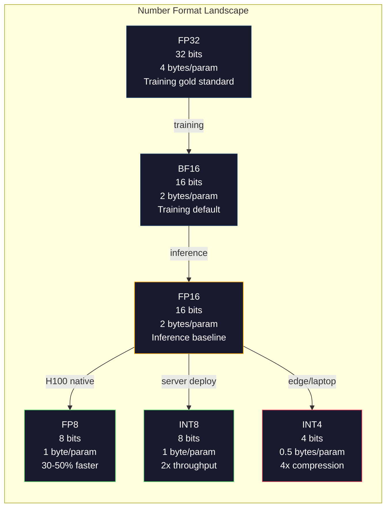
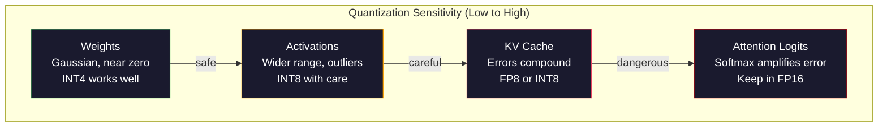
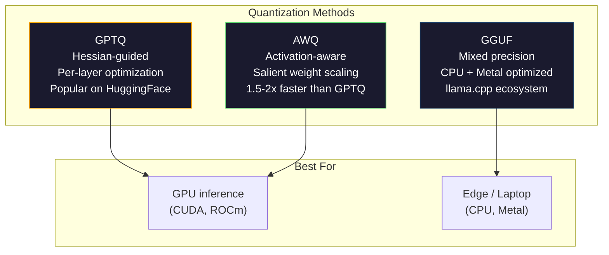

# 양자화: 모델을 맞추다

> FP16의 70B 모델은 140GB가 필요하다. 가중치만으로 A100 두 대. FP8로 양자화: 80GB GPU 하나. INT4: MacBook.

**Type:** 구축
**Languages:** Python (numpy)
**Prerequisites:** Phase 10, Lessons 01-10 (LLMs from Scratch)
**Time:** ~120분

## 학습 목표

- FP16에서 INT8 및 INT4로 대칭 및 비대칭 양자화(텐서별 및 채널별 스케일링 포함) 구현
- 양자화로 인한 메모리 절약 계산 및 주어진 GPU VRAM에 맞는 정밀도 결정
- 훈련 후 양자화(PTQ)와 양자화 인식 훈련(QAT)의 차이 설명
- GPTQ 또는 AWQ를 적용하여 실제 모델을 양자화하고 벤치마크에서 정확도-메모리 트레이드오프 측정

## 문제

Llama 3 70B는 700억 개의 파라미터를 가진다. 각 파라미터는 16비트 부동소수점 숫자이다. 즉 1400억 바이트. 140GB. 단일 A100은 80GB의 VRAM을 가진다. 단일 GPU에 가중치조차 로드할 수 없으며, 추론은 말할 것도 없다. 하나의 모델을 서빙하기만 해도 시간당 $2짜리 A100이 두 대 필요하다.

그러나 파라미터당 16비트는 낭비적이다. 신경망의 대부분의 가중치는 0 근처에 모여 있다. FP16의 전체 동적 범위(0.000000059에서 65,504)는 거의 전혀 사용되지 않는다. Llama 3 70B의 실제 가중치 분포를 측정하면, 95%가 -0.1과 +0.1 사이에 있다. 4비트에 들어갈 수 있는 값을 표현하기 위해 16비트를 낭비하고 있는 것이다.

양자화는 고정밀도 숫자를 저정밀도 숫자로 대체한다. FP16에서 FP8로 메모리가 절반으로 줄어든다. FP16에서 INT4로 메모리가 4분의 1로 줄어든다. 그 140GB 모델이 35GB가 된다. 단일 소비자 GPU에 들어간다. 2비트 양자화(공격적이고 손실이 있지만 일부 작업에 사용 가능)로 밀어붙이면 동일한 모델이 16GB 노트북에서 실행된다.

대가는 정확도이다. 제거된 모든 비트는 정보를 파괴한다. 문제는 얼마나 많은 정확도를 잃고 어디서 잃는가이다. 잘 양자화된 INT4 모델은 대부분의 벤치마크에서 원본 품질의 95-99%를 유지한다. INT4로의 순진한 양자화는 모델을 완전히 파괴할 수 있다. 차이는 기술이다.

GPTQ를 사용한 Llama 3의 INT4 커뮤니티 양자화는 WikiText에서 대략 1-2 혼란도 포인트를 잃는다. Mistral은 Mixtral 8x22B의 FP8 체크포인트를 MMLU에서 측정 가능한 품질 손실 없이 출시했다. GGUF 형식은 llama.cpp를 구동하며, M-시리즈 칩이 있는 MacBook에서 70B 모델을 실행한다. 양자화는 해킹이 아니다. 7B보다 큰 모든 모델의 표준 배포 경로이다.

## 개념

### 숫자 형식: 각 비트가 하는 일

모든 부동소수점 숫자는 세 부분으로 구성된다: 부호, 지수, 가수.

```
FP32:  [1 sign] [8 exponent] [23 mantissa]  = 32 bits
FP16:  [1 sign] [5 exponent] [10 mantissa]  = 16 bits
BF16:  [1 sign] [8 exponent] [7  mantissa]  = 16 bits
FP8:   [1 sign] [4 exponent] [3  mantissa]  = 8  bits (E4M3)
FP8:   [1 sign] [5 exponent] [2  mantissa]  = 8  bits (E5M2)
INT8:  [1 sign] [7 value]                   = 8  bits (uniform steps)
INT4:  [1 sign] [3 value]                   = 4  bits (16 levels total)
```

**FP32**는 전체 정밀도이다. 23비트 가수는 약 7자리 십진수 정밀도를 제공. 범위: 대략 1.2 x 10^-38에서 3.4 x 10^38. 훈련은 예전에 FP32에서만 이루어졌다. 행렬 곱셈 중 합산(accumulation)에는 여전히 사용된다.

**FP16**은 비트를 절반으로 줄인다. 10비트 가수는 약 3.3자리 십진수를 제공. 지수가 5비트로 줄어들어 범위가 극적으로 감소(최대값 ~65,504). 이는 0 근처에 모이는 가중치에는 괜찮지만 훈련 중 급증할 수 있는 활성화 및 기울기에는 위험하다. FP16 훈련은 언더플로우를 방지하기 위해 손실 스케일링이 필요하다.

**BF16** (Brain Float 16)은 FP32에서 8비트 지수를 유지하지만 가수를 7비트로 줄인다. FP32와 동일한 범위, FP16보다 적은 정밀도. Google이 딥러닝을 위해 특별히 설계했다. 직관: 신경망에서 범위가 정밀도보다 더 중요하다. FP16에서 0으로 언더플로우되는 10^-20의 기울기는 BF16에서 생존한다. BF16에서 0.0734로 반올림되는 0.07342의 가중치는 충분히 가깝다. 모든 현대 훈련 실행은 BF16 또는 BF16/FP32 혼합을 사용한다.

**FP8**은 두 가지 종류가 있다. E4M3(4 지수, 3 가수)는 추론 중 가중치와 활성화에 사용된다. E5M2(5 지수, 2 가수)는 정밀도보다 범위가 중요한 훈련 중 기울기에 사용된다. H100 GPU에서 FP8 추론은 무시할 수 있는 품질 손실로 FP16 대비 30-50% 속도 향상을 달성한다.

**INT8**은 정수 형식이다. 지수도 가수도 없다. -128에서 127까지의 256개의 균등한 간격의 값. 부동소수점 가중치를 이 범위로 매핑하려면 스케일 팩터가 필요하다. 장점: 정수 산술은 부동소수점보다 빠르고 전력 효율적이다. A100에서 INT8 행렬 곱셈은 FP16의 312 TFLOPS 대비 624 TOPS로 실행된다.

**INT4**는 더 나아간다. 가능한 값은 16개뿐이다. 스케일 팩터가 무거운 역할을 한다. 품질은 스케일을 어떻게 선택하고 어떤 가중치를 양자화하는지에 전적으로 달려 있다. 최첨단 INT4 방법(GPTQ, AWQ)은 원본 모델 품질의 95%+를 유지한다.



### 양자화 작동 방식

핵심 연산은 간단하다. 부동소수점 값의 텐서를 가져와 스케일 팩터를 찾고, 곱하고, 가장 가까운 정수로 반올림하고, 정수와 스케일 팩터를 저장한다.

**양자화:**
```
scale = max(abs(tensor)) / max_int_value
quantized = round(tensor / scale)
```

**역양자화:**
```
reconstructed = quantized * scale
```

대칭 범위(-127 to 127)를 가진 INT8의 경우:
```
scale = max(abs(tensor)) / 127
quantized = clamp(round(tensor / scale), -128, 127)
```

오차는 반올림 오차이다. 각 값은 기껏해야 `scale / 2`만큼 차이가 날 수 있다. 레이어 전체의 총 오차는 가중치 수와 모델이 해당 가중치의 섭동에 얼마나 민감한지에 따라 달라진다.

**텐서별 vs 채널별 양자화.** 텐서별은 전체 가중치 행렬에 대해 하나의 스케일 팩터를 사용한다. 간단하지만 손실이 있음: 한 열이 큰 값을 가지고 다른 열이 작은 값을 가지면, 작은 값은 대부분의 정밀도를 잃는다. 채널별은 출력 채널당 하나의 스케일 팩터(가중치 행렬의 행 또는 열당)를 사용한다. 더 많은 오버헤드(N개의 스케일 팩터를 1개 대신 저장)지만 극적으로 더 나은 품질. 모든 프로덕션 양자화 방법은 채널별 또는 더 미세한 세분화를 사용한다.

**비대칭 양자화**는 제로-포인트 오프셋을 추가한다: `quantized = round(tensor / scale) + zero_point`. 이는 0을 중심으로 하지 않는 분포를 처리한다. 예를 들어 ReLU 활성화는 항상 음수가 아니다. 대칭 양자화는 정수 범위의 절반을 나타나지 않는 음수 값에 낭비한다. 비대칭 양자화는 실제 범위 [min, max]를 전체 정수 범위에 매핑한다.

### 민감도 계층

모델의 모든 부분이 양자화를 동등하게 견디는 것은 아니다. 명확한 계층이 있다.

**가중치 (가장 강건함).** 모델 가중치는 훈련 중에 천천히 변하고 0을 중심으로 대략 가우시안 분포를 따른다. 잘 양자화된다. 채널별 스케일을 가진 INT8 가중치는 거의 손실 없는 결과를 생성한다. INT4는 더 정교한 방법이 필요하지만 작동한다.

**활성화 (중간 민감도).** 활성화는 추론 중 네트워크를 통해 흐르는 중간 값이다. 가중치보다 더 넓은 동적 범위를 가지며 이상값을 포함한다. 단일 어텐션 헤드는 평균보다 100배 큰 활성화 값을 생성할 수 있다. 이러한 이상값은 모델 품질에 중요하다. 순진하게 양자화하면 정보를 파괴한다. 해결책: 이상값 채널을 더 높은 정밀도로 유지(LLM.int8()), 토큰별 또는 채널별 활성화 스케일 사용.

**KV 캐시 (높은 민감도).** 키-값 캐시는 모든 이전 토큰의 어텐션 상태를 저장한다. 긴 컨텍스트 길이에서 KV 캐시가 메모리를 지배한다. 70B 모델의 32K 컨텍스트에서 KV 캐시만 FP16으로 40GB이다. KV 캐시를 FP8 또는 INT8로 양자화하면 엄청난 메모리를 절약하지만 모든 미래 어텐션 계산에서 오차가 누적된다. 품질 영향은 시퀀스 길이에 따라 확장된다.

**어텐션 로짓 (가장 민감함).** 어텐션의 소프트맥스는 입력의 작은 변화에 매우 민감하다. 사전-소프트맥스 로짓에서 0.01의 양자화 오차는 어텐션 분포를 의미 있게 이동시킬 수 있다. 대부분의 양자화 방식은 다른 모든 것이 양자화되더라도 어텐션 계산을 더 높은 정밀도(FP16 또는 BF16)로 유지한다.



### PTQ vs QAT

**훈련 후 양자화 (PTQ)** 는 이미 훈련된 모델을 양자화한다. 재훈련 불필요. FP16 가중치를 가져와 스케일 팩터를 계산하고, 반올림하고, 배포. 빠름(몇 분에서 몇 시간) and 저렴. INT8 및 FP8에 잘 작동. INT4의 경우, 순진한 PTQ는 반올림 오차가 축적되어 종종 심하게 실패. 고급 PTQ 방법(GPTQ, AWQ)은 보정 데이터를 사용하여 양자화 오차를 최소화.

**양자화 인식 훈련 (QAT)** 은 훈련 중 순방향 패스에 가짜 양자화 연산을 삽입한다. 모델은 반올림 오차가 작은 곳에 가중치를 배치하는 법을 배운다. 기울기는 직선 추정기(STE)를 통해 가짜 양자화를 통해 흐른다: 반올림 연산이 기울기 1을 가진다고 가정. QAT는 PTQ보다 더 나은 INT4 및 INT2 모델을 생성하지만 전체 훈련 실행이 필요. Google은 Gemini의 효율적인 서빙을 위해 QAT를 사용. Meta는 일부 Llama 배포 대상에 QAT를 사용.

| 측면 | PTQ | QAT |
|--------|-----|-----|
| 비용 | 수 분 ~ 수 시간 | 전체 훈련 실행 |
| INT8 품질 | 우수 (< 0.1% 손실) | 우수 |
| INT4 품질 | GPTQ/AWQ로 양호 (1-3% 손실) | 더 나음 (< 1% 손실) |
| INT2 품질 | 낮음 | 일부 작업에 사용 가능 |
| 보정 데이터 | 128-1024 예제 | 전체 훈련 데이터셋 |
| 사용 시기 | 배포, 반복 | 저비트폭에서 최대 품질 |

### GPTQ, AWQ, GGUF

**GPTQ (GPT Quantization)** 는 원샷 PTQ 방법이다. 한 번에 한 레이어씩 가중치를 양자화하며, 작은 보정 데이터셋(일반적으로 128 예제)을 사용하여 각 가중치에 대한 출력 민감도에 관한 헤시안(2차 정보)을 측정. 헤시안이 중요하다고 말하는 가중치는 더 신중하게 양자화된다. GPTQ는 INT4 양자화를 LLM에 실용적으로 만든 첫 번째 방법. Hugging Face의 TheBloke는 수백 개 모델의 양자화 버전을 출시하여 GPTQ를 대중화.

**AWQ (Activation-Aware Weight Quantization)** 는 소수의 가중치(약 1%)가 큰 활성화 값과 곱해지기 때문에 불균형적으로 중요하다는 것을 관찰. AWQ는 보정 데이터를 사용하여 이러한 중요한 가중치를 식별하고 양자화 전에 스케일 업한 다음(해당 활성화를 스케일 다운) 이는 중요한 가중치가 INT4 양자화가 정확한 범위에 유지되도록 함. AWQ는 일반적으로 GPTQ 품질과 일치하거나 약간 능가하면서 적용 속도가 1.5-2배 더 빠름.

**GGUF (GPT-Generated Unified Format)** 는 llama.cpp와 그 생태계에서 사용하는 파일 형식. 혼합 양자화 지원: 다른 레이어는 다른 비트 폭을 가짐. 첫 번째와 마지막 레이어(임베딩 및 출력 헤드)는 일반적으로 더 높은 정밀도로 유지. 중간 레이어는 INT4 또는 INT3을 받음. GGUF 파일은 자체 포함됨: 가중치, 토크나이저, 메타데이터가 모두 하나의 파일에. 이 형식은 CPU 추론 및 Apple Silicon에 최적화되어 있으며, 전체 모델을 메모리에 로드하고 CPU 또는 Metal GPU에서 행렬 곱셈을 실행하는 것이 표준 경로. Q4_K_M은 가장 인기 있는 GGUF 양자화 변형으로, 품질과 크기의 균형.



### 품질 측정

양자화된 모델이 여전히 좋은지 어떻게 알 수 있는가?

**혼란도.** 가장 일반적인 메트릭. 낮을수록 좋음. 원본 및 양자화된 모델 모두에 대해 보류된 데이터셋(WikiText-2가 표준)에서 혼란도 계산. 델타는 양자화가 얼마나 많은 정보를 파괴했는지 알려줌. 경험칙: 델타 < 0.5는 우수, 0.5-1.0은 양호, 1.0-2.0은 대부분의 작업에 허용 가능, > 2.0은 문제 발생.

**작업별 벤치마크.** MMLU, HumanEval, GSM8K 또는 사용자 정의 평가 스위트에서 양자화된 모델 실행. 원본과 비교. 양자화는 다양한 능력에 불균등하게 영향. 수학 및 코드 작업은 일반 지식보다 정밀도 손실에 더 민감.

**출력 비교.** 동일한 프롬프트에서 두 모델의 응답을 생성하고 비교. LLM-as-judge(Lesson 10)가 여기에서 잘 작동. 승률 계산: 양자화된 모델이 원본과 일치하거나 능가하는 프롬프트의 비율.

**지연 시간 및 처리량.** 양자화는 모델을 더 빠르고 저렴하게 만들기 위해 존재. 초당 토큰, 첫 토큰까지의 시간, 메모리 사용량 측정. 원본보다 느린 양자화된 모델은 쓸모없음.

| 모델 | 형식 | 크기 | 혼란도 (WikiText-2) | MMLU | 토큰/초 (A100) |
|-------|--------|------|------------------------|------|-------------------|
| Llama 3 70B | FP16 | 140GB | 3.12 | 79.5% | 38 |
| Llama 3 70B | FP8 | 70GB | 3.14 | 79.3% | 55 |
| Llama 3 70B | GPTQ INT4 | 35GB | 4.32 | 77.8% | 72 |
| Llama 3 70B | AWQ INT4 | 35GB | 4.18 | 78.1% | 75 |
| Llama 3 70B | GGUF Q4_K_M | 40GB | 4.25 | 77.9% | 28 (CPU) |

패턴: FP8은 거의 공짜. INT4는 1-2 MMLU 포인트를 희생하지만 처리량을 두 배로 늘리고 메모리를 4분의 1로 줄임. 거의 모든 배포에서 트레이드오프가 가치 있음.

### 실제 수치

FP16에서 FP8 (H100): 30-50% 추론 속도 향상, < 0.1% 품질 손실. 이것은 확실한 양자화. 모든 H100 배포가 사용해야 함.

FP16에서 INT8 (LLM.int8()): 2배 메모리 감소, < 0.5% 품질 손실. 혼합-정밀도 접근 방식은 이상값 특징을 FP16으로 유지하면서 다른 모든 것을 INT8로 양자화.

FP16에서 INT4 (GPTQ/AWQ): 4배 메모리 감소, 모델 및 방법에 따라 1-3% 품질 손실. 단일 48GB GPU에서 70B 모델 가능.

FP16에서 INT4 (GGUF Q4_K_M): 3.5배 메모리 감소, 1-2% 품질 손실. CPU 추론에 최적화. Q4_K_M의 70B 모델은 약 40GB이며 64GB의 M3 Max에서 10-15 토큰/초로 실행.

FP16에서 INT2: 8배 메모리 감소, 5-15% 품질 손실. 성능 저하를 용인할 수 있는 특정 좁은 작업에만 실행 가능. 연구 프론티어, 일반 사용에 프로덕션 준비 안 됨.

## 직접 구현하기

### 단계 1: 숫자 형식 표현

각 형식의 비트 수준 표현을 구축하여 부호, 지수, 가수가 정확히 무엇을 하는지 확인.

```python
import numpy as np


def float_to_fp32_bits(value):
    bits = np.float32(value).view(np.uint32)
    sign = (bits >> 31) & 1
    exponent = (bits >> 23) & 0xFF
    mantissa = bits & 0x7FFFFF
    return {"sign": int(sign), "exponent": int(exponent), "mantissa": int(mantissa),
            "exponent_bits": format(int(exponent), '08b'),
            "mantissa_bits": format(int(mantissa), '023b'),
            "value": float(value),
            "actual_exponent": int(exponent) - 127}


def float_to_fp16_bits(value):
    fp16 = np.float16(value)
    bits = fp16.view(np.uint16)
    sign = (bits >> 15) & 1
    exponent = (bits >> 10) & 0x1F
    mantissa = bits & 0x3FF
    return {"sign": int(sign), "exponent": int(exponent), "mantissa": int(mantissa),
            "exponent_bits": format(int(exponent), '05b'),
            "mantissa_bits": format(int(mantissa), '010b'),
            "value": float(fp16),
            "actual_exponent": int(exponent) - 15}


def float_to_bf16_bits(value):
    fp32_bits = np.float32(value).view(np.uint32)
    bf16_bits = (fp32_bits >> 16).astype(np.uint16)
    sign = (bf16_bits >> 15) & 1
    exponent = (bf16_bits >> 7) & 0xFF
    mantissa = bf16_bits & 0x7F
    reconstructed = np.uint32(bf16_bits.astype(np.uint32) << 16).view(np.float32)
    return {"sign": int(sign), "exponent": int(exponent), "mantissa": int(mantissa),
            "exponent_bits": format(int(exponent), '08b'),
            "mantissa_bits": format(int(mantissa), '07b'),
            "value": float(reconstructed),
            "actual_exponent": int(exponent) - 127}


def simulate_fp8_e4m3(value):
    sign = 1 if value < 0 else 0
    abs_val = abs(value)
    max_val = 448.0
    abs_val = min(abs_val, max_val)
    if abs_val == 0:
        return {"sign": sign, "exponent": 0, "mantissa": 0, "value": 0.0,
                "exponent_bits": "0000", "mantissa_bits": "000"}
    exp = int(np.floor(np.log2(abs_val)))
    exp = max(-6, min(8, exp))
    mantissa_val = abs_val / (2.0 ** exp) - 1.0
    mantissa_quant = round(mantissa_val * 8) / 8
    mantissa_quant = max(0, min(0.875, mantissa_quant))
    reconstructed = (1.0 + mantissa_quant) * (2.0 ** exp)
    if sign:
        reconstructed = -reconstructed
    mantissa_int = int(round(mantissa_quant * 8))
    return {"sign": sign, "exponent": exp + 7, "mantissa": mantissa_int,
            "exponent_bits": format(exp + 7, '04b'),
            "mantissa_bits": format(mantissa_int, '03b'),
            "value": float(reconstructed),
            "actual_exponent": exp}


def display_format_comparison(value):
    fp32 = float_to_fp32_bits(value)
    fp16 = float_to_fp16_bits(value)
    bf16 = float_to_bf16_bits(value)
    fp8 = simulate_fp8_e4m3(value)

    print(f"\n  Value: {value}")
    print(f"  {'Format':<8} {'Stored Value':>14} {'Error':>12} {'Sign':>5} {'Exp Bits':>10} {'Man Bits':>25}")
    print(f"  {'-'*76}")
    print(f"  {'FP32':<8} {fp32['value']:>14.6f} {abs(fp32['value'] - value):>12.8f} {fp32['sign']:>5} {fp32['exponent_bits']:>10} {fp32['mantissa_bits']:>25}")
    print(f"  {'FP16':<8} {fp16['value']:>14.6f} {abs(fp16['value'] - value):>12.8f} {fp16['sign']:>5} {fp16['exponent_bits']:>10} {fp16['mantissa_bits']:>25}")
    print(f"  {'BF16':<8} {bf16['value']:>14.6f} {abs(bf16['value'] - value):>12.8f} {bf16['sign']:>5} {bf16['exponent_bits']:>10} {bf16['mantissa_bits']:>25}")
    print(f"  {'FP8e4m3':<8} {fp8['value']:>14.6f} {abs(fp8['value'] - value):>12.8f} {fp8['sign']:>5} {fp8['exponent_bits']:>10} {fp8['mantissa_bits']:>25}")
```

### 단계 2: 대칭 양자화 (텐서별 및 채널별)

기본 양자화 연산. 텐서별은 전체 행렬에 하나의 스케일 사용. 채널별은 행 또는 열당 하나의 스케일 사용.

```python
def quantize_symmetric(tensor, num_bits=8):
    qmin = -(2 ** (num_bits - 1))
    qmax = 2 ** (num_bits - 1) - 1
    abs_max = np.max(np.abs(tensor))
    if abs_max == 0:
        return np.zeros_like(tensor, dtype=np.int32), 1.0
    scale = abs_max / qmax
    quantized = np.clip(np.round(tensor / scale), qmin, qmax).astype(np.int32)
    return quantized, float(scale)


def dequantize_symmetric(quantized, scale):
    return quantized.astype(np.float64) * scale


def quantize_per_channel(tensor, num_bits=8, axis=0):
    qmin = -(2 ** (num_bits - 1))
    qmax = 2 ** (num_bits - 1) - 1

    if axis == 0:
        abs_max = np.max(np.abs(tensor), axis=1, keepdims=True)
    else:
        abs_max = np.max(np.abs(tensor), axis=0, keepdims=True)

    abs_max = np.where(abs_max == 0, 1.0, abs_max)
    scales = abs_max / qmax
    quantized = np.clip(np.round(tensor / scales), qmin, qmax).astype(np.int32)
    return quantized, scales.squeeze()


def dequantize_per_channel(quantized, scales, axis=0):
    if axis == 0:
        return quantized.astype(np.float64) * scales.reshape(-1, 1)
    else:
        return quantized.astype(np.float64) * scales.reshape(1, -1)


def quantize_asymmetric(tensor, num_bits=8):
    qmin = 0
    qmax = 2 ** num_bits - 1
    t_min = np.min(tensor)
    t_max = np.max(tensor)
    if t_max == t_min:
        return np.zeros_like(tensor, dtype=np.int32), 1.0, 0
    scale = (t_max - t_min) / (qmax - qmin)
    zero_point = int(np.round(qmin - t_min / scale))
    zero_point = max(qmin, min(qmax, zero_point))
    quantized = np.clip(np.round(tensor / scale + zero_point), qmin, qmax).astype(np.int32)
    return quantized, float(scale), int(zero_point)


def dequantize_asymmetric(quantized, scale, zero_point):
    return (quantized.astype(np.float64) - zero_point) * scale
```

### 단계 3: 품질 측정

양자화가 얼마나 많은 정보를 파괴하는지 측정. 평균 제곱 오차, 신호-대-잡음비, 원본과 재구성된 텐서 간 코사인 유사도.

```python
def quantization_error(original, reconstructed):
    diff = original - reconstructed
    mse = float(np.mean(diff ** 2))
    rmse = float(np.sqrt(mse))
    max_error = float(np.max(np.abs(diff)))
    signal_power = float(np.mean(original ** 2))
    snr_db = 10 * np.log10(signal_power / max(mse, 1e-20))

    orig_flat = original.flatten()
    recon_flat = reconstructed.flatten()
    norm_orig = np.linalg.norm(orig_flat)
    norm_recon = np.linalg.norm(recon_flat)
    if norm_orig == 0 or norm_recon == 0:
        cosine_sim = 0.0
    else:
        cosine_sim = float(np.dot(orig_flat, recon_flat) / (norm_orig * norm_recon))

    return {"mse": mse, "rmse": rmse, "max_error": max_error,
            "snr_db": float(snr_db), "cosine_similarity": cosine_sim}


def compare_quantization_methods(tensor, num_bits=8):
    q_pt, s_pt = quantize_symmetric(tensor, num_bits)
    recon_pt = dequantize_symmetric(q_pt, s_pt)
    err_pt = quantization_error(tensor, recon_pt)

    q_pc, s_pc = quantize_per_channel(tensor, num_bits, axis=0)
    recon_pc = dequantize_per_channel(q_pc, s_pc, axis=0)
    err_pc = quantization_error(tensor, recon_pc)

    q_asym, s_asym, zp = quantize_asymmetric(tensor, num_bits)
    recon_asym = dequantize_asymmetric(q_asym, s_asym, zp)
    err_asym = quantization_error(tensor, recon_asym)

    print(f"\n  Quantization Comparison ({num_bits}-bit, tensor shape {tensor.shape}):")
    print(f"  {'Method':<20} {'MSE':>12} {'SNR (dB)':>10} {'Cosine Sim':>12} {'Max Error':>12}")
    print(f"  {'-'*68}")
    print(f"  {'Per-tensor sym':<20} {err_pt['mse']:>12.8f} {err_pt['snr_db']:>10.2f} {err_pt['cosine_similarity']:>12.8f} {err_pt['max_error']:>12.8f}")
    print(f"  {'Per-channel sym':<20} {err_pc['mse']:>12.8f} {err_pc['snr_db']:>10.2f} {err_pc['cosine_similarity']:>12.8f} {err_pc['max_error']:>12.8f}")
    print(f"  {'Asymmetric':<20} {err_asym['mse']:>12.8f} {err_asym['snr_db']:>10.2f} {err_asym['cosine_similarity']:>12.8f} {err_asym['max_error']:>12.8f}")

    return {"per_tensor": err_pt, "per_channel": err_pc, "asymmetric": err_asym}
```

### 단계 4: 비트-폭 스윕

동일한 텐서를 다른 비트 폭(2, 3, 4, 8, 16)에서 양자화하고 각 수준에서 품질 측정. 품질 절벽이 정확히 어디인지 보여줌.

```python
def bit_width_sweep(tensor):
    print(f"\n  Bit-Width Sweep (tensor shape {tensor.shape}):")
    print(f"  {'Bits':>6} {'Levels':>8} {'MSE':>14} {'SNR (dB)':>10} {'Cosine Sim':>12} {'Compression':>12}")
    print(f"  {'-'*64}")

    results = []
    for bits in [2, 3, 4, 8, 16]:
        q, s = quantize_per_channel(tensor, bits, axis=0)
        recon = dequantize_per_channel(q, s, axis=0)
        err = quantization_error(tensor, recon)
        levels = 2 ** bits
        compression = 32.0 / bits

        print(f"  {bits:>6} {levels:>8} {err['mse']:>14.8f} {err['snr_db']:>10.2f} {err['cosine_similarity']:>12.8f} {compression:>11.1f}x")
        results.append({"bits": bits, "levels": levels, "error": err, "compression": compression})

    return results
```

### 단계 5: 민감도 실험

트랜스포머의 다른 부분을 양자화하는 것을 시뮬레이션하고 어떤 구성 요소가 가장 민감한지 측정. 민감도 계층 시연: 가중치 < 활성화 < KV 캐시 < 어텐션.

### 단계 6: 시뮬레이션된 GPTQ

GPTQ는 한 번에 하나의 열을 양자화하며, 헤시안을 사용하여 반올림 오차를 분배하는 방법을 결정. 보정 데이터를 사용하여 가중치 중요도를 측정한 다음 가장 덜 중요한 가중치를 더 공격적으로 양자화하는 핵심 아이디어를 포착한 단순화된 버전.

### 단계 7: AWQ 시뮬레이션

AWQ는 중요한 가중치(큰 활성화와 곱해지는 가중치)를 식별하고 양자화 전에 스케일링하여 보호.

### 단계 8: 전체 파이프라인

모든 것을 연결. 동일한 가중치 행렬에서 순진한 양자화, 채널별, GPTQ, AWQ 비교.

## 활용하기

### AutoGPTQ로 양자화

```python
# pip install auto-gptq transformers
# from auto_gptq import AutoGPTQForCausalLM, BaseQuantizeConfig
# from transformers import AutoTokenizer
#
# model_id = "meta-llama/Llama-3.1-8B"
# quantize_config = BaseQuantizeConfig(
#     bits=4,
#     group_size=128,
#     desc_act=False,
# )
#
# tokenizer = AutoTokenizer.from_pretrained(model_id)
# model = AutoGPTQForCausalLM.from_pretrained(model_id, quantize_config)
#
# calibration = [tokenizer(t, return_tensors="pt") for t in calibration_texts[:128]]
# model.quantize(calibration)
# model.save_quantized("llama-8b-gptq-int4")
```

### AutoAWQ로 양자화

```python
# pip install autoawq
# from awq import AutoAWQForCausalLM
# from transformers import AutoTokenizer
#
# model_id = "meta-llama/Llama-3.1-8B"
# model = AutoAWQForCausalLM.from_pretrained(model_id)
# tokenizer = AutoTokenizer.from_pretrained(model_id)
#
# model.quantize(tokenizer, quant_config={"zero_point": True, "q_group_size": 128, "w_bit": 4})
# model.save_quantized("llama-8b-awq-int4")
```

### GGUF로 변환

```bash
# pip install llama-cpp-python
# python convert_hf_to_gguf.py meta-llama/Llama-3.1-8B --outtype q4_k_m --outfile llama-8b-q4km.gguf
# llama-server -m llama-8b-q4km.gguf -c 4096 -ngl 99
```

### vLLM으로 서빙

```python
# pip install vllm
# vllm serve model-awq --quantization awq --dtype half --max-model-len 8192
```

vLLM은 AWQ 및 GPTQ 모델을 기본 지원. 행렬 곱셈 중 역양자화를 처리하고 KV 캐시에 paged attention 사용. H100에서 FP8의 경우 `--dtype float8_e4m3fn` 추가.

## 결과물

이 레슨은 올바른 양자화 전략을 선택하기 위한 의사결정 프레임워크인 `outputs/skill-quantization.md`를 생성. 모델 크기, 대상 하드웨어, 품질 요구사항이 주어지면, 사용할 형식, 방법, 검증 단계를 알려줌. 메모리 예산 계산, 구성 요소별 정밀도 추천, vLLM, llama.cpp, TensorRT-LLM을 위한 배포 레시피 포함.

## 연습문제

1. 그룹 양자화 구현. 채널당 하나의 스케일 대신, 채널 내 128개 가중치 그룹당 하나의 스케일 사용. 이것이 GPTQ와 AWQ가 실제로 사용하는 방식. 동일한 가중치 행렬에서 그룹 크기 32, 64, 128, 256 비교. 더 작은 그룹은 더 나은 품질을 제공하지만 스케일 팩터에 대한 저장 오버헤드가 더 큼.

2. 혼합-정밀도 양자화기 구축. 다중 레이어 네트워크의 첫 번째와 마지막 레이어를 INT8로 양자화하고 중간 레이어는 INT4로 양자화. 균일 INT4 및 균일 INT8과 종단간 출력 품질 비교. all-INT8 대비 메모리 절약 측정.

3. 양자화 인식 훈련을 위한 직선 추정기(STE) 구현. 회귀 작업에서 훈련된 간단한 2-레이어 네트워크의 순방향 패스에 가짜 양자화/역양자화 연산 삽입. 정상적으로 훈련된(그런 다음 PTQ to INT4) 모델과 처음부터 QAT로 훈련된 모델 간 최종 손실 비교.

4. LLM.int8()에서 영감을 받은 이상값 인식 양자화기 구축. 활성화 크기가 평균의 6배를 초과하는 채널 감지. 해당 채널을 FP16으로 유지하고 다른 모든 것을 INT8로 양자화. 다양한 이상값 임계값(3x, 6x, 10x)에서 5단계의 트랜스포머 레이어에 대한 종단간 품질 측정.

5. 양자화 품질 대시보드 구현. 가중치 행렬이 주어지면, 다음을 계산하고 표시: 가중치 분포 히스토그램, 양자화 오차 분포, 채널별 스케일 팩터, 최악의 양자화 채널(가장 높은 재구성 오차), 100개의 무작위 입력에 걸친 원본 및 양자화 출력 간 코사인 유사도. 더 높은 정밀도로 유지해야 하는 채널 식별.

## 주요 용어

| 용어 | 사람들이 말하는 것 | 실제 의미 |
|------|----------------|----------------------|
| FP16 | "반정밀도" | 5 지수 비트, 10 가수 비트의 16비트 부동소수점, 최대값 65,504, 표준 추론 형식 |
| BF16 | "Brain float" | FP32와 동일한 범위(8 지수 비트)와 7 가수 비트의 16비트 부동소수점, Google이 훈련용으로 설계 |
| FP8 | "8비트 부동소수점" | 두 가지 변형: E4M3 (추론, 더 많은 정밀도) 및 E5M2 (훈련, 더 많은 범위), H100에서 네이티브 |
| INT8 | "8비트 정수" | -128에서 127까지 256개의 균등한 간격 값, 부동소수점에서 매핑을 위해 스케일 팩터 필요 |
| INT4 | "4비트 정수" | 총 16개 수준, 품질 유지를 위해 정교한 방법(GPTQ, AWQ) 필요 |
| 채널별 양자화 | "행당 하나의 스케일" | 전체 텐서 대신 각 출력 채널에 대해 별도의 스케일 팩터 사용, 오차를 극적으로 감소 |
| GPTQ | "헤시안 방법" | 출력 오차를 최소화하기 위해 2차 정보를 사용하는 훈련 후 양자화, 한 번에 한 레이어씩 |
| AWQ | "활성화 인식" | 중요한 가중치(큰 활성화와 곱해지는 가중치)를 양자화 전에 스케일링하여 보호 |
| GGUF | "llama.cpp 형식" | 혼합-정밀도 레이어를 가진 자체 포함 모델 파일, CPU 및 Apple Silicon 추론에 최적화 |
| PTQ | "훈련 후 양자화" | 훈련된 모델의 가중치를 재훈련 없이 저정밀도로 변환, 빠르지만 극단적 압축에서 제한적 |
| QAT | "훈련 중 양자화" | 순방향 패스에 가짜 양자화를 삽입하여 모델이 반올림을 견디는 법을 학습, INT4/INT2에서 더 나음 |
| 보정 데이터 | "128개 예제" | 스케일 팩터 설정을 위한 활성화 통계 계산을 위해 모델을 통해 실행되는 작은 데이터셋 |
| 스케일 팩터 | "승수" | 부동소수점 범위와 정수 범위 사이의 변환: `float_val = int_val * scale` |
| 혼란도 델타 | "얼마나 나빠졌는지" | 원본과 양자화된 모델 간 혼란도 차이, < 0.5는 우수, > 2.0은 문제 |

## 추가 자료

- [Frantar et al., 2022 -- "GPTQ: Accurate Post-Training Quantization for Generative Pre-trained Transformers"](https://arxiv.org/abs/2210.17323) — 헤시안 기반 가중치 반올림으로 INT4 양자화를 LLM에 실용적으로 만든 논문
- [Lin et al., 2023 -- "AWQ: Activation-aware Weight Quantization for LLM Compression and Acceleration"](https://arxiv.org/abs/2306.00978) — 양자화 전 스케일링으로 중요한 가중치 보호, GPTQ와 일치하거나 능가
- [Dettmers et al., 2022 -- "LLM.int8(): 8-bit Matrix Multiplication for Transformers at Scale"](https://arxiv.org/abs/2208.07339) — 이상값 특징을 FP16으로 유지하는 혼합-정밀도 INT8, 품질 손실 없는 INT8 추론 가능
- [Xiao et al., 2023 -- "SmoothQuant: Accurate and Efficient Post-Training Quantization for Large Language Models"](https://arxiv.org/abs/2211.10438) — W8A8 배포를 위해 활성화에서 가중치로 양자화 어려움 이동
- [Micikevicius et al., 2022 -- "FP8 Formats for Deep Learning"](https://arxiv.org/abs/2209.05433) — 현재 H100에서 네이티브인 E4M3 및 E5M2 형식을 정의하는 NVIDIA/ARM/Intel 논문
