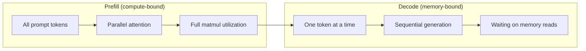
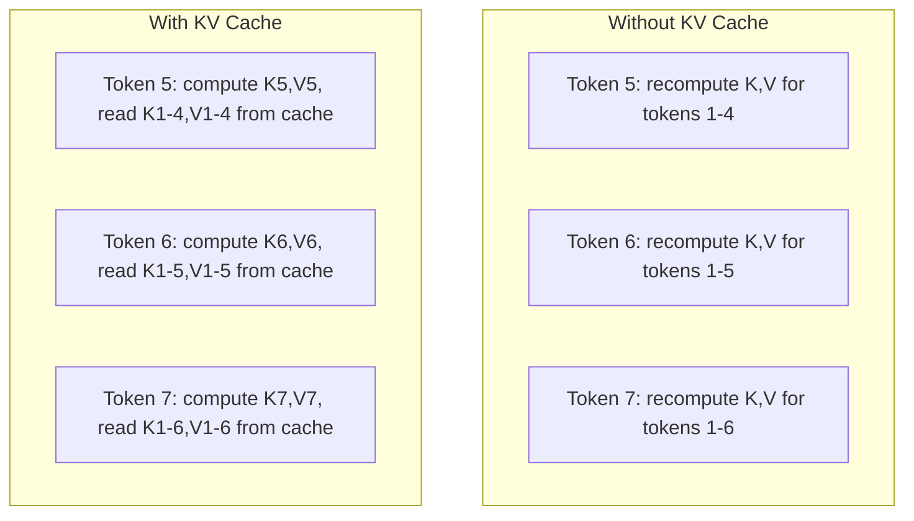
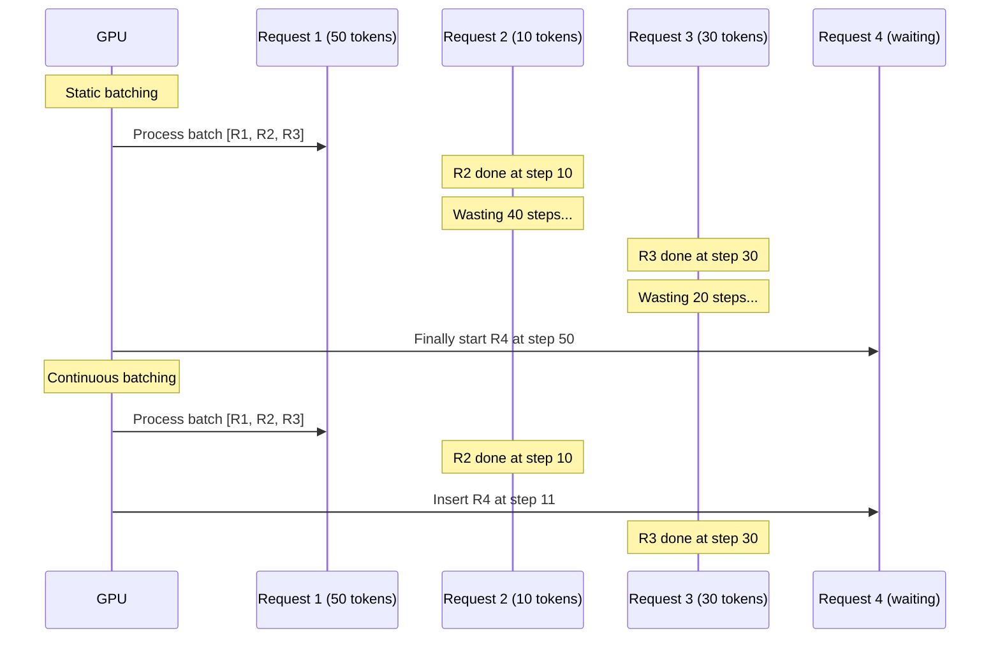
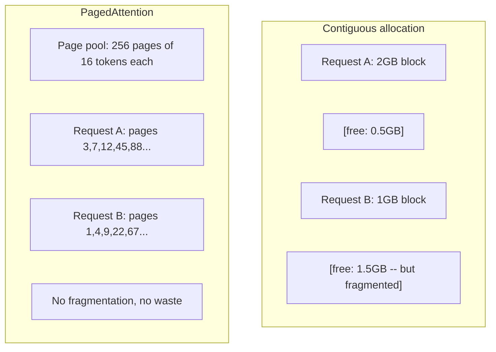
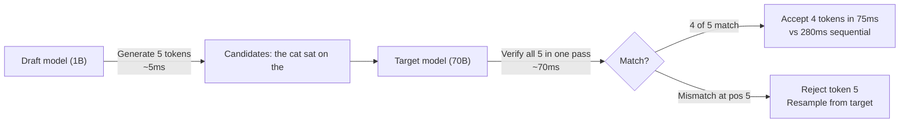

# 추론 최적화

> LLM 추론은 두 단계로 정의된다. 프리필(Prefill)은 프롬프트를 병렬로 처리 — 연산-제한. 디코드(Decode)는 한 번에 하나의 토큰을 생성 — 메모리-제한. 모든 최적화는 하나 또는 둘 다를 대상으로 한다.

**Type:** 구축
**Languages:** Python
**Prerequisites:** Phase 10, Lessons 01-08 (트랜스포머 아키텍처, 어텐션)
**Time:** ~120분

## 학습 목표

- KV-캐시를 구현하여 자동회귀 토큰 생성 중 중복 계산 제거
- LLM 추론의 프리필 vs 디코드 단계와 각각이 다른 병목(연산-제한 vs 메모리-제한)을 가지는 이유 설명
- 동시 요청 하에서 GPU 활용도를 최대화하기 위한 연속 배치 및 PagedAttention 개념 구현
- 추론 최적화 기법(KV-캐시, 추측 디코딩, 플래시 어텐션) 및 처리량/지연 시간 트레이드오프 비교

## 문제

4xA100 GPU에 Llama 3 70B를 배포한다. 단일 사용자는 초당 ~50 토큰을 얻는다. 빠르게 느껴진다. 그런 다음 100명의 사용자가 동시에 엔드포인트에 도달한다. 처리량이 사용자당 3 토큰/초로 떨어진다. 월 $25,000의 GPU 비용이 인간이 입력하는 속도보다 느린 응답을 서빙하고 있다.

모델 자체는 1명 사용자와 100명 사용자 사이에서 변하지 않는다. 동일한 가중치, 동일한 아키텍처, 동일한 수학. 변화하는 것은 작업을 스케줄링하는 방법이다. 순진한 추론은 사용 가능한 GPU 연산의 90%+를 낭비한다. 토큰 47을 기다리는 사용자는 matmul 사이에 GPU 메모리 버스가 유휴 상태로 있는 동안 전체 배치 슬롯을 열고 있다. 한편, 새 사용자의 2,000-토큰 프롬프트는 그 죽은 시간을 유용한 연산으로 채울 수 있다.

이것은 스케일링 문제가 아니다. 스케줄링 문제이다. 이 레슨의 기법들 — KV 캐싱, 연속 배치, PagedAttention, 추측 디코딩, 프리픽스 캐싱 — 은 월 $25k의 추론 비용과 동일한 트래픽을 서빙하는 월 $5k의 추론 비용을 가르는 요소이다.

vLLM이 4xA100-80GB에서 Llama 3 70B를 서빙할 때 저동시성에서 사용자당 ~50 토큰/초를 달성하고, 연속 배치 및 PagedAttention을 통해 100개 동시 요청에서 사용자당 15-25 TPS를 유지한다. 이러한 최적화 없이 동일한 하드웨어는 그 동시성에서 사용자당 5 TPS를 서빙한다. 동일한 GPU, 동일한 모델, 4배 처리량.

## 개념

### 프리필 vs 디코드

모든 LLM 추론 요청은 두 가지 뚜렷한 단계를 가진다.

**프리필(Prefill)** 은 전체 입력 프롬프트를 처리한다. 모든 토큰이 알려져 있으므로, 어텐션은 전체 시퀀스에 걸쳐 병렬로 계산될 수 있다. 이는 큰 행렬 곱셈 — GPU 코어가 바쁘게 유지된다. 병목은 연산: 하드웨어가 초당 전달할 수 있는 FLOPS 수. A100은 312 TFLOPS(BF16)를 제공. 70B 모델에서 4,096-토큰 프롬프트의 프리필은 단일 A100에서 ~400ms가 걸린다.

**디코드(Decode)** 는 한 번에 하나씩 출력 토큰을 생성한다. 각 새 토큰은 모든 이전 토큰에 주목하지만, 순방향 패스당 하나의 토큰만 생성된다. 가중치 행렬은 프리필과 동일한 크기이지만, 행렬 대신 단일 벡터와 곱해진다. GPU 코어는 마이크로초 만에 완료된 다음, 메모리에서 다음 배치의 가중치가 도착할 때까지 기다린다. 병목은 메모리 대역폭: HBM에서 계산 유닛으로 모델 가중치를 얼마나 빨리 스트리밍할 수 있는지. A100은 2 TB/s 대역폭을 가진다. FP16의 70B 모델은 140 GB. 전체 모델을 한 번 읽는 데 70ms가 걸린다 — 이것이 단일 디코드 단계의 바닥이다.



**ops:byte 비율**(산술 강도라고도 함)은 이 트레이드오프를 포착. 메모리에서 로드된 바이트당 수행하는 연산 수를 측정.

```
ops:byte ratio = FLOPs per token / bytes read from memory
```

4,096 토큰 배치의 프리필 중에는 로드된 가중치당 ~4,096번의 곱셈-누적 연산을 수행. 비율이 높음 — 연산-제한. 배치 크기 1의 디코드 중에는 로드된 가중치당 ~1번의 연산을 수행. 비율이 낮음 — 메모리-제한.

핵심 통찰: *디코드는 단일 토큰을 생성하기 위해 전체 모델을 읽기 때문에 메모리-제한이다*. 아래의 모든 최적화는 읽는 것을 줄이거나, 읽기당 처리되는 토큰 배치를 늘리거나, 읽기를 완전히 피한다.

### KV 캐시

어텐션 중, 각 토큰의 쿼리는 모든 이전 토큰의 키와 값 벡터에 주목한다. 캐싱 없이, 토큰 N을 생성하려면 N-1개의 이전 토큰에 대한 키와 값 투영을 재계산해야 한다. 토큰 1은 토큰 2를 생성할 때 투영되고, 다시 토큰 3을 위해, 다시 토큰 4를 위해. 토큰 1,000까지, 토큰 1을 총 999번 투영한 것이다.

KV 캐시는 모든 이전 토큰의 키와 값 투영을 저장한다. 토큰 N을 생성할 때, 토큰 N에 대한 키와 값만 계산한 다음, 1부터 N-1까지의 캐시된 K/V와 연결한다.



**KV 캐시 메모리 공식:**

```
KV cache size = 2 * num_layers * num_kv_heads * head_dim * seq_len * bytes_per_param
```

Llama 3 70B (80 layers, 8 KV heads with GQA, head_dim=128, BF16):

```
per token: 2 * 80 * 8 * 128 * 2 bytes = 327,680 bytes = 320 KB
at 4,096 tokens: 320 KB * 4,096 = 1.28 GB
at 128K tokens: 320 KB * 131,072 = 40 GB
```

Llama 3 70B에 대한 단일 128K-컨텍스트 대화는 40 GB의 KV 캐시를 소비 — A100 메모리의 절반. 각각 4K 토큰에서 100명의 동시 사용자와 함께, KV 캐시만 128 GB 필요. 이것이 KV 캐시 관리가 추론 최적화의 핵심 과제인 이유.

### 연속 배치 (Continuous Batching)

정적 배치는 N개의 요청 배치가 도착할 때까지 기다렸다가 함께 처리하고, *모든* 요청이 완료될 때까지 새 요청을 받지 않는다. 한 요청이 500 토큰이 필요하고 다른 요청이 10 토큰이 필요하면, 짧은 요청은 완료 후 490 디코드 단계 동안 유휴 상태로 앉아 있다.

연속 배치(반복-수준 배치라고도 함)는 요청이 완료되는 즉시 새 요청을 배치에 삽입한다. 배치는 매 디코드 단계마다 재평가된다. 10 토큰 후에 완료되는 요청은 즉시 대기 중인 요청으로 대체된다.



처리량 개선은 출력 길이가 얼마나 다양한지에 따라 달라진다. 균일한 길이에서는 연속 배치가 정적 배치와 일치한다. 가변 길이(일반적인 경우)에서는 GPU 슬롯이 절대 비어 있지 않기 때문에 연속 배치가 2-5배 더 높은 처리량을 제공할 수 있다.

### PagedAttention

각 요청에 대한 KV 캐시는 연속적인 메모리 블록이다. 요청이 도착하고 떠나면서 메모리가 단편화 — 운영 체제의 RAM 단편화와 정확히 동일. 4K-토큰 요청은 1.28 GB 연속이 필요. 총 2 GB가 여유 있더라도 1.28 GB *연속*이 없을 수 있다. 메모리를 낭비하거나 요청을 거부한다.

PagedAttention(vLLM에서 제공)은 OS-스타일 가상 메모리를 KV 캐시에 적용. 요청당 하나의 연속 블록을 할당하는 대신, 고정 크기 "페이지"(일반적으로 각각 16 토큰)를 할당. 페이지는 GPU 물리 메모리 어디에나 있을 수 있음. 페이지 테이블이 각 요청의 논리적 시퀀스 위치를 물리적 페이지 위치에 매핑.



PagedAttention은 공유 프리픽스에 대한 **기록-중-복사(copy-on-write)** 도 가능하게 한다. 50개의 요청이 동일한 시스템 프롬프트를 공유하면, 해당 시스템 프롬프트의 KV 캐시 페이지는 한 번 저장되고 50개 요청 모두에 의해 참조된다. 요청이 분기(다른 사용자 메시지)될 때만 자체 페이지를 얻는다. 이는 공유 시스템 프롬프트가 있는 애플리케이션에서 메모리 사용량을 극적으로 줄인다.

vLLM은 PagedAttention을 통해 거의 제로에 가까운 메모리 낭비(~4% vs 순진한 할당의 ~60-80%)를 보고한다.

### 추측 디코딩 (Speculative Decoding)

디코드는 순차적이기 때문에 느리다 — 하나의 토큰을 생성하고, 다시 피드하고, 다음 것을 생성한다. 하지만 다음 5개 토큰을 저렴하게 추측한 다음 모두 한 번에 검증할 수 있다면?

추측 디코딩은 작고 빠른 **드래프트 모델**을 사용하여 K개의 후보 토큰을 생성한다. 그런 다음 큰 **타겟 모델**이 모든 K개 후보를 단일 순방향 패스(프리필처럼 보임 — 병렬, 연산-제한, 효율적)에서 처리한다. 타겟 모델이 드래프트 모델의 예측과 일치하면, 하나의 타겟 순방향 패스 시간에 모든 K개 토큰을 수락한다. 위치 j에서 불일치하면, 1부터 j-1까지의 토큰을 수락하고 나머지는 폐기한다.



속도 향상은 **수락률(acceptance rate)** 에 따라 달라진다 — 드래프트 모델의 예측이 타겟과 얼마나 자주 일치하는지. Llama 3 70B를 위해 드래프팅하는 Llama 3 8B의 경우, 자연어에서 70-85%의 수락률이 일반적. 이는 2-3배 디코드 속도 향상으로 이어진다.

추측 디코딩에 대한 세 가지 접근 방식:

| 방법 | 드래프트 소스 | 수락률 | 오버헤드 |
|--------|-------------|----------|----------|
| Draft-target (Leviathan et al.) | 별도의 작은 모델 | 70-85% | 드래프트 모델 메모리 |
| EAGLE (Li et al.) | 타겟의 경량 헤드 | 75-90% | ~1% 추가 파라미터 |
| N-gram lookup | 토큰 n-gram 테이블 | 40-60% | 무시할 만함 |

**EAGLE**는 타겟 모델의 은닉 상태 위에 작은 자동회귀 헤드를 훈련. 타겟 모델의 두 번째-마지막 레이어 특징을 사용하여 다음 토큰의 임베딩을 예측. 별도 모델의 표현이 아닌 타겟 모델 자체의 표현에서 작동하기 때문에 최소한의 추가 메모리로 더 높은 수락률을 달성. EAGLE-2는 컨텍스트에 따라 후보 수를 조정하는 동적 드래프트 트리를 추가.

**N-gram 추측 디코딩**은 현재 컨텍스트 또는 사전 구축된 말뭉치에서 n-gram 연속 테이블을 유지. 동일한 대화(반복 패턴, 코드, 구조화된 출력)에서 이전에 나타난 것과 드래프트가 일치하면, 제로 신경망 오버헤드로 실행. 평균 수락률은 낮지만 추측당 비용은 본질적으로 공짜.

추측 디코딩은 *수학적으로 정확(exact)* 하다 — 출력 분포는 타겟 모델의 분포와 동일하다. 근사가 아니다. 검증 단계는 모든 수락된 토큰이 타겟 모델이 할당했을 정확한 확률을 가지도록 보장한다.

### 프리픽스 캐싱 (Prefix Caching)

많은 요청이 동일한 프리픽스를 공유한다. 챗봇 시스템 프롬프트. RAG 컨텍스트 블록. 퓨샷 예제 세트. 프리픽스 캐싱 없이, 모든 요청은 이러한 공유 토큰에 대한 KV 캐시를 처음부터 재계산한다.

프리픽스 캐싱은 일반적인 프리픽스에 대한 KV 캐시를 저장하고 요청 간에 재사용한다. 알려진 프리픽스가 있는 새 요청이 도착하면, 시스템은 캐시된 KV 항목을 복사(또는 참조)하고 고유한 접미사에 대한 KV만 계산한다.

모든 요청에서 공유되는 2,000-토큰 시스템 프롬프트의 경우, 프리픽스 캐싱은 요청당 ~400ms의 프리필을 제거. 초당 100개 요청에서, 이는 초당 40초의 GPU 연산을 절약 — 하나 이상의 GPU 작업량.

SGLang의 RadixAttention은 토큰 내용별로 프리픽스를 인덱싱하는 radix tree(trie)로 프리픽스 캐싱을 구현. 저장된 프리픽스와 일치하는 모든 요청은 KV 캐시를 공짜로 얻음. 트리는 부분 프리픽스 일치를 가능하게 함 — 캐시된 항목과 2,000 프리픽스 토큰 중 1,500을 공유하면, 그 1,500을 재사용하고 500만 재계산.

### 추론 엔진

세 가지 엔진이 프로덕션 LLM 서빙을 지배:

| 엔진 | 주요 혁신 | 최적 대상 |
|--------|---------------|----------|
| vLLM | PagedAttention, 연속 배치 | 일반-목적 서빙, 최고 호환성 |
| SGLang | RadixAttention (프리픽스 캐싱), 구조화된 생성 | 다중-턴 챗봇, 제약된 디코딩 |
| TensorRT-LLM | NVIDIA 커널 퓨전, FP8 양자화 | NVIDIA 하드웨어에서 최대 단일 GPU 처리량 |

**vLLM**이 기본 시작점. 가장 넓은 범위의 모델을 지원하고, 모든 GPU 벤더(NVIDIA, AMD, Intel)에서 실행되며, PagedAttention + 연속 배치를 통해 강력한 처리량 달성. OpenAI-호환 API는 모든 OpenAI API 호출의 대체품으로 바로 사용할 수 있음.

**SGLang**은 vLLM과 동일한 기반 위에 구축되지만 RadixAttention for 프리픽스 캐싱 및 구조화된 LLM 프로그램을 위한 도메인-특화 언어를 추가. 워크로드에 다중-턴 대화, 도구 사용, 또는 제약된 디코딩(JSON 출력, 정규식-가이드 생성)이 포함되면, SGLang은 종종 프리픽스 재사용을 통해 vLLM보다 2-5배 더 나은 성능을 보임.

**TensorRT-LLM**은 모델을 최적화된 NVIDIA GPU 커널로 컴파일. 연산(어텐션 + 선형 + 활성화를 하나의 커널로)을 퓨전하고, H100 GPU에서 FP8을 사용하며, 프로덕션 배포를 위해 NVIDIA Triton Inference Server와 통합. NVIDIA 하드웨어에서 가장 높은 단일 GPU 처리량을 달성하지만 더 많은 설정이 필요하고 NVIDIA GPU에서만 작동.

Llama 3 70B (4xA100-80GB, BF16)의 실제 수치:

| 메트릭 | vLLM | SGLang | TensorRT-LLM |
|--------|------|--------|---------------|
| 처리량 (1 user) | ~50 TPS | ~55 TPS | ~65 TPS |
| 처리량 (100 users) | ~2,500 total TPS | ~3,200 total TPS | ~3,000 total TPS |
| 첫 토큰까지 시간 | ~400ms | ~300ms (prefix hit) | ~350ms |
| 최대 컨텍스트 | 128K | 128K | 128K |

### Ops:Byte 프레임워크

측정하지 않으면 최적화할 수 없다. ops:byte 비율은 연산-제한인지 메모리-제한인지 알려주며, 이는 어떤 최적화가 중요한지 결정.

```
Compute roof: peak FLOPS of the GPU
Memory roof:  peak bandwidth * ops:byte ratio
```

ops:byte가 낮을 때(디코드, 작은 배치), 메모리 대역폭 천장에 도달. 더 많은 연산(더 높은 클록, 더 많은 코어)을 추가해도 도움이 되지 않음. 메모리 읽기를 줄이거(양자화, KV 캐시 압축)나 배치 크기를 늘려 더 유용한 작업에 읽기를 분할해야 함.

ops:byte가 높을 때(프리필, 큰 배치), 연산 천장에 도달. 메모리 대역폭 최적화는 도움이 되지 않음. 더 빠른 GPU, 커널 퓨전, 또는 더 많은 FLOPS를 짜내기 위한 축소된 정밀도가 필요.

| 시나리오 | ops:byte | 제한 | 최적화 방법 |
|----------|----------|-------|---------------|
| Prefill, batch=1 | ~4,096 | 연산 | 커널 퓨전, FP8 |
| Decode, batch=1 | ~1 | 메모리 | 양자화, KV 압축 |
| Decode, batch=32 | ~32 | 메모리 | 더 큰 배치, 연속 배치 |
| Decode, batch=256 | ~256 | 전환 중 | 둘 다 중요 |
| Decode, batch=1024 | ~1,024 | 연산 | 커널 퓨전, 텐서 병렬 |

A100의 교차점은 ops:byte = 156 (312 TFLOPS / 2 TB/s) 부근. 156 아래에서는 메모리-제한. 156 위에서는 연산-제한. 연속 배치는 반복당 더 많은 토큰을 패킹하여 디코드를 이 교차점 쪽으로 밀어붙임.

## 직접 구현하기

### 단계 1: KV 캐시를 처음부터

레이어별, 헤드별로 키와 값 투영을 저장하고 메모리 증가 패턴을 보여주는 다중-헤드 KV 캐시 구축.

```python
import numpy as np

class KVCache:
    def __init__(self, num_layers, num_heads, head_dim, max_seq_len, dtype=np.float16):
        self.num_layers = num_layers
        self.num_heads = num_heads
        self.head_dim = head_dim
        self.max_seq_len = max_seq_len
        self.dtype = dtype

        self.k_cache = np.zeros(
            (num_layers, num_heads, max_seq_len, head_dim), dtype=dtype
        )
        self.v_cache = np.zeros(
            (num_layers, num_heads, max_seq_len, head_dim), dtype=dtype
        )
        self.seq_len = 0

    def update(self, layer_idx, new_keys, new_values):
        num_new = new_keys.shape[1]
        end = self.seq_len + num_new
        self.k_cache[layer_idx, :, self.seq_len:end, :] = new_keys
        self.v_cache[layer_idx, :, self.seq_len:end, :] = new_values
        return (
            self.k_cache[layer_idx, :, :end, :],
            self.v_cache[layer_idx, :, :end, :]
        )

    def advance(self, num_tokens):
        self.seq_len += num_tokens

    def memory_bytes(self):
        return self.k_cache.nbytes + self.v_cache.nbytes

    def used_bytes(self):
        per_token = 2 * self.num_layers * self.num_heads * self.head_dim * np.dtype(self.dtype).itemsize
        return per_token * self.seq_len
```

### 단계 2: KV 캐시를 사용한 어텐션

디코드 단계를 위해 KV 캐시를 사용하는 단순화된 다중-헤드 어텐션.

```python
def scaled_dot_product_attention(query, keys, values):
    head_dim = query.shape[-1]
    scores = np.matmul(query, keys.transpose(0, 1, 3, 2)) / np.sqrt(head_dim)
    seq_len_q = scores.shape[-2]
    seq_len_k = scores.shape[-1]
    if seq_len_q > 1:
        mask = np.triu(np.ones((seq_len_q, seq_len_k), dtype=np.float32), k=seq_len_k - seq_len_q + 1)
        scores = scores + mask * (-1e9)
    max_scores = np.max(scores, axis=-1, keepdims=True)
    exp_scores = np.exp(scores - max_scores)
    attn_weights = exp_scores / np.sum(exp_scores, axis=-1, keepdims=True)
    return np.matmul(attn_weights, values)


class MultiHeadAttention:
    def __init__(self, d_model, num_heads):
        self.num_heads = num_heads
        self.head_dim = d_model // num_heads
        scale = np.sqrt(2.0 / d_model)
        self.W_q = np.random.randn(d_model, d_model).astype(np.float32) * scale
        self.W_k = np.random.randn(d_model, d_model).astype(np.float32) * scale
        self.W_v = np.random.randn(d_model, d_model).astype(np.float32) * scale
        self.W_o = np.random.randn(d_model, d_model).astype(np.float32) * scale

    def forward(self, x, kv_cache=None, layer_idx=0):
        batch, seq_len, d_model = x.shape
        Q = np.matmul(x, self.W_q).reshape(batch, seq_len, self.num_heads, self.head_dim).transpose(0, 2, 1, 3)
        K = np.matmul(x, self.W_k).reshape(batch, seq_len, self.num_heads, self.head_dim).transpose(0, 2, 1, 3)
        V = np.matmul(x, self.W_v).reshape(batch, seq_len, self.num_heads, self.head_dim).transpose(0, 2, 1, 3)

        if kv_cache is not None:
            K_full, V_full = kv_cache.update(layer_idx, K[0], V[0])
            K = K_full[np.newaxis, :, :, :]
            V = V_full[np.newaxis, :, :, :]
            if seq_len == 1:
                kv_cache.advance(1)

        attn_out = scaled_dot_product_attention(Q, K, V)
        attn_out = attn_out.transpose(0, 2, 1, 3).reshape(batch, -1, d_model)
        return np.matmul(attn_out, self.W_o)
```

### 단계 3: 연속 배치 시뮬레이터

정적 배치와 연속 배치 간의 스케줄링 차이를 시뮬레이션.

```python
import heapq

class Request:
    def __init__(self, request_id, prompt_tokens, output_tokens, arrival_step):
        self.request_id = request_id
        self.prompt_tokens = prompt_tokens
        self.output_tokens = output_tokens
        self.arrival_step = arrival_step
        self.tokens_generated = 0
        self.start_step = None
        self.end_step = None

    def is_done(self):
        return self.tokens_generated >= self.output_tokens


def simulate_static_batching(requests, batch_size):
    step = 0
    completed = []
    queue = list(requests)
    queue.sort(key=lambda r: r.arrival_step)

    while queue:
        batch = []
        while queue and len(batch) < batch_size:
            r = queue.pop(0)
            r.start_step = max(step, r.arrival_step)
            batch.append(r)

        if batch:
            step = max(step, max(r.start_step for r in batch))
            max_output = max(r.output_tokens for r in batch)
            for r in batch:
                r.tokens_generated = r.output_tokens
                r.end_step = step + max_output
            step += max_output
            completed.extend(batch)

    return completed


def simulate_continuous_batching(requests, batch_size):
    step = 0
    completed = []
    queue = sorted(requests, key=lambda r: r.arrival_step)
    queue_idx = 0
    active = []
    waiting = []

    while queue_idx < len(queue) or active or waiting:
        while queue_idx < len(queue) and queue[queue_idx].arrival_step <= step:
            waiting.append(queue[queue_idx])
            queue_idx += 1

        while waiting and len(active) < batch_size:
            r = waiting.pop(0)
            r.start_step = step
            active.append(r)

        if not active:
            if waiting:
                step += 1
                continue
            elif queue_idx < len(queue):
                step = queue[queue_idx].arrival_step
                continue
            else:
                break

        for r in active:
            r.tokens_generated += 1

        done = [r for r in active if r.is_done()]
        for r in done:
            r.end_step = step + 1
            completed.append(r)
        active = [r for r in active if not r.is_done()]

        step += 1

    return completed
```

## 활용하기

vLLM 사용:

```python
from vllm import LLM, SamplingParams

llm = LLM(
    model="meta-llama/Llama-3-70B-Instruct",
    tensor_parallel_size=4,
    enable_prefix_caching=True,
    max_model_len=8192,
    gpu_memory_utilization=0.9,
)

params = SamplingParams(temperature=0.7, max_tokens=256)
outputs = llm.generate(["Explain inference optimization in one paragraph."], params)
```

SGLang for 프리픽스 캐싱 + 구조화된 출력:

```python
import sglang as sgl

@sgl.function
def classify(s, text):
    s += sgl.system("You are a classifier. Output JSON only.")
    s += sgl.user(f"Classify this text: {text}")
    s += sgl.assistant(sgl.gen("result", regex=r'\{"label": "(positive|negative|neutral)"\}'))

runtime = sgl.Runtime(model_path="meta-llama/Llama-3-70B-Instruct", tp_size=4)
sgl.set_default_backend(runtime)

results = classify.run_batch([
    {"text": "This product is amazing!"},
    {"text": "Terrible experience."},
    {"text": "It was okay I guess."},
])
```

TensorRT-LLM 사용:

```python
import tensorrt_llm
from tensorrt_llm.runtime import ModelRunner

runner = ModelRunner.from_dir("./llama-70b-trt-engine/", rank=0)

outputs = runner.generate(
    batch_input_ids=[tokenizer.encode("Explain KV caching.")],
    max_new_tokens=256,
    temperature=0.7,
)
```

## 결과물

이 레슨은 `outputs/skill-inference-optimization.md`를 생성 — LLM 추론 서빙 진단 및 최적화를 위한 스킬.

## 연습문제

1. KV 캐시 프로파일러를 수정하여 FP16 vs FP8 vs INT4 KV 캐시 양자화 비교. 4xA100-80GB에서 4K 컨텍스트의 Llama 3 70B에 대해 각각의 최대 동시 사용자 수 계산. INT4로의 KV 양자화는 대략 사용자 용량을 4배로 늘려야 함.

2. 연속 배치 시뮬레이터를 확장하여 GPU 활용도(단계당 채워진 배치 슬롯의 비율) 추적. 출력 길이가 파레토 분포(shape=1.5, scale=20)를 따르는 50개 요청으로 정적 및 연속 배치 모두에 대한 시간 경과 활용도 플롯. 연속 배치는 80% 이상의 활용도를 유지해야 함.

3. `num_kv_heads < num_query_heads`인 그룹화된-쿼리 어텐션(GQA) 버전의 KV 캐시 구현. Llama 3 70B는 64 쿼리 헤드지만 8 KV 헤드만 사용. 전체 다중-헤드 어텐션 대비 메모리 절약 계산(KV 캐시 크기 8배 감소).

4. LRU 제거를 사용하는 프리픽스 캐시 구축. max_entries를 500으로 설정하고 60%가 5개의 공통 프리픽스 중 하나를 공유하는 1,000개 요청 생성. 히트율 측정 및 무제한 캐시와 비교. 좋은 제거로 히트율이 55% 이상 유지되어야 함.

5. 추측 디코딩 시뮬레이터를 확장하여 트리 기반 추측(EAGLE-2 스타일) 구현. 단일 체인의 K 드래프트 토큰 대신, 후보 트리 생성(예: 3개 수준 각각에서 2개 분기 = 8개 리프 후보). 검증 라운드당 수락된 총 토큰을 선형 추측과 비교.

## 주요 용어

| 용어 | 사람들이 말하는 것 | 실제 의미 |
|------|----------------|----------------------|
| 프리필 (Prefill) | "프롬프트 처리" | 모든 입력 토큰에 대한 어텐션을 병렬로 계산 -- 전체 행렬 곱셈이 GPU 코어를 바쁘게 유지하므로 연산-제한 |
| 디코드 (Decode) | "토큰 생성" | 순방향 패스당 하나의 토큰 생성, 매번 전체 모델 가중치 읽기 -- 연산이 다음 가중치 도착 전에 완료되므로 메모리-제한 |
| KV 캐시 | "어텐션 상태 캐싱" | 모든 이전 토큰의 키와 값 투영을 저장하여 각 디코드 단계에서 재계산되지 않도록 함 -- 메모리와 연산 교환 |
| 연속 배치 | "동적 배치" | 요청이 완료되는 즉시 실행 중인 배치에 새 요청 삽입, 전체 배치를 기다리는 대신 매 디코드 반복에서 평가 |
| PagedAttention | "KV 캐시를 위한 가상 메모리" | 연속 블록 대신 고정 크기 페이지로 KV 캐시 할당, 메모리 단편화 제거 및 공유 프리픽스에 대한 기록-중-복사 가능 |
| 추측 디코딩 | "드래프트 및 검증" | 빠른 드래프트 모델을 사용하여 여러 토큰 제안, 단일 타겟 모델 순방향 패스에서 모두 검증 -- 수학적으로 정확, 2-3배 속도 향상 |
| EAGLE | "자기-추측 디코딩" | 타겟 모델 자체의 은닉 상태에 경량 헤드를 훈련하는 추측 디코딩 변형, 별도 드래프트 모델보다 높은 수락률 달성 |
| 프리픽스 캐싱 | "시스템 프롬프트 KV 재사용" | 일반적인 프리픽스(시스템 프롬프트, 퓨샷 예제)에 대한 계산된 KV 캐시 항목을 저장하고 요청 간 재사용하여 중복 프리필 건너뛰기 |
| Ops:byte 비율 | "산술 강도" | 메모리에서 읽은 바이트에 대한 연산 수의 비율 -- 워크로드가 연산-제한(높은 비율)인지 메모리-제한(낮은 비율)인지 결정 |
| 첫 토큰까지 시간 | "TTFT" | 요청 수신에서 첫 출력 토큰 생성까지의 지연 시간 -- 긴 프롬프트의 경우 프리필 시간에 의해 지배됨 |

## 추가 자료

- Kwon et al., "Efficient Memory Management for Large Language Model Serving with PagedAttention" (2023) -- 페이지드 KV 캐시 관리를 도입한 vLLM 논문, 현재 추론 서빙의 업계 표준
- Leviathan et al., "Fast Inference from Transformers via Speculative Decoding" (2023) -- 드래프트-검증 추측이 정확한 타겟 모델 분포를 생성하면서 2-3배 속도 향상을 달성함을 증명한 기초 논문
- Li et al., "EAGLE: Speculative Sampling Requires Rethinking Feature Uncertainty" (2024) -- 별도 드래프트 모델 대신 타겟 모델 자체의 특징에 헤드를 훈련하여 더 높은 수락률 달성
- Zheng et al., "SGLang: Efficient Execution of Structured Language Model Programs" (2024) -- 프리픽스 캐싱을 위한 RadixAttention 및 다중-호출 LLM 프로그램을 위한 프로그래밍 모델 도입
- Williams et al., "Roofline: An Insightful Visual Performance Model for Multicore Architectures" (2009) -- 연산 vs 메모리 병목에 대한 추론을 위한 ops:byte 프레임워크를 공식화한 원본 roofline 논문
