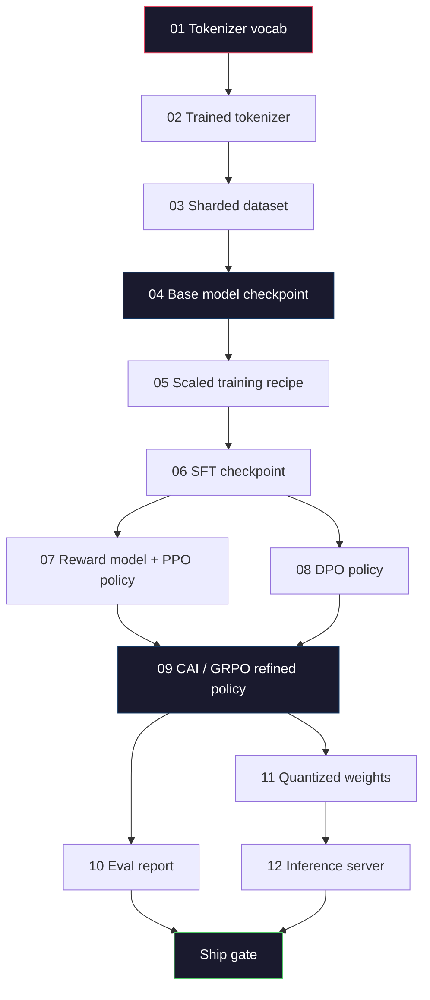
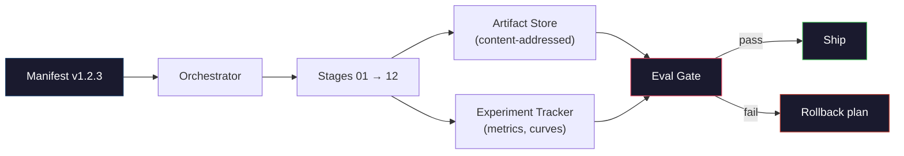

# 완전한 LLM 파이프라인 구축

> Lessons 01부터 12까지의 모든 것은 하나의 파이프라인의 한 단계이다. 이 레슨은 그 단계들을 하나의 종단간 실행으로 바꾸는 스캐폴드이다: 토크나이징, 사전훈련, 스케일링, SFT, 정렬, 평가, 양자화, 서빙. 노트북에서 70B 모델을 훈련하지는 않을 것이다. 2026년 프론티어 팀이 무엇을 출시할지 결정하는 데 사용하는 오케스트레이션 레이어, 매니페스트, 평가 게이트, 롤백 계획을 생산할 것이다. 이것이 캡스톤이다.

**Type:** 구축
**Languages:** Python (stdlib)
**Prerequisites:** 모든 Phase 10 lessons 01-12
**Time:** ~120분

## 학습 목표

- 이전 11개 레슨(토크나이저, 데이터, 사전훈련, 스케일링, SFT, RLHF, DPO, CAI, 평가, 양자화, 추론)을 단일 재현 가능한 파이프라인 스펙으로 구성
- 단계 간 아티팩트 계약 정의: 각 단계가 소비하는 것, 생산하는 것, 다음 단계가 입력을 어떻게 검증하는지
- 실험을 추적하고, 아티팩트를 해싱하고, 평가 임계값에 대한 출시 결정을 게이트하는 오케스트레이터 구축
- 롤백 계획 설계: 어떤 아티팩트가 재실행하기 저렴하고, 어떤 것이 비싸며, 손상된 체크포인트의 비용은 얼마인지

## 문제

이전 레슨들은 각각 작동한다. 토크나이저 훈련됨. Tiny GPT 사전훈련됨. SFT 데이터셋 조립됨. 보상 모델 훈련됨. DPO 실행됨. 평가 측정됨. 양자화된 가중치 내보내짐. 추론 서버 가동됨. 각각은 노트북이다. 각각은 고유한 규칙, 고유한 출력 경로, 고유한 시드를 가진다.

프론티어 훈련 실행은 노트북이 아니다. Llama 3 405B는 약 54일 동안 3천만 H100 시간이 걸렸다. DeepSeek-V3는 약 280만 H800 시간을 사용했다. 그 시간 동안 하나의 손상된 체크포인트, 하나의 데이터 오염, 하나의 평가 회귀가 팀에게 일주일의 벽시계와 한 달의 GPU 예산을 소모할 수 있다. 팀이 이를 견디는 방법은 파이프라인 위생을 통해서이다: 모든 단계는 결정론적 입력, 결정론적 출력, 매니페스트, 해시, 게이트를 가진다.

이것이 캡스톤이다. 노트북에서 파이프라인을 종단간 실행하지는 않을 것이다. 단계를 조정하는 오케스트레이터, 실행을 설명하는 매니페스트, 출시 결정을 게이트하는 검증기, 그리고 단일 파일에서 작업을 재실행할 수 있게 하는 재생 계획을 작성할 것이다. 코드는 작다; 규율은 크다.

패턴은 100M에서 1T 파라미터까지 변경 없이 확장된다. 동일한 네 가지 구성 요소 -- 매니페스트, 오케스트레이터, 평가 게이트, 아티팩트 저장소 -- 가 Llama 3를 실행하고 또한 당신의 취미 GPT를 실행한다. 차이는 각 단계의 설정 내부 숫자의 크기이지, 파이프라인의 형태가 아니다.

## 개념

### 12개 단계

모든 Phase 10 레슨은 하나의 단계이다. 전체 의존성 그래프는 다음과 같다.



07단계와 08단계는 병렬로 실행될 수 있다. 그 외 모든 것은 하드 의존성이다. 02단계(토크나이저)의 변경은 모든 다운스트림 아티팩트를 무효화한다. 10단계(평가)의 변경은 출시 결정만 무효화한다.

### 매니페스트

매니페스트는 실행을 완전히 재생할 수 있을 만큼 충분히 설명하는 단일 파일이다. 파이프라인이 생산하는 어떤 것도 매니페스트에 없는 상태에 의존해서는 안 된다. 필드는 지루하고 필수적이다.

```
pipeline_version: 1.2.3
seed: 42
git_commit: a1b2c3d4
stages:
  01_tokenizer:
    recipe: bpe_32k
    input_hash: sha256:...
    output_hash: sha256:...
    wall_clock_sec: 3600
    cost_usd: 12
```

N단계의 출력 해시는 N+1단계의 입력 해시이다. 어떤 이탈이든 파이프라인이 중단된다. 이것이 데이터 손상을 조기에 잡는 방법이다. 또한 다른 대륙의 팀원이 자신의 재생이 당신의 것과 동일한 아티팩트를 생산했는지 검증하는 방법이다.

실제로 팀은 작은 YAML 스키마와 이전 성공한 실행과의 차이를 비교하는 매니페스트 검사기를 사용한다. 예상 필드(비용, 벽시계) 외부의 모든 델타는 위험 신호이다.

### 아티팩트 타이핑

각 단계의 출력은 타입이 있는 아티팩트이다. 디렉토리 블롭이 아니라, pickle이 아니라, 알려진 스키마를 가진 명명된 타입이다.

| 단계 | 아티팩트 타입 | 주요 필드 |
|-------|--------------|-----------|
| 01-02 | Tokenizer | vocab.json, merges.txt, config.json, hash |
| 03 | Dataset | shards[], 행 수, 토큰 수, 중복 제거 통계 |
| 04-05 | Checkpoint | weights.safetensors, config.json, 옵티마이저 상태, 단계 수 |
| 06 | SFT Model | 체크포인트 + SFT 레시피 + 데이터 혼합 |
| 07 | Reward Model | RM 체크포인트 + 선호도 데이터 해시 |
| 08-09 | Policy | 체크포인트 + 참조 해시 + beta + 소비된 KL 예산 |
| 10 | Eval Report | 벤치마크 점수 + 회귀 차이 + 평가 데이터 해시 |
| 11 | Quantized Model | 양자화된 가중치 + 보정 데이터 + FP16 대비 정확도 델타 |
| 12 | Server Spec | 엔드포인트 + 모델 해시 + 설정 + 관측 가능성 훅 |

타이핑은 가장 일반적인 실패 모드를 방지한다: 08단계 출력을 06단계 입력으로 사용, SFT 경로를 통해 DPO-훈련된 모델 출시. 타입이 있는 아티팩트와 타입이 있는 단계 서명은 이러한 오류를 5일차 실패가 아닌 컴파일 시간 실패로 만든다.

### 평가 게이트

출시는 "훈련 완료"가 아니다. 출시는 "훈련 완료 및 평가 게이트 통과"이다. 게이트는 실행 시작 전에 정의된다.

```
gates:
  mmlu:      >= baseline + 0.5   # no regression
  humaneval: >= baseline + 1.0
  truthfulqa: >= baseline         # no drop
  safety_refusal_rate: <= 0.05
  kl_from_reference: <= 25.0
  cost_total_usd: <= 50000
```

모든 게이트는 숫자 임계값이다. "괜찮아 보임" 게이트는 없다. 주관적 사인오프는 없다. 모든 게이트가 통과하면 아티팩트는 출시 가능으로 표시된다. 어떤 게이트라도 실패하면, 실행은 명명된 검토자의 명시적 재정의를 보류하며, 그 자체가 매니페스트에 기록된다.

두 게이트가 대부분의 재앙을 잡는다. *회귀* 게이트(새 모델이 핵심 벤치마크에서 이전 모델만큼 좋아야 함)는 훈련 버그를 잡는다. *KL 예산* 게이트(정렬된 정책이 참조에서 X 이상 벗어나지 않아야 함)는 정렬 과잉을 잡는다. 모든 프로덕션 파이프라인에는 둘 다 있다.

### 오케스트레이터

매니페스트를 읽고, 단계를 디스패치하고, 아티팩트를 추적하고, 계약 위반 시 중단하는 작은 코드 조각. 이것은 Airflow가 아니다. Kubeflow가 아니다. 파이프라인 위생을 위해 직접 작성한 지루한 것을 원한다.

오케스트레이터의 작업은 좁다:

1. 매니페스트에서 DAG를 해결.
2. 각 단계에 대해, 예상 출력이 올바른 해시로 이미 존재하는지 확인(그렇다면 건너뛰기).
3. 단계 실행, stdout/stderr 캡처, 벽시계 및 비용 측정.
4. 출력 해시가 다운스트림 단계의 예상 입력 해시와 일치하는지 확인.
5. 실패 시, 정확한 실패 단계로 부분 매니페스트를 작성하고 0이 아닌 종료 코드로 종료.

그것은 200줄의 Python이다. 이 레슨의 `code/main.py` 파일처럼 보일 것이다. 내부적으로 실제 파이프라인은 클러스터에서 개별 단계를 실행하기 위해 `torchrun` 또는 `ray`를 사용하지만, 오케스트레이터 자체는 단일 박스에서 실행된다.

### 실험 추적 및 아티팩트 저장

두 개의 외부 시스템이 파이프라인을 고정한다.

**실험 추적기(wandb, neptune, mlflow).** 단계당 손실 곡선, 평가 메트릭, 시스템 원격 측정을 기록. 추적기는 3주 후에 실행 A와 실행 B를 비교해야 할 때 가는 곳이다. 팀은 거의 항상 호스팅된 추적기를 사용한다 -- 직접 작성하는 것은 훈련에 투자해야 할 시간을 잃게 한다.

**아티팩트 저장소(S3, R2, GCS).** 체크포인트, 데이터셋, 토크나이저, 평가 보고서를 위한 불변 객체 저장소. 아티팩트는 파일 이름이 아닌 해시로 주소 지정된다. `latest.pt`와 같은 파일 이름은 발-총(foot-gun)이다; `ckpt-7b-step-20000-sha256:abc123.safetensors`는 계약이다.

오케스트레이터는 둘 다에 쓴다. 추적기는 차트를 보는 인간을 위한 것이다. 아티팩트 저장소는 다음 단계가 입력을 찾기 위한 것이다.

### 비용 측정

프론티어 실행에는 달러 숫자가 붙어 있다. 예산 규율은 두 곳에서 발생한다.

**실행 전 추정.** 매니페스트에서 예상 FLOPs(사전훈련: 6 x params x tokens), 예상 GPU 시간(FLOPs / 피크 처리량 / 활용도), 현재 임대료로 달러 비용 계산. 추정치가 예산 게이트를 초과하면 파이프라인이 시작을 거부.

**실행 중 추적.** 단계별 벽시계 및 비용이 매니페스트에 기록. 각 단계 후, 남은 예산이 확인. 단계가 초과되면, 다음 단계의 게이트가 새 남은 예산으로 평가. VC가 전화할 때 돈이 바닥났음을 알게 되는 일은 없음.

Llama 3의 보고된 비용은 $61M였다. DeepSeek-V3는 주요 사전훈련 실행에 $5.6M를 보고했다. 비율은 주로 하드웨어 효율성과 mixture-of-experts 때문이다 -- 그러나 특정 비용이 보이는 이유는 두 팀 모두 실행별이 아닌 단계별로 추적했기 때문이다.

### 재현성 vs 결정론

이것들은 동일하지 않다. *재현 가능*은 동일한 매니페스트 + 동일한 코드 + 동일한 인프라가 동등한 다운스트림 메트릭을 가진 체크포인트를 생성함을 의미. *결정론적*은 비트-동일한 출력을 의미.

현대 LLM 훈련은 재현 가능하지만 결정론적이지는 않다. 분산 훈련의 리듀스 순서, GPU 커널 비결정론(cuBLAS, flash-attn), 혼합 정밀도 반올림이 결합되어 실행 간에 1e-5 수준에서 다른 부동소수점을 생성. 이는 움직이지 않는 최종 메트릭에는 괜찮다. 비트 수준 차이로 디버깅하려고 할 때 치명적이다. 해결책은 각 단계의 입력 해시, 출력 해시, 헤드라인 메트릭을 기록하는 것이다 -- 그것들이 일치하면, 가중치가 비트-동일하지 않더라도 실행이 "재현"된 것이다.



### 롤백 계획

실행이 시작되기 전에, 각 단계의 실패 시 어떻게 할지 적어 둔다. 세 가지 범주.

- **재실행 저렴** (몇 시간): 토크나이저, 평가, 양자화, 추론 서버. 그냥 재실행.
- **중간** (며칠): SFT, DPO, CAI. 베이스 모델 유지; 정렬 단계만 재실행.
- **비싼** (몇 주 및 수백만 달러): 사전훈련. 여기서 롤백 계획은 "재실행"이 아니다. "마지막 좋은 체크포인트를 사용하고 수정된 데이터로 더 저렴한 다운스트림 단계를 재실행."

단계 의존성이 타입이 있고 해시되므로, 오케스트레이터는 롤백 세트를 자동으로 계산할 수 있다: 실패한 단계와 모든 하위 항목을 무효화. 06단계(SFT)의 실패는 06, 07, 08, 09, 10, 11, 12를 무효화. 11단계(양자화)의 실패는 11과 12만 무효화. 이것을 미리 명명하면 팀이 새벽 4시에 지쳐 있을 때 즉흥적으로 대처하는 것을 피할 수 있다.

## 실제 구현

이 레슨의 코드는 오케스트레이터와 매니페스트 검사기이며, 12개 훈련 스크립트가 아니다. 각 단계는 올바른 모양과 해시로 출력 아티팩트를 생성하는 플레이스홀더로 시뮬레이션된다. 오케스트레이터를 종단간 실행하면 실제 GPU 예산을 태우기 전에 파이프라인의 배관이 작동함을 증명한다.

전체 구현은 `code/main.py` 참조. 주요 부분:

- `Manifest` 데이터클래스: 파이프라인 버전, 시드, git 커밋, 단계, 게이트.
- `Stage` 데이터클래스: 이름, 타입, 입력(해시), 출력(해시), 벽시계, 비용.
- `Orchestrator.run()`: DAG 해결, 단계 디스패치, 해시 검증, 매니페스트 업데이트.
- `EvalGate.check()`: 임계값 읽기, 최신 평가 보고서와 비교, 통과/실패 반환.
- `ArtifactStore` (인-메모리 스텁): 해시로 put/get, S3 시뮬레이션.
- `CostTracker`: 단계별 및 누적, 한도 초과 시 중단.

`main.py`의 파이프라인은 12개의 플레이스홀더 단계를 실행하고, 매니페스트를 생성하며, 실패한 평가 게이트를 실행하여 보류된 실행이 어떻게 보이는지 보여준다. 각 플레이스홀더를 해당 레슨의 실제 훈련 스크립트로 교체하면 실제 프론티어 파이프라인이 사용하는 스켈레톤을 얻는다.

## 활용하기

표준 워크플로에는 세 가지 명령이 있다.

```
python code/main.py plan    # 매니페스트 검증, 비용 추정 계산, DAG 출력
python code/main.py run     # 단계 실행, manifest.out.yaml에 쓰기
python code/main.py gate    # manifest.out.yaml 읽기, 평가 게이트 적용, 출시 또는 보류
```

매번 `plan`을 먼저 실행. 대부분의 파이프라인 버그는 계획 시간에 나타난다 -- 누락된 게이트 임계값, 오래된 해시, 예산 초과. `plan` 실행은 공짜. `run` 실행은 비싸다. 저렴한 쪽에서 버그를 잡아 비용을 절약.

`gate`의 출력은 `SHIP` 또는 `HOLD: <reason>`이다. 보류된 실행은 실패가 아니라 결정 지점이다. 명명된 검토자가 재정의하거나(재정의가 기록됨) 롤백을 승인한다.

## 결과물

이 레슨은 `outputs/skill-llm-pipeline-reviewer.md`를 생성. 제안된 파이프라인 매니페스트를 제공하면 모든 계약을 확인: 단계 타이핑, 해시 체인, 게이트, 롤백 계획, 비용 추정. 누락된 평가 게이트, 무제한 KL 예산, 또는 평가와 훈련 데이터가 혼합된 실행이 있는 매니페스트 승인을 거부.

## 연습문제

1. 07단계와 08단계의 병렬 실행을 지원하도록 오케스트레이터 확장. stdlib `concurrent.futures` 모듈 사용. 최종 매니페스트가 두 단계의 출력을 모두 기록하고 09단계의 입력 해시가 둘의 결정론적 조합인지 확인.

2. "오염 검사" 게이트 추가. 평가 데이터셋 해시와 훈련 데이터셋 샤드가 주어지면, 중복(정확 문자열 일치 또는 13-그램 일치) 계산. 중복이 0.1%를 초과하면 게이트 실패. 오염된 훈련 세트를 제공하고 게이트가 실행을 보류하는지 확인.

3. 첫 원칙에서 비용 추정기 구현. 04단계(사전훈련)의 경우, FLOPs를 6 x params x tokens로 추정, H100에서 40% MFU(model FLOPs utilization) 가정(989 TFLOPs BF16), $2.50/GPU-hour. 2T 토큰으로 훈련된 7B 모델에 대한 추정 보고. 게시된 Llama 2 수치와 비교.

4. 부분 롤백 구축. 09단계(CAI)에서 실패 시뮬레이션, 01-08을 캐시된 상태로 두고 09-12 단계 재실행. 오케스트레이터는 해시로 캐시된 아티팩트를 감지하고 건너뛰어야 함. 전체 재실행 대비 절약된 벽시계 측정.

5. 관측 가능성 추가. 각 단계에 대해 OpenTelemetry 스팬(속성: params, 본 토큰, 손실, 비용) 방출. 스팬을 로컬 수집기로 파이프. 요점은 대시보드가 아니다; 요점은 단일 추적 ID에서 모든 단계의 건강 상태를 추적할 수 있다는 것.

## 주요 용어

| 용어 | 사람들이 말하는 것 | 실제 의미 |
|------|----------------|----------------------|
| 매니페스트 (Manifest) | "레시피 파일" | 파이프라인 버전, 시드, 단계별 설정, 게이트 임계값을 설명하는 YAML 또는 JSON -- 실행 재생에 충분 |
| 콘텐츠-주소 지정 | "이름이 아닌 해시로" | 아티팩트를 내용의 SHA-256 해시로 저장, 버전 A와 버전 B를 혼동하는 일이 절대 없도록 |
| 평가 게이트 (Eval gate) | "출시 기준" | 아티팩트가 출시 가능으로 표시되기 전에 통과해야 하는 벤치마크 메트릭 및 안전 점수의 숫자 임계값 |
| KL 예산 | "정렬이 얼마나 벗어났는지" | 정렬 단계에 걸친 누적 KL(policy || reference)의 상한, 게이트로 시행 |
| MFU | "GPU를 얼마나 사용했는지" | Model FLOPs Utilization -- 달성된 FLOPs를 이론적 피크로 나눈 값. 70B 규모에서 40%, 7B에서 55%가 일반적 |
| 롤백 계획 | "고장 났을 때 하는 일" | 실패 시 단계별 미리 작성된 조치 세트: 재실행, 폴백, 수정된 입력으로 재훈련 |
| 오케스트레이터 | "지휘자" | 매니페스트를 읽고, 단계를 디스패치하고, 해시를 검증하고, 계약 위반 시 중단하는 프로세스 |
| 아티팩트 저장소 | "가중치를 위한 버전 관리된 S3" | 불변 콘텐츠-주소 객체 저장소 -- 체크포인트, 데이터셋, 평가 보고서의 단일 진실 공급원 |
| 재현 가능 | "재생 시 동일한 메트릭" | 다른 비트 수준 가중치지만 동등한 다운스트림 메트릭 -- 분산 LLM 훈련의 현실적 목표 |
| 비용 게이트 | "X를 초과할 수 없음" | 실행 전 비용 추정 + 실행 중 추적기 -- 추정치가 예산을 초과하면 파이프라인이 시작 거부 |

## 추가 자료

- [Dubey et al., 2024 -- "The Llama 3 Herd of Models"](https://arxiv.org/abs/2407.21783) -- 데이터, 훈련, 정렬, 평가를 포함한 프론티어 파이프라인의 가장 상세한 공개 설명
- [DeepSeek-AI, 2024 -- "DeepSeek-V3 Technical Report"](https://arxiv.org/abs/2412.19437) -- Llama 3 클래스 훈련 비용의 대략 1/10에서의 효율성 우선 파이프라인
- [Kaplan et al., 2020 -- "Scaling Laws for Neural Language Models"](https://arxiv.org/abs/2001.08361) -- 원본 연산-데이터-파라미터 스케일링 관계
- [Hoffmann et al., 2022 -- "Training Compute-Optimal Large Language Models (Chinchilla)"](https://arxiv.org/abs/2203.15556) -- 현대 데이터 예산을 재조정한 Kaplan의 수정
- [PyTorch FSDP2 documentation](https://pytorch.org/docs/stable/fsdp.html) -- PyTorch 2.4+에서 FSDP1을 대체하는 분산 훈련 프리미티브
- [Weights & Biases LLM Reports](https://wandb.ai/site/llms) -- 오픈소스 LLM 실행을 위한 실제 매니페스트 및 실험 추적기 출력, 표절 가능한 템플릿으로 유용
