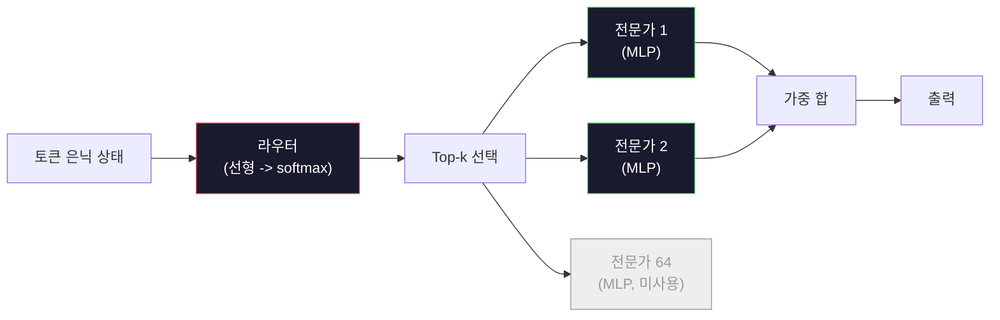

# 오픈 모델: 아키텍처 워크스루

> 04과에서 GPT-2 Small을 처음부터 직접 구축했습니다. 2026년의 프런티어 오픈 모델들은 동일한 패밀리에서 5~6개의 구체적인 변경만 가해진 것입니다. LayerNorm 대신 RMSNorm. GELU 대신 SwiGLU. 학습된 위치 인코딩 대신 RoPE. 전체 MHA 대신 GQA 또는 MLA. 대규모 Mixture-of-Experts. 여러분이 이미 알고 있는 수학으로 이들 모델의 95%를 설명할 수 있습니다. 이 과에서는 Llama 3, DeepSeek-V3, Mixtral, Qwen, Gemma를 나란히 분석하고 각 아키텍처가 분기되는 정확한 지점을 명명합니다.

**유형:** 학습
**언어:** Python (stdlib)
**사전 필요과목:** 10단계, 04, 05, 12과 (사전학습, 스케일링, 추론)
**시간:** ~45분

## 학습 목표

- Llama 3, Mistral, Mixtral, Gemma 2, Qwen 2.5, DeepSeek-V3의 config.json을 읽고 모든 필드를 설명할 수 있다
- 각 모델이 GPT-2 Small 대비 어떤 아키텍처 변경을 가했는지 명명하고 첫 원리로부터 정당화할 수 있다
- 설정(config)만 보고 임의의 오픈 모델의 파라미터 수, KV 캐시 크기, 활성화 메모리를 계산할 수 있다
- 지연 시간, 메모리, 성능 제약 조건이 주어졌을 때 배포 대상에 맞는 올바른 오픈 모델을 선택할 수 있다

## 문제

04과에서 여러분은 350줄의 numpy 코드로 GPT-2 형태의 모델을 작성했습니다. Llama 3 405B는 200페이지 분량의 기술 리포트가 있습니다. 직관적으로 이것들은 전혀 다른 존재라고 느껴집니다. 하지만 그렇지 않습니다. 200페이지는 동일한 객체에 대해 5~6개의 잘 동기 부여된 수정과 수천 개의 스케일링 구현 세부사항을 설명하고 있을 뿐입니다. 뼈대(임베딩, 트랜스포머 블록, 어텐션, MLP, 정규화, 헤드)는 변하지 않습니다.

이 과는 diff입니다. 주요 오픈 모델 패밀리별로 GPT-2에서 무엇이 변경되었는지, 그 이유와 비용을 정확히 나열합니다. 완료되면 새로운 모델 카드를 읽고 GPT-2 기준선으로 바로 사상할 수 있게 됩니다.

실용적인 이점은, Meta가 Llama 5를 출시하거나 DeepSeek이 V4를 출시할 때 새로운 정신 모델이 필요하지 않다는 것입니다. 설정을 보고 잘 알려진 노브 중 어떤 것이 움직였는지 확인하고, 하류 영향이 무엇인지 알게 됩니다. 2026년의 아키텍처는 유한한 도구 상자입니다. 각 새 모델은 다른 부분집합을 선택할 뿐입니다.

## 개념

### 불변 코어

모든 자기회귀형 오픈 모델이 공유하는 것:

- 토큰 임베딩 행렬 (vocab_size x hidden_dim).
- N개의 디코더 블록 스택: 정규화, 자기-어텐션, 잔차 연결, 정규화, MLP, 잔차 연결.
- 최종 정규화 및 vocab_size로 투영하는 선형 헤드 (종종 임베딩과 weight tying).
- 인과 마스크, 다음-토큰 교차 엔트로피 손실.

이것이 형태입니다. 나머지는 노브(knob)일 뿐입니다.

### 실제로 움직이는 여섯 가지 노브

2024-2026년 프런티어 오픈 모델 전반에서 동일한 여섯 가지 설계 선택이 반복해서 선택됩니다:

1. **정규화.** LayerNorm -> RMSNorm.
2. **위치 인코딩.** 학습된 절대 위치 -> RoPE (변형: YaRN, NTK).
3. **활성화 함수.** GELU -> SwiGLU (또는 GeGLU).
4. **어텐션 헤드 공유.** MHA -> GQA -> MQA -> MLA.
5. **밀집 vs 희소 MLP.** 밀집 -> Mixture-of-Experts.
6. **Pre-norm 배치.** Pre-norm 유지. Post-norm은 사라짐.

그 외 모든 것 (학습률 스케줄, 데이터 구성, 배치 크기, 컨텍스트 길이)은 아키텍처가 아닌 학습 설정에 속합니다. 여섯 개의 노브입니다.

### 노브 1: RMSNorm

LayerNorm은 평균을 빼고, 표준편차로 나누고, 스케일링하고, 시프트합니다. RMSNorm은 스케일만 유지합니다:

```
RMSNorm(x) = x / sqrt(mean(x^2) + eps) * gamma
```

평균 차감 없음. 편향 없음. 토큰당 행렬곱 하나가 줄었습니다. Zhang과 Sennrich(2019)는 기계 번역에서 LayerNorm과 성능이 동등하면서 10% 더 빠르다고 주장했습니다. 모든 현대 오픈 모델이 이를 사용합니다.

비용: 없음. 이점: 작은 처리량 향상, 더 간단한 코드.

### 노브 2: RoPE

GPT-2의 학습된 위치 임베딩은 1024개 슬롯의 룩업 테이블이었습니다. 컨텍스트 1025는 테이블 범위를 벗어납니다. 모델은 학습 길이를 넘어 extrapolate할 수 없습니다.

Rotary Position Embedding (RoPE, Su et al. 2021)은 어텐션 내적 전에 각 Q와 K 벡터를 쌍으로 회전시켜 위치를 주입합니다. 회전 각도는 위치의 결정론적 함수이므로, 학습할 것이 없고 소진될 일도 없습니다. 스케일링 트릭(NTK-aware interpolation, YaRN)을 사용하면 8k 컨텍스트로 학습된 모델이 추론 시 128k까지 약간의 정확도 손실로 늘릴 수 있습니다.

```
q_rotated = rotate(q, angle(pos))
k_rotated = rotate(k, angle(pos))
score = q_rotated . k_rotated
```

모든 Llama, Mistral, Qwen, DeepSeek, Gemma가 RoPE를 사용합니다. Gemma 2는 하이브리드(대부분의 층에서 RoPE, 일부 층에서 지역 슬라이딩 윈도우 어텐션)를 사용합니다.

### 노브 3: SwiGLU

GPT-2의 MLP는 `x -> gelu(xW1 + b1) -> (...)W2 + b2`입니다. SwiGLU (Shazeer 2020)은 활성화 함수를 게이트된 곱으로 대체합니다:

```
SwiGLU(x) = (xW1) * sigmoid(xW1) * xV
```

하나 대신 두 개의 병렬 투영을 Swish 활성화로 게이트합니다. 경험적으로 파라미터당 퍼플렉서티에서 더 강력합니다. Llama 2가 채택했고 모두가 따라했습니다. MLP의 은닉 크기는 보통 총 파라미터 수가 원래의 밀집 MLP와 일치하도록 설정됩니다: GPT-2가 `ff_dim = 4 * hidden`을 사용했다면, SwiGLU는 `ff_dim = (2/3) * 4 * hidden = 8/3 * hidden`을 사용합니다.

### 노브 4: 어텐션 헤드 공유

GPT-2는 **Multi-Head Attention (MHA)** 을 사용했습니다: 모든 헤드가 자체 Q, K, V 투영을 가집니다.

**Multi-Query Attention (MQA, Shazeer 2019)** 는 하나의 K와 하나의 V를 모든 헤드가 공유합니다. KV 캐시를 헤드 수만큼 줄이는데, 이는 일반적인 모델에서 12배에서 32배의 감소입니다. 어려운 벤치마크에서 정확도가 약간 떨어집니다.

**Grouped-Query Attention (GQA, Ainslie et al. 2023)** 은 중간 지점입니다: G개의 Q 헤드 그룹이 하나의 K와 V를 공유합니다. Llama 3 8B는 32개의 Q 헤드와 8개의 KV 헤드(G=8)로 GQA를 사용하므로, KV 캐시가 전체 MHA 대비 4배 줄어듭니다.

**Multi-Head Latent Attention (MLA, DeepSeek 2024)** 은 K와 V를 공유된 저랭크 잠재 변수로 압축하고, 헤드별로 다시 투영합니다. KV 캐시를 더 줄이면서도 헤드별 표현력을 유지합니다. DeepSeek-V2와 V3는 긴 컨텍스트 성능을 위해 이에 의존합니다.

| 방식   | KV 헤드  | KV 캐시        | 정확도   |
|--------|----------|----------------|----------|
| MHA    | num_heads | 전체           | 최고    |
| GQA    | num_groups (G < num_heads) | num_heads / G 감소 | MHA에 근접 |
| MQA    | 1        | num_heads 감소  | 약간 하락 |
| MLA    | 잠재, 헤드별 역압축 | MQA보다 작음 | MHA에 근접 |

약 13B 파라미터 이상의 모든 모델에서 GQA 또는 MLA는 사실상 필수입니다. 대규모에서 전체 MHA는 KV 캐시 재앙입니다.

### 노브 5: Mixture of Experts

밀집 MLP는 모든 토큰에 대해 모든 파라미터를 활성화합니다. MoE MLP는 블록당 K개의 전문가와 토큰별로 상위 k개 전문가(일반적으로 top-2)를 선택하는 라우터를 가집니다. 해당 전문가의 가중치만 해당 토큰에 대해 순전파를 수행합니다.

```
router_logits = xW_r
indices, weights = top_k(router_logits, k=2)
output = sum_i weights[i] * expert[indices[i]](x)
```

장점: 각각 7B 크기의 64개 전문가를 가질 수 있어 총 파라미터 수가 엄청나지만, 토큰당 2개만 실행하므로 토큰당 연산은 밀집 7B 모델과 일치합니다. Mixtral 8x7B는 총 47B 파라미터지만 토큰당 13B만 활성화합니다. DeepSeek-V3는 총 671B 파라미터지만 토큰당 37B만 활성화합니다.



장점: 동일한 연산, 더 많은 파라미터, 더 나은 용량. 단점: 전문가 메모리는 여전히 어딘가에 존재해야 하므로(서빙에 밀집 등가물보다 더 많은 VRAM이 필요함), 라우터의 부하 균형 맞추기가 어렵고, 정렬 중 라우터를 미세 조정하는 것은 별도의 연구 영역입니다.

### 노브 6: Pre-norm 유지

원래 트랜스포머는 각 하위층 이후에 층 정규화를 적용했습니다. GPT-2 이후 모든 오픈 모델은 각 하위층 *이전*에 정규화를 둡니다. Pre-norm은 깊은 층에서 훈련이 엄격히 더 쉽습니다. 논란의 여지가 없습니다.

### 모델별 Diff

다음은 이를 구체화하는 표입니다.

| 모델 | 연도 | 총 파라미터 | 활성 파라미터 | 정규화 | 활성화 함수 | 위치 | 어텐션 | MoE | 컨텍스트 |
|-------|------|-------------|---------------|------|-----------|----------|-----------|-----|---------|
| GPT-2 Small | 2019 | 124M | 124M | LayerNorm | GELU | 학습된 절대 | MHA (12 헤드) | 아니오 | 1k |
| Llama 3 8B | 2024 | 8B | 8B | RMSNorm | SwiGLU | RoPE | GQA (32/8) | 아니오 | 128k |
| Llama 3 70B | 2024 | 70B | 70B | RMSNorm | SwiGLU | RoPE | GQA (64/8) | 아니오 | 128k |
| Llama 3 405B | 2024 | 405B | 405B | RMSNorm | SwiGLU | RoPE | GQA (128/16) | 아니오 | 128k |
| Mistral 7B | 2023 | 7.2B | 7.2B | RMSNorm | SwiGLU | RoPE | GQA | 아니오 | 32k |
| Mixtral 8x7B | 2023 | 47B | 13B | RMSNorm | SwiGLU | RoPE | GQA | 예 (8 전문가, top-2) | 32k |
| Gemma 2 9B | 2024 | 9B | 9B | RMSNorm (pre+post) | GeGLU | RoPE + 슬라이딩 | GQA | 아니오 | 8k |
| Qwen 2.5 72B | 2024 | 72B | 72B | RMSNorm | SwiGLU | RoPE (YaRN) | GQA (64/8) | 아니오 | 128k |
| DeepSeek V2 236B | 2024 | 236B | 21B | RMSNorm | SwiGLU | RoPE | MLA | 예 (160 전문가, top-6) | 128k |
| DeepSeek V3 | 2024 | 671B | 37B | RMSNorm | SwiGLU | RoPE | MLA | 예 (256 전문가, top-8) | 128k |

열을 훑어보십시오. RMSNorm은 보편적입니다. SwiGLU 또는 그 사촌 GeGLU는 보편적입니다. RoPE는 보편적입니다. GQA는 7B 이상에서 MLA로 대체되는 경우를 제외하고 보편적입니다. MoE는 최상위 계층의 차별화 요소입니다.

### config.json 읽기

Llama 3 8B 설정:

```
{
  "hidden_size": 4096,
  "intermediate_size": 14336,
  "num_hidden_layers": 32,
  "num_attention_heads": 32,
  "num_key_value_heads": 8,
  "max_position_embeddings": 131072,
  "rope_theta": 500000.0,
  "rms_norm_eps": 1e-5,
  "vocab_size": 128256
}
```

모든 필드는 여러분이 이미 구현한 것과 대응됩니다.

- `hidden_size`: 임베딩 차원.
- `intermediate_size`: MLP 은닉 크기 (3.5x hidden -- SwiGLU 수학).
- `num_hidden_layers`: 스택 깊이.
- `num_attention_heads`: Q 헤드.
- `num_key_value_heads`: KV 헤드 (GQA).
- `max_position_embeddings`: 학습 컨텍스트 길이.
- `rope_theta`: RoPE 기본 주파수. Meta는 기본 10k에서 500k로 확장하여 긴 컨텍스트 extrapolation을 가능하게 했습니다.
- `rms_norm_eps`: 수치 안정성.
- `vocab_size`: 토큰 수.

이것들만으로 총 파라미터, KV 캐시, 최대 활성화 메모리를 계산할 수 있습니다. 정확한 공식은 `code/main.py`를 참조하세요.

### 활성화 메모리 예산

수십억 파라미터 이상에서는 활성화 메모리가 학습 메모리를 지배합니다. 사전학습(그래디언트 체크포인팅 사용)의 경험 법칙:

```
activation_mem ~ batch_size * seq_len * hidden_size * num_layers * bytes_per_element
```

Llama 3 8B의 경우 배치 1, 시퀀스 8192, BF16, 32개 층, 은닉 4096: 체크포인팅 사용 시 활성화 메모리는 약 8 GB, 사용하지 않으면 40 GB입니다. 이것이 flash-attention과 ring-attention이 중요한 이유입니다 -- 어텐션 계산을 재작성하여 활성화 메모리가 맞도록 합니다.

### KV 캐시 예산

최대 컨텍스트에서 추론 시:

```
kv_cache = 2 * num_layers * num_kv_heads * head_dim * max_seq_len * bytes_per_element
```

Llama 3 8B의 128k 컨텍스트, BF16, head_dim = hidden / num_heads = 128:
`2 * 32 * 8 * 128 * 131072 * 2 = 17.2 GB` (시퀀스당).

8B 가중치는 BF16에서 16 GB입니다. 단일 128k 시퀀스의 KV 캐시가 가중치보다 더 큽니다. 이것이 GQA, MLA, KV 캐시 양자화 연구를 추진하는 메모리 압박입니다.

### 각 모델이 언제 최적인가

- **단일 80GB GPU, MoE 없음**: Llama 3 8B, Mistral 7B, Gemma 2 9B. 서빙이 쉽고, 도구 지원이 풍부함.
- **단일 노드 (8x80GB), 큰 용량**: Llama 3 70B, Qwen 2.5 72B. 가장 높은 밀집 오픈 성능.
- **가장 큰 오픈 성능, MoE 복잡도 수용**: DeepSeek V3, Mixtral 8x22B. 활성 FLOP당 최고 성능.
- **긴 컨텍스트 필요**: Llama 3 (RoPE 스케일링으로 128k), DeepSeek (MLA 이점).
- **저지연 서빙**: Gemma 2 9B (슬라이딩 윈도우가 긴 컨텍스트 연산을 줄임).

## 직접 구현하기

이 과의 코드는 계산기입니다. 임의의 config.json이 주어지면 구성 요소별 파라미터 수, 최대 컨텍스트에서의 KV 캐시, SwiGLU MLP 비율, 그리고 아키텍처에 대한 간단한 판정(밀집 / GQA / MLA / MoE)을 출력합니다.

```python
config = {
    "hidden_size": 4096, "intermediate_size": 14336,
    "num_hidden_layers": 32, "num_attention_heads": 32,
    "num_key_value_heads": 8, "vocab_size": 128256,
    "max_position_embeddings": 131072,
}
```

스크립트는 아키텍처를 필드별로 탐색하며, 임베딩, 어텐션(GQA 감소 적용), MLP(SwiGLU 확장 적용), 층 정규화, 헤드의 파라미터 수를 계산합니다. 그런 다음 주어진 컨텍스트 길이에서 KV 캐시를 계산하고 요약을 출력합니다.

구현은 `code/main.py`를 참조하세요.

## 활용하기

스크립트에 번들된 Llama 3 8B, Mistral 7B, Mixtral 8x7B, DeepSeek V3 설정에 대해 계산기를 실행합니다. 파라미터 분석 결과를 비교합니다. MoE 모델은 총 파라미터 수가 밀집 모델을 압도하지만 활성 파라미터 수는 종종 더 작다는 점을 확인합니다. DeepSeek V3의 KV 캐시가 더 많은 총 파라미터를 가졌음에도 Llama 3 405B보다 작다는 점을 확인합니다 -- 이것이 MLA의 효과입니다.

그런 다음 로컬에 있는 모델의 설정을 입력하고 요약을 읽어 GPU에 맞는지 결정합니다.

## 배포하기

이 과는 `outputs/skill-open-model-picker.md`를 생성합니다. 배포 대상(GPU 종류, VRAM, 컨텍스트 길이, 지연 시간 예산)과 작업 프로필(채팅, 코드, 추론, 긴 컨텍스트)이 주어지면, 여섯 가지 아키텍처 노브에 대한 명시적 추론과 함께 오픈 모델, 11과의 양자화 방식, 12과의 추론 스택을 추천합니다.

## 연습 문제

1. HuggingFace에서 Qwen 2.5 72B 설정을 읽으십시오. 처음부터 총 파라미터를 계산하십시오. HF에 보고된 값과 비교하고 차이가 발생하는 원인(헤드 차원 반올림, KV 공유 계수 등)을 식별하십시오.

2. DeepSeek V3는 256개의 전문가와 top-8 라우팅을 사용합니다. 활성화된 전문가의 전체 대비 비율을 계산하고 Mixtral 8x7B의 top-2 of 8과 비교하십시오. 희소(25%)에서 더 조밀한 희소(3%)로의 변화가 FLOP당 용량에 대해 무엇을 의미합니까?

3. Llama 3 405B의 KV 캐시를 128k 컨텍스트에서 FP8과 BF16으로 각각 계산하십시오. FP8에서는 BF16의 절반입니다. 단일 8xH100 노드(각 80GB = 총 640GB, 가중치 메모리 제외)에서 몇 개의 병렬 시퀀스를 서빙할 수 있습니까?

4. Gemma 2는 전체-어텐션과 슬라이딩-윈도우-어텐션 층을 번갈아 사용합니다. 절반의 층이 전체 컨텍스트 대신 4096-토큰 슬라이딩 윈도우를 사용할 때 KV 캐시에 대한 수학을 작성하십시오. 총 8k 컨텍스트에서 얼마나 많은 메모리를 절약합니까?

5. 이 과가 작성된 후에 출시된 최신 프런티어 오픈 모델을 찾으십시오. 여섯 개의 노브 중 어떤 것을 선택했는지, 그리고 일곱 번째 노브를 도입했는지 식별하십시오. 새 아키텍처가 출시되는 순간 커리큘럼은 구식으로 느껴질 것입니다 -- 목표는 정신 모델을 재구축하지 않고 표를 업데이트하는 것입니다.

## 핵심 용어

| 용어 | 사람들이 말하는 것 | 실제 의미 |
|------|-------------------|-----------|
| RMSNorm | "평균 없는 LayerNorm" | 제곱평균제곱근만으로 정규화하고 학습된 스케일을 곱함 -- LayerNorm보다 저렴하고 성능은 비슷함 |
| RoPE | "회전 위치" | 각 Q와 K 벡터를 2D 쌍으로 위치에 따라 각도만큼 회전 -- 스케일링 트릭으로 학습 길이 이상으로 extrapolate 가능 |
| SwiGLU | "새로운 MLP 활성화 함수" | Swish를 사용한 게이트 선형 유닛: `(xW1) * sigmoid(xW1) * xV` -- 2024+ 모든 오픈 모델의 표준 |
| GQA | "중간 지점 어텐션" | Grouped-Query Attention: G개의 Q 헤드 그룹이 하나의 K와 V 헤드를 공유 -- MQA의 정확도 손실 없이 KV 캐시 축소 |
| MLA | "DeepSeek의 어텐션" | Multi-Head Latent Attention: K/V를 공유된 저랭크 잠재 변수로 압축하고 헤드별로 역압축 -- 대형 모델을 위한 가장 작은 KV 캐시 |
| MoE | "희소 전문가" | Mixture of Experts: 블록당 N개의 MLP, 라우터가 토큰당 상위 k개 선택 -- 총 파라미터는 크지만 활성 파라미터는 작음 |
| Top-k 라우팅 | "토큰당 k개 전문가 선택" | 라우터가 전문가별 점수를 계산하고 가장 높은 k개를 활성화 -- 일반적인 k는 2(Mixtral)에서 8(DeepSeek) |
| YaRN | "RoPE 확장" | Yet another RoPE extension -- 회전 각도를 보간하여 추론 시 컨텍스트를 8k에서 128k+로 확장 |
| 슬라이딩 윈도우 어텐션 | "모든 것에 주목하지 않음" | 각 토큰이 마지막 W개 토큰에만 주목 -- 토큰당 비용을 O(W)로 제한, Gemma 2와 초기 Mistral에서 사용 |
| 활성 파라미터 | "토큰당 실행되는 것" | MoE 모델의 경우 토큰당 순전파가 통과하는 파라미터 수(총 파라미터보다 훨씬 작음) -- 토큰당 FLOPs 결정 |

## 추가 자료

- [Dubey et al., 2024 -- "The Llama 3 Herd of Models"](https://arxiv.org/abs/2407.21783) -- 밀집 Llama 3 패밀리의 아키텍처 및 학습 참고 자료
- [DeepSeek-AI, 2024 -- "DeepSeek-V3 Technical Report"](https://arxiv.org/abs/2412.19437) -- MLA + auxiliary-loss-free 부하 균형 + 671B MoE
- [Jiang et al., 2024 -- "Mixtral of Experts"](https://arxiv.org/abs/2401.04088) -- 표준 MoE 오픈 모델 논문
- [Su et al., 2021 -- "RoFormer: Enhanced Transformer with Rotary Position Embedding"](https://arxiv.org/abs/2104.09864) -- RoPE 논문
- [Shazeer, 2020 -- "GLU Variants Improve Transformer"](https://arxiv.org/abs/2002.05202) -- SwiGLU, GeGLU 등
- [Ainslie et al., 2023 -- "GQA: Training Generalized Multi-Query Transformer Models"](https://arxiv.org/abs/2305.13245) -- GQA 논문
- [Gemma 2 Team, 2024 -- "Gemma 2: Improving Open Language Models at a Practical Size"](https://arxiv.org/abs/2408.00118) -- 하이브리드 전체+슬라이딩 어텐션, pre+post-norm
- [Qwen Team, 2024 -- "Qwen 2.5 Technical Report"](https://arxiv.org/abs/2412.15115) -- YaRN 컨텍스트 확장 및 긴 컨텍스트 학습 레시피
